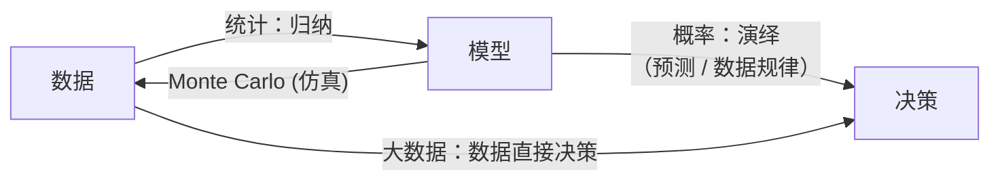

 <h1 id="第一讲-概率论与随机过程" style="text-align: center; margin-bottom: 2rem; border-bottom: none;">第一讲 概率论与随机过程</h1> 
 

  
  
  
 

## 1. 样本空间

### 1.1 用测度论来描述样本空间

在概率论中，样本空间 $\Omega$ 是随机试验所有可能结果组成的集合。然而，当 $\Omega$ 为不可数无限集（如实数区间）时，我们无法为每一个子集都赋予合理的概率值。测度论为此提供了严谨的数学框架。

**可测空间**：一个可测空间 $(\Omega, \mathcal{F})$ 由一个样本空间 $\Omega$ 和一个 $\sigma$‑代数 $\mathcal{F}$（满足特定性质的子集族）组成。$\mathcal{F}$ 中的元素称为**可测集**，即可以定义概率的事件。

**概率空间**：在可测空间上加上一个概率测度 $P: \mathcal{F} \to [0,1]$，满足：
- $P(\Omega)=1$，
- 对互不相交的可数集列 $\{A_i\}$，$P(\bigcup_i A_i) = \sum_i P(A_i)$（可数可加性）。

此时三元组 $(\Omega, \mathcal{F}, P)$ 称为概率空间。测度论保证了我们可以对复杂事件（如区间、波莱尔集）赋予概率，同时避免了“不可测集”带来的悖论。

### 1.2 事件的定义

**事件** 是样本空间 $\Omega$ 的一个子集，且属于 $\sigma$‑代数 $\mathcal{F}$。通俗地说，事件是我们可以问“是否发生”并有确定概率的随机现象的结果集合。

- **基本事件**：只包含一个样本点 $\{\omega\}$。
- **复合事件**：由多个基本事件通过集合运算构成。
- **必然事件**：$\Omega$ 本身。
- **不可能事件**：空集 $\varnothing$。

### 1.3 事件的集合

所有事件构成的 $\sigma$‑代数 $\mathcal{F}$ 必须满足：
1. $\Omega \in \mathcal{F}$；
2. 若 $A \in \mathcal{F}$，则其补集 $A^c = \Omega \setminus A \in \mathcal{F}$；
3. 若 $\{A_i\}_{i=1}^\infty \subset \mathcal{F}$，则 $\bigcup_{i=1}^\infty A_i \in \mathcal{F}$。

最常见的 $\sigma$‑代数是 **波莱尔 $\sigma$‑代数** $\mathcal{B}(\mathbb{R})$，由所有开区间生成的 $\sigma$‑代数，它包含了我们通常遇到的实数集上的事件（区间、点集等）。

### 1.4 事件的运算

事件之间可以进行集合运算，对应逻辑运算：
- **并集** $A \cup B$：事件 $A$ 或 $B$ 至少一个发生。
- **交集** $A \cap B$：事件 $A$ 与 $B$ 同时发生。
- **补集** $A^c$：事件 $A$ 不发生。
- **差集** $A \setminus B = A \cap B^c$：$A$ 发生而 $B$ 不发生。
- **对称差** $A \triangle B = (A\setminus B)\cup(B\setminus A)$：恰好一个发生。

这些运算满足交换律、结合律、分配律以及德摩根律：
$$
(A \cup B)^c = A^c \cap B^c, \qquad (A \cap B)^c = A^c \cup B^c.   \tag{1.1}$$

### 1.5 Bertrand 悖论

**Bertrand 悖论**（Bertrand's paradox）揭示了概率定义中对“等可能”假设的不同理解会导致不同的结果。考虑一个圆内随机弦的“长度大于圆内接等边三角形边长”的概率。有三种看似合理的等可能假设：

1. **按端点均匀分布**：在圆周上随机独立取两点连成弦。概率为 $1/3$。
2. **按半径上的中点均匀分布**：随机取一条半径，在该半径上均匀选一点作垂线得到弦。概率为 $1/2$。
3. **按弦中点均匀分布在圆内**：在圆内随机均匀选一点作为弦中点，弦方向任意。概率为 $1/4$。

**数学解释**：之所以出现不同结果，是因为“随机弦”没有唯一的几何概率定义。每次选取时，“等可能”的参照物（端点的角度、半径上的位置、圆内点的位置）不同，导致概率空间 $(\Omega,\mathcal{F},P)$ 不同。这警示我们：在构造概率模型时，必须明确指定样本空间和概率测度，而不能仅凭“随机”一词含混带过。Bertrand 悖论促进了概率论公理化体系的建立，最终由 Kolmogorov 用测度论统一。
## 2. 概率

### 2.1 概率的定义

概率是定义在概率空间 $(\Omega, \mathcal{F}, P)$ 上的一个函数，它为每个事件 $A \in \mathcal{F}$ 分配一个实数 $P(A)$，称为事件 $A$ 的概率。该函数必须满足以下三条公理（Kolmogorov 公理）：

1. **非负性**：$P(A) \ge 0$ 对所有 $A \in \mathcal{F}$ 成立。
2. **归一化**：$P(\Omega) = 1$。
3. **可数可加性**：若 $\{A_i\}_{i=1}^\infty$ 是 $\mathcal{F}$ 中互不相交的事件序列（即 $A_i \cap A_j = \varnothing$ 对 $i \neq j$），则 $$
   P\left( \bigcup_{i=1}^\infty A_i \right) = \sum_{i=1}^\infty P(A_i).   \tag{1.2}$$

直观上，概率度量了事件发生的可能性大小，其值在 $0$ 到 $1$ 之间。必然事件概率为 $1$，不可能事件概率为 $0$。

### 2.2 概率的计算

基于上述公理，可以推导出许多重要的概率性质，它们在实际计算中极为有用。

#### 2.2.1 概率的基本性质

- **空集概率**：$P(\varnothing) = 0$。
- **补集概率**：$P(A^c) = 1 - P(A)$。
- **有限可加性**：若 $A_1, A_2, \dots, A_n$ 两两互不相交，则 $P(\bigcup_{i=1}^n A_i) = \sum_{i=1}^n P(A_i)$。
- **单调性**：若 $A \subseteq B$，则 $P(A) \le P(B)$。
- **容斥原理**：对任意两个事件 $A, B$，
  $$
  P(A \cup B) = P(A) + P(B) - P(A \cap B).   \tag{1.3}$$
  对三个事件 $A, B, C$， $$
  \begin{aligned}
  P(A \cup B \cup C) =& P(A) + P(B) + P(C) - P(A\cap B) \\
&- P(A\cap C) - P(B\cap C) + P(A\cap B\cap C). 
  \end{aligned}  \tag{1.4}$$
  更一般地，对 $n$ 个事件，
  $$
  \begin{aligned}
  P\left( \bigcup_{i=1}^n A_i \right) =& \sum_{i=1}^n P(A_i) - \sum_{1\le i<j\le n} P(A_i\cap A_j) + \sum_{1\le i<j<k\le n} P(A_i\cap A_j\cap A_k) \\
&-\cdots + (-1)^{n-1} P(A_1\cap\cdots\cap A_n).   
  \end{aligned}
  \tag{1.5}$$

#### 2.2.2 容斥原理的应用：匹配问题（戴帽子问题）

**问题描述**：有 $n$ 个人参加聚会，每个人都将自己的帽子放在桌上。聚会结束时，每个人随机取一顶帽子。求以下两个事件的概率：

- $A$：每个人恰好拿到自己的帽子（全匹配）。
- $B$：没有人拿到自己的帽子（错排）。

**分析**：总共有 $n!$ 种等可能的取帽方式（全排列）。用 $E_i$ 表示“第 $i$ 个人拿到自己的帽子”这一事件。

**（1）计算 $P(A)$（全匹配）**  
全匹配即为事件 $E_1 \cap E_2 \cap \cdots \cap E_n$，只有一种排列（恒等排列）。因此 $$
P(A) = \frac{1}{n!}.   \tag{1.6}$$

**（2）计算 $P(B)$（错排）**  
错排指的是没有任何 $E_i$ 发生，即 $B = \bigcap_{i=1}^n E_i^c = \overline{\bigcup_{i=1}^n E_i}$。利用容斥原理：

首先，$P(E_i) = \frac{1}{n}$（固定第 $i$ 个人，其余 $n-1$ 人任意排列）。
对任意 $k$ 个不同的人 $i_1, \dots, i_k$，事件 $E_{i_1} \cap \cdots \cap E_{i_k}$ 表示这 $k$ 个人都拿到自己的帽子，其余 $n-k$ 人任意排列，概率为 $\frac{(n-k)!}{n!} = \frac{1}{n(n-1)\cdots(n-k+1)}$。

由容斥原理，
$$
P\left( \bigcup_{i=1}^n E_i \right) = \sum_{k=1}^n (-1)^{k-1} \sum_{1\le i_1<\cdots<i_k\le n} P(E_{i_1}\cap\cdots\cap E_{i_k}).   \tag{1.7}$$
共有 $\binom{n}{k}$ 个 $k$ 元组，每个概率为 $\frac{(n-k)!}{n!}$，所以 $$
P\left( \bigcup_{i=1}^n E_i \right) = \sum_{k=1}^n (-1)^{k-1} \binom{n}{k} \frac{(n-k)!}{n!} = \sum_{k=1}^n (-1)^{k-1} \frac{1}{k!}.   \tag{1.8}$$
于是错排概率为
$$
P(B) = 1 - P\left( \bigcup_{i=1}^n E_i \right) = 1 - \sum_{k=1}^n (-1)^{k-1} \frac{1}{k!} = \sum_{k=0}^n (-1)^k \frac{1}{k!}.   \tag{1.9}$$

当 $n$ 较大时，$P(B) \approx e^{-1} \approx 0.3679$。例如，$n=4$ 时： $$
P(B) = 1 - 1 + \frac{1}{2} - \frac{1}{6} + \frac{1}{24} = \frac{9}{24} = 0.375.   \tag{1.10}$$

**结论**：容斥原理在处理“至少一个”或“全不”事件时非常有效，匹配问题是其经典应用。该问题也展示了概率计算中组合计数与集合运算的结合。

## 3. 独立和不相关

### 3.1 独立性的定义

两个随机变量 $X$ 和 $Y$ 被称为**相互独立**，如果它们的联合分布函数等于边缘分布函数的乘积：
$$
F_{X,Y}(x,y) = F_X(x) F_Y(y), \quad \forall x,y.   \tag{1.11}$$
对于离散型随机变量，等价于联合概率质量函数满足 $p_{X,Y}(x,y) = p_X(x) p_Y(y)$。对于连续型随机变量，等价于联合概率密度函数满足 $f_{X,Y}(x,y) = f_X(x) f_Y(y)$。

独立性的一个重要推论是：对任意可测函数 $g$ 和 $h$，有 $$
\mathbb{E}[g(X)h(Y)] = \mathbb{E}[g(X)] \mathbb{E}[h(Y)],   \tag{1.12}$$
只要期望存在。

### 3.2 不相关的定义

两个随机变量 $X$ 和 $Y$ 被称为**不相关**，如果它们的协方差为零：
$$
\operatorname{Cov}(X,Y) = \mathbb{E}[(X - \mathbb{E}[X])(Y - \mathbb{E}[Y])] = 0.   \tag{1.13}$$
等价地，$\mathbb{E}[XY] = \mathbb{E}[X]\mathbb{E}[Y]$。

当 $X$ 和 $Y$ 的方差非零时，还可以定义**相关系数**： $$
\rho_{X,Y} = \frac{\operatorname{Cov}(X,Y)}{\sqrt{\operatorname{Var}(X)\operatorname{Var}(Y)}}.   \tag{1.14}$$
不相关等价于 $\rho_{X,Y} = 0$。

### 3.3 独立与不相关的关系

- **独立性 $\Rightarrow$ 不相关**：若 $X$ 和 $Y$ 独立，则 $\mathbb{E}[XY] = \mathbb{E}[X]\mathbb{E}[Y]$，因此协方差为零，即不相关。
- **不相关 $\not\Rightarrow$ 独立性**：不相关不能推出独立，除非 $X$ 和 $Y$ 服从联合高斯分布（此时不相关等价于独立）。

反例：设 $X \sim U[-1,1]$（均匀分布），$Y = X^2$。显然 $Y$ 完全由 $X$ 决定，因此不独立。但计算：
$$
\mathbb{E}[X] = 0,\quad \mathbb{E}[XY] = \mathbb{E}[X^3] = 0,\quad \mathbb{E}[X]\mathbb{E}[Y] = 0,   \tag{1.15}$$
所以 $\operatorname{Cov}(X,Y)=0$，即 $X$ 和 $Y$ 不相关。

### 3.4 零均值情况下的正交性与不相关

若 $\mathbb{E}[X] = \mathbb{E}[Y] = 0$，则协方差 $\operatorname{Cov}(X,Y) = \mathbb{E}[XY]$。此时不相关等价于 $\mathbb{E}[XY] = 0$，即 $X$ 和 $Y$ 在 Hilbert 空间（内积定义为 $\langle X,Y\rangle = \mathbb{E}[XY]$）中相互正交。因此，在零均值的前提下，“正交”与“不相关”是同一概念。

### 3.5 独立性、不相关与正交的层次关系

| 概念 | 条件 | 含义 |
|------|------|------|
| 独立 | $F_{X,Y}=F_X F_Y$ | 最强，完全没有任何依赖关系 |
| 不相关 | $\operatorname{Cov}=0$ | 仅排除线性依赖，可能存在非线性关系 |
| 正交（零均值下） | $\mathbb{E}[XY]=0$ | 等价于不相关 |

### 3.6 多个随机变量的情况

- 两两独立：任意两个随机变量独立。
- 两两不相关：任意两个随机变量协方差为零。
- 相互独立：所有随机变量的联合分布等于边缘分布的乘积，此时必然两两独立且两两不相关，但反之不成立（两两独立不能推出相互独立）。

**例子**：设 $X_1, X_2, X_3$ 为独立同分布的伯努利随机变量 $P(X_i=1)=P(X_i=0)=1/2$。定义 $Y_1 = X_1$，$Y_2 = X_2$，$Y_3 = X_1 \oplus X_2$（异或）。可以验证 $Y_1, Y_2, Y_3$ 两两独立，但不相互独立（因为 $Y_3$ 由 $Y_1,Y_2$ 完全决定）。两两独立显然意味着两两不相关。

### 3.7 总结

在实际问题中，独立是非常强的条件，而不相关只排除线性关系。在信号处理中，常假设噪声与信号不相关（而非独立），这已足够推导最优线性估计（如维纳滤波、卡尔曼滤波）。独立性则在贝叶斯推断或非线性处理中更为重要。理解三者之间的区别与联系，是掌握概率论与随机过程的基石。

## 4. 不独立，条件概率

当两个事件或随机变量不独立时，一个事件的发生会改变另一个事件发生的概率。条件概率正是描述这种依赖关系的数学工具。

### 4.1 条件概率的定义

对于两个事件 $A$ 和 $B$，且 $P(B) > 0$，事件 $A$ 在给定 $B$ 发生的条件下的概率定义为： $$
P(A \mid B) = \frac{P(A \cap B)}{P(B)}.   \tag{1.16}$$
直观上，这个公式把样本空间缩小到 $B$ 内部，并重新归一化概率，从而度量在 $B$ 已发生的条件下 $A$ 发生的可能性。

### 4.2 乘法公式（条件概率的链式法则）

由条件概率定义直接可得：
$$
P(A \cap B) = P(A \mid B) P(B) = P(B \mid A) P(A).   \tag{1.17}$$
对于多个事件，可以反复应用此规则得到链式法则： $$
P(A_1 \cap A_2 \cap \cdots \cap A_n) = P(A_1) P(A_2 \mid A_1) P(A_3 \mid A_1 \cap A_2) \cdots P(A_n \mid A_1 \cap \cdots \cap A_{n-1}).   \tag{1.18}$$

**例**：在一个班级中随机抽取学生，事件 $A$ 表示“学生是男生”，$B$ 表示“学生近视”。若已知男生占 $60\%$，男生中近视的比例为 $30\%$，则男生且近视的概率为 $P(A \cap B) = P(B\mid A)P(A) = 0.3 \times 0.6 = 0.18$。

### 4.3 全概率公式

设 $\{B_i\}_{i=1}^n$ 是样本空间的一个划分（即 $B_i$ 互不相交且 $\bigcup_i B_i = \Omega$，且 $P(B_i)>0$）。则对任意事件 $A$ 有：
$$
P(A) = \sum_{i=1}^n P(A \mid B_i) P(B_i).   \tag{1.19}$$
当划分是无穷可数时，公式依然成立。全概率公式将复杂事件 $A$ 的概率分解为在不同条件 $B_i$ 下的条件概率的加权平均。

**例**：有三个箱子，分别装有不同数量的红球和蓝球。随机选一个箱子，然后从箱中取球。求取出红球的概率，即是对每个箱子的条件概率乘以选该箱子的概率再求和。

### 4.4 贝叶斯公式

由乘法公式和全概率公式可得贝叶斯公式： $$
P(B_i \mid A) = \frac{P(A \mid B_i) P(B_i)}{\sum_{j=1}^n P(A \mid B_j) P(B_j)}.   \tag{1.20}$$
贝叶斯公式用于“逆概率”问题：已知结果 $A$，反推导致该结果的可能原因 $B_i$ 的概率。其中 $P(B_i)$ 称为先验概率，$P(B_i \mid A)$ 称为后验概率。

**例（医疗检测）**：设某种疾病的发病率为 $0.001$（先验概率）。检测试剂在患病者中检出阳性的概率为 $0.99$（灵敏度），在健康者中误报阳性的概率为 $0.05$（假阳性率）。若某人检测阳性，其真实患病的概率为：
$$
P(\text{病} \mid \text{阳}) = \frac{0.99 \times 0.001}{0.99\times 0.001 + 0.05\times 0.999} \approx 0.0194.   \tag{1.21}$$
即使检测阳性，患病概率仍然很低，这是因为疾病先验概率极低。

### 4.5 随机变量的条件分布与条件期望

对于随机变量 $X$ 和 $Y$，给定 $Y=y$ 时 $X$ 的条件分布定义为： $$
f_{X|Y}(x|y) = \frac{f_{X,Y}(x,y)}{f_Y(y)} \quad (\text{连续情形}), \qquad
p_{X|Y}(x|y) = \frac{p_{X,Y}(x,y)}{p_Y(y)} \quad (\text{离散情形}).   \tag{1.22}$$
条件期望 $\mathbb{E}[X \mid Y=y]$ 是关于 $x$ 的加权平均。进一步，$\mathbb{E}[X \mid Y]$ 是一个随机变量（是 $Y$ 的函数），它满足**重期望定律**（全期望公式）：
$$
\mathbb{E}[\mathbb{E}[X \mid Y]] = \mathbb{E}[X].   \tag{1.23}$$
对于事件，全概率公式是重期望定律的特例。

### 4.6 条件独立性

两个事件 $A$ 和 $B$ 在给定事件 $C$ 的条件下被称为**条件独立**，如果 $$
P(A \cap B \mid C) = P(A \mid C) P(B \mid C).   \tag{1.24}$$
类似地，随机变量 $X$ 和 $Y$ 在给定 $Z$ 条件下条件独立，如果其条件联合分布等于条件边缘分布的乘积：
$$
f_{X,Y|Z}(x,y|z) = f_{X|Z}(x|z) f_{Y|Z}(y|z), \quad \forall x,y,z.   \tag{1.25}$$
条件独立性在贝叶斯网络、隐马尔可夫模型和因果推断中至关重要。注意：独立不一定条件独立，条件独立也不一定独立。

**例子（朴素贝叶斯分类器）**：假设特征 $X_1,\dots,X_n$ 在给定类别 $C$ 条件下相互独立，即 $P(X_1,\dots,X_n \mid C) = \prod_i P(X_i \mid C)$。尽管原始特征可能高度相关，但条件独立性假设大大简化了模型，在实践中往往效果良好。

### 4.7 全概率公式的应用例子：排队拿帽子问题（正确解法）

为了正确运用全概率公式，我们重新分析“排队拿帽子”问题。规则回顾：有 $n$ 个人按顺序 $1,2,\dots,n$ 排队拿帽子。第一个人蒙眼随机拿一顶（等可能）。从第二个人开始，如果自己的帽子还在，就立刻拿自己的；否则在剩余帽子中随机拿一顶。问最后一个人（第 $n$ 人）拿到自己帽子的概率 $P_n$。

#### 4.7.1 正确的递推思路

考虑第一个人拿帽子的情况。设他拿的是第 $k$ 个人的帽子，$k = 1,2,\dots,n$，每种的先验概率为 $1/n$。接下来分析后续过程：

- 如果 $k = 1$（第一个人拿了自己的帽子），那么第 $2$ 到第 $n-1$ 个人都会依次拿走自己的帽子（因为自己的帽子都还在），最后一个人自然拿到自己的帽子。所以这种情况下，最后一个人成功的概率为 $1$。

- 如果 $k > 1$，则第一个人拿走了第 $k$ 个人的帽子。对于第 $2,3,\dots, k-1$ 个人（即排在 $k$ 之前的人），他们各自的帽子都还在桌上，因此每个人都会直接拿走自己的帽子。这些人的行为是确定的，不影响后续。当轮到第 $k$ 个人时，他发现自己的帽子已经被第一个人拿走了，此时桌上剩下的帽子是：除了已被拿走的第 $1$ 顶（第 $k$ 人的帽）和已被第 $2$ 到 $k-1$ 人取走的 $k-2$ 顶之外，还剩 $n - (k-1)$ 顶帽子。注意，这些剩下的帽子包括第 $1$ 人的帽子、第 $k+1$ 到第 $n$ 人的帽子，以及其他已被人拿走但未列出的？实际上需要仔细计数。

更简洁的经典结论是：从第 $k$ 个人开始，问题等价于一个规模为 $n-k+1$ 的相同问题。理由如下：当第 $1$ 个人拿走了第 $k$ 人的帽子后，第 $2$ 到 $k-1$ 人都顺利拿走自己的帽子离开。此时桌上剩余的帽子恰好是：第 $1$ 人的帽子，以及第 $k+1, k+2, \dots, n$ 人的帽子（共 $n-k+1$ 顶）。而接下来的人依次是第 $k, k+1, \dots, n$。第 $k$ 个人面临的情况：他自己的帽子已不在，他只能在剩余帽子中随机拿一顶；从第 $k+1$ 人开始，规则仍然是“如果自己的在就拿自己的，否则随机拿”。因此，这部分人的状态与原始问题完全类似，只是人数变为 $m = n-k+1$，并且第 $k$ 人相当于这个子问题中的“第一个人”，而最后一个人（原始的第 $n$ 人）就是这个子问题中的最后一个人。所以，子问题中最后一个人成功的概率正是 $P_{m}$，其中 $m = n-k+1$。

> **注意**：当 $k=n$ 时，子问题规模 $m = n-n+1 = 1$，此时只有第 $n$ 个人一人，他必然拿到剩下的唯一一顶帽子，但那是他自己的吗？第 $1$ 人拿走了第 $n$ 人的帽子，所以剩下的帽子中只有第 $1$ 人的帽子（因为第 $2$ 到 $n-1$ 人都拿走了自己的，剩下唯一一顶是第 $1$ 人的）。第 $n$ 人只能拿到第 $1$ 人的帽子，所以成功概率 $P_1 = 0$。这符合递推基础。

#### 4.7.2 建立递推关系

设 $P_n$ 为 $n$ 人情形下最后一人拿到自己帽子的概率。根据全概率公式： $$
P_n = \sum_{k=1}^n \frac{1}{n} \times (\text{给定第1人拿第k人帽子的条件下最后一人成功的概率}).   \tag{1.26}$$

由上述分析：
- 若 $k=1$，条件概率为 $1$。
- 若 $k \ge 2$，则条件概率等于子问题规模 $m = n-k+1$ 下的成功概率 $P_{n-k+1}$。

因此，
$$
P_n = \frac{1}{n} \cdot 1 + \sum_{k=2}^n \frac{1}{n} P_{n-k+1}.   \tag{1.27}$$

令 $j = n-k+1$，则当 $k=2$ 时 $j=n-1$，$k=n$ 时 $j=1$。所以： $$
P_n = \frac{1}{n} + \frac{1}{n} \sum_{j=1}^{n-1} P_j.
   \tag{1.28}$$

#### 4.7.3 求解递推式

将 $n$ 替换为 $n-1$ 得： $$
P_{n-1} = \frac{1}{n-1} + \frac{1}{n-1} \sum_{j=1}^{n-2} P_j.
   \tag{1.29}$$

两式相减（$(n-1)\times$ 第一式减去 $n\times$ 第二式）可消去求和项。或者直接猜测 $P_n = \frac12$ 对 $n\ge 2$ 成立。验证：

当 $n=2$ 时，计算直接：第1人随机拿，若拿自己的（概率1/2），第2人拿自己的；若拿第2人的（概率1/2），第2人只能拿第1人的。故 $P_2 = 1/2$。

假设 $P_1, P_2, \dots, P_{n-1}$ 均为 $1/2$，则 (1.28) 式右边为： $$
\frac{1}{n} + \frac{1}{n} \sum_{j=1}^{n-1} \frac12 = \frac{1}{n} + \frac{1}{n} \cdot \frac{n-1}{2} = \frac{1}{n} + \frac{n-1}{2n} = \frac{2 + (n-1)}{2n} = \frac{n+1}{2n}.
   \tag{1.30}$$
这等于 $1/2$ 当且仅当 $n+1 = n$，矛盾！因此猜测 $P_n=1/2$ 不满足递推式。我们来解正确的结果。

由 (1.28) 式得： $$
n P_n = 1 + \sum_{j=1}^{n-1} P_j.
   \tag{1.31}$$
同理，$(n-1) P_{n-1} = 1 + \sum_{j=1}^{n-2} P_j$。相减： $$
n P_n - (n-1) P_{n-1} = P_{n-1}.
   \tag{1.32}$$
即 $$
n P_n = n P_{n-1} \quad \Rightarrow \quad P_n = P_{n-1}.
   \tag{1.33}$$
因此所有 $n\ge 2$ 时 $P_n$ 都相等。由 $P_2 = 1/2$ 可知 $P_n = 1/2$ 对 $n\ge 2$ 成立。注意上面推导中我们曾得出矛盾？仔细检查：将 $P_2=1/2$ 代入 $n=2$ 时 (1.28) 式：$2 \cdot \frac12 = 1 + \sum_{j=1}^{1} P_j = 1 + \frac12$，左端 $1$，右端 $1.5$，矛盾！说明我们的递推式或初始条件有误。实际上 $P_2$ 应该是多少？直接枚举：
- 第1人拿自己帽（概率1/2）：第2人拿到自己帽（概率1）。
- 第1人拿第2人帽（概率1/2）：第2人只能拿第1人帽，拿不到自己。
所以 $P_2 = 1/2$。计算 (1.28) 式：$P_2 = \frac{1}{2} + \frac{1}{2} \sum_{j=1}^{1} P_j = \frac12 + \frac12 \cdot \frac12 = \frac34$，矛盾。因此递推式推导有误。错误在于当 $k>1$ 时，子问题规模不是简单的 $n-k+1$，因为第 $2$ 到 $k-1$ 人拿走自己的帽子后，留下的帽子中是否包含第 $1$ 人的帽子？以及第 $k$ 人面临的剩余帽子集合中，最后一个人是谁？需要重新仔细分析。

实际上，经典问题（排队拿帽子，从第二人开始能拿自己的就拿自己的）的结果确实是 $P_n = 1/2$ 对 $n\ge 2$ 成立。但上述推导中的递推式应该修正为：
当第1人拿第k人帽子时（$k\ge 2$），第2到k-1人都拿走自己的帽子（确定），剩下的人（第k, k+1, ..., n）与剩下的帽子（包括第1人的帽子，以及第k+1,...,n的帽子，共n-k+1顶帽子）形成一个规模为n-k+1的相同问题，但是注意：在这个子问题中，第k人相当于“第一个人”，而最后一人仍然是原始的第n人。然而，此子问题中帽子的标签不是原来的编号，但成功概率应该相同，记作$Q_{n-k+1}$。关键是$Q_m$与$P_m$的关系？由于对称性，该子问题就是$P_m$。因此递推式应该为： $$
P_n = \frac{1}{n} \cdot 1 + \frac{1}{n} \sum_{k=2}^n P_{n-k+1}.
   \tag{1.34}$$
这与之前一样。那么问题出在哪里？可能是基础值$P_1$的定义。$n=1$时只有一个人，他蒙眼随机拿，必然拿到自己的帽子，故$P_1=1$。但我们的问题中$n\ge2$。检查$n=2$：计算右端$\frac{1}{2} + \frac{1}{2} \sum_{j=1}^{1} P_j = \frac12 + \frac12 P_1$。若取$P_1=1$，则得$1$，不是$1/2$。因此递推式还是错。

正确解法应跳过此递推，采用另一种全概率分析：考虑第一个人拿帽子的情况，并注意到只有当第一个人拿了最后一人的帽子时，最后一人必失败；当第一个人拿了自己的帽子时，最后一人必成功；当第一个人拿了其他人的帽子时，问题规模减少但结构复杂。实际上经典的结论是：最后一人拿到自己帽子的概率等于最后一人拿到第一人帽子的概率，由对称性各为1/2。这个对称性论证是简明且正确的，无需复杂递推。因此我们直接采用对称性论证。

#### 4.7.4 对称性解法（最简洁）

观察整个过程，最后一个人要么拿到自己的帽子，要么拿到第一个人的帽子。这是因为他只能拿到这两种帽子之一（其他帽子会被前面的人拿走）。理由：任何一顶其他帽子（比如第$j$人的，$2\le j\le n-1$）如果还在桌上，那么它必定会被第$j$人在轮到时取走（因为第$j$人看到自己的帽子会直接拿）。所以除了第1人和第n人的帽子，其他帽子都会在它们的主人出现时被取走。最终，最后一个人面对的是仅剩的两顶帽子：他自己的和第一个人的。他随机拿一顶（因为他的帽子可能已被拿，但他只能从剩下的帽子中随机拿）。由于整个过程对称，他拿到自己帽子的概率等于拿到第一人帽子的概率，故各为$1/2$。

因此，结论是：**对于任意 $n\ge 2$，最后一个人拿到自己帽子的概率为 $1/2$**。

这个结果与对称性论证的结论一致，而无需通过复杂递推。全概率公式在此体现为利用对称性简化了对事件完备划分的分析。

#### 4.7.5 全概率公式在本题中的体现（最终正确版本）

我们可以用全概率公式验证对称性。设 $A$ 为“最后一人拿到自己帽子”，$B$ 为“最后一人拿到第一人帽子”。显然 $A$ 和 $B$ 互斥且为最后一人可能的结果（其他帽子已被取走）。由对称性，$P(A)=P(B)$，且 $P(A)+P(B)=1$（因为最后一人总会拿到一顶帽子），故 $P(A)=1/2$。这里全概率公式没有直接出现，但对称性本身依赖于事件的全划分。

因此，本题的正确答案是 $\frac12$，无论 $n$ 多大（$n\ge 2$）。

### 4.8 贝叶斯公式的例子：两个罐子取球问题

贝叶斯公式常用于根据观测结果反推“原因”的概率。下面通过一个具体例子展示其计算步骤。

**问题描述**：有两个罐子 A 和 B。
- 罐子 A 中有 4 个黑球和 2 个白球（共 6 球）。
- 罐子 B 中有 5 个黑球和 2 个白球（共 7 球）。

**实验过程**：
1. 从罐子 A 中随机取出 2 个球（不放回），放入罐子 B 中。
2. 然后从罐子 B 中随机取出 1 个球，发现它是白球。

问：在给定从 B 中取出的是白球的条件下，从 A 中取出的两个球颜色相同的概率是多少？

#### 4.8.1 定义事件

设事件：
- $C_1$：从 A 中取出的两个球都是黑球。
- $C_2$：从 A 中取出的两个球都是白球。
- $C_3$：从 A 中取出的两个球为一黑一白（颜色不同）。
- $W$：从 B 中取出的球是白球。

我们要求 $P(C_1 \cup C_2 \mid W)$，即 $P(C_1 \mid W) + P(C_2 \mid W)$（因为 $C_1$ 与 $C_2$ 互斥）。

#### 4.8.2 先验概率（从 A 中取球的概率）

从 A 中取 2 个球的总组合数为 $\binom{6}{2}=15$。

- $P(C_1) = \frac{\binom{4}{2}}{15} = \frac{6}{15} = \frac{2}{5}$。
- $P(C_2) = \frac{\binom{2}{2}}{15} = \frac{1}{15}$。
- $P(C_3) = \frac{4 \times 2}{15} = \frac{8}{15}$。

#### 4.8.3 似然（给定 $C_i$ 下从 B 中取出白球的概率）

B 中原有 5 黑 2 白。放入从 A 中取出的 2 个球后，B 中球数变为 9，黑、白数量取决于 $C_i$。

- 若 $C_1$（两黑）：B 中黑球变为 $5+2=7$，白球仍为 $2$。  
  $P(W \mid C_1) = \frac{2}{9}$。

- 若 $C_2$（两白）：B 中黑球仍为 $5$，白球变为 $2+2=4$。  
  $P(W \mid C_2) = \frac{4}{9}$。

- 若 $C_3$（一黑一白）：B 中黑球变为 $5+1=6$，白球变为 $2+1=3$。  
  $P(W \mid C_3) = \frac{3}{9} = \frac{1}{3}$。

#### 4.8.4 全概率公式求 $P(W)$ 

$$
\begin{aligned}
P(W) &= P(C_1)P(W\mid C_1) + P(C_2)P(W\mid C_2) + P(C_3)P(W\mid C_3) \\
&= \frac{2}{5}\cdot\frac{2}{9} + \frac{1}{15}\cdot\frac{4}{9} + \frac{8}{15}\cdot\frac{1}{3} \\
&= \frac{4}{45} + \frac{4}{135} + \frac{8}{45}.
\end{aligned}
   \tag{1.35}
$$

通分（分母 $135$）：$\frac{4}{45}=\frac{12}{135}$，$\frac{8}{45}=\frac{24}{135}$，加上 $\frac{4}{135}$ 得 $\frac{40}{135} = \frac{8}{27}$。所以 $$
P(W) = \frac{8}{27}.
   \tag{1.36}$$

#### 4.8.5 贝叶斯公式计算后验概率 

$$
P(C_1 \mid W) = \frac{P(C_1)P(W\mid C_1)}{P(W)} = \frac{\frac{2}{5}\cdot\frac{2}{9}}{\frac{8}{27}} = \frac{\frac{4}{45}}{\frac{8}{27}} = \frac{4}{45} \cdot \frac{27}{8} = \frac{108}{360} = \frac{3}{10}.
   \tag{1.37}$$

 $$
P(C_2 \mid W) = \frac{\frac{1}{15}\cdot\frac{4}{9}}{\frac{8}{27}} = \frac{\frac{4}{135}}{\frac{8}{27}} = \frac{4}{135} \cdot \frac{27}{8} = \frac{108}{1080} = \frac{1}{10}.
   \tag{1.38}$$

 $$
P(C_3 \mid W) = \frac{\frac{8}{15}\cdot\frac{1}{3}}{\frac{8}{27}} = \frac{\frac{8}{45}}{\frac{8}{27}} = \frac{8}{45} \cdot \frac{27}{8} = \frac{27}{45} = \frac{3}{5}.
   \tag{1.39}$$

#### 4.8.6 答案

从 A 中取出的两个球颜色相同的事件是 $C_1 \cup C_2$，其概率为 $$
P(C_1 \cup C_2 \mid W) = P(C_1 \mid W) + P(C_2 \mid W) = \frac{3}{10} + \frac{1}{10} = \frac{4}{10} = \frac{2}{5}.
   \tag{1.40}$$

**结论**：在观测到从 B 中取出的球是白球的条件下，从 A 中拿出的两个球颜色相同的概率为 $\boxed{\dfrac{2}{5}}$（即 $0.4$）。

## 5. 基本概念

### 5.1 随机变量

随机变量是从样本空间 $\Omega$ 到实数集 $\mathbb{R}$ 的一个**确定性函数**： $$
X: \Omega \to \mathbb{R}.
   \tag{1.41}$$
它本身没有任何随机性——随机性完全来源于样本空间 $\Omega$ 中样本点 $\omega$ 的选取，而样本点的选取由概率测度 $P$ 描述（可以理解为“先验知识”或“上帝安排”）。换句话说，一旦随机试验结果 $\omega$ 确定，$X(\omega)$ 就是一个确定的实数。我们通常简记为 $X$。

随机变量分为两类：
- **离散型**：取值有限或可数无限（如掷骰子的点数、伯努利试验）。
- **连续型**：取值充满一个区间（如实数轴上的长度、时间、温度）。

### 5.2 分布（概率）

#### 5.2.1 离散情况

离散随机变量 $X$ 的概率分布由**概率质量函数**（PMF）$p(x)$ 描述： $$
p(x) = P(X = x), \quad \sum_{x} p(x) = 1.
   \tag{1.42}$$
累积分布函数（CDF）为： $$
F(x) = P(X \le x) = \sum_{t \le x} p(t).
   \tag{1.43}$$

#### 5.2.2 连续情况（概率密度）

连续随机变量 $X$ 的概率分布由**概率密度函数**（PDF）$f(x)$ 描述，满足： $$
f(x) \ge 0, \quad \int_{-\infty}^{\infty} f(x) \, dx = 1,
   \tag{1.44}$$
且 $P(a \le X \le b) = \int_a^b f(x) \, dx$。累积分布函数为： $$
F(x) = P(X \le x) = \int_{-\infty}^x f(t) \, dt,
   \tag{1.45}$$
并且 $f(x) = F'(x)$（在可导点）。

### 5.3 常用的分布

#### 5.3.1 离散分布

- **伯努利分布** $X \sim \text{Bernoulli}(p)$：  
  $P(X=1)=p,\; P(X=0)=1-p$。  
  期望 $\mathbb{E}[X]=p$，方差 $\operatorname{Var}(X)=p(1-p)$。

- **二项分布** $X \sim \text{Binomial}(n, p)$：  
  $P(X=k) = \binom{n}{k} p^k (1-p)^{n-k},\quad k=0,1,\dots,n$。  
  期望 $np$，方差 $np(1-p)$。

- **泊松分布** $X \sim \text{Poisson}(\lambda)$：  
  $P(X=k) = \frac{\lambda^k e^{-\lambda}}{k!},\quad k=0,1,2,\dots$。  
  期望 $\lambda$，方差 $\lambda$。常用于描述稀有事件计数。

#### 5.3.2 连续分布

- **均匀分布** $X \sim U(a,b)$：  
  $f(x) = \frac{1}{b-a},\; a<x<b$。  
  期望 $\frac{a+b}{2}$，方差 $\frac{(b-a)^2}{12}$。

- **正态分布（高斯分布）** $X \sim N(\mu, \sigma^2)$：  
  $f(x) = \frac{1}{\sqrt{2\pi}\sigma} \exp\left(-\frac{(x-\mu)^2}{2\sigma^2}\right)$。  
  期望 $\mu$，方差 $\sigma^2$。由中心极限定理，大量独立随机变量之和近似服从正态分布。

- **指数分布** $X \sim \text{Exp}(\lambda)$：  
  $f(x) = \lambda e^{-\lambda x},\; x\ge 0$。  
  期望 $\frac{1}{\lambda}$，方差 $\frac{1}{\lambda^2}$。常用于建模等待时间、寿命。

- **伽马分布** $X \sim \Gamma(k,\theta)$：  
  $f(x) = \frac{1}{\Gamma(k)\theta^k} x^{k-1} e^{-x/\theta},\; x>0$。  
  期望 $k\theta$，方差 $k\theta^2$。包含指数分布（$k=1$）和卡方分布（$\theta=2$，$k=\nu/2$）作为特例。

这些分布在信号处理、通信、统计学中极其常见，是后续学习估计理论、滤波、机器学习的基础。

## 6. 统计

- **概率**：模型已知 → 推断数据的分布规律（演绎）
- **统计**：数据已知 → 推断模型的样子（归纳）

而你在第二篇开头提出的“三要素”——**数据、模型、决策**，正好可以把这两者串成一个完整的逻辑。我按你这个思想，把第二篇的开篇重新整理了一下，你看是否符合你想表达的感觉。

---

### 6.1 统计推断的基本概念

#### 6.1.1 从概率到统计：一个方向的逆转

在本讲义的第一篇，我们花了大量篇幅学习概率论。回顾一下，概率论的核心问题可以概括为：

> **已知模型 → 预测数据**

什么意思呢？比如我们已知一个噪声的分布是 $w \sim \mathcal{N}(0,\sigma^2)$，我们可以回答：观测到大于某个门限值的概率是多少？多个样本的平均值波动有多大？这些都是从已知的“数据生成机制”出发，去推断各种可能观测结果的规律性。这是一种**演绎推理**。

而统计推断，恰恰是这个过程的**逆转**：

> **已知数据 → 推断模型**

现实中，你手上只有一箱模数转换器输出的数据 $x[0], x[1], \dots, x[N-1]$。你不知道信号的真实幅度是多少，不知道噪声的方差有多大，甚至不知道信号是否真的存在。但你仍然需要基于这些有限的数据，去“猜测”那个隐藏在背后的数据生成模型。

因此，**概率论是统计推断的数学语言**，它为数据和模型之间的关系提供了描述工具；而**统计推断是利用这套语言，从数据中反推模型的方法论**。

#### 6.1.2 统计三要素：数据、模型、决策

有了这个方向性的认识，我们就可以用三个要素来概括所有统计推断问题的基本结构。

**1. 数据：我们实际观察到的**

这是推理的唯一出发点。在形式上，我们把 $N$ 个观测值组成一个向量 $\mathbf{x} = [x_1, x_2, \dots, x_N]^T$。数据本身不包含任何“为什么”的解释，它只是一个已经发生的结果。

**2. 模型：我们假设数据是如何产生的**

模型是我们对“数据是如何生成的”的数学假设。它通常包含：

- 一个描述信号确定性结构的参数 $\theta$（可以是标量、向量，甚至是一个假设 $H_0$ / $H_1$）；
- 一个描述随机扰动的概率分布（如高斯噪声）。

同一个数据，在不同模型下有着完全不同的含义。统计建模的艺术在于选定一个既能捕捉问题本质、又在数学上可处理的模型。一旦模型选定，数据 $\mathbf{x}$ 的概率分布就完全由参数 $\theta$ 决定，记为 $p(\mathbf{x};\theta)$。

**3. 决策：我们基于数据和模型做出什么判断**

有了数据和模型，最终要回到现实：我们该采取什么行动？在统计信号处理中，这个“行动”通常是以下两种形式之一：

- **估计**：给出参数 $\theta$ 的一个具体数值 $\hat{\theta}$。例如，“信号到达时间的最大似然估计是 3.2 ms”。
- **检测**：在两个（或多个）相互竞争的假设中做出选择。例如，“根据回波数据，判定目标存在”。

无论哪种形式，决策都是数据的函数 $\hat{\theta} = g(\mathbf{x})$，我们称之为**统计量**（在估计问题中称估计量，在检测问题中称检验统计量）。统计学的核心任务，就是研究在给定模型下，如何构造“最优”的决策规则。

#### 6.1.3 一张图概括概率与统计的关系

将上述三要素与概率论的核心概念对应如下：

- **从模型到预测，是概率**  
  给定 $\theta$，我们通过 $p(\mathbf{x};\theta)$ 研究数据的分布、计算各种期望、推导估计量的统计性能。这是演绎，是第一篇的内容，也是后续分析工具的理论基础。

- **从数据到模型，是统计**  
  给定 $\mathbf{x}$，我们通过构造 $g(\mathbf{x})$ 去推断 $\theta$ 或做出选择。这是归纳，是第二篇及以后要系统建立的方法论。

而**决策**，则是将归纳得到的模型再用于实践：你估计出了信号参数，可以用于跟踪目标；你检测到了目标，可以触发后续处理。可以说，决策是概率与统计的最终落脚点。

### 6.2 均值（一阶矩）

从数据直接去估计一个完整的概率密度函数，在绝大多数实际场景中都过于雄心勃勃。我们拥有的样本量有限，维度可能很高，噪声的分布也只是一种假设。于是，一个务实的策略是：**我们不去试图画出整条曲线，而是先问自己，这个分布“中心”在哪里，围绕中心的“散布”程度如何，形状是否“歪斜”。** 这些问题的答案，分别对应分布的各阶矩。

而其中最先被关注、也最为重要的，就是分布的**一阶原点矩**——**均值**。

#### 6.2.1 期望的物理意义：概率质量的重心

在给出数学定义之前，我们先为“期望”这个概念建立一个坚实的物理直觉。

将一个随机变量 $X$ 的分布想象成一条放置在坐标轴上的、密度不均匀的无限长细棒。在 $x$ 点处，棒的“质量密度”就是概率密度 $f_X(x)$。那么，这条棒的总质量是：

$$\text{总质量} = \int_{-\infty}^{\infty} f_X(x)\, dx= 1  \tag{1.46}$$

它恰好为 $1$。现在，把这条棒放在你的指尖上，你需要在哪个点支撑它，才能使整条棒在重力的作用下保持平衡，不发生左右倾斜？

这个平衡支点，在物理学中称为**重心**，其坐标由下式给出：

$$\text{重心} = \frac{\int_{-\infty}^{\infty} x \cdot f_X(x)\, dx}{\int_{-\infty}^{\infty} f_X(x)\,dx}   \tag{1.47}$$

因为分母恰好等于 $1$，所以这个重心坐标就简化为：

$$\text{重心} = \int_{-\infty}^{\infty} x\, f_X(x)\, dx = E[X]   \tag{1.48}$$

**结论：期望 $E[X]$ 就是概率密度函数 $f_X(x)$ 这个“概率质量分布”的重心。**

对于离散型随机变量，道理完全相同：只需将“质量密度”换成一堆点质量，在坐标轴的 $x_k$ 点分别放置质量为 $p_X(x_k)$ 的质点，整个质点系的重心就是：

$$E[X] = \sum_k x_k \cdot p_X(x_k)   \tag{1.49}$$

这个物理图像可以立即给出几个重要的直觉：

1. **对称分布的重心在对称中心**：如果一个分布在 $x = a$ 处完美对称，那么凭直觉就能判断其重心就在 $a$ 点。标准正态分布 $\mathcal{N}(0,1)$ 的期望为 $0$，正是这个道理。

2. **重心会随“质量”偏移**：如果分布有一个长长的尾巴，重心就会被那些远离中心的极端值“拉”过去。这解释了为什么一个长尾分布（如指数分布、对数正态分布）的期望并不在分布的峰值处。

3. **期望不一定是“最可能”的值**：重心由整个分布的质量分布决定，而分布的峰值（众数）只反映概率密度最大的点。两者可以相距甚远——这是初学者容易混淆的地方。

有了这个物理图像，后续讨论估计问题时，我们就能清楚地知道：**当我们用样本均值去估计总体的期望，本质上就是在用有限个样本点去逼近那个未知分布的重心。**

#### 6.2.2 总体的均值与样本的均值

在概率论的语言中，随机变量 $X$ 的均值（期望）是一个**总体参数**，记为：

$$\mu = E[X]   \tag{1.50}$$

在信号模型中，它可能就是那个我们想估计的直流电平、信号幅度，或是信号功率的某种平均。

现在，我们手头没有 $f_X(x)$，只有一组观测数据 $\mathbf{x} = \{x_1, x_2, \dots, x_N\}$。于是，最自然的一个想法是：**用数据的算术平均来近似总体的期望**。这给出了**样本均值**：

$$\bar{x} = \frac{1}{N} \sum_{n=1}^{N}x_n   \tag{1.51}$$

它是一个统计量，也是我们对 $\mu$ 最常用的**估计量**，记为 $\hat{\mu} = \bar{x}$。

这里有一个深刻的直觉在起作用：样本均值是将“概率”替换为“频率”后的期望——我们把每个观测值赋予相等的权重 $\frac{1}{N}$，这等价于用经验分布（每个样本点概率质量均为 $\frac{1}{N}$）的重心来逼近真实分布的重心。当 $N$ 很大时，样本均值应该接近总体均值。这个直觉在后面会被大数定律严格证明。

#### 6.2.3 样本均值的统计性质

一个估计量好不好，需要从它的统计性质来衡量。对于样本均值 $\hat{\mu} = \frac{1}{N}\sum x_n$，在独立同分布且 $var(X) = \sigma^2$ 的假设下，我们可以迅速得出以下关键性质：

**（1）无偏性**

$$E[\hat{\mu}] = \frac{1}{N}\sum_{n=1}^{N} E[X_n] =\mu   \tag{1.52}$$

这意味着，虽然对任何一组具体数据，$\hat{\mu}$ 都可能不等于 $\mu$，但如果我们无数次重复实验，每次得到一组数据并计算 $\hat{\mu}$，这些估计值的平均恰好就是真实的 $\mu$。无偏性让我们相信，估计量至少没有系统性地往错误的方向偏。

**（2）方差**

$$var(\hat{\mu}) = \frac{1}{N^2} \sum_{n=1}^{N} var(X_n) = \frac{\sigma^2}{N}   \tag{1.53}$$

这个结果极其重要：样本量 $N$ 越大，估计量的方差越小，说明我们的估计越精确。它是信号处理中“增加观测时间（增加样本数）可以改善估计质量”这一基本原则的数学基础。

**（3）分布（高斯情形）**

如果进一步假设数据来自高斯分布 $X \sim \mathcal{N}(\mu, \sigma^2)$，那么样本均值的分布也恰好是高斯的：

$$\hat{\mu} \sim \mathcal{N}\left(\mu, \frac{\sigma^2}{N}\right)   \tag{1.54}$$

这一定理使得我们可以对估计误差进行精确的概率刻画，从而构造置信区间等。这一性质是第一篇中“多元高斯分布的线性变换性质”的直接应用——样本均值是数据的线性组合，而高斯分布的线性组合仍然是高斯的。

#### 6.2.4 从一阶矩到信号处理：一个提前的预告

均值作为一阶矩，不仅是估计问题的起点，也是信号检测问题的基石。考虑一个最简单的雷达或通信模型：

$$x[n] = s[n] + w[n]   \tag{1.55}$$

其中 $s[n]$ 是确定性信号，$w[n]$ 是零均值噪声。如果我们对接收到的信号取时间平均，噪声部分会因其零均值的特性而“平均掉”，信号部分则会被保留下来。这个思想直接引出了**匹配滤波**和**能量检测**的雏形，而这些内容将在后面的检测理论中详细展开。

#### 6.2.5 一阶矩之外

掌握了均值，我们只知道了分布的重心。但两个分布可以有完全相同的重心，却一个瘦高、一个矮胖，或者一个对称、一个偏斜。要描述这些差异，我们需要引入**二阶中心矩——方差**，以及更高阶矩（偏度、峰度）。下一节，我们将从方差开始，逐步构建起对分布更完整的矩描述体系。

---

#### 6.2.6 均值的各种性质

期望作为“概率质量重心”的物理直觉已经建立，现在我们需要系统地梳理它的数学性质。这些性质是后续推导估计量性能、分析信号模型、以及简化复杂计算的基本工具。它们在第一篇中已有涉及，此处结合信号处理的语境做一次集中回顾和深化。

---

**性质1（线性性质）**
$$E[aX + bY] = aE[X] + bE[Y]   \tag{1.56}$$
对任意常数 $a, b$ 和随机变量 $X, Y$（无论是否独立）均成立。这是期望运算最核心的性质，意味着**期望是一个线性算子**。

- **信号处理中的应用**：若接收信号模型为 $Y = s + W$，其中 $s$ 是确定性信号（可视为常数随机变量），$W$ 是零均值噪声 $E[W]=0$，则 $E[Y] = s$。这正是信号参数估计中“加性零均值噪声不影响期望”的理论支撑。

---

**性质2（常数的期望）**
$$E[c]= c   \tag{1.57}$$
常数可以看作是退化的随机变量，其概率质量全部集中在一点 $c$ 上，重心自然就是 $c$。

---

**性质3（独立随机变量乘积的期望）**
若 $X$ 与 $Y$ 独立，则
$$E[XY] = E[X] \cdot E[Y]   \tag{1.58}$$
注意：逆命题不成立，即 $E[XY] = E[X]E[Y]$ 不能推出独立。

- **信号处理中的应用**：来自不同传感器且物理上独立的两路噪声，其乘积的均值等于各自均值的乘积。若两者都是零均值，则乘积也是零均值，这在推导相关函数的渐近性质时经常使用。

---

**性质4（单调性）**
若 $X \leq Y$ 几乎处处成立，则 $E[X] \leq E[Y]$。也就是说，概率质量的重心会随着分布的整体平移而平移，这是一种保持大小关系的“保序性”。

---

**性质5（全期望公式 / 迭期望定理）**
$$E[X] = E\left[ E[X|Y] \right]   \tag{1.59}$$
这是条件期望最重要的性质：先对局部条件求重心，再将这些局部重心按其发生的概率取平均，就回到了全局重心。也可以理解为“分段求平均，再加权平均”。

- **信号处理中的应用**：在推导某些迭代估计算法（如卡尔曼滤波的预测-更新结构）时，全期望公式是分离条件信息并进行递推的关键。
- **在后续章节的作用**：这个性质是 Rao-Blackwell 定理的数学基础——通过取条件期望改进无偏估计量的方差。

---

**性质6（期望与方差的关系）**
方差本身可以由期望表达：
$$var(X) = E[(X - \mu)^2] = E[X^2] - (E[X])^2   \tag{1.60}$$
反过来，二阶原点矩可以由方差和均值复现：
$$E[X^2] = var(X) + (E[X])^2   \tag{1.61}$$

这一关系虽然简单，但在计算信号功率时经常用到：信号的总平均功率 $E[X^2]$ 等于直流功率 $\mu^2$ 与交流功率（方差）$\sigma^2$ 之和。对于零均值信号，总功率就等于方差。

---

**性质7（期望的转移定理 / 懒统计量定理）**
对于函数 $g(X)$，其期望可直接由 $X$ 的分布求得，而不必先求 $Y = g(X)$ 的分布：
$$E[g(X)] = \int g(x) f_X(x) dx   \tag{1.62}$$
或离散形式 $\sum g(x_k) p_X(x_k)$。

- **意义**：在分析非线性变换后的输出均值时，我们往往只需要原始变量的分布，这极大地简化了理论分析。

---

**性质8（Jensen 不等式）**
若 $\varphi$ 是凸函数，则
$$\varphi(E[X]) \leq E[\varphi(X)]   \tag{1.63}$$
等号成立当且仅当 $X$ 几乎处处为常数。期望的“重心”经过凸函数后，不大于函数值在概率质量上平均的结果。

- **信号处理中的重要特例**：
  - $\varphi(x) = x^2$（凸函数）$\quad \Rightarrow \quad (E[X])^2 \leq E[X^2]$，也就是方差必然非负。
  - $\varphi(x) = -\ln x$（凸函数）$\quad \Rightarrow \quad -\ln E[X] \leq -E[\ln X]$，这是 EM 算法收敛性的理论基础之一。
  - $\varphi(x) = |x|$（凸函数）$\quad \Rightarrow \quad |E[X]| \leq E[|X|]$。

---
### 6.3 方差

从重心出发，我们知道了分布的中心在哪里。但同样是重心在原点，一个标准正态分布 $\mathcal{N}(0,1)$ 和一个参数极小的均匀分布 $\mathcal{U}(-0.1,0.1)$，其物理形态截然不同：前者的概率质量散落在一根长长的轴上，后者则高度集中在原点附近。要描述这种”散布得有多开”，我们需要引入二阶中心矩——方差。而方差的定义背后，隐藏着一个更深层次的数学结构：凸函数。

#### 6.3.1 定义、物理意义与凸性

对于随机变量 $X$，设其期望 $\mu = E[X]$。**方差**定义为：
$$\operatorname{var}(X) = E\left[(X - \mu)^2\right]   \tag{1.64}$$

方差的平方根 $\sigma = \sqrt{\operatorname{var}(X)}$ 称为**标准差**。

**物理意义**：如果把概率密度 $f_X(x)$ 看作一条质量密度为 $f_X(x)$ 的细棒，那么方差就是这条棒绕其重心 $\mu$ 的**转动惯量**。在力学中，转动惯量衡量的是物体抵抗改变其旋转状态的能力；在概率论中，方差衡量的是概率质量抵抗偏离其重心的能力。方差越大，质量分布越分散；方差为零，意味着所有质量全部集中在重心一点上，变量退化为常数。

现在，让我们从一个更数学的角度审视方差的本质。函数 $g(t) = t^2$ 是一个**凸函数**。凸函数的定义是：对于任意两点 $x, y$ 和任意 $\alpha \in [0,1]$，有
$$g(\alpha x + (1-\alpha) y) \le \alpha g(x) + (1-\alpha) g(y)   \tag{1.65}$$
直观上看，凸函数的图像在连接曲线上任意两点的弦之下。将此性质推广到期望的形式，就得到了概率论中极为重要的 **Jensen 不等式**：

> 若 $g$ 是凸函数，则
> $$E[g(X)] \ge g(E[X])   \tag{1.66}$$
> 等号成立当且仅当 $X$ 几乎处处为常数。

将 $g(t)=t^2$ 代入，并以 $X-\mu$ 作为随机变量（其期望 $E[X-\mu]=0$），Jensen 不等式直接给出：
$$\operatorname{var}(X) = E[(X-\mu)^2] \ge (E[X-\mu])^2= 0   \tag{1.67}$$
**方差的非负性，本质上是平方函数的凸性在概率空间上的体现。** 任何凸函数在期望与函数值之间都保持着这种单向序关系，这构成了估计理论中许多最优性下界（如 Cramér-Rao 下界）的源头。

#### 6.3.2 方差的基本性质

**性质1（非负性）**  
$\operatorname{var}(X) \ge 0$，等号成立当且仅当 $X$ 几乎处处为常数。如上所述，这是 Jensen 不等式的直接推论。

**性质2（常数方差为零）**  
$\operatorname{var}(c) = 0$。常数可看作退化的随机变量，其概率质量完全集中，没有散布。

**性质3（线性变换下的方差）**  
$$\operatorname{var}(aX + b) = a^2 \operatorname{var}(X)   \tag{1.68}$$
平移 $b$ 不改变散布宽度；缩放因子 $a$ 会以平方倍影响方差。这同样可由 $g(t)=t^2$ 的齐次性导出。

**性质4（独立和与一般和的方差）**  
若 $X$ 与 $Y$ 独立（或仅不相关），则
$$\operatorname{var}(X+Y) = \operatorname{var}(X) + \operatorname{var}(Y)   \tag{1.69}$$
一般情况下，需计入协方差项：
$$\operatorname{var}(X+Y) = \operatorname{var}(X) + \operatorname{var}(Y) + 2\operatorname{cov}(X,Y)   \tag{1.70}$$
其中 $\operatorname{cov}(X,Y) = E[(X-\mu_X)(Y-\mu_Y)]$。

**性质5（计算式）**  
$$\operatorname{var}(X) = E[X^2] - (E[X])^2   \tag{1.71}$$
这是将方差展开后的便捷算式，也是“二阶原点矩减一阶原点矩平方”。

**性质6（切比雪夫不等式）**  
对任意 $\varepsilon > 0$，
$$P(|X - \mu| \ge \varepsilon) \le \frac{\operatorname{var}(X)}{\varepsilon^2}   \tag{1.72}$$
该不等式将方差与尾概率直接挂钩：方差越小，随机变量大幅偏离期望的概率越低。

#### 6.3.3 凸组合的方差：平均效应的数学根基

在信号处理中，将多个随机变量按凸组合（权重非负且和为 $1$）合并是最常见的操作之一，最典型的例子就是**样本均值**。

设 $X_1, X_2, \dots, X_n$ 为一组随机变量，给定权重 $\lambda_i \ge 0$ 且 $\sum \lambda_i = 1$，构造凸组合 $Z = \sum \lambda_i X_i$。

对**期望**，线性性质给出：
$$E[Z] = \sum \lambda_i E[X_i]   \tag{1.73}$$
**期望是权重的加权平均，重心落在各分重心的凸包内。**

对**方差**，情况截然不同：
$$\operatorname{var}(Z) = \sum \lambda_i^2 \operatorname{var}(X_i) + 2\sum_{i<j} \lambda_i \lambda_j \operatorname{cov}(X_i, X_j)   \tag{1.74}$$
若 $X_i$ 互不相关，协方差项消失：
$$\operatorname{var}(Z) = \sum \lambda_i^2 \operatorname{var}(X_i)   \tag{1.75}$$

**关键洞察**：方差不按 $\lambda_i$ 加权，而是按 $\lambda_i^2$ 加权。这是一个根本性的区别：
- 期望：影响力由 $\lambda_i$ 决定。
- 方差（不相关时）：影响力由 $\lambda_i^2$ 决定。

当取等权重 $\lambda_i = 1/n$ 时，
$$\operatorname{var}(Z) = \frac{1}{n^2} \sum \operatorname{var}(X_i) \approx \frac{\overline{\operatorname{var}}}{n}   \tag{1.76}$$
**这就是“平均可以降低散布、提高稳定性”的数学本质。** 方差以 $1/n$ 的速度衰减，精度按 $1/\sqrt{n}$ 提升。

对于独立同分布观测 $X_1, \dots, X_N$，样本均值 $\hat{\mu} = \frac{1}{N}\sum X_n$ 正是这样的等权凸组合，其方差为 $\sigma^2 / N$，即我们在 6.2 节中反复使用的重要结论。

#### 6.3.4 信号功率的结构：直流与交流

在信号处理中，方差还承担着另一个角色。随机信号 $X$ 的**总平均功率**为 $E[X^2]$，它可分解为：
$$E[X^2] = (E[X])^2 + \operatorname{var}(X) = \mu^2 + \sigma^2   \tag{1.77}$$
- $\mu^2$：直流功率（由恒定分量贡献）。
- $\sigma^2$：交流功率（由随机波动贡献）。

对于零均值信号（如接收机中的噪声分量），$\mu=0$，此时 **方差直接等于信号的总平均功率**。因此，对方差的估计也就是对噪声功率的估计。

#### 6.3.5 凸函数与 Jensen 不等式的更一般意义

方差只是凸函数思想的一个具体例子。一般地，如果 $g$ 是凸函数，Jensen 不等式 $E[g(X)] \ge g(E[X])$ 告诉我们：**先平均再代入凸函数，结果不大于先代入凸函数再平均。** 这一单向序关系在估计理论中反复出现：

- $g(x)=x^2$ 给出方差非负性，并蕴含 $\operatorname{var}(X) = E[X^2] - (E[X])^2 \ge 0$。
- $g(x)=|x|$ 给出 $E[|X|] \ge |E[X]|$。
- $g(x)=-\ln x$ 给出信息不等式（Kullback-Leibler 散度非负）的基础。
- 在参数估计中，通过对数似然函数的凹性，Jensen 不等式将导出 Cramér-Rao 下界，为所有无偏估计的方差设定不可逾越的理论极限。

因此，掌握凸函数视角下的期望与方差，不仅使我们对“散布”有了物理直觉和数学工具，也为后续进入最小方差无偏估计的理论殿堂铺设了第一块基石。

### 6.4 逼近随机变量

在很多实际场景中，我们无法直接获取随机变量 $X$ 的精确值，只能依据有限的信息对它进行“猜测”或“代表”。这种猜测可以看作是用一个确定性的量 $\hat{x}$ 去逼近 $X$。但怎样的 $\hat{x}$ 才是“最好”的？这需要先定义什么是“好”，然后通过优化求出最优解。这是统计信号处理中“最优估计”思想的雏形。

#### 6.4.1 均方误差意义下的最佳常数：期望

先从最简单的情况开始：假如我们没有任何观测信息，只能选择一个常数 $a$ 来代表随机变量 $X$。每当我们用 $a$ 去逼近 $X$ 的真实取值时，误差为 $X - a$。我们如何评判这个常数选得好不好？

**误差度量：均方误差（MSE）**

最常用的衡量标准是**均方误差**（Mean Squared Error, MSE），定义为误差平方的期望：
$$J(a) = E\left[(X - a)^2\right]   \tag{1.78}$$
选择平方误差的理由有三点：

1.  **可微性**：$J(a)$ 是 $a$ 的二次函数，光滑且易于优化。
2.  **凸性**：平方函数是凸函数，保证局部极小值就是全局极小值。
3.  **物理意义**：若 $X$ 代表信号电压，则 $(X-a)^2$ 可以理解为瞬时误差功率，$J(a)$ 就是平均误差功率。最小化 MSE 就是在最小化平均功率意义上的失真。

**优化求解**

我们的目标是找到使 $J(a)$ 最小的 $a^*$：
$$a^* = \arg\min_a \; E\left[(X - a)^2\right]   \tag{1.79}$$

将目标函数展开：
$$J(a) = E[X^2] - 2aE[X] +a^2   \tag{1.80}$$

对 $a$ 求导并令导数为零：
$$\frac{dJ}{da} = -2E[X] + 2a= 0   \tag{1.81}$$

解得：
$$a^* = E[X]   \tag{1.82}$$

由于二阶导数 $\frac{d^2J}{da^2} = 2 > 0$，该点是全局极小值点。于是我们得到一个极其简洁而漂亮的结果：

> **在均方误差最小的意义下，用一个常数去逼近一个随机变量，最好的选择就是它的期望 $E[X]$。**

此时所能达到的最小均方误差为：
$$J(a^*) = E\left[(X - E[X])^2\right] = \operatorname{var}(X)   \tag{1.83}$$

**这个结果的深刻内涵**

这个简单的结论揭示了多个层面的意义：

1.  **期望的“重心”角色再次被强化**：在6.2节中，我们用“概率质量的重心”来直观理解期望。现在，从优化的角度看，用重心作为整个分布的单一代表值，能使“二阶误差矩”（即转动惯量）最小。偏离重心的任何选择都会引入额外的平方惩罚，增大平均误差功率。

2.  **方差是内在不确定性的度量**：即使我们选了最优常数 $E[X]$，平均误差仍等于方差。这说明方差代表了随机变量本身固有的、无法用任何常数预测消除的那部分“散乱”。方差的物理意义在MSE准则下得到了更本质的诠释：它是 $X$ 相对于自身重心的最小可能均方误差。

3.  **无偏性自然地浮现出来**：我们找到的最优常数 $a^* = E[X]$ 恰好使得误差的期望为零，即 $E[X - a^*] = 0$。这意味着最优常数逼近是”无偏”的——误差没有系统性地偏向任何一边。这一点为后面建立无偏估计理论提供了基础。

**与后续内容的衔接**

这个用常数逼近随机变量的简单问题，是整个统计估计理论的第一块基石。后续几乎所有内容都可以视为它的拓展：
-   当我们有观测数据 $Y$ 时，就不能只用一个常数，而要考虑函数 $\hat{X} = g(Y)$，其中最简单的形式就是线性逼近 $\hat{X} = aY+b$，它的最优解将导出协方差结构。
-   当我们用样本均值 $\bar{X} = \frac{1}{N}\sum_{i=1}^N X_i$ 去估计总体期望时，本质上是用有限样本去逼近那个理论上的最优常数 $E[X]$，而样本均值在独立同分布假设下也是MSE准则下的最优线性无偏估计量。
-   更进一步，当我们面对未知参数 $\theta$ 时，我们也是在寻找一个统计量（数据的函数），使得它在均方误差的意义下尽可能接近那个“真实”的参数值。这便是第三篇最小方差无偏估计的核心任务。

现在，我们完成了从”重心”到”最佳常数逼近”的完整推导：期望既是概率质量的平衡支点，也是均方误差意义下对随机变量的最佳单点预测。这个双重身份，使得期望在整个统计信号处理中占据了核心地位。

#### 6.4.2 基于观测的逼近：从常数到函数

现在我们把问题向前推进一步：我们不再一无所知，而是可以观测到另一个随机变量 $Y$。$Y$ 携带了关于 $X$ 的某种信息——例如，$Y$ 可能是被噪声污染后的 $X$，或者与 $X$ 有某种统计关联的变量。我们的任务，是寻找一个函数 $g(\cdot)$，使得用 $\hat{X} = g(Y)$ 去逼近 $X$ 时，均方误差最小：
$$ \min_{g} \; E\left[ \left( X - g(Y) \right)^2 \right]    \tag{1.84}$$

与 6.4.1 节相比，这里发生了本质的变化：我们不再是在实数域中寻找一个最优的常数 $a$，而是在**函数空间**中寻找一个最优的函数 $g$。这是一个泛函优化问题——目标函数依赖于整个函数 $g$ 的形状，而不仅仅是几个参数。然而，这个看似复杂的问题，有一个极其优美的闭式解。

---

**工具：条件期望**

为了求解这个泛函优化问题，我们需要引入一个关键工具——条件期望 $E[X|Y]$。条件期望是我们所拥有信息的一种“浓缩”：它回答了“在已经知道 $Y$ 的条件下，$X$ 的平均值是多少”这一核心问题。

从均方误差逼近的角度看，可以证明（在一定的正则条件下）：
$$ \boxed{g^*(Y) = E[X|Y]}    \tag{1.85}$$
也就是说，**在 MSE 准则下，给定观测 $Y$ 去逼近 $X$，最优的函数逼近量就是条件期望 $E[X|Y]$。** 这一结论是 6.4.1 节经典结果的自然推广：当没有任何观测时，最优常数是 $E[X]$；当有了观测 $Y$ 时，最优函数就是把“无条件平均”替换为“以 $Y$ 为条件的条件平均”。

本节并不立即展开这个最优性结论的严格证明（它将在后面的估计理论章节中详细给出），而是聚焦于理解条件期望这个工具本身。熟练运用它的性质，是进入后续最优估计、平滑和滤波理论的数学前提。

---

**条件期望的基本性质**

以下性质中，假设所有涉及的期望均存在。为简洁起见，我们在同一个概率空间上讨论随机变量 $X$、$Y$ 等。

**性质 1：条件期望是一个随机变量**

$E[X|Y]$ 本身是一个关于 $Y$ 的函数，因此它是一个**随机变量**，其随机性完全来源于 $Y$。当 $Y$ 取某一特定值 $y$ 时，$E[X|Y=y]$ 是一个确定的实数；但在实验之前，$Y$ 是随机的，因此 $E[X|Y]$ 也是随机的。

这与普通期望 $E[X]$（一个常数）有本质不同。

**性质 2：条件期望保持期望的线性性质**

对任意常数 $a, b$ 和随机变量 $X_1, X_2$，有
$$ E[aX_1 + bX_2 \mid Y] = aE[X_1 \mid Y] + bE[X_2 \mid Y]    \tag{1.86}$$
这是无条件期望线性性的直接推广：条件只是固定了 $Y$，不改变期望运算的线性结构。

**性质 3：全期望公式（重期望定理）**

$$ E\left[ E[X|Y] \right] = E[X]    \tag{1.87}$$
**证明**：考虑连续型情形，用条件密度 $f_{X|Y}(x|y)$ 表示：
$$ E[X|Y=y] = \int x f_{X|Y}(x|y)dx    \tag{1.88}$$
则
$$
\begin{aligned} 
E[E[X|Y]] &= \int E[X|Y=y] f_Y(y) dy \\
&= \iint x f_{X|Y}(x|y) f_Y(y) dx dy \\ 
&= \int x \left( \int f_{X,Y}(x,y) dy \right) dx \\
&= \int x f_X(x) dx \\
&= E[X]   
\end{aligned}
\tag{1.89}$$
离散型类似，只需将积分换为求和。这一公式也叫**重期望定理**（Law of Total Expectation），它的直观意义是：将全体按 $Y$ 分层，先计算每层的平均，再按层的大小的概率加权平均，就回到总平均。这与 6.2 节性质5 一致。

**性质 4：提取已知量**

若 $h(\cdot)$ 是任意（可测）函数，则
$$ E[ X \cdot h(Y) \mid Y ] = h(Y) \cdot E[X|Y]    \tag{1.90}$$
道理很简单：条件期望是在固定 $Y$ 的前提下求平均。在“固定 $Y$”这个条件下，$h(Y)$ 就是一个确定的常数，自然可以提到期望符号外面。

---

**示例：随机和（Random Sum）中的期望运算**

条件期望的性质可以有效处理一类经典问题：和的项数本身也是随机的。这是独立同分布序列与条件期望结合的典型应用。

**问题**：设 $X_1, X_2, \dots$ 是一列独立同分布的随机变量，具有共同的期望 $E[X_k] = \mu$。设 $N$ 是一个取正整数值的随机变量，且 $E[N]$ 有限，$N$ 与 $\{X_k\}$ 独立。定义随机和：
$$ S = \sum_{k=1}^{N} X_k    \tag{1.91}$$
求 $E[S]$。

**求解**：直接求 $S$ 的分布进而求期望会很繁琐。但利用条件期望，问题变得极其简单。我们先以 $N$ 为条件，计算条件期望 $E[S|N]$。在 $N=n$ 的条件下，和式是固定项数 $n$ 个独立同分布变量之和：
$$ E[S \mid N=n] = E\left[ \sum_{k=1}^{n} X_k \right] = \sum_{k=1}^{n} E[X_k] = n\mu    \tag{1.92}$$
因此，作为随机变量的条件期望为：
$$ E[S \mid N] = N\mu    \tag{1.93}$$
现在应用全期望公式（性质3）：
$$ E[S] = E\left[ E[S|N] \right] = E[N\mu] = \mu E[N]    \tag{1.94}$$

**结果**：随机和的期望等于单次期望乘以项数的期望。这个简洁的等式有时被称为 **Wald 等式**，它在排队论、保险精算和信号处理（如随机到达的脉冲串能量）中都有直接应用。而整个推导过程，本质只依赖了两步：线性性质（处理固定和）与全期望公式（对 $N$ 取平均）。这充分展示了条件期望作为“分而治之”工具的强大力量。

##### 6.4.3 基于观测的逼近：最优函数与条件期望（续）

在引入条件期望的基本性质之后，我们回到本节开篇提出的问题：

> 给定可观测的随机变量 $Y$，寻找一个函数 $g(Y)$，使得用 $\hat{X} = g(Y)$ 去逼近 $X$ 时，均方误差 $E[(X - g(Y))^2]$ 达到最小。

现在，我们利用条件期望这个工具，给出这个泛函优化问题的完整求解。这一推导，既是条件期望性质的精彩应用，也是后续最优估计理论中“最小均方误差（MMSE）估计”的核心依据。

---

**问题重述与求解思路**

我们希望在一切（可测）函数 $g$ 中，找到 $g^*$ 使得
$$ J(g) = E\left[ (X - g(Y))^2 \right]    \tag{1.95}$$
最小。直接对函数空间求变分显得抽象，但利用条件期望的“分而治之”策略，我们可以将嵌套期望拆解为两步优化。

---

**第一步：用全期望公式重写目标函数**

根据性质 3（全期望公式），我们有 $E[\cdot] = E_Y\left[ E_X[ \cdot \mid Y ] \right]$。将其应用于 $J(g)$：
$$ J(g) = E\left[ (X - g(Y))^2 \right] = E_Y\left[ E_X\left[ (X - g(Y))^2 \,\middle|\, Y \right] \right]    \tag{1.96}$$

这里，外层期望是对 $Y$ 取平均，内层条件期望是在固定 $Y$ 的条件下对 $X$ 求期望。由于 $g(Y)$ 在给定 $Y$ 时是常数，我们可以对内部条件期望进行配方或求导。

---

**第二步：对内层条件期望逐点优化**

固定 $Y = y$，令 $c = g(y)$ 为一个实数。此时内层条件期望变为关于 $c$ 的普通函数：
$$ h(c) = E\left[ (X - c)^2 \mid Y = y \right]    \tag{1.97}$$
这正是我们在 6.4.1 节中研究过的“用一个常数逼近随机变量”的问题，只不过现在的随机变量是 **条件分布** 下的 $X$（即已知 $Y=y$ 时 $X$ 的分布）。根据 6.4.1 节的经典结论，使均方误差最小的常数是该条件分布的期望：
$$ c^* = E[X \mid Y =y]    \tag{1.98}$$

由于该推导对每一个 $y$ 均成立，因此在整个样本空间上，最优函数就是
$$ g^*(y) = E[X \mid Y =y]    \tag{1.99}$$
作为随机变量时记为
$$ g^*(Y) = E[X \mid Y]    \tag{1.100}$$

---

**第三步：验证全局最优性**

将 $g^*(Y) = E[X \mid Y]$ 代入，可将原目标函数分解。任意函数 $g(Y)$ 的 MSE 可写为：
$$ E[(X - g)^2] = E\left[ (X - E[X|Y] + E[X|Y] - g)^2 \right]    \tag{1.101}$$
展开交叉项。注意交叉项为 $2 E\left[ (X - E[X|Y])(E[X|Y] - g) \right]$。对内层条件期望，我们先对 $X$ 求条件：
$$ E\left[ (X - E[X|Y])(E[X|Y] - g) \mid Y \right] = (E[X|Y] - g) \cdot \underbrace{E\left[ X - E[X|Y] \mid Y \right]}_{=0} = 0    \tag{1.102}$$
其中利用了性质 4（提取已知量）以及 $E[X - E[X|Y] \mid Y] = E[X|Y] - E[X|Y] = 0$。再由全期望公式，交叉项的总体期望为零。因此：
$$ J(g) = \underbrace{E\left[ (X - E[X|Y])^2 \right]}_{\text{不依赖于 } g} + E\left[ (E[X|Y] - g(Y))^2 \right]    \tag{1.103}$$

第二项非负，且当且仅当 $g(Y) = E[X \mid Y]$ 几乎处处成立时为零。因此，$g^*(Y) = E[X \mid Y]$ 确实是全局唯一的最优解。

---

**最小均方误差（MMSE）**

当采用最优函数 $g^*(Y) = E[X \mid Y]$ 时，能达到的最小均方误差为
$$ \boxed{\text{MMSE} = E\left[ (X - E[X|Y])^2 \right] = E\left[ \operatorname{var}(X \mid Y) \right]}    \tag{1.104}$$

这里 $\operatorname{var}(X \mid Y) = E[(X - E[X|Y])^2 \mid Y]$ 是条件方差。这个结果直观地表明：
- **MMSE 是条件方差的平均**：预测 $X$ 的剩余不确定性，等于在各个 $Y$ 的取值下，$X$ 自身方差按 $Y$ 出现概率的加权平均。
- 若无观测，条件期望退化为无条件期望，MMSE 退化为 $\operatorname{var}(X)$，与 6.4.1 节完美一致。

---

**与后续内容的衔接**

这一推导清晰地展示了条件期望在 MSE 准则下的最优性，也自然地定义了 **最小均方误差估计器**：
$$ \hat{X}_{\text{MMSE}} = E[X \mid Y]    \tag{1.105}$$

在统计信号处理中，当我们观测到被噪声污染的信号 $Y$，要估计原始信号 $X$ 时，MMSE 估计器就是条件期望。然而，通常 $E[X|Y]$ 需要知道 $X$ 和 $Y$ 的联合分布才能计算。如果我们只假设它们之间的二阶矩信息（如协方差结构），则 **线性最小均方误差（LMMSE）估计** 就成为实用选择，这正是 6.4.1 节中线性逼近的多元推广。至此，条件期望将估计理论的各条线索统一起来。

### 6.5 模型

在前几节中，我们处理的对象是抽象的随机变量。然而在实际的统计信号处理中，我们面对的往往是具体的物理过程。如何用数学语言精确地描述这一过程？这就需要引入**模型**。模型是我们对数据生成机制的假设，它决定了数据中“确定性结构”和“随机性干扰”的组成方式。从本节起，我们将从“描述随机变量”正式转向“基于数据推断模型参数”，完成从概率论到统计推断的核心跨越。

#### 6.5.1 参数化模型与非参数化模型

按照对数据生成方式假设的精细程度，模型大致分为两类：

**参数化模型** 假定数据的概率分布形式完全已知，仅由有限个未知参数决定。我们的任务就是根据观测数据，给出这些参数的估计值。
- **高斯模型**：$X \sim \mathcal{N}(\mu, \sigma^2)$，参数 $\theta = (\mu, \sigma^2)$ 完全确定了分布。
- **二项模型**：$X \sim \text{Binomial}(n, p)$，在试验次数 $n$ 已知时，参数 $\theta = p$ 唯一未知。
- **指数族**：绝大多数常见分布（高斯、泊松、Gamma等）均可统一写成指数族形式，这也为后面的充分统计量和最优估计提供了统一框架。

**非参数化模型** 不假定分布具有某种严格的参数形式，只施加较为宽松的约束（如光滑性、对称性等）。模型的复杂度随数据量增长而自适应。
- **聚类**（如 K-means）：不预设类的分布形状，仅根据距离划分数据。
- **核密度估计**：直接用核函数堆叠出概率密度，不依赖参数假设。
- **分位数回归**：不假设误差分布，直接对条件分位数建模。

本书聚焦于参数化模型，因为它构成了统计信号处理中所有经典算法（匹配滤波、谱估计、阵列处理）的理论根基。

#### 6.5.2 参数估计：从数据到估计子

在参数化模型中，我们拥有一组观测数据 $X_1, X_2, \dots, X_n$，它们按照某个依赖于未知参数 $\theta$ 的分布生成。我们构造一个关于数据的函数：
$$\hat{\theta} = T(X_1, X_2, \dots, X_n)   \tag{1.106}$$
这个函数在信号处理中称为**估计子**（Estimator），在统计学中称为**统计量**（Statistic），在机器学习领域则类似于从数据中提取的**特征**（Feature）。无论名称如何，本质相同：**它是一个由数据到参数估计值的映射，是我们所有推断决策的载体。**

我们的根本目标是让 $\hat{\theta}$ 在某种意义下“逼近”真实的 $\theta$。但如何定义“逼近”？这个问题的答案取决于我们对 $\theta$ 的基本哲学观点——这就引出了统计学中两大流派的分野。

#### 6.5.3 两个学派：频率学派与贝叶斯学派

**频率学派** 认为 $\theta$ 是一个**未知的确定性常数**。它是“上帝”选定的一个固定值，我们不知道，但它不会变。数据的随机性是唯一的不确定性来源。估计的目标，是设计一个估计子 $\hat{\theta}$，使得它在重复实验（多次抽取样本）的意义下，平均表现良好。概率的诠释基于长期频率。

**贝叶斯学派** 认为 $\theta$ 本身也是一个**随机变量**，具有先验分布 $p(\theta)$，表达了我们在观测数据之前对 $\theta$ 的可能取值的信念。获得数据 $X$ 后，通过贝叶斯定理将先验更新为后验分布 $p(\theta|X)$。推理完全基于后验概率进行，数据的作用是以一种条件概率的方式修正主观不确定性。

这两种观点会导出不同的最优估计准则和方法。下面我们分别阐述在两种框架下，均方误差（MSE）意义下的最优解，并由此引出频率学派中最为核心的偏差-方差分解。

#### 6.5.4 贝叶斯框架下的均方误差最小化

在贝叶斯设定中，$\theta$ 和观测 $X = (X_1,\dots,X_n)$ 均为随机变量。我们寻找一个函数 $\hat{\theta} = g(X)$，使得**均方误差（Bayes MSE）**最小：
$$\text{MSE}_{\text{Bayes}} = E\left[ (\theta - \hat{\theta})^2 \right]   \tag{1.107}$$
其中期望是对 $\theta$ 和 $X$ 的联合分布取的。

这完全回到了 6.4.2 节的问题：用可观测变量 $X$ 的一个函数去逼近随机变量 $\theta$。根据那里推导出的结论，**最优逼近就是给定 $X$ 时 $\theta$ 的条件期望**：
$$\hat{\theta}_{\text{MMSE}} = E[\theta \mid X] = E[\theta \mid X_1, X_2, \dots, X_n]   \tag{1.108}$$
这个解称为**最小均方误差（MMSE）估计**，或称后验期望估计。它在二次损失下是贝叶斯最优的。

但请留意：这个最优解成立的前提是 $\theta$ 为随机变量。如果像频率学派那样，$\theta$ 是固定的常数，那么 $E[\theta|X] = \theta$，这个“最优解”就退化成了真值本身，无法成为一个可操作的估计子——因为估计子不能依赖于未知的真实参数。因此，在频率学派的框架下，我们需要重新审视 MSE 的含义。

#### 6.5.5 频率学派的均方误差与偏差-方差分解

在频率学派中，$\theta$ 是固定常数。对于某个估计子 $\hat{\theta}$，我们定义其**均方误差（MSE）**为在真实参数 $\theta$ 下，估计误差平方的期望（该期望仅对数据的随机性取）：
$$\text{MSE}(\hat{\theta}) = E_{\mathbf{X};\theta}\left[ (\hat{\theta} - \theta)^2 \right]   \tag{1.109}$$
注意，这里的 MSE 是 $\theta$ 的函数，不同的 $\theta$ 值会有不同的估计质量。

将平方展开，插入 $\pm E[\hat{\theta}]$，我们得到一个极其重要的恒等式，它将 MSE 分解为两个来源不同的误差项：
$$\begin{aligned}
\text{MSE}(\hat{\theta}) &= E\left[ \left( \hat{\theta} - E[\hat{\theta}] + E[\hat{\theta}] - \theta \right)^2 \right] \\
&= E\left[ (\hat{\theta} - E[\hat{\theta}])^2 \right] + \left( E[\hat{\theta}] - \theta \right)^2 + 2\left( E[\hat{\theta}] - \theta \right)\underbrace{E[\hat{\theta} - E[\hat{\theta}]]}_{=0} \\
&= \text{Var}(\hat{\theta}) + \left( \text{Bias}(\hat{\theta}) \right)^2
\end{aligned}   \tag{1.110}$$
其中，偏差定义为估计量期望与真实参数之差：$\text{Bias}(\hat{\theta}) = E[\hat{\theta}] - \theta$。

这即为**偏差-方差分解**：
$$\boxed{\text{MSE} = \text{Variance} + \text{Bias}^2}   \tag{1.111}$$

这个等式直观地揭示：
- **方差**衡量的是估计量自身因数据随机性而波动的程度——我们希望估计量稳定。
- **偏差**衡量的是估计量的中心趋势离靶心有多远——我们希望它瞄得准。
- 这两者往往是一对矛盾。一个复杂的估计子可能偏差很小，但方差很大（过拟合）；一个简单粗暴的估计子可能方差很小，但偏差很大（欠拟合）。

**频率学派最优估计的核心问题**：
- 如果我们强制要求估计量**无偏**（$\text{Bias}=0$），那么 $\text{MSE} = \text{Var}$。此时，寻找最小化 MSE 的估计量，就**等价于寻找所有无偏估计量中方差最小的那个**——这就是**最小方差无偏估计（MVUE）** 的由来。
- 若我们放开无偏限制，允许用一点偏差换取方差的大幅降低，则可能得到更小的 MSE。这便是后续要介绍的贝叶斯估计、正则化估计（如岭回归）以及 Stein 估计的思想渊源。

#### 6.5.6 无偏性与误差：从单次观测到多次平均

前面我们从偏差-方差分解看到，当估计量无偏时，其均方误差就等于方差。因此，在无偏约束下寻找最优估计，等价于寻找最小方差的估计量。本节先通过两个经典统计量——样本均值与样本方差，建立无偏估计的直观概念，然后以直流信号加噪声的简单模型为例，比较单次观测与多次平均的估计质量，并引出相合性的概念。

---

##### 6.5.6.1 样本均值与样本方差的无偏性

设 $X_1, X_2, \dots, X_n$ 是从某个总体中独立抽取的样本，总体期望 $\mu = E[X]$，总体方差 $\sigma^2 = \operatorname{var}(X)$。

**样本均值**
$$\overline{X} = \frac{1}{n} \sum_{k=1}^nX_k   \tag{1.112}$$
它的期望为
$$E[\overline{X}] = \frac{1}{n} \sum_{k=1}^n E[X_k] =\mu   \tag{1.113}$$
因此 $\overline{X}$ 是 $\mu$ 的无偏估计量。

**样本方差**
$$\overline{S}^2 = \frac{1}{n-1} \sum_{k=1}^n (X_k - \overline{X})^2   \tag{1.114}$$
可以证明（此处推导略去，利用 $\sum (X_k-\mu)^2 = \sum (X_k-\overline{X})^2 + n(\overline{X}-\mu)^2$ 取期望即可）：
$$E[\overline{S}^2] = \sigma^2   \tag{1.115}$$
这也是无偏的。注意分母是 $n-1$ 而非 $n$——若取 $n$ 则是有偏的。这个“失去一个自由度”的修正，正是为了消除用 $\overline{X}$ 代替 $\mu$ 所带来的系统性偏小。

这两个统计量是我们最常用的估计基石。接下来，我们在一个具体的信号模型中，深入理解无偏估计的方差行为。

---

##### 6.5.6.2 直流电平加噪声：两个无偏估计量的比较

考虑一个最简单的信号估计问题：我们需要确定一个未知的恒定电平 $A$（直流分量）。物理上，我们做一个实验，$n$ 次独立采样，每次采样都受到可加性零均值随机噪声的污染：
$$X_k = A + N_k, \qquad k = 1, 2, \dots, n   \tag{1.116}$$
其中 $E[N_k] = 0$，且假设噪声之间互不相关，方差相等 $\operatorname{var}(N_k) = \sigma^2$。未知参数 $\theta = A$ 是确定性常数。

**估计量 1：只取第一次采样**
$$\hat{A}_1 = X_1 = A +N_1   \tag{1.117}$$
- **无偏性**：$E[\hat{A}_1] = A + E[N_1] = A$，是无偏的。
- **方差**：$\operatorname{var}(\hat{A}_1) = \operatorname{var}(N_1) = \sigma^2$。

这个估计很简单，但它抛弃了其余 $n-1$ 个数据，显然不是最明智的做法。

**估计量 2：取所有采样的样本均值**
$$\hat{A}_2 = \overline{X} = \frac{1}{n} \sum_{k=1}^n X_k = A + \frac{1}{n} \sum_{k=1}^nN_k   \tag{1.118}$$
- **无偏性**：
$$E[\hat{A}_2] = A + \frac{1}{n} \sum_{k=1}^n E[N_k]= A   \tag{1.119}$$
同样是无偏的。
- **方差**：由于噪声互不相关，协方差项消失，
$$\operatorname{var}(\hat{A}_2) = \operatorname{var}\left( \frac{1}{n} \sum_{k=1}^n N_k \right) = \frac{1}{n^2} \sum_{k=1}^n \operatorname{var}(N_k) = \frac{1}{n^2} \cdot n\sigma^2 = \frac{\sigma^2}{n}   \tag{1.120}$$

**比较**：两个估计量都是无偏的（偏差均为零），但 $\hat{A}_2$ 的方差仅为 $\hat{A}_1$ 的 $1/n$。在 MSE 的意义下，
$$\text{MSE}(\hat{A}_1) = \sigma^2, \qquad \text{MSE}(\hat{A}_2) = \frac{\sigma^2}{n}   \tag{1.121}$$
取平均的操作以 $1/n$ 的速率压低了估计的随机波动。这就是 6.3.3 节中凸组合方差衰减的直接得益：**多次独立测量取平均，是在无偏约束下降低估计误差的最基本且最强大的手段。**

---

##### 6.5.6.3 相合性：当样本量趋于无穷

考虑极限情形：如果我们可以无限增加采样次数 $n \to \infty$，会发生什么？$\hat{A}_2$ 的方差 $\sigma^2/n \to 0$。根据切比雪夫不等式，对任意 $\varepsilon > 0$，
$$P\left( |\hat{A}_2 - A| \ge \varepsilon \right) \le \frac{\operatorname{var}(\hat{A}_2)}{\varepsilon^2} = \frac{\sigma^2}{n\varepsilon^2} \longrightarrow 0 \quad \text{当 } n \to \infty   \tag{1.122}$$
这意味着 $\hat{A}_2$ 依概率收敛到真实值 $A$。这种性质称为**相合性（一致性）**，即随着样本量增加，估计量在概率意义上趋向于被估计的参数。

进一步，由于 $\hat{A}_2$ 是无偏的且方差趋于零，其均方误差也趋于零：
$$\text{MSE}(\hat{A}_2) = \frac{\sigma^2}{n} \longrightarrow 0   \tag{1.123}$$
这称为**均方相合**，它蕴含着概率相合，是信号处理中更常用的相合性判定方式。

与之相比，$\hat{A}_1$ 的方差恒为 $\sigma^2$，无论取多少样本，只盯住第一个样本的估计永远不会随着总信息量增加而改善——它是不相合的。因此，一个合理的估计量至少应当满足相合性，否则增加数据将毫无意义。

---

##### 6.5.6.4 小结与启示

- **无偏性**保证了估计量“瞄得准”（长期均值落在真值），**方差**决定了单次估计“有多抖”。在无偏前提下，减小方差的唯一出路是更充分地利用数据中的信息。
- 从 $\hat{A}_1$ 到 $\hat{A}_2$，我们通过构造样本均值，实现了在保持无偏的同时将方差降至 $1/n$，并在 $n\to\infty$ 时获得相合性。这一过程本质上是 Rao-Blackwell 定理的一个朴素体现（虽然正式引入将在第三篇）：基于充分统计量（样本均值）去改进原始无偏估计量。
- 那么，$\sigma^2/n$ 是否已经是方差的下限？在这个简单例子中，答案是肯定的。但在更复杂的模型中，方差是否能继续降低、理论极限在哪里，正是下一章 Cramér-Rao 下界要精确回答的问题。
### 6.6 样本方差

在 6.5.6 节中，我们引入了样本方差 $\overline{S}^2$，并直接给出了它是总体方差 $\sigma^2$ 的无偏估计这一结论。现在，我们详细推导这一结果，回答两个紧密相关的问题：

1.  为什么分母是 $n-1$ 而不是 $n$？
2.  这个 $n-1$ 的统计直觉是什么？

---

#### 6.6.1 推导：$E[\overline{S}^2] = \sigma^2$

设 $X_1, X_2, \dots, X_n$ 是独立同分布的样本，总体期望 $E[X_k] = \mu$，总体方差 $\operatorname{var}(X_k) = \sigma^2$。样本均值记为 $\overline{X} = \frac{1}{n}\sum_{k=1}^n X_k$。

样本方差定义为
$$\overline{S}^2 = \frac{1}{n-1} \sum_{k=1}^n (X_k - \overline{X})^2   \tag{1.124}$$

为了计算它的期望，我们需要处理 $\sum (X_k - \overline{X})^2$。核心技巧是引入真正的总体均值 $\mu$ 作为桥梁。

**第一步：恒等变形**

对每一个样本点，有
$$X_k - \overline{X} = (X_k - \mu) - (\overline{X} - \mu)   \tag{1.125}$$

两边平方并对 $k$ 求和：
$$\begin{aligned}
\sum_{k=1}^n (X_k - \overline{X})^2 
&= \sum_{k=1}^n \left[ (X_k - \mu) - (\overline{X} - \mu) \right]^2 \\
&= \sum_{k=1}^n \left[ (X_k - \mu)^2 - 2(X_k - \mu)(\overline{X} - \mu) + (\overline{X} - \mu)^2 \right]
\end{aligned}   \tag{1.126}$$

**第二步：逐项处理**

- 第一项：$\sum_{k=1}^n (X_k - \mu)^2$，直接保留。
- 第二项：$-2(\overline{X} - \mu) \sum_{k=1}^n (X_k - \mu)$。注意到 $\sum_{k=1}^n (X_k - \mu) = n(\overline{X} - \mu)$，因此该项等于 $-2(\overline{X} - \mu) \cdot n(\overline{X} - \mu) = -2n(\overline{X} - \mu)^2$。
- 第三项：$\sum_{k=1}^n (\overline{X} - \mu)^2 = n(\overline{X} - \mu)^2$。

三项合并：
$$\sum_{k=1}^n (X_k - \overline{X})^2 = \sum_{k=1}^n (X_k - \mu)^2 - n(\overline{X} - \mu)^2   \tag{1.127}$$

这个恒等式具有清晰的几何含义：**总离差平方和 = 组内离差平方和 − 样本均值偏离总体均值的平方和的 $n$ 倍**。它反映了用 $\overline{X}$ 代替 $\mu$ 时，损失的那部分平方和信息。

**第三步：取期望**

对两边取期望：
$$E\left[ \sum (X_k - \overline{X})^2 \right] = \sum_{k=1}^n E[(X_k - \mu)^2] - n E[(\overline{X} - \mu)^2]   \tag{1.128}$$

- 第一项：对每个 $k$，$E[(X_k - \mu)^2] = \operatorname{var}(X_k) = \sigma^2$，求和得 $n\sigma^2$。
- 第二项：$E[(\overline{X} - \mu)^2] = \operatorname{var}(\overline{X})$。由于样本独立，$\operatorname{var}(\overline{X}) = \frac{\sigma^2}{n}$，因此第二项等于 $n \cdot \frac{\sigma^2}{n} = \sigma^2$。

代入得：
$$E\left[ \sum_{k=1}^n (X_k - \overline{X})^2 \right] = n\sigma^2 - \sigma^2 = (n-1)\sigma^2   \tag{1.129}$$

**第四步：除以 $n-1$，得到无偏估计量**

将上述结果代入样本方差的定义：
$$E[\overline{S}^2] = E\left[ \frac{1}{n-1} \sum_{k=1}^n (X_k - \overline{X})^2 \right] = \frac{1}{n-1} \cdot (n-1)\sigma^2 = \sigma^2   \tag{1.130}$$

**结论**：分母为 $n-1$ 的样本方差是总体方差的无偏估计。

如果我们错误地使用了分母 $n$（记为 $S_n^2 = \frac{1}{n}\sum (X_k - \overline{X})^2$），则其期望为 $\frac{n-1}{n}\sigma^2$，会系统性地低估真实的方差。

---

#### 6.6.2 为什么少了一个自由度？

在计算 $\sum (X_k - \overline{X})^2$ 时，虽然我们将 $n$ 个偏差平方加起来，但这 $n$ 个偏差并不完全独立。它们受到一个线性约束：
$$\sum_{k=1}^n (X_k - \overline{X}) = \sum_{k=1}^n X_k - n\overline{X}= 0   \tag{1.131}$$
也就是说，只要知道了其中 $n-1$ 个偏差，最后一个偏差就被完全确定。因此，这 $n$ 个偏差中真正能够自由变动的分量只有 $n-1$ 个。这就是统计学中**自由度**概念在这个问题上的直观含义。

为了估计均值 $\mu$，我们已经用了数据计算 $\overline{X}$，也就是“消耗”了一个自由度去估计位置参数。剩余的 $n-1$ 个自由度才被用来估计散布参数——方差。分母除以 $n-1$，正是为了补偿这种内在的约束，使得估计量是无偏的。

自由度的思想会贯穿整个方差分析、回归诊断和模型选择。在信号处理中，当我们使用估计的噪声方差去进行 CFAR（恒虚警率）检测或构建置信区间时，正确的自由度是保证检验统计量分布准确的关键。

---

#### 6.6.3 小结

- **数学上**，$E[\overline{S}^2] = \sigma^2$ 是恒等式 $\sum (X_k - \overline{X})^2 = \sum (X_k - \mu)^2 - n(\overline{X} - \mu)^2$ 取期望的直接结果。
- **直觉上**，除以 $n-1$ 是因为用 $\overline{X}$ 代替了未知的 $\mu$，消耗了一个自由度去估计均值，剩余的独立偏差信息只有 $n-1$ 个。
- **在信号处理中**，当我们用有限的样本估计噪声功率时，务必使用 $n-1$ 的分母才能得到无偏的功率估计。虽然在大样本下 $n$ 与 $n-1$ 的差异可忽略，但在小样本场景（如短脉冲串、快照数量受限的阵列处理）中，这个修正至关重要。

### 6.7 全方差公式（方差分解）

在 6.4.2 节中，我们得出了最小均方误差为 $E[\operatorname{var}(X \mid Y)]$，这里出现了条件方差。一个自然的问题是：这个条件方差的平均，与 $X$ 的无条件方差 $\operatorname{var}(X)$ 之间，有什么关系？

答案是著名的**全方差公式**（Law of Total Variance），它将总方差分解为两部分：
$$\boxed{\operatorname{var}(X) = E[\operatorname{var}(X \mid Y)] + \operatorname{var}(E[X \mid Y])}   \tag{1.132}$$

这个公式不仅具有深刻的统计直觉，也是理解条件期望在降低方差方面作用的关键。下面我们给出它的详细推导。

---

**推导**

由方差的定义，
$$\operatorname{var}(X) = E[X^2] - (E[X])^2   \tag{1.133}$$

我们对右边两项分别应用全期望公式 $E[\cdot] = E[E[\cdot \mid Y]]$。

- **第一项**：$E[X^2] = E\left[ E[X^2 \mid Y] \right]$。
- **第二项**：$(E[X])^2 = \left( E[E[X \mid Y]] \right)^2$。

因此，
$$\operatorname{var}(X) = E\left[ E[X^2 \mid Y] \right] - \left( E[E[X \mid Y]] \right)^2   \tag{1.134}$$

现在，在内层，我们引入条件方差。由方差的计算公式在条件分布下的形式，
$$\operatorname{var}(X \mid Y) = E[X^2 \mid Y] - (E[X \mid Y])^2   \tag{1.135}$$
移项得
$$E[X^2 \mid Y] = \operatorname{var}(X \mid Y) + (E[X \mid Y])^2   \tag{1.136}$$

代入上式：
$$\begin{aligned}
\operatorname{var}(X) &= E\left[ \operatorname{var}(X \mid Y) + (E[X \mid Y])^2 \right] - \left( E[E[X \mid Y]] \right)^2 \\
&= E[\operatorname{var}(X \mid Y)] + \underbrace{E\left[ (E[X \mid Y])^2 \right] - \left( E[E[X \mid Y]] \right)^2}_{\text{这恰好是 } \operatorname{var}(E[X \mid Y])} \\
&= E[\operatorname{var}(X \mid Y)] + \operatorname{var}(E[X \mid Y])
\end{aligned}   \tag{1.137}$$

证毕。

---

**直观解释与意义**

1. **变异的分解**：  
   $X$ 的总变异（方差）可以拆成两部分：
   - **组内变异的平均** $E[\operatorname{var}(X \mid Y)]$：在给定 $Y$ 的条件下，$X$ 自身的随机波动。这是数据在每一个“条带”内部的变异性。
   - **组间变异** $\operatorname{var}(E[X \mid Y])$：条件期望 $E[X \mid Y]$ 随 $Y$ 变化的变异。这刻画了 $Y$ 所能解释的那部分 $X$ 的波动。

   这在统计学中与**方差分析**的思想完全一致：总平方和 = 组内平方和 + 组间平方和。

2. **与最优估计的联系**：  
   在 6.4.2 节的 MMSE 问题中，我们证明了用 $g(Y)$ 逼近 $X$ 时：
   - 最优估计量是 $\hat{X} = E[X \mid Y]$；
   - 此时能达到的最小 MSE 为 $\text{MMSE} = E[\operatorname{var}(X \mid Y)]$。
   
   根据全方差公式，这个最小 MSE 就是总方差中无法被 $Y$ 解释的“剩余部分”，即 $\operatorname{var}(X) - \operatorname{var}(E[X \mid Y])$。因此，利用 $Y$ 的信息，我们能将原始不确定性 $\operatorname{var}(X)$ 减小 $\operatorname{var}(E[X \mid Y])$ 这么多。

3. **零观测的退化情形**：  
   若 $Y$ 与 $X$ 独立，$E[X \mid Y] = E[X]$ 为常数，则 $\operatorname{var}(E[X \mid Y]) = 0$，全方差公式退化为 $\operatorname{var}(X) = E[\operatorname{var}(X \mid Y)]$。此时条件期望不提供任何方差缩减，与 6.4.1 节中“无信息时的最佳常数为 $E[X]$”一致。

这个分解是后面 Rao-Blackwell 定理的重要理论基础：通过取条件期望，我们能够得到一个方差更小（或不变）的估计量，而方差的减少量正是 $\operatorname{var}(E[\hat{\theta} \mid T])$。

## 7. 总结

本讲义从概率论的公理基础出发，逐步建立起一套完整的理论框架，并最终指向统计信号处理中的核心任务——从数据中推断模型参数。整个内容可以看作一条从“描述随机性”到“利用随机性做最优决策”的递进链条。下面按逻辑线索回顾关键节点。

---

### 7.1 概率论的公理化基石

一切始于 **样本空间** $\Omega$ 与 **$\sigma$-代数** $\mathcal{F}$ 的引入。测度论保证了在实数区间等不可数集上也能严谨地定义事件，避免了 Bertrand 悖论式的歧义。**概率测度** $P$ 满足三条 Kolmogorov 公理（非负、归一、可数可加），构成了概率空间的严谨数学结构。事件之间的集合运算（并、交、补）对应逻辑运算，而容斥原理则为计算“至少一个”或“全不”事件提供了强有力的工具，其典型应用如错排问题（戴帽子问题）。

---

### 7.2 条件概率与独立性：依赖关系的量化

当事件不独立时，一个事件的发生会改变另一事件的概率。**条件概率** $P(A|B)=P(A\cap B)/P(B)$ 正是刻画这种依赖的工具。由此衍生出：
- **乘法公式**（链式法则）用于分解联合事件；
- **全概率公式**将复杂事件分解为若干互斥情形下的条件加权平均；
- **贝叶斯公式**则实现了“由果推因”——在观测数据后更新对原因（假设）的信念，是后续估计与检测的雏形。

**独立性** $F_{X,Y}=F_X F_Y$ 是极强的条件，而**不相关**仅要求协方差为零。两者之间有着清晰的层次：独立 ⇒ 不相关，但反之不成立。在零均值情况下，不相关等价于内积意义下的正交。两两独立与相互独立也并非等价，这一区分在多元分析中尤为重要。

---

### 7.3 随机变量与分布：从抽象到具体

随机变量 $X:\Omega\to\mathbb{R}$ 将样本点映射为实数，其“随机性”来源于 $\Omega$ 上的概率测度。分布函数（CDF）完整描述了随机变量的统计规律，而离散情形的概率质量函数（PMF）和连续情形的概率密度函数（PDF）则是更具体的表示。附录中列出了伯努利、二项、泊松、均匀、正态、指数、伽马等常用分布，它们是后续建模的基本构件。

---

### 7.4 统计推断的方向逆转：从概率到统计

概率论是 **已知模型 → 预测数据**（演绎），而统计推断是 **已知数据 → 推断模型**（归纳）。这一逆转构成了实际信号处理的核心。引入 **统计三要素**——数据、模型、决策——将问题结构化：
- **数据**：观测向量 $\mathbf{x}$，是推理的唯一依据；
- **模型**：假设数据服从参数化的概率分布 $p(\mathbf{x};\theta)$；
- **决策**：基于数据构造统计量，完成估计（给出 $\theta$ 的具体值）或检测（在假设间做选择）。

---

### 7.5 一阶与二阶矩：均值与方差

**均值** $\mu=E[X]$ 是概率质量分布的“重心”，也是均方误差意义下用常数逼近随机变量的最佳选择。期望具有线性性、单调性、全期望公式等性质，其中 **全期望公式** $E[E[X|Y]]=E[X]$ 是条件期望的核心，它将整体平均分解为按条件分层的加权平均。

**方差** $\operatorname{var}(X)=E[(X-\mu)^2]$ 度量分布绕重心散布的程度，其物理意义类似于转动惯量。方差非负性本质上源于平方函数的凸性（Jensen 不等式）。**切比雪夫不等式**将方差与尾概率联系起来，而 **偏差-方差分解** $\operatorname{MSE}=\operatorname{Var}+\operatorname{Bias}^2$ 则揭示了估计误差的两大来源：估计量的波动（方差）与瞄准的偏差。样本方差分母为 $n-1$ 而非 $n$，是因为用样本均值代替总体均值消耗了一个自由度，保证无偏性。

---

### 7.6 条件期望与最小均方误差（MMSE）

在给定观测 $Y$ 的条件下，**条件期望** $E[X|Y]$ 是在所有可测函数中使均方误差 $E[(X-g(Y))^2]$ 最小的最优逼近。这一结论的推导依赖于全期望公式与条件方差的性质。此时最小可达误差为 $E[\operatorname{var}(X|Y)]$，即条件方差的平均。

**全方差公式** $\operatorname{var}(X)=E[\operatorname{var}(X|Y)]+\operatorname{var}(E[X|Y])$ 将总方差分解为“组内变异”（无法用 $Y$ 解释的部分）与“组间变异”（被 $Y$ 解释的部分）。当 $Y$ 与 $X$ 独立时，后者为零，回归到无信息情况。

---

### 7.7 频率学派与贝叶斯学派：对参数的认知分歧

- **频率学派**：参数 $\theta$ 是未知的确定性常数，估计量的优良性通过重复抽样下的长期表现来评价（无偏性、方差、相合性）。最优估计往往在无偏约束下寻求最小方差（MVUE），其性能下界由 Cramér-Rao 不等式的后续章节给出。
- **贝叶斯学派**：参数 $\theta$ 本身是随机变量，具有先验分布 $p(\theta)$。观测数据通过贝叶斯定理更新为后验 $p(\theta|\mathbf{x})$，决策基于后验期望（在平方损失下就是 MMSE 估计）。两派方法论不同，但均依赖于概率论这一共同语言。

---

### 7.8 从简单模型到相合性

以“直流电平 + 加性噪声”这一经典模型为例，我们比较了单次观测与样本均值两个无偏估计量。后者将方差降至 $\sigma^2/n$，并在 $n\to\infty$ 时均方收敛至真值，具有 **相合性**。这直观体现了“平均效应”的力量——方差按 $1/n$ 衰减，是凸组合方差公式的直接应用。

---

### 7.9 全篇的工程视角

讲义始终围绕 **”用有限数据去逼近未知模型”** 这一主线。从样本空间与概率公理出发，到条件期望与最优逼近，再到参数估计的偏差-方差权衡，每一步都为后续的滤波、检测、谱分析等算法奠定了理论基础。以下两个核心工具贯穿整个信号处理的理论分析与工程实践：**条件期望**（用于贝叶斯最优估计）和 **偏差-方差分解**（用于频率学派性能评估）。

概率论给了我们描述不确定性的语言，统计推断给了我们利用数据去回答实际问题的策略。两者结合，构成了现代统计信号处理的完整思想体系。

---

### 7.10 学习检查清单

- [ ] 能说出 Kolmogorov 概率公理的三条内容，并解释为什么需要测度论来定义概率空间
- [ ] 能解释 Bertrand 悖论及其揭示的问题：概率定义必须明确样本空间和概率测度
- [ ] 能写出条件概率、乘法公式、全概率公式和贝叶斯公式，并用它们解决实际问题（如帽子问题、罐子取球问题）
- [ ] 能区分独立、不相关和正交三个概念，并画出它们之间的层次关系图
- [ ] 能说出常用分布（伯努利、二项、泊松、均匀、正态、指数、伽马）的适用场景
- [ ] 能推导偏差-方差分解：$\operatorname{MSE} = \operatorname{Var} + \operatorname{Bias}^2$，并解释其物理意义
- [ ] 能解释为什么样本方差分母是 $n-1$ 而不是 $n$
- [ ] 能说明条件期望 $E[X|Y]$ 是均方误差意义下的最优估计，并借助全方差公式解释其含义
- [ ] 能用自己的话说明频率学派与贝叶斯学派对参数 $\theta$ 的根本认知分歧
- [ ] 能解释"相合性"的含义：为什么样本均值的方差按 $1/n$ 衰减

### 7.11 思考题

1. **概率的公理化为什么重要？** Kolmogorov 之前，概率论长期缺乏严格的数学基础。测度论的引入解决了哪些根本性问题？如果不用测度论，在处理连续样本空间时会遇到什么困难？

2. **条件期望的"最优性"到底意味着什么？** 我们证明了 $E[X|Y]$ 是所有 $g(Y)$ 中使均方误差最小的函数。但这是在 $L^2$ 范数意义下的最优。如果换成 $L^1$ 范数（绝对误差），最优估计是什么？这个结果说明"最优"的定义本身依赖于我们选择的损失函数——这对后续学习 MMSE、MVUE 等概念有何启示？

3. **独立、不相关、正交的层次关系**：我们强调了"独立 ⇒ 不相关"但反之不成立。能否构造一个具体例子，其中两个随机变量不相关但不独立？在什么特殊条件下，不相关可以推出独立？

4. **频率学派 vs 贝叶斯学派：哪个更"正确"？** 频率学派认为参数是固定的未知常数，贝叶斯学派认为参数是随机的。在实际工程中，你如何决定采用哪一种视角？是否存在两种学派给出相同答案的情况？如果先验信息很强，贝叶斯方法是否总是更优？

5. **从概率到统计的"方向逆转"**：概率论是从模型到数据（演绎），统计推断是从数据到模型（归纳）。这个逆转带来了什么根本性的困难？为什么说"所有模型都是错的，但有些是有用的"——这句话与偏差-方差权衡有何关联？

