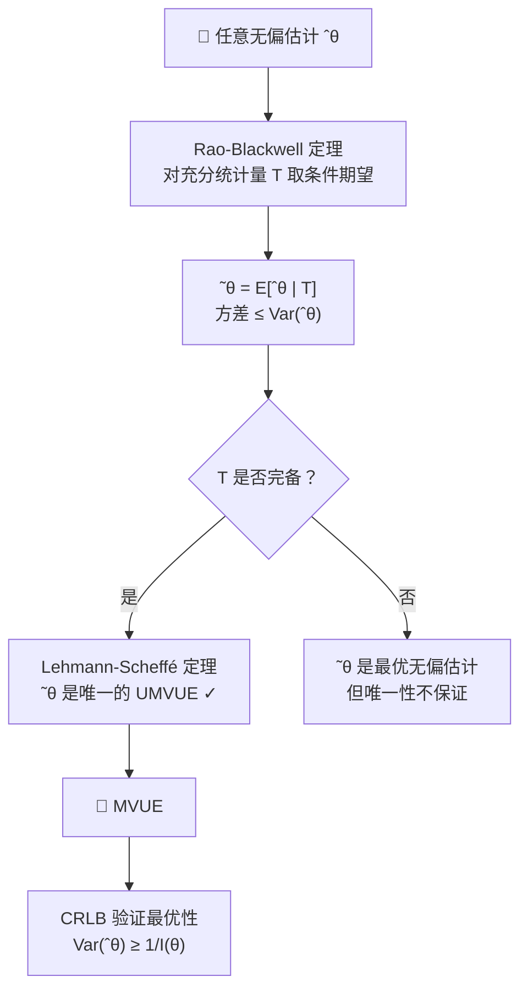

 <h1 id="第三讲-最小方差无偏估计" style="text-align: center; margin-bottom: 2rem; border-bottom: none;">第三讲 最小方差无偏估计 (MVUE)</h1> 
 

  
  
  
 

## 1. 参数的最优估计：条件期望视角

**样本:**  
$X = (X_1, X_2, \dots, X_n)^\top$ 是从分布 $f(x, \theta)$（其中 $\theta$ 未知）中独立抽取的随机样本。

**统计目标:**  
构造估计量 $\hat{\theta}(X_1, X_2, \dots, X_n)$ 使其尽可能接近真实参数 $\theta$。

**度量标准:**  
均方误差（MSE）定义为  
$$
\operatorname{MSE}(\hat{\theta}) = \mathbb{E}[(\hat{\theta} - \theta)^2].  \tag{3.1}$$

**目标函数:**  
我们要最小化 $\operatorname{MSE}(\hat{\theta})$。从理论上讲，最优估计是条件期望 $\mathbb{E}[\hat{\theta} \mid X] = \theta$（因为 $\theta$ 是常数，可以提取出来：$\mathbb{E}[\hat{\theta} \mid X] = \theta \mathbb{E}[1 \mid X] = \theta$）。但这要求 $\hat{\theta}$ 几乎处处等于 $\theta$，而 $\theta$ 未知，因此这个“最优”无法直接使用。所以我们需要在附加约束（如无偏性）下寻找可行的最优估计。

---

## 2. 通过构造问题认识参数 $\theta$

### 2.1 一个很差的构造：辅助统计量（Ancillary）

如果估计量的分布与 $\theta$ 无关，则它不含 $\theta$ 的任何信息，这样的估计量称为辅助统计量。

**例:**  
$X_1, X_2 \overset{\text{i.i.d.}}{\sim} N(0, 1)$，取 $\hat{\theta}(X_1, X_2) = X_1 - X_2$。则 $\hat{\theta} \sim N(0, 2)$，其分布与 $\theta$ 无关（这里 $\theta$ 实际上是 $0$，但即使 $\theta$ 变化，$X_1-X_2$ 的分布仍固定）。因此 $\hat{\theta}$ 是辅助统计量，不能用于估计 $\theta$。

---

### 2.2 一致最优 + 无偏性

在无约束下无法找到一致最优估计。若附加无偏性条件 $\mathbb{E}[\hat{\theta}] = \theta$，则 $$
\operatorname{MSE}(\hat{\theta}) = \mathbb{E}[(\hat{\theta} - \theta)^2] = \mathbb{E}[(\hat{\theta} - \mathbb{E}[\hat{\theta}])^2] = \operatorname{Var}(\hat{\theta}),  \tag{3.2}$$  
此时最小化 MSE 等价于最小化方差。这就是 **最小方差无偏估计（UMVUE）** 问题。

---

### 2.3 充分统计量（Sufficiency）

统计量 $s = s(X)$ 称为 $\theta$ 的充分统计量，如果给定 $s$ 时样本的条件分布 $f(x \mid s = t)$ 与 $\theta$ 无关。直观地说，$s$ 包含了 $\theta$ 的全部信息。

**例（Bernoulli 分布）:**  
$X_1, X_2, \dots, X_n \overset{\text{i.i.d.}}{\sim} \text{Bernoulli}(p)$，其中 $P(X_k=1)=p$，$P(X_k=0)=1-p$。联合概率为  
$$
f(x_1,\dots,x_n) = \prod_{k=1}^n p^{x_k}(1-p)^{1-x_k} = p^{\sum x_k}(1-p)^{n-\sum x_k}.  \tag{3.3}$$  
令 $t = \sum_{k=1}^n x_k$，则 $$
P(X_1=x_1,\dots,X_n=x_n \mid t) = \frac{p^t(1-p)^{n-t}}{\binom{n}{t}p^t(1-p)^{n-t}} = \frac{1}{\binom{n}{t}},  \tag{3.4}$$  
与 $p$ 无关，因此 $s = \sum X_k$ 是充分统计量。注意，给定 $t$ 后，样本的随机性仅来自哪些位置取 $1$，而 $t$ 本身已固定。

---

#### 2.3.1 寻找充分统计量的方法：Neyman 因式分解

$s(x)$ 是充分统计量当且仅当联合密度可分解为  
$$
f(x, \theta) = g(s(x), \theta)\, h(x),  \tag{3.5}$$  
其中 $g$ 仅通过 $s(x)$ 依赖 $\theta$，$h(x)$ 与 $\theta$ 无关。

**例（Poisson 分布）:**  
$X_k \overset{\text{i.i.d.}}{\sim} \text{Poisson}(\lambda)$，$P(X_k=x_k) = \frac{\lambda^{x_k}}{x_k!} e^{-\lambda}$。则 $$
f(x_1,\dots,x_n) = \prod_{k=1}^n \frac{\lambda^{x_k}}{x_k!} e^{-\lambda}
= \underbrace{\lambda^{\sum x_k} e^{-n\lambda}}_{g(\sum x_k,\lambda)} \cdot \underbrace{\prod_{k=1}^n \frac{1}{x_k!}}_{h(x)}.  \tag{3.6}$$  
因此 $s(x)=\sum_{k=1}^n X_k$ 是充分统计量。

**例（正态分布，方差已知）:**  
$X_k \overset{\text{i.i.d.}}{\sim} N(\mu, \sigma^2)$，$\sigma^2$ 已知，$\theta = \mu$。密度为  
$$
f(x_1,\dots,x_n;\mu) = \left(\frac{1}{\sqrt{2\pi}\sigma}\right)^n \exp\left(-\frac{1}{2\sigma^2}\sum_{k=1}^n (x_k-\mu)^2\right).  \tag{3.7}$$  
展开平方项： $$
\sum (x_k-\mu)^2 = \sum x_k^2 - 2\mu\sum x_k + n\mu^2.  \tag{3.8}$$  
于是  
$$
f = \left(\frac{1}{\sqrt{2\pi}\sigma}\right)^n \exp\left(-\frac{n\mu^2}{2\sigma^2}\right) \exp\left(\frac{\mu}{\sigma^2}\sum x_k\right) \cdot \exp\left(-\frac{1}{2\sigma^2}\sum x_k^2\right).  \tag{3.9}$$  
令 $$
g(s,\mu) = \left(\frac{1}{\sqrt{2\pi}\sigma}\right)^n \exp\left(-\frac{n\mu^2}{2\sigma^2}\right) \exp\left(\frac{\mu}{\sigma^2}s\right),\quad h(x)=\exp\left(-\frac{1}{2\sigma^2}\sum x_k^2\right),  \tag{3.10}$$  
其中 $s=\sum x_k$。故 $s$ 是充分统计量。

**例（正态分布，均值方差均未知）:**  
$\theta = (\mu, \sigma^2)$。联合密度可分解为  
$$
f = \underbrace{\left(\frac{1}{\sqrt{2\pi}\sigma}\right)^n \exp\left(-\frac{n\mu^2}{2\sigma^2}\right) \exp\left(\frac{\mu}{\sigma^2}\sum x_k\right)}_{g_1(\sum x_k, \mu,\sigma^2)} \cdot \underbrace{\exp\left(-\frac{1}{2\sigma^2}\sum x_k^2\right)}_{g_2(\sum x_k^2,\sigma^2)},  \tag{3.11}$$  
此时两个充分统计量：$s_1 = \sum X_k$ 和 $s_2 = \sum X_k^2$。

---

## 3. Rao-Blackwell 过程（改进估计）

假设我们已经有一个估计 $\hat{\theta}$，且它是无偏的（$\mathbb{E}[\hat{\theta}] = \theta$）。令 $s(x)$ 是 $\theta$ 的充分统计量。我们构造一个新的估计 $$
\hat{\theta}' = \mathbb{E}[\hat{\theta} \mid s(x)].  \tag{3.12}$$

**新估计的无偏性：**  
$$
\mathbb{E}[\hat{\theta}'] = \mathbb{E}\big[\mathbb{E}[\hat{\theta} \mid s]\big] = \mathbb{E}[\hat{\theta}] = \theta.  \tag{3.13}$$

**方差比较（全方差公式推导）：** $$
\operatorname{Var}(\hat{\theta}) = \mathbb{E}(\hat{\theta} - \theta)^2 = \mathbb{E}\big[\hat{\theta} - \mathbb{E}(\hat{\theta}|s) + \mathbb{E}(\hat{\theta}|s) - \theta\big]^2.  \tag{3.14}$$  
展开平方：  
$$
= \mathbb{E}\big[(\hat{\theta} - \mathbb{E}(\hat{\theta}|s))^2\big] + \mathbb{E}\big[(\mathbb{E}(\hat{\theta}|s) - \theta)^2\big] + 2\,\mathbb{E}\big[(\hat{\theta} - \mathbb{E}(\hat{\theta}|s))(\mathbb{E}(\hat{\theta}|s) - \theta)\big].  \tag{3.15}$$  
交叉项：给定 $s$ 时，$\mathbb{E}(\hat{\theta}|s) - \theta$ 是 $s$ 的函数，可提到条件期望外： $$
\mathbb{E}\big[(\hat{\theta} - \mathbb{E}(\hat{\theta}|s))(\mathbb{E}(\hat{\theta}|s) - \theta)\big] = \mathbb{E}\Big[\big(\mathbb{E}(\hat{\theta}|s) - \theta\big) \cdot \mathbb{E}\big[\hat{\theta} - \mathbb{E}(\hat{\theta}|s) \mid s\big]\Big].  \tag{3.16}$$  
而 $\mathbb{E}\big[\hat{\theta} - \mathbb{E}(\hat{\theta}|s) \mid s\big] = \mathbb{E}(\hat{\theta}|s) - \mathbb{E}(\hat{\theta}|s) = 0$，所以交叉项为零。于是  
$$
\operatorname{Var}(\hat{\theta}) = \mathbb{E}\big[(\hat{\theta} - \mathbb{E}(\hat{\theta}|s))^2\big] + \mathbb{E}\big[(\mathbb{E}(\hat{\theta}|s) - \theta)^2\big].  \tag{3.17}$$  
第一项 $\mathbb{E}\big[(\hat{\theta} - \mathbb{E}(\hat{\theta}|s))^2\big] = \mathbb{E}\big[\operatorname{Var}(\hat{\theta} \mid s)\big]$；  
第二项 $\mathbb{E}\big[(\mathbb{E}(\hat{\theta}|s) - \theta)^2\big] = \operatorname{Var}\big(\mathbb{E}(\hat{\theta}|s)\big)$（因为 $\mathbb{E}[\mathbb{E}(\hat{\theta}|s)] = \mathbb{E}(\hat{\theta}) = \theta$，且 $\theta$ 是常数）。因此 $$
\boxed{\operatorname{Var}(\hat{\theta}) = \mathbb{E}\big[\operatorname{Var}(\hat{\theta} \mid s)\big] + \operatorname{Var}\big(\mathbb{E}(\hat{\theta} \mid s)\big)}.  \tag{3.18}$$  

$$
\overset{E[\hat{\theta} - \theta]^2}{\boxed{Var(\hat{\theta})}} = \overset{Var(\hat{\theta}^{'}) = E[\hat{\theta}^{'} - \theta]^2}{\boxed{Var(E[\hat{\theta}|s(x)])}} + \overset{非负}{\boxed {E[Var(\hat{\theta}|s(x))]}}  \tag{3.19}$$

由于 $\mathbb{E}\big[\operatorname{Var}(\hat{\theta} \mid s)\big] \ge 0$，所以 $$
\operatorname{Var}(\hat{\theta}') = \operatorname{Var}\big(\mathbb{E}(\hat{\theta}\mid s)\big) \le \operatorname{Var}(\hat{\theta}).  \tag{3.20}$$  
即新估计 $\hat{\theta}'$ 无偏且方差更小（除非 $\hat{\theta}$ 已经是 $s$ 的函数）。这就是 Rao-Blackwell 定理。

> **注**：条件期望在任何情况下都定义良好，但我们要求 $s$ 是充分统计量的原因是：充分性保证 $\mathbb{E}[\hat{\theta}\mid s]$ 是 $s$ 的函数（即与 $\theta$ 无关），从而 $\hat{\theta}'$ 是一个可计算的统计量。

---

### 3.1 示例：正态分布（方差已知）的 Rao-Blackwell 改进

**问题设定**  
随机变量  
$$
X_1, \dots, X_n \overset{\text{i.i.d.}}{\sim} N(\mu, \sigma^2)  \tag{3.21}$$  
其中 $\sigma^2$ 已知，$\theta = \mu$ 是真实参数。  
充分统计量取 $$
s = \sum_{k=1}^n X_k.  \tag{3.22}$$  
初始估计量  
$$
\hat{\theta} = X_1.  \tag{3.23}$$

**无偏性验证** $$
\mathbb{E}[\hat{\theta}] = \mathbb{E}[X_1] = \mu = \theta,  \tag{3.24}$$  
所以 $\hat{\theta}$ 是 $\theta$ 的无偏估计。

**Rao-Blackwell 提升：计算 $\hat{\theta}' = \mathbb{E}[\hat{\theta} \mid s]$**  
$$
\hat{\theta}' = \mathbb{E}[X_1 \mid s], \quad s = \sum_{k=1}^n X_k.  \tag{3.25}$$

*利用对称性和线性*：  
由于 $X_1,\dots,X_n$ 独立同分布，在给定 $s$ 下条件期望相同： $$
\mathbb{E}[X_1 \mid s] = \mathbb{E}[X_2 \mid s] = \dots = \mathbb{E}[X_n \mid s].  \tag{3.26}$$  
求和：  
$$
\sum_{i=1}^n \mathbb{E}[X_i \mid s] = \mathbb{E}\left[ \sum_{i=1}^n X_i \mid s \right] = \mathbb{E}[s \mid s] = s.  \tag{3.27}$$  
因此 $$
n \cdot \mathbb{E}[X_1 \mid s] = s \quad \Longrightarrow \quad \mathbb{E}[X_1 \mid s] = \frac{s}{n}.  \tag{3.28}$$  
所以  
$$
\hat{\theta}' = \frac{1}{n} \sum_{k=1}^n X_k = \bar{X}.  \tag{3.29}$$

*或用正态分布条件期望公式*：  
$(X_1, s)$ 服从二元正态分布， $$
\mathbb{E}[X_1 \mid s] = \mu + \frac{\operatorname{Cov}(X_1, s)}{\operatorname{Var}(s)} (s - \mathbb{E}[s]).  \tag{3.30}$$  
计算：

$$
\operatorname{Cov}(X_1, s) = \operatorname{Cov}(X_1, X_1 + \dots + X_n) = \sigma^2,  \tag{3.31}$$ 

$$
\operatorname{Var}(s) = n\sigma^2, \quad \mathbb{E}[s] = n\mu.  \tag{3.32}$$  
代入得  
$$
\mathbb{E}[X_1 \mid s] = \mu + \frac{\sigma^2}{n\sigma^2}(s - n\mu) = \mu + \frac{1}{n}(s - n\mu) = \frac{s}{n}.  \tag{3.33}$$  
结果一致。

**$\hat{\theta}'$ 的无偏性** $$
\mathbb{E}[\hat{\theta}'] = \mathbb{E}\left[ \frac{1}{n}\sum_{k=1}^n X_k \right] = \frac{1}{n} \sum_{k=1}^n \mathbb{E}[X_k] = \frac{1}{n} \cdot n\mu = \mu = \theta.  \tag{3.34}$$

**方差比较（Rao-Blackwell 定理）**  
由全方差公式：  
$$
\operatorname{Var}(\hat{\theta}) = \mathbb{E}\big[\operatorname{Var}(\hat{\theta} \mid s)\big] + \operatorname{Var}\big(\mathbb{E}[\hat{\theta} \mid s]\big) = \mathbb{E}\big[\operatorname{Var}(\hat{\theta} \mid s)\big] + \operatorname{Var}(\hat{\theta}').  \tag{3.35}$$  
因为 $\mathbb{E}\big[\operatorname{Var}(\hat{\theta} \mid s)\big] \ge 0$，所以 $$
\operatorname{Var}(\hat{\theta}') \le \operatorname{Var}(\hat{\theta}).  \tag{3.36}$$  
等号成立当且仅当 $\operatorname{Var}(\hat{\theta} \mid s)=0$ 几乎必然，即 $\hat{\theta}$ 已经是 $s$ 的函数。这里 $\hat{\theta}=X_1$ 不是 $s$ 的函数，因此方差严格减小。

**最终结果**：  
$$
\hat{\theta}' = \bar{X} = \frac{1}{n}\sum_{i=1}^n X_i  \tag{3.37}$$  
是 $\hat{\theta}=X_1$ 的 Rao-Blackwell 提升，无偏且方差更小。

---

### 3.2 改进前后均方误差（MSE）的详细计算

**改进前 $\hat{\theta} = X_1$**  
由于 $\mathbb{E}[X_1] = \mu$，$\hat{\theta}$ 无偏， $$
\operatorname{MSE}(\hat{\theta}) = \mathbb{E}[(X_1 - \mu)^2] = \operatorname{Var}(X_1) = \sigma^2.  \tag{3.38}$$

**改进后 $\hat{\theta}' = \bar{X} = \frac{1}{n}\sum_{i=1}^n X_i$**  
无偏性：  
$$
\mathbb{E}[\bar{X}] = \frac{1}{n}\sum_{i=1}^n \mathbb{E}[X_i] = \mu.  \tag{3.39}$$  
均方误差等于方差： $$
\operatorname{MSE}(\hat{\theta}') = \operatorname{Var}(\bar{X}) = \operatorname{Var}\left( \frac{1}{n}\sum_{i=1}^n X_i \right) = \frac{1}{n^2} \sum_{i=1}^n \operatorname{Var}(X_i) = \frac{1}{n^2} \cdot n \sigma^2 = \frac{\sigma^2}{n}.  \tag{3.40}$$  
也可用定义展开：  
$$
\begin{aligned}
\mathbb{E}[(\bar{X} - \mu)^2] &= \mathbb{E}\left[ \left( \frac{1}{n}\sum_{i=1}^n (X_i - \mu) \right)^2 \right] \\
&= \frac{1}{n^2} \mathbb{E}\left[ \sum_{i=1}^n (X_i - \mu)^2 + \sum_{i \neq j} (X_i - \mu)(X_j - \mu) \right] \\
&= \frac{1}{n^2} \left( \sum_{i=1}^n \mathbb{E}[(X_i - \mu)^2] + \sum_{i \neq j} \mathbb{E}[X_i - \mu]\mathbb{E}[X_j - \mu] \right) \quad (\text{独立}) \\
&= \frac{1}{n^2} \left( n \cdot \sigma^2 + 0 \right) = \frac{\sigma^2}{n}.
\end{aligned}  \tag{3.41}$$

**结果对比** $$
\operatorname{MSE}(\hat{\theta}) = \sigma^2, \quad \operatorname{MSE}(\hat{\theta}') = \frac{\sigma^2}{n}.  \tag{3.42}$$  
当 $n > 1$ 时，$\operatorname{MSE}(\hat{\theta}') < \operatorname{MSE}(\hat{\theta})$，说明 Rao-Blackwell 提升有效降低了均方误差。

---

## 4. 完备性（Lehmann–Scheffé 定理）

**完备的充分统计量定义**  
设统计量 $T = T(\mathbf{X})$ 是参数 $\theta$ 的**充分统计量**。若 $T$ 还具有以下性质：

> 对任意实值可测函数 $g$，若  
> $$
> \mathbb{E}_\theta[g(T)] = 0 \quad \text{对所有 } \theta \in \Theta
>   \tag{3.43}$$  
> 成立，则必有  
> $$
> P_\theta(g(T) = 0) = 1 \quad \text{对所有 } \theta \in \Theta,
>   \tag{3.44}$$  
> 即 $g(T)=0$ 几乎必然成立（关于每个 $P_\theta$）。

则称 $T$ 是**完备的充分统计量**（complete sufficient statistic）。

**另一种等价表述**（常用在指数族中）：  
若由 $T$ 的分布族 $\{P_\theta^T : \theta \in \Theta\}$ 构成的期望算子具有单射性（即不存在非零的零期望函数），则 $T$ 是完备的。

> **注**：完备性通常与充分性结合使用，用于证明唯一的最小方差无偏估计（UMVUE）的存在性，即 Lehmann–Scheffé 定理。

---

### 4.1 完备性的直观理解

> **如果关于统计量 $T$ 的函数 $g(T)$ 的期望对所有可能的参数 $\theta$ 都等于 0，那么 $g(T)$ 本身必须是 0（几乎处处）。**

换句话说，期望算子 $\theta \mapsto \mathbb{E}_\theta[g(T)]$ 是一个“单射”：不同的 $g$（相差一个非零函数）一定会产生不同的期望函数。因此，**只要知道了 $g(T)$ 的期望值函数（随 $\theta$ 变化），就能唯一地反推出 $g(T)$ 本身**（在几乎必然意义下）。

**举个例子**：  
如果 $T \sim \text{Binomial}(n,p)$，且 $\mathbb{E}_p[g(T)] = 0$ 对所有 $p \in (0,1)$ 成立，那么 $g(T) \equiv 0$。为什么？因为二项分布族足够“丰富”，任何非零的多项式函数 $g$ 都会在某个 $p$ 处产生非零期望，除非 $g$ 恒为零。

**直观含义**：  
完备性保证了 $T$ 的分布族不会遗漏任何“方向”——不存在非平凡的零期望函数。这恰好是 UMVUE 存在且唯一的关键：如果 $T$ 完备且充分，那么任何一个无偏估计关于 $T$ 的条件期望就是唯一的 UMVUE。

---

### 4.2 Lehmann–Scheffé 定理

设 $T$ 是分布族 $\{P_\theta : \theta \in \Theta\}$ 的一个**完备充分统计量**。若 $\hat{\theta} = \varphi(T)$ 是参数 $\theta$ 的一个无偏估计（即 $\mathbb{E}_\theta[\varphi(T)] = \theta$ 对所有 $\theta$ 成立），则 $\hat{\theta}$ 是 $\theta$ 的**一致最小方差无偏估计（UMVUE）**。换言之，对于 $\theta$ 的任何其他无偏估计 $\tilde{\theta}$，均有  
$$
\operatorname{Var}_\theta(\varphi(T)) \le \operatorname{Var}_\theta(\tilde{\theta}), \quad \forall \theta \in \Theta,  \tag{3.45}$$  
且若 $\tilde{\theta}$ 也是无偏的，则 $\varphi(T) = \tilde{\theta}$ 几乎必然（关于每个 $P_\theta$）。

**推论**：在完备充分统计量存在的条件下，UMVUE 存在且唯一，它等于任意无偏估计关于该完备充分统计量的条件期望。

---

### 4.3 Lehmann–Scheffé 定理的验证

要验证 Lehmann–Scheffé 定理：对任意无偏估计 $\hat{\theta}$（即 $\mathbb{E}[\hat{\theta}] = \theta$），设 $T$ 是完备充分统计量，$g(T)$ 是基于 $T$ 的某个无偏估计（即 $\mathbb{E}[g(T)] = \theta$），则 $$
\operatorname{MSE}(\hat{\theta}) \ge \operatorname{MSE}(g(T)).  \tag{3.46}$$  
由于无偏性，$\operatorname{MSE} = \operatorname{Var}$，因此只需证 $\operatorname{Var}(\hat{\theta}) \ge \operatorname{Var}(g(T))$。

**证明步骤**：

1. **利用充分性构造条件期望**  
   因为 $T$ 是充分统计量，条件期望 $\mathbb{E}[\hat{\theta} \mid T]$ 是 $T$ 的函数，且与 $\theta$ 无关（由充分性定义）。记 $h(T) = \mathbb{E}[\hat{\theta} \mid T]$。

2. **无偏性**  
   $$
   \mathbb{E}[h(T)] = \mathbb{E}\big[\mathbb{E}[\hat{\theta} \mid T]\big] = \mathbb{E}[\hat{\theta}] = \theta.  \tag{3.47}$$  
   故 $h(T)$ 也是 $\theta$ 的无偏估计，且基于 $T$。

3. **完备性推出唯一性**  
   由于 $T$ 完备，基于 $T$ 的无偏估计是唯一的（若存在两个不同的 $T$ 的函数无偏，其差为零期望函数，由完备性必为零几乎必然）。因此 $h(T) = g(T)$ 几乎必然。

4. **方差分解（全方差公式）** $$
   \operatorname{Var}(\hat{\theta}) = \mathbb{E}\big[\operatorname{Var}(\hat{\theta} \mid T)\big] + \operatorname{Var}\big(\mathbb{E}[\hat{\theta} \mid T]\big) = \mathbb{E}\big[\operatorname{Var}(\hat{\theta} \mid T)\big] + \operatorname{Var}(h(T)).  \tag{3.48}$$  
   由于 $\mathbb{E}\big[\operatorname{Var}(\hat{\theta} \mid T)\big] \ge 0$，得  
   $$
   \operatorname{Var}(\hat{\theta}) \ge \operatorname{Var}(h(T)) = \operatorname{Var}(g(T)).  \tag{3.49}$$

因此，对任意无偏估计 $\hat{\theta}$，其方差不小于基于完备充分统计量的无偏估计 $g(T)$ 的方差，即 $g(T)$ 是 UMVUE。证毕。

---

### 4.4 学习路径小结

前面的学习我们经历了这样的路径：

- 最初我们想要最小化估计量的均方误差 $\mathbb{E}[(\hat{\theta}-\theta)^2]$，但无约束的最优解 $\hat{\theta}=\theta$ 不可实现。  
- 于是加上无偏性约束 $\mathbb{E}[\hat{\theta}]=\theta$，此时均方误差退化为方差，问题变为寻找最小方差无偏估计（UMVUE）。  
- 我们引入了**充分统计量**：它能捕获样本中关于 $\theta$ 的全部信息。Rao‑Blackwell 定理告诉我们：将任意无偏估计对充分统计量取条件期望，可以得到一个方差更小（或相等）的无偏估计。  
- 但是 Rao‑Blackwell 过程给出的估计不一定唯一。为了得到唯一的 UMVUE，我们需要**完备性**：如果 $T$ 是完备充分统计量，那么任何基于 $T$ 的无偏估计在几乎必然意义下唯一。  
- 结合两者得到 **Lehmann‑Scheffé 定理**：若 $T$ 是完备充分统计量，且 $\varphi(T)$ 是 $\theta$ 的无偏估计，则 $\varphi(T)$ 就是 UMVUE。  

然而，在实际问题中，我们往往不知道一个无偏估计的方差能否再降低，或者我们想要一个衡量标准来评价任意无偏估计的方差下界。这就引出了 **Cramér‑Rao 下界**（Cramér‑Rao lower bound, CRLB）。

> **Cramér‑Rao 下界** 给出了正则条件下无偏估计方差的一个理论下界：  
> $$
> \forall \hat{\theta}, E[\hat{\theta}] = \theta \implies \operatorname{Var}(\hat{\theta}) \ge \frac{1}{n\,I(\theta)},
>  $$  
> 其中 $I(\theta)$ 是单个观测的 Fisher 信息量。如果某个无偏估计的方差达到这个下界，那么它不仅是 UMVUE，而且是**有效估计**。Cramér‑Rao 下界为我们提供了一条无需通过完备充分统计量也能判断方差最优性的途径，同时也揭示了 Fisher 信息量在参数估计中的核心作用。  

接下来我们将从 Fisher 信息量的定义开始，推导 Cramér‑Rao 下界，并讨论其成立的条件与意义。

---

## 5. Cramér-Rao 下界（CRLB）

Cramér-Rao 下界给出了无偏估计方差的理论最小值，它依赖于 Fisher 信息量。推导从无偏估计的定义出发，利用 Cauchy-Schwarz 不等式得到下界。

### 5.1 无偏估计的条件

设 $\hat{\theta}(x)$ 是参数 $\theta$ 的一个无偏估计，即  $$
\mathbb{E}[\hat{\theta}(X)] = \theta = \int_{-\infty}^{+\infty} \hat{\theta}(x) f(x, \theta) \, dx.\tag{3.50} $$
将等式两边对 $\theta$ 求偏导（假设积分与求导可交换）：
$$
1 = \frac{\partial}{\partial \theta} \int_{-\infty}^{+\infty} \hat{\theta}(x) f(x, \theta) \, dx = \int_{-\infty}^{+\infty} \hat{\theta}(x) \frac{\partial}{\partial \theta} f(x, \theta) \, dx.  \tag{3.51} $$

### 5.2 概率密度函数的归一化条件

概率密度函数 $f(x,\theta)$ 满足归一化条件：
 $$
1 = \int_{-\infty}^{+\infty} f(x, \theta) \, dx. \tag{3.52} $$
两边对 $\theta$ 求偏导（交换求导与积分）：
 $$
0 = \frac{\partial}{\partial \theta} \int_{-\infty}^{+\infty} f(x, \theta) \, dx = \int_{-\infty}^{+\infty} \frac{\partial}{\partial \theta} f(x, \theta) \, dx. \tag{3.53} $$

### 5.3 构造关键等式（把 $\theta$ 引入 (3.53) 中）

由于 $\theta$ 是常数，可以将 (3.53) 式两边乘以 $\theta$，得
$$
0 = \theta \int_{-\infty}^{+\infty} \frac{\partial}{\partial \theta} f(x, \theta) \, dx = \int_{-\infty}^{+\infty} \theta \frac{\partial}{\partial \theta} f(x, \theta) \, dx.  \tag{3.54} $$
现在用 (3.51) 减去 (3.52)，得到
$$
1 = \int_{-\infty}^{+\infty} \hat{\theta}(x) \frac{\partial f}{\partial \theta} \, dx - \int_{-\infty}^{+\infty} \theta \frac{\partial f}{\partial \theta} \, dx
  = \int_{-\infty}^{+\infty} \bigl( \hat{\theta}(x) - \theta \bigr) \frac{\partial f}{\partial \theta} \, dx.  \tag{3.55} $$
这样，$\theta$ 就被自然地构造进了积分中。

### 5.4 Fisher 信息量的引入（Fisher 技巧）

注意到 $\frac{\partial f}{\partial \theta} = f \cdot \frac{\partial \log f}{\partial \theta}$。将 (3.53) 改写为
$$
1 = \int_{-\infty}^{+\infty} \bigl( \hat{\theta}(x) - \theta \bigr) \left( \frac{\partial}{\partial \theta} \log f(x, \theta) \right) f(x, \theta) \, dx.  \tag{3.56} $$
为了应用 Cauchy-Schwarz 不等式，将积分视为内积，引入 $\sqrt{f}$：
$$
1 = \int_{-\infty}^{+\infty} \Bigl( (\hat{\theta}(x) - \theta) \sqrt{f(x, \theta)} \Bigr) \Bigl( \frac{\partial}{\partial \theta} \log f(x, \theta) \sqrt{f(x, \theta)} \Bigr) dx.  \tag{3.57} $$

### 5.5 Cauchy-Schwarz 不等式

由 Cauchy-Schwarz 不等式，
$$
\left( \int_{-\infty}^{+\infty} u(x) v(x) \, dx \right)^2 \le \int_{-\infty}^{+\infty} u(x)^2 dx \cdot \int_{-\infty}^{+\infty} v(x)^2 dx.  \tag{3.58} $$
对 (3.57) 两边平方并应用该不等式：
$$
1^2 \le \left( \int_{-\infty}^{+\infty} \bigl( \hat{\theta}(x) - \theta \bigr)^2 f(x, \theta) \, dx \right) \cdot \left( \int_{-\infty}^{+\infty} \left( \frac{\partial}{\partial \theta} \log f(x, \theta) \right)^2 f(x, \theta) \, dx \right).  \tag{3.59} $$
即
$$
1 \le \mathbb{E}\bigl[ (\hat{\theta}(X) - \theta)^2 \bigr] \cdot \mathbb{E}\left[ \left( \frac{\partial}{\partial \theta} \log f(X, \theta) \right)^2 \right].  \tag{3.60} $$

### 5.6 方差下界与 Fisher 信息量

定义 Fisher 信息量为
$$
I(\theta) = \mathbb{E}\left[ \left( \frac{\partial}{\partial \theta} \log f(X, \theta) \right)^2 \right].  \tag{3.61} $$
则从 (3.60) 可得
$$
\operatorname{Var}(\hat{\theta}(X)) = \mathbb{E}\bigl[ (\hat{\theta}(X) - \theta)^2 \bigr] \ge \overset{CRLB}{\boxed{\frac{1}{I(\theta)}}}.  \tag{3.62} $$
这就是 Cramér-Rao 下界：任何无偏估计的方差至少为 Fisher 信息量的倒数。

---

**注**：上述推导假设了正则条件（积分与求导可交换、Fisher 信息有限等）。在实际应用中，CRLB 为评价估计量的有效性提供了基准：若某个无偏估计的方差恰好等于 $1/I(\theta)$，则称其为**有效估计**。

---

### 5.7 推导：Fisher 信息量的二阶导数表示

在正则条件（积分与求导可交换，且边界项为零）下，从归一化条件出发：
$$
\int_{-\infty}^{+\infty} f(x,\theta)\,dx = 1.  \tag{3.63} $$

**第一步：对 $\theta$ 求一阶导**  
$$
0 = \frac{\partial}{\partial\theta}\int_{-\infty}^{+\infty} f\,dx = \int_{-\infty}^{+\infty} \frac{\partial f}{\partial\theta}\,dx.  \tag{3.64} $$

**第二步：对 $\theta$ 求二阶导**  
对 (3.64) 式再对 $\theta$ 求导：
 $$
0 = \frac{\partial}{\partial\theta}\int_{-\infty}^{+\infty} \frac{\partial f}{\partial\theta}\,dx = \int_{-\infty}^{+\infty} \frac{\partial^2 f}{\partial\theta^2}\,dx. \tag{3.65} $$

**第三步：引入 $\log f$ 的一阶与二阶导**  
由 $\frac{\partial}{\partial\theta}\log f = \frac{1}{f}\frac{\partial f}{\partial\theta}$，求二阶导：
$$
\frac{\partial^2}{\partial\theta^2}\log f = \frac{\partial}{\partial\theta}\left(\frac{1}{f}\frac{\partial f}{\partial\theta}\right) = -\frac{1}{f^2}\left(\frac{\partial f}{\partial\theta}\right)^2 + \frac{1}{f}\frac{\partial^2f}{\partial\theta^2}.  \tag{3.66} $$

**第四步：两边乘以 $f$ 并积分**  
$$
\int_{-\infty}^{+\infty} f\,\frac{\partial^2}{\partial\theta^2}\log f\,dx = -\int_{-\infty}^{+\infty} \frac{1}{f}\left(\frac{\partial f}{\partial\theta}\right)^2 dx + \int_{-\infty}^{+\infty} \frac{\partial^2 f}{\partial\theta^2}\,dx.  \tag{3.67} $$

左边即为 $\mathbb{E}\left[\frac{\partial^2}{\partial\theta^2}\log f\right]$。右边第一项是 $-\mathbb{E}\left[\left(\frac{\partial}{\partial\theta}\log f\right)^2\right]$，右边第二项由 (3.65) 知为 $0$。因此
$$
\mathbb{E}\left[\frac{\partial^2}{\partial\theta^2}\log f\right] = -\mathbb{E}\left[\left(\frac{\partial}{\partial\theta}\log f\right)^2\right].  \tag{3.68} $$

移项即得
$$
\mathbb{E}\left[\left(\frac{\partial}{\partial\theta}\log f\right)^2\right] = -\mathbb{E}\left[\frac{\partial^2}{\partial\theta^2}\log f\right].  \tag{3.69} $$

这就是 Fisher 信息量的另一种计算形式，常用于实际计算（因为二阶导的期望往往更容易处理）。

---

### 5.8 从曲率的角度理解 Fisher 信息量的二阶导数形式

$$
I(\theta) = -\mathbb{E}\left[ \frac{\partial^2}{\partial\theta^2} \log f(X;\theta) \right].  \tag{3.70} $$

#### 5.8.1 对数似然函数的曲率

对于固定的观测 $x$，考虑对数似然函数 $\ell(\theta) = \log f(x;\theta)$ 作为 $\theta$ 的函数。它在 $\theta$ 处的一阶导数（得分）反映了斜率，二阶导数 $\ell''(\theta)$ 反映了函数在该点的**弯曲程度**（曲率）。  
- 若 $\ell''(\theta)$ 为较大的**负数**，说明函数在该点附近**向下弯曲剧烈**，即似然峰很尖（高曲率）。  
- 若 $\ell''(\theta)$ 接近 0，则函数平缓，曲率小。

#### 5.8.2 期望曲率与 Fisher 信息

Fisher 信息量取的是**负的二阶导数期望**：
$$
I(\theta) = -\mathbb{E}[\ell''(\theta)].  \tag{3.71} $$
- 负号将向下弯曲（$\ell''<0$）转化为正值。  
- 期望是对所有可能的样本 $x$ 取平均，得到**平均曲率**。  
- 曲率越大，$I(\theta)$ 越大，表明从总体平均来看，对数似然函数在真实参数 $\theta$ 附近越“尖峭”。

#### 5.8.3 曲率与估计精度的关系

一个直观的类比：  
- 曲率大 → 似然函数在 $\theta$ 处敏感，轻微偏离 $\theta$ 就会导致似然值明显下降 → 样本携带关于 $\theta$ 的信息多 → 任何无偏估计的方差下界 $1/I(\theta)$ 小（Cramér‑Rao 下界）。  
- 曲率小 → 似然平坦 → 信息少 → 方差下界大。

#### 5.8.4 几何图像

将 $\theta$ 视为位置，对数似然函数 $\ell(\theta)$ 的图形像一个“山丘”。真实参数 $\theta_0$ 位于山顶（极大值点，一阶导为 0）。山顶的**曲率**（二阶导的绝对值）描述了山尖的陡峭程度：  
- 很尖的山 → 曲率大 → Fisher 信息大 → 估计容易精确。  
- 平缓的山 → 曲率小 → Fisher 信息小 → 估计困难。

#### 5.8.5 与 Cramér‑Rao 下界的联系

Cramér‑Rao 下界写作：
 $$
\operatorname{Var}(\hat{\theta}) \ge \frac{1}{I(\theta)} = \frac{1}{-\mathbb{E}[\ell''(\theta)]}. \tag{3.72} $$
这表明：平均曲率的倒数就是方差的理论下限。曲率越大，下限越低，可能达到更小的方差。

---

**总结**：**Fisher 信息量是对数似然函数的平均曲率（负的二阶导数的期望）**，它刻画了似然曲面在真实参数处的弯曲程度，弯曲越剧烈，信息越多，估计的潜在精度越高。

---

### 5.9 Fisher 信息量的性质

1. **非负性**  
    $$  I(\theta) \ge 0,\tag{3.73}
    $$  
   等号成立当且仅当得分函数 $\frac{\partial}{\partial\theta}\log f(X;\theta)$ 几乎处处为零（即分布与 $\theta$ 无关）。

2. **信息等式（方差与期望的关系）**  
   在正则条件下，得分函数的期望为零：  
   
   $$
   \mathbb{E}\left[\frac{\partial}{\partial\theta}\log f(X;\theta)\right] = 0,\tag{3.74}
    $$  
   因此 Fisher 信息量也是得分函数的方差：  
   
   $$
   I(\theta) = \operatorname{Var}\left(\frac{\partial}{\partial\theta}\log f(X;\theta)\right).\tag{3.75}
    $$

3. **二阶导数表示（信息等式）**  
   若密度函数二阶可导且正则条件成立，则  
   
   $$
   I(\theta) = -\mathbb{E}\left[\frac{\partial^2}{\partial\theta^2}\log f(X;\theta)\right].\tag{3.76}
    $$  
   这个形式常用于计算。

4. **独立样本的可加性**  
   若 $X_1,\dots,X_n \overset{\text{i.i.d.}}{\sim} f(x;\theta)$，则样本的 Fisher 信息量为  
   
   $$
   I_n(\theta) = n I_1(\theta),\tag{3.77}
    $$  

   其中 $I_1(\theta)$ 是单个观测的 Fisher 信息量。

5. **参数变换下的性质（重参数化不变性）**  
   设 $\eta = g(\theta)$ 是 $\theta$ 的一对一可微变换，则 Fisher 信息量满足 
   
   $$
   I_\eta(\eta) = I_\theta(\theta) \left( \frac{d\theta}{d\eta} \right)^2. \tag{3.78}
    $$

6. **Cramér-Rao 下界的可达性**  
   若某无偏估计 $\hat{\theta}$ 的方差达到 CRLB，则 $\hat{\theta}$ 是有效估计，且其分布必属于指数族，且得分函数与 $\hat{\theta}-\theta$ 成比例：  
   
   $$
   \frac{\partial}{\partial\theta}\log f(X;\theta) = I(\theta)(\hat{\theta} - \theta).\tag{3.79}
    $$

这些性质在参数估计理论中至关重要，尤其用于计算信息量、评价估计量效率以及推导渐近分布。

---

### 5.10 Fisher 信息量与哪些因素有关/无关

Fisher 信息量 $I(\theta)$ 是分布族 $f(x;\theta)$ 的内在属性，它与以下因素**有关**，与以下因素**无关**：

---

#### 5.10.1 影响 Fisher 信息量的因素

1. **概率分布的形式** $f(x;\theta)$  
   不同的分布族（如正态、泊松、二项）对应不同的 Fisher 信息量。

2. **参数 $\theta$ 的取值**  
   $I(\theta)$ 通常是 $\theta$ 的函数，随 $\theta$ 变化而变化（例如正态分布 $N(\mu,\sigma^2)$ 中，若 $\theta=\mu$，则 $I(\mu)=1/\sigma^2$ 与 $\mu$ 无关；但若 $\theta=\sigma^2$，则 $I(\sigma^2)$ 与 $\sigma^2$ 有关）。

3. **样本量 $n$**（对于 i.i.d. 样本）  
   若 $X_1,\dots,X_n \stackrel{\text{i.i.d.}}{\sim} f(x;\theta)$，则 $I_n(\theta)=nI_1(\theta)$，信息量随样本量线性增加。

4. **参数化方式**（重参数化）  
   若 $\eta = g(\theta)$ 是一对一可微变换，则 $I_\eta(\eta) = I_\theta(\theta) \left(\frac{d\theta}{d\eta}\right)^2$，信息量会随参数化改变而改变。

---

#### 5.10.2 与 Fisher 信息量无关的因素

1. **具体的无偏估计量 $\hat{\theta}$**  
   Fisher 信息量是分布本身的属性，与采用何种估计量（如样本均值、中位数等）无关。它刻画的是总体分布关于参数 $\theta$ 所能提供的平均信息。

2. **样本的观测值** $x$  
   $I(\theta)$ 是一个期望值（或方差），不依赖于具体抽到的样本实现。

3. **估计量的实现值**  
   无论 $\hat{\theta}$ 最终算出来是多少，$I(\theta)$ 都不受其影响。

4. **估计量的偏差**（如果存在）  
   CRLB 针对无偏估计推导，但 Fisher 信息量本身并不要求估计量无偏；它只依赖于分布。

---

#### 5.10.3 小结

- **有关**：分布族、参数值、样本量、参数化方式。
- **无关**：具体估计量、样本观测值、估计量的随机实现。

理解这一点有助于区分“分布包含的信息”与“估计量利用信息的效率”。

---

### 5.11 计算 Cramér-Rao 下界

要计算 Cramér-Rao 下界，通常遵循以下三个步骤：

1. **确定模型**  
   明确数据的概率分布模型 $f(x;\theta)$ 以及参数 $\theta$ 的定义。需要写出联合密度函数或似然函数。

2. **计算 Fisher 信息量** $I(\theta)$  
   可以使用两种等价形式之一：  
   - 得分函数方差：$I(\theta) = \mathbb{E}\left[\left(\frac{\partial}{\partial\theta}\log f(X;\theta)\right)^2\right]$  
   - 二阶导数期望（更常用）：$I(\theta) = -\mathbb{E}\left[\frac{\partial^2}{\partial\theta^2}\log f(X;\theta)\right]$  

   对于独立同分布样本 $X_1,\dots,X_n$，总 Fisher 信息量为 $I_n(\theta) = n I_1(\theta)$，其中 $I_1(\theta)$ 是单个观测的 Fisher 信息。

3. **计算 Cramér-Rao 下界** 
   
   $$
   \operatorname{CRLB}(\theta) = \frac{1}{I(\theta)}. \tag{3.80}
    $$  
   此下界是任何无偏估计 $\hat{\theta}$ 方差的下限：$\operatorname{Var}(\hat{\theta}) \ge \operatorname{CRLB}(\theta)$。

---

#### 5.11.1 例 1：正态分布 $N(\mu, \sigma^2)$，$\sigma^2$ 已知，$\mu$ 未知

**1. 确定模型**

样本 $X_1,\dots,X_n \overset{\text{i.i.d.}}{\sim} N(\mu, \sigma^2)$，其中 $\sigma^2$ 已知，$\theta = \mu$ 为未知参数。联合密度函数为：  

$$
f(\mathbf{x};\mu) = \prod_{k=1}^n \frac{1}{\sqrt{2\pi}\,\sigma} \exp\left(-\frac{(x_k-\mu)^2}{2\sigma^2}\right)
= \left(\frac{1}{\sqrt{2\pi}\,\sigma}\right)^n \exp\left(-\frac{1}{2\sigma^2}\sum_{k=1}^n (x_k-\mu)^2\right).\tag{3.81}
 $$
对数似然函数：  

$$
\log f(\mathbf{x};\mu) = -n\log(\sqrt{2\pi}\,\sigma) - \frac{1}{2\sigma^2}\sum_{k=1}^n (x_k-\mu)^2. \tag{3.52}
 $$

**2. 计算 Fisher 信息量**

先求对数似然对 $\mu$ 的一阶偏导（得分函数）： 

$$
\frac{\partial}{\partial\mu}\log f = -\frac{1}{2\sigma^2}\sum_{k=1}^n 2(x_k-\mu)(-1) = \frac{1}{\sigma^2}\sum_{k=1}^n (x_k-\mu). \tag{3.83}
 $$
接着求二阶偏导：  

$$
\frac{\partial^2}{\partial\mu^2}\log f = \frac{1}{\sigma^2}\sum_{k=1}^n (-1) = -\frac{n}{\sigma^2}.\tag{3.84}
 $$
二阶导数为常数（与样本无关），因此其期望就是自身： 

$$
\mathbb{E}\left[\frac{\partial^2}{\partial\mu^2}\log f\right] = -\frac{n}{\sigma^2}. \tag{3.85}
 $$
利用 Fisher 信息量的二阶导数公式 $I(\mu) = -\mathbb{E}\left[\frac{\partial^2}{\partial\mu^2}\log f\right]$，得  

$$
I(\mu) = -\left(-\frac{n}{\sigma^2}\right)= \frac{n}{\sigma^2}.\tag{3.86}
 $$
（也可通过得分函数的方差验证：$\operatorname{Var}\left(\frac{1}{\sigma^2}\sum (X_k-\mu)\right) = \frac{1}{\sigma^4}\cdot n\sigma^2 = \frac{n}{\sigma^2}$，结果一致。）

**3. 计算 Cramér-Rao 下界**  

$$
\operatorname{CRLB}(\mu) = \frac{1}{I(\mu)}= \frac{\sigma^2}{n}.\tag{3.87}
 $$

**结果解释**：对于正态分布 $N(\mu,\sigma^2)$（$\sigma^2$ 已知），样本均值 $\bar{X} = \frac{1}{n}\sum X_k$ 的方差恰好为 $\sigma^2/n$，达到了 Cramér-Rao 下界。因此 $\bar{X}$ 是 $\mu$ 的有效估计，也是 UMVUE。

---

**补充说明**：
- 本例中 Fisher 信息量与 $\mu$ 无关，因为正态分布的位置参数不改变分布的曲率。
- 若 $\sigma^2$ 也未知，则需要估计二维参数 $(\mu,\sigma^2)$，此时 Fisher 信息矩阵为 $2\times2$，Cramér-Rao 下界由信息矩阵的逆给出。

---

#### 5.11.2 例 2：Poisson 分布 $X_1,\dots,X_n \overset{\text{i.i.d.}}{\sim} \text{Poisson}(\lambda)$，$\lambda > 0$ 未知

**1. 确定模型**

单个观测的概率质量函数：  

$$
P(X = x) = \frac{\lambda^x \exp(-\lambda)}{x!},\quad x = 0,1,2,\dots\tag{3.88}
 $$
样本联合概率函数：  

$$
f(\mathbf{x};\lambda) = \prod_{k=1}^n \frac{\lambda^{x_k} \exp(-\lambda)}{x_k!}
= \lambda^{\sum x_k} \exp(-n\lambda) \prod_{k=1}^n \frac{1}{x_k!}.\tag{3.89}
 $$
对数似然函数： 

 $$
\log f(\mathbf{x};\lambda) = \left(\sum_{k=1}^n x_k\right) \log\lambda - n\lambda - \sum_{k=1}^n \log(x_k!).\tag{3.90}
 $$

**2. 计算 Fisher 信息量**

一阶偏导：  

$$
\frac{\partial}{\partial\lambda}\log f = \frac{1}{\lambda}\sum_{k=1}^n x_k - n.\tag{3.91}
 $$
二阶偏导：  

$$
\frac{\partial^2}{\partial\lambda^2}\log f = -\frac{1}{\lambda^2}\sum_{k=1}^n x_k.\tag{3.92}
 $$
期望：  

$$
\mathbb{E}\left[\frac{\partial^2}{\partial\lambda^2}\log f\right] = -\frac{1}{\lambda^2}\sum_{k=1}^n \mathbb{E}[X_k] = -\frac{1}{\lambda^2}\cdot n\lambda= -\frac{n}{\lambda}.\tag{3.93}
 $$
Fisher 信息量：  

$$
I(\lambda) = -\mathbb{E}\left[\frac{\partial^2}{\partial\lambda^2}\log f\right] = \frac{n}{\lambda}.\tag{3.94}
 $$

**3. Cramér-Rao 下界**  

$$
\operatorname{CRLB}(\lambda) = \frac{1}{I(\lambda)} = \frac{\lambda}{n}.\tag{3.95}
 $$

**结果解释**：对于 Poisson 分布，参数 $\lambda$ 的 Cramér-Rao 下界为 $\lambda/n$。样本均值 $\bar{X} = \frac{1}{n}\sum_{k=1}^n X_k$ 的方差为 $\operatorname{Var}(\bar{X}) = \lambda/n$，恰好达到下界，因此 $\bar{X}$ 是 $\lambda$ 的有效估计，也是 UMVUE。

---

**补充说明**：
- 与正态分布例子不同，Poisson 分布的 Fisher 信息依赖于 $\lambda$ 本身，因为方差随 $\lambda$ 变化。
- 达到 CRLB 的估计量不一定是唯一的，但在此例中样本均值是唯一达到下界的无偏估计（由完备充分统计量 $\sum X_k$ 与 Lehmann-Scheffé 定理保证）。

---

### 5.12 如何寻找完备的充分统计量

从 Cauchy-Schwarz 不等式这里开始，当什么情况下，能取等号呢？这两个函数夹角为0度，即线性关联 $f(x) = kg(x)$, 即 $k(\theta) (\hat{\theta}, - \theta) \sqrt{f(x, \theta)} = \frac{\partial}{\partial \theta} \log f(x, \theta) \sqrt{f(x, \theta)}$。  

$$
\frac{\partial}{\partial \theta} \log f(x, \theta) = k(\theta) (\hat{\theta}, - \theta) \\
\begin{aligned} \\
\implies \log f(x, \theta) &= \int k(\theta) \hat{\theta}(x) - \int k(\theta) \theta + h(x) \\
&= A(\theta) \hat{\theta}(x) + B(\theta) + h(x) \\
\implies f(x, \theta) &= \exp(A(\theta) \hat{\theta}(x) + B(\theta) + h(x)) \\
&= \overset{指数族分布}{\boxed{ \overset{跟x和\theta相关}{\boxed{\exp(A(\theta) \hat{\theta}(x))}} \overset{只跟\theta相关}{\boxed{\exp(B(\theta))}} \overset{只跟x相关}{\boxed{\exp(h(x))}}}} \\
\end{aligned}\tag{3.96}
 $$

要找到完备的充分统计量，最系统的方法是利用**指数族分布**的性质。如果分布属于指数族，且自然参数空间包含一个开集，则其自然充分统计量是完备的。以下逐步说明。

---

#### 5.12.1 寻找完备充分统计量的方法

**1. 指数族的标准形式**

一个分布族属于指数族，若其概率密度（或质量）函数可写为  

$$
\begin{aligned} \\
f(x;\theta) &= h(x)\,\exp\left(\sum_{j=1}^k \eta_j(\theta)\, T_j(x) - A(\theta)\right) \\
&= h(x)\,\exp\left(\sum_{j=1}^k \eta_j(\theta)\, T_j(x)\right)\,\exp\left( - A(\theta)\right), \\
\end{aligned}\tag{3.97}
 $$

其中：
- $T_j(x)$ 是充分统计量（向量）；
- $\eta_j(\theta)$ 是自然参数（通常可重新参数化为 $\eta$）；
- $A(\theta)$ 是累积量生成函数。

**2. 完备性的充分条件**

对于指数族，若自然参数空间 $\Theta$（或 $\eta$ 空间）包含一个**非空开集**（例如 $\mathbb{R}^k$ 中的某个开矩形），则充分统计量 $T = (T_1,\dots,T_k)$ 是**完备的**。

**原因**：指数族的完备性源于其分布的“全秩”性质——当自然参数集有内点时，分布族足够丰富，使得任何 $g(T)$ 的期望为零的函数必为零（几乎必然）。

**3. 具体步骤**

1. **将分布写成指数族形式**，找出自然参数 $\eta$ 和充分统计量 $T$。
2. **检查自然参数空间是否包含开集**（最常见情况是 $\eta$ 可取某个区间内的任意值）。
3. 若满足，则 $T$ 是完备充分统计量。

**4. 常见例子**

以下对五种常见分布逐一写出指数族的标准形式，验证其自然参数空间是否包含开集，从而说明充分统计量的完备性。

**4.1 伯努利分布 $Bern(p)$**

**概率质量函数**  
单个伯努利试验 $X \sim Bern(p)$，$P(X=1)=p$，$P(X=0)=1-p$。对于 $n$ 次独立观测 $X_1,\dots,X_n$，联合概率为 

$$
f(\mathbf{x};p) = \prod_{i=1}^n p^{x_i}(1-p)^{1-x_i} = p^{\sum x_i} (1-p)^{n-\sum x_i}. \tag{3.98}
 $$
令 $T = \sum_{i=1}^n X_i$，则  

$$
f(\mathbf{x};p) = (1-p)^n \left(\frac{p}{1-p}\right)^T = \exp\left[ T \log\frac{p}{1-p}+ n\log(1-p) \right].\tag{3.99}
 $$

**指数族形式**  
写为标准指数族： 

$$
f(\mathbf{x};p) = h(\mathbf{x})\,\exp\big( \eta(p)\, T(\mathbf{x}) - A(p) \big), \tag{3.100}
 $$
其中  

$$
h(\mathbf{x}) = 1,\quad T(\mathbf{x}) = \sum_{i=1}^n X_i,\tag{3.101}
 $$

  $$
\eta(p) = \log\frac{p}{1-p},\quad A(p) = -n\log(1-p).\tag{3.102}
 $$
自然参数 $\eta$ 可取全体实数：当 $p\in(0,1)$ 时，$\eta = \log(p/(1-p)) \in (-\infty, +\infty)$，即 $\eta$ 空间为 $\mathbb{R}$，这是一个开集。

**完备性结论**  
由于自然参数空间包含开集（整个实轴），根据指数族理论，充分统计量 $T = \sum_{i=1}^n X_i$ 是**完备的**。

**4.2 二项分布 $Bin(n,p)$**

**概率质量函数**  
对于二项分布，实际上就是 $n$ 次伯努利试验的和，其概率质量函数与伯努利样本的联合分布相同。但若直接考虑单个二项随机变量 $Y \sim Bin(m,p)$（$m$ 次试验），则 $f(y;p) = \binom{m}{y} p^y (1-p)^{m-y}$。对于 $n$ 个独立同分布的二项变量（每个基于 $m$ 次试验），总充分统计量是它们的和。然而通常我们直接利用伯努利样本的结论。为保持一致性，仍用伯努利样本形式：即 $X_1,\dots,X_n \overset{\text{i.i.d.}}{\sim} Bern(p)$，则 $T=\sum X_i \sim Bin(n,p)$，且 $T$ 完备。

因此不再单独重复。

**4.3 泊松分布 $Pois(\lambda)$**

**概率质量函数**  
单个观测 $X \sim Pois(\lambda)$：  

$$
P(X=x) = \frac{\lambda^x e^{-\lambda}}{x!},\quad x=0,1,2,\dots\tag{3.103}
 $$

$n$ 个独立同分布样本的联合概率：  

$$
f(\mathbf{x};\lambda) = \prod_{i=1}^n \frac{\lambda^{x_i} e^{-\lambda}}{x_i!} = \lambda^{\sum x_i} e^{-n\lambda} \prod_{i=1}^n \frac{1}{x_i!}.\tag{3.104}
 $$

**指数族形式**  
令 $T = \sum_{i=1}^n X_i$，则  

$$
f(\mathbf{x};\lambda) = \exp\left( T \log\lambda - n\lambda \right) \cdot \prod_{i=1}^n \frac{1}{x_i!}.\tag{3.105}
 $$

写为标准形式：  

$$
f(\mathbf{x};\lambda) = h(\mathbf{x})\,\exp\big( \eta(\lambda)\, T(\mathbf{x}) - A(\lambda) \big),\tag{3.106}
 $$

其中  

$$
h(\mathbf{x}) = \prod_{i=1}^n \frac{1}{x_i!},\quad T(\mathbf{x}) = \sum_{i=1}^n X_i,\tag{3.107}
 $$

  $$
\eta(\lambda) = \log\lambda,\quad A(\lambda) = n\lambda.\tag{3.108}
 $$

自然参数 $\eta = \log\lambda$。由于 $\lambda > 0$，$\log\lambda$ 可以取遍全体实数：$\eta \in (-\infty, +\infty) = \mathbb{R}$，这是开集。

**完备性结论**  
因此 $T = \sum X_i$ 是完备充分统计量。

**4.4 正态分布 $N(\mu,\sigma^2)$，$\sigma^2$ 已知，$\mu$ 未知**

**概率密度函数**  
单个观测 $X \sim N(\mu,\sigma^2)$： 

$$
f(x;\mu) = \frac{1}{\sqrt{2\pi}\,\sigma} \exp\left( -\frac{(x-\mu)^2}{2\sigma^2} \right).\tag{3.109}
 $$

$n$ 个独立同分布样本的联合密度：  

$$
f(\mathbf{x};\mu) = \left(\frac{1}{\sqrt{2\pi}\,\sigma}\right)^n \exp\left( -\frac{1}{2\sigma^2}\sum_{i=1}^n (x_i-\mu)^2 \right).\tag{3.110}
 $$

**指数族形式**  
展开平方项：  

$$
\sum (x_i-\mu)^2 = \sum x_i^2 - 2\mu\sum x_i + n\mu^2.\tag{3.111}
 $$

所以  

$$
f(\mathbf{x};\mu) = \left(\frac{1}{\sqrt{2\pi}\,\sigma}\right)^n \exp\left( -\frac{1}{2\sigma^2}\sum x_i^2 \right) \exp\left( \frac{\mu}{\sigma^2}\sum x_i - \frac{n\mu^2}{2\sigma^2} \right).\tag{3.112}
 $$

令 $T = \sum_{i=1}^n X_i$，则  

$$
f(\mathbf{x};\mu) = \underbrace{\left(\frac{1}{\sqrt{2\pi}\,\sigma}\right)^n \exp\left( -\frac{1}{2\sigma^2}\sum x_i^2 \right)}_{h(\mathbf{x})} \cdot \exp\left( \frac{\mu}{\sigma^2} T - \frac{n\mu^2}{2\sigma^2} \right).\tag{3.113}
 $$
 
写为标准指数族：  

$$
\eta(\mu) = \frac{\mu}{\sigma^2},\quad A(\mu) = \frac{n\mu^2}{2\sigma^2},\quad T(\mathbf{x})=\sum X_i,\quad h(\mathbf{x}) = \left(\frac{1}{\sqrt{2\pi}\,\sigma}\right)^n \exp\left( -\frac{1}{2\sigma^2}\sum x_i^2 \right).\tag{3.114}
 $$

自然参数 $\eta = \mu/\sigma^2$，由于 $\mu \in \mathbb{R}$，$\eta$ 可取全体实数，空间为 $\mathbb{R}$（开集）。

**完备性结论**  
因此 $T = \sum X_i$ 是完备充分统计量。

**4.5 正态分布 $N(\mu,\sigma^2)$，$\mu$ 和 $\sigma^2$ 均未知**

**概率密度函数**  
同上，联合密度为  

$$
f(\mathbf{x};\mu,\sigma^2) = \left(\frac{1}{\sqrt{2\pi}\,\sigma}\right)^n \exp\left( -\frac{1}{2\sigma^2}\sum_{i=1}^n (x_i-\mu)^2 \right).\tag{3.115}
 $$

**指数族形式**  
将平方项展开：  

$$
\sum (x_i-\mu)^2 = \sum x_i^2 - 2\mu\sum x_i + n\mu^2.\tag{3.116}
 $$

于是  

$$
f = \left(\frac{1}{\sqrt{2\pi}\,\sigma}\right)^n \exp\left( -\frac{\sum x_i^2}{2\sigma^2} + \frac{\mu}{\sigma^2}\sum x_i - \frac{n\mu^2}{2\sigma^2} \right).\tag{3.117}
 $$

令 $\theta_1 = \frac{\mu}{\sigma^2}$，$\theta_2 = -\frac{1}{2\sigma^2}$（注意负号），则  

$$
f = \left(\frac{1}{\sqrt{2\pi}\,\sigma}\right)^n \exp\left( \theta_1 \sum x_i + \theta_2 \sum x_i^2 - \frac{n\mu^2}{2\sigma^2} \right).\tag{3.118}
 $$

需要将 $\frac{n\mu^2}{2\sigma^2}$ 用 $\theta_1,\theta_2$ 表达。由 $\mu = -\frac{\theta_1}{2\theta_2}$（因为 $\theta_2 = -1/(2\sigma^2)$，$\sigma^2 = -1/(2\theta_2)$，$\mu = \theta_1 \sigma^2 = -\theta_1/(2\theta_2)$），计算 

$$
\frac{n\mu^2}{2\sigma^2} = \frac{n}{2\sigma^2} \mu^2 = \frac{n}{2} \cdot \frac{1}{\sigma^2} \cdot \mu^2 = \frac{n}{2} \cdot (-2\theta_2) \cdot \left( -\frac{\theta_1}{2\theta_2} \right)^2 = n\theta_2 \cdot \frac{\theta_1^2}{4\theta_2^2} = \frac{n\theta_1^2}{4\theta_2}. \tag{3.119}
 $$

因此 

$$
f = \underbrace{\left(\frac{1}{\sqrt{2\pi}\,\sigma}\right)^n}_{=\left(\frac{\sqrt{-2\theta_2}}{\sqrt{2\pi}}\right)^n} \exp\left( \theta_1 T_1 + \theta_2 T_2 - \frac{n\theta_1^2}{4\theta_2} \right), \tag{3.120}
 $$

其中 $T_1 = \sum X_i$，$T_2 = \sum X_i^2$。这就是指数族的标准形式，自然参数为 $(\theta_1,\theta_2)$，充分统计量为 $(T_1,T_2)$。

**自然参数空间**  
由于 $\sigma^2 > 0$，$\theta_2 = -\frac{1}{2\sigma^2} < 0$，且 $\theta_1 = \mu/\sigma^2 \in \mathbb{R}$。故自然参数空间为 

$$
\{ (\theta_1,\theta_2) \in \mathbb{R}^2\mid \theta_2 < 0 \}. \tag{3.121}
 $$

这是一个半平面，包含 $\mathbb{R}^2$ 中的开集（例如取 $\theta_2 = -1$ 时 $\theta_1$ 任意）。因此参数空间内部非空，具有非零内点。

**完备性结论**  
根据指数族理论，当自然参数空间包含一个开集时，充分统计量 $(T_1,T_2)$ 是**完备**的。

**总结表**

| 分布 | 充分统计量 | 自然参数 | 自然参数空间 | 是否含开集 | 完备性 |
|------|------------|----------|----------------|------------|--------|
| $Bern(p)$ (n个样本) | $\sum X_i$ | $\log\frac{p}{1-p}$ | $\mathbb{R}$ | 是 | 完备 |
| $Pois(\lambda)$ | $\sum X_i$ | $\log\lambda$ | $\mathbb{R}$ | 是 | 完备 |
| $N(\mu,\sigma^2)$（$\sigma^2$ 已知） | $\sum X_i$ | $\mu/\sigma^2$ | $\mathbb{R}$ | 是 | 完备 |
| $N(\mu,\sigma^2)$（均未知） | $(\sum X_i,\sum X_i^2)$ | $(\mu/\sigma^2,\,-1/(2\sigma^2))$ | $\{(\theta_1,\theta_2):\theta_2<0\}$ | 是（有内点） | 完备 |

以上验证了这些常见分布的充分统计量均为完备的，因此利用它们可以构造 UMVUE。

**5. 非指数族情形**

若分布不属于指数族，或者指数族表达中的自然参数空间没有内点（例如退化的曲线），则需要通过定义直接验证完备性——但通常很困难。此时可借助以下辅助结论：

- **最小充分统计量** 若存在，且分布族满足某些正则条件（如连续且支撑集与 $\theta$ 无关），则最小充分统计量往往也是完备的（但这并非总是成立，需具体验证）。

**6. 小结**

**最简便的“渐变”（简便）方法**：  
- 写出分布为指数族形式；  
- 检查自然参数空间是否包含一个开集；  
- 若成立，则自然充分统计量 $T$ 就是完备充分统计量。

这个方法覆盖了绝大多数常见分布（正态、泊松、二项、指数、伽马等），是寻找 UMVUE 的基础工具。

> **📖 预告**：以上介绍了 CRLB 的基本形式（标量参数、无偏估计）。下一讲将深入探讨 CRLB 的两大扩展——**估计参数的函数 $g(\theta)$**（如 LD50、瞬时速度等）以及**多维参数情形**（Fisher 信息矩阵），并讨论 CRLB 与线性估计的联系。详见**第四讲 Cramér-Rao 下界**。

---

## 6. 课后总结

本课程从“如何评价一个估计量的好坏”出发，沿着两条主线构建了最小方差无偏估计（UMVUE）的理论框架。

### 6.1 主线一：从充分性到 UMVUE（Rao‑Blackwell + Lehmann‑Scheffé）

1. **目标**：最小化均方误差 $\mathbb{E}[(\hat\theta-\theta)^2]$。  
   无偏约束下 $\operatorname{MSE}=\operatorname{Var}$ → 寻找 **UMVUE**。

2. **充分统计量 $T$**：包含 $\theta$ 的全部信息。  
   - Neyman 因式分解：$f(x;\theta)=g(T(x);\theta)h(x)$。

3. **Rao‑Blackwell 定理**：  
   若 $\hat\theta$ 无偏，$T$ 充分，则 $\hat\theta'=\mathbb{E}[\hat\theta\mid T]$ 无偏且 $\operatorname{Var}(\hat\theta')\le\operatorname{Var}(\hat\theta)$。  
   - 证明：全方差公式 $\operatorname{Var}(\hat\theta)=\mathbb{E}[\operatorname{Var}(\hat\theta\mid T)]+\operatorname{Var}(\mathbb{E}[\hat\theta\mid T])$。

4. **完备性**：  
   $\mathbb{E}_\theta[g(T)]=0\;\forall\theta\;\Rightarrow\;g(T)=0$ a.s.。  
   - 保证基于 $T$ 的无偏估计唯一。

5. **Lehmann‑Scheffé 定理**：  
   若 $T$ 是完备充分统计量，且 $\varphi(T)$ 是 $\theta$ 的无偏估计，则 $\varphi(T)$ 是 **UMVUE**。

6. **指数族捷径**：  
   $f(x;\theta)=h(x)\exp\bigl(\sum\eta_j(\theta)T_j(x)-A(\theta)\bigr)$。  
   若自然参数空间包含开集，则 $(T_1,\dots,T_k)$ 是完备充分统计量。  
   - 常见分布（伯努利、泊松、正态等）均满足。

### 6.2 主线二：Cramér‑Rao 下界（CRLB）与 Fisher 信息量

1. **CRLB**：正则条件下，对任何无偏估计 $\hat\theta$， 
   
   $$
   \operatorname{Var}(\hat\theta)\ge\frac{1}{I(\theta)},\qquad I(\theta)=\mathbb{E}\left[\left(\frac{\partial}{\partial\theta}\log f(X;\theta)\right)^2\right]. \tag{3.122}
    $$
   - 推导：无偏估计 + 归一化条件 → Cauchy‑Schwarz。

2. **Fisher 信息量的等价形式**： 
   
   $$
   I(\theta)=-\mathbb{E}\left[\frac{\partial^2}{\partial\theta^2}\log f(X;\theta)\right]. \tag{3.123}
    $$
   - 曲率解释：负的二阶导期望 = 对数似然的平均曲率，曲率越大信息越多。

3. **重要性质**：
   - 非负，可加性 $I_n(\theta)=nI_1(\theta)$；
   - 重参数化：$I_\eta(\eta)=I_\theta(\theta)(d\theta/d\eta)^2$；
   - 可达性：若 $\operatorname{Var}(\hat\theta)=1/I(\theta)$，则 $\hat\theta$ 有效，且得分函数与 $\hat\theta-\theta$ 成比例。

4. **例题**：
   - $N(\mu,\sigma^2)$，$\sigma^2$ 已知：$\operatorname{CRLB}(\mu)=\sigma^2/n$，$\bar X$ 达到。
   - $Pois(\lambda)$：$\operatorname{CRLB}(\lambda)=\lambda/n$，$\bar X$ 达到。

### 6.3 总结

- **Rao‑Blackwell + Lehmann‑Scheffé** 给出了构造 UMVUE 的方法：取任意无偏估计关于完备充分统计量的条件期望。
- **Cramér‑Rao 下界** 给出了无偏估计方差的通用下限，并引入 Fisher 信息量，用于评价估计量的效率。
- 两者结合，既能判定最优性（UMVUE），又能量化理论极限（CRLB），构成了经典点估计的核心理论。

---

### 6.4 学习检查清单

- [ ] 能解释"最优估计"的含义，并说明为什么在无偏约束下寻求最小方差是合理的
- [ ] 能写出充分统计量的定义，并用因子分解定理判定一个统计量是否充分
- [ ] 能陈述 Rao-Blackwell 定理，并通过条件期望改进一个已有的无偏估计
- [ ] 能解释完备性的直观含义：完备统计量确保基于它的无偏估计是唯一的
- [ ] 能陈述 Lehmann-Scheffé 定理，并说明它如何将充分性和完备性结合起来得到 UMVUE
- [ ] 能推导 Cramér-Rao 下界（CRLB），并说明推导过程中的关键步骤（无偏条件、归一化条件、Cauchy-Schwarz）
- [ ] 能写出 Fisher 信息量的两种等价表达式（平方得分期望和负二阶导期望），并解释其"曲率"含义
- [ ] 能说明 Fisher 信息量的可加性 $I_n(\theta) = n I_1(\theta)$，以及它与 CRLB 的关系
- [ ] 能利用指数族分布的性质，快速找到完备充分统计量
- [ ] 能区分 MVUE 和有效估计：MVUE 达到 CRLB 时称为有效，但并非所有 MVUE 都是有效的

### 6.5 思考题

1. **充分性到底"充分"在哪里？** 充分统计量 $T$ 包含了数据中关于参数 $\theta$ 的全部信息。但如何从信息论的角度理解这种"无信息损失"？如果用一个不充分的统计量来估计 $\theta$，丢失的信息具体表现在哪里？

2. **Rao-Blackwell 改进的几何解释**：Rao-Blackwell 定理说 $\mathbb{E}[\hat\theta|T]$ 比 $\hat\theta$ 更好。从条件期望的投影观点看，这个改进本质上是在做什么？它与全方差公式 $\operatorname{Var}(\hat\theta) = \mathbb{E}[\operatorname{Var}(\hat\theta|T)] + \operatorname{Var}(\mathbb{E}[\hat\theta|T])$ 有何关系？

3. **CRLB 一定能达到吗？** 我们推导了 CRLB 作为所有无偏估计的方差下界，但并非所有参数都存在能达到 CRLB 的估计量。什么样的分布/参数组合能够达到 CRLB？不能达到时，UMVUE 的方差比 CRLB 大多少——这个差距揭示了什么？

4. **指数族分布为什么如此特殊？** 正态、泊松、伯努利等常用分布都属于指数族，且它们的自然充分统计量恰好完备。指数族的这种"双重便利"是巧合还是必然？非指数族分布是否也可能存在完备充分统计量？

5. **UMVUE 真的"最优"吗？** 我们在线性无偏估计类中找到了最小方差估计。但如果允许有偏估计，能否获得更小的均方误差？偏差-方差权衡是否意味着"最优"的定义本身需要重新审视？

