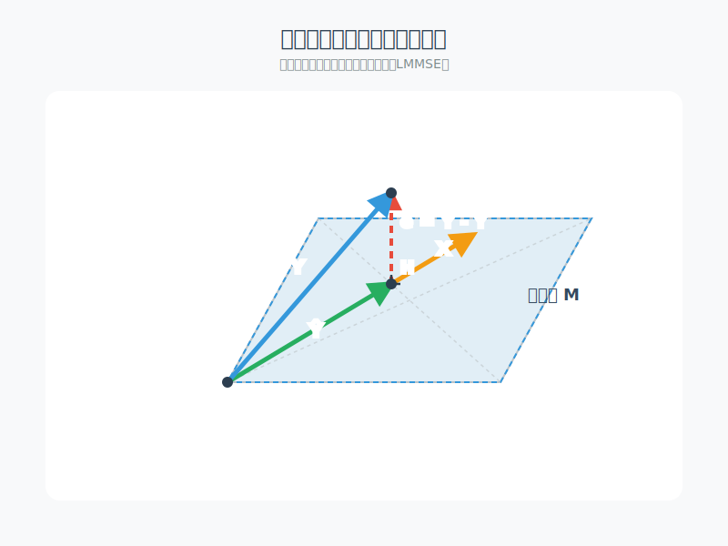

 <h1 id="第四讲-Cramér-Rao-下界" style="text-align: center; margin-bottom: 2rem; border-bottom: none;">第四讲 Cramér-Rao 下界</h1> 
 

  
  
  
 

## 1. CRLB 与 Fisher 信息量回顾

在前面，我们介绍了参数估计的概念，并讨论了无偏估计和有偏估计的区别。我们还提到了均方误差（MSE）作为评估估计量性能的一个重要指标，同时简要介绍了 Fisher 信息量和 CRLB 的基本形式。

### 1.1 方差下界与 Fisher 信息量

定义 Fisher 信息量为
$$
I(\theta) = \mathbb{E}\left[ \left( \frac{\partial}{\partial \theta} \log f(X, \theta) \right)^2 \right].
   \tag{4.1}$$
可得
$$
\operatorname{Var}(\hat{\theta}(X)) = \mathbb{E}\bigl[ (\hat{\theta}(X) - \theta)^2 \bigr] \ge \overset{CRLB}{\boxed{\frac{1}{I(\theta)}}}.
   \tag{4.2}$$
这就是 Cramér-Rao 下界：任何无偏估计的方差至少为 Fisher 信息量的倒数。

Fisher 信息量的另一种计算形式常用于实际计算（因为二阶导的期望往往更容易处理）：
$$
\mathbb{E}\left[\left(\frac{\partial}{\partial\theta}\log f\right)^2\right] = -\mathbb{E}\left[\frac{\partial^2}{\partial\theta^2}\log f\right].
   \tag{4.3}$$

## 2. CRLB 的扩展

接下来我们对 CRLB 做两方面的扩展。在之前的课程中我们假设：
$$
X_1, X_2, \dots, X_n \sim f(x, \theta),\quad \hat{\theta}(X) \text{ 是参数的无偏估计}, \ \mathbb{E}[\hat{\theta}(X)] = \theta.
   \tag{4.4}$$

### 2.1 扩展1：估计的目标从参数本身扩展到参数的某个函数 $g(\theta)$

在实际统计建模中，观测数据往往来自某个参数分布族 $f(x;\theta)$，而 $\theta$ 本身可能只是中间变量。**真正关心的常常是 $\theta$ 的某个函数 $g(\theta)$**。下面列举几个常见原因。

---

#### 2.1.1 实际问题的物理或工程意义

很多情况下，模型参数 $\theta$ 不是直接可测量的量，但它的某种变换才有直接的现实解释。  
**例子（飞行器追踪）**：  
假设我们只能观测到飞行器在时刻 $t$ 的位置 $X_t$，模型为  
$$
X_t = \theta_0 + \theta_1 t + \frac{1}{2}\theta_2 t^2 + \varepsilon_t,
   \tag{4.5}$$  
其中 $\theta_0$ 是初始位置，$\theta_1$ 是初始速度，$\theta_2$ 是加速度。我们可能并不关心 $\theta_0,\theta_1,\theta_2$ 本身，而是想知道**瞬时速度** $v(t)=\theta_1+\theta_2 t$，或者**加速度** $\theta_2$，或者**未来某时刻的位置** $g(\theta)=\theta_0+\theta_1 t_0+\frac{1}{2}\theta_2 t_0^2$。这些都需要估计参数的函数。

---

#### 2.1.2 参数变换使解释更自然

有时参数 $\theta$ 的原始定义与人们常用的指标不一致。  
**例子（逻辑回归中的 LD50）**：  
在毒理学实验中，剂量 $x$ 与死亡概率的关系为 $\log\frac{p}{1-p}=\alpha+\beta x$。参数 $(\alpha,\beta)$ 本身含义不直观，但 **半数致死剂量（LD50）** 定义为 $x_{0.5}=-\alpha/\beta$，这是实际关心的量。我们需要估计 $g(\alpha,\beta)=-\alpha/\beta$。

---

#### 2.1.3 参数冗余或模型重参数化

某些模型参数可能意义重叠，或为了计算方便我们使用另一种参数化，但最终要还原成有意义的量。  
**例子（正态分布）**：  
若观测 $X_1,\dots,X_n\sim N(\mu,\sigma^2)$，我们可能想估计**变异系数** $\gamma=\sigma/\mu$（对于 $\mu>0$）。虽然 $(\mu,\sigma)$ 是原始参数，但实际应用（如金融风险、生物变异）中 $\gamma$ 更直接。

---

#### 2.1.4 多个参数的线性或非线性组合

在回归分析中，我们常要估计**预测均值**或**预测区间**，这些是参数向量的函数。  
**例子（线性回归）**：  
模型 $Y_i=\beta_0+\beta_1 x_i+\varepsilon_i$，我们不仅关心 $\beta_1$（斜率），还关心**在 $x=x_0$ 处的期望响应** $g(\beta_0,\beta_1)=\beta_0+\beta_1 x_0$。这同样是参数函数。

---

#### 2.1.5 从统计推断理论看

即使只估计 $\theta$ 本身，也必须考虑函数 $g(\theta)$ 的估计：因为**参数变换下的不变性**——若 $\hat\theta$ 是 $\theta$ 的 UMVUE，在非线性变换下 $g(\hat\theta)$ 通常不再是 $g(\theta)$ 的 UMVUE（甚至可能不是无偏的）。因此我们需要专门的方法（如 delta 方法、重新参数化的 Cramér-Rao 下界等）来估计 $g(\theta)$。

---

#### 2.1.6 总结

需要估计参数函数 $g(\theta)$ 的根本原因是：**模型参数 $\theta$ 往往只是数学模型中的中间变量，而实际决策或科学解释需要的是它的某个变换**。从飞行器的速度、加速度，到毒理学中的 LD50，再到经济中的弹性，这些量都无法通过直接观测得到，必须从数据中通过估计参数再计算其函数来获得。因此，统计理论必须覆盖“估计参数函数”这一更一般的任务。

---

#### 2.1.7 CRLB 对于参数函数的一般形式

现在假设我们想要估计 $\theta$ 的某个函数 $g(\theta)$，并设 $\hat{g}(X)$ 是 $g(\theta)$ 的一个无偏估计，即 $\mathbb{E}[\hat{g}(X)] = g(\theta)$。将期望写为积分形式：
$$
g(\theta) = \int_{-\infty}^{\infty} \hat{g}(x) f(x, \theta) dx.   \tag{4.6}$$
对 (4.6) 两边关于 $\theta$ 求导（假设积分与求导可交换），得
$$
g'(\theta) = \int_{-\infty}^{\infty} \hat{g}(x) \frac{\partial}{\partial\theta} f(x, \theta) dx
= \int_{-\infty}^{\infty} \hat{g}(x) \left( \frac{\partial}{\partial\theta} \log f(x, \theta) \right) f(x, \theta) dx.   \tag{4.7}$$
同时，利用概率密度函数的归一化条件 $\int f(x,\theta) dx = 1$，两边求导得
$$
0 = \int_{-\infty}^{\infty} \frac{\partial}{\partial\theta} f(x, \theta) dx
= \int_{-\infty}^{\infty} \left( \frac{\partial}{\partial\theta} \log f(x, \theta) \right) f(x, \theta) dx.   \tag{4.8}$$
将 (4.8) 两边乘以 $g(\theta)$，得到
$$
0 = \int_{-\infty}^{\infty} g(\theta) \left( \frac{\partial}{\partial\theta} \log f(x, \theta) \right) f(x, \theta) dx.   \tag{4.9}$$
用 (4.7) 减去 (4.9)，得到关键等式：
$$
g'(\theta) = \int_{-\infty}^{\infty} \bigl( \hat{g}(x) - g(\theta) \bigr) \left( \frac{\partial}{\partial\theta} \log f(x, \theta) \right) f(x, \theta) dx.   \tag{4.10}$$
对 (4.10) 应用 Cauchy-Schwarz 不等式，可得
$$
\bigl( g'(\theta) \bigr)^2 \le \mathbb{E}\bigl[ (\hat{g}(X) - g(\theta))^2 \bigr] \cdot \mathbb{E}\left[ \left( \frac{\partial}{\partial\theta} \log f(X, \theta) \right)^2 \right].
  \tag{4.11}$$
因此，
$$
\mathbb{E}\bigl[ (\hat{g}(X) - g(\theta))^2 \bigr] \ge \frac{ \bigl( g'(\theta) \bigr)^2 }{ I(\theta) }.   \tag{4.12}$$
当 $g(\theta) = \theta$ 时，$g'(\theta)=1$，上式退化为经典 CRLB。

---

### 2.2 扩展2：多维 CRLB

在多参数估计问题中，给定数据 $X = (X_1, \dots, X_n)$，我们需要估计一个参数向量 $\boldsymbol{\theta} = (\theta_1, \dots, \theta_m)$。对于无偏估计 $\hat{\boldsymbol{\theta}} = (\hat{\theta}_1, \dots, \hat{\theta}_m)$，Cramér‑Rao 下界是一个矩阵不等式：

$$
\operatorname{Cov}[\hat{\boldsymbol{\theta}}] \;\succeq\; I(\boldsymbol{\theta})^{-1},   \tag{4.13}$$

其中 $I(\boldsymbol{\theta})$ 是 **Fisher 信息矩阵**，$\succeq$ 表示矩阵半正定偏序（$A \succeq B$ 意味着 $A-B$ 半正定）。直观上，估计量之间往往不独立，因此下界必须以协方差矩阵形式刻画，而非仅仅个体方差。

---

#### 2.2.1 协方差矩阵

对于无偏估计 $\hat{\boldsymbol{\theta}}$（即 $\mathbb{E}[\hat{\boldsymbol{\theta}}] = \boldsymbol{\theta}$），其协方差矩阵定义为

$$
\operatorname{Cov}[\hat{\boldsymbol{\theta}}] = \mathbb{E}\bigl[ (\hat{\boldsymbol{\theta}} - \mathbb{E}[\hat{\boldsymbol{\theta}}])(\hat{\boldsymbol{\theta}} - \mathbb{E}[\hat{\boldsymbol{\theta}}])^\top \bigr] = \mathbb{E}\bigl[ (\hat{\boldsymbol{\theta}} - \boldsymbol{\theta})(\hat{\boldsymbol{\theta}} - \boldsymbol{\theta})^\top \bigr].   \tag{4.14}$$

这是一个 $m \times m$ 的半正定矩阵，对角线元素为各分量的方差，非对角线元素为分量间的协方差。

---

#### 2.2.2 Fisher 信息矩阵

Fisher 信息矩阵 $I(\boldsymbol{\theta})$ 基于得分向量的外积期望。得分向量是 $\log f(x;\boldsymbol{\theta})$ 关于 $\boldsymbol{\theta}$ 的梯度：

$$
\nabla_{\boldsymbol{\theta}} \log f(x;\boldsymbol{\theta}) = \left( \frac{\partial}{\partial\theta_1}\log f,\; \frac{\partial}{\partial\theta_2}\log f,\; \dots,\; \frac{\partial}{\partial\theta_m}\log f \right)^\top.   \tag{4.15}$$

则信息矩阵定义为

$$
I(\boldsymbol{\theta}) = \mathbb{E}\left[ \bigl( \nabla_{\boldsymbol{\theta}}\log f(X;\boldsymbol{\theta}) \bigr) \bigl( \nabla_{\boldsymbol{\theta}}\log f(X;\boldsymbol{\theta}) \bigr)^\top \right].   \tag{4.16}$$

在正则条件下，信息矩阵也可以表示为负的 Hessian 矩阵期望：

$$
I(\boldsymbol{\theta}) = -\mathbb{E}\left[ H_{\boldsymbol{\theta}}\bigl( \log f(X;\boldsymbol{\theta}) \bigr) \right],   \tag{4.17}$$

其中 Hessian 矩阵 $H_{\boldsymbol{\theta}}$ 的第 $(i,j)$ 元素为 $\frac{\partial^2}{\partial\theta_i\partial\theta_j}\log f$。

---

#### 2.2.3 估计参数函数的多维 CRLB

更一般地，我们往往需要估计 $\boldsymbol{\theta}$ 的某个函数 $\boldsymbol{g}(\boldsymbol{\theta}) = (g_1(\boldsymbol{\theta}), \dots, g_k(\boldsymbol{\theta}))^\top$（$k \le m$）。设 $\hat{\boldsymbol{g}}$ 是 $\boldsymbol{g}(\boldsymbol{\theta})$ 的任意无偏估计，则其协方差矩阵满足

$$
\operatorname{Cov}[\hat{\boldsymbol{g}}] \;\succeq\; J_{\boldsymbol{g}}(\boldsymbol{\theta})\; I(\boldsymbol{\theta})^{-1}\; J_{\boldsymbol{g}}(\boldsymbol{\theta})^\top,   \tag{4.18}$$

其中 $J_{\boldsymbol{g}}(\boldsymbol{\theta})$ 是 $\boldsymbol{g}$ 的 **Jacobian 矩阵**（$k \times m$），其元素为 $(J_{\boldsymbol{g}})_{ij} = \frac{\partial g_i}{\partial \theta_j}$。

下面我们使用 **打洞消元法（Schur complement）** 详细证明 (4.18)。先预备半正定矩阵的分块性质。

---

##### 2.2.3.1 预备知识：半正定性定义与分块对角矩阵的半正定条件

**半正定矩阵的定义**  
一个实对称矩阵 $M$ 称为**半正定**（记作 $M \succeq 0$），如果对任意列向量 $\boldsymbol{v}$（维数匹配），有 $\boldsymbol{v}^\top M \boldsymbol{v} \ge 0$。特别地，协方差矩阵都是半正定的。

**分块对角矩阵的半正定充要条件**  
**引理**：设 $M = \begin{pmatrix} A & 0 \\ 0 & B \end{pmatrix}$ 是分块对角矩阵，其中 $A$ 和 $B$ 是对称方阵（不一定同阶）。则 $M \succeq 0$ 当且仅当 $A \succeq 0$ 且 $B \succeq 0$。

**证明**：  
任取向量 $\boldsymbol{w} = (\boldsymbol{u}^\top, \boldsymbol{v}^\top)^\top$，则  
$$
\boldsymbol{w}^\top M \boldsymbol{w} = \boldsymbol{u}^\top A \boldsymbol{u} + \boldsymbol{ v}^\top B \boldsymbol{v}.
  \tag{4.19}$$  
（必要性）若 $M \succeq 0$，取 $\boldsymbol{v}=0$ 得 $\boldsymbol{u}^\top A \boldsymbol{u} \ge 0$ 对所有 $\boldsymbol{u}$ 成立，故 $A \succeq 0$；同理取 $\boldsymbol{u}=0$ 得 $B \succeq 0$。  
（充分性）若 $A \succeq 0$ 且 $B \succeq 0$，则 $\boldsymbol{u}^\top A \boldsymbol{u} \ge 0$ 且 $\boldsymbol{v}^\top B \boldsymbol{v} \ge 0$，因此 $\boldsymbol{w}^\top M \boldsymbol{w} \ge 0$ 对所有 $\boldsymbol{w}$ 成立，故 $M \succeq 0$。 ∎

---

##### 2.2.3.2 打洞消元法证明 (4.18)

**步骤 1：构造联合协方差矩阵（涉及得分向量与待估计量）**

设 $S = \nabla_{\boldsymbol{\theta}} \log f(X;\boldsymbol{\theta})$ 为得分向量。在正则条件下，$\mathbb{E}[S] = \mathbf{0}$，$\operatorname{Cov}(S) = I(\boldsymbol{\theta})$。记 $\hat{\boldsymbol{g}}$ 为 $\boldsymbol{g}(\boldsymbol{\theta})$ 的任意无偏估计，即 $\mathbb{E}[\hat{\boldsymbol{g}}] = \boldsymbol{g}(\boldsymbol{\theta})$。

考虑 $(k+m)$ 维随机向量 $\begin{pmatrix} \hat{\boldsymbol{g}} \\ S \end{pmatrix}$。计算其协方差矩阵 $\Sigma$：

- $\Sigma_{11} = \operatorname{Cov}(\hat{\boldsymbol{g}}) = \mathbb{E}[(\hat{\boldsymbol{g}} - \boldsymbol{g})(\hat{\boldsymbol{g}} - \boldsymbol{g})^\top]$。
- $\Sigma_{12} = \operatorname{Cov}(\hat{\boldsymbol{g}}, S) = \mathbb{E}[(\hat{\boldsymbol{g}} - \boldsymbol{g}) S^\top]$（因为 $\mathbb{E}[S]=0$）。
- $\Sigma_{21} = \Sigma_{12}^\top$。
- $\Sigma_{22} = \operatorname{Cov}(S) = I(\boldsymbol{\theta})$。

我们需要 $\Sigma_{12}$ 的具体形式。对 $\boldsymbol{g}(\boldsymbol{\theta}) = \mathbb{E}[\hat{\boldsymbol{g}}]$ 两边关于 $\boldsymbol{\theta}$ 求导（梯度），得

$$
\nabla_{\boldsymbol{\theta}} \boldsymbol{g}(\boldsymbol{\theta}) = J_{\boldsymbol{g}}(\boldsymbol{\theta}) = \frac{\partial}{\partial \boldsymbol{\theta}} \mathbb{E}[\hat{\boldsymbol{g}}] = \mathbb{E}\bigl[ \hat{\boldsymbol{g}} \, S^\top \bigr],   \tag{4.20}$$

因为 $\frac{\partial}{\partial \theta_j} \int \hat{g}_i f dx = \int \hat{g}_i \frac{\partial f}{\partial \theta_j} dx = \mathbb{E}[\hat{g}_i S_j]$。又 $\mathbb{E}[S]=0$，所以

$$
\mathbb{E}[(\hat{\boldsymbol{g}} - \boldsymbol{g}) S^\top] = \mathbb{E}[\hat{\boldsymbol{g}} S^\top] - \boldsymbol{g} \underbrace{\mathbb{E}[S^\top]}_{0} = J_{\boldsymbol{ g}}(\boldsymbol{\theta}).
  \tag{4.21}$$

因此 $\Sigma_{12} = J_{\boldsymbol{g}}(\boldsymbol{\theta})$（$k \times m$ 矩阵）。于是

$$
\Sigma = \begin{pmatrix}
\operatorname{Cov}(\hat{\boldsymbol{g}}) & J_{\boldsymbol{g}} \\
J_{\boldsymbol{g}}^\top & I(\boldsymbol{\theta})
\end{pmatrix}.   \tag{4.22}$$

此矩阵是半正定的，因为它是随机向量的协方差矩阵。

**步骤 2：构造合同变换矩阵**

为了消去右上角 $J_{\boldsymbol{g}}$，我们使用如下分块下三角矩阵（注意维度：左上 $k\times k$，右下 $m\times m$）：

$$
L = \begin{pmatrix}
I_k & -J_{\boldsymbol{g}} \, I(\boldsymbol{\theta})^{-1} \\
0 & I_m
\end{pmatrix}.   \tag{4.23}$$

这里假设 $I(\boldsymbol{\theta})$ 正定（可逆）。计算 $L \Sigma L^\top$。

*先计算 $L\Sigma$*：

$$
L\Sigma = \begin{pmatrix}
I_k & -J_{\boldsymbol{g}} I^{-1} \\
0 & I_m
\end{pmatrix}
\begin{pmatrix}
\Sigma_{11} & J_{\boldsymbol{g}} \\
J_{\boldsymbol{g}}^\top & I
\end{pmatrix}
= \begin{pmatrix}
\Sigma_{11} - J_{\boldsymbol{g}} I^{-1} J_{\boldsymbol{g}}^\top & J_{\boldsymbol{g}} - J_{\boldsymbol{g}} I^{-1} I \\
J_{\boldsymbol{g}}^\top & I
\end{pmatrix}
= \begin{pmatrix}
\Sigma_{11} - J_{\boldsymbol{g}} I^{-1} J_{\boldsymbol{g}}^\top & 0 \\
J_{\boldsymbol{g}}^\top & I
\end{pmatrix}.   \tag{4.24}$$

其中右上块：$J_{\boldsymbol{g}} - J_{\boldsymbol{g}} I^{-1} I = J_{\boldsymbol{g}} - J_{\boldsymbol{g}} = 0$。

*然后右乘 $L^\top$*。注意

$$
L^\top = \begin{pmatrix}
I_k & 0 \\
- (J_{\boldsymbol{g}} I^{-1})^\top & I_m
\end{pmatrix}
= \begin{pmatrix}
I_k & 0 \\
- I^{-1} J_{\boldsymbol {g}}^\top & I_m
\end{pmatrix},
  \tag{4.25}$$

因为 $(J_{\boldsymbol{g}} I^{-1})^\top = (I^{-1})^\top J_{\boldsymbol{g}}^\top = I^{-1} J_{\boldsymbol{g}}^\top$（$I$ 对称）。于是

$$
(L\Sigma) L^\top = \begin{pmatrix}
\Sigma_{11} - J_{\boldsymbol{g}} I^{-1} J_{\boldsymbol{g}}^\top & 0 \\
J_{\boldsymbol{g}}^\top & I
\end{pmatrix}
\begin{pmatrix}
I_k & 0 \\
- I^{-1} J_{\boldsymbol{g}}^\top & I_m
\end{pmatrix}
= \begin{pmatrix}
(\Sigma_{11} - J_{\boldsymbol{g}} I^{-1} J_{\boldsymbol{g}}^\top) I_k + 0 & 0 \\
J_{\boldsymbol{g}}^\top I_k + I(- I^{-1} J_{\boldsymbol{g}}^\top) & 0 + I I_m
\end{pmatrix}.
  \tag{4.26}$$

计算各块：

- 左上：$\Sigma_{11} - J_{\boldsymbol{g}} I^{-1} J_{\boldsymbol{g}}^\top$
- 右上：$0$
- 左下：$J_{\boldsymbol{g}}^\top - J_{\boldsymbol{g}}^\top = 0$
- 右下：$I$

因此得到

$$
L \Sigma L^\top = \begin{pmatrix}
\operatorname{Cov}(\hat{\boldsymbol{g}}) - J_{\boldsymbol{g}} I(\boldsymbol{\theta})^{-1} J_{\boldsymbol{g}}^\top & 0 \\
0 & I(\boldsymbol{\theta})
\end{pmatrix}.   \tag{4.27}$$

**步骤 3：利用半正定性（分块对角矩阵的引理）**

- $\Sigma$ 半正定：$\Sigma$ 是随机向量的协方差矩阵，故对任意非零向量 $\boldsymbol{v}$，$\boldsymbol{v}^\top \Sigma \boldsymbol{v} = \operatorname{Var}(\boldsymbol{v}^\top (\hat{\boldsymbol{g}}, S)) \ge 0$，因此 $\Sigma \succeq 0$。
- 合同变换保持半正定性：$L$ 可逆，对任意 $\boldsymbol{w}$，令 $\boldsymbol{v} = L^\top \boldsymbol{w}$，则 $\boldsymbol{w}^\top (L \Sigma L^\top) \boldsymbol{w} = \boldsymbol{v}^\top \Sigma \boldsymbol{v} \ge 0$，故 $L \Sigma L^\top \succeq 0$。
- 由 (4.27) 知 $L \Sigma L^\top$ 是分块对角矩阵。根据前述引理，分块对角矩阵半正定当且仅当每个对角块半正定。于是
  $$
  \operatorname{Cov}(\hat{\boldsymbol{g}}) - J_{\boldsymbol{g}} I(\boldsymbol{\theta})^{-1} J_{\boldsymbol{g}}^\top \succeq 0, \quad \text{且} \quad I( \boldsymbol{\theta}) \succeq 0.
    \tag{4.28}$$
  由于 $I(\boldsymbol{\theta})$ 通常正定，第一个不等式即是
  $$
  \operatorname{Cov}(\hat{\boldsymbol{g}}) \succeq J_{\boldsymbol{g}}(\boldsymbol{\theta})\, I(\boldsymbol{\theta})^{-1}\, J_{\boldsymbol{g}}(\boldsymbol{\theta})^\top.   \tag{4.29}$$

这就完成了 (4.18) 的证明。

---

#### 2.2.4 注记

- 当 $\boldsymbol{g}(\boldsymbol{\theta}) = \boldsymbol{\theta}$ 时，$J_{\boldsymbol{g}} = I_m$，则 (4.29) 退化为 $\operatorname{Cov}(\hat{\boldsymbol{\theta}}) \succeq I(\boldsymbol{\theta})^{-1}$，即 (4.13) 的正确形式。
- 该证明不要求 $\hat{\boldsymbol{g}}$ 是 $\hat{\boldsymbol{\theta}}$ 的函数，只要求 $\hat{\boldsymbol{g}}$ 无偏且与得分向量的协方差恰为 Jacobian 矩阵，这由无偏性求导得到。
- (11) 中的矩阵形式必须是 $J_{\boldsymbol{g}} I(\boldsymbol{\theta})^{-1} J_{\boldsymbol{g}}^\top$，若误写为 $J_g I(\theta) J_g^\top$ 则量纲错误。

---

### 2.3 CRLB 小结

Cramér‑Rao 下界给出了正则条件下无偏估计方差的理论下限，但它本身**不是一个估计方法**，也**不提供如何构造 $\hat{\theta}$ 的公式**。它的作用体现在以下几个方面：

- **评价基准**：任何无偏估计的方差都不可能低于 CRLB。若某个估计的方差恰好等于 CRLB，则称其为**有效估计**，表明它已经用尽了数据中的 Fisher 信息。
- **判断改进空间**：通过计算 CRLB，可以判断现有估计是否还有改进余地。例如，若 $\operatorname{Var}(\hat{\theta}) > 1/I(\theta)$，则理论上存在方差更小的无偏估计（如通过 Rao‑Blackwell 或 Lehmann‑Scheffé 改进）。
- **不依赖具体估计量**：CRLB 只依赖于分布族 $f(x;\theta)$，与采用的估计量形式无关。因此它适合作为**先验的性能界限**。

然而，CRLB 并不能直接用于计算 $\hat{\theta}$。要获得具体的估计量，仍需借助其他方法，例如：
- **矩估计**、**最大似然估计**、**贝叶斯估计**；
- 或利用充分完备统计量的 Lehmann‑Scheffé 定理构造 UMVUE。

接下来，我们将介绍一类在实际中广泛使用的估计方法——**线性估计**，它不要求分布的具体形式，只利用样本的一阶和二阶矩，且其方差可以与 CRLB 进行比较。

## 3. 线性估计

### 3.1 线性估计的基本思想

回顾我们在前面课程中得到的核心结论：对于随机变量 $Y$ 和观测数据 $X$，在均方误差准则下，最优预测函数是条件期望  
$$
g_{\text{opt}}(X) = \mathbb{E}[Y \mid X].
  \tag{4.30}$$  
这个结果不依赖于任何分布假设，理论优美且具有最小方差性质。然而，在实际应用中，直接使用条件期望 $\mathbb{E}[Y \mid X]$ 往往面临三个困难：

1. **需要知道完整的联合分布**：条件期望的计算依赖于 $Y$ 和 $X$ 的联合概率密度函数，这在许多实际问题中是未知的，或者只能通过大量数据才能近似。
2. **可能为非线性复杂函数**：即使分布已知，$\mathbb{E}[Y \mid X]$ 也可能是 $X$ 的复杂非线性函数（例如，当 $Y$ 与 $X$ 的关系呈周期、指数或分段形态时），导致计算和解释成本高昂。
3. **对模型偏差敏感**：若假定的分布与实际分布有偏离，基于该分布推导的条件期望可能表现很差。

为了克服这些不足，统计学和信号处理中发展出了一类实用的方法——**线性估计**。其核心思想是：**放弃在全体可测函数类中寻找最优，而是限制在更简单、易处理的函数类——线性（或仿射）函数类中求解最佳预测。**

具体地，我们考虑形如  
$$
\hat{Y} = g(X) = a + \boldsymbol{b}^\top X
  \tag{4.31}$$  
的估计量，其中 $X \in \mathbb{R}^n$，$Y \in \mathbb{R}^m$，$a$ 为标量（$m=1$ 时；$m>1$ 时 $a$ 为向量），$\boldsymbol{b}$ 为与 $X$ 维度相同的系数向量（或矩阵）。我们的目标是选择 $a$ 和 $\boldsymbol{b}$，使得均方误差 $d(Y, a + \boldsymbol{b}^\top X)$ = $\mathbb{E}[\|Y - a - \boldsymbol{b}^\top X\|^2]$ 达到最小。这是一个**线性最小均方误差（LMMSE）** 估计问题，其解仅依赖于 $Y$ 和 $X$ 的一阶矩（均值）和二阶矩（协方差矩阵），不需要完整的分布信息。

线性估计之所以重要，有三个原因：
- **计算简单**：解具有显式闭式解（涉及投影矩阵和协方差逆），适合高效计算。
- **稳健性**：只依赖矩条件，对分布的具体形式不敏感，在非高斯情况下仍保持最佳线性预测的性质。
- **可解释性**：系数 $\boldsymbol{b}$ 直接反映了每个分量对预测的边际贡献，便于工程应用。

此外，当 $(X,Y)$ 服从联合正态分布时，条件期望 $\mathbb{E}[Y \mid X]$ 恰好是 $X$ 的线性函数，此时线性估计等价于全局最优估计。因此，线性估计可以看作在“分布未知或非正态”情形下对最优非线性估计的**最佳线性近似**。

下面我们由简单到复杂，逐步推导最优线性估计的显式解。

---

### 3.2 标量情况：$m=1, n=1$

设 $X$ 和 $Y$ 都是实随机变量，我们考虑 最简单的线性模型  
$$
\hat{Y} = \alpha X,
  \tag{4.32}$$  
即没有常数项（零均值情形，或已中心化）。我们最小化均方误差  
$$
J(\alpha) = \mathbb{E}\big[(Y - \alpha X)^2\big].
  \tag{4.33}$$

**推导**：  
展开 $J(\alpha)$：  
$$
J(\alpha) = \mathbb{E}[Y^2] - 2\alpha\mathbb{E}[XY] + \alpha^2\mathbb{E}[X^2].
  \tag{4.34}$$  
对 $\alpha$ 求导并令为零：  
$$
\frac{dJ}{d\alpha} = -2\mathbb{E}[XY] + 2\alpha\mathbb{E}[X^2] = 0 \quad \Rightarrow \quad \alpha = \frac{\mathbb{E}[XY]}{\mathbb{E}[X^2]}.
  \tag{4.35}$$  
因此最优估计为  
$$
\boxed{\hat{Y} = \frac{\mathbb{E}[XY]}{\mathbb{E}[X^2]} X}.
  \tag{4.36}$$

**双线性视角（内积解释）**：  
在随机变量构成的 Hilbert 空间中，内积定义为 $\langle U, V \rangle = \mathbb{E}[UV]$。则 $\hat{Y}$ 恰好是 $Y$ 在 $X$ 方向上的投影：  
$$
\hat{Y} = \frac{\langle X, Y \rangle}{\|X\|^2} X = \frac{ \mathbb{E}[XY]}{\mathbb{E}[X^2]} X.
  \tag{4.37}$$  
这与向量空间中投影公式完全一致。

---

### 3.3 标量输出、多维输入：$m=1, n>1$

设 $X = (X_1, \dots, X_n)^\top$ 是 $n$ 维随机向量，$Y$ 是一维随机变量。我们考虑**无常数项**的线性估计  
$$
\hat{Y} = \boldsymbol{\theta}^ \top X = \sum_{k=1}^n \theta_k X_k.
  \tag{4.38}$$  
（注：若需要常数项，可先将变量中心化，或把常数视为 $X_0=1$ 引入，这里为简洁直接处理零均值情形。更一般的仿射估计可通过中心化后得到相同形式。）  
最小化均方误差  
$$
J(\boldsymbol{\theta}) = \mathbb{E}\big[(Y -  \boldsymbol{\theta}^\top X)^2\big].
  \tag{4.39}$$

**推导**：  
展开 $J$：  
$$
J = \mathbb{E}[Y^2] - 2\boldsymbol{\theta}^\top \mathbb{E}[XY] + \boldsymbol{\theta}^\top \mathbb{E}[XX^\top] \boldsymbol{\theta}.
  \tag{4.40}$$  
对 $\boldsymbol{\theta}$ 求梯度（向量导数）：  
$$
\frac{\partial J}{\partial \boldsymbol{\theta}} = -2\mathbb{E}[XY] + 2\,\mathbb{E}[XX^\top] \boldsymbol{\theta} = \boldsymbol{0}.
  \tag{4.41}$$  
记 $R_{XX} = \mathbb{E}[XX^\top]$（$n\times n$ 自相关矩阵），$R_{XY} = \mathbb{E}[XY]$（$n\times 1$ 互相关向量）。则最优 $\boldsymbol{\theta}$ 满足  
$$
R_{XX} \boldsymbol{\theta} = R_{XY}.
  \tag{4.42}$$  
若 $R_{XX}$ 正定（即 $X$ 的各分量线性无关），则  
$$
\boxed{\boldsymbol{\theta} = R_{XX}^{-1} R_{XY}}.
  \tag{4.43}$$

**最小均方误差**：  
$$
J_{\min} = \mathbb{E}[Y^2 ] - R_{XY}^\top R_{XX}^{-1} R_{XY}.
  \tag{4.44}$$

**注**：若数据非零均值，通常先中心化：令 $\tilde{X}=X-\mathbb{E}[X]$，$\tilde{Y}=Y-\mathbb{E}[Y]$，则上述形式完全适用，最终估计加上常数项 $\mathbb{E}[Y]$。

---

### 3.4 多维输出、多维输入：$m>1, n>1$

设 $Y \in \mathbb{R}^m$，$X \in \mathbb{R}^n$，考虑线 性估计  
$$
\hat{Y} = \Theta^\top X,
  \tag{4.45}$$  
其中 $\Theta$ 是 $n\times m$ 的系数矩阵（这里约定 $\Theta$ 的每一列对应一个输出分量的系数向量）。为了清晰，我们采用 $\hat{Y}_j = \sum_{i=1}^n \theta_{ij} X_i$，即 $\hat{Y} = \Theta^\top X$，$\Theta$ 为 $n\times m$。目标是最小化总均方误差  
$$
J(\Theta) = \sum_{j=1}^m \mathbb{E}\big[(Y_j - (\Theta^\top X)_j)^2\big] = \mathbb{E }\big[\|Y - \Theta^\top X\|^2\big].
  \tag{4.46}$$

**推导**：  
将 $J$ 写成矩阵迹形式：  
$$
J = \mathbb{E}\big[ (Y - \Theta^\top X)^\top (Y - \Theta^\top X) \big] = \mathbb{E}\big[ \operatorname{tr}\big((Y - \Theta^\top X)( Y - \Theta^\top X)^\top\big) \big].
  \tag{4.47}$$  
由迹的线性性质，  
$$
J = \operatorname{tr}\big( \mathbb{E}[YY^\top] \big) - 2 \operatorname{tr}\big( \mathbb{E}[X Y^\top] \Theta \big) + \operatorname{tr}\big( \Theta^\to p \mathbb{E}[XX^\top] \Theta \big).
  \tag{4.48}$$  
对 $\Theta$ 求矩阵导数。利用公式 $\frac{\partial}{\partial \Theta} \operatorname{tr}(C \Theta) = C^\top$ 和 $\frac{\partial}{\partial \Theta} \operatorname{tr}(\Theta^\top A \Theta) = 2 A \Theta$（当 $A$ 对称），得  
$$
\frac{\partial J}{\partial \Theta} = -2 \mathbb{E}[X Y^\top]  + 2 \mathbb{E}[XX^\top] \Theta = 0.
  \tag{4.49}$$  
令 $R_{XX} = \mathbb{E}[XX^\top]$（$n\times n$），$R_{XY} = \mathbb{E}[X Y^\top]$（$n\times m $）。则  
$$
R_{XX} \Theta = R_{XY}.
  \tag{4.50}$$  
若 $R_{XX}$ 可逆，  
$$
\boxed{\Theta = R_{XX}^{-1} R_{XY}}.
  \tag{4.51}$$

**最小均方误差矩阵**：  
估计误差协方差矩阵为  
$$
\mathbb{E}[(Y - \Theta^\top X)(Y - \Theta^\top X)^\top] = R_{YY } - R_{XY}^\top R_{XX}^{-1} R_{XY},
  \tag{4.52}$$  
其中 $R_{YY} = \mathbb{E}[YY^\top]$。总 MSE 为该矩阵的迹。

**注意**：该结果与 3.3 节形式一致，只是将向量 $R_{XY}$ 换成了矩阵 $R_{XY}$，且 $\Theta$ 的每一列独立地满足同样的方程。因此多维线性估计可以分解为多个独立的一维问题，但共享同一个 $R_{XX}^{-1}$。

---

### 3.5 连续时间下的最优估计（Wiener 滤波）

考虑连续时间平稳随机过程 $X(t)$ 和 $Y(t)$。我们希望通过对 $X$ 进行线性滤波来估计 $Y(t)$，即  
$$
\hat{Y}(t) = \int_{-\infty} ^{+\infty} h(t-\tau) X(\tau) d\tau,
  \tag{4.53}$$  
其中 $h_{opt}(\cdot)$ 是待求的冲激响应。我们的目标是最小化均方误差  
$$
\begin{aligned}
J(h) &= \mathbb{E}\left[ \big( Y(t) - \hat{Y}(t) \big)^2 \right] \\
&= \mathbb{E}\left[ \big( Y(t) - \int_{-\infty} ^{+\infty} h(t-\tau) X(\tau) d\tau \big)^2 \right] \\
\end{aligned}.
  \tag{4.54}$$

**假设**：过程为零均值（否则预先减去均值），且为平稳过程。定义自相关函数为 $R_{XX}(\tau) = \mathbb{E}[X(t)X(t-\tau)]$，互相关函数为 $R_{XY}(\tau) = \mathbb{E}[X(t)Y(t-\tau)]$。

**正交条件**：最优滤波器 $h_{opt}(\cdot)$ 应使残差 $e(t)=Y(t)-\hat{Y}(t)$ 与所有过去观测值正交，即对任意 $s$，  
$$
\begin{aligned}
\mathbb{E}[ e(t) X (t-\tau) ] &= \mathbb{E}\left[ \big( Y(t) - \int_{-\infty} ^{+\infty} h_{opt}(t-\tau) X(\tau) d\tau \big) X(s) \right] \\
&= 0, \quad \forall s \\
\end{aligned}
  \tag{4.55}$$  
将上式展开可得

$$
\mathbb{E}[ Y(t) X (s) ] - \int_{-\infty}^{+\infty} h_{opt}(t-\tau) \mathbb{E} [ X(t) X(s) ] d\tau = 0, \quad \forall s.
$$

因此，$X$ 与 $Y$ 的互相关函数满足

$$
R_{YX}(t-s) = \int_{-\infty}^{+\infty} h_{opt}(t-\tau) R_{XX}(\tau - s) ds, \quad \forall \tau.
  \tag{4.56}$$  

这就是 **Wiener‑Hopf 方程**。

下面进行换元化简：

**步骤 1：令 $\tau' = \tau - s$**

- 则 $\tau = \tau' + s$
- 微分 $d\tau' = d\tau$
- 当 $\tau$ 从 $-\infty$ 变化到 $+\infty$ 时，$\tau'$ 也相应地由 $-\infty$ 变化到 $+\infty$，因此积分限保持不变。

**步骤 2：代入 (4.56) 的右边**

右边变为：
$$
\int_{-\infty}^{+\infty} h_{opt}\big(t - (\tau' + s)\big) \cdot R_{XX}(\tau') \, d\tau'
= \int_{-\infty}^{+\infty} h_{opt}\big((t-s) - \tau'\big) \cdot R_{XX}(\tau') \, d\tau'.
$$

**步骤 3：对比卷积定义**

回顾卷积的**标准定义**：
$$
(f * g)(x) \triangleq \int_{-\infty}^{+\infty} f(x - \tau') \, g(\tau') \, d\tau'.
$$

在此式中，令：
- $x = t - s$
- $f = h_{opt}$
- $g = R_{XX}$

则上述积分恰好构成卷积：
$$
\int_{-\infty}^{+\infty} h_{opt}(x - \tau') \, R_{XX}(\tau') \, d\tau' = (h * R_{XX})(x).
$$

**步骤 4：代回原式**

此时左边为 $R_{YX}(t-s) = R_{YX}(x)$。

因此，(4.56) 等价于：
$$
\boxed{R_{YX}(x) = (h * R_{XX})(x)}.
$$

换回原始变量即为：
$$
\boxed{R_{YX}(t-s) = \int_{-\infty}^{+\infty} h_{opt}(t-\tau) \, R_{XX}(\tau - s) \, d\tau = (h * R_{XX})(t-s)}.
$$

$$
R_{YX}(t-s) = h \ast R_X(\tau)
$$

**频域求解**：对上式两边取傅里叶变换。设 $S_{XX}(\omega)$ 和 $S_{XY}(\omega)$ 分别为自功率谱和互功率谱，由卷积定理可得  
$$
S_{XY}( \omega) = H(\omega) S_{XX}(\omega),
  \tag{4.57}$$  
其中 $H(\omega) = \int h_{opt}(t) e^{-j\omega t} dt$ 为滤波器的传递函数。因此最优传递函数为  
$$
\boxed{H_{\text{opt}}(\omega) = \frac{S_{XY}(\omega)}{S_{XX}(\omega)}}.
  \tag{4.58}$$

**因果性约束**：实际物理系统要求 $h_{opt}(t)=0$（当 $t<0$ 时），即满足因果性。此时 Wiener‑Hopf 方程需采用谱分解法求解，以得到因果 Wiener 滤波器。不过，上面给出的非因果解（双边滤波）已在频域给出了闭式形式，与离散情形下的 $R_{XX}^{-1}R_{XY}$ 完全对应（只需将自相关矩阵替换为功率谱密度）。

---

### 3.6 投影、残差与正交化原理

以上所有线性估计的核心几何思想是 **正交投影**。在随机变量构成的 Hilbert 空间中（内积 $\langle U,V\rangle = \mathbb{E}[UV]$），考虑由 $X$ 的各个分量张成的线性子空间 $\mathcal{L} = \operatorname{span}\{X_1,\dots,X_n\}$。则最优线性估计 $\hat{Y}$ 正是 $Y$ 在 $\mathcal{L}$ 上的正交投影，满足：

1. $\hat{Y} \in \mathcal{L}$（线性性）；
2. 残差 $e = Y - \hat{Y}$ 与 $\mathcal{L}$ 中所有元素正交，即 $\langle e, X_i \rangle = 0$ 对所有 $i$，等价于 $\mathbb{E}[e X_i] = 0$。

这组正交条件恰好是我们在求导中得到的方程。对于包含常数项的仿射估计，只需将子空间扩展为 $\{1, X_1,\dots,X_n\}$。

**正交化原理**是自适应滤波（如 LMS 算法）的基础，它保证了投影的唯一性和最小距离性质。在实际应用中，当协方差矩阵未知时，我们常通过迭代方式逼近正交条件，从而得到递推自适应算法。

---

**总结**：线性估计统一在投影框架下，从标量到多维、从离散到连续，其最优解均由二阶统计量（自相关/互相关或功率谱）的简单运算给出。这一方法不仅计算简便，而且为后续的自适应滤波、卡尔曼滤波等提供了理论基础。

#### 3.6.1 投影几何

（注：图中展示了向量 $Y$ 在子空间 $M$ 上的正交投影 $\hat{Y}$，残差 $e = Y - \hat{Y}$ 与子空间垂直。）

---

## 4. 总结

### 4.1 CRLB 扩展

- **一维 CRLB**：对无偏估计 $\hat{\theta}$，$\operatorname{Var}(\hat{\theta}) \ge 1/I(\theta)$，$I(\theta)=\mathbb{E}[(\partial_\theta\log f)^2]$。
- **多维 CRLB**：对无偏估计 $\hat{\boldsymbol{\theta}}$，$\operatorname{Cov}(\hat{\boldsymbol{\theta}}) \succeq I(\boldsymbol{\theta})^{-1}$，$I(\boldsymbol{\theta})$ 为 Fisher 信息矩阵。
- **参数函数 CRLB**：对 $\boldsymbol{g}(\boldsymbol{\theta})$ 的无偏估计 $\hat{\boldsymbol{g}}$，$\operatorname{Cov}(\hat{\boldsymbol{g}}) \succeq J_{\boldsymbol{g}} I(\boldsymbol{\theta})^{-1} J_{\boldsymbol{g}}^{\top}$，$J_{\boldsymbol{g}}$ 为 Jacobian 矩阵。
- **几何解释**：Fisher 信息量 $I(\theta) = -\mathbb{E}[\ell''(\theta)]$ 是对数似然的平均曲率，曲率越大信息越多，CRLB 越小。

---

### 4.2 线性估计的四种情况及几何解释

| 情形 | 模型 | 最优参数 | 归一化因子（分母） | 内积（分子） | 几何含义 |
|------|------|----------|-------------------|--------------|----------|
| **标量 $m=1,n=1$ (零均值)** | $\hat{Y} = \alpha X$ | $\alpha = \dfrac{\mathbb{E}[XY]}{\mathbb{E}[X^2]}$ | $\mathbb{E}[X^2] = \|X\|^2$ | $\mathbb{E}[XY] = \langle X,Y \rangle$ | 投影系数 = $\dfrac{\langle X,Y \rangle}{\|X\|^2}$，即 $Y$ 在 $X$ 方向上的投影长度 |
| **标量 $m=1,n>1$ (零均值)** | $\hat{Y} = \boldsymbol{\theta}^{\top} X$ | $\boldsymbol{\theta} = R_{XX}^{-1} R_{XY}$ | $R_{XX}$（自相关矩阵） | $R_{XY}$（互相关向量） | $\hat{Y} = R_{XY}^{\top} R_{XX}^{-1} X$，即 $Y$ 在 $X$ 张成空间上的正交投影 |
| **多维 $m>1,n>1$ (零均值)** | $\hat{Y} = \Theta^{\top} X$ | $\Theta = R_{XX}^{-1} R_{XY}$ | $R_{XX}$ | $R_{XY}$（$n\times m$） | 每一列是 $Y_j$ 在 $X$ 上的投影系数，整体是子空间投影矩阵 |
| **连续时间（平稳）** | $\hat{Y}(t) = \int h(\tau) X(t-\tau)d\tau$ | $H(\omega) = \dfrac{S_{XY}(\omega)}{S_{XX}(\omega)}$ | $S_{XX}(\omega)$（功率谱） | $S_{XY}(\omega)$（互功率谱） | 频域投影：传递函数 = 互谱除以自谱，相当于在 Hilbert 空间中的投影 |

> **几何统一解释**：所有线性估计的最优系数都形如 **“协方差（内积）”除以“方差（能量）”**，即投影到观测张成的子空间上。标量时是除法，向量/矩阵时是乘以逆矩阵（相当于多维除法）。

---

### 4.3 线性代数中的投影公式

设 $A$ 是 $n\times m$ 列满秩矩阵，其列向量张成子空间 $\mathcal{C}(A)$。则向量 $X \in \mathbb{R}^n$ 到该子空间的正交投影为：

$$
\operatorname{Proj }_A X = A (A^\top A)^{-1} A^\top X.
  \tag{4.59}$$

- **几何含义**：$A(A^\top A)^{-1}A^\top$ 是投影矩阵，将任意向量映射到列空间上。
- **与线性估计的联系**：在随机变量空间，若用观测 $X_1,\dots,X_n$ 张成子空间，则 $Y$ 的投影为 $\hat{Y} = \mathbb{E}[Y X^\top] (\mathbb{E}[XX^\top])^{-1} X$，与代数投影公式 $A (A^\top A)^{-1} A^\top X$ 完全对应，只需将内积替换为数学期望。
- **归一化因子**：$(A^\top A)^{-1}$ 起到“除以能量”的作用；$A^\top X$ 是数据与观测的“内积”。

> **因此**：线性估计本质上是在随机变量构成的 Hilbert 空间中做正交投影，而投影矩阵的代数形式与经典线性代数完全一致，仅将欧氏内积换为 $\langle U,V\rangle = \mathbb{E}[UV]$。

---

### 4.4 学习检查清单

- [ ] 能写出多维 CRLB 的矩阵形式：$\operatorname{Cov}(\hat{\boldsymbol{\theta}}) \succeq I(\boldsymbol{\theta})^{-1}$，并说明矩阵不等式的含义
- [ ] 能推导参数函数的 CRLB：$\operatorname{Cov}(\hat{\boldsymbol{g}}) \succeq J_{\boldsymbol{g}} I(\boldsymbol{\theta})^{-1} J_{\boldsymbol{g}}^{\top}$
- [ ] 能解释 Fisher 信息矩阵的几何意义：对数似然的平均曲率
- [ ] 能说明线性估计的四种情况（标量/多维、零均值/非零均值）的统一形式
- [ ] 能写出线性估计的最优系数公式 $\boldsymbol{\theta} = R_{XX}^{-1} R_{XY}$，并说明其内积/能量的本质
- [ ] 能解释正交性原理：最优线性估计的误差与观测数据正交
- [ ] 能将线性估计与线性代数中的投影公式 $A(A^\top A)^{-1}A^\top$ 做类比
- [ ] 能计算简单模型（如正态均值、泊松速率）的 CRLB 并判断估计量是否有效

### 4.5 思考题

1. **CRLB 的"可达性"条件**：CRLB 给出了无偏估计方差的下界，但并非总是可达。Fisher 信息矩阵可逆但得分函数不与 $\hat\theta - \theta$ 成比例时，CRLB 是否还能达到？这个条件的概率含义是什么？

2. **线性估计与非线性估计的差距**：我们推导了线性估计的闭式解 $\boldsymbol{\theta} = R_{XX}^{-1} R_{XY}$。如果真实的最优估计是非线性的（如 $E[Y|X] \neq \alpha X$），线性估计丢失了多少信息？这个差距由什么决定？

3. **连续时间维纳滤波与离散时间线性估计的统一**：连续时间下滤波器传递函数为 $H(\omega) = S_{XY}(\omega)/S_{XX}(\omega)$，离散时间下系数为 $R_{XX}^{-1}R_{XY}$。两者在数学结构上有何对应？频域的"除法"为什么对应时域"乘以逆矩阵"？

4. **投影的几何直觉**：线性估计本质上是在做正交投影。如果观测数据 $X$ 之间高度相关（$R_{XX}$ 接近奇异），投影会出什么问题？这与之后要学的正则化方法有何关联？

5. **CRLB 与 Fisher 信息的"样本量缩放"**：$I_n(\theta) = n I_1(\theta)$ 意味着信息与样本量成正比。这是否意味着任何参数都可以通过增加样本量来任意精确地估计？是否存在 CRLB 不随 $n$ 衰减的情况？

