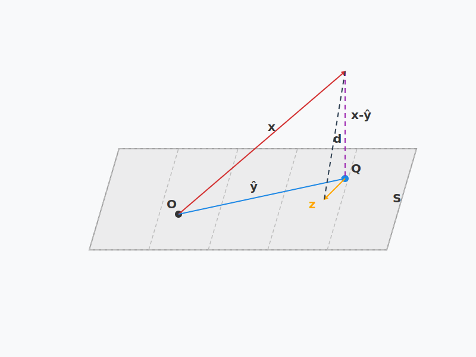
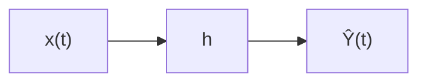
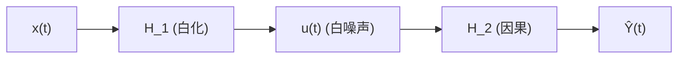

 <h1 id="第五讲-维纳滤波" style="text-align: center; margin-bottom: 2rem; border-bottom: none;">第五讲 维纳滤波</h1> 
 

  
  
  
 

---

## 1. 维纳滤波的基本概念

### 1.1 什么是滤波

滤波（Filtering）一词源于信号处理，最初指从含噪观测中提取有用信号的过程。在统计学和动态系统理论中，滤波的含义被大大扩展，泛指**利用观测数据对某个随时间（或序贯）变化的未知量进行估计**。通常我们把随时间变化的状态（或参数）记为 $\theta_1, \theta_2, \dots, \theta_n$，观测数据为 $X_1, X_2, \dots, X_n$。根据估计目标相对于当前时刻 $n$ 的位置，滤波问题分为三大类：

1. **滤波（Filtering）**：利用截至当前时刻的所有观测 $(X_1,\dots,X_n)$ 估计当前时刻的状态 $\theta_n$。这是实时处理的核心。
2. **平滑（Smoothing）** 或称内插：利用全部观测 $(X_1,\dots,X_n)$ 估计过去某个时刻的状态 $\theta_k$（$k<n$）。通常在离线后处理中使用。
3. **预测（Prediction）** 或称外插：利用截至当前时刻的观测 $(X_1,\dots,X_n)$ 估计未来某个时刻的状态 $\theta_k$（$k>n$）。用于预报、控制等领域。

从广义上讲，这三种问题统称为**滤波**，它们都试图从带噪声或部分观测的数据中恢复隐含的动态信号。

---

#### 1.1.1 滤波 (Filtering)

**定义**：给定观测序列 $X_1,\dots,X_n$，估计当前时刻的状态 $\theta_n$。  
**数学表达**：
$$
\hat{\theta}_{n|n} = \mathbb{E}[\theta_n \mid X_1,\dots,X_n]  \tag{5.1}$$
（在最小均方误差准则下，最优解是条件期望。）

**特点**：
- 要求算法能**在线**运行：每获得一个新观测 $X_n$，就立即更新对 $\theta_n$ 的估计。
- 实时性高，计算量需控制。
- 典型应用：雷达跟踪（实时估计目标当前位置）、金融高频数据滤波、自动驾驶中的状态估计。

**与经典参数估计的区别**：传统参数估计中 $\theta$ 是固定的，而这里 $\theta_n$ 随时间变化，通常假设是一个随机过程（如马尔可夫链）。因此滤波往往需要动态模型： $$
\begin{aligned}
\theta_n &= f(\theta_{n-1}, w_n) \quad &\text{(状态方程)} \\
X_n &= g(\theta_n, v_n) \quad &\text{(观测方程)}
\end{aligned}  \tag{5.2}$$
其中 $w_n, v_n$ 为过程噪声和观测噪声。

**经典算法**：卡尔曼滤波（线性高斯情况）、粒子滤波（非线性非高斯）。

---

#### 1.1.2 平滑 (Smoothing)

**定义**：利用全部观测 $X_1,\dots,X_n$ 估计过去某个时刻 $k<n$ 的状态 $\theta_k$。  
**数学表达**：
$$
\hat{\theta}_{k|n} = \mathbb{E}[\theta_k \mid X_1,\dots,X_n], \quad k<n  \tag{5.3}$$

**特点**：
- 属于**离线**处理：必须等到所有观测收集完毕才能估计过去的状态。
- 由于利用了“未来”数据，平滑估计的方差通常小于滤波估计（更多信息）。
- 按信息使用方式分为三类：
  - **固定区间平滑**：固定 $n$，对所有 $k=1,\dots,n$ 计算 $\hat{\theta}_{k|n}$。
  - **固定点平滑**：固定一个 $k$，随着 $n$ 增加不断更新 $\hat{\theta}_{k|n}$。
  - **固定滞后平滑**：固定滞后 $L$，估计 $\hat{\theta}_{n-L|n}$（接近实时但有固定延迟）。

**应用**：
- 气象数据分析（利用全月数据平滑过去几天的气温）。
- 离线轨迹重建（GPS 后处理）。
- 生物医学信号处理（心电图、脑电图的离线分析）。

**与滤波的关系**：平滑可以利用未来信息“回头”修正过去的估计，因此通常比滤波更精确。但无法实时应用。

---

#### 1.1.3 预测 (Prediction)

**定义**：利用截至当前时刻的观测 $X_1,\dots,X_n$ 估计未来某个时刻 $k>n$ 的状态 $\theta_k$。  
**数学表达**： $$
\hat{\theta}_{k|n} = \mathbb{E}[\theta_k \mid X_1,\dots,X_n], \quad k>n  \tag{5.4}$$

**特点**：
- 多步预测：$k=n+1$ 称为一步预测，$k=n+m$ 称为 $m$ 步预测。
- 预测的不确定性随着预测步长增加而增大（误差累积）。
- 必须依赖**状态转移模型**，即使在无观测时也能递推。

**应用**：
- 天气预报（预测未来温度、降雨）。
- 股票价格预测（风险控制）。
- 自动控制中的前馈控制（提前计算控制量）。

**与滤波的区别**：滤波估计当前状态（有当前观测支撑），预测则需推演模型而缺少新观测的修正。

---

#### 1.1.4 统一视角：贝叶斯序贯估计

三者都可以统一在贝叶斯框架下。设我们已知截至时刻 $n$ 的观测，求状态 $\theta_k$ 的后验分布：
$$
p(\theta_k \mid X_{1:n})  \tag{5.5}$$
- 当 $k=n$ 时 → 滤波
- 当 $k<n$ 时 → 平滑
- 当 $k>n$ 时 → 预测

这需要动态模型（状态方程和观测方程）以及初始分布。通过贝叶斯公式和状态转移的马尔可夫性质，可以递推地计算这些分布。在特定假设（线性高斯）下，最优解就是**卡尔曼滤波、卡尔曼平滑和卡尔曼预测**；在非线性非高斯下，则需用**粒子滤波**等数值方法。

---

#### 1.1.5 与 Wiener 滤波的关系

Wiener 滤波解决的是**平稳随机过程的线性最小均方误差估计**问题，它假设过程是平稳且已知二阶统计量。Wiener 滤波也可以应用于上述三种情况：

- **滤波**：用 $X(s), s\le t$ 估计 $Y(t)$（如信号去噪）。
- **平滑**：用全时间 $X(s), -\infty<s<\infty$ 估计 $Y(t)$（非因果滤波）。
- **预测**：用 $X(s), s\le t$ 估计 $Y(t+\Delta)$（预测滤波）。

但 Wiener 滤波要求过程平稳且已知相关函数，适用于时间不变系统。对于非平稳或时变系统，卡尔曼滤波更为合适。

---

#### 1.1.6 小结

| 类型 | 数据范围 | 估计目标 | 实时性 | 典型算法 |
|------|----------|----------|--------|----------|
| 滤波 | $X_{1:n}$ | $\theta_n$ | 在线 | 卡尔曼滤波、粒子滤波 |
| 平滑 | $X_{1:n}$ | $\theta_k\;(k<n)$ | 离线 | RTS 平滑、粒子平滑 |
| 预测 | $X_{1:n}$ | $\theta_k\;(k>n)$ | 在线/离线 | 卡尔曼预测、时间序列模型 |

广义上所有从观测中提取动态信号的过程都可称为滤波。理解这三类问题及其关系，是学习高级信号处理和动态状态估计的基础。

---

### 1.2 维纳滤波

#### 1.2.1 定义

维纳滤波是一种**线性最小均方误差（LMMSE）估计**方法，用于从与信号联合平稳的观测中恢复目标信号。它假设信号和噪声均为**零均值平稳随机过程**，且已知它们的自相关函数（或功率谱密度）。

设观测过程为 $X(t)$，目标信号为 $Y(t)$（可以是 $X(t)$ 本身、其平滑或预测形式），维纳滤波是一个线性时不变系统，输出为 $$
\hat{Y}(t) = \int_{-\infty}^{\infty} h(\tau) X(t-\tau) d\tau  \tag{5.6}$$
其中 $h(t)$ 是滤波器的冲激响应。最优 $h(t)$ 使均方误差最小：
$$
J = \mathbb{E}\left[ \bigl( Y(t) - \hat{Y}(t) \bigr)^2 \right]  \tag{5.7}$$
解满足 Wiener–Hopf 积分方程： $$
R_{YX}(\tau) = \int_{-\infty}^{\infty} h(u) R_{XX}(\tau - u) du, \quad \forall \tau  \tag{5.8}$$
其中 $R_{XX}(\tau)=\mathbb{E}[X(t)X(t-\tau)]$，$R_{YX}(\tau)=\mathbb{E}[Y(t)X(t-\tau)]$。在非因果（双边）情况下，频域解为
$$
H(\omega) = \frac{S_{YX}(\omega)}{S_{XX}(\omega)}  \tag{5.9}$$
这里 $S_{XX}(\omega)$ 和 $S_{YX}(\omega)$ 分别是自功率谱和互功率谱。

---

#### 1.2.2 特点

1. **最优线性滤波**：在已知二阶统计量的条件下，维纳滤波器是所有线性滤波器中最优的（最小均方误差）。  

   设观测向量 $X = (X_1, \dots, X_n)^\top$，估计量为 $$
   \hat{\theta} = a^\top X = \sum_{k=1}^n a_k X_k,  \tag{5.10}$$  
   其中 $a$ 是列向量。均方误差为  
   $$
   d(\theta, \hat{\theta}) = \mathbb{E}[(\theta - \hat{\theta})^2] = \mathbb{E}[(\theta - a^\top X)^2].  \tag{5.11}$$  
   最小化该误差： $$
   \min_{a} \mathbb{E}[(\theta - a^\top X)^2].  \tag{5.12}$$  
   展开得  
   $$
   \min_{a} \left\{ \mathbb{E}[\theta^2] - a^\top \mathbb{E}[\theta X] - \mathbb{E}[X^\top \theta] a + a^\top \mathbb{E}[X X^\top] a \right\}.  \tag{5.13}$$  
   对 $a$ 求导并令导数为零： $$
   -2 \mathbb{E}[\theta X] + 2 \mathbb{E}[X X^\top] a = 0,  \tag{5.14}$$  
   解得  
   $$
   a_{\text{opt}} = \big(\mathbb{E}[X X^\top]\big)^{-1} \mathbb{E}[X \theta].  \tag{5.15}$$  
   这就是线性最小均方误差估计的闭式解。

   **例（信号去噪）**：观测 $X_n = S_n + e_n$，其中 $S_n$ 是信号，$e_n$ 是噪声。使用维纳滤波估计 $\hat{S}_n$。假设：  
   - $\mathbb{E}[e_n] = 0$，  
   - $\mathbb{E}[e_n S_m] = 0$ 对所有 $n, m$（信号与噪声不相关），  
   - 信号与噪声各自平稳，已知其自相关矩阵。

   设 $X = (X_1, X_2, \dots, X_n)^\top$，$S = (S_1, \dots, S_n)^\top$，$e = (e_1, \dots, e_n)^\top$，则 $X = S + e$。

   维纳滤波估计 $\hat{S}_n$ 的形式为 $\hat{S}_n = a^\top X$，其中 $a = (a_1, \dots, a_n)^\top$ 是系数向量。最小均方误差解为 $$
   a_{\text{opt}} = \big(\mathbb{E}[X X^\top]\big)^{-1} \mathbb{E}[X S_n].  \tag{5.16}$$

   计算 $\mathbb{E}[X X^\top]$：
   $$
   \mathbb{E}[X X^\top] = \mathbb{E}[(S+e)(S+e)^\top] = \mathbb{E}[S S^\top] + \mathbb{E}[S e^\top] + \mathbb{E}[e S^\top] + \mathbb{E}[e e^\top].  \tag{5.17}$$
   由于信号与噪声不相关，$\mathbb{E}[S e^\top] = \mathbb{E}[S] \mathbb{E}[e^\top] = 0$（若均值为零，否则中心化后亦为零），同理 $\mathbb{E}[e S^\top]=0$。记 $$
   R_s = \mathbb{E}[S S^\top], \quad R_e = \mathbb{E}[e e^\top],  \tag{5.18}$$
   则
   $$
   \mathbb{E}[X X^\top] = R_s + R_e.  \tag{5.19}$$

   计算 $\mathbb{E}[X S_n]$： $$
   \mathbb{E}[X S_n] = \mathbb{E}[(S+e) S_n] = \mathbb{E}[S S_n] + \mathbb{E}[e S_n] = \mathbb{E}[S S_n] + 0.  \tag{5.20}$$
   记 $r_{ss_n} = \mathbb{E}[S S_n]$，这是一个 $n \times 1$ 列向量，其第 $i$ 个分量为 $\mathbb{E}[S_i S_n] = R_s(i,n)$，即信号自相关矩阵 $R_s$ 的第 $n$ 列。

   因此，最优系数向量为
   $$
   a_{\text{opt}} = (R_s + R_e)^{-1} \, r_{ss_n}.  \tag{5.21}$$
   这就是维纳滤波用于去噪时的标准结果：滤波器系数由信号与噪声的自相关矩阵决定，且只依赖于信号的自相关向量 $r_{ss_n}$。

   **最优线性滤波的均方误差**计算如下：

   设 $R_{XX} = \mathbb{E}[X X^\top]$，$r_{X\theta} = \mathbb{E}[X \theta]$（列向量）。最优系数为 $a_{\text{opt}} = R_{XX}^{-1} r_{X\theta}$。

   均方误差： $$
   J = \mathbb{E}\big[(\theta - a_{\text{opt}}^\top X)^2\big] = \mathbb{E}[\theta^2] - 2 a_{\text{opt}}^\top \mathbb{E}[X\theta] + a_{\text{opt}}^\top \mathbb{E}[X X^\top] a_{\text{opt}}.  \tag{5.22}$$

   对二次型直接配方，用符号 $R = \mathbb{E}[XX^\top]$（对称正定），$r = \mathbb{E}[X\theta]$（列向量），写出关于 $a$ 的二次型：
   $$
   J(a) = \mathbb{E}[\theta^2] - 2a^\top r + a^\top R a.  \tag{5.23}$$

   因为 $R$ 对称正定，可以通过加减常数项来配平方： $$
   a^\top R a - 2a^\top r = (a - R^{-1}r)^\top R (a - R^{-1}r) - r^\top R^{-1} r.  \tag{5.24}$$
   验证右边展开：
   $$
   (a - R^{-1}r)^\top R (a - R^{-1}r) = a^\top R a - a^\top r - r^\top a + r^\top R^{-1} r.  \tag{5.25}$$
   由于 $r^\top a = a^\top r$（标量），上式等于 $a^\top R a - 2a^\top r + r^\top R^{-1} r$。于是 $$
   (a - R^{-1}r)^\top R (a - R^{-1}r) - r^\top R^{-1} r = a^\top R a - 2a^\top r.  \tag{5.26}$$

   因此
   $$
   \begin{aligned}
   J(a) &= \mathbb{E}[\theta^2] + \big[ (a - R^{-1}r)^\top R (a - R^{-1}r) - r^\top R^{-1} r \big] \\
   & = \mathbb{E}[\theta^2] - r^\top R^{-1} r + (a - R^{-1}r)^\top R (a - R^{-1}r).\end{aligned}  \tag{5.27}$$

   由于 $R$ 正定，$(a - R^{-1}r)^\top R (a - R^{-1}r) \ge 0$，等号成立当且仅当 $a = R^{-1}r$。所以最优系数为 $a_{\text{opt}} = R^{-1}r = \boxed{R_{XX}^{-1} r_{X\theta}}$，此时最小均方误差为 $$
   J_{\min} = \mathbb{E}[\theta^2] - r^\top R^{-1} r = \underset{降低方差}{\boxed{\mathbb{E}[\theta^2] - r_{X\theta}^\top R_{XX}^{-1} r_{X\theta} \le \mathbb{E}[\theta^2]}} .  \tag{5.28}$$

   这就是通过配方法直接得到的结果，和前面计算得到的均方误差一致。这里我们得到了一个关键信息：**误差曲面是一个二次曲面**。

   从配方结果
   $$
   J(a) = \mathbb{E}[\theta^2] - r^\top R^{-1} r + (a - R^{-1}r)^\top R (a - R^{-1}r)  \tag{5.29}$$
   可以看到，$J(a)$ 是 $a$ 的二次函数。因为 $R = \mathbb{E}[XX^\top]$ 是正定矩阵（假设观测 $X$ 的各分量线性无关），所以二次项系数矩阵 $R$ 正定，这意味着 $J(a)$ 是一个**凸二次函数**，其等值面是超椭球面（二维为椭圆，三维为椭球）。整个曲面像一个“碗”形，有唯一的最小值点。

   **几何与优化意义**：
   - **唯一全局最小值**：由于正定性，$J(a)$ 是严格凸的，因此存在唯一的全局最小值点 $a_{\text{opt}} = R^{-1}r$。
   - **梯度下降可达最优**：误差曲面的梯度为 $\nabla J(a) = -2r + 2Ra$，在最小值处为零。这保证了任何基于梯度的优化算法（如最速下降法）都能收敛到全局最优。
   - **与正交投影的关系**：在 $X$ 张成的线性子空间上，$J(a)$ 的最小值对应于 $Y$ 到该子空间的正交投影。误差曲面在该点的 Hessian 矩阵恰好是 $2R$，反映了子空间的“度量”性质。

   **在 Wiener 滤波中的体现**：对于维纳滤波问题，$a$ 是滤波器系数。误差曲面是 $a$ 的二次函数，意味着维纳滤波器的性能（均方误差）随系数变化平滑且有唯一最优点。这为自适应滤波中的梯度下降算法（如 LMS）提供了理论基础：通过沿着误差曲面的负梯度方向逐步调整系数，最终可以逼近维纳解。

2. **需要先验统计知识**：必须已知 $R_{XX}$ 和 $R_{YX}$（或功率谱），这在实际中往往需要估计或建模。

3. **非因果与因果之分**：
   - **非因果维纳滤波器**：使用全部过去和未来的观测，性能最佳但物理不可实现（仅适用于离线批处理）。
   - **因果维纳滤波器**：只使用过去和当前的观测，物理可实现，但需要求解因果 Wiener–Hopf 方程（常用谱分解法），且性能略差。

4. **频域解释直观**：维纳滤波器的传递函数 $H(\omega)=S_{YX}(\omega)/S_{XX}(\omega)$ 可以理解为“信号与观测的相干性”除以“观测的功率谱”，在信噪比高的频段增益接近 1，信噪比低的频段增益接近 0。

5. **扩展应用**：维纳滤波不仅可以用于去噪（$Y(t)=X(t)$），还可以用于预测（$Y(t)=X(t+\Delta)$）和平滑（$Y(t)=X(t-\Delta)$），只需相应修改互功率谱 $S_{YX}(\omega)$。

6. **与卡尔曼滤波的关系**：维纳滤波适用于平稳过程，卡尔曼滤波则适用于非平稳过程，且能递推实现。当系统是时不变且平稳时，卡尔曼滤波稳态解退化为维纳滤波。

7. **局限性**：维纳滤波是线性的，对非线性问题效果不佳；且对模型偏差敏感，若实际相关函数与假设不符，性能会下降。

---

## 2. 维纳滤波解决的问题

Wiener 滤波是一种基于线性最小均方误差准则的最优估计方法，主要用于以下几类问题：

- **滤波（Filtering）**  
  从被噪声污染的观测信号中恢复原始信号。典型的模型为 $X(t)=S(t)+N(t)$，其中 $S(t)$ 是目标信号，$N(t)$ 是加性噪声，且假设二者相互独立、平稳且已知二阶统计量。Wiener 滤波器输出 $\hat{S}(t)$ 是 $S(t)$ 的最优线性估计。  
  **例子**：语音增强（从麦克风采集的带噪语音中恢复纯净语音）、雷达回波去噪、心电图（ECG）信号清洗。

- **预测（Prediction）**  
  根据过去和现在的观测值，预测未来时刻的信号值。例如已知 $X(s), s \le t$，估计 $X(t+\Delta)$，其中 $\Delta>0$ 为预测步长。预测问题广泛用于时间序列分析和自动控制。  
  **例子**：股票价格预测、气象预报（根据历史温度预测未来温度）、通信系统中的信道预测（用于自适应调制编码）。

- **平滑（Smoothing）**  
  利用整个观测区间（包括未来数据）来估计过去或现在的信号值。平滑通常是离线操作，因为需要用到“未来”的观测。由于信息更多，平滑估计的误差通常小于滤波估计。  
  **例子**：GPS 轨迹的后处理平滑、地震信号分析、生物医学信号中的心率变异性离线分析。

- **系统识别（System Identification）**  
  已知输入信号和带噪声的输出信号，估计未知系统的冲激响应 $h(t)$。假设系统是线性时不变的，且输入与噪声不相关。Wiener 滤波可以给出系统响应的最小均方误差估计。  
  **例子**：声学回声消除（估计房间冲激响应）、通信信道均衡、地震波传播路径反演。

- **其他应用**  
  Wiener 滤波还用于**多通道处理**（如麦克风阵列波束形成）、**逆滤波**（图像去模糊）等。在通信、雷达、控制、地震信号处理等领域有广泛应用。

总之，凡是满足“线性、平稳、已知二阶统计量”条件的估计问题，Wiener 滤波都能提供闭式解和性能下界。它既是信号处理理论的核心结果，也是许多自适应滤波算法的收敛目标。

---

## 3. 维纳滤波的核心原理

### 3.1 正交投影与最小均方误差

设 $H$ 是一个内积空间，$S \subset H$ 是 $H$ 的闭子空间（或有限维子空间）。给定 $x \in H$，考虑问题： $$
\hat{y} = \arg\min_{y \in S} \|x - y\|^2,  \tag{5.30}$$
即寻找 $S$ 中离 $x$ 最近的点。则 $\hat{y}$ 是 $x$ 在 $S$ 上的正交投影，其充要条件是残差 $e = x - \hat{y}$ 与子空间 $S$ 正交：
$$
\langle x - \hat{y}, z \rangle = 0, \quad \forall z \in S.  \tag{5.31}$$
等价地，$\langle \hat{y} - x, z \rangle = 0$。

**证明**：

#### 3.1.1 充分性：正交性 $\Rightarrow$ 极小性

若 $\hat{y} \in S$ 满足 $\langle x - \hat{y}, z \rangle = 0$ 对所有 $z \in S$ 成立。任取 $y \in S$，则 $y - \hat{y} \in S$。计算： $$
\begin{aligned}
\|x - y\|^2 &= \| (x - \hat{y}) + (\hat{y} - y) \|^2 \\
&= \|x - \hat{y}\|^2 + \|\hat{y} - y\|^2 + 2 \langle x - \hat{y}, \hat{y} - y \rangle.
\end{aligned}  \tag{5.32}$$
由正交性，$\langle x - \hat{y}, \hat{y} - y \rangle = 0$，因此
$$
\|x - y\|^2 = \|x - \hat{y}\|^2 + \|\hat{y} - y\|^2 \ge \|x - \hat{y}\|^2,  \tag{5.33}$$
等号成立当且仅当 $y = \hat{y}$。故 $\hat{y}$ 是唯一极小点。

#### 3.1.2 必要性：极小性 $\Rightarrow$ 正交性（反证法）

设 $\hat{y} \in S$ 是极小点，即 $\|x - \hat{y}\|^2 \le \|x - y\|^2$ 对所有 $y \in S$ 成立。假设存在某个 $z \in S$ 使得 $\langle x - \hat{y}, z \rangle \neq 0$。考虑 $y = \hat{y} + t z \in S$（$t$ 为任意实数）。则 $$
\begin{aligned}
\|x - y\|^2 &= \|x - \hat{y} - t z\|^2 \\
&= \|x - \hat{y}\|^2 - 2t \langle x - \hat{y}, z \rangle + t^2 \|z\|^2.
\end{aligned}  \tag{5.34}$$
令 $a = \|z\|^2 > 0$，$b = \langle x - \hat{y}, z \rangle \neq 0$，则上式化为
$$
f(t) = \|x - \hat{y}\|^2 - 2b t + a t^2.  \tag{5.35}$$
$f(t)$ 是开口向上的二次函数，在 $t_0 = b/a$ 处取得唯一极小值，且 $$
f(t_0) = \|x - \hat{y}\|^2 - \frac{b^2}{a} < \|x - \hat{y}\|^2,  \tag{5.36}$$
因为 $b^2/a > 0$。取 $t = t_0$，则 $y = \hat{y} + t_0 z \in S$ 满足 $\|x - y\|^2 < \|x - \hat{y}\|^2$，这与 $\hat{y}$ 是极小点的假设矛盾。因此必须有 $\langle x - \hat{y}, z \rangle = 0$ 对所有 $z \in S$ 成立。

---

综上，正交性是极小点的充要条件。由此可知，$x$ 在 $S$ 上的正交投影存在且唯一（当 $S$ 是闭子空间时），投影算子为线性算子。这一结论是线性估计（包括维纳滤波）中正交性原理的核心。

### 3.2 Wiener 滤波的核心实质

根据上述正交投影的充要条件证明，Wiener 滤波的核心实质可以总结为：

**Wiener 滤波的本质是在 Hilbert 空间（由随机变量或随机过程张成）中，将目标信号 $Y$ 正交投影到观测数据 $X$ 所张成的线性子空间 $S$ 上。正交性条件 $\langle Y - \hat{Y}, Z \rangle = 0$（$\forall Z \in S$）既是极小均方误差的充分条件，也是必要条件。**

具体来说：

- **几何解释**：最优线性估计 $\hat{Y}$ 是 $Y$ 在子空间 $S$ 上的正交投影，残差 $e = Y - \hat{Y}$ 与 $S$ 中所有元素正交。这等价于 $\mathbb{E}[e X_i] = 0$（对于随机变量空间，内积定义为数学期望）。
- **充要条件**：正交性 $\langle Y - \hat{Y}, X \rangle = 0$ 直接导出 Wiener–Hopf 方程 $R_{YX}(\tau) = \int h(u) R_{XX}(\tau-u) du$。该方程的解唯一，且使均方误差最小。
- **算法与实现**：无论是离散时间 Wiener 滤波器（求解 $R_{XX} a = r_{X\theta}$）还是连续时间 Wiener 滤波器（求解积分方程），其核心都是建立并求解由正交性导出的线性方程组或积分方程。
- **与自适应滤波的联系**：正交性原理是自适应滤波算法（如 LMS、RLS）的理论基石。当统计量未知时，通过迭代方式迫使残差与输入正交，可逐步逼近 Wiener 解。

因此，Wiener 滤波的核心实质就是 **正交投影**：在均方误差准则下，最优线性估计等价于将目标信号垂直投影到观测数据张成的子空间上。这一思想贯穿现代信号处理、统计学习和控制理论。

---

### 3.3 正交性分析

在线性最小均方误差估计中，正交性是最优解的核心特征。下面我们详细论证：**一旦达到最优解，残差必然正交于每一个观测分量**。

#### 3.3.1 问题设定

设我们要估计一个随机变量 $Y$（标量），使用随机向量 $X = (X_1, \dots, X_n)^\top$ 的线性组合：
$$
\hat{Y} = a^\top X = \sum_{i=1}^n a_i X_i,  \tag{5.37}$$
其中 $a = (a_1,\dots,a_n)^\top$ 是待定的系数向量。假设 $X$ 与 $Y$ 均零均值（否则可先中心化）。定义残差 $$
e = Y - \hat{Y}.  \tag{5.38}$$
均方误差为
$$
J(a) = \mathbb{E}[e^2] = \mathbb{E}[(Y - a^\top X)^2].  \tag{5.39}$$

#### 3.3.2 最优解的一阶条件（必要性）

假设 $a_{\text{opt}}$ 是最小化 $J(a)$ 的点。考虑任意方向 $\delta \in \mathbb{R}^n$ 和一个很小的实数 $\varepsilon$，令 $a = a_{\text{opt}} + \varepsilon \delta$。则 $$
J(a_{\text{opt}} + \varepsilon \delta) = \mathbb{E}\big[ (Y - (a_{\text{opt}}+\varepsilon \delta)^\top X)^2 \big]
= \mathbb{E}\big[ \big( (Y - a_{\text{opt}}^\top X) - \varepsilon \delta^\top X \big)^2 \big].  \tag{5.40}$$
展开得
$$
J(a_{\text{opt}} + \varepsilon \delta) = \mathbb{E}[e^2] - 2\varepsilon \mathbb{E}[e \cdot \delta^\top X] + \varepsilon^2 \mathbb{E}[(\delta^\top X)^2],  \tag{5.41}$$
其中 $e = Y - a_{\text{opt}}^\top X$ 是 $a_{\text{opt}}$ 对应的残差。由于 $\mathbb{E}[(\delta^\top X)^2] = \delta^\top \mathbb{E}[XX^\top] \delta \ge 0$，因此 $J$ 作为 $\varepsilon$ 的函数在 $\varepsilon=0$ 处可微，且导数为 $$
\left. \frac{d J}{d\varepsilon} \right|_{\varepsilon=0} = -2 \mathbb{E}[e \cdot \delta^\top X] = -2 \delta^\top \mathbb{E}[e X].  \tag{5.42}$$
因为 $a_{\text{opt}}$ 是最小值点，这个导数对任意方向 $\delta$ 都必须为零（否则沿负梯度方向移动可以进一步减小 $J$）。于是
$$
\delta^\top \mathbb{E}[e X] = 0 \quad \forall \delta \in \mathbb{R}^n.  \tag{5.43}$$
取 $\delta = \mathbb{E}[e X]$ 可得 $\|\mathbb{E}[e X]\|^2 = 0$，因此 $$
\mathbb{E}[e X] = \mathbf{0}.  \tag{5.44}$$
也就是说，残差与每一个观测分量 $X_i$ 正交（在期望意义下）：
$$
\mathbb{E}[e X_i] = 0, \quad i=1,\dots,n.  \tag{5.45}$$
等价地，残差向量 $e$ 与观测向量 $X$ 的每一维不相关（因为均值为零，协方差即为该期望）。

#### 3.3.3 从梯度推导（更简洁）

将均方误差写作 $$
J(a) = \mathbb{E}[Y^2] - 2 a^\top \mathbb{E}[X Y] + a^\top \mathbb{E}[X X^\top] a.  \tag{5.46}$$
对 $a$ 求梯度：
$$
\nabla J(a) = -2 \mathbb{E}[X Y] + 2 \mathbb{E}[X X^\top] a.  \tag{5.47}$$
令梯度为零得 $$
\mathbb{E}[X X^\top] a_{\text{opt}} = \mathbb{E}[X Y].  \tag{5.48}$$
现在计算残差 $e = Y - a_{\text{opt}}^\top X$ 与 $X$ 的互相关：
$$
\mathbb{E}[e X] = \mathbb{E}[ (Y - a_{\text{opt}}^\top X) X ] = \mathbb{E}[Y X] - \mathbb{E}[X X^\top] a_{\text{opt}}.  \tag{5.49}$$
代入最优条件 $\mathbb{E}[X X^\top] a_{\text{opt}} = \mathbb{E}[X Y]$，右边为零。因此 $$
\mathbb{E}[e X] = \mathbf{0}.  \tag{5.50}$$
这就是正交条件。

#### 3.3.4 几何解释

在随机变量构成的希尔伯特空间中，内积定义为 $\langle U, V \rangle = \mathbb{E}[U V]$。所有 $X_i$ 张成一个线性子空间 $\mathcal{M} = \operatorname{span}\{X_1,\dots,X_n\}$。最优估计 $\hat{Y}$ 正是 $Y$ 在 $\mathcal{M}$ 上的正交投影，因此残差 $e = Y - \hat{Y}$ 与 $\mathcal{M}$ 中每一个元素正交。特别地，与每个基 $X_i$ 正交：
$$
\langle e, X_i \rangle = \mathbb{E}[e X_i] = 0.  \tag{5.51}$$
这正好是我们得到的条件。

#### 3.3.5 充分性（正交条件保证最优性）

反过来，如果某个 $a$ 满足 $\mathbb{E}[(Y - a^\top X) X] = 0$，那么对任意其他 $b$，令 $e = Y - a^\top X$，则 $$
\begin{aligned}
\mathbb{E}[(Y - b^\top X)^2] &= \mathbb{E}[ (e + (a - b)^\top X)^2 ] \\
&= \mathbb{E}[e^2] + \mathbb{E}[((a-b)^\top X)^2] + 2 (a-b)^\top \underbrace{\mathbb{E}[e X]}_{=0}.
\end{aligned}  \tag{5.52}$$
由于第二项非负，所以 $\mathbb{E}[e^2] \le \mathbb{E}[(Y - b^\top X)^2]$，即 $a$ 是最优的。因此正交条件也是充分的。

#### 3.3.6 物理意义

正交条件表明：**最优线性估计的残差与所有观测数据不相关**。这意味着观测数据中已经没有任何线性信息可以用来进一步降低残差的方差。所有的有用信息都被提取到了估计量 $\hat{Y}$ 中。这正是“线性最小均方误差估计”的核心——它提取了 $Y$ 在观测空间上的全部线性可预测成分。

在信号处理中，这一性质称为**正交性原理**，是维纳滤波、卡尔曼滤波等算法的基础。它也解释了为什么在自适应滤波中，当误差与输入正交时，滤波器达到收敛。

#### 3.3.7 正交性化简误差表达式

利用正交条件 $\mathbb{E}[e X] = 0$，我们可以直接导出最小均方误差的闭式表达式。由残差定义 $e = Y - \hat{Y}$，其中 $\hat{Y} = a_{\text{opt}}^\top X$，且 $\mathbb{E}[e X] = 0$。

计算均方误差：
$$
J_{\min} = \mathbb{E}[e^2] = \mathbb{E}[e (Y - a_{\text{opt}}^\top X)] = \mathbb{E}[e Y] - a_{\text{opt}}^\top \mathbb{E}[e X].  \tag{5.53}$$
由于 $\mathbb{E}[e X] = 0$，第二项为零，因此 $$
J_{\min} = \mathbb{E}[e Y].  \tag{5.54}$$
将 $e = Y - a_{\text{opt}}^\top X$ 代入：
$$
J_{\min} = \mathbb{E}[Y^2] - a_{\text{opt}}^\top \mathbb{E}[X Y].  \tag{5.55}$$
又由最优条件 $\mathbb{E}[X X^\top] a_{\text{opt}} = \mathbb{E}[X Y]$ 可得 $a_{\text{opt}}^\top \mathbb{E}[X Y] = a_{\text{opt}}^\top \mathbb{E}[X X^\top] a_{\text{opt}} = \mathbb{E}[(\hat{Y})^2]$。于是 $$
J_{\min} = \mathbb{E}[Y^2] - \mathbb{E}[\hat{Y}^2].  \tag{5.56}$$
或者写成
$$
J_{\min} = \mathbb{E}[Y^2] - \mathbb{E}[X Y]^\top \big( \mathbb{E}[X X^\top] \big)^{-1} \mathbb{E}[X Y].  \tag{5.57}$$

这个表达式清楚地表明：最小均方误差等于 $Y$ 的方差减去其在线性子空间上投影的“能量”。正交性使得交叉项消失，从而得到这一简洁结果。这也是维纳滤波中最小均方误差公式的直接来源。

---

通过以上论证，我们清晰地看到：**一旦达到最优解，残差必然正交于每一个观测分量**。反之，满足正交性的系数一定是最优解。这个结论简洁而深刻，将优化问题转化为几何投影问题。

---

## 4. 维纳滤波的分类与特点

根据滤波器是否因果、应用场景以及信号类型的不同，Wiener 滤波器可分为以下几类。各类的核心都是 Wiener‑Hopf 方程的解，区别仅在于约束条件和处理方式。

### 4.1 按因果性分类

#### 4.1.1 非因果（双边）Wiener 滤波器

- **定义**：冲激响应 $h(t)$ 可以取 $t<0$ 的非零值，即允许使用未来的观测数据。
- **特点**：
  - 频域解简单：$H(\omega) = S_{YX}(\omega) / S_{XX}(\omega)$。
  - 物理不可实现（除非离线批处理，如事后数据分析）。
  - 均方误差最小，是所有线性滤波器中的性能上界。
  - 适用于平滑问题或后处理场景。

#### 4.1.2 因果 Wiener 滤波器

- **定义**：$h(t)=0$ 对 $t<0$，只能使用过去和当前的观测数据。
- **特点**：
  - 物理可实现，适用于实时处理（如通信、控制）。
  - 求解复杂，需通过谱分解法将 $S_{XX}(\omega)$ 分解为因果和反因果部分，然后求解 Wiener‑Hopf 方程。
  - 均方误差大于非因果滤波器，但仍是因果约束下的最优线性估计。
  - 经典解法：将 $S_{XX}(\omega)$ 写成 $S_{XX}(\omega) = \Psi(e^{j\omega})\Psi(e^{-j\omega})$（离散时间）或 $S_{XX}(s) = \Psi(s)\Psi(-s)$（连续时间）。

---

### 4.2 按应用场景分类

#### 4.2.1 滤波（Filtering）

- **目标**：从含噪声的观测中恢复当前时刻的信号。典型模型 $X(t)=S(t)+N(t)$，估计 $\hat{S}(t)$。
- **特点**：
  - 使用当前及过去观测（因果）或全部观测（非因果）。
  - 在频域上表现为低通特性：信噪比高的频段增益接近 1，信噪比低的频段增益接近 0。
  - 应用：语音去噪、雷达回波处理、生物医学信号清洗。

#### 4.2.2 预测（Prediction）

- **目标**：根据过去和现在的观测，预测未来 $\Delta>0$ 时刻的信号，如 $\hat{X}(t+\Delta)$。
- **特点**：
  - 因果滤波器（自然只使用过去数据）。
  - 传递函数 $H_{\text{pred}}(\omega) = e^{j\omega\Delta} S_{XX}(\omega) / S_{XX}(\omega)$（无噪声时退化为纯延迟）。
  - 预测误差随预测步长 $\Delta$ 增大而增加。
  - 应用：股票价格预测、气象预报、信道预测。

#### 4.2.3 平滑（Smoothing） / 内插

- **目标**：利用全部观测（包括未来）估计过去时刻的信号，如 $\hat{X}(t-\Delta)$。
- **特点**：
  - 通常非因果，可实现于离线批处理。
  - 误差小于滤波和预测，因为使用了更多信息。
  - 分为固定区间平滑、固定点平滑、固定滞后平滑。
  - 应用：GPS 轨迹后处理、地震信号再分析、医学图像重建。

#### 4.2.4 系统识别（System Identification）

- **目标**：已知输入 $X(t)$ 和带噪声的输出 $Y(t)$，估计未知系统的冲激响应 $h(t)$。
- **特点**：
  - 等价于将 $Y(t)$ 投影到由 $X(t)$ 张成的子空间上。
  - 维纳解 $H(\omega) = S_{YX}(\omega)/S_{XX}(\omega)$ 直接给出系统的频率响应。
  - 应用：声学回声消除、通信信道估计、地震波反演。

---

### 4.3 按信号类型分类

#### 4.3.1 连续时间 Wiener 滤波

- **模型**：$X(t), Y(t)$ 为连续时间平稳随机过程。
- **求解**：Wiener‑Hopf 积分方程，频域解 $H(\omega)=S_{YX}(\omega)/S_{XX}(\omega)$。
- **特点**：适合理论分析，物理实现需逼近或离散化。

#### 4.3.2 离散时间 Wiener 滤波

- **模型**：$X[n], Y[n]$ 为离散时间平稳随机序列。
- **求解**：Wiener‑Hopf 方程变为求和形式：$R_{YX}[k] = \sum_{m} h[m] R_{XX}[k-m]$，频域解 $H(e^{j\omega}) = S_{YX}(e^{j\omega})/S_{XX}(e^{j\omega})$。
- **特点**：可直接用数字信号处理实现；因果解可通过求解 Toeplitz 方程组（Yule‑Walker 方程）得到。

---

### 4.4 分类对比总结

| 类型 | 因果性 | 实时性 | 误差大小 | 典型解法 |
|------|--------|--------|----------|----------|
| 非因果 Wiener | 无 | 离线 | 最小 | 频域除法 |
| 因果 Wiener | 有 | 在线 | 次优 | 谱分解 + 因果部分 |
| 滤波 | 可有可无 | 通常在线 | 中等 | 维纳‑霍普夫方程 |
| 预测 | 必须因果 | 在线 | 较大（随步长增加） | 预测维纳滤波 |
| 平滑 | 非因果 | 离线 | 最小 | 非因果维纳滤波 |
| 系统识别 | 可有可无 | 离线或在线 | 取决于信噪比 | 互谱与自谱之比 |

---

### 4.5 因果维纳滤波

我们首先从连续时间系统开始讨论，因为连续时间下的因果性约束和谱分解方法具有清晰的物理意义。

#### 4.5.1 问题描述

考虑一个线性时不变（LTI）系统，其输入为观测信号 $x(t)$，输出为对目标信号 $Y(t)$ 的估计 $\hat{Y}(t)$：

估计量由卷积给出： $$
\hat{Y}(t) = h(t) * x(t) = \int_{-\infty}^{\infty} h(t-\tau) x(\tau) d\tau.  \tag{5.58}$$

**因果性约束**：对于物理可实现的滤波器，要求 $h(t)=0$ 当 $t < 0$，即只能使用当前及过去的信息：
$$
\hat{Y}(t) = \int_{-\infty}^{t} h(t-\tau) x(\tau) d\tau.  \tag{5.59}$$

#### 4.5.2 非因果解回顾

在无因果约束（即允许使用未来数据）时，维纳滤波器的频率响应为： $$
h_{\text{opt}}^{\text{nc}}(t) \quad \leftrightarrow \quad H_{\text{opt}}^{\text{nc}}(\omega) = \frac{S_{XY}(\omega)}{S_X(\omega)},  \tag{5.60}$$
其中 $S_X(\omega)$ 是 $x(t)$ 的功率谱密度，$S_{XY}(\omega)$ 是 $x(t)$ 与目标 $Y(t)$ 的互功率谱。记 $h_1^{\text{opt}}$ 为非因果最优冲激响应。

#### 4.5.3 直接截断的不可行性

一个朴素的想法是将非因果解直接截断为因果形式：
$$
h_2^{\text{opt}}(t) = 
\begin{cases}
h_1^{\text{opt}}(t), & t \ge 0 \\
0, & t < 0
\end{cases}  \tag{5.61}$$
但这种简单截断通常不会得到因果约束下的最优解，因为观测信号 $x(t)$ 在不同时刻之间存在相关性（即 $x(t)$ 不是白噪声）。只有当 $x(t)$ 的各时刻相互正交（即白噪声）时，投影才能逐分量相加： $$
\operatorname{Proj}_{X_1 + X_2 + \cdots + X_n} Y = \operatorname{Proj}_{X_1} Y + \operatorname{Proj}_{X_2} Y + \cdots + \operatorname{Proj}_{X_n} Y.  \tag{5.62}$$
因此，我们需要先将观测过程“白化”，消除其自相关性。

#### 4.5.4 白化处理：格拉姆-施密特正交化

对于离散时间序列，可以通过格拉姆-施密特过程将观测序列 $X_1, X_2, \dots$ 转化为正交（不相关）的序列 $Z_1, Z_2, \dots$：
$$
\begin{aligned}
Z_1 &= X_1 / \|X_1\|, \\
\tilde{Z}_2 &= X_2 - \operatorname{Proj}_{Z_1} X_2, \quad Z_2 = \tilde{Z}_2 / \|\tilde{Z}_2\|, \\
&\vdots
\end{aligned}  \tag{5.63}$$
在连续时间情形下，这一过程对应一个**白化滤波器** $H_1$，它将有色噪声 $x(t)$ 转化为白噪声 $u(t)$，其功率谱为常数： $$
S_U(\omega) = \sigma^2 \quad (\text{常数}).  \tag{5.64}$$
白化滤波器满足：
$$
x(t) \stackrel{H_1}{\longrightarrow} u(t), \quad \text{且} \quad \mathbb{E}[u(t) u(s)] = \sigma^2 \delta(t-s).  \tag{5.65}$$
因而有功率谱关系： $$
S_X(\omega) = |H_1(\omega)|^2 \cdot S_U(\omega) = \sigma^2 |H_1(\omega)|^2.  \tag{5.66}$$

在因果维纳滤波中，我们需要将观测过程 $x(t)$ 转化为白噪声，其离散时间对应物就是**格拉姆-施密特正交化**。下面先以离散随机变量为例详细说明正交化过程，再过渡到连续时间。

##### 4.5.4.1 内积与投影

设随机变量 $U, V$ 的内积定义为 $\langle U, V \rangle = \mathbb{E}[U V]$（假设均值为零）。向量 $X$ 在由 $Z_1, Z_2, \dots, Z_k$ 张成的子空间上的正交投影为
$$
\operatorname{Proj}_{\operatorname{span}\{Z_1,\dots,Z_k\}} X = \sum_{i=1}^k \frac{\langle X, Z_i \rangle}{\|Z_i\|^2} Z_i,  \tag{5.67}$$
其中 $\|Z_i\|^2 = \mathbb{E}[Z_i^2]$。

##### 4.5.4.2 施密特正交化步骤

给定观测序列 $X_1, X_2, \dots, X_n$（零均值、有限二阶矩），我们通过以下递推构造一组正交基 $Z_1, Z_2, \dots, Z_n$：

**第一步**：归一化第一个向量 $$
Z_1 = \frac{X_1}{\|X_1\|}.  \tag{5.68}$$

**第二步**：从 $X_2$ 中减去它在 $Z_1$ 方向上的投影，然后归一化
$$
\tilde{Z}_2 = X_2 - \langle X_2, Z_1 \rangle Z_1,
\qquad
Z_2 = \frac{\tilde{Z}_2}{\|\tilde{Z}_2\|}.  \tag{5.69}$$
这里 $\langle X_2, Z_1 \rangle = \mathbb{E}[X_2 Z_1]$，并且由于 $Z_1$ 是单位向量，投影系数就是该内积。

**第 $k$ 步**：从 $X_k$ 中减去它在所有已构造的正交基 $\{Z_1,\dots,Z_{k-1}\}$ 上的投影 $$
\tilde{Z}_k = X_k - \sum_{i=1}^{k-1} \langle X_k, Z_i \rangle Z_i,
\qquad
Z_k = \frac{\tilde{Z}_k}{\|\tilde{Z}_k\|}.  \tag{5.70}$$

**结果**：序列 $\{Z_1, Z_2, \dots, Z_n\}$ 满足正交性 $\langle Z_i, Z_j \rangle = 0$ 对 $i \neq j$，且每个 $Z_i$ 为单位向量（即方差为 1）。此外，每个 $Z_k$ 可以表示为 $X_1, \dots, X_k$ 的线性组合，且变换是下三角可逆的。

##### 4.5.4.3 为什么需要正交化

正交化（白化）处理不仅在数学上是等价的，而且是推导**因果维纳滤波**最优解的关键步骤。为了让你彻底放心，我从三个层次来拆解：

###### 核心本质：可逆线性变换（无损）
讲义中提到的格拉姆-施密特正交化（或连续时间下的白化滤波器），本质上是对观测数据 \(X\) 施加了一个**可逆的（非奇异的）线性变换**。

- 在离散情况下，变换矩阵 \(A\) 是**下三角可逆矩阵**（因为每个 \(Z_k\) 只由 \(X_1\) 到 \(X_k\) 线性组合而成）。
- 既然是可逆变换，那么由原始数据张成的线性子空间 \(\text{span}\{X_1, \dots, X_n\}\) 与由正交化数据张成的子空间 \(\text{span}\{Z_1, \dots, Z_n\}\) **完全重合**。

在数学上，这意味着：
\[
\text{span}(X) = \text{span}(Z)
\]
既然两个子空间一模一样，那么目标信号 \(Y\) 在同一个子空间上的**正交投影（即维纳解）是唯一的**，所以得到的估计量 \(\hat{Y}\) 必定完全相同。因此，**信息没有任何损失**。

###### 为什么直觉上会觉得“可能有损失”？
你可能会想：“白化不是把相关的有色噪声变成不相关的白噪声了吗？这不相当于丢弃了相关性信息吗？”

**关键点在于**：白化并没有丢弃相关性，而是将相关性“编码”进了**变换矩阵本身**。
举例来说，如果 \(Z = A X\)（\(A\) 可逆），那么 \(X = A^{-1} Z\)。当你对白化后的数据 \(Z\) 做完处理得到系数 \(b\) 后，只要把系数映射回原始空间（\(a = A^\top b\)），结果完全等价于直接在原始数据上求解。这只是换了一个坐标系，并没有减少数据张成的维度。

###### 结合讲义中的“因果”场景（核心价值）
在**因果维纳滤波**这个过程中，正交化（格拉姆-施密特）不仅没有信息损失，还巧妙地解决了**因果约束**问题：

- **如果不正交化**：因为 \(X_1,\dots,X_n\) 彼此相关，当我们强制要求滤波器系数 \(h(t)=0 (t<0)\) 时，系数之间会相互耦合，无法逐个求解（直接截断非因果解是次优的）。
- **正交化之后**：\(Z_1,\dots,Z_n\) 两两正交（不相关）。此时，对白噪声做因果滤波，**“截断”就是最优的**（因为白噪声各时刻彼此独立，处理当前时刻不需要未来时刻的信息）。

在原始的观测 $X_1,\dots,X_n$ 中，各分量通常是相关的。如果我们想要估计 $Y$ 的线性最小均方误差估计：
$$
\hat{Y} = \sum_{i=1}^n a_i X_i,  \tag{5.71}$$
由于相关性的存在，系数 $a_i$ 的求解必须考虑交叉项，需要解方程组 $R_{XX} a = r_{X Y}$。

但如果我们将观测变换为正交基 $Z_i$，则它们互不相关。此时，估计 $Y$ 在由 $\{Z_i\}$ 张成的子空间上的投影可以分解为各分量投影的和： $$
\operatorname{Proj}_{\operatorname{span}\{Z_1,\dots,Z_n\}} Y = \sum_{i=1}^n \frac{\langle Y, Z_i \rangle}{\|Z_i\|^2} Z_i = \sum_{i=1}^n \langle Y, Z_i \rangle Z_i,  \tag{5.72}$$
因为 $\|Z_i\|=1$。这个分解中每一项只依赖于单个 $Z_i$，不需要解联立方程组。**正交化将相关的观测转化为独立的分量，使得因果滤波中“逐分量截断”成为最优操作**。

##### 4.5.4.4 连续时间类比：白化滤波器

在连续时间平稳随机过程中，上述正交化过程对应一个线性时不变系统——**白化滤波器** $H_1$。该滤波器将有色噪声 $x(t)$ 转化为白噪声 $u(t)$：
$$
u(t) = \int_{-\infty}^{\infty} h_1(t-\tau) x(\tau) d\tau,  \tag{5.73}$$
使得 $$
\mathbb{E}[u(t) u(s)] = \sigma^2 \delta(t-s).  \tag{5.74}$$
白化滤波器 $H_1$ 就是连续时间下的“格拉姆-施密特正交化”算子。它把观测过程变成正交增量过程，从而后续的因果滤波只需对白噪声做简单的截断即可。

##### 4.5.4.5 正交化与因果性的联系

如果 $x(t)$ 是平稳过程，且我们要求白化滤波器本身是**因果的**（即 $h_1(t)=0$ 当 $t<0$），则这种正交化称为**因果白化**，它对应谱分解中的最小相位因子 $S_X^+(\omega)$。这正是维纳滤波中谱分解方法的基础：将 $S_X(\omega)$ 分解为 $S_X^+(\omega) S_X^-(\omega)$，其中 $1/S_X^+(\omega)$ 对应因果白化滤波器的传递函数。经过因果白化后，$u(t)$ 是白噪声，且 $u(t)$ 只依赖于 $x(s), s \le t$。然后对白噪声设计因果滤波器 $H_2$，最后将两者级联得到最终的因果维纳滤波器。

格拉姆-施密特正交化（离散）及其连续极限——因果白化——是消除观测相关性、使得因果截断成为最优的关键步骤。它解释了为什么在因果维纳滤波中，我们不能直接截断非因果解，而必须先进行谱分解。

#### 4.5.5 因果维纳滤波器的结构

将白化滤波器 $H_1$ 与后续的因果滤波器 $H_2$ 级联，整体系统为：

这里 $H_2$ 是在白化后的白噪声上设计的最优因果滤波器。由于白噪声在不同时刻相互独立（正交），其因果滤波可以直接通过截断非因果解得到：
$$
h_2^{\text{opt}}(t) = 
\begin{cases}
h_{\text{opt}}^{u}(t), & t \ge 0 \\
0, & t < 0
\end{cases}  \tag{5.75}$$
其中 $h_{\text{opt}}^{u}(t)$ 是输入为白噪声 $u(t)$ 时估计 $Y(t)$ 的非因果最优滤波器。而在白噪声情况下，非因果解就是 $$
H_{\text{opt}}^{u}(\omega) = \frac{S_{UY}(\omega)}{S_U(\omega)} = \frac{S_{UY}(\omega)}{\sigma^2}.  \tag{5.76}$$
注意 $S_{UY}(\omega)$ 可通过 $x$ 与 $Y$ 的互谱求得：$S_{XY}(\omega) = H_1(\omega)^* S_{UY}(\omega)$，因为 $x = H_1^{-1} u$ 的逆关系需要小心处理。通常我们利用谱分解。

#### 4.5.6 谱分解方法

因果维纳滤波器的经典解法是基于功率谱的**谱分解**。将观测信号的功率谱 $S_X(\omega)$ 分解为两个因子：
$$
S_X(\omega) = S_X^+(\omega) \cdot S_X^-(\omega),  \tag{5.77}$$
其中 $S_X^+(\omega)$ 对应所有零极点位于左半平面（因果、稳定），$S_X^-(\omega)$ 对应右半平面（反因果）。通常取 $S_X^+(\omega)$ 为最小相位因子，其逆 $1/S_X^+(\omega)$ 也是因果的。

互谱 $S_{XY}(\omega)$ 同样可以分解。因果维纳滤波器的传递函数为： $$
H_{\text{causal}}(\omega) = \frac{1}{S_X^+(\omega)} \left[ \frac{S_{XY}(\omega)}{S_X^-(\omega)} \right]_+,  \tag{5.78}$$
其中 $[\cdot]_+$ 表示取因果部分，即只保留对应 $t \ge 0$ 的傅里叶反变换的一半。

等价地，也可以写成：
$$
H_{\text{causal}}(\omega) = \frac{1}{S_X^+(\omega)} \left[ S_X^+(\omega) \cdot \frac{S_{XY}(\omega)}{S_X(\omega)} \right]_+. $$
这里 $\frac{S_{XY}(\omega)}{S_X(\omega)}$ 就是非因果维纳滤波器 $H_{\text{nc}}(\omega)$，所以因果滤波器实际上是对“非因果解经白化后再截断”的结果。

#### 4.5.7 最终表达式

综合上述，因果维纳滤波器的频域解为： $$
\boxed{ H_{\text{causal}}(\omega) = \frac{1}{S_X^+(\omega)} \left[ \frac{S_{XY}(\omega)}{S_X^-(\omega)} \right]_+ }.  \tag{5.79}$$
对应的时域冲激响应 $h(t)$ 在 $t<0$ 时为零。这个解同时满足因果性和最小均方误差准则。

#### 4.5.8 与离散时间的关系

在离散时间情况下，类似的推导给出 Yule-Walker 方程的解，或通过谱分解（使用 z 变换）得到因果维纳滤波器。连续时间理论为离散情形提供了直观的物理图景。

---

**小结**：因果维纳滤波的核心思想是**先白化、后因果滤波**。白化将有色噪声转化为白噪声，使得因果截断成为最优；最终解通过谱分解得到闭合形式。这一方法在实时信号处理、预测、控制等领域有重要应用。

---

## 5. 课后总结

本文从滤波的基本概念出发，逐步深入介绍了维纳滤波的理论、核心思想和各类变体。以下是关键知识点总结：

### 5.1 滤波的三种类型
- **滤波**：利用当前及过去观测估计当前状态（在线实时）。
- **平滑**：利用全部观测（包括未来）估计过去状态（离线，误差最小）。
- **预测**：利用过去观测估计未来状态（随步长增加误差增大）。

### 5.2 维纳滤波的定义与特点
- 线性最小均方误差（LMMSE）估计，适用于**平稳随机过程**，已知二阶统计量。
- 时域：Wiener‑Hopf 积分方程 $R_{YX}(\tau) = \int h(u) R_{XX}(\tau-u) du$。
- 频域（非因果）：$H(\omega) = S_{YX}(\omega)/S_{XX}(\omega)$。
- 最优系数 $a_{\text{opt}} = R_{XX}^{-1} r_{X\theta}$，最小均方误差 $J_{\min} = \mathbb{E}[\theta^2] - r_{X\theta}^\top R_{XX}^{-1} r_{X\theta}$。
- 误差曲面是凸二次函数，有唯一全局最小值。

### 5.3 正交性原理
- 最优估计的残差与所有观测数据正交：$\mathbb{E}[e X] = 0$。
- 正交性是极小均方误差的充要条件，源于希尔伯特空间中的正交投影。
- 正交性简化了误差表达式，导出 $J_{\min} = \mathbb{E}[Y^2] - \mathbb{E}[\hat{Y}^2]$。

### 5.4 分类
- **按因果性**：非因果（不可实现，性能上界）与因果（可实现，需谱分解）。
- **按应用**：滤波、预测、平滑、系统识别。
- **按信号类型**：连续时间（积分方程）与离散时间（Toeplitz 方程组）。

### 5.5 因果维纳滤波
- 直接截断非因果解不可行，因为观测有色相关。
- 需先进行**白化**（格拉姆-施密特正交化或因果白化滤波器），将有色噪声转化为白噪声。
- 在白噪声上因果滤波等价于截断非因果解。
- 最终解通过**谱分解**得到：$H_{\text{causal}}(\omega) = \frac{1}{S_X^+(\omega)} \left[ \frac{S_{XY}(\omega)}{S_X^-(\omega)} \right]_+$。
- 核心思想：先白化，后因果滤波。

### 5.6 与卡尔曼滤波的关系
- 维纳滤波适用于平稳过程，卡尔曼滤波适用于非平稳过程。
- 当系统时不变且平稳时，卡尔曼滤波的稳态解退化为维纳滤波。

维纳滤波是信号处理中最重要的理论成果之一，它统一了估计理论与几何投影，为自适应滤波、卡尔曼滤波等后续发展奠定了坚实的基础。

---

### 5.7 学习检查清单

- [ ] 能区分滤波、平滑和预测三种估计模式，并说出各自的数据使用范围和误差特征
- [ ] 能写出 Wiener-Hopf 方程（时域积分形式），并推导频域非因果维纳滤波器 $H(\omega) = S_{YX}(\omega)/S_{XX}(\omega)$
- [ ] 能解释正交性原理：最优估计的误差与所有观测数据正交，并说明这一性质如何简化误差计算
- [ ] 能写出离散时间维纳滤波的最优系数 $\mathbf{a}_{\text{opt}} = R_{XX}^{-1} \mathbf{r}_{X\theta}$ 和最小均方误差 $J_{\min}$
- [ ] 能说明误差曲面是凸二次函数的原因，并解释梯度为零即全局最优
- [ ] 能解释因果维纳滤波为什么不能直接截断非因果解——根源在于观测数据的有色相关性
- [ ] 能描述白化+因果滤波的两步策略，并解释谱分解在其中的作用
- [ ] 能说明维纳滤波与卡尔曼滤波的关系：稳态卡尔曼滤波退化为维纳滤波

### 5.8 思考题

1. **维纳滤波的"批处理"局限**：维纳滤波假设信号的二阶统计量（自相关、互相关）已知且平稳。在实际中，这些统计量往往未知且可能时变。这个局限如何催生了自适应滤波？LMS 算法在哪些方面"继承"了维纳滤波的思想？

2. **因果性为什么如此困难？** 非因果维纳滤波器的频域形式极其简洁：$H(\omega) = S_{YX}(\omega)/S_{XX}(\omega)$。但一旦加上因果性约束，解就变得复杂得多——需要谱分解和截断。从数学上看，因果性约束的本质是什么？为什么频域的简单除法在时域对应了一个非因果操作？

3. **维纳滤波与匹配滤波的角色分工**：匹配滤波器最大化输出 SNR，维纳滤波器最小化均方误差。在通信接收机中，通常先用匹配滤波器再做均衡——为什么需要两步？如果直接用维纳滤波器替代两者，会失去什么？

4. **白化的深层含义**：因果维纳滤波的核心步骤是"先白化，后因果滤波"。白化操作将有色噪声变为白噪声，从而让因果截断成为最优。在后续的自适应滤波（如 RLS）和参数估计中，白化/去相关的思想反复出现——为什么"白化"如此重要？它与统计中的"正交化"和"新息过程"有何联系？

5. **维纳滤波与 MMSE 估计的关系**：维纳滤波是线性最小均方误差（LMMSE）估计，而第一讲中的条件期望 $E[Y|X]$ 是（可能非线性的）MMSE 估计。两者何时等价？对于联合高斯分布，这个等价性意味着什么？

