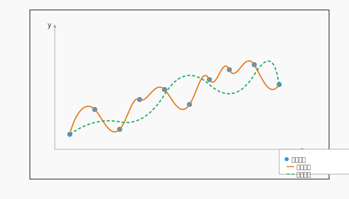
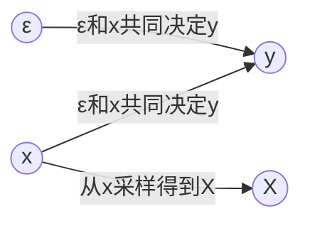
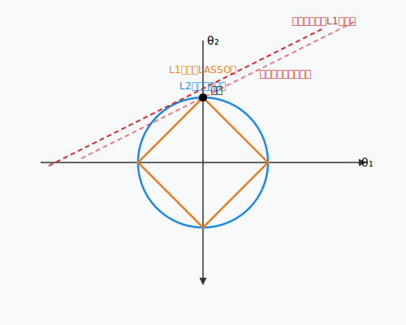

 <h1 id="第八讲-正则化" style="text-align: center; margin-bottom: 2rem; border-bottom: none;">第八讲 正则化</h1> 
 

  
  
  
 

## 1. 概述

### 1.1 线性估计及其本质：正交投影

在前面的课程中，我们系统地学习了线性估计的理论与算法。从最小二乘、维纳滤波到卡尔曼滤波，再到线性预测编码，这些方法看似迥异，却共享同一个几何本质：**在随机变量（或信号）构成的 Hilbert 空间中，将目标变量正交投影到观测变量张成的线性子空间上**。正交投影的唯一性来源于内积空间的正交性原理：残差与子空间中所有元素正交，即是均方误差最小的充要条件。这一原理统一了从 Yule-Walker 方程到卡尔曼增益的所有公式，构成了线性估计的理论基石。

线性估计之所以被广泛使用，正是因为它具有闭式解（正规方程）、递推算法（KF）、计算高效且可解释性强等优点。然而，这些优点的背后也隐藏着线性估计的天然局限：**它只能拟合观测变量之间的线性关系**。一旦真实映射存在非线性，线性投影就会产生系统性偏差，表现为欠拟合；同时，当特征维度高而样本量少时，线性模型又容易过拟合，即完美匹配训练数据但在新数据上误差巨大。此外，线性估计对噪声和异常值敏感，最小二乘极易被离群点拉偏。

### 1.2 正则化：在投影中引入约束

为了克服线性估计的过拟合问题，我们可以在损失函数中增加一个惩罚项，限制模型参数的“能量”或“稀疏性”，这就是**正则化**。从几何角度看，正则化相当于在线性投影的基础上，对参数向量施加一个约束区域（如 L2 球或 L1 菱形），然后在该区域内寻找使经验风险最小的解。这改变了原始无约束投影的方向，使得估计量向原点收缩（岭回归）或产生稀疏解（LASSO）。正则化巧妙地平衡了“拟合数据”与“控制复杂度”，是结构风险最小化的具体实现。从贝叶斯角度，正则化对应参数先验分布（高斯先验 → L2，拉普拉斯先验 → L1），因此正则化估计实际上就是最大后验估计（MAP）。

### 1.3 SVM 与核方法：线性投影的升维与正则化的自然融合

正则化虽然提升了泛化能力，但并未改变模型的线性本质。若要真正处理非线性关系，我们需要将线性投影的适用域扩展。**核方法**提供了一条巧妙路径：通过一个隐式映射 $\phi(\cdot)$ 将原始输入数据变换到高维（甚至无穷维）特征空间，使得原本非线性可分的模式在该空间中变成线性可分。然后，我们可以在特征空间中执行线性投影——这正是支持向量机（SVM）的核心思想。核技巧（Kernel Trick）使得我们无需显式计算高维坐标，只需通过核函数 $K(x_i, x_j) = \phi(x_i)^\top \phi(x_j)$ 计算内积，即可隐式完成特征空间中的所有运算。

值得注意的是，**正则化同样是 SVM 的基础**。SVM 的目标函数由两部分组成：经验风险（铰链损失）和结构风险（L2 正则化项 $\frac{1}{2}\|w\|^2$）。其中 L2 正则化不仅保证了最大间隔解的唯一性，还控制了特征空间中线性分类器的复杂度，防止在高维特征空间中过拟合。可以说，SVM 是“核技巧 + 正则化 + 铰链损失”的有机结合：核技巧负责非线性映射，正则化负责控制模型复杂度，铰链损失则给出稀疏的支持向量解。因此，正则化是连接线性估计与 SVM 的又一关键纽带。

**本篇文章将聚焦于正则化**，详细介绍岭回归、LASSO 及其求解算法，并阐明正则化与线性估计中正交投影的深层联系。关于核方法及 SVM 的具体内容，将在后续文章中独立展开。读者只需记住：正则化解决了过拟合，核化解决了非线性，两者共同构成了从线性估计迈向现代机器学习的桥梁；而 SVM 正是将正则化与核技巧熔于一炉的典范。

---

## 2. 背景与问题动机

### 2.1 问题

我们首先从数据出发，构造典型的学习问题。假设我们观测到一组训练样本：
$$
(x_1, y_1), (x_2, y_2), \dots, (x_n, y_n), \qquad x_k \in \mathbb{R}^m,\; y_k \in \mathbb{R}.  \tag{8.1}$$
目标是从这些数据中学习一个函数 \( f : \mathbb{R}^m \to \mathbb{R} \)，使得对于新的输入 \(x\)（未曾出现在训练集中），\(f(x)\) 能够准确预测对应的输出 \(y\)。这里的 \(y_k\) 可以是连续值（回归问题），也可以是离散类别（分类问题）。本质上，我们希望挖掘出隐藏在输入 \(x\) 与输出 \(y\) 背后的映射关系，并且要求模型不仅对训练数据有良好的拟合效果，还要具备**泛化能力**，即在未见过的测试数据上同样表现优异。

### 2.2 模型

如果仅仅追求对训练数据的精确拟合，可以采用数值计算方法，例如多项式插值。当训练样本数为 \(n\) 时，我们可以构造一个 \(n-1\) 阶多项式，使其恰好通过每一个数据点。这样的多项式插值函数在训练集上的误差为零，但在样本点之外往往会剧烈振荡，导致对噪声的过度拟合。这种现象称为**过拟合（overfitting）**，它严重破坏了模型的泛化能力。

相比之下，我们真正需要的是能够捕捉数据整体趋势的模型，而不是机械地记忆每一个训练点。这类模型允许在训练集上存在一定的误差（容忍噪声），从而换来更平滑、更稳定的预测行为。下图中用蓝色点表示训练数据，橙色曲线为高次多项式插值（过拟合），绿色曲线则为经过正则化处理后的平滑拟合（体现了数据的主要趋势）。

上图中：
- **蓝色散点**：训练数据集，包含随机噪声。
- **橙色曲线**：高次多项式插值（过拟合），精确通过每一个训练点，但形状剧烈振荡。
- **绿色虚线曲线**：正则化后的平滑拟合，反映了数据的整体趋势，在测试集上通常具有更好的泛化性能。

正则化正是为了获得这样的平滑曲线而引入的。它通过在最小化训练误差的同时添加对模型参数的惩罚（例如 L2 范数或 L1 范数），迫使模型选择更简单的假设，从而避免过拟合。这既保持了线性估计框架的简洁性，又显著提升了模型的泛化能力。

### 2.3 插值存在的问题

尽管高次多项式插值在训练集上可以达到零误差，但它存在两个致命缺陷，使其无法用于真实世界的学习任务。

#### 2.3.1 对数据噪声极其敏感 —— 不稳定性

插值要求曲线精确通过每一个训练样本点。这一要求隐含了一个强假设：训练数据是完全精确、无噪声的。然而，现实中的数据几乎总是含有测量误差、环境干扰或标记错误。一旦训练样本存在微小扰动，高次插值多项式的系数就会发生剧烈变化，导致插值曲线形状完全改变。这种“牵一发而动全身”的不稳定性使得插值结果毫无鲁棒性可言。更糟糕的是，当新增加一个样本点时，必须重新计算整个多项式，之前的计算结果无法被增量式地修正。因此，插值无法适应在线学习或动态数据流场景。

#### 2.3.2 大系数问题 —— 病态多项式

为了能够剧烈弯曲以穿过所有样本点，高次插值多项式的系数往往会出现非常大的绝对值。这种多项式称为**病态多项式**。以常见的 Runge 现象为例：在区间端点附近，高次插值多项式会产生剧烈的振荡，其系数可以大到 \(10^6\) 甚至更高。为什么大系数是“病态”的？原因在于：

- **数值不稳定**：在计算机上计算时，大系数之间会相互抵消，导致严重的舍入误差，使得多项式求值结果失去有效数字。
- **对输入敏感**：系数极大的多项式，其函数值对自变量的微小变化极为敏感，微小的输入噪声会被放大为巨大的输出误差。
- **缺乏可解释性**：庞大的系数没有任何物理意义，也无法反映数据背后的真实规律。

从线性代数的角度看，病态多项式对应于线性方程组 \(V c = y\)（其中 \(V\) 是范德蒙德矩阵）中 \(V\) 的条件数极大，导致 \(c = V^{-1} y\) 对 \(y\) 的扰动高度敏感。这正是过拟合在数值计算上的具体体现。

##### 2.3.2.1 条件数的概念与举例

**条件数**（Condition Number）是用来衡量一个矩阵（或一个数学问题）对输入误差敏感程度的指标。对于线性方程组 \(A x = b\)，条件数 \(\kappa(A)\) 定义为矩阵最大奇异值与最小奇异值的比值：\(\kappa(A) = \frac{\sigma_{\max}}{\sigma_{\min}}\)。条件数越大，表明矩阵越“病态”，即输出结果 \(x\) 对输入 \(b\) 或 \(A\) 的微小扰动越敏感。当条件数无穷大时，矩阵奇异，问题无唯一解。

**一个简单例子**

考虑线性方程组： $$
\begin{cases}
x_1 + x_2 = 2 \\
x_1 + 1.0001x_2 = 2.0001
\end{cases}  \tag{8.2}$$
精确解为 \(x_1 = 1, x_2 = 1\)。现在将第二个方程右端项稍微改为 \(2.0002\)，即：
$$
\begin{cases}
x_1 + x_2 = 2 \\
x_1 + 1.0001x_2 = 2.0002
\end{cases}  \tag{8.3}$$
解得 \(x_1 \approx 0.9999, x_2 \approx 1.0001\)，变化很小，说明此方程组条件数较小（约 \(10^4\)）。

再换一个极端的例子（Hilbert 矩阵）： 

$$
\begin{pmatrix}
1 & 1/2 \\
1/2 & 1/3
\end{pmatrix}
\begin{pmatrix}
x_1 \\ x_2
\end{pmatrix}
=
\begin{pmatrix}
1.5 \\ 0.8333
\end{pmatrix}  \tag{8.4}$$
解为 \(x_1 = 1, x_2 = 1\)。若将右端项扰动 \(0.0001\)，解的变化可能超过 \(1\)。实际上这个 \(2\times 2\) 的 Hilbert 矩阵条件数约为 \(19\)，还算温和；而 \(10\times 10\) 的 Hilbert 矩阵条件数就高达 \(10^{13}\) 数量级，极其病态。

对于多项式插值，范德蒙德矩阵 \(V_{ij} = x_i^{j-1}\) 随着节点数增加，条件数呈指数级增长，导致系数向量 \(c\) 对 \(y\) 的微小扰动极为敏感。这正是病态多项式产生的根源。

#### 2.3.3 插值是过拟合的典型代表

多项式插值的本质是**记忆**训练数据，而非**学习**其中的模式。它成功地将训练误差降为零，却丧失了泛化能力。在统计学习中，这种现象被称为**过拟合（overfitting）**：模型在训练集上表现完美，但在未见过的测试集上误差巨大。正则化正是为了对抗过拟合而设计的，它通过约束模型复杂度，迫使模型在“拟合数据”与“保持简单”之间取得平衡。

### 2.4 没有免费的午餐定理

#### 2.4.1 损失函数 $L(f(x), y)$

在机器学习中，我们需要一个量化指标来衡量模型预测 $f(x)$ 与真实输出 $y$ 之间的差异。这个指标称为**损失函数** $L(f(x), y)$。常见的损失函数包括平方损失 $L = (f(x)-y)^2$（用于回归）、0-1 损失（用于分类）、铰链损失等。损失函数的值越小，表示模型的预测越准确。

#### 2.4.2 经验（样本）损失

给定训练集 $\{(x_k, y_k)\}_{k=1}^n$，我们定义**经验损失**（Empirical Loss）为损失函数在训练集上的平均值：
$$
C_1[f] = \frac{1}{n} \sum_{k=1}^{n} L\bigl(f(x_k), y_k\bigr).   \tag{8.5}$$
我们希望在某个函数类（例如线性函数）中找到使经验损失最小的模型：
$$
f_X^* = \arg\min_{f} C_1[f].   \tag{8.6}$$
这就是**经验风险最小化**（Empirical Risk Minimization, ERM）原则。多项式插值本质上就是 ERM 在零损失下的特例：它强制要求所有训练点上的损失为零，从而完美拟合训练数据。

#### 2.4.3 理论（总体）损失

然而，我们真正关心的是模型在未知数据上的表现，即**总体损失**（Expected Loss）或**泛化误差**：
$$
C_2[f] = \int_{\mathcal{X} \times \mathcal{Y}} L\bigl(f(x), y\bigr) \, p(x, y) \, dx \, dy,   \tag{8.7}$$
其中 $p(x, y)$ 是输入输出对的真实联合概率分布。这个分布是未知的——只有“上帝”知道。我们仅能通过有限的训练样本获得对其的粗略估计。样本可能带有偏差，也可能无法覆盖分布的全部支撑集。例如，你所在的小区没有人出门，并不能推断整个城市火车站和机场没有旅客。样本的局部性可能导致模型在训练集上表现良好，但在真实分布上误差巨大。由于 $p(x, y)$ 是未知的，我们也无法在某个函数类（例如线性函数）中找到使总体损失最小的模型：
$$
f^* = \arg\min_{f} C_2[f].   \tag{8.8}$$

#### 2.4.4 误差的三项分解：优化误差、估计误差与逼近误差

设 $\mathcal{F}$ 为我们选定的函数类（例如线性模型、RKHS等）。定义如下三个最优模型：

- $f^*$：全局最优（在全体可测函数中最小化 $C_2$），真实分布下理想模型；
- $f_{\mathcal{F}}^*$：函数类 $\mathcal{F}$ 内的理论最优（最小化 $C_2$ 但受限于 $f \in \mathcal{F}$）；
- $f_X^*$：在有限样本上通过经验风险最小化得到的函数类内的最优模型（即 $f_X^* = \arg\min_{f\in\mathcal{F}} C_1[f]$）。

实际训练中，我们往往无法精确求解 $f_X^*$（例如深度网络只能找到近似解），记实际得到的模型为 $f$。则总误差可分解为：
$$
f(x) - f^*(x) = \underbrace{f(x) - f_X^*(x)}_{\text{优化误差}} \;+\; \underbrace{f_X^*(x) - f_{\mathcal{F}}^*(x)}_{\text{估计误差}} \;+\; \underbrace{f_{\mathcal{F}}^*(x) - f^*(x)}_{\text{逼近误差}}.   \tag{8.9}$$

- **优化误差**：由于优化算法（如梯度下降）无法找到全局最优解，或早停等造成的偏差。在理想情况下可以做到很小。
- **估计误差**：由于训练样本有限、含有噪声，导致经验最优 $f_X^*$ 与函数类内理论最优 $f_{\mathcal{F}}^*$ 之间的差距。增加样本量、使用正则化可以减小此误差。
- **逼近误差**：由函数类 $\mathcal{F}$ 本身的表达能力决定。即使有无穷多数据，如果 $f^* \notin \mathcal{F}$，逼近误差也无法消除。选择更强大的函数类（如核方法、深度网络）可以降低逼近误差，但会增加估计误差（需要更多数据）和优化难度。

#### 2.4.5 资源限制下的双重困境：数据与算力

在现实场景中，我们无法同时将这三项误差都降至零，原因如下：

- **数据有限**：有限的样本量导致**估计误差**无法被充分压低。即使 $f^* \in \mathcal{F}$，样本不足时 $f_X^*$ 也会偏离 $f_{\mathcal{F}}^*$。
- **算力有限**：为了降低**逼近误差**，我们需要选择表达能力强的函数类（如高维特征空间、深网络），但这类模型的训练通常需要巨大的计算资源（时间、内存、电力）。此外，复杂的函数类会放大估计误差，需要海量数据来补偿——这又反过来加剧了对数据的需求。
- **优化误差**：对复杂模型（如深度网络），优化算法往往只能找到局部最优，难以达到全局最优 $f_X^*$。这也是算力限制的体现。

因此，在有限的数据与有限的算力约束下，总误差存在一个无法突破的下界。我们必须在**逼近误差、估计误差、优化误差**三者之间进行权衡：增大模型容量（降低逼近误差）会推高估计误差和优化难度；反之，限制模型容量会降低估计误差和优化难度，但会增大逼近误差。**这正是当前人工智能领域面临的核心理论困境**——没有免费的午餐，任何实际系统都必须根据可用资源做出妥协。

正则化、模型选择、早停、集成学习等技术，本质上是试图在有限资源下找到总误差最小的平衡点，而非消灭误差本身。这一认识也解释了为什么大模型需要海量数据和超强算力：它们通过降低逼近误差（用极复杂的函数类）来换取性能提升，但代价是必须承担巨大的估计误差（需要海量数据来填充）和优化误差（需要大量计算来逼近最优解）。

#### 2.4.6 偏差-方差权衡（Bias-Variance Trade-off）—— 完整推导

将 $f_X^*$ 代入总体损失表达式，得到：
$$
C_2[f_X^*] = \int_{\mathcal{X} \times \mathcal{Y}} L\bigl(f_X^*(x), y\bigr) \, p(x, y) \, dx \, dy.   \tag{8.10}$$

由于 $f_X^*$ 依赖于随机训练集 $X$，$C_2[f_X^*]$ 是随机变量。我们关心的期望值为：
$$
\mathbb{E}_X\bigl[C_2[f_X^*]\bigr] = \mathbb{E}_X \left[ \int_{\mathcal{X} \times \mathcal{Y}} L\bigl(f_X^*(x), y\bigr) \, p(x, y) \, dx \, dy\right].   \tag{8.11}$$

记 $\mathbb{E}_{x,y}$ 为关于 $(x,y) \sim p(x,y)$ 的期望，则上式可写为：
$$
\mathbb{E}_X\bigl[C_2[f_X^*]\bigr] = \mathbb{E}_X \left[ \mathbb{E}_{x,y} L\bigl(f_X^*(x), y\bigr)\right].   \tag{8.12}$$

下面用一张图清晰地说明 $X$、$x$、$y$、$\epsilon$ 之间的关系：

图中：
- $x$ 是输入变量（服从真实分布 $p(x)$），如果 $x$ 已知，$X$ 和 $y$ 就无关了；
- $\epsilon$ 是独立噪声；
- $y = f_0(x) + \epsilon$ 由 $x$ 和 $\epsilon$ 共同决定；
- 训练集 $X = \{x_1,\dots,x_n\}$ 是从 $x$ 的分布中采样得到的有限样本（因此 $X$ 是随机变量）。

**步骤 1：固定 $x$，先对内层期望进行一般性展开。**

对于固定的 $x$，$f_X^*(x)$ 是随机变量（依赖于训练集 $X$）。记 $\bar{f}(x) = \mathbb{E}_X[ f_X^*(x) ]$。则：
$$
f_X^*(x) - y = \bigl( f_X^*(x) - \bar{f}(x) \bigr) + \bigl( \bar{f}(x) - y \bigr).   \tag{8.13}$$
平方并取关于 $X$ 和 $(x,y)$ 的期望：
$$
\begin{aligned}
\mathbb{E}_{X,x,y} \bigl( f_X^*(x) - y \bigr)^2 =& \mathbb{E}_{x,y} \left[ \mathbb{E}_X \bigl( f_X^*(x) - \bar{f}(x) \bigr)^2 \right] + \mathbb{E}_{x,y} \bigl( \bar{f}(x) - y \bigr)^2 \\
& + 2 \mathbb{E}_{x,y} \left[ \bigl( \bar{f}(x) - y \bigr) \mathbb{E}_X \bigl( f_X^*(x) - \bar{f}(x) \bigr)\right].
\end{aligned}   \tag{8.14}$$
由于 $\mathbb{E}_X[ f_X^*(x) - \bar{f}(x) ] = 0$，交叉项为零。因此：
$$
\mathbb{E}_X\bigl[C_2[f_X^*]\bigr] = \mathbb{E}_{x,y} \bigl( \bar{f}(x) - y \bigr)^2 + \mathbb{E}_x \left[ \operatorname{Var}_X\bigl( f_X^*(x) \bigr) \right].   \tag{8.15}$$

注意，这里还没有用到具体模型，仅用到了重期望和方差分解。

**步骤 2：引入回归模型 $y = f_0(x) + \epsilon$，且损失函数为平方损失。**

现在假设真实数据生成过程为：
$$
y = f_0(x) + \epsilon, \quad \mathbb{E}[\epsilon] = 0, \quad \operatorname{Var}(\epsilon)= \sigma^2,   \tag{8.16}$$
且 $\epsilon$ 与 $x$ 独立。代入 (8.13) 的第一项：
$$
\mathbb{E}_{x,y} \bigl( \bar{f}(x) - y \bigr)^2 = \mathbb{E}_{x,\epsilon} \left[ \bigl( \bar{f}(x) - f_0(x) - \epsilon \bigr)^2 \right].   \tag{8.17}$$
展开：
$$
= \mathbb{E}_{x} \left[ \bigl( \bar{f}(x) - f_0(x) \bigr)^2 \right] + \mathbb{E}_{x,\epsilon}[\epsilon^2] - 2 \mathbb{E}_{x,\epsilon} \bigl[ \bigl( \bar{f}(x) - f_0(x) \bigr) \epsilon \bigr].   \tag{8.18}$$
由于 $\epsilon$ 与 $x$ 独立且 $\mathbb{E}[\epsilon]=0$，交叉项为零；$\mathbb{E}_{x,\epsilon}[\epsilon^2] = \sigma^2$。因此：
$$
\mathbb{E}_{x,y} \bigl( \bar{f}(x) - y \bigr)^2 = \mathbb{E}_x \left[ \bigl( \bar{f}(x) - f_0(x) \bigr)^2 \right] + \sigma^2.   \tag{8.19}$$

**步骤 3：合并得到偏差-方差分解。**

将 (8.15) 代入 (8.13)：
$$
\mathbb{E}_X\bigl[C_2[f_X^*]\bigr] = \underbrace{\mathbb{E}_x \left[ \bigl( \bar{f}(x) - f_0(x) \bigr)^2 \right]}_{\text{偏差平方的期望}} + \underbrace{\mathbb{E}_x \left[ \operatorname{Var}_X\bigl( f_X^*(x) \bigr) \right]}_{\text{方差的期望}} + \sigma^2.   \tag{8.20}$$

记 $\operatorname{Bias}(x) = \bar{f}(x) - f_0(x)$，$\operatorname{Var}(x) = \operatorname{Var}_X(f_X^*(x))$，则：
$$
\boxed{ \mathbb{E}_X\bigl[C_2[f_X^*]\bigr] = \mathbb{E}_x\bigl[ \operatorname{Bias}(x)^2 \bigr] + \mathbb{E}_x\bigl[ \operatorname{Var}(x) \bigr] + \sigma^2 }.   \tag{8.21}$$

**最终解释**：
- **偏差**：模型平均预测与真实函数 $f_0(x)$ 的偏离程度，反映模型假设的固有误差。
- **方差**：模型预测在不同训练集上的波动程度，反映模型对数据扰动的敏感性。
- **不可约误差 $\sigma^2$**：数据中固有的噪声方差，无法通过任何模型消除。

在模型选择与正则化中，我们需要在偏差与方差之间权衡：过于简单的模型（高偏差、低方差）会欠拟合，过于复杂的模型（低偏差、高方差）会过拟合。正则化通过惩罚模型复杂度（如 L2 范数），有效控制方差，使总误差最小化。

#### 2.4.7 复习：参数估计中的偏差-方差分解

在参数估计的课程中，我们曾学习过均方误差（MSE）的经典分解。对于参数 $\theta$ 的一个估计量 $\hat{\theta}$，其均方误差可以分解为：
$$
\mathbb{E}\bigl[ (\hat{\theta} - \theta)^2 \bigr] = \underbrace{\mathbb{E}\bigl[ (\hat{\theta} - \mathbb{E}[\hat{\theta}])^2 \bigr]}_{\text{方差（随机误差）}} + \underbrace{\bigl( \mathbb{E}[\hat{\theta}] - \theta \bigr)^2}_{\text{偏差平方（系统误差）}}.   \tag{8.22}$$
其中：
- **方差（随机误差）**：反映估计量在不同样本上的波动程度，由样本的随机性引起；
- **偏差平方（系统误差）**：反映估计量的期望与真实参数之间的系统性偏离，由模型假设错误或估计方法本身导致。

这个分解是统计推断中的基本结果，它清晰地告诉我们：一个优秀的估计量需要在方差和偏差之间取得平衡。过于复杂的模型可能获得低偏差，但会带来高方差；过于简单的模型偏差较大，但方差较小。这正是我们在机器学习中讨论的偏差-方差权衡的源头。

在预测问题（回归/分类）中，类似的分解推广到了函数估计层面。对于固定输入 $x$，我们推导出：
$$
\mathbb{E}_X\bigl[C_2[f_X^*]\bigr] = \mathbb{E}_x\bigl[ \operatorname{Bias}^2(f_X^*(x)) \bigr] + \mathbb{E}_x\bigl[ \operatorname{Var}(f_X^*(x)) \bigr] + \sigma^2,   \tag{8.23}$$
其中 $\sigma^2$ 是不可约的噪声方差。这一形式与参数估计中的分解一脉相承：第一项是偏差的期望，第二项是方差的期望，第三项是数据本身的不可约误差。

理解这一点，有助于我们从更统一的视角看待参数估计与机器学习中的泛化理论。正则化方法（如岭回归、LASSO）正是通过调整模型复杂度，在偏差与方差之间寻找最优权衡，从而降低总误差。

#### 2.4.8 模型复杂度与偏差-方差的牺牲关系

在偏差-方差分解 (9) 中：
$$
\mathbb{E}_X\bigl[C_2[f_X^*]\bigr] = \underbrace{\mathbb{E}_x\bigl[ \operatorname{Bias}^2(f_X^*(x)) \bigr]}_{\text{偏差平方的期望}} + \underbrace{\mathbb{E}_x\bigl[ \operatorname{Var}(f_X^*(x)) \bigr]}_{\text{方差的期望}} + \sigma^2.   \tag{8.24}$$

- **偏差项** $\mathbb{E}_x[\operatorname{Bias}^2]$：反映模型预测的平均值与真实函数的差距。模型越简单，对训练数据的拟合能力越弱，往往无法捕捉复杂模式，因此**偏差较大**。
- **方差项** $\mathbb{E}_x[\operatorname{Var}]$：反映模型预测在不同训练集上的波动程度。模型越简单，对数据扰动的敏感性越低，因此**方差较小**。

当我们选择简单的模型（如线性回归而非高阶多项式，或使用强正则化时）：
- 我们**主动容忍**偏差增大（因为简单模型无法完美拟合真实函数）。
- 我们**获得**方差减小（因为模型参数少，对噪声不敏感）。

也就是说，**牺牲的是偏差项**——我们允许它变大；**收益是方差项变小**。如果总误差中方差占主导（例如小样本下过拟合严重），牺牲偏差换取方差下降可以显著降低总误差。这正是偏差-方差权衡的核心：没有免费的午餐，必须在两者之间做出取舍。

**对比相反情形**：
- **复杂化模型**：牺牲方差（允许方差变大），换取偏差减小。
- **简化模型**：牺牲偏差（允许偏差变大），换取方差减小。

正则化通过在损失函数中引入惩罚项（如 L2 范数），实际上是在强制模型变得简单，从而控制方差，即使这意味着偏差会有所增加。

---

## 3. 正则化理论

在上一节的讨论中，我们看到过拟合问题严重影响了模型的泛化能力。为了对抗过拟合，我们需要对模型施加约束或惩罚，这便是正则化的基本思想。实现正则化的一个直接方式是在原始优化问题中加入限制条件，将解限制在一个较小的假设空间（如参数范数有界）。下面我们从问题简化入手，逐步推导出经典的正则化形式——Tikhonov 正则化（岭回归）。

### 3.1 Tikhonov 正则化（岭回归）

#### 3.1.1 参数化

原始问题是在整个函数空间内寻找最优模型。为了简化，我们可以先限定模型属于某一参数化函数类（例如线性模型）。这样，从泛函中寻找最优函数的问题就转化为了在有限维参数空间中找到最优参数：
$$
\min_{\theta} \frac{1}{n} \sum_{k=1}^n L\bigl(f(x_k, \theta) - y_k\bigr), \quad \text{s.t. } \theta \in \Omega \text{（可行域）}.   \tag{8.25}$$

#### 3.1.2 损失函数

如果我们选定损失函数为均方误差（MSE），则目标函数进一步具体化为：
$$
\min_{\theta} \frac{1}{n} \sum_{k=1}^n \mathbb{E}\bigl( f(x_k, \theta) - y_k \bigr)^2, \quad \text{s.t. } \theta \in \Omega.   \tag{8.26}$$

#### 3.1.3 模型

进一步，如果选择线性模型 $f(x) = \theta^\top x$，则目标函数变为：
$$
\min_{\theta} \frac{1}{n} \sum_{k=1}^n \mathbb{E}\bigl( \theta^\top x_k - y_k \bigr)^2, \quad \text{s.t. } \theta \in \Omega.   \tag{8.27}$$

#### 3.1.4 正则化项

为了控制模型复杂度，我们引入对参数 $\theta$ 的约束，例如要求 $\|\theta\|_2^2 \le r$，这就是 **Tikhonov 正则化**（或称岭回归）的约束形式：
$$
\min_{\theta} \frac{1}{n} \sum_{k=1}^n \mathbb{E}\bigl( \theta^\top x_k - y_k \bigr)^2, \quad \text{s.t. } \|\theta\|_2^2 \le r.   \tag{8.28}$$

#### 3.1.5 闭式解

将样本数据表示为矩阵形式。记
$$
X = \begin{pmatrix} x_1^\top \\ \vdots \\ x_n^\top \end{pmatrix} = \begin{pmatrix} x_{1,1} & \cdots & x_{1,m} \\ \vdots & \ddots & \vdots \\ x_{n,1} & \cdots & x_{n,m} \end{pmatrix}, \qquad
y = \begin{pmatrix} y_1 \\ \vdots \\ y_n \end{pmatrix}.   \tag{8.29}$$
则损失函数（不考虑期望，使用经验平方和）为：
$$
L(\theta) = \sum_{k=1}^n (\theta^\top x_k - y_k)^2 = (X\theta - y)^\top (X\theta - y).   \tag{8.30}$$
优化问题可写为：
$$
\min_{\theta} (X\theta - y)^\top (X\theta - y), \quad \text{s.t. } \|\theta\|_2^2 = \theta^\top \theta \le r.   \tag{8.31}$$

引入拉格朗日乘子 $\lambda \ge 0$，构造拉格朗日函数：
$$
\mathcal{L}(\theta, \lambda) = (X\theta - y)^\top (X\theta - y) + \lambda (\theta^\top \theta - r).   \tag{8.32}$$
对 $\theta$ 求导并令导数为零：
$$
\nabla_\theta \mathcal{L}(\theta, \lambda) = 2X^\top (X\theta - y) + 2\lambda \theta = 0.   \tag{8.33}$$
整理得：
$$
\theta = (X^\top X + \lambda I)^{-1} X^\top y.   \tag{8.34}$$

式 (8.34) 即为 Tikhonov 正则化的闭式解。注意到当 $\lambda = 0$ 时，它退化为普通最小二乘解 $\theta = (X^\top X)^{-1} X^\top y$；当 $\lambda > 0$ 时，通过引入 $\lambda I$ 项改善了矩阵的条件数，从而抑制了过拟合。后面的小节将进一步讨论正则化参数 $\lambda$ 的选择以及更一般的正则化形式。

### 3.2 对角加载：工程视角的正则化

上面得到的闭式解 $\theta = (X^\top X + \lambda I)^{-1} X^\top y$ 在信号处理和自适应阵列中有一个专门的名称：**对角加载**（diagonal loading）。当协方差矩阵 $X^\top X$ 不满秩或病态时，直接求逆会导致数值不稳定、解噪声放大。通过对角线加上一个小的正数 $\lambda$，相当于在协方差矩阵的主对角线上加载一个常数，从而改善矩阵的条件数，使解对输入扰动不敏感。这一操作在自适应波束形成、线性预测等领域被广泛用于提高算法的鲁棒性。

**对角加载与正则化的本质联系**：  
- 在统计学习与回归中，我们称之为**岭回归（Ridge Regression）**，视其为 L2 范数正则化；  
- 在阵列信号处理与自适应滤波中，称之为**对角加载**，视为对样本协方差矩阵的修整；  
- 在数值分析中，这与 **Tikhonov 正则化** 同出一辙，都等价于在最小二乘问题中增加一个惩罚项 $\lambda\|\theta\|^2$。

因此，对角加载不是一种新的方法，而是正则化思想在不同学科中的具体实现。无论名称如何，其数学本质都是通过向 $X^\top X$ 添加一个小对角阵来稳定逆运算，从而在拟合精度与解范数之间取得平衡。

#### 3.2.1 对角加载：解决矩阵病态的利器

回顾最小二乘解：
$$
\theta = (X^\top X)^{-1} X^\top y.   \tag{8.35}$$
该公式成立的前提是 $X^\top X$ 可逆，即 $X$ 列满秩。然而，在实际数据中常常出现以下问题：
- 特征维度 $m$ 大于样本量 $n$，此时 $X^\top X$ 奇异，无法求逆。
- 特征之间高度相关（多重共线性），导致 $X^\top X$ 接近奇异，其**条件数**非常大。此时最小二乘解对 $y$ 的微小扰动极为敏感，估计量方差巨大。

##### 3.2.1.1 矩阵的条件数

**条件数**（Condition Number）是衡量矩阵对误差敏感程度的指标。对于正定矩阵 $A = X^\top X$，其条件数定义为最大特征值与最小特征值的比值：
$$
\kappa(A) = \frac{\lambda_{\max}}{\lambda_{\min}}.   \tag{8.36}$$
当 $\kappa(A)$ 很大时，称矩阵**病态**（ill-conditioned）；当 $\kappa(A)$ 接近 1 时，称**良态**（well-conditioned）。

在最小二乘问题中，若 $A = X^\top X$ 病态，则：
- 解 $\theta = A^{-1} X^\top y$ 对 $y$ 的噪声极度敏感：$\|\Delta \theta\| / \|\theta\| \le \kappa(A) \cdot \|\Delta y\| / \|y\|$。
- 即使 $y$ 有微小扰动，$\theta$ 也会产生巨大波动，导致过拟合。
- 数值计算时，舍入误差会被放大，使得直接求逆不可靠。

##### 3.2.1.2 对角加载降低条件数

**对角加载** 直接在 $X^\top X$ 的对角线上加上一个小的正数 $\lambda$：
$$
X^\top X + \lambda I.   \tag{8.37}$$
这一操作的数学效果是：
- 所有特征值都增加 $\lambda$，原来为零或接近于零的特征值被提升到 $\lambda$。新矩阵的特征值为 $\lambda_i + \lambda$，其中 $\lambda_i$ 是原矩阵的特征值。
- 条件数变为：
$$
\kappa(X^\top X + \lambda I) = \frac{\lambda_{\max} + \lambda}{\lambda_{\min} + \lambda}.   \tag{8.38}$$
当 $\lambda > 0$ 时，即使原 $\lambda_{\min}=0$，条件数也降至 $(\lambda_{\max}+\lambda)/\lambda$，从而可逆且数值稳定。

**例子**：假设 $X^\top X$ 的特征值为 $10, 0.001$，则 $\kappa = 10/0.001 = 10000$，病态。取 $\lambda = 0.1$，则新特征值为 $10.1, 0.101$，$\kappa \approx 100$，条件数显著降低。

##### 3.2.1.3 对角加载即岭回归

将 $\lambda I$ 加进去后的解为
$$
\theta = (X^\top X + \lambda I)^{-1} X^\top y,   \tag{8.39}$$
这正是岭回归（L2 正则化）的闭式解。因此，对角加载是正则化思想的工程体现：通过牺牲无偏性（引入偏差）来换取大幅降低方差，从而提升泛化能力。在实际应用中，$\lambda$ 通过交叉验证选择，以平衡偏差与方差。

### 3.3 偏差分析：通过 SVD 计算对角加载引入的偏差

最小二乘解是无偏的，即 $\mathbb{E}[\hat{\theta}_{\text{ols}}] = \theta_{\text{true}}$。而对角加载（岭回归）解 $\hat{\theta}_{\text{ridge}} = (X^\top X + \lambda I)^{-1} X^\top y$ 引入了偏差。下面利用奇异值分解（SVD）定量计算这一偏差。

#### 3.3.1 SVD 分解的四个层次：从方阵到非方阵

奇异值分解（SVD）是线性代数中最核心的工具之一，它统一了矩阵对角化的各种情形。下面我们从特殊到一般，逐步说明。

##### 3.3.1.1 对称矩阵（实对称）

对于实对称矩阵 $A = A^\top \in \mathbb{R}^{m \times m}$，由谱定理，存在正交矩阵 $Q$ 和对角矩阵 $\Lambda$，使得：
$$
A = Q \Lambda Q^\top,   \tag{8.40}$$
其中 $Q^\top Q = I$，$\Lambda = \operatorname{diag}(\lambda_1, \dots, \lambda_m)$，$\lambda_i$ 为实数特征值。此时 $U = Q$，$\Gamma = \Lambda$。注意这里的分解是正交对角化，U 直接由特征向量组成。

##### 3.3.1.2 正规矩阵（Normal）

若 $A \in \mathbb{C}^{m \times m}$ 满足 $A A^H = A^H A$（正规），则存在酉矩阵 $U$ 和对角矩阵 $\Lambda$（可能复数），使得：
$$
A = U \Lambda U^H,   \tag{8.41}$$
其中 $U^H U = I$，$\Lambda$ 的对角线元素是 $A$ 的特征值。实正规矩阵（如正交矩阵、对称矩阵、反对称矩阵）均可如此分解，但特征值可能是复数。此时 $U$ 是酉矩阵，$\Gamma = \Lambda$。

##### 3.3.1.3 普通方阵（非正规）

对于一般的实方阵 $A \in \mathbb{R}^{m \times m}$，不一定可对角化。其 **Jordan 标准形** 为：
$$
A = P J P^{-1},   \tag{8.42}$$
其中 $J$ 是由 Jordan 块组成的块对角矩阵。但 Jordan 形对数值计算极不稳定，很少用于实际数据分析。相比之下，**方阵的SVD** 提供了更稳定的分解：
$$
A = U \Sigma V^\top,   \tag{8.43}$$
其中 $U, V \in \mathbb{R}^{m \times m}$ 是正交矩阵，$\Sigma = \operatorname{diag}(\sigma_1, \dots, \sigma_m)$，$\sigma_i \ge 0$ 称为奇异值。注意此分解不要求 $A$ 可对角化，且对任意方阵成立。当 $A$ 可对角化时，奇异值 $\sigma_i = \sqrt{|\lambda_i \lambda_i^*|}$，但通常不等于特征值的模。

##### 3.3.1.4 非方阵（一般 $m \times n$）

当 $A \in \mathbb{R}^{m \times n}$（$m \neq n$），对称对角化或 Jordan 形不再适用。**奇异值分解**（SVD）是最终的统一形式：
$$
A = U \Sigma V^\top,   \tag{8.44}$$
其中：
- $U \in \mathbb{R}^{m \times m}$ 是正交矩阵（$U^\top U = I_m$），称为左奇异向量矩阵。
- $V \in \mathbb{R}^{n \times n}$ 是正交矩阵（$V^\top V = I_n$），称为右奇异向量矩阵。
- $\Sigma \in \mathbb{R}^{m \times n}$ 是“对角”矩阵，即 $\Sigma_{ii} = \sigma_i \ge 0$，其余元素为零。非零 $\sigma_i$ 的个数等于 $A$ 的秩 $r$。

**构造方式**：
- 对 $A^\top A \in \mathbb{R}^{n \times n}$ 进行对称对角化：$A^\top A = V \Lambda V^\top$，其特征值 $\lambda_i = \sigma_i^2$，奇异值 $\sigma_i = \sqrt{\lambda_i}$。
- 对 $A A^\top \in \mathbb{R}^{m \times m}$ 对角化：$A A^\top = U \Lambda U^\top$。
- 且有关系 $A v_i = \sigma_i u_i$，$A^\top u_i = \sigma_i v_i$。

SVD 揭示了矩阵的几何本质：将任意矩阵分解为旋转（$V^\top$）、缩放（$\Sigma$）、再旋转（$U$）。它不依赖于矩阵是方阵还是满秩，且数值稳定，是岭回归偏差分析的标准工具。在我们之前的推导中，正是利用 SVD 将岭回归的解写为：
$$
\hat{\theta}_{\text{ridge}} = V (\Sigma^\top \Sigma + \lambda I)^{-1} \Sigma^\top U^\top y,   \tag{8.45}$$
从而清晰地看到对角加载对每个奇异值方向的收缩作用。

好的，完全按照你的要求，我将 **3.3.2、3.3.3、3.3.4** 三个小节彻底重写。核心主线就是紧抓 **OLS系数 \(1/\sigma_i\)** 与 **Ridge系数 \(\sigma_i/(\sigma_i^2+\lambda)\)** 在奇异值极小情况下的天壤之别，将所有代数推导都服务于这个本质洞察。

---

#### 3.3.2 岭回归解的 SVD 形式——从“放大噪声”到“衰减噪声”的系数革命

要看清岭回归的本质，最有力的工具是将最小二乘（OLS）与岭回归（Ridge）的解并排写在SVD正交基下进行系数对比。

对设计矩阵 \(X \in \mathbb{R}^{n \times m}\) 进行奇异值分解：
\[
X = U \Sigma V^T
\]
其中 \(U\) 是 \(n \times n\) 左奇异矩阵，\(V\) 是 \(m \times m\) 右奇异矩阵，\(\Sigma\) 是 \(n \times m\) 的对角矩阵，主对角线上为奇异值 \(\sigma_1 \ge \sigma_2 \ge \dots \ge \sigma_r > 0\)（\(r\) 为矩阵秩）。

将 \(X = U \Sigma V^T\) 代入岭回归闭式解 \(\hat{\theta}_{\text{ridge}} = (X^T X + \lambda I)^{-1} X^T y\)，并利用正交矩阵性质 \(U^T U = I\)、\(V^T V = I\)，推导如下：
\[
\hat{\theta}_{\text{ridge}} = (V \Sigma^T U^T U \Sigma V^T + \lambda I)^{-1} V \Sigma^T U^T y
\]
\[
= V (\Sigma^T \Sigma + \lambda I)^{-1} \Sigma^T U^T y
\]
由于 \((\Sigma^T \Sigma + \lambda I)\) 是对角矩阵（主元为 \(\sigma_i^2 + \lambda\)），\(\Sigma^T\) 也是对角的，两者相乘后，岭回归的解可以显式地展开为对每个独立奇异方向的求和：
\[
\boxed{\hat{\theta}_{\text{ridge}} = \sum_{i=1}^{r} \frac{\sigma_i}{\sigma_i^2 + \lambda} \cdot (u_i^T y) \cdot v_i} \tag{8.46}
\]

作为对照，普通最小二乘（\(\lambda=0\)）的解在同一组正交基下的形式为：
\[
\boxed{\hat{\theta}_{OLS} = \sum_{i=1}^{r} \frac{1}{\sigma_i} \cdot (u_i^T y) \cdot v_i} \tag{8.47}
\]

**将两个公式的系数并排比较，本质即刻浮现：**

| 奇异值状态 | OLS 系数 (\(1/\sigma_i\)) | Ridge 系数 (\(\sigma_i / (\sigma_i^2 + \lambda)\)) | 物理含义 |
| :--- | :--- | :--- | :--- |
| **大奇异值**（重要主成分） | 较小，合理 | \(\approx 1/\sigma_i\)（因 \(\lambda\) 可忽略） | 两者行为一致，正常拟合有效信号。 |
| **小奇异值**（弱方向，接近噪声子空间） | **趋向无穷大**（\(\to \infty\)） | **趋向 0**（\(\sigma_i / \lambda \to 0\)） | OLS沦为噪声放大器；Ridge直接掐断该方向的影响。 |

OLS 对微小奇异值的反应是**灾难性**的——它把数据中最不確定、最像噪声的分量，赋予了最大的权重。而岭回归通过分母上的 \(+\lambda\)，将系数曲线从“反比例发散”扭转为“正比例衰减”，彻底纠正了这一病态本能。这里的 \(\frac{\sigma_i}{\sigma_i^2+\lambda}\) 就是拯救模型的**核心修正因子**。

---

**\(\lambda\) 取极端值时，系数的行为**

继续上面的系数比较，现在固定奇异值 \(\sigma_i\)（无论大小），考察岭回归系数 \(c_{\text{ridge}}(\lambda) = \frac{\sigma_i}{\sigma_i^2 + \lambda}\) 随 \(\lambda\) 从 0 到 \(\infty\) 的变化：

| \(\lambda\) 取值 | 岭回归系数 \(c_{\text{ridge}} = \frac{\sigma_i}{\sigma_i^2 + \lambda}\) | 物理含义 |
| :--- | :--- | :--- |
| **\(\lambda = 0\)**（退化为OLS） | \(\frac{1}{\sigma_i}\) | 无偏估计，但对小奇异值方向方差爆炸。 |
| **\(\lambda\) 适中**（\(0 < \lambda < \sigma_i^2\)） | 介于 \(\frac{1}{\sigma_i}\) 与 \(\frac{1}{2\sigma_i}\) 之间 | 轻微收缩，保留大部分信号，适度降低方差。 |
| **\(\lambda = \sigma_i^2\)** | \(\frac{1}{2\sigma_i}\) | 系数缩小到 OLS 的一半。 |
| **\(\lambda \gg \sigma_i^2\)**（强正则化） | \(\approx \frac{\sigma_i}{\lambda} \to 0\) | 系数被极度压缩，无论该方向是否重要，模型都几乎忽略它。 |
| **\(\lambda \to \infty\)** | \(\to 0\) | **所有方向的系数全部归零**，模型退化为 \(\hat{\theta} = 0\)（常数预测）。 |

**这里需要特别关注两个不同来源的“零”**：

1. **小奇异值方向**（\(\sigma_i \to 0\)，\(\lambda\) 固定且有限）：系数 \(\frac{\sigma_i}{\sigma_i^2+\lambda} \to 0\)。这是**明智的衰减**——因为我们知道该方向上数据支撑弱，容易过拟合。
2. **大奇异值方向**（\(\sigma_i\) 很大，但 \(\lambda \to \infty\)）：系数同样 \(\frac{\sigma_i}{\sigma_i^2+\lambda} \to 0\)。但这是**毁灭性衰减**——因为该方向承载着大量有效信号，强行忽略会导致严重的欠拟合。

**将以上两点合并，修正后的完整系数比较表为：**

| 条件 | OLS 系数 (\(1/\sigma_i\)) | Ridge 系数 (\(\sigma_i/(\sigma_i^2+\lambda)\)) | 行为评价 |
| :--- | :--- | :--- | :--- |
| \(\sigma_i\) 大，\(\lambda\) 小 | 较小 | \(\approx 1/\sigma_i\)（几乎不变） | ✅ 正确保留有效信号。 |
| \(\sigma_i\) 大，\(\lambda\) 过大 | 较小 | \(\approx \sigma_i/\lambda \to 0\) | ❌ 过度惩罚，丧失重要信息（欠拟合）。 |
| \(\sigma_i\) 小，\(\lambda\) 适中 | 巨大（\(\to \infty\)） | \(\approx \sigma_i/\lambda \to 0\) | ✅ 成功抑制噪声，消除过拟合根源。 |
| \(\sigma_i\) 小，\(\lambda\) 过大 | 巨大（\(\to \infty\)） | 已经 \(\to 0\)，无额外变化 | ✅ 对弱方向的影响已饱和，不产生额外伤害。 |

**核心结论更新为：**

> 正则化参数 \(\lambda\) 的本质是一个**阈值控制器**。它设定了一个“信任门槛” \(\sqrt{\lambda}\)：
> - 奇异值 **大于** \(\sqrt{\lambda}\) 的方向，模型认为“有足够的数据支撑”，予以保留（系数接近 \(1/\sigma_i\)）。
> - 奇异值 **小于** \(\sqrt{\lambda}\) 的方向，模型认为“不可信”，予以衰减（系数趋向 0）。
>
> 但门槛不能设得太高（\(\lambda\) 不能太大），否则连真正重要的方向也会被误判为“不可信”，导致模型失去对主要信号的捕捉能力。交叉验证的核心任务，正是寻找这个最优门槛——**恰好卡在“消灭弱方向方差”与“保全强方向信号”之间的平衡点。**

#### 3.3.3 岭回归的期望与偏差——偏差是对“弱方向”的有意牺牲

为了看清楚岭回归在修正系数后，其期望与偏差如何在各个方向上重新分配权重，我们需要将真实数据生成过程代入上面的求和式。

假设真实模型为 \(y = X\theta^* + \epsilon\)，其中 \(\theta^*\) 为真实参数，\(\epsilon\) 为独立噪声（\(\mathbb{E}[\epsilon]=0\)）。将 \(y\) 代入 3.3.2 得到的岭回归解中：
\[
\hat{\theta}_{\text{ridge}} = \sum_{i=1}^{r} \frac{\sigma_i}{\sigma_i^2 + \lambda} \cdot (u_i^T (X\theta^* + \epsilon)) \cdot v_i
\]

利用 \(u_i^T X = u_i^T (U \Sigma V^T) = \sigma_i v_i^T\)，设真实参数在右奇异向量上的投影为 \(z_i = v_i^T \theta^*\)，并记噪声投影为 \(\epsilon_i = u_i^T \epsilon\)，则上式变为：
\[
\hat{\theta}_{\text{ridge}} = \sum_{i=1}^{r} \frac{\sigma_i}{\sigma_i^2 + \lambda} \cdot (\sigma_i z_i + \epsilon_i) \cdot v_i
\]
\[
= \sum_{i=1}^{r} \underbrace{\frac{\sigma_i^2}{\sigma_i^2 + \lambda}}_{d_i} \cdot z_i \cdot v_i \quad+\quad \sum_{i=1}^{r} \underbrace{\frac{\sigma_i}{\sigma_i^2 + \lambda}}_{\text{噪声增益}} \cdot \epsilon_i \cdot v_i \tag{8.48}
\]

上式清晰地分离了**信号部分**与**噪声部分**。现在取期望（\(\mathbb{E}[\epsilon_i]=0\)），得到岭回归估计的期望：
\[
\mathbb{E}[\hat{\theta}_{\text{ridge}}] = \sum_{i=1}^{r} \frac{\sigma_i^2}{\sigma_i^2 + \lambda} \cdot z_i \cdot v_i \tag{8.49}
\]

将期望与真实值对比，每个方向上的偏差为：
\[
\mathbb{E}[\hat{\theta}_{\text{ridge}}] - \theta^* = \sum_{i=1}^{r} \left( \frac{\sigma_i^2}{\sigma_i^2 + \lambda} - 1 \right) z_i v_i \tag{8.50}
\]

**这个期望公式在说什么？**

- **在信号方向（大 \(\sigma_i\)）**：\(d_i = \frac{\sigma_i^2}{\sigma_i^2+\lambda} \approx 1\)，期望几乎等于真实投影 \(z_i\)，偏差极小，模型忠实保留有效信号。
- **在噪声方向（小 \(\sigma_i\)）**：\(d_i \to 0\)，期望被强行压缩至接近于零。这意味着，**我们主动放弃了在这些弱方向上的准确估计，付出的代价（偏差）全部集中在这里**。

对比 OLS（\(\lambda=0\)），其 \(d_i \equiv 1\)，期望看似无偏（\(\mathbb{E}[\hat{\theta}_{OLS}] = \theta^*\)），但代价是噪声增益 \(\frac{1}{\sigma_i}\) 在小奇异值处爆炸。岭回归通过引入偏差，将噪声增益从 \(\frac{1}{\sigma_i}\) 压制为 \(\frac{\sigma_i}{\sigma_i^2+\lambda}\)（小奇异值时趋于 0）。**这是一个精巧的交易：用弱方向上的“确定性偏差”，换取弱方向上的“随机方差”被彻底清除。**

---

#### 3.3.4 偏差的解释——偏差精准指向“最不该被信任”的特征维度

将期望公式中的偏差项进一步化简，提取公因式：
\[
\text{Bias}(\hat{\theta}_{\text{ridge}}) = \mathbb{E}[\hat{\theta}_{\text{ridge}}] - \theta^* = \sum_{i=1}^{r} \left( \frac{\sigma_i^2}{\sigma_i^2 + \lambda} - 1 \right) z_i v_i
\]
\[
= -\lambda \sum_{i=1}^{r} \frac{z_i}{\sigma_i^2 + \lambda} \cdot v_i \tag{8.51}
\]

这个最终的偏差公式，以最赤裸的方式揭示了岭回归的“智能取舍”：

1. **偏差与奇异值严格成反比（定向打击）**：
   分母中的 \(\sigma_i^2 + \lambda\) 决定了偏差的大小。当 \(\sigma_i\) 很大（数据支撑充分）时，偏差分量 \(\frac{\lambda z_i}{\sigma_i^2+\lambda} \approx 0\)；当 \(\sigma_i\) 很小（数据支撑薄弱）时，偏差分量 \(\approx \frac{\lambda z_i}{\lambda} = z_i\)，即**几乎把该方向上的真实投影完全抵消掉**。

2. **偏差的分布完美对应 OLS 的致命伤**：
   回顾 3.3.2，OLS 在哪里的方差最大？正是在 \(\sigma_i\) 极小的方向上（方差正比于 \(1/\sigma_i^2\)）。而岭回归的偏差公式显示，它把**最大幅度的偏差**恰好也放在了这些 \(\sigma_i\) 极小的方向上。这绝不是偶然——岭回归用“在该方向上算错（引入偏差）”来换取“在该方向上不再颤抖（方差骤降）”。

3. **偏差的代价与收益**：
   - **收益**：噪声增益从 OLS 的 \(1/\sigma_i\)（灾难）变为 \(\sigma_i/(\sigma_i^2+\lambda)\)（安全）。
   - **代价**：如果真实信号 \(z_i\) 不幸恰好落在这个弱方向上（即该维度确实包含少量有效信息），岭回归会将其衰减掉，产生偏差。
   - **为什么值得**：因为弱方向上的信号极易被噪声淹没。在有限样本下，试图恢复这个方向的信号，就如同在雷暴中听耳语——强行拟合只会引爆全局方差。牺牲这个方向的准确性，换来整体参数向量的稳定，是泛化性能最大化的必然选择。

**最终结论**：
> 岭回归的偏差不是一个需要规避的缺陷，而是它在 SVD 坐标系下进行的一场精确手术。手术刀（\(-\lambda\)）精准地切除了那些条件数最差、最易引发过拟合的维度（小奇异值方向）。原教材仅仅列了代数式，却没有点破：**偏差的分布，恰好覆盖了 OLS 方差爆炸的源头。偏差越大之处，恰恰是 OLS 越危险之处。** 这就是为什么“引入偏差”能“降低总误差”的根本几何直觉。

### 3.4 方差与偏差的权衡（直观理解）——总误差的“净收益”分析

在 3.3.3 节中，我们将岭回归的解分解为信号部分与噪声部分：
\[
\hat{\theta}_{\text{ridge}} = \sum_{i=1}^{r} \underbrace{\frac{\sigma_i^2}{\sigma_i^2 + \lambda}}_{d_i} \cdot z_i \cdot v_i \quad+\quad \sum_{i=1}^{r} \underbrace{\frac{\sigma_i}{\sigma_i^2 + \lambda}}_{\text{噪声增益}} \cdot \epsilon_i \cdot v_i
\]
其中 \(z_i = v_i^T \theta^*\) 是真实参数在第 \(i\) 个右奇异向量上的投影，\(\epsilon_i = u_i^T \epsilon\) 是噪声在该方向上的投影，且 \(\text{Var}(\epsilon_i) = \sigma^2\)（假设噪声白化）。

现在，我们聚焦于**第 \(i\) 个独立的方向**，分析该方向上估计值 \(\hat{z}_i = v_i^T \hat{\theta}_{\text{ridge}}\) 的统计特性。

**第 \(i\) 个方向上的偏差**（来自 3.3.4）：
\[
\text{Bias}(\hat{z}_i) = \mathbb{E}[\hat{z}_i] - z_i = \left( \frac{\sigma_i^2}{\sigma_i^2+\lambda} - 1 \right) z_i = -\frac{\lambda}{\sigma_i^2+\lambda} \cdot z_i \tag{8.52}
\]

**第 \(i\) 个方向上的方差**（噪声增益的平方乘以噪声方差）：
\[
\text{Var}(\hat{z}_i) = \left( \frac{\sigma_i}{\sigma_i^2+\lambda} \right)^2 \cdot \sigma^2 = \frac{\sigma_i^2}{(\sigma_i^2+\lambda)^2} \cdot \sigma^2 \tag{8.53}
\]

作为对照，**普通最小二乘（\(\lambda=0\)）** 在同一方向上的统计量为：
\[
\text{Bias}_{OLS}(\hat{z}_i) = 0, \qquad \text{Var}_{OLS}(\hat{z}_i) = \frac{1}{\sigma_i^2} \cdot \sigma^2 \tag{8.54}
\]

**现在，将两者的方差与偏差放在一起，按奇异值大小分两种极端情形讨论：**

| 情形 | OLS（\(\lambda=0\)） | 岭回归（\(\lambda>0\)） | 总误差（MSE）变化 |
| :--- | :--- | :--- | :--- |
| **大奇异值方向**（\(\sigma_i \gg \sqrt{\lambda}\)，数据支撑充分） | 偏差 = 0   方差 = \(\sigma^2/\sigma_i^2\)（较小） | 偏差 ≈ \(-\frac{\lambda}{\sigma_i^2} z_i\)（极小）   方差 ≈ \(\sigma^2/\sigma_i^2\)（几乎不变） | MSE 几乎不变，轻微增加了一点点可忽略的偏差。 **无伤害。** |
| **小奇异值方向**（\(\sigma_i \ll \sqrt{\lambda}\)，弱方向，接近噪声子空间） | 偏差 = 0（无偏）   **方差 = \(\sigma^2/\sigma_i^2 \to \infty\)（爆炸）** | **偏差 = \(-\frac{\lambda}{\lambda} z_i = -z_i\)**（最大偏差，将信号完全衰减至零）   **方差 = \(\frac{\sigma_i^2}{\lambda^2} \cdot \sigma^2 \to 0\)（归零）** | OLS 的 MSE 趋向无穷大（\(\infty\)）；岭回归的 MSE = \(z_i^2 + 0\)（有限值）。 **净收益巨大。** |

**这个表格揭示了正则化最深刻的“交易逻辑”：**

- **在弱方向上（小 \(\sigma_i\)）**，OLS 引以为傲的“无偏性”毫无意义——因为它的方差已经爆炸成无穷大，总误差是无穷大。岭回归果断地“放弃”了这个方向（引入最大偏差，将估计值直接拉向零），以此换来方差的急剧下降（从无穷大降至 0）。在这个方向上，**用有限的偏差 \(z_i\) 换取了无限的方差缩减**，这是一笔绝对划算的买卖。

- **在强方向上（大 \(\sigma_i\)）**，OLS 本就表现良好（方差小）。岭回归小心翼翼地“绕道走”，几乎不碰这些方向的真实信号（偏差极小），因此不会对有效信息造成实质性损伤。

**那么，最佳的正则化参数 \(\lambda\) 是如何被选出来的？**

将第 \(i\) 个方向的**均方误差（MSE）** 显式写出来：
\[
\text{MSE}(\hat{z}_i) = \underbrace{\left( \frac{\lambda}{\sigma_i^2+\lambda} \right)^2 z_i^2}_{\text{偏差}^2} + \underbrace{\frac{\sigma_i^2}{(\sigma_i^2+\lambda)^2} \sigma^2}_{\text{方差}} \tag{8.55}
\]

对这个式子求导，可以得到理论最优的 \(\lambda^* = \frac{\sigma^2}{z_i^2}\)（每个方向不同，实际中由交叉验证统一折衷）。但从直观上，我们可以清晰地看到：

- 当 \(\lambda = 0\)：偏差项为 0，但若存在微小奇异值，方差项 \(\sigma^2/\sigma_i^2\) 爆炸。
- 当 \(\lambda\) 逐渐增大：弱方向的方差项迅速衰减至 0，同时偏差项从 0 逐渐上升至 \(z_i^2\)。只要该方向原本的方差 \(\sigma^2/\sigma_i^2\) 远大于 \(z_i^2\)，增加 \(\lambda\) 就会显著降低总 MSE。
- 当 \(\lambda\) 过大：强方向的偏差项开始显著增大（原本不大的方差被牺牲），总 MSE 开始回升。

**总结**：

> 正则化（岭回归）的本质，是在 **SVD 坐标系下进行一场定向“资产清算”**。它识别出哪些方向是“不良资产”（小奇异值，对应高杠杆、高波动），果断在这些方向上“计提损失”（引入偏差，收缩至零），从而消除其“暴雷风险”（无穷大方差）。而在“优质资产”（大奇异值）方向上，它尽量保全原值。这种不对等的取舍，使得总体的“投资回报率”（总 MSE）远超无约束的最小二乘策略。

### 3.5 关于 LASSO 的说明

在上述 Tikhonov 正则化（岭回归）中，我们使用了 L2 范数约束 $\|\theta\|_2^2 \le r$，得到的是稠密解。另一种重要的正则化方法是 **LASSO**（Least Absolute Shrinkage and Selection Operator），它使用 L1 范数约束 $\|\theta\|_1 \le r$，可以产生稀疏解（部分系数为零），从而实现自动特征选择。

LASSO 由 Robert Tibshirani 于 1996 年提出，超出了本课程（数字信号处理 I）所涵盖的时间范围（1950–1980）。因此，本章不对 LASSO 的求解算法、几何解释及理论性质展开讨论。

在后续的 **数字信号处理 II** 课程中，我们将在 **压缩感知** 模块中系统学习 LASSO 及其变体。届时会从 RIP（受限等距性质）、零空间性质等角度严格推导 L1 正则化能够恢复稀疏信号的理论保证，并介绍其与基追踪、匹配追踪等算法的联系。

本课程的后续内容仍聚焦于 1980 年代之前的经典方法，包括岭回归的进一步推广、广义交叉验证等。对 LASSO 感兴趣的读者请参考后续课程。

从原理上简单比较 **岭回归 (Ridge)** 和 **LASSO** 两种正则化方法。

#### 3.5.1 正则化项的差异
- **岭回归**：L2 范数惩罚 $\lambda \|\theta\|_2^2$，约束区域是光滑的球体。
- **LASSO**：L1 范数惩罚 $\lambda \|\theta\|_1$，约束区域是带有尖角的菱形。

#### 3.5.2 解的性质
- **岭回归**：解是稠密的，所有参数通常非零（收缩但不置零）。
- **LASSO**：解是稀疏的，部分参数会精确等于零（自动特征选择）。

#### 3.5.3 几何解释
- 在参数空间里，目标函数（最小二乘误差）的等高线与约束区域相切。
- L2 球光滑，切点一般不在坐标轴上，故所有坐标非零。
- L1 菱形有尖角，等高线更容易先碰到角点（某些坐标为零），从而产生稀疏解。

#### 3.5.4 求解算法
- **岭回归**：有显式闭式解 $\hat{\theta} = (X^\top X + \lambda I)^{-1} X^\top y$。
- **LASSO**：无显式闭式解，通常用坐标下降、最小角回归（LARS）或近端梯度法求解。

#### 3.5.5 适用场景
- **岭回归**：当所有特征都应保留且希望抑制系数大小时使用（如多重共线性严重时）。
- **LASSO**：当希望进行特征选择、模型解释性更重要时使用（高维数据且认为只有部分特征相关）。

#### 3.5.6 偏差‑方差权衡
- 两者都通过引入偏差来降低方差，但 LASSO 的稀疏性往往带来更强的模型简化，偏差可能略大，但在高维下泛化更好。

简单总结：  
> **岭回归** → 所有系数收缩但不为零 → 适合全特征场景。  
> **LASSO** → 部分系数精确为零 → 自动特征选择 → 稀疏模型。

---

## 4. 课后总结

### 4.1 正则化的动机
- **过拟合**：模型在训练集上表现完美，但在测试集上误差巨大。典型表现：高次多项式插值剧烈振荡。
- **病态问题**：$X^\top X$ 条件数过大，最小二乘解对噪声敏感。
- **目标**：在拟合精度与模型复杂度之间取得平衡 → 正则化。

### 4.2 Tikhonov 正则化（岭回归）
- **约束形式**：$\min_{\theta} \|X\theta - y\|^2 \quad \text{s.t.} \ \|\theta\|_2^2 \le r$
- **拉格朗日形式**：$\min_{\theta} \|X\theta - y\|^2 + \lambda \|\theta\|_2^2$
- **闭式解**：$\hat{\theta}_{\text{ridge}} = (X^\top X + \lambda I)^{-1} X^\top y$
- **对角加载**：在 $X^\top X$ 对角线上加 $\lambda$，改善条件数，提高数值稳定性。

### 4.3 对角加载与条件数
- **条件数** $\kappa(A) = \lambda_{\max}/\lambda_{\min}$，病态时 $\kappa$ 很大。
- 对角加载后：$\kappa(X^\top X + \lambda I) = (\lambda_{\max}+\lambda)/(\lambda_{\min}+\lambda)$，显著下降。

### 4.4 SVD 视角下的岭回归
- 任意矩阵 $X$ 可分解为 $X = U\Sigma V^\top$，岭回归解展开为 $\hat{\theta}_{\text{ridge}} = \sum_{i=1}^{r} \frac{\sigma_i}{\sigma_i^2 + \lambda} (u_i^\top y) v_i$ → 式 (8.46)。
- **系数对比**：OLS 系数 $1/\sigma_i$（$\sigma_i\to 0$ 时发散 → 噪声放大器）；Ridge 系数 $\sigma_i/(\sigma_i^2+\lambda)$（$\sigma_i\to 0$ 时归零 → 噪声抑制器）→ 式 (8.47)。
- **信号-噪声分解**：$\hat{\theta}_{\text{ridge}} = \sum_i \frac{\sigma_i^2}{\sigma_i^2+\lambda} z_i v_i + \sum_i \frac{\sigma_i}{\sigma_i^2+\lambda} \epsilon_i v_i$ → 式 (8.48)。信号收缩因子 $d_i = \frac{\sigma_i^2}{\sigma_i^2+\lambda}$，噪声增益 $\frac{\sigma_i}{\sigma_i^2+\lambda}$。

### 4.5 偏差与方差权衡
- **偏差**：$\mathbb{E}[\hat{\theta}_{\text{ridge}}] - \theta^* = -\lambda \sum_i \frac{v_i^\top \theta^*}{\sigma_i^2+\lambda} v_i$（非零，除非 $\lambda=0$）→ 式 (8.50)–(8.51)。
- **偏差的定向性**：偏差集中在 $\sigma_i$ 小的方向，恰好是 OLS 方差爆炸（$\propto 1/\sigma_i^2$）的源头——以有限偏差换取无限方差缩减。
- **逐方向方差与 MSE**：第 $i$ 方向方差 $\text{Var}(\hat{z}_i) = \frac{\sigma_i^2}{(\sigma_i^2+\lambda)^2}\sigma^2$ → 式 (8.53)；均方误差 $\text{MSE}(\hat{z}_i) = \left(\frac{\lambda}{\sigma_i^2+\lambda}\right)^2 z_i^2 + \frac{\sigma_i^2}{(\sigma_i^2+\lambda)^2}\sigma^2$ → 式 (8.55)。
- **$\lambda$ 的影响**：$\lambda$ 小 → 低偏差、高方差（过拟合）；$\lambda$ 大 → 高偏差、低方差（欠拟合）。最佳 $\lambda$ 通过交叉验证选择。

### 4.6 LASSO 简介（仅提及）
- L1 正则化：$\min_{\theta} \|X\theta - y\|^2 + \lambda \|\theta\|_1$。
- 产生稀疏解，可用于特征选择。
- 属于 1996 年后的方法，本课程不展开。将在《数字信号处理 II》的压缩感知模块中详细讨论（RIP 等理论）。

### 4.7 核心结论
- 正则化通过引入偏差来降低方差，提升泛化能力。
- 对角加载（岭回归）是解决矩阵病态、抑制过拟合的经典手段。
- 理解偏差-方差分解是掌握统计学习理论的基础。

---

### 4.8 学习检查清单

- [ ] 能解释过拟合现象的本质原因：模型复杂度过高、数据量不足、噪声干扰
- [ ] 能写出岭回归的两种等价形式：约束形式 $\|\theta\|^2 \le r$ 和拉格朗日形式 $+\lambda\|\theta\|^2$
- [ ] 能推导岭回归的闭式解：$\hat{\theta}_{\text{ridge}} = (X^\top X + \lambda I)^{-1} X^\top y$
- [ ] 能解释对角加载如何改善矩阵条件数：$\kappa(X^\top X + \lambda I) \ll \kappa(X^\top X)$
- [ ] 能对比 OLS 与 Ridge 在 SVD 基下的系数差异：OLS 系数 $1/\sigma_i$（$\sigma_i\to 0$ 时发散，放大噪声）vs Ridge 系数 $\sigma_i/(\sigma_i^2+\lambda)$（$\sigma_i\to 0$ 时归零，压制噪声）
- [ ] 能写出岭回归的信号-噪声分解形式（式 8.48），解释信号收缩因子 $d_i$ 和噪声增益 $\sigma_i/(\sigma_i^2+\lambda)$ 的物理含义
- [ ] 能解释岭回归偏差的定向性（式 8.51）：偏差集中在 $\sigma_i$ 小的方向，恰好覆盖 OLS 方差爆炸（$\propto 1/\sigma_i^2$）的源头
- [ ] 能分析大/小奇异值方向上的 MSE 净收益（式 8.55）：弱方向用有限偏差换取无限方差缩减，强方向几乎无损
- [ ] 能用偏差-方差分解解释正则化参数 $\lambda$ 的选择：$\lambda$ 大 → 高偏差低方差，$\lambda$ 小 → 低偏差高方差
- [ ] 能区分岭回归（L2 正则化）和 LASSO（L1 正则化）的核心区别：收缩 vs 稀疏化
- [ ] 能解释为什么 LASSO 能产生稀疏解（几何直觉：L1 球的尖角）

### 4.9 思考题

1. **正则化与先验的对应关系**：岭回归的惩罚项 $\lambda\|\theta\|^2$ 等价于对参数施加高斯先验。LASSO 的 $\lambda\|\theta\|_1$ 等价于 Laplace 先验。从贝叶斯视角看，正则化本质上是在做什么？这个视角对我们选择正则化方法有何指导？

2. **偏差-方差权衡的"免费午餐"？** 正则化通过引入偏差来降低方差。是否存在一种方法能同时降低偏差和方差？如果不可能（No Free Lunch），为什么深度神经网络在大数据下似乎"打破了"这个权衡？

3. **对角加载的深层含义**：$X^\top X + \lambda I$ 相当于在每个主方向上增加 $\lambda$。在信号处理中，这等价于假设信号被加性白噪声污染——为什么"假设有噪声"反而能改善估计？结合 3.3.2 中 OLS 系数 $1/\sigma_i$ 与 Ridge 系数 $\sigma_i/(\sigma_i^2+\lambda)$ 的对比，从 SVD 角度重新解释这一"反直觉"现象。

4. **交叉验证的困境**：理想情况下，我们用交叉验证选择 $\lambda$。但如果数据本身就很少，交叉验证的方差也很大——这就是"用不稳定的方法去选择正则化参数来稳定估计"的循环问题。有什么出路？

5. **正则化的更广阔视野**：除了 L1 和 L2，还有弹性网（Elastic Net）、dropout（深度学习）、early stopping（隐式正则化）等。这些方法都体现了"限制模型复杂度"的共同思想。能否总结出一个统一的视角来看待所有正则化方法？

6. **系数革命与自适应正则化**：OLS 系数 $1/\sigma_i$ 在 $\sigma_i\to 0$ 时发散，Ridge 系数 $\sigma_i/(\sigma_i^2+\lambda)$ 在 $\sigma_i\to 0$ 时归零。这一"反比例→正比例"的转变是岭回归全部魔力的根源。如果允许每个奇异方向使用不同的 $\lambda_i$ 而非统一的 $\lambda$，应如何设计 $\lambda_i$？这种自适应正则化与 Wiener 滤波有何联系？

7. **偏差的定向性与 PCA 降维**：式 (8.51) 表明岭回归的偏差集中在 $\sigma_i$ 小的方向。PCA 降维也丢弃了小奇异值方向——两者都认为弱方向不可靠。岭回归的"软收缩"与 PCA 的"硬截断"相比，各有什么优缺点？在什么场景下一种优于另一种？

8. **净收益的边界**：3.4 节论证了弱方向上"有限偏差换无限方差缩减"总是划算的。但如果真实信号恰好集中在 $\sigma_i$ 极小的方向上（即信号本身是"弱信号"，如微弱的目标雷达回波），岭回归是否会适得其反？此时应如何调整正则化策略？

