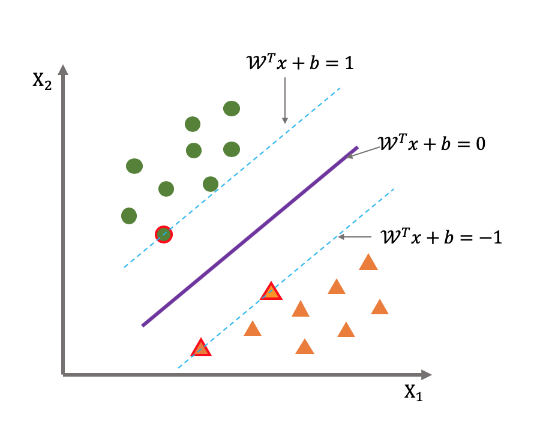
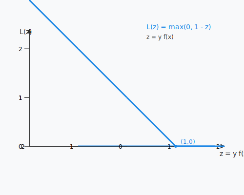

 <h1 id="第九讲-支持向量机和核方法" style="text-align: center; margin-bottom: 2rem; border-bottom: none;">第九讲 支持向量机和核方法</h1> 
 

  
  
  
 

## 1. 背景与发展

### 1.1 发展史

支持向量机（SVM）的起源可追溯到 **1960 年代**。当时，Vapnik 和 Chervonenkis 在统计学习理论中提出了 **VC 维** 的概念，并发展了结构风险最小化原则，为 SVM 奠定了理论基础。然而，受限于当时的计算能力和算法，这些理论并未立即转化为实用的分类器。

直到 **1990 年代**，随着优化理论（特别是二次规划求解技术）的进步，以及 Boser、Guyon、Vapnik 等人于 1992 年正式提出 **核技巧**，SVM 才真正成为实用工具。1995 年，Cortes 和 Vapnik 的经典论文《Support-Vector Networks》完整阐述了软间隔 SVM，使其在模式识别领域迅速流行。此后，SVM 凭借其坚实的理论基础和优越的泛化性能，成为 90 年代末至 21 世纪初机器学习的主流方法之一。

### 1.2 支持向量机简介

支持向量机是一种**监督学习模型**，主要用于分类（也可用于回归）。其核心思想是：在特征空间中寻找一个**最大间隔超平面**，将不同类别的样本分开。所谓最大间隔，是指超平面与离它最近的训练样本（称为**支持向量**）之间的距离最大化。与仅追求训练误差最小化的方法不同，SVM 通过最大化间隔来控制模型复杂度，从而获得更好的泛化能力。

对于线性不可分的数据，SVM 采用 **核技巧** 将输入映射到高维特征空间，使得原本线性不可分的问题变得线性可分。同时，为了容忍噪声和异常点，SVM 引入了 **软间隔**（soft margin），允许部分样本被错误分类或落在间隔内，通过惩罚参数 $C$ 平衡间隔宽度与误分类损失。

### 1.3 核方法简介

**核方法** 是一类将线性学习器扩展到非线性问题的通用技术。其核心思想是：通过一个隐式的非线性映射 $\phi$ 将输入数据从原始空间变换到高维（甚至无穷维）特征空间，然后在该空间中使用线性学习器（如线性 SVM、岭回归等）。由于所有操作仅依赖于特征空间中样本间的内积，因此可以引入 **核函数** $K(x_i, x_j) = \phi(x_i)^\top \phi(x_j)$，直接计算内积而无需显式知道 $\phi$。这被称为 **核技巧**。

常用核函数包括：
- 线性核：$K(x_i, x_j) = x_i^\top x_j$
- 多项式核：$K(x_i, x_j) = (x_i^\top x_j + c)^d$
- 高斯（RBF）核：$K(x_i, x_j) = \exp(-\gamma \|x_i - x_j\|^2)$
- Sigmoid 核：$K(x_i, x_j) = \tanh(\alpha x_i^\top x_j + \beta)$

核方法使得 SVM 能够处理复杂的非线性分类问题，而计算复杂度仍大致保持在线性水平。同时，核方法也广泛应用于其他线性算法（如核主成分分析、核岭回归等），构成了现代机器学习的重要基石。

---

## 2. SVM 推导

### 2.1 问题定义

#### 2.1.1 分类问题

SVM 研究的是**分类问题**。给定训练数据集：
$$
X = ((x_1, y_1), \dots , (x_n, y_n)),  \tag{9.1}$$
其中 $x_i \in \mathbb{R}^N$，$y_i \in \{+1, -1\}$。分类器的目标是使 $f(x_i) = y_i$ 对 $i=1,\dots,n$ 成立。

下图直观展示了线性可分情况下，SVM 寻找最优超平面的过程：

##### 2.1.1.1 关于这张图的一些说明
**核心区别：函数（映射） vs. 方程（轨迹）**

- **你熟悉的 $y = ax + b$**：这是一个**函数**。它的作用是“输入一个 $x$，算出一个 $y$”。在坐标系里，它是一条**斜着的线**，但前提是 $x$ 必须是横轴，$y$ 必须是纵轴。
- **SVM 的 $\omega^T x + b = c$**：这是一个**方程**。它的作用是“找出所有满足这个等式的点 $x$”。它不关心输入输出映射，只关心**空间中点的几何位置**。

**一个极端的例子秒懂**：
在二维平面中，方程 $x_1 = 5$（即 $1 \cdot x_1 + 0 \cdot x_2 - 5 = 0$）是一条**垂直的竖直线**。  
你能把它写成 $y = ax + b$ 的形式吗？不能！因为竖直线一个 $x$ 对应无数个 $y$，它不是函数。  
**SVM 必须用方程（$\omega^T x + b = 0$），因为决策边界可能是任意方向的（竖的、横的、斜的），用“函数”根本无法描述竖直的超平面。**

---

##### 2.1.2. 把三个方程说清楚

SVM 的分类超平面方程严格写作：
$$
\omega^\top x + b = 0
$$
展开来看（假设特征只有两维，即 $x = (x_1, x_2)$）：
$$
\omega_1 x_1 + \omega_2 x_2 + b = 0
$$

**在这个二维特征空间里，它是什么？**
把它变形一下：
$$
x_2 = -\frac{\omega_1}{\omega_2} x_1 - \frac{b}{\omega_2}
$$
这正好是**一条直线**（斜率为 $-\frac{\omega_1}{\omega_2}$，截距为 $-\frac{b}{\omega_2}$）。

**结论**：在 SVM 的特征空间中，$\omega^\top x + b = 0$ **就是那条用来划分两类的分界线（决策边界）**。

现在把这三个方程放在二维平面（横轴 $x_1$，纵轴 $x_2$）里看：

$$
\omega^T x + b = \omega_1 x_1 + \omega_2 x_2 + b
$$

① $\omega^T x + b = 0$：**“正中间的分界线”（决策超平面）**
- 这条线是两类样本的“楚河汉界”。
- 在这条线上，分类得分恰好为 0，机器无法判断它是正还是负（处于灰色地带）。
- 几何上，它正正好好卡在两类样本的中间。

② $\omega^T x + b = 1$：**“正类的支持向量边界”（正侧护栏）**
- 这条线是**将正类支撑超平面向上（法向量方向）平移**得到的。
- 所有正类样本中，离分界线最近的那些“支持向量”，正好落在这条线上。
- 这条线代表了正类一侧的“安全底线”——比这条线更靠外（得分 $>1$）的正类样本，分类非常放心。

③ $\omega^T x + b = -1$：**“负类的支持向量边界”（负侧护栏）**
- 这条线是**将分界线向下（反法向量方向）平移**得到的。
- 所有负类样本中，离分界线最近的那些“支持向量”，正好落在这条线上。
- 这条线代表了负类一侧的“安全底线”。

---

##### 2.1.3. 这三条线有什么关系？（间隔的由来）

重点来了：**这三条线是互相平行的！**

因为它们共享同一个法向量 $\omega$，区别只是常数项 $b$ 变成了 $b+1$ 和 $b-1$。

- 分界线（0）到正护栏（+1）的距离 = $\frac{|1 - 0|}{\|\omega\|} = \frac{1}{\|\omega\|}$
- 分界线（0）到负护栏（-1）的距离 = $\frac{|-1 - 0|}{\|\omega\|} = \frac{1}{\|\omega\|}$

所以，**两条护栏之间的总间隔（Margin）** = $\frac{2}{\|\omega\|}$。
这就是 SVM 最大化间隔的全部几何来源——**把两条平行的护栏撑得越宽越好**。

---

##### 2.1.4. 为什么非要把函数写成“= 0”的形式？

如果你非要把 SVM 的线写成 $y = ax + b$，你会遇到两个死结：

1. **无法描述竖直分割线**：如果数据只能用 $x_1 = 3$ 来分开（即 $\omega = (1, 0)$），你根本找不到斜率 $a$，因为竖直线的斜率是无穷大。
2. **维度灾难**：SVM 的特征空间往往有成千上万维（甚至无穷维）。在 100 维空间里，分割面叫“超平面”，根本不存在“纵轴 $y$”这个概念。只有写成 $\omega^T x + b = 0$ 这种**内积形式**，才能统一描述任意维度空间中的几何分割。

---

##### 2.1.5. 终极总结

| 写法 | 数学身份 | 几何含义 | 能否描述竖直线？ |
| :--- | :--- | :--- | :--- |
| $y = ax + b$ | **显式函数** | 输入 $x$ 输出 $y$，是一条斜线 | **不能**（斜率无穷大） |
| $\omega^T x + b = 0$ | **隐式方程** | 所有落在分界线上的点 $x$ 的集合 | **能**（令 $\omega_2=0$ 即可） |

所以，**SVM 不是故意搞特殊，而是因为“= 0”的隐式方程是描述高维空间任意方向超平面的唯一通用数学语言**。那两个“+1”和“-1”，不过是给这条隐式方程穿上了两件“平行移动”的外衣，用来量化间隔的宽度。

具体来说，分类器是一个**超平面（仿射函数）**： $$
f(x) = \omega^\top x + b,  \tag{9.2}$$
其中：
- $\omega$ 是法向量，决定了超平面的方向；
- $b$ 是偏置项，决定了超平面的位置。

我们希望这个分类超平面到两个类别的样本之间的距离**最大化**，从而保证分类器的泛化能力。这一目标本质上是**最大化最小间隔**。

#### 2.1.2 点到超平面的距离

点 $x$ 到超平面 $f(x)=\omega^\top x + b = 0$ 的几何距离为：
$$
d(x, f) = \frac{|\omega^\top x + b|}{\|\omega\|}.   \tag{9.3}$$
推导过程：由于 $x - x_0$ 垂直于超平面，即 $x - x_0 \parallel \omega$，因此 $|\omega^\top (x - x_0)| = \|\omega\| \cdot \|x - x_0\|$。

#### 2.1.3 集合到超平面的距离

对于一个点集 $A$（例如某一类样本），定义该集合到超平面的距离为：
$$
d(A, f) = \min_{x \in A} d(x, f).   \tag{9.4}$$
SVM 的目标是最大化两个类别到超平面的距离之和，即：
$$
\max_f \bigl( d(A, f) + d(B, f) \bigr).   \tag{9.5}$$

#### 2.1.4 优化问题的形式化

设 $x^{(1)}$ 是类别 $A$ 中距离超平面最近的点，$x^{(2)}$ 是类别 $B$ 中距离超平面最近的点。则 (9.6) 可写为：
$$
\max_{\omega, b} \left( \frac{|\omega^\top x^{(1)} + b|}{\|\omega\|} + \frac{|\omega^\top x^{(2)} + b|}{\|\omega\|} \right).   \tag{9.6}$$

为了使超平面位于两个类别的中间，我们要求：
$$
|\omega^\top x^{(1)} + b| = |\omega^\top x^{(2)} + b| = a,   \tag{9.7}$$
其中 $a$ 是超平面到这两个最近点的距离。于是目标函数化为：
$$
\max_{\omega, b} \frac{2a}{\|\omega\|}.   \tag{9.8}$$

通过适当的坐标缩放，我们可以将 $a$ 归一化为 $1$（因为同时缩放 $\omega$ 和 $b$ 不会改变超平面的几何位置）。因此问题简化为：
$$
\max_{\omega, b} \frac{2}{\|\omega\|} \quad \Longleftrightarrow \quad \min_{\omega, b} \|\omega\|.   \tag{9.9}$$

#### 2.1.5 分类正确性约束

除了最大化间隔，我们还需要保证分类结果正确，即对于每个训练样本 $(x_i, y_i)$，有：
$$
\begin{cases}
\omega^\top x^{(1)} + b = 1, \\
\omega^\top x^{(2)} + b = -1,
\end{cases}   \tag{9.10}$$
更一般地，可以统一写成：
$$
(\omega^\top x_i + b) y_i \ge 1, \quad i = 1, \dots, n.   \tag{9.11}$$

#### 2.1.6 原始优化问题

综合以上，我们得到 SVM 的原始优化问题：
$$
\min_{\omega, b} \|\omega\|, \quad \text{s.t.} \quad (\omega^\top x_i + b) y_i \ge 1, \quad i=1,\dots,n.   \tag{9.12}$$
通常我们会使用 $\frac{1}{2}\|\omega\|^2$ 作为目标函数（便于求导），因此等价形式为：
$$
\boxed{
\min_{\omega, b} \frac{1}{2} \|\omega\|^2, \quad \text{s.t.} \quad y_i(\omega^\top x_i + b) \ge 1}.   \tag{9.13}$$

该优化问题是一个凸二次规划，其解 $\omega$ 和 $b$ 定义了具有最大间隔的分类超平面，且支持向量是那些使得约束取等号的样本点。后续我们将通过拉格朗日对偶引入核函数，将其推广到非线性可分情形。

### 2.2 拉格朗日乘子法处理此问题

#### 2.2.1 拉格朗日函数

$$
L(\omega, b, \lambda) = \frac{1}{2} \|\omega\|^2 + \sum_{i=1}^n \lambda_i (1 - y_i(\omega^\top x_i + b)).   \tag{9.14}$$

简单分析一下上面的拉格朗日函数：它由目标函数（$\frac{1}{2}\|\omega\|^2$）和约束项（正则化项）的加权和组成。通常，约束项应作为惩罚项：当约束 $y_i(\omega^\top x_i + b) \ge 1$ 被违反时，$1 - y_i(\omega^\top x_i + b) > 0$，此时加入非负的 $\lambda_i$ 会使拉格朗日函数值增大，这正是我们期望的（即对违反约束的行为施加惩罚）。

然而，观察该拉格朗日函数可以发现一个问题：如果某个样本点 $x_i$ 距离超平面非常远且分类正确，即 $y_i(\omega^\top x_i + b)$ 是一个很大的正数，那么 $1 - y_i(\omega^\top x_i + b)$ 会成为绝对值很大的负数。这时即使 $\lambda_i$ 很小，整个拉格朗日函数也会因为这一项而急剧下降，从而误导优化过程。换句话说，原拉格朗日函数会**过分鼓励**那些远离超平面的点，而不是我们真正关心的——使**最近的点**尽量远离超平面。这与 SVM 最大化最小间隔的初衷背道而驰。

因此，我们需要对拉格朗日函数进行修正，只惩罚那些**不满足约束**的样本点，而对于已经正确分类且有足够间隔（即 $y_i(\omega^\top x_i + b) \ge 1$）的点，不应施加任何惩罚。这可以通过引入 **Hinge 损失** 来实现。

#### 2.2.2 Hinge 损失的引入

真正符合 SVM 目标的优化形式为：

$$
\boxed{ L(\omega, b, \lambda) = \frac{1}{2} \|\omega\|^2 + \sum_{i=1}^n \lambda_i \bigl(1 - y_i(\omega^\top x_i + b)\bigr)_+ }.   \tag{9.15}$$

其中 $(x)_+ = \max(0, x)$，即 Hinge 损失函数：
$$
(x)_+ = \begin{cases}
0, & x \le 0, \\
x,& x > 0.
\end{cases}   \tag{9.16}$$
其图像如下：

该函数在 $1 - y_i(\omega^\top x_i + b) \le 0$（即分类正确且间隔足够）时取值为 $0$，从而不会对优化产生任何影响；仅在分类错误或间隔不足时产生正值，起到惩罚作用。这正是我们期望的：只有**支持向量**（即那些落在间隔边界上或内部的点）才会影响最终的分类超平面。

#### 2.2.3 松弛变量与挤压技巧（Squeezing & Relaxing）

直接处理 (9.16) 式中的 Hinge 损失稍显不便，因为它非光滑。一种常见的凸优化技巧是引入**辅助变量** $z_i$，将问题转化为一个带线性约束的二次规划。具体地，我们令 $z_i = \bigl(1 - y_i(\omega^\top x_i + b)\bigr)_+$，则 $z_i$ 必须同时满足 $z_i \ge 0$ 和 $z_i \ge 1 - y_i(\omega^\top x_i + b)$。于是原问题等价于：

$$
\boxed{\min_{\omega, b, z} \; \frac{1}{2} \|\omega\|^2 + \sum_{i=1}^n z_i, \quad \text{s.t.} \quad \begin{cases}
z_i \ge 0, & i=1,\dots,n, \\[4pt]
z_i \ge 1 - y_i(\omega^\top x_i + b), & i=1,\dots,n.
\end{cases}}   \tag{9.17}$$

这一转化中出现了两个关键技巧：

- **松弛（Relaxing）**：原约束 $y_i(\omega^\top x_i + b) \ge 1$ 被放宽为 $y_i(\omega^\top x_i + b) \ge 1 - z_i$，其中 $z_i \ge 0$。允许某些样本点以 $z_i > 0$ 的代价“违反”原始硬间隔约束，从而容忍噪声或线性不可分情况。这正是**软间隔 SVM** 的核心思想。

- **挤压（Squeezing）**：在目标函数中我们最小化 $\sum_i z_i$，这迫使优化过程尽量让 $z_i$ 取小值（向零方向挤压）。结合约束 $z_i \ge 1 - y_i(\omega^\top x_i + b)$，对于已正确分类且满足 $y_i(\omega^\top x_i + b) \ge 1$ 的点，$z_i$ 可以取 $0$；对于不满足的点，$z_i$ 会被挤压到恰好等于 $1 - y_i(\omega^\top x_i + b)$，从而等价于 Hinge 损失。因此，“挤压”本质上是将非光滑的 Hinge 损失用线性不等式和辅助变量光滑化，使得问题可以高效求解。

另一种理解方式：原始硬间隔要求 $y_i(\omega^\top x_i + b) \ge 1$；现在通过引入松弛变量 $z_i$，我们允许约束放松到 $y_i(\omega^\top x_i + b) \ge 1 - z_i$，同时通过在目标函数中最小化 $\sum z_i$ 来“惩罚”这种放松。这就是**松弛（relaxing）**与**挤压（squeezing）**的凸优化思想，它使得 SVM 能够处理线性不可分数据，并为后续的对偶推导和核方法奠定基础。

#### 2.2.4 拉格朗日对偶问题

##### 2.2.4.1 一般优化问题的形式

考虑一个带不等式和等式约束的优化问题：

$$
\begin{aligned}
\min_{x} \quad & f_0(x) \\
\text{s.t.} \quad & f_i(x) \le 0, \quad i = 1, \dots, n, \\
& h_i(x) = 0, \quad i = 1, \dots, m.
\end{aligned}   \tag{9.18}$$

引入拉格朗日乘子 $\lambda_i \ge 0$（对应不等式约束）和 $\mu_i$（对应等式约束），构造拉格朗日函数：

$$
L(x, \lambda, \mu) = f_0(x) + \sum_{i=1}^{n} \lambda_i f_i(x) + \sum_{i=1}^{m} \mu_i h_i(x).   \tag{9.19}$$

##### 2.2.4.2 问题分层处理：min‑max 策略

直接优化三个变量（$x, \lambda, \mu$）较为复杂。我们可以将问题分解为两层：**内层**关于 $x$ 的最小化，**外层**关于乘子 $\lambda, \mu$ 的最大化。这一结构被称为 **min‑max** 问题：

$$
\max_{\lambda \ge 0, \mu} \; \min_{x} \; L(x, \lambda, \mu).   \tag{9.20}$$

**为什么先对 $x$ 做最小化，再对乘子做最大化？**

1. **内层最小化**：对于一组给定的乘子 $(\lambda, \mu)$，拉格朗日函数 $L(x, \lambda, \mu)$ 是 $x$ 的函数。内层优化 $\min_x L(x, \lambda, \mu)$ 的结果记作 $g(\lambda, \mu)$，称为 **对偶函数**。它给出了原问题目标函数 $f_0(x)$ 的一个下界（因为拉格朗日函数在可行点处有 $L \le f_0$）。因此，对每个 $(\lambda, \mu)$，我们通过最小化获得一个下界。

2. **外层最大化**：不同乘子给出的下界不同，我们自然希望找到**最紧的下界**，即所有下界中的最大值。这就是外层最大化的目的：$\max_{\lambda \ge 0, \mu} g(\lambda, \mu)$。这样得到的值称为 **对偶问题的最优值**，它始终是原问题最优值的一个下界（弱对偶）。在满足某些条件（如 Slater 条件）时，两者相等（强对偶）。

##### 2.2.4.2.1 拉格朗日函数的下界性质

对于任意可行点 $x$（满足 $f_i(x) \le 0$ 和 $h_i(x)=0$）和任意 $\lambda_i \ge 0$，有 $\lambda_i f_i(x) \le 0$，$\mu_i h_i(x)=0$，因此：
$$
L(x, \lambda, \mu) = f_0(x) + \sum_i \lambda_i f_i(x) + \sum_i \mu_i h_i(x) \le f_0(x).   \tag{9.21}$$
从而
$$
\min_{x \in \mathcal{D}} L(x, \lambda, \mu) \le \min_{x \in \mathcal{D}} f_0(x) = p^*,   \tag{9.22}$$
其中 $\mathcal{D}$ 是原问题的可行域。另一方面，对于固定的 $(\lambda, \mu)$，考虑**无约束**的最小化 $\min_x L(x, \lambda, \mu)$，它是在更大的集合（整个空间）上求最小值，因此：
$$
\min_x L(x, \lambda, \mu) \le \min_{x \in \mathcal{D}} L(x, \lambda, \mu).   \tag{9.23}$$
综合得：
$$
\min_x L(x, \lambda, \mu) \le \min_{x \in \mathcal{D}}L(x, \lambda, \mu) \le p^*.   \tag{9.24}$$
也就是说，**有约束的小范围找到的最小值一定大于或等于没有约束的条件下找到的最小值**（因为约束集更小）。因此，无约束的最小值 $\min_x L(x,\lambda,\mu)$ 给出的是原问题最优值 $p^*$ 的一个更低的下界，而内层在可行域上的最小值 $\min_{x \in \mathcal{D}} L(x,\lambda,\mu)$ 更接近 $p^*$。在 min‑max 框架中，我们使用无约束的最小化（因为对偶函数的定义通常是 $\min_x L(x,\lambda,\mu)$），它对所有 $x$ 取最小，从而得到一个下界。外层最大化再把这个下界提高。

##### 2.2.4.2.2 示例：最大间隔超平面与原点距离

考虑一个简化但直接对应 SVM 几何意义的优化问题。设我们想找一个超平面 $\omega^\top x + b = 0$ 使得它经过某个固定点 $x_0$（例如支持向量），同时使该超平面到原点的距离最大。原点到超平面的距离为 $\frac{|b|}{\|\omega\|}$。固定 $x_0$ 在超平面上，即 $\omega^\top x_0 + b = 0$，则 $b = -\omega^\top x_0$。距离变为 $\frac{|\omega^\top x_0|}{\|\omega\|}$。我们希望在 $\omega$ 的方向上最大化该距离，等价于最小化 $\|\omega\|$ 的同时保持 $\omega^\top x_0 = 1$（通过缩放可归一化）。因此优化问题为：
$$
\min_{\omega} \frac{1}{2}\|\omega\|^2 \quad \text{s.t.} \quad \omega^\top x_0 = 1.   \tag{9.25}$$
这是 SVM 中单个支持向量约束的简化版本。构造拉格朗日函数：
$$
L(\omega, \mu) = \frac{1}{2}\|\omega\|^2 + \mu (1 - \omega^\top x_0).   \tag{9.26}$$
内层对 $\omega$ 求导：$\nabla_\omega L = \omega - \mu x_0 = 0 \Rightarrow \omega = \mu x_0$。代入得 $g(\mu) = \frac{1}{2}\mu^2\|x_0\|^2 + \mu(1 - \mu\|x_0\|^2) = \mu - \frac{1}{2}\mu^2\|x_0\|^2$。外层最大化 $g(\mu)$ 得 $\mu = \frac{1}{\|x_0\|^2}$，最优值 $g = \frac{1}{2\|x_0\|^2}$。原问题直接求解：在 $\omega^\top x_0 = 1$ 下最小化 $\frac{1}{2}\|\omega\|^2$，由柯西不等式知 $\|\omega\|\|x_0\| \ge |\omega^\top x_0| = 1$，所以 $\|\omega\| \ge 1/\|x_0\|$，最小值为 $1/(2\|x_0\|^2)$，与对偶结果一致。这个例子直接对应 SVM 中支持向量决定间隔的几何意义，且 min‑max 过程清晰展示了拉格朗日对偶如何导出最优解。

##### 2.2.4.2.3 强对偶条件：原问题与对偶问题何时相等

由前面的推导，对任意 $\lambda \ge 0, \mu$，有：
$$
\min_x L(x, \lambda, \mu) \le \min_{x \in \mathcal{D}} L(x, \lambda, \mu) \le \min_{x \in \mathcal{D}} f_0(x) = p^*.   \tag{9.27}$$
因此对偶问题的最优值 $d^* = \max_{\lambda \ge 0, \mu} \min_x L(x, \lambda, \mu)$ 满足 $d^* \le p^*$，这称为**弱对偶**。

那么，**在什么条件下 $d^* = p^*$（强对偶成立）**？对于如下形式的凸优化问题：
$$
\begin{aligned}
\min_{x} \quad & f_0(x) \\
\text{s.t.} \quad & f_i(x) \le 0, \quad i=1,\dots,n, \\
& h_i(x) = 0, \quad i=1,\dots,m,
\end{aligned}   \tag{9.28}$$
如果满足以下条件：
- $f_0, f_1, \dots, f_n$ 均为凸函数，
- $h_1, \dots, h_m$ 均为仿射函数（即 $h_i(x) = a_i^\top x + b_i$），
- 存在一个**严格可行点** $x$，使得 $f_i(x) < 0$ 对所有 $i=1,\dots,n$ 成立，且 $h_i(x)=0$，
则强对偶成立。这一条件称为 **Slater 条件**。

在 SVM 的原始问题中，目标函数 $\frac{1}{2}\|\omega\|^2$ 是凸的，约束 $y_i(\omega^\top x_i + b) \ge 1$ 可改写为 $1 - y_i(\omega^\top x_i + b) \le 0$，这是线性（既凸又仿射）约束。因此，只要训练数据线性可分（硬间隔），或软间隔下允许松弛变量，Slater 条件通常满足。此时原问题的最优值等于对偶问题的最优值，我们可以通过求解对偶问题来获得原始问题的最优解。这一性质是 SVM 中使用对偶方法、引入核函数的理论基础。在 SVM 中，我们将原始优化问题（软间隔）转化为对偶形式，正是应用这一 min‑max 策略。内层关于 $(\omega,b,\xi)$ 的最小化给出对偶函数，外层关于 $\lambda$ 的最大化得到支持向量的权重，从而导出核函数。后续我们将具体执行这一过程。

### 2.3 软间隔 SVM 的拉格朗日对偶推导

现在回到 SVM 的原始软间隔问题（式 (9.18)）：

$$
\min_{\omega, b, z} \frac{1}{2}\|\omega\|^2 + \sum_{i=1}^n z_i, \quad \text{s.t.} \quad z_i \ge 0,\; z_i \ge 1 - y_i(\omega^\top x_i + b),\; i=1,\dots,n.   \tag{9.29}$$

为了使用拉格朗日对偶，将两个不等式约束合并为 $z_i \ge 0$ 和 $z_i - 1 + y_i(\omega^\top x_i + b) \ge 0$。引入拉格朗日乘子 $\alpha_i \ge 0$（对应 $z_i - 1 + y_i(\omega^\top x_i + b) \ge 0$）和 $\beta_i \ge 0$（对应 $z_i \ge 0$）。拉格朗日函数为：

$$
L(\omega, b, z, \alpha, \beta) = \frac{1}{2}\|\omega\|^2 + \sum_{i=1}^n z_i - \sum_{i=1}^n \alpha_i \bigl( z_i - 1 + y_i(\omega^\top x_i + b) \bigr) - \sum_{i=1}^n \beta_i z_i.   \tag{9.30}$$

**注**：通常将约束写为 $1 - y_i(\omega^\top x_i + b) - z_i \le 0$，其拉格朗日项为 $+\alpha_i(1 - y_i(\omega^\top x_i + b) - z_i)$。此处我们保持符号一致。为简化，我们采用标准形式：令 $\alpha_i \ge 0$ 对应 $1 - y_i(\omega^\top x_i + b) - z_i \le 0$，$\beta_i \ge 0$ 对应 $-z_i \le 0$。则：

$$
L = \frac{1}{2}\|\omega\|^2 + \sum_i z_i + \sum_i \alpha_i(1 - y_i(\omega^\top x_i + b) - z_i) + \sum_i \beta_i(-z_i).   \tag{9.31}$$

整理：

$$
L = \frac{1}{2}\|\omega\|^2 - \sum_i \alpha_i y_i(\omega^\top x_i + b) + \sum_i \alpha_i + \sum_i z_i(1 - \alpha_i - \beta_i).   \tag{9.32}$$

**内层最小化**：分别对 $\omega, b, z_i$ 求梯度并令为零。

- 对 $\omega$ 求导：
  $$
  \frac{\partial L}{\partial \omega} = \omega - \sum_{i=1}^n \alpha_i y_i x_i = 0 \quad \Longrightarrow \quad \omega = \sum_{i=1}^n \alpha_i y_i x_i.   \tag{9.33}$$

- 对 $b$ 求导：
  $$
  \frac{\partial L}{\partial b} = -\sum_{i=1}^n \alpha_i y_i = 0 \quad \Longrightarrow \quad \sum_{i=1}^n \alpha_i y_i = 0.   \tag{9.34}$$

- 对 $z_i$ 求导：
  $$
  \frac{\partial L}{\partial z_i} = 1 - \alpha_i - \beta_i = 0 \quad \Longrightarrow \quad \alpha_i + \beta_i = 1.   \tag{9.35}$$

由于 $\beta_i \ge 0$，由 (9.32) 得 $0 \le \alpha_i \le 1$。同时，$\alpha_i$ 和 $\beta_i$ 出现在拉格朗日函数中作为乘子，它们的约束为 $\alpha_i \ge 0, \beta_i \ge 0$，且满足 (18)。

将 (9.30)、(17) 以及 $1 - \alpha_i - \beta_i = 0$ 代入拉格朗日函数，消去 $\omega, b, z_i$。首先计算 $\frac{1}{2}\|\omega\|^2$：

$$
\frac{1}{2}\|\omega\|^2 = \frac{1}{2} \sum_{i,j} \alpha_i \alpha_j y_i y_j (x_i^\top x_j).   \tag{9.36}$$

然后计算 $-\sum_i \alpha_i y_i (\omega^\top x_i + b) = -\sum_i \alpha_i y_i \omega^\top x_i - b\sum_i \alpha_i y_i$。由 (9.31) 知 $b\sum_i \alpha_i y_i = 0$。而 $\omega^\top x_i = \sum_j \alpha_j y_j (x_j^\top x_i)$，所以：

$$
-\sum_i \alpha_i y_i \omega^\top x_i = -\sum_{i,j} \alpha_i \alpha_j y_i y_j (x_i^\top x_j).   \tag{9.37}$$

另外，$\sum_i \alpha_i$ 项保持不变。因此拉格朗日函数化为：

$$
\begin{aligned}
L &= \frac{1}{2}\sum_{i,j} \alpha_i \alpha_j y_i y_j (x_i^\top x_j) - \sum_{i,j} \alpha_i \alpha_j y_i y_j (x_i^\top x_j) + \sum_i \alpha_i \\
&= -\frac{1}{2}\sum_{i,j} \alpha_i \alpha_j y_i y_j (x_i^\top x_j) + \sum_i \alpha_i.   
\end{aligned}
\tag{9.38}$$

至此，内层最小化已完成，得到对偶函数 $g(\alpha) = \sum_i \alpha_i - \frac{1}{2}\sum_{i,j} \alpha_i \alpha_j y_i y_j (x_i^\top x_j)$，且 $\alpha$ 满足约束 $0 \le \alpha_i \le 1$（从 $\alpha_i + \beta_i = 1, \beta_i \ge 0$ 得到）以及 $\sum_i \alpha_i y_i = 0$。

**外层最大化**：我们需要在 $\alpha$ 的可行域上最大化 $g(\alpha)$，即：

$$
\max_{\alpha} \quad \sum_{i=1}^n \alpha_i - \frac{1}{2} \sum_{i=1}^n \sum_{j=1}^n \alpha_i \alpha_j y_i y_j (x_i^\top x_j), \quad \text{s.t.} \quad 0 \le \alpha_i \le 1, \; \sum_{i=1}^n \alpha_i y_i = 0.   \tag{9.39}$$

这就是软间隔 SVM 的对偶问题。原始变量 $\omega$ 可由 $\alpha$ 恢复：$\omega = \sum_i \alpha_i y_i x_i$。支持向量对应 $\alpha_i > 0$ 的样本。

---

## 3. 核方法

观察对偶问题 (22) 可以发现，目标函数和约束中所有关于样本的信息都只通过 **内积** $x_i^\top x_j$ 出现。这意味着，如果我们能够将样本映射到一个更高维（甚至无穷维）的特征空间，使得该空间中的内积可以简便地计算，那么我们就可以在不显式计算映射的情况下，将线性 SVM 推广为非线性分类器。这正是核方法的起点。

### 3.1 从线性空间到内积空间：数学结构的逐步构建

为了理解核方法，我们需要了解内积空间是如何从更简单的线性空间逐步添加结构而得到的。

1. **线性空间（向量空间）**  
   集合 $V$ 上定义了加法和数乘运算，满足八条线性空间公理。它只有线性结构，没有长度、角度、距离的概念。

2. **赋范线性空间**  
   在 $V$ 上定义一个范数 $\|\cdot\|: V \to \mathbb{R}$，满足：
   - $\|x\| \ge 0$，且 $\|x\| = 0 \iff x = 0$；
   - $\|\alpha x\| = |\alpha| \|x\|$；
   - 三角不等式 $\|x+y\| \le \|x\| + \|y\|$。  
   范数赋予了向量“长度”，从而可以定义极限和连续，但还没有角度。

3. **内积空间**  
   在 $V$ 上定义一个内积 $\langle \cdot, \cdot \rangle: V \times V \to \mathbb{R}$（或 $\mathbb{C}$），满足：
   - 对称性：$\langle x, y \rangle = \langle y, x \rangle$（实数情况）；
   - 线性：$\langle \alpha x + \beta y, z \rangle = \alpha \langle x, z \rangle + \beta \langle y, z \rangle$；
   - 正定性：$\langle x, x \rangle \ge 0$，且 $\langle x, x \rangle = 0 \iff x = 0$。  
   内积自然诱导出范数 $\|x\| = \sqrt{\langle x, x \rangle}$，并且可以定义两个向量的夹角：$\cos\theta = \frac{\langle x, y \rangle}{\|x\|\|y\|}$。

4. **希尔伯特空间（Hilbert space）**  
   完备的内积空间（即空间中任何柯西列都收敛）。在有限维空间中，所有内积空间都是完备的；但在无穷维情形，完备性至关重要。

核方法正是利用内积空间的这些性质：将原始数据通过一个非线性映射 $\phi$ 嵌入到一个高维内积空间（通常是希尔伯特空间），然后在该空间中执行线性算法，而最终的结果只依赖于 $\phi(x_i)$ 与 $\phi(x_j)$ 的内积。通过巧妙设计核函数，我们可以避开显式构造 $\phi$。

### 3.2 核函数背后的数学原理：Mercer 定理与再生核希尔伯特空间

从对偶问题 (22) 可以看出，SVM 对偶问题完全通过内积 $x_i^\top x_j$ 来描述。如果我们用某个映射 $\phi$ 将数据变换到新空间，则样本内积变为 $\phi(x_i)^\top \phi(x_j)$。如果我们能找到一个函数 $K(x_i, x_j)$使得
$$
K(x_i, x_j) = \phi(x_i)^\top \phi(x_j),   \tag{9.40}$$
那么我们就可以将原问题中的内积直接替换为 $K(x_i, x_j)$，而无需显式计算 $\phi$。这个函数 $K$ 称为**核函数**。

**数学道理**：任意一个对称半正定核函数 $K$ 都对应一个唯一的再生核希尔伯特空间（Reproducing Kernel Hilbert Space, RKHS），其中存在一个特征映射 $\phi$ 使得 $K(x_i, x_j) = \langle \phi(x_i), \phi(x_j) \rangle$。这一结论由 **Mercer 定理** 保证。因此，只要核函数满足半正定性，它就可以代表某个内积空间中的内积。SVM 的对偶问题只涉及内积，所以我们可以合法地将 $x_i^\top x_j$ 换成任意这样的核函数。

**数学结构**：原始空间 $\mathcal{X}$ 通过核函数 $K$ 嵌入到一个 RKHS $\mathcal{H}$ 中。$\mathcal{H}$ 是内积空间（实际上是希尔伯特空间），其元素是函数。$\phi(x) = K(\cdot, x)$ 是映到 $\mathcal{H}$ 的一个向量，并且满足再生性质 $\langle f, K(\cdot, x) \rangle_{\mathcal{H}} = f(x)$。通过这一结构，所有线性算法（如 SVM 的线性分类器）都可以被“核化”为非线性算法。

### 3.3 核方法的核心思想与通用步骤

**核方法** 是一类将线性学习器（如线性 SVM、线性回归、主成分分析等）扩展到非线性领域的通用技术。其核心步骤是：

1. **选择或构造一个核函数** $K(x, x')$，它对称半正定，并且可以解释为某个特征空间中的内积。
2. **替换内积**：将原线性算法中所有出现样本内积 $x_i^\top x_j$ 的地方，统统替换为核函数 $K(x_i, x_j)$。
3. **隐式特征映射**：线性算法在高维特征空间中执行，但所有计算只涉及核函数的求值，无需显式构造高维向量。

**常见核函数**：
- 线性核：$K(x_i, x_j) = x_i^\top x_j$（退化为标准线性 SVM）。
- 多项式核：$K(x_i, x_j) = (x_i^\top x_j + c)^d$，$c \ge 0$，$d \in \mathbb{N}$。
- 高斯径向基核（RBF）：$K(x_i, x_j) = \exp(-\gamma \|x_i - x_j\|^2)$，$\gamma > 0$。
- Sigmoid 核：$K(x_i, x_j) = \tanh(\alpha x_i^\top x_j + \beta)$。

核方法使得我们可以用线性算法的计算复杂度处理非线性问题，并且由于核函数通常计算简单，效率很高。

### 3.4 实例：多项式核函数改造线性 SVM

考虑二维输入空间 $\mathbb{R}^2$，我们定义一个二次多项式核。取映射
$$
\phi\begin{pmatrix} x_1 \\ x_2 \end{pmatrix} = 
\begin{pmatrix} x_1^2 \\ x_2^2 \\ \sqrt{2} x_1 x_2 \end{pmatrix}.   \tag{9.41}$$
这是一个从 $\mathbb{R}^2$ 到 $\mathbb{R}^3$ 的特征映射。计算两个样本 $x = (x_1, x_2)$ 和 $x' = (x_1', x_2')$ 在特征空间中的内积：
$$
\begin{aligned}
\phi(x)^\top \phi(x') &= (x_1^2)(x_1'^2) + (x_2^2)(x_2'^2) + (\sqrt{2} x_1 x_2)(\sqrt{2} x_1' x_2') \\
&= x_1^2 x_1'^2 + x_2^2 x_2'^2 + 2 x_1 x_2 x_1' x_2' \\
&= (x_1 x_1' + x_2 x_2')^2 = (x^\top x')^2.
\end{aligned}   \tag{9.42}$$
因此对应的核函数为 $K(x, x') = (x^\top x')^2$，这就是**二阶多项式核**（$c=0, d=2$）。

将这个核函数代入 SVM 的对偶问题 (22) 中，即把内积 $x_i^\top x_j$ 替换为 $K(x_i, x_j)$，得到：

$$
\max_{\alpha} \quad \sum_{i=1}^n \alpha_i - \frac{1}{2} \sum_{i=1}^n \sum_{j=1}^n \alpha_i \alpha_j y_i y_j K(x_i, x_j), \quad \text{s.t.} \quad 0 \le \alpha_i \le 1, \; \sum_{i=1}^n \alpha_i y_i = 0.   \tag{9.43}$$

求解该二次规划后，得到最优 $\alpha_i$。原始权向量 $\omega$ 在特征空间中为$$
\omega = \sum_{i=1}^n \alpha_i y_i \phi(x_i).
  \tag{9.44}$$
对于一个新的测试样本 $x$，其分类决策函数为 $$
f(x) = \omega^\top \phi(x) + b = \sum_{i=1}^n \alpha_i y_i \phi(x_i)^\top \phi(x) + b = \sum_{i=1}^n \alpha_i y_i K(x_i, x) + b.
  \tag{9.45}$$
这里的 $b$ 可以通过任意一个支持向量（$0 < \alpha_j < 1$）由 $y_j f(x_j) = 1$ 解出。

**效果**：原始的线性 SVM 只能产生直线决策边界；使用二次多项式核后，决策边界在原始输入空间中变成了二次曲线（如椭圆、双曲线）。这大大增强了 SVM 的表达能力，而计算复杂度仍然只依赖于核函数的求值，没有显著增加。

通过这个简单例子，我们看到了核方法如何将线性算法“魔改”为非线性算法：只需将内积替换为核函数，并用决策函数 (24) 进行分类。更一般地，任意满足 Mercer 条件的核函数都可以嵌入 SVM，从而处理极其复杂的非线性模式。

### 3.5 核技巧的通用步骤归纳

根据上述讨论，我们可以将核技巧（Kernel Trick）概括为以下三个核心步骤，这是所有核方法（SVM、核岭回归、核PCA等）的共同框架：

1. **选择内积核函数**  
   首先，选取一个满足 Mercer 条件的对称半正定函数 $K: \mathcal{X} \times \mathcal{X} \to \mathbb{R}$，作为特征空间中的内积。常见选择包括多项式核、高斯核等。

2. **替换原算法中的内积**  
   将原线性学习算法（例如线性 SVM 的对偶形式）中所有形如 $x_i^\top x_j$ 的内积运算，替换为核函数 $K(x_i, x_j)$。此时，算法形式上变成在某个高维特征空间中执行，但所有显式坐标不再出现。

3. **决策时使用核函数**  
   训练完成后，对新的样本 $x$ 进行预测时，同样使用核函数计算与支持向量的内积：$\sum_i \alpha_i y_i K(x_i, x) + b$。整个过程中，从未直接计算特征映射 $\phi(x)$ 的数值。

**数学本质**：核技巧通过”核函数”将低维非线性问题转化为高维线性问题，且计算复杂度主要由核函数的求值决定，避免了维数灾难。这一技巧使得线性学习器能够有效推广到非线性情形，是统计学习理论的一大贡献。

### 3.6 常用核函数详解

#### 3.6.1 多项式核（Polynomial Kernel）

**定义**： $$
K_{\text{poly}}(x, z) = (x^\top z + c)^d, \quad c \ge 0,\; d \in \mathbb{N}^+.
  \tag{9.46}$$
其中 $d$ 是多项式的次数，$c$ 是一个常数（通常取 $0$ 或 $1$）。

**特征映射的构造**（以 $c=0, d=2$ 为例，输入为二维向量 $x=(x_1,x_2)$）： $$
K(x,z) = (x_1z_1 + x_2z_2)^2 = x_1^2z_1^2 + x_2^2z_2^2 + 2x_1x_2z_1z_2.
  \tag{9.47}$$
可以写成内积形式 $K(x,z) = \phi(x)^\top \phi(z)$，其中 $$
\phi(x) = \begin{pmatrix} x_1^2 \\ x_2^2 \\ \sqrt{2}x_1x_2 \end{pmatrix}.
  \tag{9.48}$$
对于一般的 $d$ 和 $c$，多项式核对应的特征空间包含所有次数 $\le d$ 的单项式，其维度为 $\binom{m+d}{d}$（$m$ 是输入维度）。例如，当 $m=3, d=2$ 时，特征空间维度为 $6$（包括 $x_1^2, x_2^2, x_3^2, x_1x_2, x_1x_3, x_2x_3$ 及其系数）。

**推导步骤**（一般形式）：
利用二项式定理展开 $(x^\top z + c)^d$： $$
K(x,z) = \sum_{|\alpha| \le d} \frac{d!}{\alpha_1!\cdots \alpha_m!} c^{d-|\alpha|} \prod_{i=1}^m (x_i z_i)^{\alpha_i},
  \tag{9.49}$$
其中 $\alpha = (\alpha_1,\dots,\alpha_m)$ 是多重指标，$|\alpha| = \sum_i \alpha_i$。此时特征映射 $\phi(x)$ 的每个分量对应单项式 $\sqrt{\frac{d!}{\alpha_1!\cdots \alpha_m!} c^{d-|\alpha|}} \prod_i x_i^{\alpha_i}$。直接构造可能繁琐，但核函数直接给出了内积值，无需显式写出 $\phi$。

**特点**：
- 参数 $d$ 控制模型的复杂度：$d$ 越大，决策边界越复杂，但容易过拟合。
- $c > 0$ 时，核函数包含低次项的影响，相当于同时使用了低次和高次特征。
- 计算量：$O(m)$（一次内积）加上常数次幂运算，非常高效。

#### 3.6.2 高斯径向基核（Gaussian RBF Kernel）

**定义**： $$
K_{\text{RBF}}(x, z) = \exp\left( -\gamma \|x - z\|^2 \right), \quad \gamma > 0.
  \tag{9.50}$$
其中 $\gamma$ 是控制宽度的参数。

**特征映射的隐式形式**：RBF 核对应的特征空间是无穷维的。可以通过泰勒展开来揭示其映射结构。将指数函数展开： $$
\exp(-\gamma \|x - z\|^2) = \exp(-\gamma \|x\|^2) \exp(2\gamma x^\top z) \exp(-\gamma \|z\|^2).
  \tag{9.51}$$
再展开 $e^{2\gamma x^\top z}$ 为幂级数： $$
e^{2\gamma x^\top z} = \sum_{k=0}^\infty \frac{(2\gamma)^k}{k!} (x^\top z)^k.
  \tag{9.52}$$
而 $(x^\top z)^k$ 本身又可以展开为所有 $k$ 次单项式的和（多项式核）。因此，RBF 核可以看作**无穷多个多项式核的加权和**，其对应的特征空间包含了所有有限次单项式。具体地，存在一个到无穷维 Hilbert 空间的映射 $\phi$，使得 $K(x,z) = \langle \phi(x), \phi(z) \rangle$，但显式写出 $\phi(x)$ 是无穷维向量，实际中永远不会显式计算。

**推导步骤**（证明正定性）：
要证明 RBF 核是半正定的，可借助 Fourier 变换。由 Bochner 定理，一个平移不变核 $K(x-z)$ 正定当且仅当其 Fourier 变换非负。RBF 核的 Fourier 变换为： $$
\hat{K}(\omega) = \left(\frac{\pi}{\gamma}\right)^{m/2} \exp\left( -\frac{\|\omega\|^2}{4\gamma} \right) > 0,
  \tag{9.53}$$
因此它是正定核，满足 Mercer 条件。

**特点**：
- $\gamma$ 控制平滑程度：$\gamma$ 越大，核函数随距离衰减越快，模型越复杂（容易过拟合）；$\gamma$ 越小，模型越平滑（可能欠拟合）。
- RBF 核是万能核，理论上可以逼近任意连续函数，因此应用极其广泛。
- 计算量：需要计算欧氏距离 $\|x-z\|^2$，复杂度 $O(m)$。

**与其他核的关系**：
- 当 $\gamma$ 非常小时，$K(x,z) \approx 1$，分类器趋于常数（欠拟合）。
- 当 $\gamma \to \infty$ 时，除非 $x=z$，否则核函数趋于 $0$，每个支持向量仅影响自身附近很小区域，导致过拟合。

### 3.7 核方法的进一步拓展

核方法不仅能改造 SVM，还能应用于多种经典线性算法，使其具备非线性处理能力。下面分别介绍核岭回归、核主成分分析、核密度估计和核 Fisher 判别分析，并在每个部分补充该方法的优缺点。

---

#### 3.7.1 核岭回归（Kernel Ridge Regression, KRR）

##### 3.7.1.1 原始形式（线性岭回归）

给定训练样本 $\{(x_i, y_i)\}_{i=1}^n$，$x_i \in \mathbb{R}^m$，$y_i \in \mathbb{R}$。线性岭回归求解： $$
\min_{w} \sum_{i=1}^n (w^\top x_i - y_i)^2 + \lambda \|w\|^2, \quad \lambda > 0.
  \tag{9.54}$$
其闭式解为： $$
w = (X^\top X + \lambda I)^{-1} X^\top y,
  \tag{9.55}$$
其中 $X$ 是设计矩阵，$y$ 是输出向量。

##### 3.7.1.2 核化形式

利用表示定理（Representer Theorem），岭回归的最优解可以表示为样本的线性组合：$w = \sum_{i=1}^n \alpha_i x_i$。将其代入原始问题，得到对偶形式： $$
\min_{\alpha} \sum_{i=1}^n \left( \sum_{j=1}^n \alpha_j x_j^\top x_i - y_i \right)^2 + \lambda \sum_{i,j} \alpha_i \alpha_j x_i^\top x_j.
  \tag{9.56}$$
引入核函数 $K(x_i, x_j) = \phi(x_i)^\top \phi(x_j)$，替换内积 $x_i^\top x_j$，得到核岭回归： $$
\min_{\alpha} \|K\alpha - y\|^2 + \lambda \alpha^\top K \alpha,
  \tag{9.57}$$
其中 $K$ 是 Gram 矩阵，$K_{ij}=K(x_i,x_j)$。其闭式解为： $$
\alpha = (K + \lambda I)^{-1} y.
  \tag{9.58}$$
对新样本 $x$ 的预测为： $$
\hat{y}(x) = \sum_{i=1}^n \alpha_i K(x_i, x).
  \tag{9.59}$$

##### 3.7.1.3 常用核

- 线性核（退化为线性岭回归）
- 多项式核
- RBF 核（最常用）

##### 3.7.1.4 直观解释与总结

核岭回归将原始输入通过核函数映射到高维特征空间，然后在该空间中执行线性岭回归。由于核函数直接计算内积，无需显式构造高维特征，从而能够拟合非线性关系。

##### 3.7.1.5 优缺点

**优点**：
- 闭式解，训练稳定（只需解线性方程组）。
- 正则化参数 $\lambda$ 有效控制过拟合。
- 能处理非线性回归问题，且核函数选择灵活。
- 预测时间复杂度 $O(n)$，适合中小规模数据集。

**缺点**：
- 训练复杂度 $O(n^3)$（Gram 矩阵求逆），内存占用 $O(n^2)$，不适用于大规模数据。
- 核函数及其超参数（如 $\gamma$、$d$）选择敏感，需交叉验证。
- 对噪声敏感，缺乏稀疏性（所有样本都是支持向量）。

---

#### 3.7.2 核主成分分析（Kernel PCA, KPCA）

##### 3.7.2.1 原始形式（线性 PCA）

给定数据中心化后的样本 $\{x_i\}_{i=1}^n$，PCA 寻找最大方差方向，即求解： $$
\max_{v} v^\top C v, \quad \text{s.t.} \ v^\top v = 1,
  \tag{9.60}$$
其中协方差矩阵 $C = \frac{1}{n} \sum_{i=1}^n x_i x_i^\top = \frac{1}{n} X^\top X$。解为 $C$ 的前 $k$ 个特征向量。

##### 3.7.2.2 核化形式

将数据映射到特征空间：$\phi(x_i)$，并假设 $\sum_i \phi(x_i) = 0$（中心化）。特征空间中的协方差矩阵为： $$
\bar{C} = \frac{1}{n} \sum_{i=1}^n \phi(x_i) \phi(x_i)^\top.
  \tag{9.61}$$
特征向量 $v$ 可表示为样本的线性组合：$v = \sum_{i=1}^n \alpha_i \phi(x_i)$。代入特征方程 $\bar{C} v = \lambda v$，并利用核技巧，得到： $$
K \alpha = n \lambda \alpha,
  \tag{9.62}$$
其中 $K_{ij} = \phi(x_i)^\top \phi(x_j)$ 是 Gram 矩阵。因此，KPCA 等价于对中心化后的 Gram 矩阵进行特征分解。投影后的第 $j$ 个主成分为： $$
t_{ij} = \sum_{k=1}^n \alpha_{kj} K(x_i, x_k).
  \tag{9.63}$$

##### 3.7.2.3 常用核

- RBF 核（最常用，能捕捉非线性流形）
- 多项式核
- Sigmoid 核

##### 3.7.2.4 直观解释与总结

KPCA 在特征空间中执行线性 PCA，但通过核函数隐式实现非线性映射。它能提取数据中的非线性主成分，比线性 PCA 更具表达能力。

##### 3.7.2.5 优缺点

**优点**：
- 能发现非线性低维结构，适用于流形学习。
- 无需知道显式特征映射，只需定义核函数。
- 可用于去噪、可视化、特征提取。

**缺点**：
- 计算复杂度 $O(n^3)$，内存 $O(n^2)$，不适用于大数据。
- 核函数及参数选择困难，结果对参数敏感。
- 数据必须中心化，但中心化需修改核矩阵，增加一步预处理。
- 无法处理缺失数据或增量学习。

---

#### 3.7.3 核密度估计（Kernel Density Estimation, KDE）

##### 3.7.3.1 原始形式（直方图与 Parzen 窗）

给定样本 $\{x_i\}_{i=1}^n$，经典 Parzen 窗密度估计为： $$
\hat{p}(x) = \frac{1}{n} \sum_{i=1}^n \frac{1}{h^m} K\left( \frac{x - x_i}{h} \right),
  \tag{9.64}$$
其中 $K(\cdot)$ 是核函数（如高斯核），$h$ 是带宽。这是密度估计的**非参数方法**，本身已经使用了核函数，但其目的不是“核化一个线性算法”，而是直接定义平滑密度。

##### 3.7.3.2 核方法视角下的形式

实际上，核密度估计本身就是核方法的一种直接应用：用核函数（平滑核）来加权样本对密度的贡献。其形式与上面的原始形式相同。常用核函数包括：
- 高斯核：$K(u) = \frac{1}{(2\pi)^{m/2}} e^{-\|u\|^2/2}$
- Epanechnikov 核：$K(u) = \frac{3}{4}(1-u^2) \mathbf{1}_{\|u\|\le 1}$
- 均匀核：$K(u) = \frac{1}{2} \mathbf{1}_{\|u\|\le 1}$

##### 3.7.3.3 直观解释与总结

核密度估计通过在每个样本点放置一个平滑核函数并取平均，来估计概率密度。它不涉及特征映射，而是直接利用核函数的平滑性质。带宽 $h$ 控制平滑程度：$h$ 小则噪声多，$h$ 大则过平滑。

##### 3.7.3.4 优缺点

**优点**：
- 非参数方法，无需假设密度函数形式。
- 光滑性好，比直方图更精确。
- 可微，便于后续处理。
- 实现简单，计算并行化容易。

**缺点**：
- 带宽选择敏感，对结果影响极大。
- 计算复杂度 $O(n^2)$（若对所有点评估密度），可通过近似方法加速。
- 高维空间（维度>5）中出现“维数灾难”，性能急剧下降。
- 边界效应（靠近边界处密度估计有偏）。

---

#### 3.7.4 核 Fisher 判别分析（Kernel Fisher Discriminant Analysis, KFDA）

##### 3.7.4.1 原始形式（线性 FDA）

对于二分类问题，线性 Fisher 判别分析寻找投影方向 $w$，使得类间散度与类内散度之比最大。定义类内散度矩阵 $S_W$ 和类间散度矩阵 $S_B$： $$
S_W = \sum_{c=1}^2 \sum_{i \in \text{class }c} (x_i - \mu_c)(x_i - \mu_c)^\top, \quad S_B = (\mu_1 - \mu_2)(\mu_1 - \mu_2)^\top.
  \tag{9.65}$$
优化目标： $$
\max_{w} \frac{w^\top S_B w}{w^\top S_W w}.
  \tag{9.66}$$
解为 $S_W^{-1} S_B$ 的最大特征值对应的特征向量。

##### 3.7.4.2 核化形式

将数据映射到特征空间：$\phi(x_i)$。定义中心化的类内和类间散度矩阵： $$
S_W^\phi = \sum_{c=1}^2 \sum_{i \in C_c} (\phi(x_i) - \mu_c^\phi)(\phi(x_i) - \mu_c^\phi)^\top, \quad S_B^\phi = (\mu_1^\phi - \mu_2^\phi)(\mu_1^\phi - \mu_2^\phi)^\top,
  \tag{9.67}$$
其中 $\mu_c^\phi = \frac{1}{n_c} \sum_{i \in C_c} \phi(x_i)$。投影方向 $w$ 可表示为样本的线性组合：$w = \sum_{i=1}^n \alpha_i \phi(x_i)$。代入优化问题并利用核技巧，得到： $$
\max_{\alpha} \frac{\alpha^\top M \alpha}{\alpha^\top N \alpha},
  \tag{9.68}$$
其中 $M$ 和 $N$ 是由核矩阵和标签构造的矩阵。具体地，令 $K$ 为 Gram 矩阵，$1_{n_c}$ 为类指示向量，则： $$
M = (K - \frac{1}{n_1} K \mathbf{1}_{n_1} - \frac{1}{n_2} K \mathbf{1}_{n_2} + \frac{1}{n_1 n_2} \mathbf{1}_{n_1}^\top K \mathbf{1}_{n_2}) \cdot (\text{类间结构}),
  \tag{9.69}$$
实际实现中常使用广义特征值问题求解。决策时，新样本的投影为 $w^\top \phi(x) = \sum_i \alpha_i K(x_i, x)$。

##### 3.7.4.3 常用核

- RBF 核（最常用）
- 多项式核

##### 3.7.4.4 直观解释与总结

KFDA 在特征空间中执行线性 FDA，从而能找出非线性的判别方向。它适用于非线性可分的分类问题，且与 SVM 有相似之处，但目标函数不同（最大化类间/类内散度比）。

##### 3.7.4.5 优缺点

**优点**：
- 能处理非线性分类，比线性 FDA 表达能力更强。
- 可自然推广到多类问题（使用多个投影方向）。
- 与 SVM 互补，有时在数据重叠较少时表现更好。

**缺点**：
- 计算复杂度 $O(n^3)$（需求解广义特征值问题）。
- 核函数及参数选择敏感。
- 对类内散度矩阵 $N$ 的奇异性敏感，需正则化（加入小量 $ \epsilon I$）。
- 支持向量机（SVM）通常在多数任务中更流行，KFDA 应用相对较少。

---

#### 3.7.5 核方法统一框架总结

| 方法         | 原始形式                                | 核化后形式                                           | 核心技巧                           |
|--------------|----------------------------------------|------------------------------------------------------|------------------------------------|
| 核岭回归     | $(X^\top X + \lambda I)^{-1} X^\top y$  | $(K + \lambda I)^{-1} y$                             | 表示定理 + 替换内积                |
| 核 PCA       | $C = \frac{1}{n}X^\top X$ 特征分解      | $K \alpha = n \lambda \alpha$                        | 特征向量用样本表示 + 内积替换      |
| 核密度估计   | $\hat{p}(x) = \frac{1}{n}\sum K_h(x-x_i)$ | 同左（本身就是核方法）                               | 直接使用核函数平滑                |
| 核 Fisher    | $S_W^{-1} S_B$ 特征向量                 | $M \alpha = \lambda N \alpha$                        | 特征空间中的线性判别 + 核替换内积  |

所有核方法都遵循相同的哲学：**将线性算法中涉及样本内积的地方替换为核函数，从而在高维特征空间中隐式执行非线性版本**。这一思想是统计学习理论的重要突破，也是 SVM 能够成功处理非线性问题的根本原因。在实际应用中，选择合适的核函数和参数（如 $\gamma$、$d$、$C$）通常通过交叉验证完成。

**总体优缺点**：
- **优点**：非线性表达能力、闭式解（部分）、无需显式特征构造、可通过核函数选择适应不同数据。
- **缺点**：计算和存储复杂度高（通常 $O(n^2)$ 到 $O(n^3)$），不适合大规模数据；核函数及超参数选择困难；模型解释性差。

### 3.8 核方法：从线性到非线性的桥梁

核方法最深刻的洞见在于：**用线性算法的框架，解决非线性问题**。它不试图直接构造复杂的非线性模型，而是将数据映射到一个更高维的空间，在这个新空间中，原本非线性的模式变得线性可分，然后使用已经成熟的线性工具。整个过程中，我们只需要定义核函数，而无需显式计算高维坐标。这就像透过一面神奇的透镜观察数据：透镜本身是非线性的（映射），但在透镜后的空间里，一切都可以用线性规则处理。

#### 3.8.1 线性框架能处理什么

线性模型（如线性回归、线性 SVM、PCA）具有以下优势：
- **闭式解**：许多线性问题有解析解，训练稳定。
- **凸优化**：线性模型的损失函数通常是凸的，不存在局部极小困扰。
- **理论成熟**：VC维、偏差-方差分析、正则化理论在线性情形下非常清晰。
- **计算高效**：尤其当维度较低时，计算和存储成本可接受。

然而，现实数据往往线性不可分。例如，二维平面上的异或（XOR）问题，无论如何画一条直线都无法将两类点分开。此时，线性算法会失效。

#### 3.8.2 非线性映射：从困境到通途

核方法的解决办法是：**将原始数据通过一个非线性映射 $\phi$ 提升到高维特征空间**。在 XOR 问题中，可以定义映射 $\phi(x_1, x_2) = (x_1, x_2, x_1 x_2)$，将二维点映射到三维。在三维空间中，原本交织的两类点可以被一个平面分隔开。

**关键洞察**：虽然原始空间是非线性可分的，但总存在一个足够高维的空间，使得数据变得线性可分。更一般地，覆盖定理（Cover’s theorem）指出：将数据非线性映射到高维空间后，线性可分的概率会大大增加。

#### 3.8.3 核技巧：隐式映射，显式计算

如果显式构造 $\phi(x)$，高维空间的计算可能会爆炸（例如，多项式核的特征空间维度是组合数级的，高斯核的特征空间是无穷维）。核技巧提供了一条“捷径”：
- 我们只需要知道特征空间中样本的内积 $\langle \phi(x_i), \phi(x_j) \rangle$，而不需要知道 $\phi(x_i)$ 本身。
- 定义核函数 $K(x_i, x_j) = \langle \phi(x_i), \phi(x_j) \rangle$，且 $K$ 通常非常简单，例如 $K(x_i, x_j) = (x_i^\top x_j)^2$。
- 所有线性算法（SVM、岭回归、PCA等）都可以改写成只依赖于样本内积的形式，因此只需将内积替换为核函数，即可获得对应的非线性算法。

**核技巧的威力**：将无限维特征空间中的计算，简化为低维空间中的核函数求值。计算复杂度与原始维度或映射维度无关，只与样本数量有关。

#### 3.8.4 与传统特征工程的对比

传统处理非线性问题的方法是通过**手工设计**特征：例如，在输入中添加 $x_1^2, x_2^2, x_1 x_2$ 等。这样做有几个问题：
- **维数灾难**：添加太多特征会使维度迅速增长，计算量爆炸。
- **先验知识要求高**：需要知道哪些组合有用，否则会浪费大量试错。
- **不可扩展**：每个新问题都需要重新设计特征。

核方法自动完成特征映射，且核函数（如 RBF）能生成无穷维特征，无需人工设计。用户只需选择核函数类型和超参数，而核函数本身已经嵌入了对相似度的刻画。

#### 3.8.5 SVM：核方法的典范

SVM 是最成功、最经典的核方法应用。它的对偶形式天然只依赖于内积，因此可以无缝替换为核函数。通过选择合适的核，SVM 能够：
- 用线性核实现线性分类；
- 用多项式核拟合多项式决策边界；
- 用 RBF 核逼近任意形状的分类面。

SVM 的成功让核方法成为 1990 年代机器学习的标志性成果，也为后来的核岭回归、核 PCA、高斯过程等铺平了道路。

#### 3.8.6 哲学思考：升维即线性化

核方法告诉我们一个反直觉的真理：**为了简化问题，有时需要升维**。在许多领域（如物理学、深度学习），我们习惯降维（PCA、流形学习）。但核方法反其道而行之：通过升维让问题线性化，然后利用线性理论解决。这种“升维”并非增加计算负担（因为核技巧规避了显式升维），而是让数据在更高层次的几何结构上变得整齐有序。SVM 正是通过这种升维，把本来纠缠在一起的数据“撑开”，使得一个简单的超平面就能分类。

#### 3.8.7 小结

核方法是线性与非线性之间的桥梁，它继承了线性模型的简单性、凸性、闭式解，同时获得了非线性模型的表达能力。通过核函数，我们可以在不陷入高维计算的泥潭中，有效处理非线性问题。这一思想不仅影响了 SVM，也催生了整个核机器（kernel machines）家族。在今天，深度神经网络虽然在许多任务上超越了核方法，但核方法的理论清晰度和对小数据集的适用性仍然使其在学术和工程中占有一席之地。

---

## 4. 课后总结

为了帮助读者巩固本章内容，下面以要点形式总结 SVM 和核方法的关键知识点。

### 4.1 支持向量机（SVM）

- **核心思想**：在特征空间中寻找一个**最大间隔超平面**，将不同类别的样本分开。
- **硬间隔 SVM**：要求所有样本满足 $y_i(\omega^\top x_i + b) \ge 1$，目标是 $\min \frac{1}{2}\|\omega\|^2$。
- **软间隔 SVM**：引入松弛变量 $z_i$，允许部分样本违反约束，目标为 $\min \frac{1}{2}\|\omega\|^2 + C\sum z_i$。
- **对偶形式**：通过拉格朗日对偶得到 $\max \sum_i \alpha_i - \frac{1}{2}\sum_{i,j}\alpha_i\alpha_j y_i y_j (x_i^\top x_j)$，约束 $0\le\alpha_i\le C,\ \sum_i\alpha_i y_i=0$。
- **支持向量**：$\alpha_i > 0$ 对应的训练样本，只有它们影响决策超平面。
- **Hinge 损失**：$L(z) = \max(0,1-z)$，是软间隔 SVM 的等价损失函数。

### 4.2 核方法

- **目的**：将线性 SVM 推广到非线性分类，同时避免显式计算高维映射。
- **核函数**：$K(x_i, x_j) = \phi(x_i)^\top \phi(x_j)$，满足 Mercer 定理（对称半正定）。
- **核技巧**：将对偶问题中的内积 $x_i^\top x_j$ 替换为核函数 $K(x_i, x_j)$。
- **常见核**：线性核、多项式核、RBF 核（高斯核）、Sigmoid 核。
- **核方法的应用**：核岭回归、核 PCA、核密度估计、核 Fisher 判别分析等。

### 4.3 重要公式

- 原始 SVM：$\min_{\omega,b} \frac{1}{2}\|\omega\|^2 \quad \text{s.t.} \quad y_i(\omega^\top x_i+b)\ge 1$
- 软间隔对偶：$\max_{\alpha} \sum_i \alpha_i - \frac{1}{2}\sum_{i,j}\alpha_i\alpha_j y_i y_j K(x_i,x_j)$，$0\le\alpha_i\le C,\ \sum_i\alpha_i y_i=0$
- 决策函数：$f(x) = \sum_i \alpha_i y_i K(x_i, x) + b$

### 4.4 优缺点总结

| 方法 | 优点 | 缺点 |
|------|------|------|
| 线性 SVM | 可解释性强，训练快 | 只能处理线性可分数据 |
| 核 SVM | 处理非线性，泛化好 | 训练 $O(n^3)$，核选择敏感 |
| 核方法（一般） | 将线性算法核化，表达能力强 | 计算/存储复杂度高，不适合大规模数据 |

### 4.5 关键结论

- SVM 通过最大化间隔控制模型复杂度，天然包含正则化（$\|\omega\|^2$）。
- 核技巧使得 SVM 能够隐式处理高维特征空间，计算量仅取决于样本数。
- 核函数的选择是核方法的”艺术”，通常使用 RBF 核作为默认选项。
- 理解核方法的核心在于掌握”升维线性化”和”内积替换”两个基本思想。

---

### 4.6 学习检查清单

- [ ] 能写出硬间隔 SVM 的原始优化问题：$\min \frac{1}{2}\|\omega\|^2$ s.t. $y_i(\omega^\top x_i + b) \ge 1$
- [ ] 能解释”最大间隔”的直观含义，以及为什么最大化间隔等价于最小化 $\|\omega\|^2$
- [ ] 能说明软间隔 SVM 中松弛变量 $\xi_i$ 和惩罚参数 $C$ 的作用
- [ ] 能推导 SVM 的对偶问题，并说明支持向量的定义（$\alpha_i > 0$ 对应的样本）
- [ ] 能解释核函数的本质：$\phi(x_i)^\top \phi(x_j) = K(x_i, x_j)$，隐式计算高维内积
- [ ] 能列举三种常见核函数（线性、多项式、RBF），并说出各自适用场景
- [ ] 能说明 Mercer 定理的意义：什么样的函数可以作为合法核函数
- [ ] 能解释为什么核方法也可以应用于岭回归、PCA 等其他线性算法
- [ ] 能说出 SVM 的主要优缺点（优点：凸优化、最大间隔、核技巧；缺点：$O(n^3)$、核选择敏感）

### 4.7 思考题

1. **SVM 与正则化的内在关联**：SVM 的目标函数 $\min \frac{1}{2}\|\omega\|^2 + C\sum\xi_i$ 正是”损失 + 正则化”的形式。这里的 Hinge Loss 和 $\|\omega\|^2$ 正则化分别对应什么统计含义？为什么 Hinge Loss 比平方损失对异常值更鲁棒？

2. **核方法的”黑盒”风险**：RBF 核 $K(x_i, x_j) = \exp(-\gamma\|x_i-x_j\|^2)$ 通过 $\gamma$ 控制局部影响范围。$\gamma$ 过大（每个样本只影响自身附近）会导致什么？$\gamma$ 过小（所有样本相互影响）又会导致什么？这与过拟合/欠拟合有何对应？

3. **SVM 与现代深度学习的关系**：SVM 可以看作单隐层神经网络（支持向量对应隐层神经元）。但深度网络用梯度下降+SGD 训练，SVM 用凸优化求解——两者在优化方法和模型结构上的分叉是如何形成的？为什么深度网络最终在大数据上超越了核方法？

4. **核技巧的局限**：核矩阵的大小为 $n \times n$，存储和计算代价为 $O(n^2)$ 和 $O(n^3)$。这对于百万级样本是不可行的。有哪些方法可以突破这个瓶颈？（提示：随机傅里叶特征、Nyström 近似、分布式 SVM。）

5. **从分类到回归到异常检测**：SVM 的思想可以推广到回归（SVR）、异常检测（One-Class SVM）、排序（Ranking SVM）等。这些变体的共同核心是什么？”最大间隔”思想在不同任务中如何体现？

