<div style="page-break-before: always; padding: 8% 8% 0 8%;">
 <h1 id="第十讲-自适应滤波器基础" style="text-align: center; margin-bottom: 2rem; border-bottom: none;">第十讲 自适应滤波器基础</h1> 
 <div style="display: flex; align-items: center; justify-content: center; gap: 12px; margin: 1.8rem auto;">
  <span style="flex:1; max-width:80px; height:1px; background: linear-gradient(to right, transparent, #888);"></span>
  <span style="display:inline-block; width:6px; height:6px; background:#38bdf8; border-radius:50%;"></span>
  <span style="flex:1; max-width:80px; height:1px; background: linear-gradient(to left, transparent, #888);"></span>
 </div>
</div>

## 1. 背景：从卡尔曼滤波到自适应

在前面的一系列课程中，我们系统地研究了统计信号处理的基础理论。从维纳滤波到卡尔曼滤波，从线性预测编码到正则化方法，这些算法有一个共同的特点：**它们都需要预先知道信号的统计特性**（如自相关函数、功率谱密度）或系统模型（如状态转移矩阵、观测矩阵）。一旦这些先验知识不准确或系统环境发生变化，这些“固定”滤波器的性能就会显著下降。

然而，在实际应用中，我们往往面临这样的困境：
- 信号的统计特性未知或随时间变化；
- 系统模型不够精确；
- 计算资源有限，无法实时更新模型参数。

为了解决这些问题，**自适应滤波器**应运而生。它的核心思想是：**不依赖固定的先验知识，而是通过与环境的持续交互，利用观测数据本身自动调整滤波器参数，以达到最优或次优的滤波效果**。

### 1.1 从卡尔曼滤波谈起

在讨论自适应滤波器之前，我们先回顾一下卡尔曼滤波。卡尔曼滤波虽然是基于已知模型（状态转移矩阵 $G_n$、观测矩阵 $H_n$、噪声协方差 $R_n$ 和 $S_n$）的最优线性递推估计器，但它已经具备了**初步的自适应性**：

1. **递推结构**：卡尔曼滤波每一步都利用新观测 $X_n$ 来更新状态估计，无需重新处理历史数据，这种“边观测边更新”的模式正是自适应算法的核心特征。

2. **增益的动态调整**：卡尔曼增益 $K_n = \Sigma_{n|n-1} H_n^\top (H_n \Sigma_{n|n-1} H_n^\top + S_n)^{-1}$ 会随着误差协方差 $\Sigma_{n|n-1}$ 的演化和观测噪声 $S_n$ 的变化而自动调整。当观测噪声增大时，增益减小，滤波器更“信任”模型预测；当模型不确定时，增益增大，滤波器更“信任”新观测。这种根据当前环境自动调节的能力，正是“自适应”的雏形。

3. **对时变系统的跟踪**：卡尔曼滤波能够跟踪时变状态，因为它的状态转移矩阵 $G_n$ 和观测矩阵 $H_n$ 可以随时间变化，这使得它能够适应非平稳信号。

事实上，卡尔曼滤波（1960年）可以被视为**最早的自适应滤波算法之一**。它与后来提出的最小均方（LMS）算法（1960年代中后期）共同奠定了自适应滤波的理论基础。两者的区别在于：
- 卡尔曼滤波基于**显式模型**（已知状态方程和观测方程），是一种**模型驱动**的自适应方法；
- 而LMS等算法不依赖于精确的系统模型，仅利用误差信号来调整滤波器系数，是一种**数据驱动**的自适应方法。

从历史发展的角度看，卡尔曼滤波开启了“根据数据在线调整估计”这一思路，为后续更广泛的自适应算法（如LMS、RLS、NLMS等）铺平了道路。本单元将从自适应滤波器的基本概念开始，逐步深入各种经典算法。

### 1.2 本篇文章的基本问题

本篇文章作为自适应滤波器单元的绪论，将围绕以下三个基本问题展开讨论：

**1. 什么是自适应？**

“自适应”是一个具有多种含义的宽泛概念。在滤波器的语境下，自适应指的是：**滤波器能够根据输入信号的统计特性或外部环境的变化，自动调整自身的参数，从而保持某种最优性能指标**。与固定系数滤波器不同，自适应滤波器的系数是时变的，它们会随着新的观测数据的到来而不断更新。这种“自我调节”的能力使得自适应滤波器能够在信号和噪声特性未知或时变的环境中仍然保持良好性能。从更抽象的角度看，自适应本质上是**系统通过感知环境变化并调整内部参数来优化其行为的过程**。

**2. 自适应的核心问题在哪里？**

自适应滤波的核心问题可以概括为：**如何设计一种稳定且高效的更新机制，使滤波器的系数能够快速收敛到最优解，同时保持对时变环境的跟踪能力**。这背后涉及若干关键子问题：

- **收敛性**：算法是否能够最终收敛到维纳解（即最优线性估计）？
- **收敛速度**：收敛需要多快？这直接关系到算法对非平稳环境的响应速度。
- **稳态误差**：收敛后，系数围绕最优解存在的波动（失调）有多大？
- **计算复杂度**：每次迭代需要多少次乘加运算？这决定了算法的实时实现成本。
- **稳定性**：算法是否会在某些条件下发散？

这些子问题之间往往存在**权衡关系**。例如，收敛速度快的算法通常稳态误差较大；计算复杂度低的算法往往收敛较慢。自适应滤波器的设计本质上是寻找这些冲突指标之间的最佳平衡点。后续课程将围绕这些核心问题展开深入分析。

**3. 最早最经典的自适应滤波器：LMS 滤波器**

LMS（Least Mean Square，最小均方）算法由 Widrow 和 Hoff 于 1960 年左右提出，是最早、最简单、应用最广泛的自适应滤波算法。其核心思想是基于**最速下降法**的随机梯度近似：利用单次观测的瞬时梯度代替统计平均梯度来更新滤波器系数。

LMS 的更新公式非常简单：
$$
w(n+1) = w(n) + \mu \cdot e(n) \cdot x(n),  \tag{10.1}$$
其中 $w(n)$ 是 $n$ 时刻的滤波器系数，$x(n)$ 是输入信号向量，$e(n)$ 是误差信号，$\mu$ 是步长参数（控制收敛速度与稳态误差的权衡）。

LMS 之所以经典，是因为它兼具以下优点：计算极其简单（每次迭代只需 $O(N)$ 次乘加）、不需要任何先验统计知识、对硬件实现友好。尽管其收敛速度较慢，但对于许多实际应用（如回声消除、噪声抵消、信道均衡等）已经足够。后面的文章中我们将专门深入讨论 LMS 及其各种变体。

本篇文章接下来的内容将依次展开：首先形式化定义自适应滤波器的结构框架，然后分析其核心的权衡关系，最后以 LMS 算法为起点，建立自适应滤波器的基本分析工具。
## 2. 自适应滤波器的基本概念

### 2.1 问题的定义和形式化

回顾我们之前做的事情：给定一组数据 $X = (X_1, \dots, X_n)^\top$（随机向量），选择一个性能度量 $d$（通常是均方误差），寻找最优滤波器系数 $\omega \in \mathbb{R}^n$，使得 $$
\min_{\omega \in \mathbb{R}^n} \mathbb{E}\bigl(|d - \omega^\top X|^2\bigr).  \tag{10.2}$$
这是**固定参数估计**的框架——我们假设数据来自一个平稳环境，存在一个固定的最优 $\omega$，一旦求出即可用于所有时刻。

然而，今天我们面临的情况完全不同。我们有 $N$ 组观测数据：
$$
X(1), X(2), \dots, X(N),  \tag{10.3}$$
其中每个 $X(k) \in \mathbb{R}^n$ 是第 $k$ 个时刻的输入向量（即第 $k$ 个样本）。对应的期望输出序列为： $$
d(1), d(2), \dots, d(N).  \tag{10.4}$$
我们希望在**每一个时刻 $k$** 都能得到最优的估计，即寻找一个统一的 $\omega \in \mathbb{R}^n$，使得：
$$
\min_{\omega \in \mathbb{R}^n} \mathbb{E}\bigl(|d(k) - \omega^\top X(k)|^2\bigr), \quad k=1,\dots,N.  \tag{10.5}$$
也就是说，我们希望找到一个固定的 $\omega$，能够同时对这一整组数据都达到最优。然而，在大多数实际情况中，这是**不可能的**——因为数据的统计特性可能随时间变化，不同时刻的最优 $\omega$ 并不相同。

因此，很自然的一个推广是：**让滤波器系数 $\omega$ 依赖于时刻 $k$**。于是问题变为： $$
\min_{\omega(k) \in \mathbb{R}^n} \mathbb{E}\bigl(|d(k) - \omega^\top(k) X(k)|^2\bigr), \quad k=1,\dots,N.  \tag{10.6}$$
即**每个时刻有一个独立的 $\omega(k)$**，用于处理该时刻的样本。

到这里，问题似乎“形式上”解决了：每个时刻单独优化自己的 $\omega(k)$，不就万事大吉了吗？然而，实际并没有这么简单。首先，均方误差只是众多可能的选择之一。更一般地，我们可以考虑任意的损失函数 $L(\cdot, \cdot)$，将问题表述为：
$$
\min_{\omega(k) \in \mathbb{R}^n} L\bigl(d(k), \omega^\top(k) X(k)\bigr), \quad k=1,\dots,N.   \tag{10.7}$$
这种形式化的表述看似简洁，但其中隐藏着一个重大的求解困境。

---

### 2.2 问题的求解

如果损失函数 $L$ 取为均方误差，那么求导之后我们得到的是**线性方程**，可以得到解析解（即维纳解）：
$$
\omega_{\text{opt}} = \mathbb{E}[X X^\top]^{-1} \mathbb{E}[X d].   \tag{10.8}$$
但如果 $L$ 不是均方误差（例如绝对值损失、铰链损失、对数损失等），我们通常**无法直接写出解析解**。此时，我们不得不采用**迭代优化**的方法来近似求解：
$$
\omega_0(k) \;\rightarrow\; \omega_1(k) \;\rightarrow\; \cdots \;\rightarrow\; \omega_l(k) \;\rightarrow\; \cdots   \tag{10.9}$$
直到收敛到最优解为止。

然而，这里出现了一个根本性的困难：**两个时间域的交织**。

#### 2.2.1 两个时间域：问题域与优化域

- **问题域（时刻 $k$）**：数据 $X(k)$ 和 $d(k)$ 随着 $k$ 的变化而变化，这是“外部”的时间演化。
- **优化域（迭代步 $l$）**：在**每个固定的 $k$ 时刻**，为了求解 $\omega(k)$，我们需要执行一个内部的迭代过程 $l=0,1,2,\dots$，直到收敛。

这就造成了 **Time Coupling（时间耦合）** 问题：如果在每个时刻 $k$ 上都进行完整的内部迭代，直到收敛，那么当我们在 $k$ 时刻得到 $\omega(k)$ 时，数据已经演化到了 $k+1$ 时刻。我们不得不使用 $k$ 时刻的优化结果去处理 $k+1$ 时刻的数据——这显然是**刻舟求剑**。

下图直观地展示了这种"错误做法"：对每一个时刻 $k$ 都进行完整的内部迭代直到收敛，然后才进入下一个时刻。

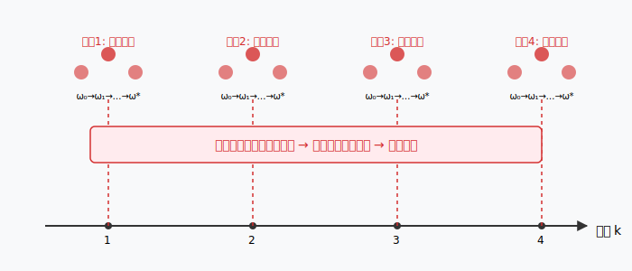
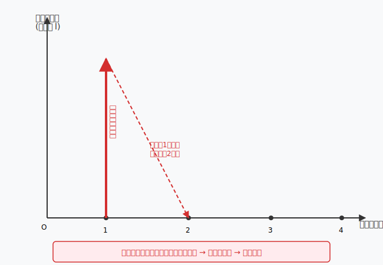


---

#### 2.2.2 正确的做法：将两个时间域耦合

正确的思路是 **将问题域与优化域耦合** ：不等待某个时刻的迭代完全收敛，而是**每个时刻只做一步（或少量几步）迭代**，用当前时刻的数据更新 $\omega$，然后立即进入下一个时刻。这样，$\omega$ 的演化过程同时受到数据时间 $k$ 和迭代步 $l$ 的共同影响，我们实际上是在**沿着数据的时间轴递推地更新滤波器系数**。

下图展示了这种正确的做法：

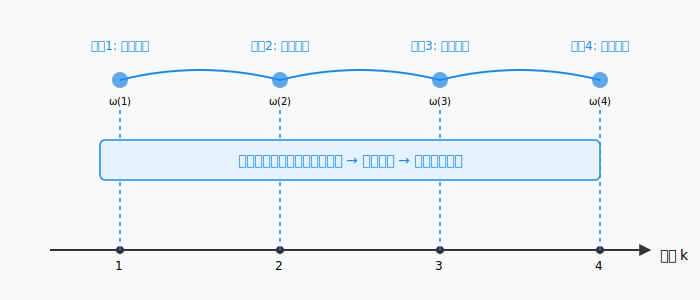
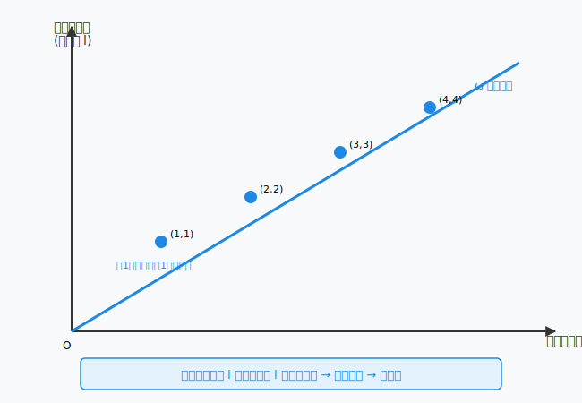

**这正是自适应滤波器的核心思想**：我们不再试图为每个时刻独立求解一个完美的 $\omega(k)$，而是利用数据的序贯性质，让 $\omega$ 随着数据的到来而**缓慢演化、持续更新**。这一演化过程等价于一个**随机逼近**过程，它同时跟踪环境的变化并逐渐靠近当前时刻的最优解。

### 2.3 时域耦合：自适应的核心问题

#### 2.3.1 两个时间域的冲突

我们面临一个根本性的矛盾：数据是实时到达的（时刻 $k=1,2,\dots$ 不断推进），而优化算法需要迭代才能收敛。如果我们在每个时刻 $k$ 都进行完整的内部迭代直到收敛，那么当算法输出 $\omega^*(k)$ 时，数据已经前进到了 $k+1$ 时刻——我们用昨天的模型处理今天的数据，这显然是荒谬的。

更糟糕的是，如果环境本身就是时变的（信号统计特性随时间变化），那么 $\omega^*(k)$ 在 $k$ 时刻可能已经不再是最优的。我们花大力气求解的那个“精确最优解”，在求解完成的那一刻就已经过时了。

#### 2.3.2 耦合的数学本质

解决这个矛盾的唯一出路是：**放弃在每个时刻追求精确最优解，转而让优化过程与数据到达过程同步进行**。具体而言，我们不再执行：

> 对每个 $k$：完整迭代 $\omega_0(k) \to \omega_1(k) \to \cdots \to \omega^*(k)$

而是执行：

> 对 $k=1,2,\dots$：$\omega(k) = \omega(k-1) + \text{一步修正}( \omega(k-1), X(k), d(k) )$

在数学上，这相当于将原来的**双层优化**（外层是数据时刻 $k$，内层是迭代步 $l$）合并为**单层递推**。我们从二维平面 $(k,l)$ 上的任意路径，退化为沿着 $l=k$ 这条对角线的路径。

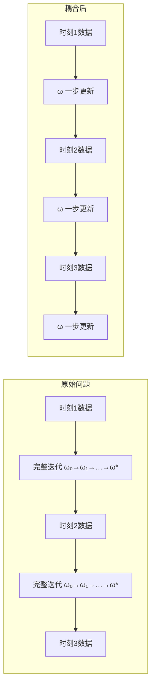

这两个图对比展示了核心差异：
- **原始双层优化**：每个时刻都有独立的内循环，直到收敛才进入下一时刻
- **耦合后的单层递推**：每个时刻只做一步更新，优化迭代与数据时刻一一对应

#### 2.3.3 耦合的数学形式

将迭代步 $l$ 与数据时刻 $k$ 耦合，意味着我们定义：
$$
\omega(k) \triangleq \omega_k(k),   \tag{10.10}$$
即第 $k$ 步迭代的结果，恰好用于处理第 $k$ 个时刻的数据。这样，更新规则的一般形式为：
$$
\omega(k+1) = \omega(k) + \Delta \omega\big(\omega(k), X(k+1), d(k+1)\big).   \tag{10.11}$$

这里 $\Delta \omega$ 通常是一个**小步长的修正量**，而不是一个完整的优化步骤。我们用**当前时刻的一个数据点**来对 $\omega$ 做一次“微调”，而不是等到积累了足够多的数据再做“大调整”。

这正是 **LMS（最小均方）算法** 所采用的形式：
$$
\omega(k+1) = \omega(k) + \mu \, e(k) \, X(k),   \tag{10.12}$$
其中 $e(k) = d(k) - \omega^\top(k) X(k)$ 是瞬时误差，$\mu$ 是步长参数。这个更新公式的每一步只用到了**当前时刻的一个样本** $(X(k), d(k))$，而不需要存储或处理历史数据。

#### 2.3.4 耦合带来的根本性转变

将两个时间域耦合，带来了三个根本性的转变：

**1. 从“精确求解”到“持续跟踪”**

我们不再追求在任何时刻得到精确的 $\omega^*$，而是让 $\omega(k)$ 在环境中持续演化。当环境平稳时，$\omega(k)$ 会逐渐收敛到 $\omega^*$；当环境变化时，$\omega(k)$ 会跟踪新的最优方向。这种“永远在追赶，永远不完美”的状态，正是自适应滤波器的常态。

**2. 从“批量处理”到“在线处理”**

原始的双层优化本质上是批量处理的——每个时刻需要用到所有历史数据（或至少一个窗口的数据）来求解最优。耦合之后，算法变成了在线处理——每到一个新数据点，只需 $O(n)$ 次运算即可更新系数，存储需求极小。这使得自适应滤波器可以在嵌入式系统和实时信号处理中实现。

**3. 从“确定性问题”到“随机逼近问题”**

耦合之前，$\omega^*(k)$ 是确定性的最优解；耦合之后，$\omega(k)$ 变成了一条随机轨迹——它依赖所有历史数据点的随机实现，本身也是随机的。分析这样的算法需要用到**随机逼近理论**（Stochastic Approximation Theory），这比传统的确定性问题要复杂得多，但也正因如此，它才能够在未知和时变的环境中工作。

**总结**：时域耦合是自适应滤波器的核心设计思想——它不是简单地“求解一个优化问题”，而是“设计一个与数据同步演化的随机过程”。LMS 算法是最简单的实现，其性能由步长 $\mu$ 控制：$\mu$ 大则收敛快但稳态误差大（波动大），$\mu$ 小则收敛慢但稳态误差小（更平稳）。这个 $\mu$ 的取舍，本质上就是在“对时变环境的适应速度”和“稳态精度”之间做权衡。后续文章将深入分析这种权衡的理论界限。


## 3. 优化算法

为了把自适应滤波器的更新机制说清楚，我们先从最基础的数值优化方法开始。优化算法大致可以分为两类：**梯度法**和**牛顿法**。它们构成了自适应滤波算法（如LMS、RLS）的理论基础。

### 3.1 梯度法（Steepest Descent）

梯度法的核心思想是：沿着目标函数下降最快的方向——即负梯度方向——逐步调整参数，从而找到函数的极小值点。

#### 3.1.1 普通的梯度法

设我们有一个目标函数 \( f(\mathbf{x}) \)，其中 \( \mathbf{x} \in \mathbb{R}^n \)。我们希望找到使 \( f \) 最小的 \( \mathbf{x}^* \)。梯度法通过迭代来逼近这个最优解。

假设当前在点 \( \mathbf{x}_k \)，我们考虑一个微小的变化 \( \Delta \mathbf{x} \)。根据泰勒展开，函数在 \( \mathbf{x}_k \) 附近的一阶近似为：
$$
f(\mathbf{x}_k + \Delta \mathbf{x}) \approx f(\mathbf{x}_k) + \mathbf{g}_k^\top \Delta \mathbf{x} + o(\|\Delta \mathbf{x}\|),   \tag{10.13}$$
其中 \( \mathbf{g}_k = \nabla_{\mathbf{x}} f(\mathbf{x}_k) \) 是梯度向量，\( o(\|\Delta \mathbf{x}\|) \) 是高阶无穷小量。

为了使函数值下降，我们需要：
$$
f(\mathbf{x}_k + \Delta \mathbf{x}) - f(\mathbf{x}_k) \approx \mathbf{g}_k^\top \Delta \mathbf{x} < 0.   \tag{10.14}$$
在单位步长约束 \( \|\Delta \mathbf{x}\| = 1 \) 下，使得 \( \mathbf{g}_k^\top \Delta \mathbf{x} \) 最小的方向是：
$$
\Delta \mathbf{x} = -\frac{\mathbf{g}_k}{\|\mathbf{g}_k\|}.   \tag{10.15}$$
也就是说，**负梯度方向是函数下降最快的方向**。因此，梯度法的迭代公式为：
$$
\mathbf{x}_{k+1} = \mathbf{x}_k - \eta \mathbf{g}_k,   \tag{10.16}$$
其中 \( \eta > 0 \) 称为**步长**（step size）或**学习率**（learning rate），控制每次更新的幅度。

下图直观展示了梯度法在二维平面上的收敛路径：

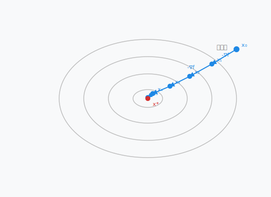

#### 3.1.2 平稳点

当梯度为零时，即：
$$
\mathbf{g}_k = \nabla_{\mathbf{x}} f(\mathbf{x}_k) = 0,   \tag{10.17}$$
迭代停止。这样的点称为**平稳点**（stationary point）。对于凸函数，平稳点就是全局最小值点；对于非凸函数，平稳点可能是局部极小值、局部极大值或鞍点。

在实际应用中，梯度法通常会在接近最优解时“振荡”或“收敛缓慢”，因为它只利用了函数的一阶信息（梯度），而没有利用二阶信息（曲率）。这引出了下一节要讨论的牛顿法。

接下来的章节中，我们将看到如何将梯度法应用到自适应滤波的具体场景中——当目标函数是均方误差时，梯度法就变成了 LMS 算法；而牛顿法的一些变体则对应了 RLS 等更复杂的自适应算法。


#### 3.1.3 动量梯度下降法（Momentum Gradient Descent）

标准梯度下降法虽然简单有效，但存在一个明显的缺陷：当目标函数的等高线呈狭长的椭圆形（即 Hessian 矩阵条件数较大）时，梯度方向并不直接指向最小值，而是来回振荡。这就好比一个盲人在山谷中摸索，他只能感知脚下的坡度，却不知道谷底的方向，于是他会不断左右摇晃，以“之”字形缓慢下降，而不是直冲谷底。

此外，在平坦区域（梯度极小），梯度下降几乎停滞，导致收敛极其缓慢。而在时变环境中（这正是自适应滤波的典型场景），一个“迟钝”的算法根本无法跟踪信号统计特性的变化。

**动量法** 正是为了解决这些问题而提出的。其核心思想是模拟物理中的“惯性”：让每一次更新不仅依赖于当前的梯度，还依赖于之前累积的“速度”。想象一个小球从山坡上滚下，它不仅受到当前坡度的引导，还由于自身的动量而保持向前的趋势。

##### 3.1.3.1 数学形式

动量法引入了一个**速度变量** \( v_k \)，其更新规则为：
$$
v_{k+1} = \beta v_k - \eta \nabla f(x_k),   \tag{10.18}$$
$$
x_{k+1} = x_k + v_{k+1}.   \tag{10.19}$$

其中：
- \( \eta \) 是学习率（步长）；
- \( \beta \) 是动量衰减系数（通常取 0.9 左右），类似于摩擦系数——它决定了上一时刻的“速度”有多少能保留到当前时刻。

如果展开递推式，可以发现速度实际上是所有历史梯度的指数加权平均：
$$
v_{k+1} = -\eta \sum_{i=0}^{k} \beta^{k-i} \nabla f(x_i).   \tag{10.20}$$
也就是说，当前更新方向**不仅看当前脚下踩的坡度（当前梯度），还综合了过去走过的路（历史梯度）**。

---

##### 3.1.3.2 动量加速收敛的机理

1. **抵消振荡**  
   在狭长的“山谷”中，梯度在某个方向上频繁改变正负号（来回摆动）。动量项对这些高频振荡进行平均，使其相互抵消，从而抑制了横向摆动，让更新方向更集中地指向谷底。

2. **加速平缓区域的移动**  
   在梯度很小的平坦区域，普通梯度下降几乎不动，但动量项可以将之前的“速度”保留下来，像冰面上的滑行者一样保持前进势头，快速穿过平原。

3. **逃离局部极小值和鞍点**  
   在非凸问题中，凭借累积的动量，算法可以“冲”过微小的凸起或鞍点，而非像普通梯度下降那样被困住。

下面这张图直观对比了普通梯度下降与动量法的收敛路径：

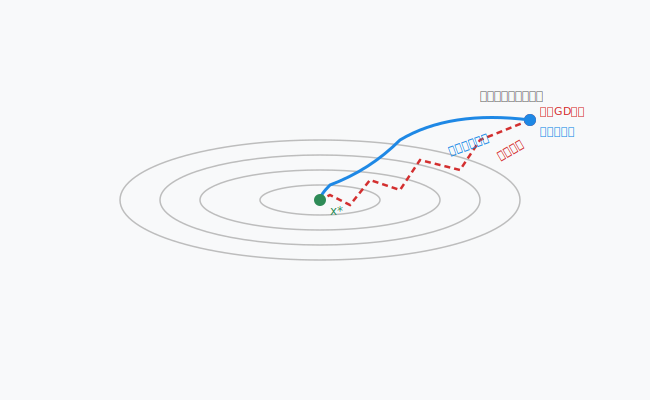

图中红色虚线表示普通梯度下降在狭长山谷中的“之”字形摆动；蓝色实线表示动量法，它利用惯性平滑了摆动，直接冲向最小值点。

---

##### 3.1.3.3 与自适应滤波的联系

动量法不仅用于深度学习的优化，其思想也渗透到了自适应信号处理中。

1. **LMS 的收敛速度问题**：标准 LMS 是普通梯度下降的随机版本，其收敛速度受限于输入信号自相关矩阵的条件数。当条件数较大时（例如语音信号），LMS 收敛极慢。

2. **含动量的 LMS 变体**：在标准 LMS 更新中，可以引入“动量”项，形成一个**二阶自适应滤波器**：
   $$
   \omega(k+1) = \omega(k) + \beta \bigl(\omega(k) - \omega(k-1)\bigr) + \mu e(k) x(k).     \tag{10.21}$$
   其中 \( \beta(\omega(k)-\omega(k-1)) \) 就是“速度”项。这种变体在回声消除和信道均衡中能够显著加快初始收敛速度，且对时变环境更为鲁棒。

3. **与 RLS 的深层联系**：从更宏观的角度看，递归最小二乘（RLS）算法之所以比 LMS 收敛快得多，本质上是因为它利用了数据的历史二阶统计量（即 Hessian 的逆）对梯度方向进行了**预条件**（preconditioning），从而消除了条件数的影响。动量法虽然没有精确计算 Hessian，但通过累积历史梯度的方向，在某种程度上也实现了近似的“方向修正”。

---

##### 3.1.3.4 小结

动量法是对梯度下降的优雅改进，它引入“惯性”解决了梯度下降在崎岖地形中振荡和停滞的困境。在自适应滤波的语境下，理解动量法有助于我们认识 LMS 的局限性，并理解为什么 RLS、NLMS 等更复杂的算法拥有更好的收敛性能。同时，动量思想也直接催生了许多工程上的变体算法。

#### 3.1.4 梯度下降法的其他改进版本

除了动量法，研究者还提出了多种改进策略，以应对梯度下降在不同场景下的缺陷。下面简要介绍几种在自适应滤波和机器学习中常见的变体。

---

##### 3.1.4.1 AdaGrad（Adaptive Gradient）

**核心思想**：对每个参数分量使用不同的学习率——频繁更新的参数用较小的学习率，稀疏更新的参数用较大的学习率。

**更新规则**： $$
G_{k+1} = G_k + \nabla f(x_k) \odot \nabla f(x_k),
  \tag{10.22}$$
 $$
x_{k+1} = x_k - \frac{\eta}{\sqrt{G_{k+1}} + \epsilon} \odot \nabla f(x_k),
  \tag{10.23}$$
其中 $\odot$ 表示逐元素相乘，$G_k$ 是累积平方梯度向量，$\epsilon$ 是防止除零的小常数。

**特点**：
- 适合处理**稀疏特征**问题（如自然语言处理、稀疏系统辨识）。
- 无需手动调整学习率。
- **缺点**：累积平方梯度单调增长，学习率最终趋于零，导致算法过早停止。

---

##### 3.1.4.2 RMSProp（Root Mean Square Propagation）

**核心思想**：AdaGrad 的“学习率消亡”问题源于梯度平方的单调累积。RMSProp 改用**指数加权移动平均**来估计梯度平方，使得最近梯度的影响更大，从而避免学习率衰减到零。

**更新规则**： $$
v_{k+1} = \beta v_k + (1-\beta) \nabla f(x_k) \odot \nabla f(x_k),
  \tag{10.24}$$
 $$
x_{k+1} = x_k - \frac{\eta}{\sqrt{v_{k+1}} + \epsilon} \odot \nabla f(x_k).
  \tag{10.25}$$

**特点**：
- 非常适合处理**非平稳目标**——这也是自适应滤波的核心场景。
- 在深度学习中广泛使用，已被证明对各种非凸问题鲁棒。
- **与自适应滤波的联系**：RMSProp 的思想与 **归一化 LMS（NLMS）** 有相似之处——NLMS 也是根据输入信号的功率动态调整步长，以保持稳定的收敛行为。

---

##### 3.1.4.3 Adam（Adaptive Moment Estimation）

**核心思想**：结合**动量**（一阶矩）和 **RMSProp**（二阶矩）的优点，同时估计梯度的均值和未中心化的方差。

**更新规则**： $$
m_{k+1} = \beta_1 m_k + (1-\beta_1) \nabla f(x_k),
  \tag{10.26}$$
 $$
v_{k+1} = \beta_2 v_k + (1-\beta_2) \nabla f(x_k) \odot \nabla f(x_k),
  \tag{10.27}$$
 $$
\hat{m}_{k+1} = \frac{m_{k+1}}{1 - \beta_1^{k+1}}, \quad
\hat{v}_{k+1} = \frac{v_{k+1}}{1 - \beta_2^{k+1}},
  \tag{10.28}$$
 $$
x_{k+1} = x_k - \eta \frac{\hat{m}_{k+1}}{\sqrt{\hat{v}_{k+1}} + \epsilon}.
  \tag{10.29}$$

**特点**：
- 目前最流行的通用优化器之一，收敛快、稳定性高。
- 对超参数选择相对鲁棒。
- **与自适应滤波的联系**：Adam 在自适应滤波中可作为 **RLS 的一种廉价替代**——它不需要存储和求逆协方差矩阵，却能在某些场景下获得接近 RLS 的收敛速度。

---

##### 3.1.4.4 Nesterov 加速梯度（NAG, Nesterov Accelerated Gradient）

**核心思想**：动量法先走一步“试探”，再看梯度。即先按照动量方向“提前看一眼”未来的位置，然后在未来位置处计算梯度，再修正方向。

**更新规则**： $$
x_{k+1}^{\text{lookahead}} = x_k + \beta v_k,
  \tag{10.30}$$
 $$
v_{k+1} = \beta v_k - \eta \nabla f(x_{k+1}^{\text{lookahead}}),
  \tag{10.31}$$
 $$
x_{k+1} = x_k + v_{k+1}.
  \tag{10.32}$$

**特点**：
- 比标准动量法更稳定，尤其在接近最优解时。
- 在凸优化中有严格的理论收敛速度保证。
- **与自适应滤波的联系**：某些高级自适应算法（如仿射投影算法 APA）在更新时也会“预判”未来数据，NAG 的思想可用于改进 APA 的更新方向。

---

##### 3.1.4.5 对比总结

| 方法 | 自适应学习率 | 动量 | 适用场景 | 对应自适应滤波算法 |
|------|:---:|:---:|----------|-------------------|
| 普通梯度下降 | 否 | 否 | 平稳凸问题 | 标准 LMS |
| 动量法 | 否 | 是 | 狭长山谷、非平稳 | 带动量的 LMS |
| AdaGrad | 是 | 否 | 稀疏数据 | 频域自适应滤波 |
| RMSProp | 是 | 否 | 非平稳 | NLMS 的变体 |
| Adam | 是 | 是 | 通用深度学习 | 可视为 RLS 的廉价替代 |
| NAG | 否 | 是（改进） | 凸优化、强凸 | 改进型 APA |

---
### 3.2 Newton 方法

梯度法只利用了目标函数的一阶信息（梯度），因此当等高线为狭长椭圆形时，梯度方向并不直接指向最小值，导致收敛缓慢。**Newton 方法**通过引入二阶信息（Hessian 矩阵）来克服这一缺陷，实现了更快的收敛速度。

#### 3.2.1 基本原理

Newton 方法的思想是对目标函数 \( f(\mathbf{x}) \) 在当前点 \( \mathbf{x}_k \) 附近进行**二阶泰勒展开**，然后直接求解这个二次近似模型的最小值点。

二阶泰勒展开： $$
f(\mathbf{x}_k + \Delta \mathbf{x}) \approx f(\mathbf{x}_k) + \mathbf{g}_k^\top \Delta \mathbf{x} + \frac{1}{2} \Delta \mathbf{x}^\top \mathbf{H}_k \Delta \mathbf{x},
  \tag{10.33}$$
其中：
- \( \mathbf{g}_k = \nabla f(\mathbf{x}_k) \) 是梯度向量；
- \( \mathbf{H}_k = \nabla^2 f(\mathbf{x}_k) \) 是 Hessian 矩阵（二阶偏导数矩阵）。

为了找到这个二次函数的极小值点，我们对 \( \Delta \mathbf{x} \) 求导并令其为零： $$
\nabla_{\Delta \mathbf{x}} \left( f(\mathbf{x}_k) + \mathbf{g}_k^\top \Delta \mathbf{x} + \frac{1}{2} \Delta \mathbf{x}^\top \mathbf{H}_k \Delta \mathbf{x} \right) = \mathbf{g}_k + \mathbf{H}_k \Delta \mathbf{x} = 0.
  \tag{10.34}$$

解得： $$
\Delta \mathbf{x} = -\mathbf{H}_k^{-1} \mathbf{g}_k.
  \tag{10.35}$$

因此，Newton 方法的迭代公式为： $$
\mathbf{x}_{k+1} = \mathbf{x}_k - \mathbf{H}_k^{-1} \mathbf{g}_k.
  \tag{10.36}$$

#### 3.2.2 几何直观

下图对比了梯度法与 Newton 方法在狭长山谷中的收敛路径：
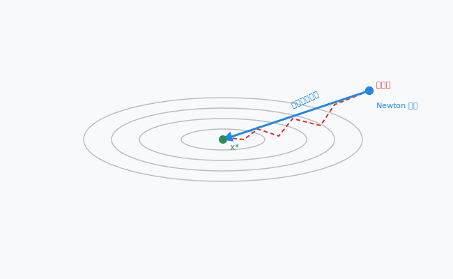

图中红色虚线是梯度下降的“之”字形路径，而蓝色实线是 Newton 方法的一步直达路径。Newton 方法之所以如此高效，是因为 Hessian 矩阵包含了曲率信息，相当于“知道”了山谷的走向，从而能够直接指向谷底。

#### 3.2.3 Newton 方法的优缺点

**优点**：
1. **收敛速度快**：在最优解附近，Newton 方法具有**二阶收敛性**，即误差在每步迭代中呈平方级衰减。
2. **方向准确**：Hessian 矩阵的逆相当于对梯度方向进行了“白化”，消除了不同方向上尺度差异的影响。

**缺点**：
1. **计算量巨大**：每一步都需要计算 Hessian 矩阵（\( O(n^2) \) 个元素）并求其逆（\( O(n^3) \)），在高维问题中几乎不可行。
2. **存储需求高**：需要存储 \( n \times n \) 的 Hessian 矩阵。
3. **Hessian 可能奇异**：在非凸区域或鞍点附近，Hessian 可能不正定，导致 Newton 方向错误甚至发散。

#### 3.2.4 与自适应滤波的联系

Newton 方法在自适应滤波中的直接对应是 **递归最小二乘（RLS）** 算法：

- **梯度法 → LMS**：用瞬时梯度代替统计梯度，一步一更新。
- **Newton 法 → RLS**：用样本协方差矩阵的逆代替 Hessian 矩阵，实现更快的收敛速度。

RLS 的核心更新公式为： $$
\omega(k+1) = \omega(k) + \mathbf{P}(k) \, e(k) \, X(k),
  \tag{10.37}$$
其中 \( \mathbf{P}(k) \) 是协方差逆矩阵的递推估计，它扮演了 Hessian 逆 \( \mathbf{H}^{-1} \) 的角色。正是这个“预条件”矩阵，使得 RLS 在收敛速度上远远优于 LMS，尤其在输入信号相关性较强时。

#### 3.2.5 Quasi-Newton 方法

为了克服 Newton 方法的计算瓶颈，研究者提出了**拟 Newton 方法**（Quasi-Newton Methods），其核心思想是**不直接计算 Hessian 矩阵，而是利用梯度信息逐步逼近 Hessian 或其逆**。

代表性算法包括：
- **DFP（Davidon-Fletcher-Powell）**
- **BFGS（Broyden-Fletcher-Goldfarb-Shanno）**

BFGS 的更新公式为： $$
\mathbf{H}_{k+1} = \mathbf{H}_k + \frac{\mathbf{y}_k \mathbf{y}_k^\top}{\mathbf{y}_k^\top \mathbf{s}_k} - \frac{\mathbf{H}_k \mathbf{s}_k \mathbf{s}_k^\top \mathbf{H}_k}{\mathbf{s}_k^\top \mathbf{H}_k \mathbf{s}_k},
  \tag{10.38}$$
其中 \( \mathbf{s}_k = \mathbf{x}_{k+1} - \mathbf{x}_k \)，\( \mathbf{y}_k = \mathbf{g}_{k+1} - \mathbf{g}_k \)。

在自适应滤波中，**RLS 本质上就是一种在线实现的拟 Newton 方法**——它递推地更新协方差逆矩阵，避免了每次重新计算 Hessian 的 \( O(n^3) \) 开销。RLS 的复杂度为 \( O(n^2) \)，远低于标准 Newton 方法，同时保持了接近 Newton 的收敛速度。

#### 3.2.6 小结

| 方法 | 利用信息 | 收敛速度 | 计算复杂度 | 自适应对应 |
|------|---------|---------|-----------|-----------|
| 梯度法 | 一阶（梯度） | 线性 | \( O(n) \) | LMS |
| Newton 法 | 二阶（Hessian） | 二阶 | \( O(n^3) \) | 理想 RLS |
| 拟 Newton（BFGS） | 近似 Hessian | 超线性 | \( O(n^2) \) | — |
| RLS | 递推协方差逆 | 超线性 | \( O(n^2) \) | RLS |

理解 Newton 方法及其与梯度法的区别，是理解为什么 RLS 比 LMS 收敛更快的关键——RLS 通过对梯度进行“预条件”，消除了输入信号相关性对收敛速度的负面影响。


## 4. 自适应的本质

经过前面几节的铺垫——从问题的形式化、两个时间域的冲突与耦合，到梯度法和牛顿法等优化工具的引入——我们现在可以给“自适应滤波器”下一个准确而完整的定义。

---

### 4.1 自适应的本质

**自适应滤波器**是一种其系数能够根据输入信号的统计特性自动调整的滤波器，它通过一个**反馈回路**来持续优化自身的性能。

与固定系数滤波器（如维纳滤波器）的对比如下：

| 维度 | 固定滤波器 | 自适应滤波器 |
|------|-----------|-------------|
| 系数 | 预先计算，固定不变 | 随时间演化，持续更新 |
| 先验知识 | 需要已知信号的二阶统计量 | 不需要，直接从数据中学习 |
| 环境适应性 | 仅适用于设计时的环境 | 能跟踪时变环境 |
| 设计方式 | 一次性离线设计 | 在线递推更新 |
| 适用场景 | 平稳信号 | 平稳与非平稳信号均可 |

自适应滤波器之所以“自适应”，是因为它能够在运行过程中不断利用新到的数据来修正自己的行为，而不是像传统滤波器那样“一次设计，终身使用”。

---

### 4.2 自适应滤波器的三个核心要素

从工程实现的角度看，一个自适应滤波器由以下三个要素构成：

**1. 误差信号** \( e(k) \)

误差是自适应滤波器的“驱动力”。它定义为期望响应 \( d(k) \) 与实际输出 \( \hat{d}(k) = \omega^\top(k) X(k) \) 之差： $$
e(k) = d(k) - \omega^\top(k) X(k).
  \tag{10.39}$$
误差信号承载了“当前滤波器还有多少不足”的信息：误差越大，说明滤波器离最优越远，需要越大的调整。

**2. 代价函数** \( J(\omega) \)

代价函数是自适应滤波器优化目标的数学表达。最常用的是均方误差（MSE）： $$
J(\omega) = \mathbb{E}[e^2(k)].
  \tag{10.40}$$
但由于统计期望未知，实际中只能用瞬时值或有限样本平均来近似。不同的代价函数选择会导致不同的自适应算法：
- 瞬时平方误差 \( e^2(k) \) → **LMS 算法**
- 指数加权最小二乘 \( \sum_{i=1}^k \lambda^{k-i} e^2(i) \) → **RLS 算法**

**3. 更新规则（自适应算法）**

更新规则定义了如何利用当前误差信号来调整滤波器系数。它是自适应滤波器的“大脑”。常见的更新规则包括：
- **LMS**：\( \omega(k+1) = \omega(k) + \mu \, e(k) \, X(k) \)
- **NLMS**：\( \omega(k+1) = \omega(k) + \frac{\mu}{\|X(k)\|^2} e(k) X(k) \)
- **RLS**：\( \omega(k+1) = \omega(k) + \mathbf{P}(k) e(k) X(k) \)

这些更新规则本质上都是对某个优化问题的近似求解——它们的目标是让滤波器系数沿着使代价函数减小的方向移动。

---

### 4.3 自适应的另一种视角：反馈控制系统

从控制论的角度看，自适应滤波器本质上是一个**反馈控制系统**：

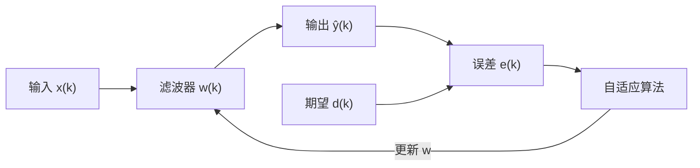

图中清晰地展示了反馈回路：误差信号驱动自适应算法，算法更新滤波器系数，滤波器改变输出，进而改变误差。这个闭环结构使得滤波器能够“自我调节”——这正是“自适应”一词的来源。

---

### 4.4 自适应的数学本质

从数学上讲，自适应滤波器是在求解一个**随机优化问题**： $$
\min_{\omega} \; \mathbb{E}\big[ L(d(k), \omega^\top X(k)) \big],
  \tag{10.41}$$
但由于：
1. 统计期望 \( \mathbb{E} \) 未知；
2. 数据是实时到达的（非批量）；
3. 环境可能是时变的；

因此，我们不能用标准的批量优化方法，而是采用**随机逼近**（Stochastic Approximation）或**在线学习**（Online Learning）的方法——每来一个样本就更新一次系数。这正是 Robbins-Monro 算法在自适应滤波中的具体体现。

---

### 4.5 自适应的核心权衡

任何自适应滤波器都面临一个**根本性的权衡**：

| 指标 | 含义 | 受什么影响 |
|------|------|-----------|
| **收敛速度** | 从初始状态到达最优解附近所需的时间 | 步长越大，收敛越快 |
| **稳态误差**（失调） | 收敛后系数围绕最优解的波动幅度 | 步长越大，稳态误差越大 |
| **跟踪能力** | 对时变环境的响应速度 | 步长越大，跟踪越快 |

这三个指标之间存在内在冲突：
- 想要**收敛快**？→ 大步长
- 想要**稳态误差小**？→ 小步长
- 想要**跟踪时变**？→ 大步长

**没有一种步长能同时满足所有要求**。这正是自适应滤波器设计的核心难题，也是后续所有算法改进（变步长、归一化、RLS 等）的出发点。

---

### 4.6 一句话定义

> **自适应滤波器是一种通过反馈机制在线调整系数的信号处理器，它能够在信号统计特性未知或时变的环境中，自动逼近并跟踪最优滤波性能。**

这个定义包含了四个关键要素：
- **反馈机制**：误差驱动
- **在线调整**：逐样本更新
- **统计未知**：无需先验知识
- **跟踪能力**：适应时变环境

接下来的章节中，我们将看到第一个具体的自适应算法——**LMS 算法**——是如何以最简单的方式实现上述四个要素的。

## 5. LMS 滤波器

### 5.1 问题描述

在自适应滤波器的标准设定中，我们有一个时变的输入信号向量 \( X(k) \in \mathbb{R}^n \) 和一个期望响应 \( d(k) \in \mathbb{R} \)。我们希望设计一个线性滤波器，其输出为： $$
\hat{d}(k) = \omega_k^\top X(k),
  \tag{10.42}$$
其中 \( \omega_k \in \mathbb{R}^n \) 是第 \( k \) 时刻的滤波器系数向量。我们的目标是使输出 \( \hat{d}(k) \) 尽可能接近期望响应 \( d(k) \)。

### 5.2 损失函数

采用均方误差（MSE）作为性能度量： $$
J(\omega_k) = \mathbb{E}\big[ (d(k) - \omega_k^\top X(k))^2 \big] = \mathbb{E}[e^2(k)],
  \tag{10.43}$$
其中 \( e(k) = d(k) - \omega_k^\top X(k) \) 是瞬时误差。

### 5.3 优化问题

我们希望找到最优系数 \( \omega_{\text{opt}} \) 使得均方误差最小化： $$
\omega_{\text{opt}} = \arg\min_{\omega} \mathbb{E}[(d(k) - \omega^\top X(k))^2].
  \tag{10.44}$$

### 5.4 梯度下降求解

#### 5.4.1 梯度计算

对损失函数求梯度： $$
\nabla_{\omega} L(d(k), \omega^\top(k) X(k)) = - \mathbb{E}[X(k) e(k)],
  \tag{10.45}$$
其中 \( e(k) = d(k) - \hat{\omega}_k^\top X(k) \)。

#### 5.4.2 误差计算

瞬时误差定义为： $$
e(k) = d(k) - \hat{\omega}_k^\top X(k).
  \tag{10.46}$$

#### 5.4.3 迭代更新

采用随机梯度下降，LMS 的迭代公式为： $$
\hat{\omega}_{k+1} = \hat{\omega}_{k} - \mu \, \mathbb{E}[X(k) e(k)].
  \tag{10.47}$$
由于期望未知，实际中用瞬时值代替： $$
\hat{\omega}_{k+1} = \hat{\omega}_{k} + \mu \, e(k) \, X(k).
  \tag{10.48}$$

#### 5.4.4 收敛性分析（均值收敛）

为了分析 LMS 算法的收敛行为，定义权值误差向量： $$
\epsilon_k = \omega_{\text{opt}} - \hat{\omega}_{k}.
  \tag{10.49}$$
当 \( k \to \infty \) 时，我们希望 \( \epsilon_k \to 0 \)，即 \( \lim_{k \to \infty} \epsilon_k = 0 \)。

由 (10.48) 可得： $$
\omega_{\text{opt}} - \hat{\omega}_{k+1} = \omega_{\text{opt}} - \hat{\omega}_{k} + \mu \, X(k) \, e(k).
  \tag{10.50}$$
即： $$
\epsilon_{k+1} = \epsilon_{k} + \mu \, X(k) \, e(k).
  \tag{10.51}$$

将误差表达式展开。首先定义最优误差： $$
e_{\text{opt}}(k) = d(k) - \omega_{\text{opt}}^\top X(k),
  \tag{10.52}$$
则： $$
d(k) = e_{\text{opt}}(k) + \omega_{\text{opt}}^\top X(k).
  \tag{10.53}$$

代入 (10.51)： $$
\begin{aligned}
\epsilon_{k+1} &= \epsilon_{k} + \mu X(k) \big( d(k) - X^\top(k) \hat{\omega}_k \big) \\
&= \epsilon_{k} + \mu X(k) \big( e_{\text{opt}}(k) + \omega_{\text{opt}}^\top X(k) - \hat{\omega}_k^\top X(k) \big) \\
&= \epsilon_{k} + \mu X(k) \big( e_{\text{opt}}(k) + (\omega_{\text{opt}} - \hat{\omega}_k)^\top X(k) \big) \\
&= \epsilon_{k} + \mu X(k) e_{\text{opt}}(k) + \mu X(k) X^\top(k) \epsilon_k \\
&= \big( I + \mu X(k) X^\top(k) \big) \epsilon_k + \mu X(k) e_{\text{opt}}(k).
\end{aligned}
  \tag{10.54}$$

这里我们得到了权值误差的递推关系，它是随机的，因为 \( X(k) \) 和 \( e_{\text{opt}}(k) \) 都是随机变量。

#### 5.4.5 均值收敛条件

对 (10.54) 两边取期望，令 \( m_k = \mathbb{E}[\epsilon_k] \)，并假设 \( \epsilon_k \) 与 \( X(k) \) 独立（独立性假设），且 \( e_{\text{opt}}(k) \) 与 \( X(k) \) 不相关（由正交性原理），则： $$
\mathbb{E}[\epsilon_{k+1}] = \mathbb{E}\big[ (I + \mu X(k) X^\top(k)) \epsilon_k \big] + \mu \mathbb{E}[X(k) e_{\text{opt}}(k)].
  \tag{10.55}$$
由于 \( \mathbb{E}[X(k) e_{\text{opt}}(k)] = 0 \)，且 \( \epsilon_k \) 与 \( X(k) \) 独立： $$
\mathbb{E}[\epsilon_{k+1}] = \mathbb{E}\big[ (I + \mu X(k) X^\top(k)) \big] \mathbb{E}[\epsilon_k].
  \tag{10.56}$$
记 \( R = \mathbb{E}[X(k) X^\top(k)] \)，则： $$
m_{k+1} = (I + \mu R) \, m_k.
  \tag{10.57}$$

#### 5.4.6 收敛条件分析

**情况 1：一维（\( n=1 \)）**

此时 \( R = r = \mathbb{E}[X^2(k)] > 0 \)，递推式为： $$
m_{k+1} = (1+ \mu r) m_k.
  \tag{10.58}$$
为使 \( m_{k+1} \lt m_k \)，需要： $$
|1 + \mu r| < 1 \quad \Longrightarrow \quad -1 < 1 + \mu r < 1 \quad \Longrightarrow \quad -2 < \mu r < 0 \quad \Longrightarrow \quad -\frac{2}{r} < \mu < 0.
  \tag{10.59}$$
即： $$
\mu \in \left(-\frac{2}{r},\; 0\right).
  \tag{10.60}$$

**情况 2：多维但 \( R \) 为对角阵**

设 \( R = \operatorname{diag}(\lambda_1, \dots, \lambda_n) \)，其中 \( \lambda_i > 0 \)。则 (10.57) 在每个分量上解耦： $$
m_{k+1,i} = (1 + \mu \lambda_i) m_{k,i}, \quad i=1,\dots,n.
  \tag{10.61}$$
收敛条件为： $$
|1 + \mu \lambda_i| < 1, \quad \forall i,
  \tag{10.62}$$
等价于： $$
-\frac{2}{\lambda_i} < \mu < 0, \quad \forall i.
  \tag{10.63}$$
取最紧的约束： $$
\mu \in \left(-\frac{2}{\max_i \lambda_i},\; 0\right).
  \tag{10.64}$$

**情况 3：一般对称正定矩阵 \( R \)**

由于 \( R \) 对称正定，可以正交对角化：\( R = Q \Lambda Q^\top \)，其中 \( Q \) 是正交矩阵，\( \Lambda = \operatorname{diag}(\lambda_1, \dots, \lambda_n) \)，且 \( \lambda_i > 0 \)。

将 (10.57) 代入： $$
m_{k+1} = (I + \mu R) m_k = (I + \mu Q \Lambda Q^\top) m_k = (Q Q^\top + \mu Q \Lambda Q^\top) m_k = Q (I + \mu \Lambda) Q^\top m_k.
  \tag{10.65}$$
令 \( \tilde{m}_k = Q^\top m_k \)，则： $$
\tilde{m}_{k+1} = Q^\top (I + \mu \Lambda) Q^\top m_k \quad \text{（注意这里原稿可能有笔误）}
  \tag{10.66}$$
但更准确地，左乘 \( Q^\top \) 得： $$
Q^\top m_{k+1} = (I + \mu \Lambda) Q^\top m_k,
  \tag{10.67}$$
即： $$
\tilde{m}_{k+1} = (I + \mu \Lambda) \tilde{m}_k.
  \tag{10.68}$$
其中 \( \Lambda = \operatorname{diag}(\lambda_1, \dots, \lambda_n) \)。

各分量解耦，收敛条件仍为： $$
|1 + \mu \lambda_i| < 1, \quad \forall i,
  \tag{10.69}$$
因此： $$
\mu \in \left(-\frac{2}{\lambda_{\max}},\; 0\right),
  \tag{10.70}$$
其中 \( \lambda_{\max} = \max_i \lambda_i \) 是 \( R \) 的最大特征值。

---

**最终结论**：LMS 算法均值收敛的步长条件为： $$
\boxed{0 < \mu < \frac{2}{\lambda_{\max}(R)}}.
  \tag{10.71}$$

这个条件保证了权值误差的均值 \( m_k = \mathbb{E}[\epsilon_k] \) 趋向于零，即滤波器在平均意义上收敛到维纳解。但需要注意的是，这只是**均值收敛**条件，实际算法还存在波动（失调），后续将分析均方收敛条件，会给出更严格的步长上界。


## 6. 应用实例

在深入理论分析之后，我们通过三个经典应用来直观感受 LMS 算法的工作方式。这些例子涵盖了自适应滤波的三大典型场景：**信号抵消**、**信道均衡**和**系统辨识**。每个例子均提供可运行的 Python 代码片段。

---

### 6.1 旁瓣对消（Sidelobe Cancellation / Echo Cancellation）

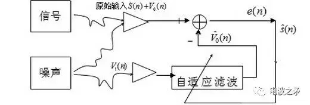

**问题描述**：在通信或声学系统中，我们常常需要消除从主信号中混入的干扰（如回声、多径反射）。假设我们有一个主信号 \( d(k) \)，其中包含了我们想要的有用信号 \( s(k) \) 和一个与辅助输入 \( x(k) \) 相关的干扰成分。辅助输入 \( x(k) \) 与干扰高度相关，但与有用信号不相关。通过自适应滤波器，我们可以从 \( x(k) \) 中估计出干扰，然后从主信号中减去，从而恢复有用信号。

**场景**：免提电话中的声学回声消除。扬声器播放信号被麦克风采集，形成回声。我们以播放信号作为参考输入 \( x(k) \)，以麦克风信号作为期望响应 \( d(k) \)，自适应滤波器估计回声路径的冲激响应，输出回声估计 \( \hat{y}(k) \)，然后从麦克风信号中减去，得到干净的语音信号 \( e(k) \)。

**Python 示例**（模拟回声消除）：

```python
import numpy as np
import matplotlib.pyplot as plt

# 生成模拟数据
np.random.seed(42)
N = 2000                      # 样本数
x = np.random.randn(N)        # 参考输入（如扬声器信号）
h_true = np.array([0.8, -0.5, 0.3, -0.1])  # 真实回声路径（长度4）
d = np.convolve(x, h_true, mode='same') + 0.1 * np.random.randn(N)  # 麦克风信号（含噪声）

# LMS 算法
mu = 0.05                     # 步长
M = len(h_true)               # 滤波器阶数
w = np.zeros(M)               # 初始系数
e = np.zeros(N)               # 误差（消除后的信号）
y = np.zeros(N)               # 估计的回声

for k in range(M, N):
    xk = x[k-M+1:k+1][::-1]   # 当前时刻的输入向量（翻转顺序）
    y[k] = np.dot(w, xk)      # 滤波器输出
    e[k] = d[k] - y[k]        # 误差
    w += mu * e[k] * xk       # LMS 更新

# 画图
plt.figure(figsize=(10, 6))
plt.subplot(2,1,1)
plt.plot(d[:500], label='麦克风信号（含回声）')
plt.plot(e[:500], label='消除后信号')
plt.legend()
plt.title('时域波形')
plt.subplot(2,1,2)
plt.stem(h_true, linefmt='b-', markerfmt='bo', basefmt='k-', label='真实回声路径')
plt.stem(w, linefmt='r-', markerfmt='rx', basefmt='k-', label='估计路径')
plt.legend()
plt.title('冲激响应估计')
plt.tight_layout()
plt.show()
```

---

### 6.2 信道均衡（Channel Equalization）

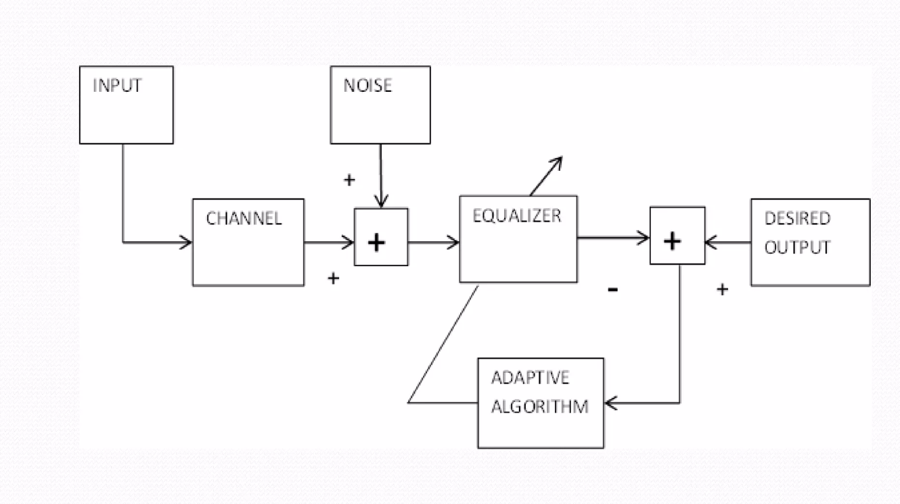
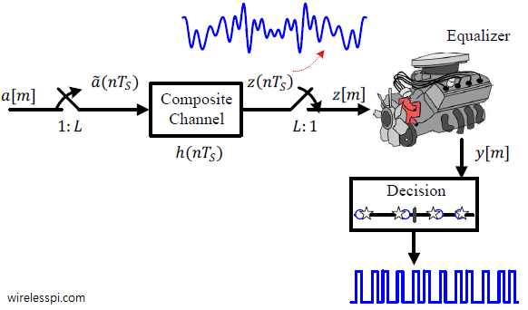
**问题描述**：通信信道（如无线信道、电缆）会引起符号间干扰（ISI），使接收信号发生畸变。均衡器的作用是设计一个逆滤波器，补偿信道的频率选择性衰落，恢复原始发送信号。由于信道特性可能随时间变化，自适应均衡器可以跟踪信道变化。

**场景**：数字通信系统中，发送符号 \( s(k) \) 经过未知信道 \( h \)（冲激响应）和加性噪声后得到接收信号 \( d(k) \)。均衡器以接收信号 \( d(k) \) 作为输入，以延迟的发送符号 \( s(k-\Delta) \) 作为期望响应，训练自适应滤波器系数，使其逼近信道逆。

**理论**：若信道冲激响应为 \( h \)，理想均衡器 \( w_{\text{opt}} \) 应满足 \( h * w_{\text{opt}} \approx \delta \)（单位脉冲），在频域即 \( W_{\text{opt}}(\omega) = 1/H(\omega) \)。在均衡问题中，当信道的逆存在时，最优解是信道逆滤波器，即 \( e_{\text{opt}} = C^{-1} \)（其中 \( C \) 是信道卷积矩阵）。LMS 算法可以自适应地逼近这个逆滤波器。

**Python 示例**：

```python
import numpy as np
import matplotlib.pyplot as plt

# 生成发送符号
np.random.seed(42)
N = 3000
s = np.random.choice([-1, 1], N)   # QPSK 或 BPSK 符号

# 信道冲激响应（非最小相位信道，加剧难度）
h = np.array([0.5, 0.8, -0.4])    # 信道
d = np.convolve(s, h, mode='same') + 0.2 * np.random.randn(N)  # 接收信号

# 期望响应：延迟的发送符号（Δ = 2）
delta = 2
desired = s[delta:N]              # 用于训练的期望符号
# 将输入数据对齐
X = np.zeros((N - delta, len(h)))
for i in range(len(h)):
    X[:, i] = d[delta - i: N - i] if delta - i >= 0 else 0

# LMS 均衡器
mu = 0.01
M = len(h) + 2                    # 增加滤波器长度以适应逆滤波器
w = np.zeros(M)
e = np.zeros(N - delta)

for k in range(M, len(X)):
    xk = X[k-M+1:k+1, :].flatten()[::-1]  # 构造输入向量（注意维度）
    # 更稳健的写法：直接用 d 的滑动窗口
    xk = d[k-M+1:k+1][::-1]
    y = np.dot(w, xk)
    e[k] = desired[k] - y
    w += mu * e[k] * xk

# 画出收敛曲线和均衡后的符号
plt.figure(figsize=(10,5))
plt.plot(e**2, label='平方误差')
plt.xlabel('迭代次数')
plt.ylabel('MSE')
plt.legend()
plt.title('均衡器学习曲线')
plt.show()

# 计算误码率（简单判断）
estimated = np.sign(np.convolve(d, w, mode='same')[delta:N])
# 这里省略了详细的误码率计算
```

---

### 6.3 系统辨识（System Identification / Black Box）

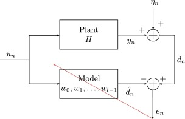
**问题描述**：我们有一个未知的线性时不变系统（黑盒），只能观察到它的输入和输出。系统辨识的目标是根据输入输出数据估计系统的冲激响应（或传递函数）。LMS 自适应滤波器可以直接用于此任务——将未知系统与自适应滤波器并行，调整滤波器系数使其输出与未知系统输出一致。

**场景**：建模一个未知的传感器动态、通信信道或音频系统。我们给系统施加已知输入信号 \( x(k) \)，测量其输出 \( d(k) \)。将同一个输入信号也送入自适应滤波器，利用 LMS 算法更新滤波器系数，使其输出逼近 \( d(k) \)。当算法收敛后，滤波器的系数就是未知系统的冲激响应估计。

**Python 示例**：

```python
import numpy as np
import matplotlib.pyplot as plt

# 真实未知系统（示例为低通滤波器）
np.random.seed(42)
N = 2000
x = np.random.randn(N) * 0.8   # 输入（白噪声）
h_unknown = np.array([0.6, 0.3, 0.1])  # 未知系统冲激响应
d = np.convolve(x, h_unknown, mode='same') + 0.01 * np.random.randn(N)  # 输出加噪声

# LMS 辨识
mu = 0.1
M = len(h_unknown) + 2          # 稍长一点
w = np.zeros(M)
e = np.zeros(N)

for k in range(M, N):
    xk = x[k-M+1:k+1][::-1]    # 输入向量
    y = np.dot(w, xk)
    e[k] = d[k] - y
    w += mu * e[k] * xk

# 结果展示
plt.figure(figsize=(10,5))
plt.subplot(2,1,1)
plt.plot(h_unknown, 'bo-', label='真实系统')
plt.plot(w[:len(h_unknown)], 'rx-', label='估计系统')
plt.legend()
plt.title('冲激响应对比')
plt.subplot(2,1,2)
plt.plot(e**2)
plt.xlabel('迭代次数')
plt.ylabel('平方误差')
plt.title('学习曲线')
plt.tight_layout()
plt.show()
```


## 7. 课后总结

本文作为自适应滤波器单元的绪论，从优化方法、系统建模和算法实现三个层面，系统梳理了自适应滤波器的基本概念、核心原理和典型算法。下面按知识点进行快速回顾。

---

### 7.1 从固定滤波到自适应滤波

- **固定滤波器**（如维纳滤波、经典卡尔曼滤波）：需要预先知道信号的二阶统计量或系统模型，一次设计，终身使用，适用于平稳环境。
- **自适应滤波器**：通过反馈机制在线调整系数，无需先验知识，能够跟踪时变环境。其本质是在**随机优化**框架下，用**随机逼近**代替批量求解。

| 维度 | 固定滤波器 | 自适应滤波器 |
|------|-----------|-------------|
| 系数 | 预先计算，固定不变 | 随时间演化，持续更新 |
| 先验知识 | 需要已知统计量或模型 | 不需要，从数据中学习 |
| 环境适应性 | 仅适用于设计时的环境 | 能跟踪时变环境 |
| 设计方式 | 一次性离线设计 | 在线递推更新 |

---

### 7.2 自适应滤波器的核心要素

1. **误差信号** $e(k)$：$e(k) = d(k) - \omega_k^\top X(k)$，是滤波器调整的“驱动力”。
2. **代价函数** $J(\omega)$：衡量滤波器性能的指标，最常用的是均方误差（MSE）：$J(\omega) = \mathbb{E}[e^2(k)]$。
3. **更新规则（自适应算法）**：利用当前误差调整滤波器系数的递推公式，如 LMS、NLMS、RLS 等。

---

### 7.3 自适应滤波器的本质：反馈控制系统

自适应滤波器构成一个**闭环反馈系统**：误差信号驱动自适应算法，算法更新滤波器系数，滤波器改变输出，进而改变误差。这种结构赋予了系统“自我调节”的能力，使其能够在统计特性未知或时变的环境中自动工作。

---

### 7.4 LMS 算法（核心结论）

- **定义**：用瞬时梯度代替真实统计梯度进行随机梯度下降，是最简单的自适应滤波算法。
- **迭代公式**： 
  
  $$
  \hat{\omega}_{k+1} = \hat{\omega}_k + \mu \, e(k) \, X(k).
   $$

- **误差定义**： 

$$
  e(k) = d(k) - \hat{\omega}_k^\top X(k).
   $$
   
- **计算复杂度**：每次迭代 $O(n)$ 次乘法，极其高效。

---

### 7.5 LMS 收敛性分析（关键结果）

定义权值误差向量： 

$$
\epsilon_k = \omega_{\text{opt}} - \hat{\omega}_k.
 $$

得到误差递推方程： 

$$
\epsilon_{k+1} = \big( I + \mu X(k) X^\top(k) \big) \epsilon_k + \mu X(k) e_{\text{opt}}(k).
 $$

取均值后得到均值收敛方程： 

$$
m_{k+1} = (I + \mu R) m_k, \quad R = \mathbb{E}[X(k) X(k)^\top].
 $$

通过正交对角化 $R = Q \Gamma Q^\top$，可得收敛条件：
- 一维：$0 < \mu < \frac{2}{r}$
- 多维对角：$0 < \mu < \frac{2}{\max_i \lambda_i}$
- 一般对称正定：$0 < \mu < \frac{2}{\lambda_{\max}(R)}$

**统一结论**：  

$$
\boxed{0 < \mu < \frac{2}{\lambda_{\max}(R)}}.\tag{10.72}
 $$

这是 LMS 算法**均值收敛**的必要条件。

---

### 7.6 核心权衡

| 指标 | 含义 | 与步长 $\mu$ 的关系 |
|------|------|-------------------|
| 收敛速度 | 从初始状态到达最优解附近所需的时间 | $\mu$ 越大，收敛越快 |
| 稳态误差（失调） | 收敛后系数围绕最优解的波动幅度 | $\mu$ 越大，稳态误差越大 |
| 跟踪能力 | 对时变环境的响应速度 | $\mu$ 越大，跟踪越快 |

三者之间存在根本性冲突，步长的选择是自适应滤波器设计中最重要的工程决策。

---

### 7.7 三个典型应用场景

| 应用 | 目标 | 结构 | 典型场景 |
|------|------|------|----------|
| **旁瓣对消 / 回声消除** | 从含干扰的主信号中恢复有用信号 | 参考输入 $x(k)$ 经自适应滤波后与主信号 $d(k)$ 相减 | 声学回声消除、噪声抵消 |
| **信道均衡** | 恢复经过信道畸变的发送符号 | 接收信号经均衡器后与延迟的发送符号比较 | 数字通信、无线信道补偿 |
| **系统辨识** | 估计未知系统的冲激响应 | 未知系统与自适应滤波器并联，比较两者输出 | 传感器建模、控制系统的模型辨识 |

---

### 7.8 本单元后续文章预告

本文作为自适应滤波器的绪论，介绍了基本概念和 LMS 算法。接下来的文章将依次深入：
1. 递归最小二乘（RLS）与 SVD 分解
2. 主成分分析（PCA）在自适应滤波中的应用
3. 最小二乘的深入理解与几何解释
4. 归一化 LMS（NLMS）及其变体

这些内容将逐步揭示自适应滤波器从”简单”到”最优”的演进路径。

---

### 7.9 学习检查清单

- [ ] 能说出自适应滤波器与固定维纳滤波器的核心区别：自适应滤波器能在未知或时变环境中在线调整系数
- [ ] 能写出 LMS 算法的更新公式：$\mathbf{w}(n+1) = \mathbf{w}(n) + \mu e(n) \mathbf{x}(n)$
- [ ] 能解释步长 $\mu$ 对 LMS 收敛速度、稳态误差和跟踪能力的三重影响
- [ ] 能推导 LMS 均值收敛的条件：$0 < \mu < 2/\lambda_{\max}(R)$
- [ ] 能说明 LMS 收敛速度受输入自相关矩阵特征值扩散度 $\lambda_{\max}/\lambda_{\min}$ 的影响
- [ ] 能写出 LMS 的误差曲面 $J(\mathbf{w})$ 是二次型，并解释梯度下降的几何含义
- [ ] 能区分 LMS 的三种应用场景：旁瓣对消/回声消除、信道均衡、系统辨识
- [ ] 能解释 LMS 的”随机梯度”本质：用瞬时估计 $\mathbf{x}(n)e(n)$ 替代真实梯度 $\mathbb{E}[\mathbf{x}(n)e(n)]$
- [ ] 能说出 LMS 的优缺点：简单（$O(m)$）、鲁棒，但收敛慢、对输入尺度敏感

### 7.10 思考题

1. **LMS 的”随机性”是缺陷还是特性？** LMS 用瞬时梯度替代真实梯度，引入了梯度噪声。这个噪声导致稳态失调（misadjustment），但也赋予了 LMS 一定的随机搜索能力——可能逃离局部最优。对于非凸误差曲面，这种随机性是否可能反而有益？

2. **步长选择的”不可能三角”**：收敛速度、稳态误差、跟踪能力三者不可兼得。是否有一种变步长策略可以动态调整 $\mu$，在初期大步长快速收敛，后期小步长降低失调？现有的变步长 LMS（如 VS-LMS）是如何实现这一目标的？

3. **特征值扩散度为什么影响收敛？** 如果输入自相关矩阵的特征值分布很广，误差曲面呈”狭长碗状”，梯度下降会在窄方向上震荡而在宽方向上缓慢爬行。能否通过预处理（如白化）来解决这个问题？这与 NLMS 有什么关系？

4. **LMS 与维纳滤波的渐近等价性**：当 LMS 收敛到稳态后，其平均系数等于维纳解。但这个”等于”只是期望意义下的——每个时刻的系数仍在维纳解附近随机波动。这个波动的统计特性（方差、自相关）由什么决定？

5. **从 LMS 看工程折中**：LMS 虽然收敛慢、精度低，但因其 $O(m)$ 的极低复杂度和高度鲁棒性，至今仍是实际中使用最广泛的自适应算法。RLS 收敛快但复杂度 $O(m^2)$。在你看来，”简单但慢”和”复杂但快”哪个更符合工程设计的哲学？什么场景下你会选择 LMS 而非 RLS？


<div style=”page-break-before: always;”></div>