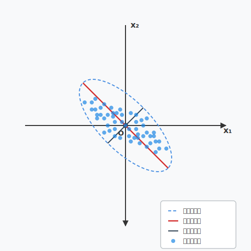

<div style="page-break-before: always; padding: 8% 8% 0 8%;">
 <h1 id="第十二讲-主成分分析-和-总体最小二乘" style="text-align: center; margin-bottom: 2rem; border-bottom: none;">第十二讲 主成分分析 和 总体最小二乘</h1> 
 <div style="display: flex; align-items: center; justify-content: center; gap: 12px; margin: 1.8rem auto;">
  <span style="flex:1; max-width:80px; height:1px; background: linear-gradient(to right, transparent, #888);"></span>
  <span style="display:inline-block; width:6px; height:6px; background:#38bdf8; border-radius:50%;"></span>
  <span style="flex:1; max-width:80px; height:1px; background: linear-gradient(to left, transparent, #888);"></span>
 </div>
</div>

## 1. 概述：PCA、KL 展开与 SVD 的统一视角

### 1.1 PCA、KL 展开与 SVD 的内在联系

在正式进入 PCA 和总体最小二乘（TLS）的讨论之前，有必要先理清 SVD、PCA 和 KL 展开三者之间"本质上是一回事"的深层关系。这一关系不仅是理解本篇文章的数学基础，也是连接统计信号处理、线性代数和随机过程理论的纽带。

#### 1.1.1 SVD：线性代数的核心工具

**奇异值分解（Singular Value Decomposition, SVD）** 是线性代数中处理矩阵的最强大工具之一。对于任意矩阵 \( A \in \mathbb{R}^{n \times m} \)，SVD 将其分解为：
$$
A = U \Sigma V^\top,  \tag{12.1}$$
其中 \( U \) 和 \( V \) 是正交矩阵，\( \Sigma \) 是对角矩阵，其对角线元素 \( \sigma_1 \ge \sigma_2 \ge \cdots \ge \sigma_r > 0 \) 称为奇异值。

SVD 的核心贡献在于：**它为任意矩阵找到了一组正交的输入方向（\( V \) 的列）和一组正交的输出方向（\( U \) 的列），使得矩阵在这两组基之间的作用仅仅是按奇异值进行缩放**。这一性质使得 SVD 成为数值线性代数中最稳定、最通用的分析工具。

#### 1.1.2 PCA：数据降维的统计方法

**主成分分析（Principal Component Analysis, PCA）** 是统计学中最经典的降维方法。给定一组中心化后的数据点 \( \{a_k\}_{k=1}^n \subset \mathbb{R}^m \)，PCA 寻找一组正交方向 \( v_1, v_2, \dots, v_m \)，使得数据在这些方向上的投影方差依次递减。具体地，第一个主成分 \( v_1 \) 是数据方差最大的方向： $$
v_1 = \arg\max_{\|v\|=1} \frac{1}{n} \sum_{k=1}^n (a_k^\top v)^2.  \tag{12.2}$$
后续主成分在与前面方向正交的约束下依次最大化剩余方差。

从线性代数的角度看，PCA 等价于对样本协方差矩阵 \( C = \frac{1}{n} A^\top A \) 做特征分解：
$$
C = V \Lambda V^\top,  \tag{12.3}$$
其中 \( V \) 的列就是主成分方向，\( \Lambda \) 的对角元素是相应的方差。

#### 1.1.3 KL 展开：随机过程的最优表示

**Karhunen-Loève 展开（KL 展开）** 是随机过程理论中的核心工具。对于一个零均值随机过程 \( X(t) \)，其 KL 展开为： $$
X(t) = \sum_{i=1}^\infty \xi_i \phi_i(t),  \tag{12.4}$$
其中 \( \phi_i(t) \) 是协方差函数 \( R(t,s) = \mathbb{E}[X(t)X(s)] \) 的特征函数，\( \xi_i \) 是互不相关的随机变量。KL 展开的最优性在于：截断到前 \( r \) 项时，在所有正交展开中均方误差最小。

当随机过程被采样为有限维随机向量时，KL 展开退化为协方差矩阵的特征分解，这正是 PCA。

#### 1.1.4 三者的统一视角

SVD、PCA 和 KL 展开本质上在做同一件事：**在数据张成的空间中寻找一组最优的正交基，使得数据在这组基上的表示具有某种"能量集中"的性质**。

| 方法 | 语境 | 核心操作 | 数学形式 |
|------|------|----------|----------|
| SVD | 线性代数 | 任意矩阵分解 | \( A = U \Sigma V^\top \) |
| PCA | 统计学 | 协方差矩阵特征分解 | \( C = V \Lambda V^\top \) |
| KL 展开 | 随机过程 | 协方差算子特征分解 | \( R(t,s) = \sum \lambda_i \phi_i(t)\phi_i(s) \) |

三者之间具有明确的递进关系：

1. **SVD 是 PCA 的计算引擎**：PCA 需要计算 \( A^\top A \) 的特征向量。通过 SVD，我们可以直接从 \( A \) 得到 \( V \)，而不需要显式构造协方差矩阵，这在数值上更稳定。
2. **PCA 是 KL 展开的离散版本**：当随机过程被采样为有限维随机向量时，KL 展开的基函数退化为协方差矩阵的特征向量，即 PCA 的主成分。
3. **SVD 是 KL 展开的数值实现**：在有限维情形下，KL 展开的特征分解就是 SVD。

**一句话总结**：SVD 是线性代数层面的通用分解工具，PCA 是它在数据降维中的应用，KL 展开是它在随机过程中的推广。三者共享同一个数学内核：**在均方意义下寻找数据的最优低秩表示**。

理清这一联系之后，我们可以更自然地引入本篇文章的两个核心主题：

- **PCA** 关注的是：如何用一个低维子空间来近似数据，使投影误差最小——这是从**方差最大**的视角看问题。
- **总体最小二乘（TLS）** 关注的则是：当输入和输出都含有噪声时，如何估计变量之间的线性关系——这是从**正交距离最小**的视角看问题。

两者的解都依赖于 SVD，但使用方式不同：PCA 使用右奇异向量 \( V \)，而 TLS 则进一步使用 SVD 的零空间结构。这一区别将在后续章节中逐步展开。


### 1.2 从 LMS、RLS 到 TLS：最小二乘的两条发展脉络

在深入 TLS 之前，有必要回顾我们已学过的两种自适应滤波算法——LMS 和 RLS，并在此基础上引出 TLS 的定位。这三者构成了最小二乘问题在不同假设下的三种典型处理方式，它们的区别本质上源于对"误差"的不同定义。

#### 1.2.1 LMS：丢掉期望，用瞬时梯度

LMS（最小均方）算法是我们学习的第一个自适应滤波算法。其核心思想是**用瞬时梯度代替统计梯度**：

**目标函数**：
$$
\min_{\omega} \; |d(n) - \omega^\top X(n)|^2.   \tag{12.5}$$

**更新公式**：
$$
\omega(n+1) = \omega(n) + \mu \, e(n) \, X(n).   \tag{12.6}$$

LMS 的本质是**随机梯度下降**——丢掉期望，用单次样本的梯度作为真实梯度的近似。它假设：
- 只有输出 \( d(n) \) 含有噪声；
- 输入 \( X(n) \) 是精确已知的；
- 我们只关心当前时刻的瞬时误差。

LMS 的优点是计算极简单（\( O(m) \)），缺点是对输入自相关矩阵的条件数敏感，收敛慢。

#### 1.2.2 RLS：保留全部历史，递推最小二乘

RLS（递归最小二乘）算法通过显式利用全部历史数据来加速收敛。其核心思想是**在所有历史数据上最小化加权平方误差和**：

**目标函数**：
$$
g(\omega_n) = \sum_{k=1}^{n} \lambda^{n-k} |d(k) - \omega_n^\top X(k)|^2.   \tag{12.7}$$

**递推更新**：
$$
\omega_n = \omega_{n-1} + K(n) \left[ d(n) - X^\top(n) \omega_{n-1} \right].   \tag{12.8}$$

RLS 的本质是**递推的加权最小二乘**——保留全部历史数据，用遗忘因子 \( \lambda \) 控制历史权重。它与 LMS 共享同一个假设：**只有输出 \( d(k) \) 含有噪声，输入 \( X(k) \) 是精确的**。

RLS 的优点是收敛快（不受条件数影响），缺点是需要 \( O(m^2) \) 的计算量。

#### 1.2.3 两者的共同框架与核心差异

| 维度 | LMS | RLS |
|------|-----|-----|
| 目标函数 | 瞬时平方误差 | 加权历史平方误差和 |
| 梯度 | 瞬时梯度 | 全局梯度 |
| 计算复杂度 | \( O(m) \) | \( O(m^2) \) |
| 收敛速度 | 慢 | 快 |
| 输入噪声假设 | 无 | 无 |
| 输出噪声假设 | 有 | 有 |

LMS 和 RLS 都建立在同一个基本假设之上：**只有观测输出 \( d(k) \) 含有噪声，输入 \( X(k) \) 是精确已知的**。在这一假设下，误差被定义为竖直方向的距离——即 \( d(k) - \omega^\top X(k) \)。

#### 1.2.4 引出 TLS：当输入也有噪声时

LMS 和 RLS 的共同假设在实际中并不总是成立。在许多应用中，输入信号本身也含有噪声或测量误差。例如：
- 系统辨识中，输入信号可能被传感器噪声污染；
- 通信信道中，接收信号的每个分量都含有噪声；
- 金融数据分析中，所有观测变量都带有不确定性。

当输入和输出都含有噪声时，**竖直距离不再是一个公平的度量**——因为它只惩罚输出方向的误差，而忽略了输入方向的误差。此时，我们需要一种对称的误差定义：**点到直线的正交距离**。

**总体最小二乘（Total Least Squares, TLS）** 正是为了解决这一问题而提出的。TLS 的基本思想是：寻找一个超平面，使得所有数据点到该超平面的**正交距离平方和最小**。

#### 1.2.5 LMS、RLS 与 TLS 的核心区别

| 维度 | LMS / RLS | TLS |
|------|-----------|-----|
| 误差定义 | 竖直距离（输出方向） | 正交距离（所有方向） |
| 噪声假设 | 仅输出含噪声 | 输入和输出都含噪声 |
| 优化目标 | \( \min \|d - X\omega\|^2 \) | \( \min \| \text{正交投影误差} \|^2 \) |
| 求解工具 | 正规方程 / 梯度下降 | SVD（零空间） |
| 解的几何含义 | 竖直投影到列空间 | 正交投影到最佳子空间 |

**最关键的区别在于**：LMS/RLS 是在"输入精确、输出含噪"的假设下工作，其误差是数据点到拟合曲线的**竖直距离**；TLS 则是在"输入和输出都含噪"的假设下工作，其误差是数据点到拟合曲线的**正交距离**。这意味着 TLS 在本质上是 LMS/RLS 的"对称版本"——不再区分输入和输出，而是将所有变量平等对待。

在后续章节中，我们将看到：TLS 的解可以通过 SVD 直接得到，并且与 PCA 有着深刻的几何联系。事实上，PCA 是 TLS 的"无监督版本"——当没有目标变量时，PCA 寻找数据方差最大的方向；而 TLS 则是在有目标变量时，寻找使正交距离最小的线性关系。二者的求解都依赖于 SVD，但使用方式不同：TLS 使用 SVD 的**最小奇异值对应的右奇异向量**，而 PCA 使用**最大奇异值对应的右奇异向量**。正是这一区别，使它们分别适用于不同性质的降维与回归问题。
## 2. PCA：主成分分析

### 2.1 问题描述

设有 $n$ 维随机向量：
$$
X = (X_1, X_2, \dots, X_n)^\top, \qquad X_k \in \mathbb{R}, \quad k = 1, 2, \dots, n,   \tag{12.9}$$
其中每个 $X_k$ 是一个随机变量。我们希望通过线性变换找到数据中"信息量最大"的方向。

下图展示了一个典型的二维高斯分布采样点：



如图所示，红色方向是椭圆的长轴方向，即数据散布最广的方向——这是**主成分方向**；黑色方向与之正交，是短轴方向——这是**次成分方向**。直观上，散布范围最大的方向就是**方差最大**的方向，也就是数据信息最集中的方向。

---

### 2.2 从方差最大化到特征分解

假设随机向量 $X$ 已经中心化，即均值为零：
$$
\mathbb{E}[X] = 0.   \tag{12.10}$$
此时，数据的全部二阶统计信息都集中在其协方差矩阵（自相关矩阵）上：
$$
R_X = \mathbb{E}[X X^\top].   \tag{12.11}$$

我们的目标是：寻找一个单位方向 $\alpha \in \mathbb{R}^n$，使得数据在该方向上的投影方差最大。即：
$$
\max_{\alpha} \; \mathbb{E}\bigl[ |\operatorname{Proj}_{\alpha}(X)|^2 \bigr], \qquad \text{s.t.} \quad \|\alpha\| = 1.   \tag{12.12}$$

约束 $\|\alpha\| = 1$ 是为了避免让 $\alpha$ 的大小影响投影方差的大小——我们只关心方向，不关心长度。

---

### 2.3 投影的表达与化简

点 $X$ 到方向 $\alpha$ 上的正交投影为：
$$
\operatorname{Proj}_{\alpha}(X) = \alpha (\alpha^\top \alpha)^{-1} \alpha^\top X.   \tag{12.13}$$

由于我们约束 $\|\alpha\| = 1$，即 $\alpha^\top \alpha = 1$，因此投影可以简化为：
$$
\operatorname{Proj}_{\alpha}(X) = \alpha \alpha^\top X.   \tag{12.14}$$

投影的平方范数为：
$$
\|\operatorname{Proj}_{\alpha}(X)\|^2 = (\alpha^\top X)^2.   \tag{12.15}$$

于是，主成分方向 $\alpha$ 的优化问题化为：
$$
\max_{\alpha} \; \mathbb{E}\bigl[ (\alpha^\top X)^2 \bigr], \qquad \text{s.t.} \quad \|\alpha\| = 1.   \tag{12.16}$$

---

### 2.4 拉格朗日乘子法

引入拉格朗日乘子 $\lambda$，构造拉格朗日函数：
$$
g(\alpha, \lambda) = \mathbb{E}\bigl[ (\alpha^\top X)^2 \bigr] - \lambda (\|\alpha\|^2 - 1).   \tag{12.17}$$

将 $\mathbb{E}[(\alpha^\top X)^2]$ 展开：
$$
\mathbb{E}\bigl[ (\alpha^\top X)^2 \bigr] = \mathbb{E}\bigl[ (\alpha^\top X)(X^\top \alpha) \bigr] = \alpha^\top \mathbb{E}[X X^\top] \alpha = \alpha^\top R_X \alpha.   \tag{12.18}$$

因此：
$$
g(\alpha, \lambda) = \alpha^\top R_X \alpha - \lambda (\alpha^\top \alpha - 1).   \tag{12.19}$$

对 $\alpha$ 求梯度并令其为零：
$$
\nabla_{\alpha} g = 2 R_X \alpha - 2 \lambda \alpha = 0,   \tag{12.20}$$
得到：
$$
R_X \alpha = \lambda \alpha.   \tag{12.21}$$

这就是我们熟悉的**特征值分解**方程。最优方向 $\alpha$ 是自相关矩阵 $R_X$ 的特征向量，对应的 $\lambda$ 是特征值。

---

### 2.5 主成分与次成分

设 $R_X$ 的特征值分解为：
$$
R_X \alpha_i = \lambda_i \alpha_i, \qquad i = 1, 2, \dots, n,   \tag{12.22}$$
其中：
$$
\lambda_1 \ge \lambda_2 \ge \cdots \ge \lambda_n \ge 0.   \tag{12.23}$$
$$
\alpha_i^T \alpha_j = 0, \qquad i \ne j.   \tag{12.24}$$

对应的特征向量 $\alpha_1, \alpha_2, \dots, \alpha_n$ 构成了数据的主成分方向：
- $\alpha_1$ 对应最大特征值 $\lambda_1$，是**第一主成分**，即数据散布最宽的方向；
- $\alpha_n$ 对应最小特征值 $\lambda_n$，是**最后主成分**，即数据散布最窄的方向。

验证最大特征值对应的方差：
$$
\alpha_1^\top R_X \alpha_1 = \lambda_1 \alpha_1^\top \alpha_1 = \lambda_1.   \tag{12.25}$$
因此，第一主成分的方差就是最大特征值 $\lambda_1$。

---

### 2.6 自相关矩阵的谱分解

自相关矩阵 $R_X$ 可以展开为特征向量与特征值的加权和：
$$
R_X = \sum_{k=1}^{n} \lambda_k \alpha_k \alpha_k^\top,   \tag{12.26}$$
其中 $\lambda_1 \ge \lambda_2 \ge \cdots \ge \lambda_n$，$\alpha_k$ 是第 $k$ 个主成分方向。

这一分解表明：数据的全部二阶统计结构可以分解为若干个正交方向上的方差分量。前 $r$ 个主成分（对应最大的 $r$ 个特征值）就包含了数据最主要的方差信息——这正是 PCA 用于降维的理论基础。

---

### 2.7 投影方差的详细计算

对于任意方向 $\alpha$，投影的平方范数为：
$$
\mathbb{E}\bigl[ \|\operatorname{Proj}_{\alpha}(X)\|^2 \bigr] = \mathbb{E}\left[ \left\| \frac{\alpha^\top X}{\alpha^\top \alpha} \alpha \right\|^2 \right].   \tag{12.27}$$

展开计算：
$$
\mathbb{E}\left[ \left\| \frac{\alpha^\top X}{\alpha^\top \alpha} \alpha \right\|^2 \right] = \frac{\mathbb{E}\bigl[ (\alpha^\top X)^2 \bigr]}{\|\alpha\|^4} \cdot \|\alpha\|^2 = \frac{\mathbb{E}\bigl[ (\alpha^\top X)^2 \bigr]}{\|\alpha\|^2}.   \tag{12.28}$$

因此：

$$
\max_{\alpha} \; \mathbb{E}\bigl[ \|\operatorname{Proj}_{\alpha}(X)\|^2 \bigr]
= \max_{\alpha} \; \mathbb{E}\left[ \left( \frac{\alpha^\top}{\|\alpha\|} X \right)^2 \right].   \tag{12.29}$$

由于我们真正关心的是方向，而不是 $\alpha$ 的长度，我们可以等价地写成：

$$
\max_{\alpha} \; \mathbb{E}\bigl[ \|\operatorname{Proj}_{\alpha}(X)\|^2 \bigr]
= \max_{\alpha} \; \mathbb{E}\bigl[ |\alpha^\top X|^2 \bigr],
\qquad \text{s.t.} \quad \|\alpha\| = 1.   \tag{12.30}$$

将 $\mathbb{E}[|\alpha^\top X|^2]$ 展开，利用 $R_X = \mathbb{E}[X X^\top]$，得到：

$$
\max_{\alpha} \; \alpha^\top R_X \alpha,
\qquad \text{s.t.} \quad \|\alpha\| = 1.   \tag{12.31}$$

这就是我们最终需要求解的优化问题：**在单位球面上最大化二次型 $\alpha^\top R_X \alpha$**。其解就是 $R_X$ 的最大特征值对应的特征向量，即第一主成分方向。

---

这三步推导（从 (12.20) 到 (12.21) 再到 (12.22)）完整地展示了 PCA 如何从"投影方差最大化"这一几何目标，转化为"矩阵特征分解"这一代数问题。每一步都有明确的数学操作：
1. **去掉分母**：因为 $\|\alpha\|=1$，所以 $\alpha^\top \alpha = 1$，分母消失。
2. **展开二次型**：将 $\mathbb{E}[|\alpha^\top X|^2]$ 写成 $\alpha^\top R_X \alpha$。
3. **得到特征分解问题**：拉格朗日乘子法直接给出 $R_X \alpha = \lambda \alpha$。


这正是我们前面通过拉格朗日乘子法求解的问题。其解即为 $R_X$ 的特征向量，按特征值从大到小排列，给出了数据从"最宽"到"最窄"的散布方向。
## 3. Karhunen-Loève 展开：双正交性与最优表示

### 3.1 从 PCA 到 KL 展开：基与系数的分离

通过上一节的推导，我们已经知道：自相关矩阵 \( R_X \) 的特征向量 \( \alpha_1, \alpha_2, \dots, \alpha_n \) 构成了 \(\mathbb{R}^n\) 空间中的一组**标准正交基**。这组基给出了数据方差的分布结构——大特征值对应宽散布方向，小特征值对应窄散布方向。

然而，仅仅知道数据"往哪个方向散布"是不够的。我们还想进一步回答一个更根本的问题：**随机向量 \( X \) 本身能否用这组基进行线性表示？如果可以，表示系数具有什么样的统计性质？**

答案是肯定的。由于 \( \{\alpha_i\}_{i=1}^n \) 是 \(\mathbb{R}^n\) 的一组完备正交基，任意随机向量 \( X \in \mathbb{R}^n \) 都可以唯一地展开为：
$$
X = \sum_{i=1}^{n} k_i \alpha_i = k_1 \alpha_1 + \cdots + k_n \alpha_n,   \tag{12.32}$$
其中展开系数为：
$$
k_i = \alpha_i^\top X.   \tag{12.33}$$

**这里有一个极其重要的观察**：基 \( \alpha_i \) 来自于自相关矩阵 \( R_X \)，而 \( R_X = \mathbb{E}[X X^\top] \) 是一个确定性矩阵，没有任何随机性。这意味着**基是确定的、非随机的**。那么，\( X \) 的所有随机性都被"挤"进了展开系数 \( k_i \) 中。换句话说，KL 展开将随机向量 \( X \) 分解为"确定性的基"与"随机性的系数"的线性组合——这是理解随机过程结构的关键一步。


#### 3.1.1 标准正交基下的坐标表示

设 \( \{\alpha_1, \alpha_2, \dots, \alpha_n\} \) 是 \( \mathbb{R}^n \) 的一组**标准正交基**，即满足：
$$
\alpha_i^\top \alpha_j = \delta_{ij} = \begin{cases}
1, & i = j, \\
0, & i\neq j.
\end{cases}   \tag{12.34}$$

根据线性代数的基础结论，任意向量 \( X \in \mathbb{R}^n \) 都可以唯一地表示为这组基向量的线性组合：
$$
X = c_1 \alpha_1 + c_2 \alpha_2 + \cdots + c_n \alpha_n = \sum_{i=1}^n c_i \alpha_i,   \tag{12.35}$$
其中 \( c_i \) 是 \( X \) 在基 \( \alpha_i \) 方向上的坐标。

**问题**：这个坐标 \( c_i \) 怎么求？

---

#### 3.1.2 坐标的唯一性

对等式 (1) 两边同时左乘 \( \alpha_j^\top \)：
$$
\alpha_j^\top X = \alpha_j^\top \left( \sum_{i=1}^n c_i \alpha_i \right) = \sum_{i=1}^n c_i (\alpha_j^\top \alpha_i).   \tag{12.36}$$

由于基是标准正交的，\( \alpha_j^\top \alpha_i = \delta_{ji} \)，所以：
$$
\alpha_j^\top X = \sum_{i=1}^n c_i \delta_{ji} = c_j.   \tag{12.37}$$

因此：
$$
c_j = \alpha_j^\top X.   \tag{12.38}$$

这就是答案：**在标准正交基下，向量 \( X \) 在第 \( j \) 个基方向上的坐标，恰好等于 \( X \) 与该基向量的内积 \( \alpha_j^\top X \)**。

---

#### 3.1.3 投影的几何解释

从几何角度看，\( \alpha_j^\top X \) 是 \( X \) 在方向 \( \alpha_j \) 上的**投影长度**（因为 \( \|\alpha_j\| = 1 \)）。当我们说"把 \( X \) 投影到 \( \alpha_j \) 方向上"，得到的投影向量是：
$$
\operatorname{Proj}_{\alpha_j}(X) = (\alpha_j^\top X) \alpha_j.   \tag{12.39}$$

这正是 (1) 中的第 \( j \) 项 \( c_j \alpha_j \)。因此，\( k_j = \alpha_j^\top X \) 就是 \( X \) 在第 \( j \) 个主成分方向上的投影系数。

---

#### 3.1.4 回到 KL 展开

在 KL 展开中，我们选择的基 \( \{\alpha_i\} \) 是自相关矩阵 \( R_X \) 的特征向量，它们天然构成一组标准正交基。因此：
$$
X = \sum_{i=1}^n (\alpha_i^\top X) \alpha_i = \sum_{i=1}^n k_i \alpha_i, \qquad k_i = \alpha_i^\top X.   \tag{12.40}$$

**之所以 \( k_i = \alpha_i^\top X \)，完全是由基的标准正交性决定的，不依赖于任何统计假设。** 这是线性代数的基本事实，而非 KL 展开的特殊构造。

---

### 3.2 展开系数的正交性

既然所有随机性都在系数 \( k_i \) 中，那么理解 \( k_i \) 的统计性质就至关重要。我们自然要问：不同系数之间是否相关？

计算 \( k_i \) 与 \( k_j \) 的互相关：
$$
\mathbb{E}[k_i k_j] = \mathbb{E}\bigl[ (\alpha_i^\top X)(X^\top \alpha_j) \bigr] = \alpha_i^\top \mathbb{E}[X X^\top] \alpha_j = \alpha_i^\top R_X \alpha_j.   \tag{12.41}$$

由于 \( \alpha_j \) 是 \( R_X \) 的特征向量，满足 \( R_X \alpha_j = \lambda_j \alpha_j \)，代入上式：
$$
\mathbb{E}[k_i k_j] = \alpha_i^\top (\lambda_j \alpha_j) = \lambda_j (\alpha_i^\top \alpha_j).   \tag{12.42}$$

而 \( \{\alpha_i\} \) 是标准正交基，因此 \( \alpha_i^\top \alpha_j = \delta_{ij} \)（Kronecker delta，当 \( i = j \) 时为 1，否则为 0）。于是：
$$
\mathbb{E}[k_i k_j] = \lambda_j \delta_{ij}.   \tag{12.43}$$

这意味着：
- 当 \( i \neq j \) 时，\( \mathbb{E}[k_i k_j] = 0 \)，即**不同系数之间互不相关**；
- 当 \( i = j \) 时，\( \mathbb{E}[k_i^2] = \lambda_i \)，即**第 \( i \) 个系数的方差恰好等于第 \( i \) 个特征值**。

---

### 3.3 双正交展开：基正交，系数也正交

至此，我们看到了一个优美的对称结构：

- **基 \( \{\alpha_i\} \) 是正交的**：\( \alpha_i^\top \alpha_j = \delta_{ij} \)；
- **系数 \( \{k_i\} \) 也是正交的（在统计意义上）**：\( \mathbb{E}[k_i k_j] = \lambda_j \delta_{ij} \)。

这种"基正交、系数也正交"的展开方式，在数学物理中被称为**双正交展开**（biorthogonal expansion）。它的意义在于：

> **基的正交性保证了空间结构的简洁，系数的正交性保证了信息结构的解耦。**

换句话说，KL 展开不仅把随机向量分解成了独立的几何方向（基），还把这些方向上的随机分量（系数）变成了互不相关的"信息通道"。每个系数 \( k_i \) 独立地携带了数据在第 \( i \) 个方向上的方差信息，没有冗余，没有交叉干扰。

---

### 3.4 双正交展开的优势

相比于其他正交展开（如傅里叶展开、小波展开），KL 展开的双正交性带来了若干独特的优势：

**1. 最优性（Minimum Mean Square Error）**

KL 展开在均方误差意义下是最优的。若截断保留前 \( r \) 项，即用 \( \hat{X} = \sum_{i=1}^{r} k_i \alpha_i \) 近似 \( X \)，则截断误差为：
$$
\mathbb{E}\left[ \|X - \hat{X}\|^2 \right] = \sum_{i=r+1}^{n} \lambda_i.   \tag{12.44}$$
在所有正交展开中，KL 展开使得前 \( r \) 项捕获的方差最大，截断误差最小。这是 PCA 用于降维的理论基础。

**2. 去相关（Decorrelation）**

KL 展开将相关的随机向量 \( X \)（其分量通常彼此相关）转化为一组互不相关的系数 \( \{k_i\} \)。这在信号处理中称为**去相关变换**或**白化**。去除相关性后，后续的滤波、检测、压缩等操作可以独立处理每个系数，大大简化了计算。

**3. 能量集中（Energy Compaction）**

特征值 \( \lambda_i \) 按降序排列，前几个主成分集中了数据绝大部分的"能量"（方差）。KL 展开将数据的能量集中到少数系数上，其余系数接近于零。这是数据压缩、降维和噪声抑制的核心机制。

**4. 模型简化的理论基础**

在系统辨识和信号建模中，KL 展开提供了一个自然的模型简化方法：忽略小特征值对应的分量，用一个低维子空间来近似原始高维数据。这相当于在保留主要信息的同时，大幅降低了模型的复杂度。

**5. 与 SVD 的自然衔接**

当只有样本数据（而非精确的统计分布）时，KL 展开退化为对样本协方差矩阵的特征分解，而特征分解在数值上通过 SVD 实现。这正是我们在上一章中建立的 PCA、KL 展开与 SVD 三者统一视角的延续。

---

### 3.5 小结

KL 展开不仅仅是对 PCA 结果的数学修饰，它揭示了一个深层的结构事实：**任何二阶矩有限的随机向量，都可以分解为确定性的正交基与互不相关的随机系数的线性组合。** 这一分解在信号压缩、噪声抑制、特征提取和模型降阶中具有广泛的应用。更重要的是，它建立了统计信号处理与线性代数之间的桥梁——随机性体现在系数上，结构性体现在基上，而基与系数之间的正交性保证了二者之间的"干净"分离。

---
## 4. SVD 分解：从理论到工程的关键一跃

无论是 PCA 还是 KL 展开，到目前为止都还停留在"纸面工作"（paper work）的层面。只要期望符号 \( \mathbb{E} \) 还出现在公式中，就意味着这些方法是对随机变量的一种抽象计算——它们描述了理想化概率模型下的最优解，但并没有告诉我们在实际数据中该如何计算。

那么，**怎么让这些理论落地呢？**

---

### 4.1 数据的可得性：从统计期望到样本矩阵

在实际问题中，我们通常没有完整的概率分布，只有一组有限的观测样本：
$$
X_1, X_2, \dots, X_N, \qquad X_k \in \mathbb{R}^n.   \tag{12.45}$$
根据大数定律，当样本量 \( N \) 足够大时，样本均值会收敛到统计期望。因此，我们可以用样本协方差矩阵来估计真实的自相关矩阵 \( R_X \)：
$$
\hat{R}_X = \frac{1}{N} \sum_{k=1}^{N} X_k X_k^\top.   \tag{12.46}$$

将 \( N \) 个样本按行排列成数据矩阵 \( X \in \mathbb{R}^{N \times n} \)：
$$
X = \begin{pmatrix}
X_1^\top \\
X_2^\top \\
\vdots \\
X_N^\top
\end{pmatrix},   \tag{12.47}$$
则样本协方差矩阵可以简洁地写成矩阵乘积形式：
$$
\hat{R}_X = \frac{1}{N} X^\top X.   \tag{12.48}$$

这样，我们就完成了从"理论上的 \( R_X \)"到"可计算的 \( \hat{R}_X \)"的转化。

**然而，这仍然不是最终落地的方案。** 因为我们绕不开以下三个现实困境。

---

### 4.2 直接计算 \( \hat{R}_X \) 的三个现实困境

**1. 条件数可能很大（病态问题）**

当样本的某些维度之间存在强相关性时，\( \hat{R}_X \) 的条件数会变得非常大（矩阵病态）。这意味着特征分解对数值误差极其敏感，微小的舍入误差可能导致结果严重偏离真实值。

**2. 可能缺秩（rank-deficient）**

当样本量 \( N \) 小于数据维度 \( n \)（即 \( N < n \)）时，\( \hat{R}_X \) 的秩最多为 \( N \)，必然缺秩。此时 \( \hat{R}_X \) 不可逆，传统的特征分解方法无法直接使用。

**3. 计算复杂度高**

直接对 \( n \times n \) 的矩阵 \( \hat{R}_X \) 进行特征分解，计算复杂度为 \( O(n^3) \)。当数据维度 \( n \) 很大时（例如图像、基因组数据），这个开销在工程上是不可接受的。

---

### 4.3 SVD：直接数据域的处理手段

以上三个问题——病态、缺秩、高复杂度——正是我们需要引入 **SVD（奇异值分解）** 的原因。

**SVD 与 PCA/KL 展开有一个根本性的区别**：PCA 和 KL 展开需要先计算协方差矩阵 \( \hat{R}_X = \frac{1}{N} X^\top X \)，再对其进行特征分解；而 **SVD 是直接数据域的处理手段**——它直接作用于数据矩阵 \( X \) 本身，而不需要构造 \( X^\top X \)。

具体地，通过对数据矩阵 \( X \) 做 SVD 分解：
$$
X = U \Sigma V^\top,   \tag{12.49}$$
我们可以直接从 \( X \) 获得所有需要的信息：
- \( V \) 的列就是 \( \hat{R}_X \) 的特征向量，即主成分方向；
- \( \Sigma^\top \Sigma \) 的对角元素就是 \( \hat{R}_X \) 的特征值（乘以 \( 1/N \)）；
- 不需要显式构造 \( \hat{R}_X \)，也不需要求解特征方程。

**这就是"直接数据域"的含义**：SVD 处理的是原始数据矩阵 \( X \)，而不是其派生出来的统计量 \( X^\top X \)。这个区别在实际工程中至关重要。

---

从相关矩阵出发的特征向量，与从数据矩阵出发的右奇异向量，在数学上是同一个对象，只是计算路径不同。下面把这个关系写清楚。

---

### 4.4 特征向量与右奇异向量的等价性

从相关矩阵出发，我们做的是特征分解：
$$
\hat{R}_X V = V \Lambda,   \tag{12.50}$$
其中 \( V \) 的列是特征向量，\( \Lambda \) 的对角线是特征值。

从数据矩阵出发，我们做的是 SVD：
$$
X = U \Sigma V^\top,   \tag{12.51}$$
其中 \( V \) 的列是右奇异向量。

当我们将 SVD 代入相关矩阵的表达时：
$$
\hat{R}_X = \frac{1}{N} X^\top X = \frac{1}{N} (U \Sigma V^\top)^\top (U \Sigma V^\top) = V \left( \frac{1}{N} \Sigma^\top \Sigma \right) V^\top.   \tag{12.52}$$

观察 (4.7) 的右边，它正是 \( \hat{R}_X \) 的特征分解形式：
- \( V \) 的列是 \( \hat{R}_X \) 的特征向量；
- \( \frac{1}{N} \Sigma^\top \Sigma \) 的对角元素是 \( \hat{R}_X \) 的特征值（即样本主成分的方差）。

**因此，结论是明确的**：从相关矩阵 \( \hat{R}_X \) 出发做特征分解得到的特征向量 \( V \)，与从数据矩阵 \( X \) 出发做 SVD 得到的右奇异向量 \( V \)，是完全等同的。它们计算的是同一个方向——即主成分方向。不同的是，SVD 直接从数据矩阵出发，避开了 \( X^\top X \) 的显式构造和特征分解，在数值上更稳定。

---

### 4.5 SVD 如何克服三个困境

| 困境 | PCA/KL 展开（基于 \( X^\top X \)） | SVD（直接数据域） |
|------|----------------------------------|-------------------|
| 病态 | 条件数 \( \kappa(X^\top X) = \kappa(X)^2 \) | 条件数 \( \kappa(X) \) |
| 缺秩 | \( X^\top X \) 不可逆，特征分解失败 | SVD 仍可稳定给出非零奇异值 |
| 高维 | 需要计算 \( n \times n \) 矩阵 | 可只算 \( \min(N,n) \) 个奇异值 |

**数值稳定性**：SVD 直接处理 \( X \) 的奇异值，避免了 \( X^\top X \) 的条件数平方效应（\( \kappa(X^\top X) = \kappa(X)^2 \)），因此对数据中的噪声和数值舍入误差更不敏感。

**处理缺秩**：即使 \( X \) 行不满秩（\( N < n \)）或列不满秩，SVD 仍然可以稳定地给出所有非零奇异值及其对应的奇异向量。

**计算效率**：对于 \( N \ll n \) 的情况，可以用"瘦 SVD"只计算前 \( N \) 个奇异值，计算量从 \( O(n^3) \) 降到 \( O(N^2 n) \)。

---
### 4.6 噪声问题：来自间接方法的质疑与 SVD 的回应

#### 4.6.1 质疑的来源

在 SVD 被引入 PCA 之前，人们普遍采用的方法是通过样本协方差矩阵：
$$
\hat{R}_X = \frac{1}{N} \sum_{k=1}^{N} X_k X_k^\top   \tag{12.53}$$
来做特征分解。这种方法的支持者有一个看似合理的论据：**公式 (12.37) 中的求平均操作本身就是一个低通滤波器，具有降噪作用。** 他们的逻辑是：噪声是零均值的高频分量，通过对多个样本求和取平均，噪声分量会相互抵消，信噪比（SNR）得到提升。

而 SVD 直接对数据矩阵 \( X \) 本身进行分解：
$$
X = U \Sigma V^\top.   \tag{12.54}$$
初看之下，SVD 确实没有显式地做"平均"操作。于是，批评者提出了一个看似有力的攻击：

> **"你们直接数据域的方法没有做平均，没有降噪，信噪比会吃很大的亏。"**

这个质疑在 SVD 引入信号处理的早期阶段确实存在，甚至让一些工程人员对 SVD 心生疑虑。

#### 4.6.2 如何理解"平均就是低通滤波"

我们先来理解为什么公式 (12.37) 中的平均被视为低通滤波。设观测数据为：
$$
X_k = S_k + N_k,   \tag{12.55}$$
其中 \( S_k \) 是信号分量，\( N_k \) 是零均值噪声。则样本协方差矩阵为：
$$
\hat{R}_X = \frac{1}{N} \sum_{k=1}^{N} (S_k + N_k)(S_k + N_k)^\top.   \tag{12.56}$$
展开后，包含噪声的交叉项为：
$$
\frac{1}{N} \sum_{k=1}^{N} S_k N_k^\top + \frac{1}{N} \sum_{k=1}^{N} N_k S_k^\top + \frac{1}{N} \sum_{k=1}^{N} N_k N_k^\top.   \tag{12.57}$$
由于 \( \mathbb{E}[N_k] = 0 \)，当 \( N \) 足够大时，前两项（噪声-信号交叉项）趋于零。而 \( \frac{1}{N} \sum N_k N_k^\top \) 会收敛到噪声的协方差矩阵 \( \sigma^2 I \)，相当于在相关矩阵的对角线上加了一个小量。这一求和操作确实压制了高频噪声分量，因此被称为低通滤波。

#### 4.6.3 SVD 的降噪能力：截断即滤波

然而，**SVD 自身就具备降噪能力，而且其降噪机制比协方差方法的平均更加灵活和精密。** SVD 的降噪是通过**奇异值截断**实现的。

将数据矩阵 \( X \) 进行 SVD 分解：
$$
X = U \Sigma V^\top = \sum_{i=1}^{r} \sigma_i u_i v_i^\top,   \tag{12.58}$$
其中 \( r = \operatorname{rank}(X) \)，\( \sigma_i \) 是奇异值，\( u_i \) 和 \( v_i \) 分别是左、右奇异向量。

在信号处理中，我们常常假设数据由"信号子空间"和"噪声子空间"构成：
- **大奇异值**对应信号的主成分（能量集中）；
- **小奇异值**对应噪声（能量分散）。

因此，我们可以通过**截断**——只保留前 \( k \) 个最大的奇异值——来重构信号，丢弃噪声：
$$
\tilde{X} = \sum_{i=1}^{k} \sigma_i u_i v_i^\top, \qquad k < r.   \tag{12.59}$$

从滤波的角度看，这就是一个**自适应的低通滤波器**：
- 协方差方法的平均是"无条件地"对所有样本做等权平均；
- 而 SVD 的截断是"有条件地"根据信号的能量分布来决定保留哪些分量。

**SVD 的降噪不是通过平均来实现的，而是通过子空间投影来实现的。** 它的逻辑是：

> 信号在少数几个方向上有较大的投影（大奇异值），噪声在所有方向上均匀散布（小奇异值）。因此，截断小奇异值等价于将数据投影到信号子空间上，而将噪声投影到零空间——这本质上就是一种滤波，而且是一种比简单平均更智能的滤波。

#### 4.6.4 从秩的角度看

协方差方法（4.1 式）通过平均提高信噪比，但它的效果依赖于样本量 \( N \) 的大小。当 \( N \) 很大时，平均确实有效；当 \( N \) 有限时，协方差矩阵的估计误差不可忽略，尤其在高维情况下（\( n \gg N \)），协方差矩阵缺秩，问题更为严重。

而 SVD 的截断不仅降噪，还同时**降低了矩阵的秩**：
$$
\operatorname{rank}(\tilde{X}) = k \ll \operatorname{rank}(X).   \tag{12.60}$$
降低秩意味着去除了冗余和噪声维度，这正是 PCA 在数据降维中所追求的目标。换句话说，**SVD 在做 PCA 的过程中，本身就在执行降噪**，它不需要事先进行平均。

#### 4.6.5 回应质疑

因此，当初对 SVD 的质疑——"你们没有做平均，信噪比吃亏"——实际上是一个基于片面理解的批评。SVD 没有做平均，但它做了更本质的事情：**它通过奇异值截断将数据投影到信号子空间，丢弃了噪声子空间。** 这一操作的滤波效果不亚于平均，而且在处理高维、小样本、病态矩阵时，SVD 的数值稳定性和灵活性远超协方差方法。

所以结论是：**SVD 不需要显式的平均操作来降噪，因为它本身就是一种降噪工具。** 平均是时域的低通滤波，截断是 SVD 域的低通滤波——两者异曲同工，但 SVD 更加自适应、更加稳健。

---

### 4.7 谐波信号实例：SVD 降噪的直观体现

为了直观理解 SVD 的降噪能力，我们考虑一个经典的阵列信号处理场景。

#### 4.7.1问题描述

设空间中有一个谐波信号源，其波形为：
$$
s(t) = \sin(\omega t).   \tag{12.61}$$

有 \( n \) 个接收站，第 \( i \) 个接收站接收到的信号为：
$$
x_i(t) = A_i \sin(\omega t + \phi_i), \qquad i = 1, 2, \dots, n,   \tag{12.62}$$
其中 \( A_i \) 是振幅，\( \phi_i \) 是第 \( i \) 个接收站相对于信号源的相位延迟。

对每个接收站进行 \( N \) 次采样（采样间隔为 \( \Delta \)），得到离散采样数据：
$$
x_i(k) = A_i \sin(\omega k \Delta + \phi_i), \qquad k = 1, 2, \dots, N, \quad i = 1, 2, \dots, n.   \tag{12.63}$$

将所有接收站的数据按行排列成矩阵 \( X \in \mathbb{R}^{n \times N} \)：
$$
X = \begin{pmatrix}
x_1(1) & x_1(2) & \cdots & x_1(N) \\
x_2(1) & x_2(2) & \cdots & x_2(N) \\
\vdots & \vdots & \ddots & \vdots \\
x_n(1) & x_n(2) & \cdots & x_n(N)
\end{pmatrix}.   \tag{12.64}$$

---

#### 4.7.2 信号矩阵的秩

将 \( x_i(k) \) 用三角恒等式展开：
$$
\begin{aligned}
x_i(k) &= A_i \sin(\omega k \Delta + \phi_i) \\
&= A_i \cos(\phi_i) \sin(\omega k \Delta)+ A_i \sin(\phi_i) \cos(\omega k \Delta).
\end{aligned}   \tag{12.65}$$

令：
$$
c_i = A_i \cos(\phi_i), \qquad d_i = A_i \sin(\phi_i),   \tag{12.66}$$
则第 \( i \) 行的数据可以写成两个向量的线性组合：
$$
x_i = c_i \, \alpha + d_i \, \beta,   \tag{12.67}$$
其中：
$$
\alpha = \begin{pmatrix}
\sin(\omega \Delta) \\
\sin(2\omega \Delta) \\
\vdots \\
\sin(N\omega \Delta)
\end{pmatrix}, \qquad
\beta = \begin{pmatrix}
\cos(\omega \Delta) \\
\cos(2\omega \Delta) \\
\vdots \\
\cos(N\omega \Delta)
\end{pmatrix}.   \tag{12.68}$$

因此，矩阵 \( X \) 的每一行都是 \( \alpha \) 和 \( \beta \) 的线性组合。这意味着所有行向量都落在由 \( \{\alpha, \beta\} \) 张成的二维子空间中，所以：
$$
\operatorname{rank}(X) \le 2.   \tag{12.69}$$

由于 \( \alpha \) 和 \( \beta \) 是线性无关的（正弦与余弦是正交的基函数），且不同的接收站有不同的 \( (c_i, d_i) \) 组合，只要至少有两行是线性无关的，就有：
$$
\operatorname{rank}(X) = 2.   \tag{12.70}$$

**这个结论的物理意义是**：尽管我们有 \( n \) 个接收站、\( N \) 个采样点，数据矩阵的维度看似很大，但所有数据的本质信息只包含在两个独立的方向上——即正弦分量和余弦分量。信号的能量集中在二维子空间内。

---

#### 4.7.3 加性噪声的破坏

在实际场景中，每个接收站的测量值都不可避免地包含噪声。设加性白噪声矩阵为 \( N \in \mathbb{R}^{n \times N} \)，其每个元素服从零均值、方差 \( \sigma^2 \) 的独立同分布。则观测矩阵为：
$$
\tilde{X} = X + N.   \tag{12.71}$$

由于白噪声在 \( n \times N \) 维空间的所有方向上都有分量，且各方向上的分量是随机且独立的，因此噪声矩阵几乎必然满秩：
$$
\operatorname{rank}(\tilde{X}) = \min(n, N).   \tag{12.72}$$

也就是说，原本集中在二维子空间中的信号，被噪声"撑开"到了整个高维空间。信号的本质结构被噪声掩盖了。

---

#### 4.7.4 SVD 分解与截断降噪

对无噪信号矩阵 \( X \) 做 SVD 分解：
$$
X = U \Sigma V^\top = U \begin{pmatrix}
\sigma_1 & & &\\
& \sigma_2 & & \\
& & & \\
& & & 
\end{pmatrix} V^\top.   \tag{12.73}$$

因为 \( \operatorname{rank}(X) = 2 \)，所以 \( X \) 的 SVD 中**只有前两个奇异值非零**，其余奇异值全部为零：
$$\Sigma = \operatorname{diag}(\sigma_1, \sigma_2, 0, \dots, 0).
  \tag{12.74}$$

因此： $$
X = \sum_{i=1}^{2} \sigma_i u_i v_i^\top.
  \tag{12.75}$$

当加入白噪声后，观测矩阵 \( \tilde{X} = X + N \) 的 SVD 为： $$
\tilde{X} = \tilde{U} \tilde{\Sigma} \tilde{V}^\top,
  \tag{12.76}$$
其中： $$
\tilde{\Sigma} = \operatorname{diag}(\tilde{\sigma}_1, \tilde{\sigma}_2, \tilde{\sigma}_3, \dots, \tilde{\sigma}_r, 0, \dots, 0).
  \tag{12.77}$$

由于噪声的存在，原本为零的奇异值现在都变成了非零的正数。但关键在于：**信号的奇异值 \( \sigma_1, \sigma_2 \) 是"大的"，而噪声的奇异值是"小的"**。这是因为：
- 信号的能量集中在二维子空间，因此前两个奇异值包含信号的主要能量；
- 白噪声的能量被均匀地分散到所有方向上，每个方向上的贡献都很小。

因此，我们只需要保留前两个奇异值，丢弃所有其余的奇异值： $$
\hat{X} = \sum_{i=1}^{2} \tilde{\sigma}_i \tilde{u}_i \tilde{v}_i^\top.
  \tag{12.78}$$

这个操作称为**截断 SVD**。由于我们已知 \( \operatorname{rank}(X) = 2 \)，取前两个奇异值就是最优的恢复策略。丢弃小奇异值就相当于丢弃了噪声分量。

---

#### 4.7.5 SVD 降噪的本质

从这个例子中，我们可以清晰地看到 SVD 降噪的本质：

> **信号的能量集中在少数几个奇异值上（低秩），噪声的能量被均匀地分散在所有奇异值上（满秩）。通过截断小奇异值，SVD 实际上是在将数据投影到信号子空间上，从而自然地将噪声滤除。**

这一过程不需要任何先验的滤波设计，也不需要显式地做平均或低通滤波。SVD 直接从数据中"发现"了信号的子空间结构，并通过截断将噪声排除在外。这正是 SVD 作为直接数据域处理手段的核心优势。

---

#### 4.7.6与协方差方法的对比

在协方差方法中，我们计算： $$
\hat{R}_X = \frac{1}{N} X^\top X.
  \tag{12.79}$$
对 \( \hat{R}_X \) 做特征分解，前两个特征向量对应信号子空间，其余对应噪声子空间。这和 SVD 的截断在数学上是等价的。但 SVD 的优势在于：
- 它不需要显式构造 \( X^\top X \)，避免了条件数平方的问题；
- 当 \( N \) 很小时，协方差矩阵缺秩，而 SVD 仍然可以稳定计算；
- 当 \( n \) 很大时，SVD 可以通过"瘦 SVD"只计算前 \( k \) 个奇异值，大幅降低计算量。

---

#### 4.7.7 信号能量与噪声能量的分离

从奇异值的角度，我们可以清晰地看到信号与噪声的区分：

**信号的能量集中在少数几个大奇异值上。** 在无噪情况下，矩阵 \( X \) 的秩为 \( 2 \)，其 SVD 只有两个非零奇异值 \( \sigma_1, \sigma_2 \)。这两个奇异值捕获了信号的全部能量： $$
\text{信号能量} = \sigma_1^2 + \sigma_2^2.
  \tag{12.80}$$

**噪声的能量被均匀地分散在所有奇异值上。** 当加入白噪声后，观测矩阵 \( \tilde{X} = X + N \) 的奇异值变为： $$
\tilde{\sigma}_1 \ge \tilde{\sigma}_2 \ge \tilde{\sigma}_3 \ge \cdots \ge \tilde{\sigma}_r > 0.
  \tag{12.81}$$

前两个奇异值 \( \tilde{\sigma}_1, \tilde{\sigma}_2 \) 仍然主要包含信号的能量（虽然被噪声轻微扰动），而剩余的奇异值 \( \tilde{\sigma}_3, \dots, \tilde{\sigma}_r \) 则完全由噪声贡献。

**这就是 SVD 降噪的关键洞见**：信号是低秩的（能量集中），噪声是满秩的（能量分散）。因此，我们只需要保留前 \( k \) 个大奇异值（\( k \) 等于信号矩阵的秩），就能保留信号的主要能量，同时丢弃噪声。

在这个谐波例子中，\( k = 2 \)，所以： $$
\hat{X} = \tilde{\sigma}_1 \tilde{u}_1 \tilde{v}_1^\top + \tilde{\sigma}_2 \tilde{u}_2 \tilde{v}_2^\top.
  \tag{12.82}$$

这个操作等价于说：**将数据投影到信号子空间上，丢弃噪声子空间的所有分量。** 这就是 SVD 降噪的本质。它不需要平均，不需要设计滤波器，直接从数据中"发现"信号的结构并将噪声滤除。

相比之下，协方差方法通过平均来降噪：求平均相当于在时域上压制了噪声的高频分量。而 SVD 通过奇异值截断来降噪：丢弃小奇异值相当于在信号子空间与噪声子空间之间划出了一条清晰的界限。两者路径不同，但目标一致——分离信号与噪声。

---

#### 4.7.8 k未知的一般处理策略

在前面的谐波例子中，我们已知信号矩阵的秩为 2，因此可以直接截断取前两个奇异值。但在绝大多数实际应用中，我们**事先并不知道信号的秩 k 是多少**。那么，如何在不知道 k 的情况下，正确地进行 SVD 降噪呢？

#### 4.7.8.1 问题：k 未知

在无噪情况下，信号矩阵 X 的秩 k 等于其非零奇异值的个数。但一旦加入噪声，原本为零的奇异值全部变成非零正值： $$
\tilde{\sigma}_1 \ge \tilde{\sigma}_2 \ge \cdots \ge \tilde{\sigma}_k \ge \tilde{\sigma}_{k+1} \ge \cdots \ge \tilde{\sigma}_r > 0.
  \tag{12.83}$$

我们需要在"保留信号能量"和"丢弃噪声能量"之间做出权衡。这本质上是一个**模型阶数选择**（model order selection）问题。

#### 4.7.8.2 方法一：奇异值分布分析（拐点法）

最直观的方法是将奇异值按从大到小排列并绘制成曲线，观察奇异值序列中是否存在一个明显的**拐点**（elbow）。在该点之前，奇异值下降较快，对应信号分量；在该点之后，奇异值下降趋于平缓，对应噪声分量。

因此，我们可以在拐点处截断： $$
\hat{X} = \sum_{i=1}^{k} \tilde{\sigma}_i \tilde{u}_i \tilde{v}_i^\top,
  \tag{12.84}$$
其中 k 是拐点对应的位置。

**局限性**：这种方法依赖于奇异值之间存在明显的量级差异。当信噪比较低时，信号奇异值与噪声奇异值的边界可能模糊不清，拐点不明显。

#### 4.7.8.3 方法二：噪声方差估计

另一种更具理论依据的方法是利用噪声的统计特性。如果噪声是白噪声，且其方差为 σ²，那么所有噪声奇异值的平方和满足： $$
\sum_{i=k+1}^{r} \tilde{\sigma}_i^2 \approx (n - k) \sigma^2.
  \tag{12.85}$$

于是我们可以通过估计噪声方差来确定截断位置，即：
- 选择一个合理的 k 使得剩余奇异值的平方和不超过估计的噪声能量；
- 或者反过来，先估计噪声方差，然后将所有小于某个阈值的奇异值置零。

**补充说明**：在现实数据中，更常见的是"噪声水平未知，但可以从小奇异值的分布中估算"。对于白噪声，其奇异值的平方分布近似服从 Wishart 分布，其平均值可以用于估计噪声方差。

#### 4.7.8.4 方法三：信息论准则

更先进的做法是使用信息论准则（如 AIC、BIC、MDL）来自动选择 k。这些准则在"模型拟合度"与"模型复杂度"之间建立了一个权衡函数，通过最小化该函数来自动确定最优的 k。这类方法在大样本情况下具有良好的理论性质。

#### 4.7.8.5 完整流程

无论采用哪种方法，实际工程中的完整流程通常是：

1. **对观测矩阵 X 做 SVD 分解**，得到所有奇异值。
2. **确定截断位置 k**：
   - 方法 A：观察奇异值分布，找到拐点；
   - 方法 B：估计噪声方差，基于阈值自动截断；
   - 方法 C：使用 AIC/BIC/MDL 等信息论准则自动选择。
3. **截断并重构**：保留前 k 个奇异值，将剩余的奇异值置零，然后重构信号矩阵： $$
   \hat{X} = \sum_{i=1}^{k} \sigma_i u_i v_i^\top.
     \tag{12.86}$$

#### 4.7.8.6 为什么需要较高的信噪比

SVD 降噪要求信噪比通常在 5-6 dB 以上才能获得较好的降噪效果，原因在于**信号奇异值与噪声奇异值之间存在"混合区域"**。当信噪比足够高时，信号与噪声的奇异值之间有明显的"间隙"，我们可以清晰地截断而不会丢失信号或保留过多噪声。当信噪比很低时，信号与噪声的奇异值谱相互重叠，任何截断都会丢失大量信号能量或保留大量噪声，降噪效果将大打折扣。

#### 4.7.8.7 数学解释

考虑含噪矩阵 X = S + N，其中 S 是低秩信号矩阵（秩为 k），N 是白噪声矩阵。在 SVD 分解中，奇异值的分布受到噪声的影响：小奇异值被噪声"抬高"，大奇异值被噪声"扰动"。Eckart-Young 定理保证了截断 SVD 在秩为 k 的所有矩阵中给出了对 X 的最佳低秩近似，但它并没有告诉我们如何选择这个 k。我们所有的方法本质上都是在寻找一个"最优"的秩，使得 在保留信号与丢弃噪声之间达到平衡。

因此，SVD 降噪的步骤可以归纳为：

**SVD → 确定 k → 截断 → 重构**

| 步骤 | 操作 | 数学表达 |
|------|------|----------|
| 分解 | 对 X 做 SVD | X = UΣVᵀ |
| 定阶 | 确定 k | 拐点法 / 噪声估计 / 信息论准则 |
| 截断 | 保留前 k 个奇异值 | Σ_k = diag(σ₁,…,σ_k,0,…,0) |
| 重构 | 反算信号矩阵 | X̂ = UΣ_k Vᵀ |

这四个步骤构成了 SVD 降噪的标准流程。在实际工程中，确定 k 往往是最关键的一步，它决定了降噪的效果——保留太多奇异值会保留噪声，保留太少会丢失信号。

谐波信号的例子展示了 SVD 的降噪能力：

1. **无噪信号矩阵的秩为 2**：因为所有行向量都落在正弦和余弦张成的二维子空间中。
2. **加性白噪声使矩阵满秩**：噪声将信号"撑开"到整个高维空间。
3. **SVD 截断恢复信号**：保留前两个大奇异值，丢弃其余小奇异值，就能从含噪数据中恢复出原始信号。
4. **降噪是 SVD 的固有属性**：截断小奇异值等价于将数据投影到信号子空间，这是 SVD 天然具备的降噪能力。

这正是 SVD 被广泛应用于信号去噪、数据压缩和低秩近似的原因——它不需要额外的滤波设计，而是直接从数据中分离出信号和噪声。

---

### 4.8 Eigenface：特征脸方法

#### 4.8.1 Eigenface 简介

特征脸（Eigenface）是一种基于主成分分析（PCA）的人脸识别方法，由 Sirovich 和 Kirby 于 1987 年提出，并由 Matthew Turk 和 Alex Pentland 在 1991 年将其应用于人脸分类。该方法的核心思想是：**将人脸图像视为高维空间中的向量，通过 PCA 找到一组最能表征人脸分布的特征向量，这些向量在图像空间中的形状看起来像"脸"，因此被称为特征脸**。

**关键洞察**：任意一张人脸图像都可以表示为特征脸的线性组合。例如，一张人脸可能是"特征脸1"的 10% 加上"特征脸2"的 55%，再减去"特征脸3"的 3%。这一洞察使得人脸识别从"像素匹配"问题转化为"低维空间中的坐标匹配"问题——这正是 SVD/PCA 降维思想在人脸识别中的直接应用。

#### 4.8.2 算法描述

#### 4.8.2.1 问题设定

设训练集包含 \(M\) 张人脸图像，每张图像的分辨率为 \(R \times C\) 像素。将每张图像拉成一个 \(D = R \times C\) 维列向量，则训练集构成数据矩阵： $$
T = [\mathbf{x}_1, \mathbf{x}_2, \dots, \mathbf{x}_M] \in \mathbb{R}^{D \times M},
  \tag{12.87}$$
其中 \(\mathbf{x}_i \in \mathbb{R}^D\) 是第 \(i\) 张图像拉直后的向量。

**关键事实**：原始图像空间的维度 \(D\) 通常非常大（例如 \(100 \times 100\) 的图像对应 \(D = 10000\)），但人脸图像在该高维空间中并非均匀分布，而是集中在一个**低维子空间**中——这个子空间的维度由训练样本数 \(M\) 决定，最多为 \(M-1\)。

#### 4.8.2.2 算法步骤

**步骤 1：数据预处理**

将所有图像转换为灰度图，缩放到统一尺寸 \(R \times C\)，并将像素值归一化到相同范围。然后将每张图像拉直为列向量，构成数据矩阵 \(T\)。

**步骤 2：计算均值脸并中心化**

计算平均脸： $$
\bar{\mathbf{x}} = \frac{1}{M} \sum_{i=1}^{M} \mathbf{x}_i.
  \tag{12.88}$$

对每张图像减去均值脸，得到中心化数据矩阵： $$
\tilde{T} = [\mathbf{x}_1 - \bar{\mathbf{x}}, \mathbf{x}_2 - \bar{\mathbf{x}}, \dots, \mathbf{x}_M - \bar{\mathbf{x}}] \in \mathbb{R}^{D \times M}.
  \tag{12.89}$$

**步骤 3：计算协方差矩阵并求解特征向量**

协方差矩阵为： $$
C = \frac{1}{M} \tilde{T} \tilde{T}^\top \in \mathbb{R}^{D \times D}.
  \tag{12.90}$$

直接对 \(C\) 做特征分解在计算上是不可行的——当 \(D = 10000\) 时，\(C\) 是一个 \(10000 \times 10000\) 的矩阵。幸运的是，\(C\) 的秩最多为 \(M-1\)，因此我们可以通过 SVD 来规避这一计算瓶颈。

**步骤 4：利用 SVD 高效求解特征脸**

对中心化数据矩阵 \(\tilde{T}\) 做 SVD 分解： $$
\tilde{T} = U \Sigma V^\top.
  \tag{12.91}$$

则协方差矩阵 \(C\) 的特征向量就是 \(U\) 的列向量——即**特征脸**。具体地：
- \(U \in \mathbb{R}^{D \times D}\) 的每一列都是一个特征脸；
- 对应的特征值为 \(\sigma_i^2 / M\)，其中 \(\sigma_i\) 是 \(\tilde{T}\) 的奇异值。

**计算上的关键技巧**：由于 \(M \ll D\)，我们可以先对 \(M \times M\) 的矩阵 \(\tilde{T}^\top \tilde{T}\) 做特征分解，再通过 \(\tilde{T}\) 映射回高维空间。SVD 的"经济型"模式（`'econ'`）正是这一技巧的实现。

**步骤 5：选择主成分**

将特征值按降序排列，保留前 \(K\) 个最大的特征值对应的特征向量（特征脸）。\(K\) 的选择通常通过以下方式确定：
- 预设一个阈值（如保留前 95% 的能量）；
- 或根据奇异值分布的拐点确定。

在实际应用中，\(100 \times 100\) 的图像虽然对应 10000 个特征向量，但通常只需保留 100 到 150 个特征脸即可获得良好的识别效果。

**步骤 6：投影与识别**

对于一张新的人脸图像 \(\mathbf{x}_{\text{new}}\)：
1. 减去均值脸：\(\tilde{\mathbf{x}} = \mathbf{x}_{\text{new}} - \bar{\mathbf{x}}\)；
2. 投影到特征脸空间，得到坐标向量： $$
   \mathbf{w} = U_K^\top \tilde{\mathbf{x}},
     \tag{12.92}$$
   其中 \(U_K \in \mathbb{R}^{D \times K}\) 是前 \(K\) 个特征脸构成的矩阵；
3. 通过比较 \(\mathbf{w}\) 与训练集中每张图像的投影坐标，使用最近邻分类器进行识别。

#### 4.8.3 MATLAB 代码实现

以下代码基于 Whitman 大学提供的 Eigenface 示例，展示了从数据加载到识别（含部分重构）的完整流程。

```matlab
%% Eigenface Example
% 基于 Yale 人脸数据库的特征脸示例

%% Step 1: 加载数据并创建训练集
% 假设 faces 是 D x N 矩阵，每列是一张拉直的人脸图像
% nfaces 是每个人对应的图像数量
load allFaces2.mat           % 加载数据: faces (32256 x 2410)
trainingFaces = faces(:, 1:sum(nfaces(1:36)));  % 取前36人作为训练集

%% Step 2: 计算均值脸并中心化
avgFace = mean(trainingFaces, 2);      % 均值脸 (D x 1)
Xm = trainingFaces - avgFace;          % 中心化数据矩阵 (D x M)
figure(1)
imagesc(reshape(avgFace, n, m));       % 显示均值脸
colormap(gray); axis off; axis equal;

%% Step 3: 对中心化矩阵做 SVD（经济型）
% 关键代码：SVD 直接作用于数据矩阵，无需显式构造协方差矩阵
[U, S, V] = svd(Xm, 'econ');           % U: 特征脸 (D x M)
                                       % S: 奇异值对角阵 (M x M)
                                       % V: 右奇异向量 (M x M)

%% Step 4: 观察奇异值分布（用于确定截断位置）
figure(2)
plot(log(diag(S)));                    % 对数奇异值曲线
xlabel('主成分序号'); ylabel('log(奇异值)');
title('奇异值分布 - 拐点处即为有效秩');

%% Step 5: 显示前几个特征脸
figure(3)
for j = 1:4
    subplot(2,2,j)
    imagesc(reshape(U(:,j), n, m));    % 第 j 个特征脸
    colormap(gray); axis off; axis equal;
end
sgtitle('前4个特征脸');

%% Step 6: 部分重构（验证截断 SVD 的降噪/压缩效果）
% 选取第37个人的一张脸作为测试
Data = faces(:, sum(nfaces(1:36)) + 1);  % 一张测试人脸
Data = Data - avgFace;                   % 中心化

kdim = [50, 150, 500, 1000];             % 不同的截断秩
figure(4)
for j = 1:4
    subplot(2,2,j)
    Recon = U(:, 1:kdim(j)) * (U(:, 1:kdim(j))' * Data);  % 截断重构
    imagesc(reshape(Recon + avgFace, n, m));
    colormap(gray); axis off; axis equal;
    title(['k = ', num2str(kdim(j))]);
end
sgtitle('不同秩下的重构效果');

%% Step 7: 投影到特征脸空间进行识别
% 将训练集投影到前 K 个特征脸上
K = 100;                                 % 选择前100个特征脸
U_K = U(:, 1:K);                         % 特征脸子空间
trainingCoords = U_K' * Xm;              % 训练集在特征空间中的坐标

% 将测试人脸投影到同一空间
testFace = faces(:, sum(nfaces(1:36)) + 2);  % 另一张测试人脸
testFace = testFace - avgFace;
testCoord = U_K' * testFace;

% 最近邻分类：找与测试人脸最接近的训练样本
distances = sum((trainingCoords - testCoord).^2, 1);
[minDist, idx] = min(distances);
fprintf('识别为第 %d 个人\n', find(cumsum(nfaces(1:36)) >= idx, 1));
```

**代码要点说明**：

1. **第 10 行**：`svd(Xm, 'econ')` 是算法的核心。它直接对数据矩阵做 SVD，避免了显式构造协方差矩阵 \(X_m X_m^\top\)——这正是我们前面讨论的"直接数据域处理"的优势所在。

2. **第 14 行**：奇异值的对数曲线可以帮助我们确定截断位置 \(K\)。当曲线出现明显拐点时，拐点之后的奇异值主要由噪声贡献。

3. **第 28-35 行**：不同秩下的重构效果直观展示了 SVD 截断的压缩能力。秩越高，重构越精细；秩越低，重构越模糊但存储和计算成本越低。

4. **第 39-50 行**：识别过程本质上是在低维特征空间中做最近邻搜索。原始图像空间中的 \(D\) 维向量被压缩为 \(K\) 维坐标，大幅降低了计算复杂度。

#### 4.8.4 分析总结

#### 4.8.4.1 与 SVD/PCA 理论框架的对应

Eigenface 方法是 SVD/PCA 理论在人脸识别中的经典应用，二者之间的对应关系如下：

| 理论概念 | Eigenface 中的对应 | 数学表达 |
|----------|-------------------|----------|
| 数据矩阵 \(X\) | 中心化人脸矩阵 \(X_m\) | \(X_m = [\mathbf{x}_1-\bar{\mathbf{x}}, \dots]\) |
| SVD：\(X = U\Sigma V^\top\) | 对 \(X_m\) 做 SVD | `[U,S,V] = svd(Xm,'econ')` |
| 右奇异向量 \(V\) | 训练集在特征空间中的坐标 | 用于识别时的特征向量 |
| 左奇异向量 \(U\) | 特征脸 | 每一列是一个特征脸 |
| 奇异值 \(\sigma_i\) | 特征脸的"能量" | 对应特征值的平方根 |
| 截断 SVD | 保留前 \(K\) 个特征脸 | 丢弃小奇异值对应的特征脸 |

**核心洞察**：特征脸就是人脸数据矩阵的**左奇异向量**。当我们说"一张人脸是特征脸的线性组合"时，我们实际上是在说：任意人脸向量可以被投影到由 \(U\) 张成的子空间上，其坐标由 \(U^\top \mathbf{x}\) 给出。

#### 4.8.4.2 Eigenface 方法的优势

1. **降维效果显著**：将高维图像空间（如 \(10000\) 维）压缩到低维特征空间（如 \(100\) 维），大幅降低了存储和计算成本。

2. **计算高效**：通过 SVD 的"经济型"分解，避免了直接计算大规模协方差矩阵。

3. **可解释性强**：特征脸本身是可视化的，可以直观地看到哪些特征被保留。

4. **与本章理论无缝衔接**：Eigenface 的每一步都可以用我们前面学过的 SVD/PCA 理论来解释——这正是从"纸面理论"到"工程落地"的典型案例。

#### 4.8.4.3 Eigenface 方法的局限性

1. **对光照和表情敏感**：特征脸方法对光照变化、表情变化和遮挡较为敏感。

2. **依赖大量训练样本**：需要足够多的训练样本才能提取出有效的特征脸。

3. **线性假设**：PCA 假设数据分布是线性的，而人脸数据在真实环境中可能存在非线性结构。

4. **小样本问题**：当训练样本数 \(M\) 小于图像维度 \(D\) 时，协方差矩阵的秩最多为 \(M-1\)，可用特征脸的数量受限——这正是 SVD 中"缺秩"问题的具体体现。

#### 4.8.4.4 与谐波信号例子的联系

回顾 4.8 节中的谐波信号例子：信号矩阵的秩为 2（正弦和余弦两个分量），SVD 通过截断前两个奇异值完美恢复信号。Eigenface 是同一思想在高维数据上的推广：
- **谐波信号**：所有行向量落在二维子空间中（正弦 + 余弦）；
- **人脸图像**：所有人脸图像落在低维子空间中（由特征脸张成）。

两者的本质相同：**数据存在低维结构，SVD 通过截断找到这个结构，从而实现降维、压缩和降噪**。

#### 4.8.4.5 历史地位与现代意义

Eigenface 是 20 世纪 90 年代人脸识别的里程碑方法，也是 PCA/SVD 在计算机视觉领域最著名的应用之一。虽然深度学习方法在今天的人脸识别任务中表现更为出色，但 Eigenface 的思想——**将高维数据投影到低维子空间进行识别**——仍然是现代人脸识别系统的理论基础。理解 Eigenface，就是理解 SVD 如何从"线性代数工具"变成"解决实际问题的工程手段"。

---

### 4.9 小结：从 PCA 到 SVD

回顾整个第 4 章，我们完成了从"理论最优"到"工程实现"的完整路径：

1. **理论层**：PCA 和 KL 展开告诉我们，数据的最优低维表示由自相关矩阵 \( R_X = \mathbb{E}[X X^\top] \) 的特征向量给出——这是统计意义上的最优解，但带有期望符号，无法直接落地。

2. **过渡层**：我们用有限样本估计自相关矩阵： $$
   \hat{R}_X = \frac{1}{N} \sum_{k=1}^{N} X_k X_k^\top = \frac{1}{N} X^\top X.
     \tag{12.93}$$
   这一步将 \( \mathbb{E} \) 替换为平均，使理论开始接近数据。但直接对 \( \hat{R}_X \) 做特征分解，面临着病态、缺秩和高复杂度三个工程困境。

3. **工程层**：SVD 直接作用于数据矩阵 \( X \)： $$
   X = U \Sigma V^\top.
     \tag{12.94}$$
   SVD 避免了显式构造 \( X^\top X \)，绕过了条件数平方、缺秩和 \( O(n^3) \) 特征分解的问题。同时，SVD 通过截断小奇异值，自然地实现了降噪和数据压缩。

4. **等价性**：SVD 的右奇异向量 \( V \) 与 \( \hat{R}_X \) 的特征向量在数学上是等同的： $$
   \hat{R}_X = V \left( \frac{1}{N} \Sigma^\top \Sigma \right) V^\top.
     \tag{12.95}$$
   这意味着 SVD 和 PCA 在做同一件事——找到数据方差最大的方向——只是 SVD 用更稳定、更高效的方式实现了它。

5. **争议与回应**：虽然协方差方法通过平均获得了低通滤波的降噪效果，但 SVD 通过奇异值截断实现了更灵活、更自适应的子空间降噪。SVD 不需要平均，因为截断本身就是一种滤波。

| 层次 | 工具 | 处理对象 | 适用场景 |
|------|------|----------|----------|
| 理论层 | PCA / KL 展开 | \( R_X = \mathbb{E}[X X^\top] \) | 已知概率分布 |
| 过渡层 | 样本协方差 \( \hat{R}_X = \frac{1}{N} X^\top X \) | 数据派生统计量 | 需要显式计算协方差矩阵 |
| 工程层 | SVD：\( X = U \Sigma V^\top \) | **原始数据矩阵 \( X \)** | 高维、病态、缺秩数据 |

**PCA 和 KL 展开告诉我们"应该做什么"——找到数据方差最大的方向；而 SVD 告诉我们"怎么做"——用稳定、高效、可扩展的数值算法实现这一目标。** 这个区别的关键在于：SVD 是**直接数据域的处理手段**，它绕过了构造协方差矩阵这一步，直接在原始数据上完成分解。


**至此，PCA、KL 展开和 SVD 三者在理论上归于统一，在实现上由 SVD 承担了从 paper work 到 engineering 的关键一跳。** 当我们说"用 PCA 做降维"时，实际运行的代码里几乎总是 SVD；当我们说"KL 展开是最优表示"时，在实际工程中对应的就是 SVD 的截断近似。这三者之间的桥梁，正是通过本节所讨论的"数据矩阵→相关矩阵→SVD"的转化而建立起来的。而 SVD 作为直接数据域的处理手段，不仅完成了这一转化，还在降噪和数值稳定性方面展现出了超越传统方法的优势——这就是 SVD 成为现代数据科学核心工具的根本原因。


## 5. 整体最小二乘（TLS）

### 5.1 回顾：经典最小二乘（LS）

在经典最小二乘问题中，我们假设存在一个线性模型： $$
y = X\theta + \epsilon,
  \tag{12.96}$$
其中：
- \( y \in \mathbb{R}^n \) 是观测输出向量；
- \( X \in \mathbb{R}^{n \times m} \) 是观测输入矩阵（假设精确已知）；
- \( \theta \in \mathbb{R}^m \) 是待估计的参数向量；
- \( \epsilon \in \mathbb{R}^n \) 是观测噪声（仅存在于输出端）。

我们的目标是让误差项 \( \epsilon \) 尽可能小，即最小化误差的平方和： $$
\min_{\theta} \| y - X\theta \|^2.
  \tag{12.97}$$

在多数文献中，这个问题通常被等价地写成： $$
\min_{\theta} \| \tilde{y} \|^2, \qquad \text{s.t.} \quad y + \tilde{y} = X\theta,
  \tag{12.98}$$
其中 \( \tilde{y} \) 是对输出 \( y \) 的扰动项，代表我们需要对观测值做出的最小修正，使得修正后的数据能够被模型精确拟合。

**几何解释**：经典最小二乘在数据空间中寻找一个对输出向量 \( y \) 的最小扰动 \( \tilde{y} \)，使得扰动后的输出 \( y + \tilde{y} \) 落在 \( X \) 的列空间中。换句话说，\( \tilde{y} \) 是 \( y \) 到 \( \operatorname{Col}(X) \) 的垂直距离——即**竖直投影**。

---

### 5.2 整体最小二乘简介

经典最小二乘隐含了一个基本假设：**输入矩阵 \( X \) 是精确已知的，没有误差**，所有误差都集中在输出向量 \( y \) 上。然而，在实际应用中，这一假设往往不成立。传感器噪声、量化误差、环境扰动等因素同样会污染输入数据。

整体最小二乘（Total Least Squares, TLS）正是为了应对这一更现实的场景而提出的。**TLS 的核心思想是：输入和输出都可能含有噪声，因此应该同时对两者进行修正。**

具体地，TLS 的模型为： $$
\boxed{y + \tilde{y} = (X + \tilde{X}) \theta},
  \tag{12.99}$$
其中：
- \( \tilde{X} \in \mathbb{R}^{n \times m} \) 是对输入矩阵 \( X \) 的扰动；
- \( \tilde{y} \in \mathbb{R}^n \) 是对输出向量 \( y \) 的扰动。

我们的目标是最小化所有扰动的整体能量，即： $$
\min_{\theta, \tilde{X}, \tilde{y}} \left\| \begin{pmatrix} \tilde{y} & \tilde{X} \end{pmatrix} \right\|_F^2, \qquad \text{s.t.} \quad y + \tilde{y} = (X + \tilde{X}) \theta.
  \tag{12.100}$$

这里 \( \| \cdot \|_F \) 表示 Frobenius 范数，即矩阵所有元素的平方和的开方。

---

### 5.3 与经典最小二乘的本质区别

| 维度 | 经典最小二乘（LS） | 整体最小二乘（TLS） |
|------|-------------------|---------------------|
| 误差来源 | 仅输出 \( y \) 有误差 | 输入 \( X \) 和输出 \( y \) 都有误差 |
| 优化目标 | \( \min \|\tilde{y}\|^2 \) | \( \min \|[\tilde{y}, \tilde{X}]\|_F^2 \) |
| 几何意义 | 竖直距离 | 正交距离 |
| 对噪声的假设 | 仅输出含噪声 | 输入和输出都含噪声 |
| 求解工具 | 正规方程 / QR 分解 / SVD | SVD（最小奇异值对应的右奇异向量） |

---

### 5.4 Frobenius 范数与扰动建模

#### 5.4.1 Frobenius 范数的定义

Frobenius 范数是矩阵分析中最常用的范数之一。对于一个矩阵 \( A \in \mathbb{R}^{m \times n} \)，其 Frobenius 范数定义为矩阵所有元素的平方和的平方根： $$
\boxed{\|A\|_F = \sqrt{ \sum_{i=1}^{m} \sum_{j=1}^{n} |a_{ij}|^2 }}.
  \tag{12.101}$$

#### 5.4.2 与向量范数的内在联系

如果我们将矩阵 \( A \) 的所有列（或行）首尾相接，拉成一个 \( mn \) 维向量：$$
\operatorname{vec}(A) = (a_{11}, a_{21}, \dots, a_{m1}, a_{12}, \dots, a_{mn})^\top,   \tag{12.102}$$
那么 Frobenius 范数恰好等于这个向量的 Euclidean 范数：
$$
\|A\|_F = \| \operatorname{vec}(A) \|_2.   \tag{12.103}$$

这一性质使得 Frobenius 范数成为矩阵版本的 Euclidean 范数——它自然地将向量范数的几何直观推广到了矩阵空间。

#### 5.4.3 为什么 TLS 选择 Frobenius 范数

在 TLS 问题中，我们同时扰动输入矩阵 \( X \) 和输出向量 \( y \)，构造增广扰动矩阵：
$$
\boxed{E = \begin{pmatrix} \tilde{y} & \tilde{X} \end{pmatrix} \in \mathbb{R}^{n \times (m+1)}}.   \tag{12.104}$$

我们需要一个度量来衡量这个扰动的"总能量"。由于扰动矩阵的每一行对应一个样本点的修正量，而每个样本点的修正量是一个 \( m+1 \) 维向量，因此总修正能量应该是所有行向量的平方长度之和——这正是 Frobenius 范数的平方：
$$
\|E\|_F^2 = \sum_{i=1}^{n} \left\| \begin{pmatrix} \tilde{y}_i & \tilde{X}_{i,:} \end{pmatrix} \right\|_2^2.   \tag{12.105}$$

因此，**TLS 的目标——寻找最小的扰动使得修正后的数据能够被精确拟合——在数学上等价于在 Frobenius 范数下寻找离原始增广矩阵最近的低秩矩阵**。

---

### 5.5 低秩近似：TLS 的数学本质

#### 5.5.1 低秩近似的基本原理

将 TLS 的约束条件改写为增广矩阵形式。原始数据矩阵为：
$$
A = [X, y] \in \mathbb{R}^{n \times (m+1)}.   \tag{12.106}$$

扰动后的矩阵为：
$$
\hat{A} = [X + \tilde{X}, y + \tilde{y}] \in \mathbb{R}^{n \times (m+1)}.   \tag{12.107}$$

TLS 的条件 \( y + \tilde{y} = (X + \tilde{X}) \theta \) 等价于：
$$
[X + \tilde{X}, y + \tilde{y}] \begin{pmatrix} \theta \\ -1 \end{pmatrix} = 0.   \tag{12.108}$$

这表明增广矩阵 \( \hat{A} \) 的列向量之间存在线性相关性——存在一个非零向量 \( (\theta^\top, -1)^\top \) 使得 \( \hat{A} \) 乘以该向量为零。这意味着：
$$
\operatorname{rank}(\hat{A}) \le m.   \tag{12.109}$$

而原始增广矩阵 \( A = [X, y] \) 的秩通常为 \( m+1 \)（除非 \( y \) 恰好落在 \( X \) 的列空间中，即 LS 的精确拟合情况）。因此，**TLS 问题在数学上等价于：在 Frobenius 范数下，寻找一个秩不超过 \( m \) 的矩阵 \( \hat{A} \)，使其与原始矩阵 \( A \) 的距离最小**。

即：
$$
\boxed{\min_{\hat{A}} \| A - \hat{A} \|_F^2, \qquad \text{s.t.} \quad \operatorname{rank}(\hat{A}) \le m}.   \tag{12.110}$$

这就是一个标准的**低秩近似**（low-rank approximation）问题。

##### 5.5.2 详细解释：为什么 $Rank([X + \tilde{X}, y + \tilde{y}]) = m$

设原始增广矩阵为：
$$
A = [X, y] \in \mathbb{R}^{n \times (m+1)},   \tag{12.111}$$
其中：
- \( X \in \mathbb{R}^{n \times m} \) 是输入矩阵，
- \( y \in \mathbb{R}^n \) 是输出向量，
- 通常 \( n \ge m+1 \)（即样本数多于未知数）。

扰动后的增广矩阵为：
$$
\hat{A} = [X + \tilde{X}, y+ \tilde{y}] \in \mathbb{R}^{n \times (m+1)}.   \tag{12.112}$$

TLS 的条件：
$$
y + \tilde{y} = (X + \tilde{X}) \theta   \tag{12.113}$$
可以等价地写成：
$$
[X + \tilde{X}, y + \tilde{y}] \begin{pmatrix} \theta \\ -1 \end{pmatrix} = 0.   \tag{12.114}$$

这意味着向量 \(\begin{pmatrix} \theta \\ -1 \end{pmatrix} \in \mathbb{R}^{m+1}\) 是一个非零向量，它属于增广矩阵 \(\hat{A}\) 的**零空间**（null space）：
$$
\hat{A} \cdot z = 0, \qquad z = \begin{pmatrix} \theta \\ -1 \end{pmatrix} \neq 0.   \tag{12.115}$$

由线性代数的基本定理（秩-零化度定理）：
$$
\operatorname{rank}(\hat{A}) + \operatorname{nullity}(\hat{A}) = m+1,   \tag{12.116}$$
其中 \(\operatorname{nullity}(\hat{A}) = \dim(\ker(\hat{A}))\) 是零空间的维度。

因为我们找到了一个非零向量 \( z \in \ker(\hat{A}) \)，所以：
$$
\operatorname{nullity}(\hat{A}) \ge 1.   \tag{12.117}$$

因此：
$$
\operatorname{rank}(\hat{A}) = (m+1) - \operatorname{nullity}(\hat{A}) \le m.   \tag{12.118}$$

另一方面，在一般的 TLS 假设下，我们希望扰动后的矩阵 \(\hat{A}\) 仍然具有"最大可能的秩"，即：
$$
\operatorname{rank}(\hat{A}) = m.   \tag{12.119}$$

这是因为：
- 如果 \(\operatorname{rank}(\hat{A}) < m\)，那么零空间的维度将大于 1，这意味着存在不止一个线性关系，TLS 解将不唯一——这是我们不希望看到的退化情况。
- 在实际问题中，只要扰动 \( \tilde{X}, \tilde{y} \) 足够小，且原始数据 \( X \) 是列满秩的（\(\operatorname{rank}(X) = m\)），那么 \(\hat{A}\) 的秩通常为 \( m \)。

**所以结论是**：在 TLS 的标准设定下（即解唯一），我们有：
$$
\operatorname{rank}([X + \tilde{X}, y + \tilde{y}]) = m.   \tag{12.120}$$

---

##### 5.5.2.1 表格总结

| 量 | 维度 | 秩 | 原因 |
|----|------|-----|------|
| \( X \) | \( n \times m \) | \( m \)（假设列满秩） | 输入数据包含 m 个独立特征 |
| \( [X, y] \) | \( n \times (m+1) \) | \( m+1 \)（通常） | \( y \) 不在 \( X \) 的列空间中，存在误差 |
| \( [X+\tilde{X}, y+\tilde{y}] \) | \( n \times (m+1) \) | \( m \) | 存在非零向量 \( (\theta, -1)^\top \) 使矩阵乘它为 0，秩降 1 |

---

##### 5.5.2.2 几何直观

- 原始增广矩阵的 \( m+1 \) 个列向量在 \( \mathbb{R}^n \) 中张成一个 \( m+1 \) 维子空间（因为 \( y \) 不在 \( X \) 的列空间中）。
- TLS 对 \( X \) 和 \( y \) 进行微调，使得扰动后的 \( m+1 \) 个列向量**线性相关**——即存在一个非零的组合系数 \( (\theta, -1)^\top \) 使它们的加权和为零。
- 线性相关意味着这 \( m+1 \) 个列向量张成的子空间维度最多为 \( m \)，即：
  $$
  \operatorname{rank}(\hat{A}) = m.   \tag{12.121}$$

---

#### 5.5.3 Eckart-Young 定理

低秩近似问题的解由 **Eckart-Young 定理** 给出。该定理是 SVD 最重要的应用之一：

> **Eckart-Young 定理**：设 \( A \in \mathbb{R}^{n \times p} \) 的 SVD 为 \( A = U \Sigma V^\top \)，其中 \( \Sigma = \operatorname{diag}(\sigma_1, \sigma_2, \dots, \sigma_r) \)，\( \sigma_1 \ge \sigma_2 \ge \cdots \ge \sigma_r > 0 \)。则对于任意 \( k < r \)，秩不超过 \( k \) 的矩阵 \( \hat{A} \) 中，使 \( \| A - \hat{A} \|_F \) 最小的解为：
$$
\hat{A}^* = U_k \Sigma_k V_k^\top = \sum_{i=1}^{k} \sigma_i u_i v_i^\top.   \tag{12.122}$$
相应的最小误差为：
$$
\| A - \hat{A}^* \|_F^2 = \sum_{i=k+1}^{r} \sigma_i^2.   \tag{12.123}$$

在 TLS 问题中，我们取 \( k = m \)，即寻找增广矩阵 \( A = [X, y] \) 的最佳秩 \( m \) 近似。

#### 5.5.4 TLS 与低秩近似的对应关系

| 概念 | 符号 | TLS 中的含义 |
|------|------|--------------|
| 原始增广矩阵 | \( A = [X, y] \) | 观测数据 |
| 扰动后的增广矩阵 | \( \hat{A} = [X+\tilde{X}, y+\tilde{y}] \) | 修正后的数据 |
| 秩约束 | \( \operatorname{rank}(\hat{A}) \le m \) | 存在非零 \( (\theta^\top, -1)^\top \) 使 \( \hat{A} \) 奇异 |
| 最小化目标 | \( \|A - \hat{A}\|_F^2 \) | 最小化总扰动能量 |
| Eckart-Young 解 | \( \hat{A}^* = \sum_{i=1}^{m} \sigma_i u_i v_i^\top \) | 最佳秩 m 近似 |
| 参数向量 \( \theta \) | 从 \( \hat{A}^* \) 的零空间中提取 | \( \hat{A}^* \begin{pmatrix} \theta \\ -1 \end{pmatrix} = 0 \) |

#### 5.5.5 直观理解

TLS 通过低秩近似来实现"同时修正输入和输出"的目标。我们可以这样理解：

1. **原始数据** \( A = [X, y] \) 通常秩为 \( m+1 \)，因为 \( y \) 不在 \( X \) 的列空间中（存在误差）。
2. **TLS 的目标**：对 \( A \) 施加最小的扰动 \( E \)，使得扰动后的矩阵 \( \hat{A} = A - E \) 秩降为 \( m \)。
3. **秩的降低意味着存在线性关系**：\( \hat{A} \) 的列线性相关，即存在 \( \theta \) 使得 \( \hat{X} \theta = \hat{y} \)。
4. **Eckart-Young 定理告诉我们**：使秩降为 \( m \) 且扰动最小的 \( \hat{A} \)，就是 \( A \) 的最佳秩 \( m \) 近似——由 SVD 的前 \( m \) 个奇异值重构得到。

这就是 TLS 的数学本质：**在 Frobenius 范数下，寻找原始增广矩阵的最佳低秩近似，然后从该近似的零空间中提取参数向量**。

---

### 5.6 推导 TLS 的 SVD 闭式解

设增广数据矩阵 \(A = [X, y]\)。我们想找到最小的扰动 \(E = [\tilde{X}, \tilde{y}]\)，使得 \(\operatorname{rank}(A - E) \le m\)。

---

#### 5.6.1 步骤一：SVD 分解

对 \(A\) 做奇异值分解：
$$
A = U \Sigma V^\top,   \tag{12.124}$$
其中 \(U\) 是 \(n \times n\) 正交矩阵，\(V\) 是 \((m+1) \times (m+1)\) 正交矩阵。

将 \(V\) 分块为：
$$
V = \begin{pmatrix}
V_{xx} & V_{xy} \\
V_{yX} & V_{yy}
\end{pmatrix},   \tag{12.125}$$
其中：
- \(V_{xx} \in \mathbb{R}^{m \times m}\)，
- \(V_{xy} \in \mathbb{R}^{m \times 1}\)，
- \(V_{yX} \in \mathbb{R}^{1 \times m}\)，
- \(V_{yy} \in \mathbb{R}\)（标量）。

同样，将 \(U\) 分块为 \(U = (U_X, U_y)\)，其中 \(U_X \in \mathbb{R}^{n \times m}\)，\(U_y \in \mathbb{R}^{n \times 1}\)。

将 \(\Sigma\) 分块为：
$$
\Sigma = \begin{pmatrix}
\Sigma_X & 0 \\
0 & \sigma_y
\end{pmatrix},   \tag{12.126}$$
其中 \(\Sigma_X \in \mathbb{R}^{m \times m}\) 是前 \(m\) 个奇异值构成的对角阵，\(\sigma_y\) 是最小奇异值。

---

#### 5.6.2 步骤二：利用 \(V\) 的正交性

由于 \(V\) 是正交矩阵，满足：
$$
V^\top V = I, \qquad V V^\top = I.   \tag{12.127}$$

---

#### 5.6.3 步骤三：从 \(A V = U \Sigma\) 出发

由 SVD 定义 \(A = U \Sigma V^\top\)，右乘 \(V\) 得：
$$
A V = U \Sigma.   \tag{12.128}$$

展开左边：
$$
A V = [X, y] \begin{pmatrix}
V_{xx} & V_{xy} \\
V_{yX} & V_{yy}
\end{pmatrix}.   \tag{12.129}$$

展开右边：$$
U \Sigma = (U_X, U_y) \begin{pmatrix}
\Sigma_X & 0 \\
0 & \sigma_y
\end{pmatrix} = (U_X \Sigma_X, U_y \sigma_y).
  \tag{12.130}$$

因此：

$$
[X, y] \begin{pmatrix}
V_{xx} & V_{xy} \\
V_{yX} & V_{yy}
\end{pmatrix}
=
(U_X \Sigma_X, U_y \sigma_y).
  \tag{12.131}$$

比较第二列： 

$$
[X, y] \begin{pmatrix}
V_{xy} \\
V_{yy}
\end{pmatrix}
=
U_y \sigma_y.
  \tag{12.132}$$

即： $$
\sigma_y U_y = [X, y] \begin{pmatrix} V_{yX} \\ V_{yy} \end{pmatrix}.
  \tag{12.133}$$

---

#### 5.6.4 步骤四：Eckart-Young 定理给出最佳秩 \(m\) 近似

Eckart-Young 定理告诉我们，在所有秩不超过 \(m\) 的矩阵中，使 \(\| A - \hat{A} \|_F\) 最小的矩阵是： $$
\hat{A} = U_X \Sigma_X V_X^\top = \sum_{i=1}^{m} \sigma_i u_i v_i^\top.
  \tag{12.134}$$

因此，最优扰动为： $$
E_{\text{opt}} = A - \hat{A} = \sigma_y U_y v_{m+1}^\top,
  \tag{12.135}$$
其中 \(v_{m+1} = \begin{pmatrix} V_{xy} \\ V_{yy} \end{pmatrix}\) 是 \(V\) 的最后一列。

所以： $$
[X + \tilde{X}_{\text{opt}}, y + \tilde{y}_{\text{opt}}] = \hat{A} = A - E_{\text{opt}}.
  \tag{12.136}$$

展开： 

$$
[X + \tilde{X}_{\text{opt}}, y + \tilde{y}_{\text{opt}}]
=
(U_X, U_y) \begin{pmatrix}
\Sigma_X & 0 \\
0 & 0
\end{pmatrix}
\begin{pmatrix}
V_{xx} & V_{xy} \\
V_{yX} & V_{yy}
\end{pmatrix}.
  \tag{12.137}$$

减去 \(A = [X, y]\) 得： 

$$
[\tilde{X}_{\text{opt}}, \tilde{y}_{\text{opt}}]
=
(U_X, U_y) \begin{pmatrix}
\Sigma_X & 0 \\
0 & 0
\end{pmatrix}
\begin{pmatrix}
V_{xx} & V_{xy} \\
V_{yX} & V_{yy}
\end{pmatrix}
-
(U_X, U_y) \begin{pmatrix}
\Sigma_X & 0 \\
0 & \sigma_y
\end{pmatrix}
\begin{pmatrix}
V_{xx} & V_{xy} \\
V_{yX} & V_{yy}
\end{pmatrix}.
  \tag{12.138}$$

化简： 

$$
[\tilde{X}_{\text{opt}}, \tilde{y}_{\text{opt}}]
=
-(U_X, U_y) \begin{pmatrix}
0 & 0 \\
0 & \sigma_y
\end{pmatrix}
\begin{pmatrix}
V_{xx} & V_{xy} \\
V_{yX} & V_{yy}
\end{pmatrix}.
  \tag{12.139}$$

即： 

$$
[\tilde{X}_{\text{opt}}, \tilde{y}_{\text{opt}}]
=
-\sigma_y U_y (V_{yX}, V_{yy}).
  \tag{12.140}$$

即： 

$$
[\tilde{X}_{opt}, \tilde{y}_{opt}] = -\sigma_y U_y (V_{yX}^T, V_{yy}).
  \tag{12.141}$$

---

#### 5.6.5 步骤五：验证秩降条件

由 (5.27) 可知，\(\hat{A}\) 的最后一列为零列向量（因为 \(\Sigma\) 右下角是 0），所以： $$
\hat{A} \begin{pmatrix}
V_{xy} \\
V_{yy}
\end{pmatrix} = 0.
  \tag{12.142}$$

即： $$
[X + \tilde{X}_{\text{opt}}, y + \tilde{y}_{\text{opt}}] \begin{pmatrix}
V_{xy} \\
V_{yy}
\end{pmatrix} = 0.
  \tag{12.143}$$

---

#### 5.6.6 步骤六：提取参数向量 \(\theta\)

我们希望找到 \(\theta\) 使得： $$
[X + \tilde{X}_{\text{opt}}, y + \tilde{y}_{\text{opt}}] \begin{pmatrix}
\theta \\
-1
\end{pmatrix} = 0.
  \tag{12.144}$$

比较 (5.30) 与 (5.31)，可以看出： $$
\begin{pmatrix}
\theta \\
-1
\end{pmatrix}
\propto
\begin{pmatrix}
V_{xy} \\
V_{yy}
\end{pmatrix}.
  \tag{12.145}$$

设比例系数为 \(\alpha\)，则： $$
\begin{pmatrix}
\theta \\
-1
\end{pmatrix}
= \alpha \begin{pmatrix}
V_{xy} \\
V_{yy}
\end{pmatrix}.
  \tag{12.146}$$

比较最后一个分量：\(-1 = \alpha V_{yy}\)，所以 \(\alpha = -\frac{1}{V_{yy}}\)。

代入第一个分量： $$
\theta = \alpha V_{xy} = -\frac{V_{xy}}{V_{yy}}.
  \tag{12.147}$$

因此，TLS 的闭式解为： $$
\boxed{ \theta_{\text{TLS}} = - \frac{V_{xy}}{V_{yy}} }.
  \tag{12.148}$$

---

#### 5.6.7 几何解释

原始增广矩阵 \(A = [X, y]\) 的列向量张成 \(\mathbb{R}^{n}\) 中的一个 \(m+1\) 维子空间。最小奇异值 \(\sigma_y\) 对应的右奇异向量 \(v = \begin{pmatrix} V_{xy} \\ V_{yy} \end{pmatrix}\) 是使 \(\|A v\|\) 最小的方向。我们将这个方向归一化为 \((\theta^\top, -1)^\top\)，就得到了 TLS 的参数估计。

**与经典 LS 的对比**：
- LS：误差沿 \(y\) 方向测量（竖直距离）。
- TLS：误差沿法向量方向测量（正交距离），同时考虑了 \(x\) 和 \(y\) 的噪声。

#### 5.6.8 板书保留

先把$[Xm y]$进行奇异值分解
$
[X, y] =  (U_X, U_y) \begin{pmatrix} \Sigma_X \\ & \ddots \\ & & \sigma_y \end{pmatrix} \begin{pmatrix} v_1^T \\ \vdots \\  v_m^T \end{pmatrix} 
$
由于$V$正交，所以$V^TV=VV^T=I$

$
[X, y] \begin{pmatrix} V_{xx} V_{Xy} \\ V_{yX}^T V_{yy} \end{pmatrix} = (U_X, U_y) \begin{pmatrix} \Sigma_X \\ & \ddots \\ & & \sigma_y \end{pmatrix}
$

$
[X, y] \begin{pmatrix} V_{xx}^T V_{yX} \\ V_{Xy}^T V_{yy} \end{pmatrix} = (U_X \Sigma_X, U_y \sigma_y)
$

$
\left([X, y] \begin{pmatrix} V_{xx}^T \\ V_{Xy}^T \end{pmatrix}, [X, y] \begin{pmatrix} V_{yX} \\ V_{yy} \end{pmatrix}\right)= (U_X \Sigma_X, U_y \sigma_y)
$

$
\sigma_y U_y = [X, y] \begin{pmatrix} V_{yX} \\ V_{yy} \end{pmatrix}
$

 **Eckart-Young 定理**
$
\begin{aligned}
[X + \tilde{X}_{opt}, y + \tilde{y}_{opt}]  - [X, y] &= (U_X, U_y) \begin{pmatrix} \Sigma_X \\ & \ddots \\ & & 0 \end{pmatrix}
\begin{pmatrix} V_{xx} V_{Xy} \\ V_{yX}^T V_{yy} \end{pmatrix} - [X, y] \\
&= [\tilde{X}_{opt}, \tilde{y}_{opt}] \\
&= (U_X, U_y) \begin{pmatrix} 0 \\ & \ddots \\ & & -\sigma_y \end{pmatrix}
\begin{pmatrix} V_{xx} V_{Xy} \\ V_{yX}^T V_{yy} \end{pmatrix} \\
&= (0, \sigma_y U_y) \begin{pmatrix} V_{xx} V_{Xy} \\ V_{yX}^T V_{yy} \end{pmatrix} \\
&= -\sigma_yU_y(V_{XX}^T, V_yy)
\end{aligned}
$


$
\begin{aligned}
[X + \tilde{X}_{opt}, y + \tilde{y}_{opt}] &= [X,y] + [\tilde{X}_{opt}, \tilde{y}_{opt}] \\
&= [X, y] -\sigma_yU_y (V_{yX}^T, V_yy) \\
&= [X, y] - [X, y] \begin{pmatrix} V_{yX} \\ V_yy \end{pmatrix}  (V_{yX}^T, V_yy)
\end{aligned}
$

$
\begin{aligned}
[X + \tilde{X}_{opt}, y + \tilde{y}_{opt}] \begin{pmatrix} V_{yX} \\ V_yy \end{pmatrix} = [X,y] \begin{pmatrix} V_{yX} \\ V_yy \end{pmatrix}  - [X, y] \begin{pmatrix} V_{yX} \\ V_yy \end{pmatrix} = 0
\end{aligned}
$

所以
$
[X + \tilde{X}_{opt}, y + \tilde{y}_{opt}] \begin{pmatrix} \theta \\ -1 \end{pmatrix} = 0
\implies
\theta = V_{yX} V_{yy}^{-1} 
$


## 6. 课后总结

本章从 PCA 的统计动机出发，通过 KL 展开建立了与随机过程的理论联系，再通过 SVD 实现了工程落地，最后扩展到 TLS 的对称化处理。整个学习路径可以概括为：**从方差最大化 → 特征分解 → SVD 截断 → 低秩近似 → TLS 闭式解**。

---

### 6.1 PCA 与 KL 展开：理论层

| 概念 | 核心内容 | 数学表达 |
|------|---------|----------|
| PCA | 寻找数据方差最大的投影方向 | \( \max_{\|\alpha\|=1} \alpha^\top R_X \alpha \) |
| 主成分方向 | 自相关矩阵 \(R_X\) 的特征向量 | \( R_X \alpha_i = \lambda_i \alpha_i \) |
| KL 展开 | 将随机向量表示为正交基的线性组合 | \( X = \sum_{i=1}^n k_i \alpha_i \), \( k_i = \alpha_i^\top X \) |
| 双正交性 | 基正交，系数也正交 | \( \alpha_i^\top \alpha_j = \delta_{ij} \), \( \mathbb{E}[k_i k_j] = \lambda_i \delta_{ij} \) |
| 最优性 | 截断前 \(r\) 项时均方误差最小 | \( \mathbb{E}[\|X - \sum_{i=1}^r k_i \alpha_i\|^2] = \sum_{i=r+1}^n \lambda_i \) |

**关键结论**：PCA 和 KL 展开给出了数据的最优低维表示，但它们依赖于真实的统计期望 \( \mathbb{E} \)，属于理论层面的"paper work"。

---

### 6.2 SVD：工程层

| 方面 | 内容 |
|------|------|
| 核心操作 | 对数据矩阵 \(X \in \mathbb{R}^{n \times m}\) 做 SVD：\( X = U \Sigma V^\top \) |
| 与 PCA 的关系 | \( \hat{R}_X = \frac{1}{N} X^\top X = V \left( \frac{1}{N} \Sigma^\top \Sigma \right) V^\top \) → \(V\) 的列是主成分方向 |
| 数值优势 | 避免显式构造 \(X^\top X\)，条件数从 \(\kappa(X)^2\) 降到 \(\kappa(X)\) |
| 缺秩处理 | 即使 \(X\) 缺秩，SVD 仍能稳定给出非零奇异值 |
| 降噪机制 | 截断小奇异值 = 丢弃噪声子空间 → 信号恢复 |
| 谐波信号实例 | 信号矩阵秩为 2（正弦 + 余弦），SVD 截断前 2 个奇异值即可恢复 |

**关键结论**：SVD 是将 PCA 和 KL 展开从理论推向工程的核心算法——它直接作用于数据矩阵，用截断实现降维和降噪。

---

### 6.3 特征脸（Eigenface）实例

| 步骤 | 操作 |
|------|------|
| 数据准备 | 将每张人脸图像拉成列向量，构成数据矩阵 \(T \in \mathbb{R}^{D \times M}\) |
| 中心化 | 减去均值脸 \(\bar{x}\)，得到 \(\tilde{T}\) |
| SVD | 对 \(\tilde{T}\) 做 SVD，\( \tilde{T} = U \Sigma V^\top \) |
| 特征脸 | \(U\) 的列就是特征脸（协方差矩阵的特征向量） |
| 降维 | 保留前 \(K\) 个特征脸（如 \(K=100\)） |
| 识别 | 将新脸投影到特征脸空间，用最近邻分类 |

**本质**：Eigenface = SVD + 低秩近似，是 PCA 在人脸识别中的直接应用。

---

### 6.4 整体最小二乘（TLS）

| 方面 | 经典 LS | TLS |
|------|---------|-----|
| 模型 | \(y = X\theta + \epsilon\) | \(y + \tilde{y} = (X + \tilde{X})\theta\) |
| 误差 | 仅输出有噪声 | 输入和输出都有噪声 |
| 目标 | \( \min \|\tilde{y}\|^2 \) | \( \min \|[\tilde{y}, \tilde{X}]\|_F^2 \) |
| 几何 | 竖直距离 | 正交距离 |
| 数学本质 | 投影到 \(\operatorname{Col}(X)\) | 对增广矩阵 \( [X, y] \) 做低秩近似 |

**TLS 闭式解**：
- 对增广矩阵 \([X, y] \) 做 SVD，取最小奇异值对应的右奇异向量： $$
  v = \begin{pmatrix} V_{xy} \\ V_{yy} \end{pmatrix}, \qquad \theta_{\text{TLS}} = -\frac{V_{xy}}{V_{yy}}.
    \tag{12.149}$$

---

### 6.5 Frobenius 范数与低秩近似

| 概念 | 公式 | 在 TLS 中的角色 |
|------|------|----------------|
| Frobenius 范数 | \( \|A\|_F = \sqrt{\sum_{i,j} a_{ij}^2} \) | 度量总扰动能量 |
| 矩阵拉直 | \( \|A\|_F = \|\operatorname{vec}(A)\|_2 \) | 与向量 Euclidean 范数一致 |
| 低秩近似问题 | \( \min_{\operatorname{rank}(\hat{A}) \le m} \|A - \hat{A}\|_F^2 \) | TLS 等价于寻找增广矩阵的最佳秩 \(m\) 近似 |
| Eckart-Young 定理 | \( \hat{A}^* = \sum_{i=1}^m \sigma_i u_i v_i^\top \) | 最优低秩近似由 SVD 截断给出 |

---

### 6.6 核心公式总结

| 公式 | 编号 | 说明 |
|------|------|------|
| \( R_X \alpha = \lambda \alpha \) | (2.4) | PCA 的特征方程 |
| \( X = \sum_{i=1}^n k_i \alpha_i, \quad k_i = \alpha_i^\top X \) | (3.1) | KL 展开 |
| \( \hat{R}_X = \frac{1}{N} X^\top X \) | (4.2) | 样本协方差矩阵 |
| \( X = U \Sigma V^\top \) | (4.3) | SVD 分解 |
| \( \hat{R}_X = V \left( \frac{1}{N} \Sigma^\top \Sigma \right) V^\top \) | (4.7) | SVD 与 PCA 的等价关系 |
| \( \operatorname{rank}(\hat{A}) \le m \) | (5.15) | TLS 的秩约束 |
| \( \hat{A}^* = \sum_{i=1}^m \sigma_i u_i v_i^\top \) | (5.17) | Eckart-Young 最优低秩近似 |
| \( \theta_{\text{TLS}} = -\frac{V_{xy}}{V_{yy}} \) | (5.34) | TLS 闭式解 |

---

### 6.7 整体知识图谱

```
理论层
  ├── PCA：寻找数据方差最大方向 → 特征分解
  ├── KL 展开：随机向量的正交展开 → 双正交性
  └── 两者都依赖统计期望 E，无法直接落地

工程层
  ├── 样本协方差：R̂_X = (1/N) XᵀX
  ├── 问题：病态、缺秩、高复杂度
  └── SVD：X = UΣVᵀ
      ├── 右奇异向量 V 就是主成分方向
      ├── 截断 = 降维 + 降噪
      └── 特征脸 = SVD 在人脸识别中的应用

推广层
  ├── TLS：输入输出都有噪声
  ├── 数学本质：增广矩阵 [X, y] 的低秩近似
  └── 闭式解：最小奇异值对应的右奇异向量
```

---

**最终结论**：PCA、KL 展开和 SVD 三者统一于"在低维空间中寻找数据的最佳表示"这一核心思想。PCA 提供了统计动机，KL 展开提供了随机过程视角，SVD 提供了工程实现。TLS 则是在同一数学框架下对噪声假设的进一步推广。理解这些概念之间的内在联系，是掌握现代数据分析和信号处理的基础。

---

### 6.8 学习检查清单

- [ ] 能写出 PCA 的目标：寻找投影方向 $\mathbf{w}$ 使投影后方差最大，即 $\max \mathbf{w}^\top R_X \mathbf{w}$ s.t. $\|\mathbf{w}\|=1$
- [ ] 能说明 PCA 与特征分解的关系：主成分方向是 $R_X$ 的最大特征值对应的特征向量
- [ ] 能写出 KL 展开 $X = \sum_i k_i \boldsymbol{\alpha}_i$，并说明其双正交性：$k_i$ 不相关，$\boldsymbol{\alpha}_i$ 正交
- [ ] 能从 SVD 分解 $X = U\Sigma V^\top$ 推导出 $R_X = V(\frac{1}{N}\Sigma^\top\Sigma)V^\top$，并说明右奇异向量即主成分方向
- [ ] 能解释"特征脸"的原理：用前几个主成分的线性组合来近似人脸图像
- [ ] 能写出 TLS 的问题设定：输入 $X$ 和输出 $y$ 都含有噪声，最小化总扰动 $\|[\Delta X, \Delta y]\|_F^2$
- [ ] 能陈述 Eckart-Young 定理：秩-$m$ 最优近似由前 $m$ 个奇异值截断给出
- [ ] 能写出 TLS 的闭式解：$\theta_{\text{TLS}} = -V_{xy}/V_{yy}$，其中 $V$ 是增广矩阵 $[X, y]$ 最小奇异值对应的右奇异向量
- [ ] 能区分 OLS（只假设 $y$ 有噪声）和 TLS（假设 $X$ 和 $y$ 都有噪声）的适用场景

### 6.9 思考题

1. **PCA 降维的"信息损失"量化**：PCA 保留前 $k$ 个主成分，丢弃的方差比例为 $\sum_{i=k+1}^m \lambda_i / \sum_{i=1}^m \lambda_i$。但"方差大"一定等于"信息多"吗？有没有可能一个方差很小的成分对分类或检测任务至关重要？（提示：Fisher 线性判别分析正是为了解决这个问题。）

2. **KL 展开与傅里叶展开的对比**：对于平稳随机过程，KL 展开退化为傅里叶展开（特征函数是复指数）。为什么平稳过程的 KL 基恰好是傅里叶基？如果过程是非平稳的，KL 基就不再是傅里叶基——这意味着什么？

3. **TLS 与岭回归的关系**：TLS 处理 $X$ 的噪声，岭回归通过 $\lambda I$ 改善 $X^\top X$ 的条件数。两者都与"输入不确定性"有关，但解决路径完全不同。能否从优化目标和噪声假设的角度对比两者？

4. **SVD 的普遍性**：从推荐系统（矩阵分解）到语义分析（LSA）到压缩感知，SVD 无处不在。为什么一个看似简单的矩阵分解能有如此广泛的应用？它的核心洞察——"数据可以用少数几个主要模式来近似"——在多大程度上是普遍成立的？

5. **特征脸方法的局限性**：PCA 在人脸识别中假设"光照、表情、姿态的变化都体现在方差大的方向"。但实际中，光照变化产生的方差可能远大于身份差异产生的方差——这时 PCA 会把光照方向当作"主成分"，从而损害识别性能。如何解决？


<div style="page-break-before: always;"></div>