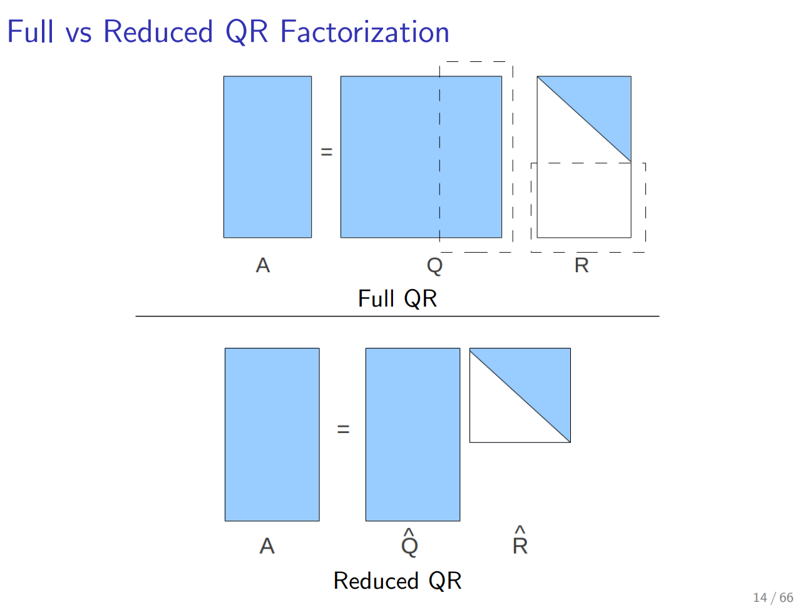
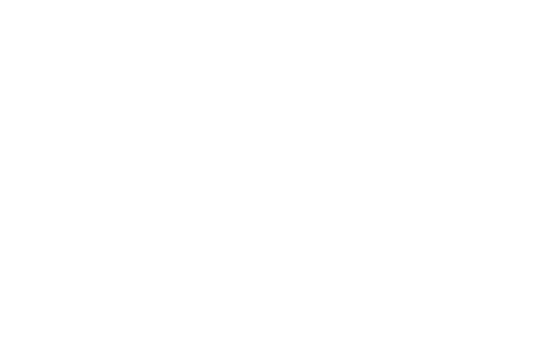

 <h1 id="第十三讲-深入认识LMS算法" style="text-align: center; margin-bottom: 2rem; border-bottom: none;">第十三讲 深入认识LMS算法</h1> 
 

  
  
  
 

## 1. 内容简介与导读

在前面的学习中，我们主要从**投影的几何视角**与**SVD的代数视角**剖析了LMS（最小均方）算法。我们看到，LMS本质上是利用瞬时梯度对Wiener解进行随机逼近；而SVD则揭示了最小二乘解在数值层面上的稳定性根源。然而，这远非最小二乘问题的全貌。

为了将LMS的认知推向极致，本章我们将从**四个递进的层次**重构对最小二乘与LMS的理解：

**第一层：解的存在性与唯一性——从超定、适定到欠定**
我们将暂时跳出自适应滤波的框框，回到线性代数中最根本的问题：方程个数与未知数个数的关系。超定（Over-determined）对应我们熟悉的"数据多于参数"——这是最小二乘的经典战场；适定（Exactly-determined）对应矩阵可逆；欠定（Under-determined）则意味着无穷多解，需要引入范数约束来挑选"最瘦"的那一个。这一分析将为我们后续选择何种数值解法奠定基调。

**第二层：从LMS到NLMS（归一化LMS）——步长的"自适应"**
标准LMS有一个致命弱点：它的收敛性能严重依赖于输入信号的功率水平。当输入幅值较大时，梯度噪声被放大，滤波器容易失稳；当输入过小时，收敛又变得极其迟缓。为了解决这一问题，NLMS将更新步长除以输入向量的能量（范数平方），使得每一次迭代的修正量对输入幅值"免疫"。我们将从直觉出发引入NLMS，并指出其看似"拍脑袋"的修正背后，实则蕴含着深刻的优化动机。

**第三层：Goodwin优化问题——NLMS的理论合法性辩护**
NLMS真的只是工程上的临时修补吗？绝非如此。我们将引出Goodwin等人提出的约束优化问题：在保证新滤波器系数与旧系数之间的变化量不超过某个可信域的前提下，最小化瞬时输出误差。通过拉格朗日乘子法，我们将严格推导出NLMS的更新公式，从而在理论上证明——**NLMS是带信任域约束的瞬时误差最小化问题的精确闭式解**。这让NLMS从"工程窍门"升华为"有理论根基的优化算法"。

**第四层：QR分解——最小二乘的终极数值利器（Householder + Givens）**
前文中，我们曾用SVD来审视最小二乘，但SVD计算量巨大，并不适合实时递推。而正规方程（\( X^TX\theta = X^Ty \)）虽然计算简单，却饱受条件数平方之苦（数值不稳定）。QR分解则站在两者的中间地带：它既避免了构造\( X^TX \)，又比SVD更高效。

我们将从**Householder反射**（Householder Reflection）入手，展示如何用正交变换将矩阵逐列上三角化。但Householder一次处理一整列，在递推更新（新数据不断到来）的场景下缺乏灵活性。为此，我们将引入**Givens旋转**（Givens Rotation），它每次只消去一个元素。通过Givens旋转，可以灵活处理新样本的加入，最终构建出**递推QR分解**（Recursive QR Decomposition）——这实际上是RLS（递归最小二乘）算法在数值线性代数层面的稳健实现，它避免了在RLS章节中用Woodbury恒等式更新协方差逆矩阵时可能遇到的数值恶化问题。

本章结束后，你将形成一张关于最小二乘的完整"作战地图"：从解的几何结构（超定/欠定），到随机梯度算法（LMS），到带约束的步长归一化（NLMS），再到正交变换下的数值堡垒（QR与递推QR）。这张地图，将成为你通往自适应滤波理论与数值计算殿堂的坚实路标。

---

## 2. 回顾超定最小二乘问题

在本节中，我们首先回顾在绝大多数实际场景中遇到的经典设定——超定最小二乘问题。其核心特征是数据（方程）的数量远多于待估参数的个数，此时通常不存在精确解，我们只能退而求其次，寻找一个在最小二乘意义下"最接近"的近似解。

### 2.1 问题定义

设目标向量为 $d \in \mathbb{R}^N$，数据矩阵为 $X \in \mathbb{R}^{N \times n}$。一般情况下我们面对的问题都是超定的，即 $N > n$，这意味着**方程的个数超过未知数的个数**。在这种情况下，线性方程组 $d = X\theta$ 通常是无解的（除非 $d$ 恰好落在 $X$ 的列空间中）。

因此，我们无法直接解方程得到精确解，而需要退而求其次，通过优化方法来逼近得到一个近似解。我们的目标是最小化残差的平方和，即求解如下最小二乘问题：
$$
\min_{\theta} \| d - X\theta \|^2  \tag{13.1}$$

### 2.2 几何解释：正交投影

这是对最小二乘的第一个理解层面，也是最直观的几何视角。由于 $d$ 通常不在 $X$ 的列空间（记为 $\text{Col}(X)$）中，我们只能在列空间中寻找一个与 $d$ 距离最近的点，即 $d$ 在 $\text{Col}(X)$ 上的**正交投影**。

通过对上述目标函数求梯度并令其为零，我们可以直接得到该最小二乘问题的解析解为： $$
\hat{\theta}_{LS} = (X^TX)^{-1} X^Td  \tag{13.2}$$

这个解不是别的，正是**投影**。它本质上将高维向量 $d$ 投影到了由 $X$ 的列向量张成的子空间上。所有的系数 $\hat{\theta}_{LS}$ 就是该投影在该子空间基下的坐标。因此，我们可以断定：**我们做最小二乘，本质上就是在做正交投影**。正规方程 $(X^TX)\theta = X^Td$ 正是正交性条件 $(d - X\theta) \perp \text{Col}(X)$ 的直接代数体现。

### 2.3 SVD视角与伪逆

在这个理解的基础上，为了进一步剖析最小二乘解的数值结构和稳定性，我们可以引入一个强大的矩阵分析工具——**奇异值分解（SVD）**。通过SVD，我们能够对数据矩阵 $X$ 产生一个全新的认识：它将 $X$ 分解为两个正交矩阵和一个对角矩阵的乘积，将原本耦合的各维度彻底"解耦"。

我们令数据矩阵 $X$ 的SVD分解为：
$$
X = U \Sigma V^T  \tag{13.3}$$

其中 $U$ 是 $N \times N$ 阶正交矩阵（左奇异向量），$V$ 是 $n \times n$ 阶正交矩阵（右奇异向量），$\Sigma$ 是一个 $N \times n$ 的对角矩阵，其主对角线上排列着非负的奇异值。

将SVD代入正规方程解中，就引出了第二个重要的理解角度——**伪逆**。矩阵 $X$ 不是方阵，无法直接求逆，但我们可以借助SVD构造其广义逆（即伪逆）。被对角化之后，最小二乘解就有了新的、基于奇异值的精确表达形式： $$
\hat{\theta}_{LS} = V^T \Sigma^{-1} U^T d = X^{+} d  \tag{13.4}$$

注意这里的符号说明：上式中 $V^T$ 和 $U^T$ 严格遵循行向量的约定。其中 $X^{+}$ 就是数据矩阵 $X$ 的 **Moore-Penrose 伪逆**，其表达式为：
$$
X^+ = V^T \Sigma^{-1} U^T  \tag{13.5}$$

这个表达式清晰地展现了奇异值在求解中的角色：$U^T d$ 将目标投影到输出奇异向量方向，$\Sigma^{-1}$ 按奇异值的倒数缩放（数值上奇异值越小，放大噪声的风险越大），最后通过 $V^T$ 组合回参数空间。这也是为什么SVD能够揭示最小二乘解对数据扰动的敏感度（条件数）。

---

## 3. 欠定最小二乘问题

接下来我们要认识的最小二乘，是从完全相反的角度来考虑的——即**欠定**情形。这种情况在传统的工程问题中相对少见，但在压缩感知、机器学习和高维数据分析中极为常见。

### 3.1 问题定义与核心矛盾

当数据矩阵 $X$ 满足 $N < n$ 时，意味着**方程的个数少于未知数的个数**。此时线性方程组 $d = X\theta$ 通常是欠定的：如果 $d$ 位于 $X$ 的行空间内，则该方程将有无穷多解。

面对无穷多的可行解，我们并没有一个"唯一"的答案。因此，我们需要引入一个额外的**范数约束**来从这无穷多解中挑选出符合某种"最优"标准的那个解。如果选择"模最小"作为标准（即参数向量的能量最小），我们就定义了**最小范数最小二乘问题**。它对应的数学优化模型为： $$
\min_{\theta} \| \theta \|^2, \quad \text{s.t.} \quad d = X\theta  \tag{13.6}$$

上式假设 $X$ 是行满秩的（$\text{rank}(X)=N$）。我们的目标是在满足精确重构观测 $d$ 的所有 $\theta$ 中，找到**欧几里得范数（模）最小**的那一个。这可以理解为"最简洁"或"最不夸张"的解。

### 3.2 拉格朗日乘子法求解

对于这个带等式约束的凸优化问题（目标函数是严格的凸函数，约束是线性的），我们很自然地会使用**拉格朗日乘子法**来进行处理。引入拉格朗日乘子向量 $\lambda \in \mathbb{R}^N$（注意$\lambda$是列向量），构造拉格朗日函数如下：

首先写出拉格朗日函数 $L$，将约束条件 $d = X\theta$ 以惩罚项的形式融入目标中：
$$
L(\theta, \lambda) = \| \theta \|^2 + \lambda^T \| d - X\theta \|^2 = \frac{1}{2} \theta^T \theta - \lambda^T (d^T - X \theta)  \tag{13.7}$$

> （文字说明：上式中第一项是原始的目标函数，第二项通过拉格朗日乘子将等式约束残差引入。这里乘子前的符号不影响最终驻点的性质，后续推导将给出驻点条件。）

为了找到该拉格朗日函数的鞍点（即原问题的最优解），我们对原始变量 $\theta$ 求梯度，并令其等于零： $$
\nabla_{\theta} L = \theta + X^T \lambda = 0  \tag{13.8}$$
移项后可以直接得到 $\theta$ 关于乘子 $\lambda$ 的线性表达式：
$$
\implies \theta = - X^T \lambda  \tag{13.9}$$

得到 $\theta$ 的表达式后，我们将其代入到拉格朗日函数 $L$ 中，以消去原始变量，从而得到仅关于对偶变量 $\lambda$ 的对偶函数 $L(\lambda)$。

我们将 $\theta = - X^T \lambda$ 带入 $L$，开始逐步化简： $$
L(\lambda) = \frac{1}{2}(- X^T \lambda)^T(- X^T \lambda)- \lambda^T (d^T - X (- X^T \lambda))  \tag{13.10}$$

逐项展开第一项：$\frac{1}{2} \lambda^T (XX^T) \lambda$。展开第二项中的括号：$- \lambda^T d^T - \lambda^T X X^T \lambda$（注意符号变换）。合并同类项后，我们得到对偶函数的最终简化形式：
$$
= \frac{1}{2} \lambda^T (XX^T) \lambda - \lambda^T (XX^T) \lambda - \lambda^T d
= - \frac{1}{2} \lambda^T (XX^T) \lambda - \lambda^T d  \tag{13.11}$$

为了最大化对偶函数（或寻找鞍点），我们继续对 $\lambda$ 求梯度，并令其为零： $$
\nabla_{\lambda} L(\lambda) = - (XX^T) \lambda - d = 0  \tag{13.12}$$

由于 $X$ 行满秩，$XX^T$ 是 $N \times N$ 的满秩方阵，因此可逆。解上述方程得到最优拉格朗日乘子为：
$$
\implies \lambda = - (XX^T)^{-1} d  \tag{13.13}$$

最后，我们将求得的 $\lambda$ 带回之前 $\theta$ 的表达式中，即得到欠定最小二乘问题（最小范数解）的闭式解： $$
\theta = - X^T \lambda = X^T (XX^T)^{-1} d  \tag{13.14}$$

### 3.3 SVD视角与伪逆的统一

我们再次从SVD的角度来审视这个解，并将此问题归结为伪逆的形式。

为了与前文超定情况下的伪逆表达式统一，我们将 $X$ 的SVD分解重新写为适用于欠定情况的形式（注意此时 $N < n$，奇异值矩阵的形态与超定时不同）：
$$
X = U \begin{pmatrix} \Sigma & 0 \end{pmatrix} V^T  \tag{13.15}$$

其中 $U$ 是 $N \times N$ 阶矩阵，$V$ 是 $n \times n$ 阶矩阵，$\begin{pmatrix} \Sigma & 0 \end{pmatrix}$ 是 $N \times n$ 的矩阵，$\Sigma$ 是 $N \times N$ 的对角非奇异阵。

将上述SVD分解代入 $X^T (XX^T)^{-1}$，我们开始逐步化简以验证其确实等于伪逆： $$
X^T (XX^T)^{-1} = V \begin{pmatrix} \Sigma \\ 0 \end{pmatrix} U^T \left( U \begin{pmatrix} \Sigma & 0 \end{pmatrix} V^T V \begin{pmatrix} \Sigma \\ 0 \end{pmatrix} U^T \right)^{-1}  \tag{13.16}$$

注意到内部的 $V^T V = I$，且 $U^T U = I$，我们先计算括号内的 $XX^T$：
$$
XX^T = U \begin{pmatrix} \Sigma & 0 \end{pmatrix} \begin{pmatrix} \Sigma \\ 0 \end{pmatrix} U^T = U \Sigma^2 U^T  \tag{13.17}$$
其逆为 $(XX^T)^{-1} = U \Sigma^{-2} U^T$。

将其代回原式： $$
= V \begin{pmatrix} \Sigma \\ 0 \end{pmatrix} U^T \cdot U \Sigma^{-2} U^T
= V \begin{pmatrix} \Sigma \\ 0 \end{pmatrix} \Sigma^{-2} U^T
= V \begin{pmatrix} \Sigma^{-1} \\ 0 \end{pmatrix} U^T  \tag{13.18}$$

最终我们得到：
$$
= V^T \begin{pmatrix} \Sigma^{-1} \\ 0 \end{pmatrix} U^T
= X^{+}  \tag{13.19}$$

正是 $X$ 的伪逆，即： $$
X^+ = V^T \Sigma^{-1} U^T  \tag{13.20}$$

**总结**：无论是超定还是欠定情形，最小二乘解（无论是投影解还是最小范数解）都可以统一表示为 $X^+ d$ 的形式。唯一的区别在于，在超定情况下我们保留了残差（投影误差），而在欠定情况下我们精确满足了等式约束，但压缩了参数本身的范数。这两种情形下的伪逆表达式完全自洽，构成了线性最小二乘理论的统一框架。

---
下面进入SVD框架下的结构分解。

---

### 3.4 透视最小二乘问题：SVD框架下的结构分解

在前面的讨论中，我们分别从超定（投影）和欠定（最小范数）两个角度看到了最小二乘问题的解，并且用SVD将两者统一为伪逆 \( X^+ d \) 的形式。然而，这还不是故事的全部。

SVD的真正威力在于，它不仅给出了解的**闭式表达式**，更重要的是，它**彻底揭示了最小二乘问题的内在结构**——它告诉我们：在参数向量 \( \theta \) 中，哪些分量是由数据约束强制决定的，哪些分量是完全自由的、可以任由我们选择的。

这种"透视"能力，对于理解欠定情形下为什么会有无穷多解、以及为什么最小范数解要把冗余分量置零，具有根本性的意义。下面我们一步一步来拆解。

#### 3.4.1 步骤一：写出误差的平方形式

首先，我们定义最小二乘问题的残差平方和为：

$$
\epsilon = (d-X\theta)^T(d-X\theta)  \tag{13.21}$$

这里的 \( \epsilon \) 是一个标量，表示残差的平方能量。我们的目标是最小化这个量。

#### 3.4.2 步骤二：利用正交性原理化简误差表达式

根据我们在超定最小二乘中反复使用的**正交性原理**——即最优解处的残差 \( d - X\theta \) 与数据矩阵 \( X \) 的每一列都正交——我们可以将误差表达式化简为一个更简洁的形式。这个化简的几何含义是：在最优点处，\( (d - X\theta) \) 与 \( X\theta \) 正交，因此总能量 \( \|d\|^2 = \|d - X\theta\|^2 + \|X\theta\|^2 \)。

利用这一正交性，误差可以写成： $$
\epsilon = d^T(d-X\theta)  \tag{13.22}$$

也就是说，在最优点处，误差能量等于目标向量 \( d \) 与残差向量 \( d - X\theta \) 的内积。这是一个在后续推导中极为关键的恒等式。

#### 3.4.3 步骤三：将 X 的 SVD 分解代入

接下来，我们将数据矩阵 \( X \) 的SVD分解代入上式。在欠定情形下（\( N < n \)），\( X \) 的SVD形式为：

$$
X = U \begin{pmatrix} \Sigma & 0 \end{pmatrix} V^T  \tag{13.23}$$

其中 \( U \) 是 \( N \times N \) 的正交矩阵，\( V \) 是 \( n \times n \) 的正交矩阵，\( \Sigma \) 是 \( N \times N \) 的对角矩阵（包含所有非零奇异值），而 \( \begin{pmatrix} \Sigma & 0 \end{pmatrix} \) 是一个 \( N \times n \) 的矩阵。

将这个分解代入误差表达式 \( \epsilon = d^T(d-X\theta) \) 中，我们得到： $$
\epsilon = d^T\left(d- U \begin{pmatrix} \Sigma & 0 \end{pmatrix} V^T \theta\right)  \tag{13.24}$$

这一步只是将 \( X \) 替换成了它的SVD分解，没有任何近似或取舍。

#### 3.4.4 步骤四：利用正交矩阵 \( U^T U = I \) 进行"视角转换"

为了看清误差的内部结构，我们在括号内部巧妙地插入一个恒等变换 \( U^T U = I \)。具体操作是：

$$
\epsilon = d^T\left( U U^T d - U \begin{pmatrix} \Sigma & 0 \end{pmatrix} V^T \theta \right)  \tag{13.25}$$

然后提取左边的公因子 \( U \)： $$
\epsilon = d^T U \left( U^T d - \begin{pmatrix} \Sigma & 0 \end{pmatrix} V^T \theta \right)  \tag{13.26}$$

这一步的几何含义是：我们将整个问题从原始的观测空间（由 \( d \) 和 \( X \) 定义）旋转到了SVD的奇异向量空间（由 \( U \) 和 \( V \) 定义）。在这个新的坐标系中，数据矩阵 \( X \) 变成了一个极其简单的对角块结构。

#### 3.4.5 步骤五：引入变换后的变量

为了记号简洁，我们定义两个经过正交变换后的新变量：

$$
\tilde{d} = U^T d, \qquad \tilde{\theta} = V^T \theta  \tag{13.27}$$

其中 \( \tilde{d} \) 是目标向量在左奇异向量基下的坐标，\( \tilde{\theta} \) 是参数向量在右奇异向量基下的坐标。由于 \( U \) 和 \( V \) 都是正交矩阵，这两个变换都是**等距变换**——它们不改变向量的长度。

将这两个新变量代入误差表达式，我们得到： $$
\epsilon = d^T U \left( \tilde{d} - \begin{pmatrix} \Sigma & 0 \end{pmatrix} \tilde{\theta} \right)  \tag{13.28}$$

#### 3.4.6 步骤六：写出最优解处的误差（最小误差）

现在，假设我们已经求得了最优解，即误差达到了最小值。把这个最小误差记作 \( \epsilon_{\min} \)，则有：

$$
\epsilon_{min} = d^T U \left( \tilde{d} - \begin{pmatrix} \Sigma & 0 \end{pmatrix} \tilde{\theta} \right)  \tag{13.29}$$

这里 \( \tilde{\theta} \) 是在最优解处对应的变换后的参数向量。注意，这个表达式还没有显式地写出 \( \tilde{\theta} \) 的具体形式，我们将在下一步中完成这个任务。

#### 3.4.7 步骤七：将 \( \tilde{\theta} \) 分块——关键的结构分解

现在来到最关键的一步。由于在欠定情形下 \( n > N \)，变换后的参数向量 \( \tilde{\theta} \) 是一个 \( n \) 维向量。而矩阵 \( \begin{pmatrix} \Sigma & 0 \end{pmatrix} \) 是一个 \( N \times n \) 的矩阵，它只作用于 \( \tilde{\theta} \) 的前 \( N \) 个分量，对后面的 \( n - N \) 个分量完全"视而不见"（因为右半部分是零矩阵）。

因此，我们自然地将 \( \tilde{\theta} \) 分块为两个部分： $$
\tilde{\theta} = \begin{pmatrix} \tilde{\theta}_1 \\ \tilde{\theta}_2 \end{pmatrix}  \tag{13.30}$$

其中 \( \tilde{\theta}_1 \) 是前 \( N \) 个分量（对应 \( \Sigma \) 的列），\( \tilde{\theta}_2 \) 是后 \( n - N \) 个分量（对应零矩阵的列）。

将这个分块代入误差表达式：

$$
\epsilon_{min} = d^T U \left( \tilde{d} - \begin{pmatrix} \Sigma & 0 \end{pmatrix} \begin{pmatrix} \tilde{\theta}_1 \\ \tilde{\theta}_2 \end{pmatrix} \right)  \tag{13.31}$$

#### 3.4.8 步骤八：揭示 \( \tilde{\theta}_2 \) 的冗余性

观察上式的结构：矩阵 \( \begin{pmatrix} \Sigma & 0 \end{pmatrix} \) 与分块向量相乘时，实际上只有 \( \tilde{\theta}_1 \) 部分被 \( \Sigma \) 作用，而 \( \tilde{\theta}_2 \) 部分直接乘以零矩阵，完全消失了。

这意味着什么？意味着：

**\( \tilde{\theta}_2 \) 对等式约束 \( d = X\theta \) 没有任何影响。**

换句话说，无论 \( \tilde{\theta}_2 \) 取什么值，等式约束都会被同样地满足。因此，\( \tilde{\theta}_2 \) 就是我们在前面反复提到的"冗余自由度"——它对应的是数据矩阵 \( X \) 的零空间方向，即那些不产生任何观测效应的参数组合。

因此，为了满足等式 \( d = X\theta \)，我们只需要让 \( \tilde{\theta}_1 \) 满足： $$
\tilde{d} = \Sigma \tilde{\theta}_1  \tag{13.32}$$

因为在上一步的误差表达式中，要使括号内的项为零（即达到零误差），就必须让 \( \tilde{\theta}_1 \) 解出上述线性方程。由于 \( \Sigma \) 是对角矩阵且所有奇异值都大于零（行满秩），我们可以直接求逆：

$$
\implies \tilde{\theta}_1 = \Sigma^{-1} \tilde{d}  \tag{13.33}$$

#### 3.4.9 步骤九：参数范数的分解——为什么最小范数解要把冗余置零

现在我们看到了 \( \tilde{\theta} \) 的完整结构：

- 第一部分 \( \tilde{\theta}_1 = \Sigma^{-1} \tilde{d} \) 是由等式约束 \( d = X\theta \) **强制决定**的，没有任何自由选择的空间。
- 第二部分 \( \tilde{\theta}_2 \) 则是**完全自由的**，无论取什么值，等式约束都照常满足。

那么，参数向量 \( \theta \) 的总范数（即模的平方）是多少呢？由于 \( V \) 是正交矩阵，变换 \( \tilde{\theta} = V^T \theta \) 是保范数的，即： $$
\|\theta\|^2 = \|\tilde{\theta}\|^2  \tag{13.34}$$

而 \( \|\tilde{\theta}\|^2 = \|\tilde{\theta}_1\|^2 + \|\tilde{\theta}_2\|^2 \)。将 \( \tilde{\theta}_1 = \Sigma^{-1} \tilde{d} \) 代入，我们得到：

$$
\|\theta\|^2 = \|\tilde{\theta}\|^2 = \|\tilde{\theta}_1\|^2 + \|\tilde{\theta}_2\|^2 = \|\Sigma^{-1} \tilde{d}\|^2 + \|\tilde{\theta}_2\|^2  \tag{13.35}$$

#### 3.4.10 步骤十：回到优化问题——最小范数解的几何本质

现在，我们回到原始优化问题： $$
\min_{\theta} \|\theta\|^2, \quad \text{s.t.} \quad d = X\theta  \tag{13.36}$$

我们要求所有满足等式约束的 \( \theta \) 中范数最小的那一个。根据上面的范数分解，这个问题的答案已经呼之欲出了：

- 第一项 \( \|\Sigma^{-1} \tilde{d}\|^2 \) 是**固定的**——它由数据 \( d \) 和矩阵 \( X \) 的奇异值结构决定，我们无法改变。
- 第二项 \( \|\tilde{\theta}_2\|^2 \) 是**非负的**——它完全由我们自由选择的 \( \tilde{\theta}_2 \) 贡献。

因此，要使总范数最小，唯一的办法就是让这个自由部分等于零：

$$
\min_{\theta} \|\theta\|^2 \quad \implies \quad \tilde{\theta}_2 = 0  \tag{13.37}$$

这就是为什么我们在上一节中直接用 \( \theta = X^T (XX^T)^{-1} d \) 得到了最小范数解——因为在这个解中，所有冗余自由度 \( \tilde{\theta}_2 \) 都被主动置零了。

#### 3.4.11 为什么称之为"透视"

通过上面的推导，我们完全说清楚了 \( \theta \) 的组成：在SVD的坐标系下，\( \theta \) 被清晰地分解为两个正交的部分——一个由数据强制决定的"必选分量"，和一个完全自由的"可选分量"。这就像透过X光看一个物体：SVD把数据矩阵 \( X \) 的内部结构彻底"透视"出来，让我们一眼看清哪些参数是必须的，哪些是多余的。

这正是SVD在最小二乘问题中最深刻的价值所在：它不仅给出了数值解，更揭示了问题的内在几何结构。理解了这一点，我们就不会再对"欠定问题有无穷多解"感到困惑——因为那些解的区别，仅仅在于我们如何选择那个自由的 \( \tilde{\theta}_2 \) 而已。

---

### 3.5 透视分析与伪逆的深度统一

在 3.4 节中，我们通过 SVD 透视了欠定最小二乘问题的内部结构，揭示了参数向量 $\theta$ 在右奇异向量基下的两个正交分量：

- $\tilde{\theta}_1$：由数据约束 $d = X\theta$ 强制决定的"必选分量"；
- $\tilde{\theta}_2$：对等式约束毫无影响的"冗余分量"。

并且我们得出结论：最小范数解 $\min \|\theta\|^2$ 等价于令 $\tilde{\theta}_2 = 0$。

现在，我们将这个透视结果与 2.3 节和 3.3 节中引入的 **伪逆 $X^+$** 进行深度统一，揭示伪逆的几何本质。

#### 3.5.1 伪逆在欠定情形下的分块表达

回顾 3.3 节，在欠定情形（$N < n$，$X$ 行满秩）下，$X$ 的 SVD 分解为： $$
X = U \begin{pmatrix} \Sigma & 0 \end{pmatrix} V^T  \tag{13.38}$$

其中 $U$ 是 $N \times N$ 正交矩阵，$V$ 是 $n \times n$ 正交矩阵，$\Sigma$ 是 $N \times N$ 的对角非奇异阵（所有 $N$ 个奇异值均大于零）。

我们推导出的欠定最小范数解为：

$$
\theta = X^T (XX^T)^{-1} d  \tag{13.39}$$

并且通过 SVD 化简，我们验证了： $$
X^T (XX^T)^{-1} = V \begin{pmatrix} \Sigma^{-1} \\ 0 \end{pmatrix} U^T = X^+  \tag{13.40}$$

因此，欠定情形下的伪逆 $X^+$ 可以显式地写成：

$$
X^+ = V \begin{pmatrix} \Sigma^{-1} \\ 0 \end{pmatrix} U^T  \tag{13.41}$$

这个表达式就是伪逆的"分块解剖图"。我们现在把它和 3.4 节的透视结果逐项对比。

#### 3.5.2 伪逆作用于 $d$ 时的分步解读

现在，我们将伪逆 $X^+$ 作用于目标向量 $d$，得到最小范数解 $\theta = X^+ d$。我们按照 SVD 的三个因子逐步拆解这个作用过程。

**第一步：左乘 $U^T$（投影到左奇异向量空间）** $$
\tilde{d} = U^T d  \tag{13.42}$$

这一步将目标向量 $d$ 从原始的 $N$ 维观测空间旋转到左奇异向量基下。$\tilde{d}$ 是一个 $N$ 维向量，它表示 $d$ 在各个左奇异方向上的投影分量。

**第二步：左乘 $\begin{pmatrix} \Sigma^{-1} \\ 0 \end{pmatrix}$（按奇异值倒数缩放并升维）**

$$
\begin{pmatrix} \Sigma^{-1} \\ 0 \end{pmatrix} \tilde{d} = \begin{pmatrix} \Sigma^{-1} \tilde{d} \\ 0 \end{pmatrix}  \tag{13.43}$$

这一步将 $N$ 维的 $\tilde{d}$ 映射为一个 $n$ 维向量。具体地：

- 前 $N$ 个分量：$\Sigma^{-1} \tilde{d}$，即每个方向上的投影分量除以对应的奇异值；
- 后 $n - N$ 个分量：**全部置零**。

这正是 3.4 节中透视分析的核心结论：**$\tilde{\theta}_2 = 0$**。

也就是说，伪逆在升维时，**主动将所有冗余自由度 $\tilde{\theta}_2$ 置零**。这不是一个随意的选择，而是伪逆的定义中"最小范数"这一性质在 SVD 坐标下的精确体现。

**第三步：左乘 $V$（旋转回原始参数空间）** $$
\theta = V \begin{pmatrix} \Sigma^{-1} \tilde{d} \\ 0 \end{pmatrix}  \tag{13.44}$$

这一步将 $n$ 维向量从右奇异向量基旋转回原始参数空间的坐标基下。由于 $V$ 是正交矩阵，这个旋转不改变向量的范数，因此 $\|\theta\|^2 = \|\begin{pmatrix} \Sigma^{-1} \tilde{d} \\ 0 \end{pmatrix}\|^2$，后 $n - N$ 个零分量对范数没有任何贡献。

#### 3.5.3 伪逆的几何本质：最小范数选择器

通过上面的分步拆解，我们可以给伪逆一个更加深刻的几何定义：

**在欠定情形下，伪逆 $X^+$ 是这样一个线性算子：它将目标向量 $d$ 映射到参数空间 $\mathbb{R}^n$ 中，在所有满足 $X\theta = d$ 的 $\theta$ 里，选出唯一一个与 $X$ 的零空间 $\mathcal{N}(X)$ 正交的向量。**

为什么这个说法成立？因为在 SVD 坐标下：

- 前 $N$ 个右奇异向量张成的子空间是 $\mathcal{R}(X^T)$（即 $X$ 的行空间），这是 $\tilde{\theta}_1$ 所在的子空间；
- 后 $n - N$ 个右奇异向量张成的子空间正是 $X$ 的零空间 $\mathcal{N}(X)$，这是 $\tilde{\theta}_2$ 所在的子空间。

伪逆通过将 $\tilde{\theta}_2$ 置零，强制解 $\theta$ 落在 $\mathcal{R}(X^T)$ 中，而 $\mathcal{R}(X^T)$ 恰好是 $\mathcal{N}(X)$ 的正交补空间。因此，伪逆给出的解**与零空间正交**，在几何上就是"离原点最近"的那个解——这正是最小范数解的几何刻画。

#### 3.5.4 超定情形的伪逆：从"投影"到"伪逆"的统一

为了完整起见，我们回顾 2.3 节中超定情形（$N > n$，$X$ 列满秩）的伪逆表达式。此时 $X$ 的 SVD 分解为：

$$
X = U \begin{pmatrix} \Sigma \\ 0 \end{pmatrix} V^T  \tag{13.45}$$

其中 $U$ 是 $N \times N$ 正交矩阵，$V$ 是 $n \times n$ 正交矩阵，$\Sigma$ 是 $n \times n$ 的对角非奇异阵，$\begin{pmatrix} \Sigma \\ 0 \end{pmatrix}$ 是一个 $N \times n$ 的矩阵。

超定情形下的最小二乘解为： $$
\hat{\theta}_{LS} = (X^T X)^{-1} X^T d  \tag{13.46}$$

通过 SVD 化简，我们得到：

$$
\hat{\theta}_{LS} = V \Sigma^{-1} \begin{pmatrix} \Sigma & 0 \end{pmatrix} U^T d = X^+ d  \tag{13.47}$$

其中伪逆 $X^+$ 的显式表达为： $$
X^+ = V \Sigma^{-1} \begin{pmatrix} \Sigma & 0 \end{pmatrix} U^T  \tag{13.48}$$

将此表达式与欠定情形的伪逆表达式：

$$
X^+ = V \begin{pmatrix} \Sigma^{-1} \\ 0 \end{pmatrix} U^T  \tag{13.49}$$

对比，我们可以看到两者在结构上**互为转置共轭**（在矩阵形态意义上）：

- 超定：伪逆先通过 $\begin{pmatrix} \Sigma & 0 \end{pmatrix}$ 对 $d$ 做**降维**（只保留前 $n$ 个左奇异方向），再通过 $\Sigma^{-1}$ 按奇异值倒数缩放，最后通过 $V$ 旋转回参数空间；
- 欠定：伪逆先通过 $U^T$ 对 $d$ 做**旋转**（保留全部 $N$ 个左奇异方向），再通过 $\begin{pmatrix} \Sigma^{-1} \\ 0 \end{pmatrix}$ 做**升维并在冗余方向填零**，最后通过 $V$ 旋转回参数空间。

两者统一在同一个 SVD 框架下，唯一的区别在于 $\Sigma$ 的形状和伪逆中零块的位置。

#### 3.5.5 伪逆的统一定义：四个 Moore-Penrose 条件

至此，我们可以从更高的视角重新审视伪逆。伪逆 $X^+$ 是唯一满足以下四个条件的矩阵：

1. $X X^+ X = X$（$X^+$ 是 $X$ 的广义左逆）；
2. $X^+ X X^+ = X^+$（$X^+$ 是 $X$ 的广义右逆）；
3. $(X X^+)^T = X X^+$（$X X^+$ 对称，即正交投影矩阵）；
4. $(X^+ X)^T = X^+ X$（$X^+ X$ 对称，即正交投影矩阵）。

在 SVD 的坐标系下，这四个条件全部自动满足：

- 条件 1 和 2 来自 $\Sigma \Sigma^+ \Sigma = \Sigma$ 和 $\Sigma^+ \Sigma \Sigma^+ = \Sigma^+$（奇异值取倒数再乘回去自然为 1）；
- 条件 3 来自 $X X^+ = U \begin{pmatrix} I & 0 \\ 0 & 0 \end{pmatrix} U^T$，这是到 $X$ 列空间的正交投影；
- 条件 4 来自 $X^+ X = V \begin{pmatrix} I & 0 \\ 0 & 0 \end{pmatrix} V^T$，这是到 $X$ 行空间（即 $\mathcal{R}(X^T)$）的正交投影。

**核心洞见**：伪逆的本质，就是通过 SVD 将数据矩阵 $X$ 的所有方向按奇异值大小排列，然后在"能求逆的方向上求逆"（非零奇异值取倒数），在"不能求逆的方向上置零"（零奇异值保持为零），最后通过正交矩阵将结果旋转回原始空间。

这就是为什么我们在 2.3 节和 3.3 节中反复强调：**伪逆的构造规则就是"转置 + 能求逆的部分求逆，不能求逆的部分填零"**。

#### 3.5.6 总结：透视分析是伪逆的"X光片"

现在，我们可以将 3.4 节的透视分析与伪逆的关系做一个最终的总结：

| 透视分析中的概念 | 伪逆中的对应 | 几何含义 |
|---|---|---|
| $\tilde{d} = U^T d$ | 伪逆的第一步：左乘 $U^T$ | 将 $d$ 投影到左奇异向量基 |
| $\tilde{\theta}_1 = \Sigma^{-1} \tilde{d}$ | 伪逆的第二步：前 $N$ 个分量按奇异值倒数缩放 | 在行空间方向上求逆 |
| $\tilde{\theta}_2 = 0$ | 伪逆的第二步：后 $n-N$ 个分量填零 | 在零空间方向上强制为零 |
| $\theta = V \tilde{\theta}$ | 伪逆的第三步：左乘 $V$ | 从右奇异向量基旋转回原始空间 |
| $\min \|\theta\|^2$ | 伪逆的最小范数性质 | 正交于零空间，离原点最近 |

**一句话总结**：

> 透视分析是伪逆的"X光片"——它在 SVD 坐标系下清晰地展示了伪逆的内部工作机制：在行空间方向上求逆以保证 $d = X\theta$，在零空间方向上置零以保证 $\|\theta\|$ 最小。这两步操作在伪逆的矩阵乘法 $X^+ = V \begin{pmatrix} \Sigma^{-1} \\ 0 \end{pmatrix} U^T$ 中浑然一体，而透视分析将它们彻底拆解、逐一显形。

这也是为什么我们说"SVD 是理解最小二乘的终极工具"——它不仅给出了伪逆的数值计算方法，更让我们看到了伪逆选择"最小范数解"的几何理由：它只是在右奇异向量基下，把冗余的自由度 $\tilde{\theta}_2$ 主动清零而已。这一清零操作，贯穿了从欠定最小二乘到压缩感知中 $\ell_2$ 范数正则化的整个理论脉络。

---

### 3.6 实例：从 LMS 的尺度敏感性问题到 Normalized LMS 的理论奠基

在前面的章节中，我们从超定和欠定两个角度彻底剖析了最小二乘问题的数学结构，并通过SVD和伪逆建立了统一的几何框架。现在，我们将这些理论工具应用于一个具体的工程问题——**LMS算法对输入信号尺度的敏感性**，以及如何通过归一化LMS（NLMS）来解决这一问题。

更重要的是，我们将看到，NLMS并不是一个"拍脑袋"的工程修补，而是某个带约束优化问题的**精确闭式解**——这正是Goodwin等人对自适应滤波理论做出的关键贡献。

### 3.6.1 LMS算法的尺度敏感性问题

回顾标准LMS算法的迭代步骤。在每一个时刻$n$，我们利用当前输入向量$X(n)$和期望输出$d(n)$，按照以下公式更新参数估计： $$
\hat{\theta}_{n+1} = \hat{\theta}_{n} + \mu X(n) e(n)  \tag{13.50}$$

其中瞬时误差$e(n)$定义为：

$$
e(n) = d(n) - X^T(n) \theta_n  \tag{13.51}$$

这里$\theta_n$是$n$时刻的参数估计值（注意：这里写的是$\theta_n$，表示当前时刻的系数向量；在一些文献中写作$\hat{\theta}_n$，含义相同）。$\mu$是步长参数，控制每次更新的幅度。

这个更新公式看起来简洁而优雅，但它隐藏着一个严重的工程隐患：**对输入信号$X(n)$的尺度极度敏感**。

#### 3.6.1.1 尺度变化如何破坏 LMS 的稳定性

假设我们将输入信号$X(n)$的幅度整体扩大两倍。为了保持同样的物理模型，期望输出$d(n)$也必须相应地扩大两倍（因为$d(n) \approx X^T(n)\theta$）。此时：

- 输入向量变为：$2X(n)$
- 期望输出变为：$2d(n)$
- 瞬时误差变为：$e'(n) = 2d(n) - (2X(n))^T \theta_n = 2(d(n) - X^T(n)\theta_n) = 2e(n)$

于是，LMS更新项变为： $$
X'(n) e'(n) = (2X(n)) \cdot (2e(n)) = 4 X(n) e(n)  \tag{13.52}$$

也就是说，**输入和输出同时扩大两倍，导致LMS的更新量扩大了四倍**。

这意味着什么？同一个参数估计问题，$\theta$的最优解完全没有变，但由于输入信号的尺度发生了变化，LMS算法的"有效步长"被放大了四倍。这种放大可能会导致算法发散、振荡，或者至少会严重恶化稳态失调。

更糟的是，如果输入信号的功率在不同时刻发生变化（例如语音信号、雷达回波等），LMS算法的行为会剧烈波动，使得步长$\mu$的选择变得极其困难。$\mu$选大了，在信号功率大的时候发散；$\mu$选小了，在信号功率小的时候收敛极慢。这种"尺度依赖性"严重限制了LMS在实际工程中的应用。

### 3.6.2 工程上的"瞎搞"：人为归一化

面对LMS的尺度敏感性问题，工程师们想出了一个很直接的办法：既然更新量$X(n)e(n)$被放大了，那就在更新之前把它"压回去"。

具体做法是：**在更新公式中除以输入向量的能量（即范数平方）**，使得更新量对输入尺度"免疫"。这就是归一化LMS（Normalized LMS，简称NLMS）：

$$
\hat{\theta}_{n+1} = \hat{\theta}_{n} + \mu \frac{X(n)}{\|X(n)\|^2} e(n)  \tag{13.53}$$

其中误差$e(n)$仍然定义为： $$
e(n) = d(n) - X^T(n) \theta_n  \tag{13.54}$$

这里的$\frac{X(n)}{\|X(n)\|^2}$是将输入向量$X(n)$除以其自身能量的平方——注意这不是归一化为单位向量（那应该是$X(n)/\|X(n)\|$），而是除以能量的平方，其量纲使得更新量对输入尺度不再敏感。

我们可以验证一下：如果$X(n)$和$d(n)$同时扩大两倍，则$e(n)$扩大两倍，而$X(n)/\|X(n)\|^2$缩小两倍（因为分子乘2，分母乘4），两者相乘后更新量保持不变。这正是我们想要的尺度不变性。

然而，从理论上看，这个归一化因子$\|X(n)\|^2$是**人为加上去的**。它确实解决了工程上的尺度问题，但它并没有一个坚实的理论基础——至少在当时看起来是这样。它更像是一个"聪明的修补"，而不是从某个优化问题中自然导出的结果。

### 3.6.3 Goodwin的深刻洞见：将NLMS转化为约束优化问题

就在工程师们还在"瞎搞"调参的时候，Goodwin等人给出了一个极具洞察力的解释。他们设计了一个精巧的优化问题，并证明了**NLMS的更新公式恰恰是这个优化问题的精确闭式解**。

这个发现从根本上改变了我们对NLMS的认识：它不再是"拍脑袋的归一化"，而是一个**有严格理论根基的约束优化算法**。

#### 3.6.3.1 优化问题的构造

Goodwin提出的优化问题如下：

$$
\boxed{\min_{\hat{\theta}_{n+1}} \|\hat{\theta}_{n+1} - \hat{\theta}_{n}\|^2, \quad \text{s.t.} \quad d(n) = X^T(n) \hat{\theta}_{n+1}}  \tag{13.55}$$

这个优化问题的含义非常清晰：

- **目标函数**：我们希望在更新参数时，**参数的变动量尽可能小**——即新的参数估计$\hat{\theta}_{n+1}$不要偏离旧的参数估计$\hat{\theta}_n$太远。
- **约束条件**：在$n+1$时刻的参数$\hat{\theta}_{n+1}$下，$n$时刻的输入数据$X(n)$必须**完美拟合**$n$时刻的期望输出$d(n)$。

换句话说，这个问题的核心思想是：**在保证新模型能够完美解释旧数据的前提下，对参数做出尽可能小的调整**。

这实际上是一种**信任域（trust region）**思想的体现——我们不信任大幅度的参数跳跃，因此限制参数的变化量最小，同时要求新模型至少在当前数据点上不产生误差。

约束条件$d(n) = X^T(n) \hat{\theta}_{n+1}$的展开形式为： $$
d(n) = \sum_{k=1}^n X(n, k) \hat{\theta}_{n+1} (k)  \tag{13.56}$$

其中$X(n, k)$表示输入向量$X(n)$的第$k$个分量，$\hat{\theta}_{n+1}(k)$表示参数向量$\hat{\theta}_{n+1}$的第$k$个分量。

#### 3.6.3.2 转化为关于 $\Delta \hat{\theta}$ 的欠定最小二乘问题

为了利用我们前面建立的伪逆理论，我们引入参数变化量的定义：

$$
\Delta \hat{\theta}_{n+1} = \hat{\theta}_{n+1} - \hat{\theta}_{n}  \tag{13.57}$$

则$\hat{\theta}_{n+1} = \hat{\theta}_{n} + \Delta \hat{\theta}_{n+1}$。将其代入约束条件： $$
d(n) = X^T(n) (\hat{\theta}_{n} + \Delta \hat{\theta}_{n+1})  \tag{13.58}$$

展开得到：

$$
d(n) = X^T(n) \hat{\theta}_{n} + X^T(n) \Delta \hat{\theta}_{n+1}  \tag{13.59}$$

移项： $$
X^T(n) \Delta \hat{\theta}_{n+1} = d(n) - X^T(n) \hat{\theta}_{n}  \tag{13.60}$$

右边正是我们在LMS中定义的瞬时误差$e(n)$：

$$
X^T(n) \Delta \hat{\theta}_{n+1} = e(n)  \tag{13.61}$$

于是，Goodwin的优化问题可以重新表述为： $$
\boxed{\min_{\Delta \hat{\theta}_{n+1}} \|\Delta \hat{\theta}_{n+1}\|^2, \quad \text{s.t.} \quad \underbrace{e(n)}_{d} = \underbrace{X^T(n)}_{X} \underbrace{\Delta \hat{\theta}_{n+1}}_{\theta}}  \tag{13.62}$$

#### 3.6.3.3 调用前面的欠定最小二乘结论

现在我们看到，这个问题**完全等价于我们在3.3节和3.4节中深入剖析的欠定最小二乘问题**：

- 目标函数是最小化$\|\Delta \hat{\theta}\|^2$（最小范数）；
- 约束是$e(n) = X^T(n) \Delta \hat{\theta}$（一个标量方程，对应$N=1$的欠定情形）；
- 数据矩阵是$X^T(n)$（一个$1 \times n$的行向量），方程个数$N=1$，未知数个数$n$，显然是欠定的（$N < n$）。

根据我们在3.3节中推导的最小范数解公式（欠定情形的闭式解）：

$$
\theta = X^T (XX^T)^{-1} d  \tag{13.63}$$

将对应符号代入：$\theta = \Delta \hat{\theta}_{n+1}$，$X = X^T(n)$（注意这里$X$是一个$1 \times n$的行向量），$d = e(n)$（标量）。

于是： $$
\Delta \hat{\theta}_{n+1} = (X^T(n))^T \left( X^T(n) (X^T(n))^T \right)^{-1} e(n)  \tag{13.64}$$

由于$(X^T(n))^T = X(n)$，且$X^T(n) X(n) = \|X(n)\|^2$（这是一个标量，即输入向量的能量的平方），代入得：

$$
\Delta \hat{\theta}_{n+1} = X(n) \left( \|X(n)\|^2 \right)^{-1} e(n)  \tag{13.65}$$

即： $$
\Delta \hat{\theta}_{n+1} = \frac{X(n)}{\|X(n)\|^2} e(n)  \tag{13.66}$$

#### 3.6.3.4 回到原始变量：得到 NLMS

由于$\Delta \hat{\theta}_{n+1} = \hat{\theta}_{n+1} - \hat{\theta}_{n}$，我们将上式改写为：

$$
\hat{\theta}_{n+1} - \hat{\theta}_{n} = \frac{X(n)}{\|X(n)\|^2} e(n)  \tag{13.67}$$

移项即得到： $$
\hat{\theta}_{n+1} = \hat{\theta}_{n} + \frac{X(n)}{\|X(n)\|^2} e(n)  \tag{13.68}$$

这正是在3.6.2节中我们"人为"写出的NLMS更新公式——现在它不再是人为的，而是从Goodwin约束优化问题中**严格推导出来的闭式解**。

### 3.6.4 理论意义与工程启示

Goodwin的这一推导具有深远的理论意义：

1. **NLMS有了坚实的理论基础**：它不再是工程上的"瞎搞"或"调参玄学"，而是带信任域约束的瞬时误差最小化问题的精确解。

2. **揭示了NLMS的几何本质**：根据3.4节的透视分析，$\Delta \hat{\theta}_{n+1}$被约束在$X(n)$的行空间方向上（即与输入向量$X(n)$平行的方向），而垂直于$X(n)$的分量全部置零。这正是最小范数解的特征——在所有能使新模型完美拟合当前数据点的参数变化量中，选择范数最小的那一个。

3. **与伪逆理论一致**：NLMS的更新方向$\frac{X(n)}{\|X(n)\|^2} e(n)$正是$X^T(n)$的伪逆作用于误差$e(n)$的结果。在单样本欠定情形下，伪逆退化为$\frac{X(n)}{\|X(n)\|^2}$。这验证了我们在3.5节中建立的伪逆框架。

4. **为自适应滤波提供了新的设计范式**：将滤波问题建模为"最小参数变化量+数据拟合约束"的优化问题，这一范式后来被广泛推广到仿射投影算法（APA）、递归最小二乘（RLS）以及其他更先进的自适应算法中。

**一句话总结**：

> LMS的尺度敏感性暴露了"无约束随机梯度下降"在工程中的脆弱性；NLMS通过归一化"瞎搞"解决了表面症状；而Goodwin的约束优化问题则将NLMS从"工程窍门"升华为"有严格理论根基的在线学习算法"，并揭示了其与伪逆理论的内在统一性。

---

## 4. QR分解在最小二乘与自适应滤波中的理论定位与算法演进

**透视超定最小二乘**

### 4.1 QR分解的引入动机：数值稳定性与递推可行性的双重诉求

在前面三节中，我们已经从三个不同的角度认识了最小二乘问题：

1. **几何角度**（第2节）：最小二乘是正交投影，解是$d$在$\operatorname{Col}(X)$上的投影，正规方程$(X^TX)\theta = X^Td$是正交性条件的代数表达。

2. **SVD角度**（第2、3节）：通过$X = U\Sigma V^T$将矩阵完全对角化，揭示了伪逆$X^+ = V\Sigma^{-1}U^T$的结构，并透视了欠定情形下$\theta$的组成——必选分量$\tilde{\theta}_1$与冗余分量$\tilde{\theta}_2$。

3. **约束优化角度**（第3.6节）：通过Goodwin的信任域问题，将NLMS从"工程修补"升华为"带约束的最小范数解"，并与伪逆理论统一。

然而，这三个角度都有一个共同的局限：**它们都依赖于显式地构造或分解$X$的某种形式**。

- 几何角度需要求解正规方程$(X^TX)\theta = X^Td$，这需要构造$X^TX$——当$X$的条件数较大时，$X^TX$的条件数是$X$的平方，数值稳定性极差。
- SVD角度虽然避免了构造$X^TX$，但计算SVD的代价是$O(Nn^2)$量级，在实时自适应滤波中完全不可接受。
- 约束优化角度给出了NLMS的理论解释，但仍然是逐样本的"瞬时"更新，没有利用历史数据的结构信息。

我们真正需要的，是一个兼具以下性质的求解工具：

1. **数值稳定**：不构造$X^TX$，避免条件数平方放大；
2. **计算高效**：比SVD便宜，能够在实时场景中使用；
3. **支持递推**：能够随着新数据的到来增量更新，而不是每次重新计算；
4. **保持正交性**：利用正交变换的保范数性质，使得数值误差不会积累。

**QR分解正是满足所有这些条件的工具。**

#### 4.1.1 QR 分解的核心优势

QR分解将一个矩阵$X \in \mathbb{R}^{N \times n}$（$N \geq n$，超定情形）分解为正交矩阵$Q$和上三角矩阵$R$的乘积：

$$
X = Q \begin{pmatrix} R \\ 0 \end{pmatrix}  \tag{13.69}$$

其中$Q \in \mathbb{R}^{N \times N}$是正交矩阵（$Q^TQ = I$），$R \in \mathbb{R}^{n \times n}$是上三角矩阵。

将QR分解代入最小二乘问题$\min_\theta \|d - X\theta\|^2$，利用正交矩阵保范数的性质： $$
\|d - X\theta\|^2 = \left\| d - Q \begin{pmatrix} R \\ 0 \end{pmatrix} \theta \right\|^2 = \left\| Q^T d - \begin{pmatrix} R \\ 0 \end{pmatrix} \theta \right\|^2  \tag{13.70}$$

令$Q^T d = \begin{pmatrix} c_1 \\ c_2 \end{pmatrix}$，其中$c_1 \in \mathbb{R}^n$，$c_2 \in \mathbb{R}^{N-n}$，则：

$$
\|d - X\theta\|^2 = \|c_1 - R\theta\|^2 + \|c_2\|^2  \tag{13.71}$$

于是最小二乘问题转化为一个**上三角线性系统的求解**： $$
R\theta = c_1  \tag{13.72}$$

由于$R$是上三角矩阵，这个方程可以通过**回代**（back substitution）以$O(n^2)$的复杂度轻松求解。

#### 4.1.2 与 SVD 和正规方程的对比

| 维度 | 正规方程 | SVD | QR分解 |
|---|---|---|---|
| 需要构造$X^TX$ | 是（条件数平方） | 否 | 否 |
| 数值稳定性 | 差 | 极好 | 好 |
| 计算复杂度 | $O(Nn^2 + n^3)$ | $O(Nn^2)$ | $O(Nn^2)$ |
| 对缺秩的处理 | 崩溃 | 完美（截断SVD） | 需列主元QR |
| 递推更新能力 | 弱 | 弱 | 强（通过Givens旋转） |

QR分解在数值稳定性上优于正规方程，在计算效率上优于SVD，是批处理最小二乘问题中最常用的"黄金标准"。

#### 4.1.3 为什么 LMS 需要 QR 视角

LMS是随机梯度下降——它用单样本的瞬时梯度代替统计梯度。这个"随机"特性使得LMS的计算极其简单（$O(n)$），但也带来了两个问题：

1. **收敛速度依赖于$X$的条件数**：当输入向量$X(n)$的各分量高度相关时（即$R = \mathbb{E}[XX^T]$的条件数很大），LMS收敛极慢；
2. **无法利用历史数据的结构**：每一步只用当前样本，丢弃了所有历史信息。

QR分解提供了一个"中间方案"：它不是逐样本的随机更新（像LMS），也不是批处理全部数据（像正规方程或SVD），而是**通过对数据矩阵进行增量式QR分解，实现递推的最小二乘估计**。

这个递推QR分解（Recursive QR Decomposition）最终将导出**QR-RLS算法**——它是RLS（递归最小二乘）家族中最数值稳定的实现，比我们在第2章中通过Woodbury恒等式推导的标准RLS更稳健。

#### 4.1.4 本章路径：从 Householder 到 Givens 再到递推 QR

为了理解递推QR分解，我们需要依次掌握三个工具：

1. **Householder反射**（Householder Reflection）：这是一种能够将矩阵的一整列"拍扁"到某个方向上的正交变换。它是批处理QR分解的主力，每次操作消除一列中除第一个元素外的所有元素。其优点是效率高，缺点是不够灵活——一次处理一整列，难以局部更新。

2. **Givens旋转**（Givens Rotation）：这是一种只作用于两个坐标轴的正交变换，每次只消去一个元素。虽然单个Givens旋转的效率不如Householder反射，但它的**灵活性**使得它能够处理新数据的加入：当一个新的观测样本到来时，我们只需用一系列Givens旋转将新增行"旋转"进已有的上三角矩阵中，而不需要重新计算整个QR分解。

3. **递推QR分解**：通过Givens旋转逐行更新QR分解，我们最终得到一个完整的递推最小二乘算法。这个算法在每一步中，都保持了$R$矩阵的上三角结构，并利用正交变换更新解向量$\theta$——没有任何矩阵求逆，没有任何条件数平方效应。

#### 4.1.5 最后的落脚点：回看 LMS

当我们完成了QR分解的递推实现后，再回头看LMS，会有一种全新的领悟：

- LMS是在**原始坐标**下做随机梯度下降，步长$\mu$的选择困难本质上是由于各坐标方向上的"曲率"不同（特征值扩散）；
- NLMS通过归一化补偿了输入功率的影响，但仍然是逐样本的、不考虑历史信息的；
- 递推QR分解（QR-RLS）则是在**正交变换后的坐标**下做最小二乘，$R$矩阵的上三角结构直接反映了数据在各方向上的累积能量——它相当于对输入信号做了"在线白化"，从而消除了特征值扩散对收敛速度的影响。

这就解释了为什么RLS族算法的收敛速度远快于LMS：**它们隐式地利用QR分解对输入进行了正交化处理，使得梯度方向直接指向最优解，而不是在狭长的误差曲面上来回振荡。**

本章接下来的内容，将一步步地展现这个从Householder到Givens、从批处理到递推的完整旅程。我们会看到，Householder和Givens虽然在形式上不同，但它们共享同一个本质：**通过正交变换将问题化约为更容易求解的形式，同时保证数值稳定性。**

---
### 4.2 QR分解：线性代数基础

在进入自适应滤波的具体应用之前，我们首先从纯粹的线性代数角度建立QR分解的数学框架。QR分解是矩阵计算中最核心的工具之一，它回答了一个基本问题：**如何将一个任意矩阵通过正交变换转化为上三角形式？**

#### 4.2.1 QR分解的定义

设 $X \in \mathbb{R}^{N \times n}$ 是一个实矩阵，其中 $N \geq n$（即行数不少于列数，对应超定情形）。QR分解将 $X$ 分解为一个正交矩阵 $Q$ 和一个上三角矩阵 $R$ 的乘积：

$$
X = Q \begin{pmatrix} R \\ 0 \end{pmatrix}  \tag{13.73}$$

其中：

- $Q \in \mathbb{R}^{N \times N}$ 是正交矩阵，满足 $Q^T Q = Q Q^T = I_N$。$Q$ 的列向量构成 $\mathbb{R}^N$ 的一组标准正交基。
- $R \in \mathbb{R}^{n \times n}$ 是上三角矩阵，即 $R_{ij} = 0$ 对所有 $i > j$ 成立。其对角线元素 $R_{ii}$ 通常取为正数（在某些约定下）。
- $0$ 表示 $(N - n) \times n$ 的零矩阵。

这个分解也可以更紧凑地写成"经济型"（economy size）形式。如果只保留 $Q$ 的前 $n$ 列，记为 $Q_1 \in \mathbb{R}^{N \times n}$，则： $$
X = Q_1 R  \tag{13.74}$$

其中 $Q_1$ 满足 $Q_1^T Q_1 = I_n$（列正交，但 $Q_1 Q_1^T \neq I_N$，除非 $N = n$）。这种形式在计算和存储上更高效，也是实际算法中常用的形式。

#### 4.2.2 QR分解的存在性与构造方法

QR分解的存在性可以从Gram-Schmidt正交化过程得到直观理解。给定 $X$ 的 $n$ 个列向量 $x_1, x_2, \ldots, x_n \in \mathbb{R}^N$，Gram-Schmidt过程通过以下方式构造一组标准正交基 $q_1, q_2, \ldots, q_n$：

$$
q_1 = \frac{x_1}{\|x_1\|}  \tag{13.75}$$

对于 $k = 2, 3, \ldots, n$： $$
v_k = x_k - \sum_{i=1}^{k-1} (q_i^T x_k) q_i, \qquad q_k = \frac{v_k}{\|v_k\|}  \tag{13.76}$$

这个过程本质上是在每一步中，从 $x_k$ 中减去其在已有正交基上的投影，得到与所有 $q_i$（$i < k$）正交的剩余分量 $v_k$，然后归一化。

将上述过程写成矩阵形式，就得到了QR分解。具体地，$X$ 的每一列 $x_k$ 可以表示为 $q_1, \ldots, q_k$ 的线性组合：

$$
x_k = \sum_{i=1}^{k} R_{ik} q_i  \tag{13.77}$$

其中系数 $R_{ik} = q_i^T x_k$（对于 $i < k$）和 $R_{kk} = \|v_k\|$。由于 $x_k$ 与 $q_{k+1}, \ldots, q_n$ 无关，系数矩阵 $R$ 自然呈现出上三角结构。

**关于数值稳定性的重要说明**：经典Gram-Schmidt过程虽然在数学上是正确的，但数值上不稳定——当列向量近似线性相关时，舍入误差会导致正交性严重丧失。在实际计算中，我们使用改进的Gram-Schmidt过程（MGS）或Householder反射来实现QR分解，后者具有极佳的数值稳定性。

#### 4.2.3 QR分解的唯一性

QR分解不是唯一的。如果 $X$ 的列是线性无关的，并且我们要求 $R$ 的对角线元素全部为正（即 $R_{ii} > 0$），则分解 $X = QR$ 是唯一的。

这个唯一性条件的来源在于：正交矩阵 $Q$ 的每一列可以独立地改变符号，而不影响 $Q$ 的正交性。如果我们允许 $Q$ 的列乘以 $-1$，则对应的 $R$ 的行也会改变符号。因此，通过约定 $R$ 的对角线元素为正，我们消除了这种符号模糊性，获得了唯一分解。

在自适应滤波的递推场景中，保持对角线元素为正有助于数值稳定性，但并非严格必要——实际算法中通常通过Givens旋转的构造方式来自然保证这一性质。

#### 4.2.4 QR分解与最小二乘问题的直接关联

QR分解之所以在最小二乘问题中占据核心地位，是因为它能够将原始问题转化为一个极易求解的形式。

考虑超定最小二乘问题： $$
\min_{\theta} \|d - X\theta\|^2  \tag{13.78}$$

将 $X = Q \begin{pmatrix} R \\ 0 \end{pmatrix}$ 代入目标函数：

$$
\epsilon =\|d - X\theta\|^2 = \left\| d - Q \begin{pmatrix} R \\ 0 \end{pmatrix} \theta \right\|^2  \tag{13.79}$$

由于 $Q$ 是正交矩阵，它保持向量长度不变，即 $\|Q^T z\| = \|z\|$ 对任意 $z$ 成立。因此： $$
\|d - X\theta\|^2 = \left\| Q^T d - \begin{pmatrix} R \\ 0 \end{pmatrix} \theta \right\|^2  \tag{13.80}$$

将 $Q^T d$ 分块为：

$$
Q^T d = \begin{pmatrix} c_1 \\ c_2 \end{pmatrix}, \qquad c_1 \in \mathbb{R}^n, \quad c_2 \in \mathbb{R}^{N-n}  \tag{13.81}$$

则： $$
\|d - X\theta\|^2 = \left\| \begin{pmatrix} c_1 \\ c_2 \end{pmatrix} - \begin{pmatrix} R \\ 0 \end{pmatrix} \theta \right\|^2
= \|c_1 - R\theta\|^2 + \|c_2\|^2  \tag{13.82}$$

上式中的 $\|c_2\|^2$ 与 $\theta$ 无关。因此，最小化 $\|d - X\theta\|^2$ 等价于最小化 $\|c_1 - R\theta\|^2$。由于 $R$ 是上三角矩阵且（在列满秩假设下）可逆，我们可以通过令 $c_1 - R\theta = 0$ 使这一项为零：

$$
R\theta = c_1  \tag{13.83}$$

这是一个上三角线性系统，其解可以通过**回代**（back substitution）以 $O(n^2)$ 的复杂度直接求出： $$
\theta_n = \frac{c_{1,n}}{R_{nn}}, \qquad \theta_i = \frac{c_{1,i} - \sum_{j=i+1}^{n} R_{ij} \theta_j}{R_{ii}}, \quad i = n-1, n-2, \ldots, 1  \tag{13.84}$$

最小残差平方和即为 $\|c_2\|^2$。

#### 4.2.5 QR分解的几何解释

从几何角度看，QR分解揭示了矩阵 $X$ 的列空间结构：

- $Q$ 的前 $n$ 列 $q_1, \ldots, q_n$ 构成了 $X$ 的列空间 $\operatorname{Col}(X)$ 的一组标准正交基。
- $Q$ 的后 $N-n$ 列 $q_{n+1}, \ldots, q_N$ 构成了 $\operatorname{Col}(X)^\perp$（列空间的正交补）的一组标准正交基。
- $R$ 的对角线元素 $R_{ii}$ 是第 $i$ 个"新息"的长度——即 $x_i$ 在去除前 $i-1$ 个列方向后的剩余分量的大小。
- 如果某个 $R_{ii} = 0$，则 $x_i$ 线性依赖于前面的列向量，矩阵 $X$ 缺秩。

这组几何解释后来在自适应滤波中有着直接的应用：$R$ 的对角线元素反映了输入信号在递推过程中的"能量积累"，而 $c_1 = Q^T d$ 则反映了目标向量在各正交方向上的投影系数。

#### 4.2.6 QR分解的数值稳定性分析

与正规方程 $X^T X \theta = X^T d$ 相比，QR分解在数值上更为稳定。正规方程的系数矩阵 $X^T X$ 的条件数是 $\kappa(X^T X) = \kappa(X)^2$，即原矩阵条件数的平方。当 $X$ 病态时，这一平方效应会导致解的严重失真。

QR分解避免了构造 $X^T X$。它直接处理 $X$，上三角矩阵 $R$ 的条件数与原矩阵 $X$ 相同（因为正交变换不改变条件数）：

$$
\kappa(R) = \kappa(X)  \tag{13.85}$$

因此，QR分解不会放大条件数。这是它比正规方程更受青睐的根本原因。

与SVD相比，QR分解的计算代价更低（$O(Nn^2)$ vs $O(Nn^2)$，但常数因子更小），且不需要迭代求解。但SVD在矩阵缺秩或接近缺秩时提供了更丰富的结构信息（如零空间的显式表示），而QR分解需要配合列主元（column pivoting）才能处理严重缺秩的情形。

#### 4.2.7 QR分解与其他分解方法的对比

为了更清晰地定位QR分解在线性代数工具谱系中的位置，我们将其与正规方程和SVD做一个结构化对比：

| 维度 | 正规方程 $(X^T X)\theta = X^T d$ | SVD $X = U \Sigma V^T$ | QR分解 $X = Q \begin{pmatrix} R \\ 0 \end{pmatrix}$ |
|---|---|---|---|
| 条件数 | $\kappa(X)^2$（平方放大） | $\kappa(X)$ | $\kappa(X)$（不变） |
| 缺秩处理 | 崩溃（矩阵不可逆） | 通过截断SVD完美处理 | 需列主元QR辅助 |
| 计算复杂度 | $O(Nn^2 + n^3)$ | $O(Nn^2)$（常数较大） | $O(Nn^2)$（常数较小） |
| 解的获取 | 解线性方程组 | 伪逆 $X^+ = V\Sigma^{-1}U^T$ | 上三角回代 $R\theta = c_1$ |
| 递推更新能力 | 弱（需重新计算） | 弱（需重新分解） | 强（Givens旋转增量更新） |
| 几何解释 | 正交投影 | 信号子空间与噪声子空间分离 | 逐列正交化与能量累积 |

#### 4.2.8 从批量QR到递推QR：为什么需要Householder和Givens

批处理QR分解（如通过Householder反射实现）一次性处理全部 $N$ 个样本，得到 $R$ 和 $c_1$。但在自适应滤波中，数据是**逐时刻到达**的——每来一个新样本 $(X(n), d(n))$，数据矩阵 $X$ 就增加一行，之前的QR分解也随之过时。

如果每次新样本到达时都重新计算QR分解，计算代价将随 $N$ 线性增长，无法满足实时性要求。因此，我们需要一种**递推更新机制**：在已有上三角矩阵 $R$ 和向量 $c_1$ 的基础上，利用新样本 $(X(n), d(n))$ 高效地更新分解，而不是从头开始。

这正是Householder反射和Givens旋转的用武之地：

- **Householder反射**：批处理模式下的主力工具，一次操作能够将一列中的所有下方元素"拍"为零，效率最高，但缺乏灵活性，难以局部更新。
- **Givens旋转**：递推模式下的精准工具，每次只处理两个坐标轴，能够"手术刀式"地消灭单个元素，适合逐行更新上三角矩阵。

在接下来的两节中，我们将分别详细推导Householder反射和Givens旋转的数学形式、几何意义及其在QR分解中的具体应用，最终构建出完整的递推QR分解算法。

---
### 4.3 QR分解：从高斯消元到正交上三角化的演进

#### 4.3.1 QR 分解的核心任务：上三角化

QR分解的本质任务非常简单：**将一个矩阵 $X \in \mathbb{R}^{N \times n}$（$N \geq n$）分解为一个正交矩阵 $Q$ 和一个上三角矩阵 $R$ 的乘积**： $$
X = Q \begin{pmatrix} R \\ 0 \end{pmatrix}  \tag{13.86}$$

或者等价地写成经济型形式 $X = Q_1 R$，其中 $Q_1 \in \mathbb{R}^{N \times n}$ 是列正交矩阵（$Q_1^T Q_1 = I_n$），$R \in \mathbb{R}^{n \times n}$ 是上三角矩阵。

从这个表达式可以立刻得到一个关键关系：**$R$ 可以通过左乘 $Q^T$ 从 $X$ 中获得**：

$$
R = Q^T X  \tag{13.87}$$

（在完整QR分解中，$Q^T X = \begin{pmatrix} R \\ 0 \end{pmatrix}$，取其前 $n$ 行即为 $R$。）

因此，QR分解本质上是在做一件事：**通过一个正交变换 $Q^T$，将原始矩阵 $X$ 转化为上三角形式 $R$**。这个操作称为**上三角化**（triangularization）。

#### 4.3.2 上三角化的常见手段：高斯消元法及其问题

在数值线性代数中，将一个矩阵化为上三角形式的最经典手段是**高斯消元法**（Gaussian elimination）。高斯消元法通过一系列初等行变换（即左乘初等矩阵），将矩阵逐步化为上三角形式。

具体来说，对于矩阵 $X$ 的第 $k$ 列，高斯消元法利用第 $k$ 行的第 $k$ 个元素（称为**主元**，pivot）作为"支点"，通过将第 $k$ 列的倍数加到下方的行上，消除该列中第 $k$ 行以下的所有非零元素。

然而，高斯消元法存在一系列严重的数值问题：

**问题1：主元为零时的崩溃**

如果第 $k$ 列的第 $k$ 个元素 $X_{kk} = 0$，则无法将其作为主元来消除下方的元素——因为任何倍数乘以零仍然是零，无法消去下方元素。

**问题2：选主元的必要性与复杂性**

为了解决主元为零的问题，我们必须进行**选主元**（pivoting）操作：在 $X_{kk}$ 及其下方的元素中，找出绝对值最大的一个，将其所在行与第 $k$ 行交换，使非零元素（最好是绝对值较大的元素）成为新的主元。

行交换操作相当于左乘一个置换矩阵 $P$。于是高斯消元法实际做的是： $$
P X = L U  \tag{13.88}$$

其中 $P$ 是置换矩阵，$L$ 是下三角矩阵，$U$ 是上三角矩阵。这就是**带选主元的LU分解**。

选主元虽然解决了主元为零的问题，但它带来了额外的复杂性和开销，而且在某些病态矩阵上，即使选主元也无法保证数值稳定性。

**问题3：数值不稳定性的根源——非正交变换**

高斯消元法的初等行变换矩阵不是正交矩阵。具体地，用于消元的初等矩阵 $E$（将第 $i$ 行的倍数加到第 $j$ 行）的条件数可能远大于1。这意味着，在消元过程中，输入数据的微小误差可能被大幅放大。

更重要的是，**非正交变换会改变向量的长度**。当我们对 $X$ 的某一列进行操作时，这个列的范数（模）会发生变化。这种范数的变化使得误差分析变得困难，也为数值不稳定性埋下了隐患。

#### 4.3.3 正交上三角化：从非正交变换到正交变换的跨越

如果我们能构造一个**正交矩阵 $Q$**，使得 $Q^T X$ 是上三角矩阵，那么上述问题均得到解决：

1. **不需要选主元**：因为正交矩阵总是非奇异的，且条件数为1，不存在主元为零而崩溃的情况（数值上会出现接近奇异的情形，但可以通过算法设计来处理，不需要显式的行交换）。

2. **条件数不变**：因为正交变换不改变矩阵的条件数，即 $\kappa(Q^T X) = \kappa(X)$。矩阵 $X$ 本身有多病态，经过正交变换后仍然有多病态，但不会变得更病态。这保证了数值稳定性。

3. **列范数不变**：这是正交变换最核心的性质。对于 $X$ 的任意列向量 $x$，我们有：

$$
\|Q^T x\| = \|x\|  \tag{13.89}$$

即**对 $X$ 的每一个列向量进行操作，不会改变这个向量的模**。这个性质保证了在消元过程中，各列的能量（范数）保持不变，误差不会被"捏造"出来。

4. **误差不放大**：由于正交矩阵的条件数为1，且 $Q^T Q = I$，在浮点运算中，正交变换是数值上最稳定的一类线性变换。舍入误差在正交变换中不会被放大。

这些优势使得**正交上三角化**成为数值线性代数中处理最小二乘问题的黄金标准。

#### 4.3.4 正交上三角化的两种实现：Householder 与 Givens

现在问题转化为：**如何构造一个正交矩阵 $Q$，使得 $Q^T X$ 成为上三角矩阵？**

历史上有两种经典的方法可以实现正交上三角化：

##### 4.3.4.1 方法一：Householder 反射

Householder反射通过一个**镜像反射**变换，将矩阵的一整列"拍"到坐标轴方向上。对于一个非零列向量 $x$，我们可以构造一个对称正交矩阵 $H$，使得： $$
Hx = \alpha e_1  \tag{13.90}$$

即 $x$ 的所有分量，除了第一个以外，全部变为零。

**特点**：一次反射操作可以消灭一列中所有下方的元素。效率极高，适合批处理计算。但一次处理一整列，缺乏局部更新的灵活性。

##### 4.3.4.2 方法二：Givens 旋转

Givens旋转是一个在二维平面内的**旋转**变换。对于任意二维向量 $(a, b)^T$，我们可以构造一个旋转矩阵，使得：

$$
\begin{pmatrix} c & s \\ -s & c \end{pmatrix} \begin{pmatrix} a \\ b \end{pmatrix} = \begin{pmatrix} r \\ 0 \end{pmatrix}  \tag{13.91}$$

即通过旋转将第二个分量置零。

**特点**：每次只消去一个元素。单次效率不如Householder反射，但具有良好的局部性，非常适合递推更新——当新数据到达时，只需用若干Givens旋转将新增行"旋转"进已有的上三角矩阵中，不需要重新计算整个分解。

#### 4.3.5 从正交上三角化到最小二乘的完整路径

一旦我们通过Householder反射或Givens旋转得到了上三角矩阵 $R$，最小二乘问题的求解就变得极为简单。

回顾最小二乘问题 $\min_\theta \|d - X\theta\|^2$。将 $X = Q \begin{pmatrix} R \\ 0 \end{pmatrix}$ 代入，并利用正交矩阵的保范数性质： $$
\|d - X\theta\|^2 = \left\| Q^T d - \begin{pmatrix} R \\ 0 \end{pmatrix} \theta \right\|^2  \tag{13.92}$$

令 $Q^T d = \begin{pmatrix} c_1 \\ c_2 \end{pmatrix}$，其中 $c_1 \in \mathbb{R}^n$，$c_2 \in \mathbb{R}^{N-n}$。则：

$$
\|d - X\theta\|^2 = \|c_1 - R\theta\|^2 + \|c_2\|^2  \tag{13.93}$$

由于 $\|c_2\|^2$ 与 $\theta$ 无关，最小化 $\|d - X\theta\|^2$ 等价于求解上三角线性系统： $$
R\theta = c_1  \tag{13.94}$$

这个系统可以通过**回代**（back substitution）以 $O(n^2)$ 的复杂度直接求解。

**总结**：QR分解的本质是正交上三角化。它通过正交变换将数值不稳定的最小二乘问题转化为数值稳定的上三角线性系统求解问题。高斯消元法是非正交的上三角化，而Householder反射和Givens旋转是正交的上三角化——正是正交性保证了QR分解在数值计算中的卓越稳定性。在接下来的两节中，我们将分别详细推导Householder反射和Givens旋转的数学形式、几何意义及其在QR分解中的具体应用，最终构建出完整的递推QR分解算法。

---

### 4.4 Householder反射：批处理QR分解的主力工具

在上一节中，我们建立了QR分解的代数框架。现在，我们进入第一个具体的构造方法——**Householder反射**。Householder反射是批处理QR分解中最常用的工具，其核心思想是：**通过一个正交变换，将矩阵的一整列"反射"到某个坐标轴上，从而一次性将该列中除第一个元素外的所有元素全部置零。**

#### 4.4.1 什么是Householder反射

由图可知**用x在反射轴U上的投影的2倍减去x就得到了$H$**。

Householder反射是一种**基于镜面反射的正交变换**。给定一个非零向量 $v \in \mathbb{R}^N$，定义Householder矩阵为：

$$
H = I - 2 \frac{v v^T}{v^T v}  \tag{13.95}$$

其中 $I$ 是 $N \times N$ 的单位矩阵，$v v^T$ 是 $v$ 的外积，是一个 $N \times N$ 的秩一矩阵；$v^T v$ 是 $v$ 的范数平方，是一个标量。

**几何意义**：$H$ 代表一个关于超平面 $\operatorname{span}\{v\}^\perp$（即与 $v$ 正交的所有向量张成的子空间）的镜面反射。任何向量 $x$ 在 $H$ 作用下的像 $Hx$，都是 $x$ 关于该超平面的镜像。

**两个基本性质**：

1. **对称性**：$H^T = H$。因为 $H^T = I - 2\frac{v v^T}{v^T v} = H$。

2. **正交性**：$H^T H = I$。验证如下： $$
H^T H = H^2 = \left( I - 2\frac{v v^T}{v^T v} \right)^2 = I - 4\frac{v v^T}{v^T v} + 4\frac{(v v^T)(v v^T)}{(v^T v)^2}  \tag{13.96}$$

由于 $(v v^T)(v v^T) = v (v^T v) v^T = (v^T v) v v^T$，代入得：

$$
H^2 = I - 4\frac{v v^T}{v^T v} + 4\frac{v v^T}{v^T v} = I  \tag{13.97}$$

因此 $H^T H = I$。正交变换不改变向量的长度，这是它在数值计算中备受青睐的根本原因——误差不会被放大。

#### 4.4.2 Householder反射的目标：将向量反射到坐标轴上

Householder反射最典型的应用是：**给定一个非零向量 $x \in \mathbb{R}^N$，构造一个Householder矩阵 $H$，使得 $Hx$ 与第一个坐标轴方向 $e_1 = (1, 0, \ldots, 0)^T$ 平行**，即： $$
Hx = \alpha e_1  \tag{13.98}$$

其中 $\alpha = \pm \|x\|$ 是一个标量，$e_1 = (1, 0, \ldots, 0)^T$ 是第一个标准基向量（列向量）。

这个性质意味着：经过Householder反射后，向量 $x$ 的所有分量，除了第一个以外，全部变为零。这正是我们在QR分解中需要的——将矩阵的一列"上三角化"。

#### 4.4.3 反射向量 $v$ 的构造

我们的目标是找到 $v$，使得 $Hx = \alpha e_1$。我们采用几何构造法。

设 $v$ 是 $x$ 与 $\alpha e_1$ 的差向量：

$$
v = x - \alpha e_1  \tag{13.99}$$

这里的几何直观是：$v$ 是从目标点 $\alpha e_1$ 指向原点 $x$ 的向量。反射超平面正是 $v$ 的垂直平分面——它将 $x$ 反射到 $\alpha e_1$ 的位置。

将 $v = x - \alpha e_1$ 代入Householder的定义，我们验证它确实满足要求。首先计算： $$
v^T x = (x - \alpha e_1)^T x = x^T x - \alpha e_1^T x = \|x\|^2 - \alpha x_1  \tag{13.100}$$

其中 $x_1$ 是 $x$ 的第一个分量（标量）。再计算 $v^T v$：

$$
v^T v = (x - \alpha e_1)^T (x - \alpha e_1) = \|x\|^2 - 2\alpha x_1 + \alpha^2  \tag{13.101}$$

由于 $\alpha = \pm \|x\|$，即 $\alpha^2 = \|x\|^2$，代入得： $$
v^T v = 2\|x\|^2 - 2\alpha x_1 = 2(\|x\|^2 - \alpha x_1) = 2 v^T x  \tag{13.102}$$

现在计算 $Hx$：

$$
Hx = \left( I - 2\frac{v v^T}{v^T v} \right) x = x - 2\frac{v (v^T x)}{v^T v}  \tag{13.103}$$

利用 $v^T v = 2 v^T x$，代入得： $$
Hx = x - 2\frac{v (v^T x)}{2 v^T x} = x - v = x - (x - \alpha e_1) = \alpha e_1  \tag{13.104}$$

验证完毕。这个推导的关键在于 $v^T v = 2 v^T x$ 这一恒等式，它使得反射变换精确地将 $x$ 映射到 $\alpha e_1$ 方向。

#### 4.4.4 数值稳定性的考虑：$\alpha$ 的符号选择

在上述推导中，$\alpha = \pm \|x\|$ 可以取正号或负号。但在数值计算中，符号的选择至关重要，它直接影响到 $v$ 的计算精度。

如果 $x_1 > 0$ 且我们取 $\alpha = \|x\|$，则 $v_1 = x_1 - \|x\|$。当 $x_1 \approx \|x\|$ 时（即 $x$ 几乎与 $e_1$ 平行），$v_1$ 会非常接近零，导致严重的**相消误差**（catastrophic cancellation）。这会使 $v$ 失去精度，进而影响 $H$ 的正交性。

为了规避这个问题，标准的数值线性代数实现采用以下符号约定：

$$
\alpha = -\text{sign}(x_1) \cdot \|x\|  \tag{13.105}$$

即 $\alpha$ 的符号与 $x_1$ 相反。这样，$v_1 = x_1 - \alpha = x_1 + \text{sign}(x_1) \cdot \|x\|$，两个同号数相加，避免了相消误差。

在这种约定下，$v$ 的构造公式为： $$
v = x - \alpha e_1 = x + \text{sign}(x_1) \|x\| e_1  \tag{13.106}$$

Householder矩阵 $H$ 的显式构造为：

$$
H = I - 2 \frac{v v^T}{v^T v}  \tag{13.107}$$

#### 4.4.5 Householder反射在批处理QR分解中的应用

现在我们展示如何用Householder反射逐步将矩阵 $X \in \mathbb{R}^{N \times n}$ 化为上三角形式。

**第1步**：取 $X$ 的第一列 $x^{(1)} \in \mathbb{R}^N$，构造Householder矩阵 $H_1 \in \mathbb{R}^{N \times N}$，使得： $$
H_1 x^{(1)} = \alpha_1 e_1^{(N)}  \tag{13.108}$$

其中 $e_1^{(N)} = (1, 0, \ldots, 0)^T \in \mathbb{R}^N$。于是：

$$
H_1 X = \begin{pmatrix}
R_{11} & * & * & \cdots & * \\
0      & * & * & \cdots & * \\
0      & * & * & \cdots & * \\
\vdots & \vdots & \vdots & \ddots & \vdots \\
0      & * & * & \cdots & *
\end{pmatrix}  \tag{13.109}$$

即第一列除了第一个元素外全部被置零。$R_{11} = (X_1^2 + \dots + X_n^2)^{1/2}$，因为Householder反射不改变向量的模。

**第2步**：现在我们关注右下角的子矩阵 $X^{(2)} \in \mathbb{R}^{(N-1) \times (n-1)}$（即去掉第一行和第一列后剩下的部分）。取 $X^{(2)}$ 的第一列（即 $X$ 的第二列从第二行开始的部分），构造Householder矩阵 $H_2' \in \mathbb{R}^{(N-1) \times (N-1)}$，将其映射到 $e_1^{(N-1)}$ 方向。

然后将 $H_2'$ 嵌入到 $N \times N$ 的矩阵中： $$
H_2 = \begin{pmatrix}
1 & 0_{1 \times (N-1)} \\
0_{(N-1) \times 1} & H_2'
\end{pmatrix}  \tag{13.110}$$

**$H_2$ 保持第一行不变**，只作用于第2到第 $N$ 行。于是：

$$
H_2 H_1 X = \begin{pmatrix}
R_{11} & R_{12} & * & \cdots & * \\
0      & R_{22} & * & \cdots & * \\
0      & 0      & * & \cdots & * \\
\vdots & \vdots & \vdots & \ddots & \vdots \\
0      & 0      & * & \cdots & *
\end{pmatrix}  \tag{13.111}$$

现在前两列已经上三角化。

**第 $k$ 步**：重复上述过程，对右下角子矩阵 $\mathbb{R}^{(N-k+1) \times (n-k+1)}$ 重复操作，构造 $H_k$。

**最终**：经过 $n$ 步（因为 $X$ 只有 $n$ 列）后，我们得到： $$
H_n \cdots H_2 H_1 X = \begin{pmatrix} R \\ 0 \end{pmatrix}  \tag{13.112}$$

其中 $R \in \mathbb{R}^{n \times n}$ 是上三角矩阵。令

$$
Q = H_1 H_2 \cdots H_n  \tag{13.113}$$

（注意顺序：$Q$ 是各 $H_k$ 的乘积，因为 $H_n \cdots H_1 X = \begin{pmatrix} R \\ 0 \end{pmatrix}$，所以 $X = (H_1 \cdots H_n) \begin{pmatrix} R \\ 0 \end{pmatrix} = Q \begin{pmatrix} R \\ 0 \end{pmatrix}$。）

由于每个 $H_k$ 都是正交矩阵，它们的乘积 $Q$ 也是正交矩阵，且 $Q^T Q = I$。于是我们得到了完整的QR分解。

#### 4.4.6 Householder反射的优势与局限

**优势**：

1. **数值稳定性极佳**：正交变换不放大条件数，避免了正规方程的条件数平方问题。

2. **效率高**：每次反射可以同时将一整列中所有下方的元素置零，操作集中，适合现代计算机的矩阵运算库（如BLAS/LAPACK）。

3. **实现成熟**：几乎所有数值计算软件（MATLAB、NumPy、LAPACK等）的QR分解底层都使用了Householder反射。

**局限**：

1. **缺乏局部更新能力**：Householder反射是对整个列的操作。当一个新的数据行（即一个新的观测样本）到达时，矩阵 $X$ 增加了一行，整个QR分解的结构被破坏，所有 $H_k$ 的维度都变了，无法简单地进行增量更新。我们只能从头开始重新计算QR分解——这在实时自适应滤波中是不可接受的。

2. **一次处理一整列的"刚性"**：Householder反射的"野心"太大，它追求一次性消灭一整列的所有非零元素。这种"全局性"使得它在需要局部修改的场景下显得笨重。

正是这两个局限，尤其是在线递推场景中对增量更新的需求，迫使我们引入下一个工具——**Givens旋转**。

---

### 4.5 Givens旋转：递推QR分解的手术刀

与Householder反射的"全局性"不同，Givens旋转是一种**局部化的正交变换**。它只作用于向量的两个分量，像一把手术刀一样精准地消灭单个非零元素，而保持其他所有分量不变。这种局部性使得Givens旋转天然适合递推更新。

#### 4.5.1 什么是Givens旋转

Givens旋转是一个在由第 $i$ 个和第 $k$ 个坐标轴张成的平面内进行旋转的正交变换。对于 $N$ 维空间，Givens旋转矩阵 $G(i, k, \theta) \in \mathbb{R}^{N \times N}$ 定义如下：

- 在 $(i, i)$ 和 $(k, k)$ 位置，取值为 $c = \cos \theta$；
- 在 $(i, k)$ 位置，取值为 $s = \sin \theta$；
- 在 $(k, i)$ 位置，取值为 $-s = -\sin \theta$；
- 其他对角线位置取 $1$；
- 其他非对角线位置取 $0$。

显式地（以 $i < k$ 为例）： $$
G(i, k, \theta) = \begin{pmatrix}
1 & \cdots & 0 & \cdots & 0 & \cdots & 0 \\
\vdots & \ddots & \vdots & & \vdots & & \vdots \\
0 & \cdots & c & \cdots & s & \cdots & 0 \\
\vdots & & \vdots & \ddots & \vdots & & \vdots \\
0 & \cdots & -s & \cdots & c & \cdots & 0 \\
\vdots & & \vdots & & \vdots & \ddots & \vdots \\
0 & \cdots & 0 & \cdots & 0 & \cdots & 1
\end{pmatrix}  \tag{13.114}$$

当 $G(i, k, \theta)$ 左乘一个向量 $x \in \mathbb{R}^N$ 时，只有第 $i$ 个和第 $k$ 个分量发生变化：

$$
\begin{pmatrix} x_i' \\ x_k' \end{pmatrix} = \begin{pmatrix} c & s \\ -s & c \end{pmatrix} \begin{pmatrix} x_i \\ x_k \end{pmatrix}  \tag{13.115}$$

其他所有分量 $x_j$（$j \neq i, k$）保持不变。

**几何意义**：Givens旋转是在 $i$-$k$ 平面内将向量 $(x_i, x_k)^T$ 旋转角度 $\theta$。旋转不改变向量的长度：$x_i'^2 + x_k'^2 = x_i^2 + x_k^2$。

**正交性**：Givens旋转矩阵是正交矩阵。验证如下： $$
G(i, k, \theta)^T G(i, k, \theta) = \begin{pmatrix} c & -s \\ s & c \end{pmatrix} \begin{pmatrix} c & s \\ -s & c \end{pmatrix} = \begin{pmatrix} c^2 + s^2 & cs - sc \\ sc - cs & s^2 + c^2 \end{pmatrix} = \begin{pmatrix} 1 & 0 \\ 0 & 1 \end{pmatrix}  \tag{13.116}$$

因此 $G^T G = I$。正交变换的保范数性质在这里同样成立。

#### 4.5.2 Givens旋转的目标：将单个元素置零

与Householder反射将整个列"拍平"不同，Givens旋转的目标非常具体：**给定一个二维向量 $(a, b)^T \in \mathbb{R}^2$，构造一个旋转角度 $\theta$，使得旋转后的第二个分量为零**，即：

$$
\begin{pmatrix} c & s \\ -s & c \end{pmatrix} \begin{pmatrix} a \\ b \end{pmatrix} = \begin{pmatrix} r \\ 0 \end{pmatrix}  \tag{13.117}$$

其中 $r = \sqrt{a^2 + b^2}$ 是原始向量的长度。

这个目标意味着：通过旋转，我们将向量 $(a, b)^T$ 完全转到第一个坐标轴方向上，从而"消灭"了第二个分量 $b$。

#### 4.5.3 旋转参数的显式求解

现在我们从方程组出发，显式求解 $c$ 和 $s$。展开上述矩阵-向量乘法： $$
\begin{cases}
c \cdot a + s \cdot b = r \\
-s \cdot a + c \cdot b = 0
\end{cases}  \tag{13.118}$$

由第二个方程：$s \cdot a = c \cdot b$，即 $s / c = b / a$（假设 $a \neq 0$）。

由勾股定理（旋转保长度）：$r = \sqrt{a^2 + b^2}$，且 $c^2 + s^2 = 1$。

我们直接给出最稳定、最常用的解析解：

$$
c = \frac{a}{r}, \qquad s = \frac{b}{r}  \tag{13.119}$$

其中 $r = \sqrt{a^2 + b^2}$。

验证：将 $c$ 和 $s$ 代入旋转方程： $$
c \cdot a + s \cdot b = \frac{a}{r} \cdot a + \frac{b}{r} \cdot b = \frac{a^2 + b^2}{r} = \frac{r^2}{r} = r  \tag{13.120}$$

第二个分量：

$$
-s \cdot a + c \cdot b = -\frac{b}{r} \cdot a + \frac{a}{r} \cdot b = 0  \tag{13.121}$$

验证通过。因此，给定任意非零向量 $(a, b)^T$，我们都可以通过上述 $c$ 和 $s$ 构造一个Givens旋转，将其第二个分量精确置零。

**关于 $r$ 的计算**：在实际数值计算中，为了避免 $a^2 + b^2$ 可能发生的上溢或下溢，通常使用缩放后的"稳定范数"计算。但在理论推导中，我们直接使用 $r = \sqrt{a^2 + b^2}$。

#### 4.5.4 Givens旋转在批处理QR分解中的应用

虽然Givens旋转通常用于递推更新，但为了完整理解其能力，我们先展示它如何用于批处理QR分解。

给定矩阵 $X \in \mathbb{R}^{N \times n}$，我们希望将其化为上三角形式。与Householder反射一次处理一列不同，Givens旋转通过**逐个消灭矩阵下三角部分的每一个非零元素**来实现上三角化。

具体策略如下：

对于第 $j$ 列（$j = 1, 2, \ldots, n$），从最后一行 $i = N$ 开始，逐行向上到 $i = j+1$，用Givens旋转消灭 $X_{i, j}$：

1. 当前要消灭的元素是 $X_{i, j}$（第 $i$ 行第 $j$ 列）。我们将其与同一列上方的元素 $X_{j, j}$（此时 $X_{j, j}$ 是第 $j$ 列中尚未被消灭的"基准"元素）配对。

2. 构造Givens旋转 $G(j, i, \theta)$，其中 $(a, b) = (X_{j, j}, X_{i, j})$。计算： $$
r = \sqrt{X_{j, j}^2 + X_{i, j}^2}, \qquad c = \frac{X_{j, j}}{r}, \qquad s = \frac{X_{i, j}}{r}  \tag{13.122}$$

3. 将 $G(j, i, \theta)$ 左乘当前矩阵，使得 $(X_{j, j}, X_{i, j})^T$ 变为 $(r, 0)^T$。于是 $X_{i, j}$ 被置零。

4. 由于Givens旋转只影响第 $j$ 行和第 $i$ 行，且 $i > j$，第 $i$ 行中 $j$ 列左侧的元素（即 $< j$ 的列）已经被之前的步骤处理完毕，不会受到破坏。

通过对每个非零下三角元素执行上述操作，我们最终将 $X$ 化为上三角形式。总的Givens旋转数量约为 $Nn - n(n+1)/2$，对于稠密矩阵，计算量略高于Householder反射（常数因子更大），因此在批处理场景下，Givens旋转不如Householder反射高效。

#### 4.5.5 Givens旋转的核心优势：递推更新QR分解

Givens旋转的真正威力不在批处理，而在**递推**。当一个新的观测样本 $(X_{\text{new}}^T, d_{\text{new}})$ 到达时，数据矩阵增加了一行：

$$
\tilde{X} = \begin{pmatrix} X \\ X_{\text{new}}^T \end{pmatrix} \in \mathbb{R}^{(N+1) \times n}  \tag{13.123}$$

假设我们已经有了 $X$ 的QR分解： $$
X = Q \begin{pmatrix} R \\ 0 \end{pmatrix}  \tag{13.124}$$

现在 $\tilde{X}$ 的QR分解如何更新？一种直接的方法是将新行附加到 $R$ 的底部，构成一个"准上三角"矩阵：

$$
\begin{pmatrix} R \\ X_{\text{new}}^T \end{pmatrix} \in \mathbb{R}^{(n+1) \times n}  \tag{13.125}$$

这个矩阵只有最后一行的 $n$ 个元素破坏了上三角结构——前 $n$ 行已经是上三角的，第 $n+1$ 行是全新的非零行。

现在，我们使用 **$n$ 个Givens旋转**，从左到右逐个消灭第 $n+1$ 行的元素：

- **第1个旋转** $G(1, n+1)$：取 $a = R_{11}$，$b = (X_{\text{new}})_1$，旋转后 $R_{11}$ 变为 $R_{11}' = \sqrt{R_{11}^2 + (X_{\text{new}})_1^2}$，而第 $n+1$ 行的第1个元素被置零。这个旋转还会影响第 $n+1$ 行的后续元素（从第2列到第 $n$ 列），但这些影响是局部的，可以继续处理。

- **第2个旋转** $G(2, n+1)$：此时第 $n+1$ 行的第1个元素已经为零，我们取 $a = R_{22}$，$b = (X_{\text{new}})_2$（已经过第一个旋转的影响），旋转后 $R_{22}$ 更新，第 $n+1$ 行的第2个元素被置零。

- **依此类推**：进行 $n$ 次Givens旋转 $G(1, n+1), G(2, n+1), \ldots, G(n, n+1)$。每次旋转消除第 $n+1$ 行的第 $k$ 个元素，同时更新对应的 $R_{kk}$ 和第 $n+1$ 行剩余列的元素。

**最终结果**：经过 $n$ 次Givens旋转后，第 $n+1$ 行的所有 $n$ 个元素全部被置零，矩阵恢复上三角形式： $$
\begin{pmatrix} R_{\text{new}} \\ 0 \end{pmatrix}  \tag{13.126}$$

其中 $R_{\text{new}} \in \mathbb{R}^{n \times n}$ 是更新后的上三角矩阵。

与此同时，如果我们跟踪所有Givens旋转的乘积 $Q_{\text{new}} = G_n \cdots G_1 Q$，我们就得到了新的正交矩阵。但在自适应滤波中，我们通常不需要显式构造完整的 $Q$，而只需要 $R$ 和 $c_1 = Q^T d$ 的更新。

#### 4.5.6 Givens旋转与Householder反射的对比总结

| 维度 | Householder反射 | Givens旋转 |
|---|---|---|
| 作用范围 | 一次性作用于整列 | 每次只作用于两个坐标轴 |
| 置零能力 | 一次反射可消灭一列中所有下方元素 | 一次旋转只消灭一个元素 |
| 批处理效率 | 高（操作集中，适合BLAS） | 低（需要大量旋转） |
| 递推更新能力 | 弱（列维度变化后难以局部更新） | 强（可逐行、逐元素增量处理） |
| 数值稳定性 | 极好 | 极好 |
| 计算代价（批处理） | $O(Nn^2)$（常数较小） | $O(Nn^2)$（常数较大） |
| 计算代价（递推） | 不适用（需重算） | $O(n^2)$（每次新样本） |
| 适用场景 | 批量离线计算 | 在线递推、实时自适应滤波 |

#### 4.5.7 递推QR分解的算法雏形

基于上述Givens旋转的逐行更新机制，我们可以勾勒出递推QR分解的完整流程：

**初始化**：$R = 0_{n \times n}$，$c = 0_{n \times 1}$（或者利用前 $n$ 个样本做一次批处理QR分解作为初始值）。

**对每一个新到达的样本** $(X(n), d(n))$（其中 $X(n) \in \mathbb{R}^n$ 是列向量）：

1. 将新行 $X(n)^T$ 附加到 $R$ 的底部，形成准上三角矩阵 $\begin{pmatrix} R \\ X(n)^T \end{pmatrix}$。

2. 将新目标值 $d(n)$ 附加到 $c$ 的底部：$c \leftarrow \begin{pmatrix} c \\ d(n) \end{pmatrix}$。

3. 对 $k = 1, 2, \ldots, n$：

   - 取当前"准上三角"矩阵的第 $k$ 行第 $k$ 列元素 $a = R_{kk}$，以及底部行（原第 $n+1$ 行）的第 $k$ 个元素 $b$。

   - 计算 $r = \sqrt{a^2 + b^2}$，$c_r = a / r$，$s_r = b / r$（这里 $c_r$ 和 $s_r$ 是旋转的余弦和正弦，为了避免与向量 $c$ 混淆，我们用下标 $r$ 区分）。

   - 构造Givens旋转 $G(k, n+1)$，将其左乘到当前矩阵上，更新第 $k$ 行和第 $n+1$ 行的所有相关元素，同时更新 $c$ 向量中对应的两个分量。

   - 此时第 $n+1$ 行的第 $k$ 个元素被置为零。

4. 循环结束后，$R$ 被更新为新的上三角矩阵，$c$ 被更新为 $Q^T d$ 的新值。

5. 若要获得当前时刻的最小二乘解，只需回代求解 $R\theta = c$。

这个递推过程的每一步都只涉及 $O(n)$ 次标量运算（每个Givens旋转只影响两行，共 $O(n)$ 个元素需要更新），总计 $O(n^2)$ 的复杂度。这比重新计算完整QR分解的 $O(Nn^2)$ 要高效得多，且数值稳定性远优于通过Woodbury恒等式更新协方差矩阵逆的标准RLS。

---
### 4.6 基于正交变换的递归最小二乘：从Householder批处理到Givens递推的统一框架

在4.5节中，我们分别建立了Householder反射（批处理QR分解）和Givens旋转（递推QR更新）的完整数学形式。现在，我们将这两套工具整合起来，重新推导递归最小二乘（Recursive Least Squares, RLS）算法。

与第2章中通过Woodbury恒等式更新协方差逆矩阵 $P(n) = \phi^{-1}(n)$ 的标准RLS推导不同，这里的推导**完全不涉及矩阵求逆**，所有更新都通过正交变换完成。这使得QR-RLS在数值稳定性上远优于标准RLS——它不会遭遇条件数平方的问题，也不会因为 $P(n)$ 失去对称正定性而发散。

#### 4.6.1 标准RLS的递推公式回顾

在进入QR推导之前，我们先回顾第2章中通过Woodbury恒等式得到的标准RLS递推公式。这些公式是我们即将推导的QR-RLS的"目标"——我们希望在保持相同输入输出关系的前提下，用正交变换替代矩阵求逆。

**问题设定**：在每一个时刻 $n$，我们有一组历史数据 $\{X(k), d(k)\}_{k=1}^n$，其中 $X(k) \in \mathbb{R}^m$ 是输入向量（列向量），$d(k) \in \mathbb{R}$ 是期望输出。定义数据矩阵 $X_n \in \mathbb{R}^{n \times m}$（每一行是一个输入样本）和目标向量 $d_n \in \mathbb{R}^n$：

$$
X_n = \begin{pmatrix} X^T(1) \\ X^T(2) \\ \vdots \\ X^T(n) \end{pmatrix}, \qquad d_n = \begin{pmatrix} d(1) \\ d(2) \\ \vdots \\ d(n) \end{pmatrix}  \tag{13.127}$$

**加权最小二乘目标**：引入遗忘因子 $0 < \lambda \leq 1$，定义加权最小二乘代价函数： $$
J_n(\theta) = \sum_{k=1}^n \lambda^{n-k} \left( d(k) - X^T(k) \theta \right)^2 = \| d_n - X_n \theta \|_{\Lambda_n}^2  \tag{13.128}$$

其中 $\Lambda_n = \operatorname{diag}(\lambda^{n-1}, \lambda^{n-2}, \ldots, 1)$ 是加权对角矩阵。

**标准RLS递推公式**：

定义加权样本协方差矩阵：

$$
\Phi(n) = \sum_{k=1}^n \lambda^{n-k} X(k) X^T(k) = X_n^T \Lambda_n X_n  \tag{13.129}$$

定义加权互相关向量： $$
Z(n) = \sum_{k=1}^n \lambda^{n-k} d(k) X(k) = X_n^T \Lambda_n d_n  \tag{13.130}$$

则正规方程为：

$$
\Phi(n) \theta_n = Z(n)  \tag{13.131}$$

标准RLS利用Woodbury恒等式递推更新 $P(n) = \Phi^{-1}(n)$，得到以下递推公式：

**增益向量**： $$
K(n) = \frac{P(n-1) X(n)}{\lambda + X^T(n) P(n-1) X(n)}  \tag{13.132}$$

**协方差逆矩阵更新**：

$$
P(n) = \frac{1}{\lambda} \left[ P(n-1) - K(n) X^T(n) P(n-1) \right]  \tag{13.133}$$

**参数估计更新**： $$
\theta_n = \theta_{n-1} + K(n) \left[ d(n) - X^T(n) \theta_{n-1} \right]  \tag{13.134}$$

这个推导是优雅的，但存在数值隐患：

1. $P(n)$ 需要通过矩阵减法更新，可能因舍入误差失去对称正定性；
2. 计算 $K(n)$ 涉及 $P(n-1) X(n)$，当 $P(n-1)$ 病态时误差被放大；
3. $P(n)$ 的条件数与 $\Phi(n)$ 相同，而 $\Phi(n) = X_n^T \Lambda_n X_n$ 的条件数是 $X_n$ 条件数的平方。

在接下来的推导中，我们将看到QR-RLS如何通过正交变换完全回避这些问题。

#### 4.6.2 QR分解做最小二乘：$Q_N$ 和 $R_N$ 的核心作用

现在我们重新审视加权最小二乘问题，但这次从QR分解的角度出发。

定义加权数据矩阵和加权目标向量：

$$
\tilde{X}_n = \Lambda_n^{1/2} X_n, \qquad \tilde{d}_n = \Lambda_n^{1/2} d_n  \tag{13.135}$$

其中 $\Lambda_n^{1/2} = \operatorname{diag}(\lambda^{(n-1)/2}, \lambda^{(n-2)/2}, \ldots, 1)$。

于是加权最小二乘问题等价于标准最小二乘问题： $$
\min_\theta \| \tilde{d}_n - \tilde{X}_n \theta \|^2  \tag{13.136}$$

**QR分解**：对 $\tilde{X}_n \in \mathbb{R}^{n \times m}$ 做经济型QR分解（假设 $n \geq m$，且 $\tilde{X}_n$ 列满秩）：

$$
\tilde{X}_n = Q_n R_n  \tag{13.137}$$

其中 $Q_n \in \mathbb{R}^{n \times m}$ 是列正交矩阵（$Q_n^T Q_n = I_m$），$R_n \in \mathbb{R}^{m \times m}$ 是非奇异上三角矩阵。

将 $Q_n^T$ 作用于加权目标向量： $$
Q_n^T \tilde{d}_n = c_n \in \mathbb{R}^m  \tag{13.138}$$

根据4.2节的推导，最小二乘解 $\theta_n$ 满足上三角线性系统：

$$
R_n \theta_n = c_n  \tag{13.139}$$

**核心结论**：在QR分解的框架下，做最小二乘的本质就是**维护上三角矩阵 $R_n$ 和变换后的目标向量 $c_n$**。我们不需要 $Q_n$ 本身（虽然它隐含在变换中），只需要 $R_n$ 和 $c_n$ 即可通过回代求解 $\theta_n$。

因此，递推最小二乘的问题转化为：**当新样本 $(X(n+1), d(n+1))$ 到达时，如何从 $(R_n, c_n)$ 递推更新到 $(R_{n+1}, c_{n+1})$？**

#### 4.6.3 从 $(R_n, c_n)$ 递推到 $(R_{n+1}, c_{n+1})$：Givens旋转的增量更新

现在我们进入递推更新的核心推导。

##### 4.6.3.1 步骤一：加权矩阵的递推结构

在时刻 $n$，我们有： $$
\tilde{X}_n = \Lambda_n^{1/2} X_n, \qquad \tilde{d}_n = \Lambda_n^{1/2} d_n  \tag{13.140}$$

当新样本 $(X(n+1), d(n+1))$ 到达时，新的加权数据矩阵为：

$$
\tilde{X}_{n+1} = \begin{pmatrix} \lambda^{1/2} \tilde{X}_n \\ X^T(n+1) \end{pmatrix}  \tag{13.141}$$

为什么？因为遗忘因子 $\lambda$ 使得旧数据的权重整体衰减 $\lambda^{1/2}$，新数据的权重为 $1$。逐行展开验证： $$
\tilde{X}_{n+1} =
\begin{pmatrix}
\lambda^{n/2} X^T(1) \\
\lambda^{(n-1)/2} X^T(2) \\
\vdots \\
\lambda^{1/2} X^T(n) \\
X^T(n+1)
\end{pmatrix}
= \begin{pmatrix}
\lambda^{1/2} \begin{pmatrix} \lambda^{(n-1)/2} X^T(1) \\ \lambda^{(n-2)/2} X^T(2) \\ \vdots \\ X^T(n) \end{pmatrix} \\
X^T(n+1)
\end{pmatrix}
= \begin{pmatrix} \lambda^{1/2} \tilde{X}_n \\ X^T(n+1) \end{pmatrix}  \tag{13.142}$$

同理，加权目标向量满足相同的递推关系：

$$
\tilde{d}_{n+1} = \begin{pmatrix} \lambda^{1/2} \tilde{d}_n \\ d(n+1) \end{pmatrix}  \tag{13.143}$$

##### 4.6.3.2 步骤二：利用已有的 QR 分解

假设我们已经有了 $\tilde{X}_n$ 的QR分解： $$
\tilde{X}_n = Q_n R_n  \tag{13.144}$$

其中 $R_n$ 是 $m \times m$ 上三角矩阵。将 $\tilde{X}_n = Q_n R_n$ 代入 $\tilde{X}_{n+1}$ 的表达式：

$$
\tilde{X}_{n+1} = \begin{pmatrix} \lambda^{1/2} Q_n R_n \\ X^T(n+1) \end{pmatrix}  \tag{13.145}$$

为了将这个矩阵转化为上三角形式，我们需要将 $Q_n$ 吸收进一个更大的正交矩阵中。注意到 $Q_n \in \mathbb{R}^{n \times m}$ 是列正交的，即 $Q_n^T Q_n = I_m$。我们可以将 $\tilde{X}_{n+1}$ 重写为： $$
\tilde{X}_{n+1} = \begin{pmatrix} Q_n & 0 \\ 0 & 1 \end{pmatrix} \begin{pmatrix} \lambda^{1/2} R_n \\ X^T(n+1) \end{pmatrix}  \tag{13.146}$$

验证：左边分块矩阵 $\begin{pmatrix} Q_n & 0 \\ 0 & 1 \end{pmatrix}$ 作用于 $\begin{pmatrix} \lambda^{1/2} R_n \\ X^T(n+1) \end{pmatrix}$，得到第一块为 $Q_n (\lambda^{1/2} R_n) = \lambda^{1/2} Q_n R_n$，第二块为 $X^T(n+1)$，与 $\tilde{X}_{n+1}$ 一致。

令：

$$
\tilde{Q}_n = \begin{pmatrix} Q_n & 0 \\ 0 & 1 \end{pmatrix} \in \mathbb{R}^{(n+1) \times (m+1)}  \tag{13.147}$$

这个矩阵是列正交的（因为 $Q_n^T Q_n = I_m$，且右下角为1）。

于是 $\tilde{X}_{n+1}$ 的QR分解问题转化为对以下 $(m+1) \times m$ 矩阵的QR分解： $$
A = \begin{pmatrix} \lambda^{1/2} R_n \\ X^T(n+1) \end{pmatrix} \in \mathbb{R}^{(m+1) \times m}  \tag{13.148}$$

这个矩阵的**前 $m$ 行已经是上三角结构**（因为 $R_n$ 是上三角矩阵乘以 $\lambda^{1/2}$），**只有最后一行** $X^T(n+1)$ 含有破坏上三角结构的非零元素。

这正是4.4节中我们为Givens旋转准备的完美场景！

##### 4.6.3.3 步骤三：用 Givens 旋转对 $A$ 进行上三角化

现在我们要将矩阵 $A = \begin{pmatrix} \lambda^{1/2} R_n \\ X^T(n+1) \end{pmatrix}$ 化为上三角形式。设 $A$ 的第 $m+1$ 行（最后一行）为：

$$
A_{m+1, :} = \begin{pmatrix} x_1 & x_2 & \cdots & x_m \end{pmatrix}  \tag{13.149}$$

其中 $x_j = X_j(n+1)$ 是新输入向量的第 $j$ 个分量。

我们从左到右逐列消除最后一行中的非零元素。对 $j = 1, 2, \ldots, m$ 执行以下操作：

**第 $j$ 次Givens旋转的参数**：

取当前矩阵 $A$ 的第 $j$ 行第 $j$ 列元素作为 $a$，最后一行第 $j$ 列元素作为 $b$： $$
a = A_{jj}, \qquad b = A_{m+1, j}  \tag{13.150}$$

注意：在之前的旋转中，$A_{jj}$ 可能已经被更新过（因为第 $j$ 行的元素会受到先前旋转的影响），而 $A_{m+1, j}$ 也可能被更新过。但无论如何，当前值就是我们在这一步需要处理的。

计算旋转参数：

$$
r = \sqrt{a^2 + b^2}, \qquad c = \frac{a}{r}, \qquad s = \frac{b}{r}  \tag{13.151}$$

构造Givens旋转矩阵 $G_j \in \mathbb{R}^{(m+1) \times (m+1)}$，作用于第 $j$ 行和第 $m+1$ 行： $$
G_j = I + (c-1)(e_j e_j^T + e_{m+1} e_{m+1}^T) + s(e_j e_{m+1}^T - e_{m+1} e_j^T)  \tag{13.152}$$

其中 $e_j$ 和 $e_{m+1}$ 是标准基向量。更简洁地说，$G_j$ 在 $(j,j)$ 和 $(m+1,m+1)$ 位置为 $c$，在 $(j,m+1)$ 位置为 $s$，在 $(m+1,j)$ 位置为 $-s$，其余与单位矩阵相同。

左乘 $G_j$ 更新 $A$：$A \leftarrow G_j A$。这个操作只影响第 $j$ 行和第 $m+1$ 行。

对于第 $j$ 列，我们有：

$$
\begin{pmatrix} A_{jj}' \\ A_{m+1,j}' \end{pmatrix} = \begin{pmatrix} c & s \\ -s & c \end{pmatrix} \begin{pmatrix} A_{jj} \\ A_{m+1,j} \end{pmatrix} = \begin{pmatrix} r \\ 0 \end{pmatrix}  \tag{13.153}$$

因此，$A_{m+1,j}$ 被精确置为零，而 $A_{jj}$ 变为 $r$。

**同时更新变换后的目标向量**：

我们需要将同样的Givens旋转应用于变换后的目标向量 $c_n$ 和新目标值 $d(n+1)$。

在时刻 $n$，我们已经将 $\tilde{Q}_n^T \tilde{d}_n$ 的变换结果维护为 $c_n$。具体地： $$
\tilde{Q}_n^T \tilde{d}_n = \begin{pmatrix} Q_n^T & 0 \\ 0 & 1 \end{pmatrix} \begin{pmatrix} \tilde{d}_n \\ d(n+1) \end{pmatrix}  \tag{13.154}$$

注意：这里的写法需要谨慎。实际上，在递推过程中，我们维护的 $c_n$ 是 $Q_n^T \tilde{d}_n$ 的结果。当新数据到达时，我们构造：

$$
\tilde{d}_{n+1} = \begin{pmatrix} \lambda^{1/2} \tilde{d}_n \\ d(n+1) \end{pmatrix}  \tag{13.155}$$

而 $\tilde{Q}_n^T \tilde{d}_{n+1}$ 的变换结果为： $$
\tilde{Q}_n^T \tilde{d}_{n+1} = \begin{pmatrix} Q_n^T & 0 \\ 0 & 1 \end{pmatrix} \begin{pmatrix} \lambda^{1/2} \tilde{d}_n \\ d(n+1) \end{pmatrix} = \begin{pmatrix} \lambda^{1/2} Q_n^T \tilde{d}_n \\ d(n+1) \end{pmatrix} = \begin{pmatrix} \lambda^{1/2} c_n \\ d(n+1) \end{pmatrix}  \tag{13.156}$$

这个向量与 $A$ 的维度匹配（都是 $m+1$ 维），我们将它记为：

$$
b = \begin{pmatrix} \lambda^{1/2} c_n \\ d(n+1) \end{pmatrix} \in \mathbb{R}^{m+1}  \tag{13.157}$$

然后，在每一步Givens旋转中，我们同样将 $G_j$ 应用于 $b$：$b \leftarrow G_j b$。这个操作只影响 $b_j$ 和 $b_{m+1}$，更新方式与 $A$ 的对应行完全相同。

##### 4.6.3.4 步骤四：递推完成后的结果

经过 $m$ 次Givens旋转后，矩阵 $A$ 的第 $m+1$ 行（最后一行）全部变为零： $$
G_m \cdots G_2 G_1 A = \begin{pmatrix} R_{n+1} \\ 0 \end{pmatrix}  \tag{13.158}$$

其中 $R_{n+1} \in \mathbb{R}^{m \times m}$ 是新的上三角矩阵。

与此同时，向量 $b$ 被更新为：

$$
G_m \cdots G_2 G_1 b = \begin{pmatrix} c_{n+1} \\ \tilde{d} \end{pmatrix}  \tag{13.159}$$

其中 $c_{n+1} \in \mathbb{R}^m$ 是用于回代的新向量，$\tilde{d} \in \mathbb{R}$ 是一个标量，对应残差的累积，在后续回代中不再需要。

将所有的Givens旋转合并为一个正交矩阵 $\mathcal{G} = G_m \cdots G_2 G_1 \in \mathbb{R}^{(m+1) \times (m+1)}$，我们有： $$
\begin{pmatrix} \lambda^{1/2} R_n \\ X^T(n+1) \end{pmatrix} = \mathcal{G}^T \begin{pmatrix} R_{n+1} \\ 0 \end{pmatrix}  \tag{13.160}$$

$$
\begin{pmatrix} \lambda^{1/2} c_n \\ d(n+1) \end{pmatrix} = \mathcal{G}^T \begin{pmatrix} c_{n+1} \\ \tilde{d} \end{pmatrix}  \tag{13.161}$$

由于 $\mathcal{G}$ 是正交矩阵，这两组关系是自洽的。

##### 4.6.3.5 步骤五：求解新的参数估计

现在我们已经得到了新的上三角线性系统： $$
R_{n+1} \theta_{n+1} = c_{n+1}  \tag{13.162}$$

通过标准的回代法求解即可：

对于 $i = m, m-1, \ldots, 1$：

$$
\theta_{n+1, i} = \frac{c_{n+1, i} - \sum_{j=i+1}^{m} (R_{n+1})_{ij} \theta_{n+1, j}}{(R_{n+1})_{ii}}  \tag{13.163}$$

这就是时刻 $n+1$ 的最小二乘估计。

##### 4.6.3.6 步骤六：算法完整流程总结

**初始化**：

- 用前 $m$ 个样本（或更多）构建初始数据矩阵 $\tilde{X}_m$ 和目标向量 $\tilde{d}_m$。
- 通过Householder反射（或直接调用QR分解）计算 $R_m$ 和 $c_m$。
- 或者从 $R_0 = 0_{m \times m}$，$c_0 = 0_{m \times 1}$ 开始，逐个用Givens旋转加入前 $m$ 个样本（但要注意前 $m$ 个样本加入时 $R$ 可能不满秩，需要特殊处理）。

**递推步骤（每个新样本 $(X(n+1), d(n+1))$ 到达时）**：

1. 构造待上三角化的矩阵：$A = \begin{pmatrix} \lambda^{1/2} R_n \\ X^T(n+1) \end{pmatrix}$
2. 构造待变换的目标向量：$b = \begin{pmatrix} \lambda^{1/2} c_n \\ d(n+1) \end{pmatrix}$
3. 对 $j = 1, 2, \ldots, m$：
   - 取 $a = A_{jj}$，$b_j = A_{m+1, j}$（注意：这里的 $b_j$ 是矩阵 $A$ 中最后一行第 $j$ 列的元素，与向量 $b$ 的第 $j$ 个分量不同——为了避免混淆，我们称矩阵元素为 $A_{m+1,j}$，向量元素为 $b_j$）
   - 计算 $r = \sqrt{A_{jj}^2 + A_{m+1,j}^2}$，$c = A_{jj}/r$，$s = A_{m+1,j}/r$
   - 用Givens旋转 $G_j$ 同时更新 $A$ 和 $b$（只影响第 $j$ 行和第 $m+1$ 行/分量）
4. 循环结束后，$A$ 的前 $m$ 行即为 $R_{n+1}$，$b$ 的前 $m$ 个分量即为 $c_{n+1}$
5. 回代求解 $R_{n+1} \theta_{n+1} = c_{n+1}$，得到参数估计

#### 4.6.4 QR-RLS与标准RLS的对比

| 维度 | 标准RLS（Woodbury） | QR-RLS（Givens递推） |
|---|---|---|
| 核心更新对象 | $P(n) = \Phi^{-1}(n)$（协方差逆矩阵） | $R_n$（上三角矩阵）和 $c_n$ |
| 是否需要矩阵求逆 | 是（通过Woodbury避免直接求逆，但仍涉及矩阵运算） | 否（所有操作都是正交变换） |
| 条件数 | $\kappa(P(n)) = \kappa(X_n)^2$（平方放大） | $\kappa(R_n) = \kappa(X_n)$（不变） |
| 对称正定性保证 | 可能因舍入误差丧失 | 自动保持（$R_n$ 的对角线元素恒为正） |
| 每步计算复杂度 | $O(m^2)$ | $O(m^2)$（$m$ 次Givens旋转，每次影响两行共 $O(m)$ 个元素） |
| 数值稳定性 | 中等（依赖 $P(n)$ 的条件数） | 极好（所有操作都是正交变换） |
| 实现复杂度 | 低（公式简洁） | 中（需要实现Givens旋转和回代） |

#### 4.6.5 从QR-RLS回看LMS和NLMS

现在我们站在更高的视角，回顾我们走过的路径：

- **LMS**：在原始坐标下做随机梯度下降，步长 $\mu$ 的选择困难源于各方向特征值扩散。计算最简单（$O(m)$），但收敛最慢。

- **NLMS**：通过Goodwin约束优化将步长归一化，消除了输入功率的影响。但仍未解决特征值扩散问题。

- **标准RLS**：通过递推估计 $\Phi^{-1}(n)$（协方差逆矩阵），对梯度方向做了预条件，消除了特征值扩散的影响。收敛速度远快于LMS。但数值稳定性受限于 $P(n)$ 的条件数平方。

- **QR-RLS**：通过正交变换（Householder + Givens）避免构造 $\Phi(n)$ 和 $P(n)$，直接维护 $R_n$。$R_n$ 的条件数与原始数据一致，无平方放大效应。在同样的 $O(m^2)$ 复杂度下，提供了最高的数值稳定性。

**核心洞察**：QR-RLS之所以数值稳定，是因为它在每一步都通过正交变换保持了数据的"几何完整性"——$R_n$ 的对角线元素 $\{R_{ii}\}$ 正比于输入信号在各正交方向上的"累积能量"，它们单调不减且始终为正，永远不会出现标准RLS中 $P(n)$ 可能失去正定性的问题。

这就是为什么在工程实现中，当数值稳定性至关重要时（如机载实时系统、高精度导航、长时间运行的在线辨识），QR-RLS（以及其变体如平方根RLS）是优先选择的算法。

---

### 4.7 QR-RLS脉动阵列与TPU：算法对架构的催生，架构对算法的反哺

在4.6节中，我们完成了QR-RLS算法的完整递推推导。现在我们从"纸面算法"向上抽象一层，进入**硬件架构**的视角。

#### 4.7.1 逻辑链条的正确顺序

**第一环：QR-RLS催生了专用脉动阵列**

QR-RLS的Givens旋转更新具有极其规则的数据流特征——新的观测向量从左向右流动，上三角矩阵$R$的更新从上向下"脉动"传播，每个处理单元只与最近的邻居通信。这种规则性使得硬件工程师能够将算法直接映射为**规则的二维处理单元网格**。

McWhirter等人抓住了这一特征，设计了专门用于QR-RLS的脉动阵列结构。在这个结构中：

- 对角线上的**边界单元**负责计算Givens旋转参数（$c, s$）；
- 非对角线上的**内部单元**负责执行旋转（将参数应用到数据向量上）；
- 数据像血液一样在阵列中**脉动**流动，每个时钟周期前进一个单元。

这是**算法驱动架构设计**的经典案例——为了跑QR-RLS，工程师们专门"雕刻"出了这种脉动阵列。

**第二环：脉动阵列被抽象为通用计算范式**

在QR-RLS脉动阵列取得成功之后，H. T. Kung等学者将"脉动"思想提炼为一种**通用的数据流计算范式**：将计算单元排列成规则网格，数据在网格中流动，在流动的过程中完成计算。这种架构的核心优势是**最大化数据复用、最小化内存访问**——而内存访问恰恰是传统冯·诺依曼架构的瓶颈。

**第三环：TPU将通用脉动阵列推向极致**

Google的TPU正是建立在**通用脉动阵列架构**之上的。它的矩阵乘法单元（MXU）是一个**256×256**的脉动阵列，权重预置在PE中，激活数据从左向右流动，部分和在垂直方向累积。其数据流动的模式与40年前的QR-RLS脉动阵列**毫无二致**——只是规模大了三个数量级，工艺从微米级走到了纳米级。

因此，正确的认识是：

- **QR-RLS不是TPU的基础**，TPU的基础是**脉动阵列**这一硬件架构。
- **QR-RLS是脉动阵列在信号处理领域一次极其成功的应用**，它证明了脉动阵列在实时数值线性代数中的巨大价值。
- **脉动阵列才是TPU的真正基石**，而TPU则是脉动阵列从"专用DSP"走向"通用AI芯片"的历史性跨越。

#### 4.7.2 为什么这个逻辑顺序重要？

理解这个顺序，能帮你避免一个常见的认知误区："TPU是用来跑神经网络的，跟我做自适应滤波有什么关系？"

实际上，**NPU（神经网络处理单元）和DSP（数字信号处理器）在底层架构上是一家人**。它们都依赖于脉动阵列带来的数据流计算红利。区别仅仅在于：

- DSP上的QR-RLS脉动阵列：每个PE做的是**Givens旋转**（乘加 + 平方根），数据是**复数**，用于**实时滤波**。
- TPU上的矩阵乘法脉动阵列：每个PE做的是**乘加**，数据是**低精度浮点/整数**，用于**矩阵乘法和卷积**。

它们的**血管（数据流结构）一模一样，只是流淌的血液（数据类型和运算）不同**。

这也是为什么现代雷达和通信系统开始探索**用TPU/NPU来做实时自适应滤波**的原因——因为底层都是脉动阵列，只要算法能被映射为矩阵乘法（或者可以用Givens旋转表示），TPU就能跑，而且跑得飞快。

---

## 5. 课后总结 

本章从最小二乘问题的基本形态出发，逐步建立了从"问题定义"到"随机梯度求解"再到"正交变换求解"的完整理论链条。现在，我们以公式为核心，系统回顾每节的关键结果。

---

### 5.1 超定与欠定最小二乘的统一框架

**超定最小二乘**（$N > n$，方程多于未知数）： $$
\min_{\theta} \|d - X\theta\|^2  \tag{13.164}$$

解为投影：

$$
\hat{\theta}_{LS} = (X^T X)^{-1} X^T d = X^+ d  \tag{13.165}$$

其中 $X^+ = (X^T X)^{-1} X^T$ 是左伪逆。几何上，这是将 $d$ 正交投影到 $X$ 的列空间上。

**欠定最小二乘**（$N < n$，未知数多于方程），最小范数解： $$
\min_{\theta} \|\theta\|^2, \quad \text{s.t.} \quad d = X\theta  \tag{13.166}$$

解为：

$$
\hat{\theta}_{MN} = X^T (X X^T)^{-1} d = X^+ d  \tag{13.167}$$

其中 $X^+ = X^T (X X^T)^{-1}$ 是右伪逆。几何上，这是在所有满足等式约束的解中选范数最小的一个——即与 $X$ 的零空间正交的那个。

**SVD统一表达**：无论超定还是欠定，最小二乘解统一为 $\theta = X^+ d$。对 $X$ 做SVD：$X = U \Sigma V^T$，则伪逆为 $X^+ = V \Sigma^+ U^T$，其中 $\Sigma^+$ 是将非零奇异值取倒数、零奇异值保持为零得到的对角矩阵。

---

### 5.2 LMS的尺度敏感性与NLMS的理论根基

**标准LMS**： $$
\hat{\theta}_{n+1} = \hat{\theta}_n + \mu X(n) e(n), \qquad e(n) = d(n) - X^T(n) \hat{\theta}_n  \tag{13.168}$$

当 $X(n)$ 和 $d(n)$ 同时扩大 $\alpha$ 倍时，更新量 $X(n)e(n)$ 扩大 $\alpha^2$ 倍，有效步长被放大——这是尺度敏感性的根源。

**NLMS（工程形式）**：

$$
\hat{\theta}_{n+1} = \hat{\theta}_n + \mu \frac{X(n)}{\|X(n)\|^2} e(n)  \tag{13.169}$$

**Goodwin约束优化（NLMS的理论根基）**： $$
\min_{\hat{\theta}_{n+1}} \|\hat{\theta}_{n+1} - \hat{\theta}_n\|^2, \quad \text{s.t.} \quad d(n) = X^T(n) \hat{\theta}_{n+1}  \tag{13.170}$$

令 $\Delta \hat{\theta} = \hat{\theta}_{n+1} - \hat{\theta}_n$，$e(n) = d(n) - X^T(n)\hat{\theta}_n$，则约束变为：

$$
X^T(n) \Delta \hat{\theta} = e(n)  \tag{13.171}$$

这是 $N=1$ 的欠定最小二乘问题。由欠定最小范数解公式： $$
\Delta \hat{\theta} = X(n) \left( X^T(n) X(n) \right)^{-1} e(n) = \frac{X(n)}{\|X(n)\|^2} e(n)  \tag{13.172}$$

因此：

$$
\hat{\theta}_{n+1} - \hat{\theta}_n = \frac{X(n)}{\|X(n)\|^2} e(n)  \tag{13.173}$$

**结论**：NLMS是Goodwin约束优化问题的精确闭式解，不再是一个"工程修补"。

---

### 5.3 QR分解：正交上三角化的数学工具

**QR分解定义**： $$
X = Q \begin{pmatrix} R \\ 0 \end{pmatrix}, \qquad Q^T Q = I, \quad R \text{ 上三角}  \tag{13.174}$$

**经济型形式**：

$$
X = Q_1 R, \qquad Q_1 \in \mathbb{R}^{N \times n}, \quad Q_1^T Q_1 = I_n  \tag{13.175}$$

**QR分解求解最小二乘**：

令 $Q^T d = \begin{pmatrix} c_1 \\ c_2 \end{pmatrix}$，$c_1 \in \mathbb{R}^n$，则： $$
\min_{\theta} \|d - X\theta\|^2 = \min_{\theta} \left( \|c_1 - R\theta\|^2 + \|c_2\|^2 \right)  \tag{13.176}$$

解为上三角线性系统：

$$
R\theta = c_1  \tag{13.177}$$

通过回代求解： $$
\theta_i = \frac{c_{1,i} - \sum_{j=i+1}^n R_{ij} \theta_j}{R_{ii}}, \qquad i = n, n-1, \ldots, 1  \tag{13.178}$$

**数值优势**：$\kappa(R) = \kappa(X)$，避免了正规方程的条件数平方效应。

---

### 5.4 Householder反射：批处理QR分解的主力

**定义**：给定非零向量 $v \in \mathbb{R}^N$，

$$
H = I - 2 \frac{v v^T}{v^T v}  \tag{13.179}$$

$H$ 是对称正交矩阵：$H^T = H$，$H^T H = I$。

**核心性质**：对任意非零向量 $x$，取 $v = x - \alpha e_1$（$\alpha = -\text{sign}(x_1)\|x\|$），则： $$
Hx = \alpha e_1  \tag{13.180}$$

即向量 $x$ 的所有分量除第一个外全部变为零。

**批处理QR分解**：对 $X$ 逐列应用Householder反射，第 $k$ 步只作用于右下角子矩阵：

$$
H_k = \begin{pmatrix} I_{k-1} & 0 \\ 0 & \tilde{H}_k \end{pmatrix}  \tag{13.181}$$

最终 $H_n \cdots H_1 X = \begin{pmatrix} R \\ 0 \end{pmatrix}$，$Q = H_1 \cdots H_n$。

**关键性质**：左上角的单位矩阵 $I_{k-1}$ 确保前 $k-1$ 行和列的零结构不被后续操作破坏。

---

### 5.5 Givens旋转：递推QR更新的手术刀

**定义**：作用于第 $i$ 和第 $k$ 坐标轴的平面旋转， $$
G(i, k, \theta) = \begin{pmatrix}
1 & \cdots & 0 & \cdots & 0 & \cdots & 0 \\
\vdots & \ddots & \vdots & & \vdots & & \vdots \\
0 & \cdots & c & \cdots & s & \cdots & 0 \\
\vdots & & \vdots & \ddots & \vdots & & \vdots \\
0 & \cdots & -s & \cdots & c & \cdots & 0 \\
\vdots & & \vdots & & \vdots & \ddots & \vdots \\
0 & \cdots & 0 & \cdots & 0 & \cdots & 1
\end{pmatrix}  \tag{13.182}$$

其中 $c = \cos \theta$，$s = \sin \theta$，$c^2 + s^2 = 1$。$G$ 是正交矩阵：$G^T G = I$。

**置零操作**：对二维向量 $(a, b)^T$，取 $r = \sqrt{a^2 + b^2}$，$c = a/r$，$s = b/r$，则：

$$
\begin{pmatrix} c & s \\ -s & c \end{pmatrix} \begin{pmatrix} a \\ b \end{pmatrix} = \begin{pmatrix} r \\ 0 \end{pmatrix}  \tag{13.183}$$

**递推QR更新**：当新样本到达时，构造准上三角矩阵： $$
A = \begin{pmatrix} \lambda^{1/2} R_n \\ X^T(n+1) \end{pmatrix} \in \mathbb{R}^{(m+1) \times m}  \tag{13.184}$$

对 $j = 1, 2, \ldots, m$，用Givens旋转逐列消除最后一行元素，同时更新向量 $b = \begin{pmatrix} \lambda^{1/2} c_n \\ d(n+1) \end{pmatrix}$。经过 $m$ 次旋转后：

$$
A \rightarrow \begin{pmatrix} R_{n+1} \\ 0 \end{pmatrix}, \qquad b \rightarrow \begin{pmatrix} c_{n+1} \\ \tilde{d} \end{pmatrix}  \tag{13.185}$$

---

### 5.6 递推QR-RLS：完整的在线算法

**初始化**（用前 $m$ 个样本，或从空矩阵开始）：

用Householder反射对初始数据矩阵做批处理QR分解，得到 $R_m$ 和 $c_m$。若从 $R_0 = 0_{m \times m}$，$c_0 = 0_{m \times 1}$ 开始，逐样本用Givens旋转加入前 $m$ 个样本。

**每步递推**（新样本 $(X(n+1), d(n+1))$ 到达）：

1. 构造： $$
   A = \begin{pmatrix} \lambda^{1/2} R_n \\ X^T(n+1) \end{pmatrix}, \qquad b = \begin{pmatrix} \lambda^{1/2} c_n \\ d(n+1) \end{pmatrix}  \tag{13.186}$$

2. 对 $j = 1, 2, \ldots, m$：
   - 取 $a = A_{jj}$，$b_{\text{row}} = A_{m+1, j}$
   - 计算 $r = \sqrt{a^2 + b_{\text{row}}^2}$，$c = a/r$，$s = b_{\text{row}}/r$
   - 用Givens旋转 $G_j$ 更新 $A$ 和 $b$

3. 提取 $R_{n+1} = A_{1:m, 1:m}$，$c_{n+1} = b_{1:m}$

4. 回代求解 $R_{n+1} \theta_{n+1} = c_{n+1}$

---

### 5.7 四种算法的对比总览

| 算法 | 核心更新对象 | 每步复杂度 | 数值稳定性 | 收敛速度 | 理论基础 |
|---|---|---|---|---|---|
| **LMS** | $\theta$ | $O(m)$ | 中等 | 慢（受特征值扩散影响） | 随机梯度下降 |
| **NLMS** | $\theta$ | $O(m)$ | 中等 | 中等 | Goodwin约束优化（最小范数） |
| **标准RLS** | $P(n) = \Phi^{-1}(n)$ | $O(m^2)$ | 中等（$\kappa$平方放大） | 快 | Woodbury恒等式 |
| **QR-RLS** | $R_n$，$c_n$ | $O(m^2)$ | 极好（$\kappa$不变） | 快 | Givens旋转正交更新 |

---

### 5.8 本章的思想主线

本章贯穿了一条清晰的方法论线索：

$$
\boxed{\text{问题定义} \longrightarrow \text{闭式解} \longrightarrow \text{随机梯度近似} \longrightarrow \text{正交变换精确求解}}  \tag{13.187}$$

| 阶段 | 核心问题 | 关键结论 |
|---|---|---|
| 问题定义 | 超定 vs 欠定 | 伪逆 $X^+$ 统一两者 |
| 闭式解 | 正规方程 vs 最小范数 | 投影与伪逆的几何解释 |
| 随机梯度 | LMS的尺度敏感 | NLMS = 约束最小范数解 |
| 正交变换 | 数值稳定的递推求解 | QR-RLS = Givens + 回代 |

**最终结论**：最小二乘问题的求解，从"构造 $X^T X$ 并求逆"出发，历经"随机梯度下降规避求逆"和"约束优化赋予NLMS理论根基"，最终到达"正交变换彻底规避求逆且条件数不变"的数值最优解。Householder反射为批处理提供了最高效的正交上三角化工具，Givens旋转则以其局部性将QR分解推进到递推领域，使在线实时估计在数值稳定性和计算效率之间达到最佳平衡。

---

### 5.9 学习检查清单

- [ ] 能区分超定方程组（$X$ 列满秩，无精确解）和欠定方程组（$X$ 行满秩，无穷多解）
- [ ] 能写出伪逆的统一形式 $X^+$，并说明超定时 $X^+ = (X^\top X)^{-1}X^\top$，欠定时 $X^+ = X^\top(XX^\top)^{-1}$
- [ ] 能解释正规方程的推导：$\min \|X\theta - y\|^2 \Rightarrow X^\top X\theta = X^\top y$
- [ ] 能写出 QR 分解 $X = QR$（$Q$ 正交，$R$ 上三角），并通过回代 $R\theta = Q^\top y$ 求解最小二乘
- [ ] 能说明 Householder 反射的几何意义：构造镜面反射将向量映射到坐标轴上
- [ ] 能说明 Givens 旋转的优势：只修改两行，适合递推更新
- [ ] 能描述 QR-RLS 的递推流程：新行到达 → 用 Givens 旋转消去 → 回代求解
- [ ] 能对比四种算法（LMS、NLMS、标准 RLS、QR-RLS）的计算复杂度、数值稳定性和收敛速度

### 5.10 思考题

1. **伪逆的几何解释**：$X^+$ 在超定时给出最小二乘解（投影到列空间），在欠定时给出最小范数解（在解空间中选择最接近原点的那个）。这两种情况对应了什么几何操作？为什么伪逆能用一个公式统一这两种截然不同的情况？

2. **Householder vs Givens**：Householder 反射一次消去一整列，适合批处理；Givens 旋转一次消去一个元素，适合递推。但如果数据矩阵是稀疏的，Givens 旋转可以通过跳过零元素来节省计算——这在工程中如何利用？

3. **QR-RLS 为什么比标准 RLS 稳定？** 标准 RLS 直接递推 $P(n) = \Phi^{-1}(n)$，条件数可能平方放大；QR-RLS 递推 $R_n$（Cholesky 因子），条件数保持不变。背后的数学原理是什么？为什么"处理 $R$ 而不处理 $R^\top R$"是更安全的策略？

4. **从最小二乘到 Tikhonov 正则化**：正规方程 $X^\top X\theta = X^\top y$ 在 $X^\top X$ 病态时不稳定。加上 $\lambda I$ 后变为 $(X^\top X + \lambda I)\theta = X^\top y$。这在 QR 分解框架下如何实现？是否需要修改 Householder/Givens 的算法？

5. **递推最小二乘的"遗忘"策略**：除了指数遗忘因子 $\lambda$，还可以用滑动窗口（固定长度的最近 $L$ 个样本）。滑动窗口 RLS 如何实现？它和指数遗忘 RLS 在跟踪时变系统时各有何优劣？

