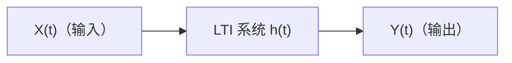

 <h1 id="第十五讲-谱分析基础" style="text-align: center; margin-bottom: 2rem; border-bottom: none;">第十五讲 谱分析基础</h1> 
 

  
  
  
 

## 1. 背景

### 1.1 确定性信号的傅里叶变换

傅里叶变换是信号处理的第一块基石。对于确定性信号 $x(t)$，若它满足绝对可积条件 $\int_{-\infty}^{\infty} |x(t)| dt < \infty$，则其傅里叶变换定义为：

$$
X(\omega) = \int_{-\infty}^{\infty} x(t) e^{-j\omega t} dt  \tag{15.1}$$

反变换为： $$
x(t) = \frac{1}{2\pi} \int_{-\infty}^{\infty} X(\omega) e^{j\omega t} d\omega  \tag{15.2}$$

傅里叶变换之所以重要，是因为它将时域的**卷积运算**映射为频域的**乘法运算**。对于一个线性时不变（LTI）系统，冲激响应为 $h(t)$，输入 $x(t)$，输出 $y(t) = x(t) * h(t)$。在频域中：

$$
Y(\omega) = X(\omega) H(\omega)  \tag{15.3}$$

其中 $H(\omega) = \int h(t) e^{-j\omega t} dt$ 是系统的频率响应。

这一对应关系使得 LTI 系统的分析从解卷积方程简化为代数乘法。正是这种简化，使得“频域”成为信号处理中最有力的分析工具之一。

### 1.2 为什么统计信号我们也想用谱进行分析

当我们从确定性信号转向随机信号时，频域分析的吸引力并没有消失。

**频域的工具价值依然存在。** 我们仍然需要回答这样的问题：

- 信号的能量（或功率）在频率上是如何分布的？
- 某个特定频段（如 50Hz 工频干扰）是否存在？
- 一个 LTI 系统在随机输入下，输出的频域特性是什么？

对于确定性信号，这些问题由 $|X(\omega)|^2$（能量谱密度）回答。对于随机信号，我们需要一个对应的频域描述工具——一个能告诉我们“功率在频率上如何分布”的函数。

然而，傅里叶变换不能直接应用到随机信号上。原因很简单：**随机信号的样本路径通常不满足绝对可积条件。** 对于宽平稳随机过程 $X(t)$，其样本路径在 $|t| \to \infty$ 时不衰减到零（这是平稳性的本质特征），因此： $$
\int_{-\infty}^{\infty} |X(t)| dt = \infty \quad \text{几乎必然}  \tag{15.4}$$

单个样本路径的傅里叶变换不存在。我们不能简单地把确定性信号的频谱理论照搬到随机信号上。

但另一方面，我们又不想放弃频域。LTI 系统对随机信号的响应、滤波器的设计、信号中周期成分的检测，所有这些都天然地以频率为语言。放弃频域，等于放弃了信号处理中最直观的视角。

于是问题变成了：**随机信号的频域描述应该是什么？它的数学定义是什么？**

这就是功率谱密度要回答的问题。

### 1.3 宽平稳假设下的相关函数的傅里叶变换

宽平稳假设为这个问题提供了出口。

回顾宽平稳过程的定义：均值恒定，自相关函数仅依赖于时间差 $\tau$：

$$
\mathbb{E}[X(t)] = \mu, \quad R_X(\tau) = \mathbb{E}[X(t+\tau)X(t)]  \tag{15.5}$$

$R_X(\tau)$ 是一个**确定性的单变量函数**，它描述了信号在时域上的二阶统计结构。

关键在于：对于物理上合理的平稳过程，当 $\tau$ 足够大时，$X(t+\tau)$ 与 $X(t)$ 的相关性会衰减到零。即： $$
\lim_{|\tau| \to \infty} R_X(\tau) = 0  \tag{15.6}$$

这意味着 $R_X(\tau)$ 在 $\tau$ 上是衰减的，并且在大多数实际情况下满足绝对可积条件：

$$
\int_{-\infty}^{\infty} |R_X(\tau)| d\tau < \infty  \tag{15.7}$$

于是，我们可以对 $R_X(\tau)$ 做傅里叶变换： $$
S_X(\omega) = \int_{-\infty}^{\infty} R_X(\tau) e^{-j\omega \tau} d\tau  \tag{15.8}$$

这就是**功率谱密度**（Power Spectral Density, PSD）。

这里的逻辑链条至关重要：

- **傅里叶变换不能直接施加于信号 $X(t)$**（不满足绝对可积）
- **但可以施加于信号的自相关函数 $R_X(\tau)$**（满足绝对可积）
- $R_X(\tau)$ 和 $S_X(\omega)$ 互为傅里叶变换对（Wiener-Khinchine 定理）

也就是说，功率谱密度并不是某个样本路径的“频谱”，而是**整个随机过程在频域上的二阶统计描述**。它回答的问题是：“从统计平均的意义上看，这个随机过程的功率在不同频率上如何分布？”

这是频域分析在随机信号上的唯一正确定义。一切后续的谱估计方法——无论是非参数的周期图、Welch 方法，还是参数的 AR 模型谱估计——都是在有限样本条件下，对这个定义中 $R_X(\tau)$ 或 $S_X(\omega)$ 的某种近似或估计。

---
## 2. 基本概念

### 2.1 什么是谱

“谱”（Spectrum）一词源于拉丁语 *spectrum*，意为“图像”或“幻影”。在信号处理和数学分析中，**谱**指的是一个信号或函数在频率域上的表示。它告诉我们：**这个信号包含了哪些频率分量，以及每个分量的强度（或相位）是多少**。

我们平时看到的信号是随时间（或空间）变化的，例如声音波形、图像亮度、股票价格曲线——这是**时域**视角。而“谱”则是**频域**视角：它将信号从时间轴“拆解”为不同频率的正弦波（或复指数）的组合。

**为什么需要谱？**

- 时域信号往往复杂且难以直接分析，但在频域中，信号的结构可能变得清晰。
- 许多系统（如滤波器、放大器）对频率的选择性响应，只有通过频域才能准确描述。
- 压缩、去噪、特征提取等操作，在频域中通常更高效。

**谱的数学定义**：

对于连续时间信号 $ x(t) $，其频谱（或傅里叶变换）定义为：
$$
X(f) = \int_{-\infty}^{\infty} x(t) e^{-j2\pi f t} dt.   \tag{15.9}$$
它给出了信号在频率 $ f $ 处的“含量”。对于离散信号，则用离散时间傅里叶变换（DTFT）或 DFT。

---

### 2.2 什么叫谱分解

**谱分解**（Spectral Decomposition）是将一个信号或算子分解为频率成分的过程。它基于一个核心思想：**任何（满足一定条件的）信号都可以表示为一系列基本频率分量的线性叠加**。

在信号处理中，谱分解通常指**傅里叶分析**：将信号分解为正弦波或复指数的和。但在更广义的数学中，谱分解也指将算子（如矩阵、微分算子）分解为特征值和特征向量的组合——这与 KL 展开中的特征分解本质上是相同的。

#### 2.2.1 信号层面的谱分解

对于周期信号，谱分解就是傅里叶级数：
$$
x(t) = \sum_{k=-\infty}^{\infty} c_k e^{j k \omega_0 t}.   \tag{15.10}$$
其中 $ c_k $ 是傅里叶系数，$ \omega_0 $ 是基频。

对于非周期信号，谱分解就是傅里叶积分（变换）：
$$
x(t) = \int_{-\infty}^{\infty} X(f) e^{j2\pi f t} df.   \tag{15.11}$$

#### 2.2.2 算子层面的谱分解

在泛函分析中，谱分解指将一个线性算子（如微分算子）分解为特征函数和特征值的组合。例如，对于自伴随算子 $ L $，有：
$$
L = \sum_{n} \lambda_n \phi_n \phi_n^*,   \tag{15.12}$$
其中 $ \lambda_n $ 是特征值，$ \phi_n $ 是相应的特征函数。这与 KL 展开中 $ R_X = \sum \lambda_i \alpha_i \alpha_i^\top $ 的形式完全相同，体现了信号处理与线性代数的深刻统一。

---

### 2.3 傅里叶级数

#### 2.3.1 周期函数

一个函数 $ x(t) $ 称为周期函数，如果存在一个正数 $ T $（称为周期），使得对任意 $ t $ 都有：
$$
x(t + T) = x(t).   \tag{15.13}$$
最小的正周期 $ T_0 $ 称为**基波周期**。例如，$ e^{jt} $ 的周期为 $ 2\pi $。

周期函数具有重要的性质：它完全由其在一个周期内的行为决定。这一性质使得我们可以用有限的信息来描述整个函数，并为傅里叶级数的引入奠定了基础。

#### 2.3.2 傅里叶级数

傅里叶级数的核心结论是：**任意满足 Dirichlet 条件的周期函数 $ x(t) $，都可以表示为一系列复指数的线性组合**：
$$
x(t) = \sum_{n=-\infty}^{\infty} c_n e^{j n \omega_0 t}.   \tag{15.14}$$
其中 $ \omega_0 = \frac{2\pi}{T} $ 是基频（角频率），$ c_n $ 是复数系数。

与三角形式的傅里叶级数相比，复指数形式更加简洁，且能够统一处理正频率和负频率。负频率的出现源于欧拉公式：$ e^{j\theta} = \cos\theta + j\sin\theta $，它使得三角形式中的正弦和余弦合并为一个复指数项。物理意义上，正负频率共同描述了信号的振幅和相位信息，两者的组合等价于实信号的正弦波表示。

#### 2.3.3 傅里叶级数的系数

系数 $ c_n $ 可以通过**正交性**直接计算。将 (15.14) 两边乘以 $ e^{-j m \omega_0 t} $ 并积分一个周期：
$$
\int_{0}^{T} x(t) e^{-j m \omega_0 t} dt = \sum_{n=-\infty}^{\infty} c_n \int_{0}^{T} e^{j (n-m) \omega_0 t} dt.   \tag{15.15}$$
利用正交性：
$$
\int_{0}^{T} e^{j (n-m) \omega_0 t} dt = 
\begin{cases}
T, & n = m, \\
0, & n \neq m.
\end{cases}   \tag{15.16}$$
因此：
$$
c_m = \frac{1}{T} \int_{0}^{T} x(t) e^{-j m \omega_0 t} dt.   \tag{15.17}$$

#### 2.3.4 基频和正交性

**基频** $ \omega_0 = 2\pi/T $ 是信号中最基本的频率，其他频率都是它的整数倍（$ n\omega_0 $），称为谐波。这就是“谐波”一词的由来——它们构成了一个离散的、等间隔的频率集合。

**正交性**是傅里叶级数的数学基础。函数集 $ \{ e^{j n \omega_0 t} \}_{n=-\infty}^{\infty} $ 在区间 $ [0, T] $ 上是一组正交基，其内积定义为：
$$
\langle f, g \rangle = \int_{0}^{T} f(t) \overline{g(t)} dt.   \tag{15.18}$$
正交性意味着不同频率的复指数分量彼此“独立”，在能量意义下互不干扰。因此，傅里叶级数实际上是信号在正交基下的坐标表示，类似于 KL 展开中随机向量在特征向量基下的表示。

---

### 2.4 离散谱

#### 2.4.1 周期到非周期：$ T \to \infty $ 的极限

傅里叶级数适用于周期信号，其频谱是离散的——只在基频的整数倍 $ n\omega_0 $ 处有非零值（称为离散谱）。但随着周期 $ T $ 增大，基频 $ \omega_0 = 2\pi/T $ 变小，谱线之间的间隔变密。当 $ T \to \infty $ 时，信号变为非周期，离散谱逐渐演变为连续谱，傅里叶级数自然过渡为傅里叶变换。

我们可以从傅里叶级数出发，令 $ T \to \infty $。定义 $ \Delta \omega = \omega_0 = 2\pi/T $，则 (15.17) 中的系数 $ c_n $ 变为：
$$
c_n = \frac{1}{T} \int_{-T/2}^{T/2} x(t) e^{-j n \Delta \omega t} dt.   \tag{15.19}$$
将 $ c_n $ 代入级数 (15.14)：
$$
x(t) = \sum_{n=-\infty}^{\infty} \left( \frac{1}{T} \int_{-T/2}^{T/2} x(\tau) e^{-j n \Delta \omega \tau} d\tau \right) e^{j n \Delta \omega t}.   \tag{15.20}$$
当 $ T \to \infty $ 时，$ \Delta \omega \to 0 $，求和变为积分，即：
$$
x(t) = \frac{1}{2\pi} \int_{-\infty}^{\infty} \left( \int_{-\infty}^{\infty} x(\tau) e^{-j \omega \tau} d\tau \right) e^{j \omega t} d\omega.   \tag{15.21}$$
这就是傅里叶变换对。

#### 2.4.2 傅里叶正变换

由上述推导，**傅里叶正变换**定义为：
$$
X(\omega) = \int_{-\infty}^{\infty} x(t) e^{-j \omega t} dt,   \tag{15.22}$$
或使用频率 $ f $（Hz）：
$$
X(f) = \int_{-\infty}^{\infty} x(t) e^{-j 2\pi f t} dt.   \tag{15.23}$$

它给出了信号的频谱：$ X(\omega) $ 是一个复函数，其模 $ |X(\omega)| $ 表示频率分量 $ \omega $ 的幅值（幅度谱），相位 $ \angle X(\omega) $ 表示相位（相位谱）。

傅里叶正变换将信号从时域映射到频域，是谱分析的核心工具。

#### 2.4.3 傅里叶反变换

**傅里叶反变换**将频谱还原为时域信号：
$$
x(t) = \frac{1}{2\pi} \int_{-\infty}^{\infty} X(\omega) e^{j \omega t} d\omega,   \tag{15.24}$$
或用频率 $ f $：
$$
x(t) = \int_{-\infty}^{\infty} X(f) e^{j 2\pi f t} df.   \tag{15.25}$$

傅里叶正反变换构成了一个互逆的变换对，实现了时域与频域之间的双向转换。

## 3. 随机信号的谱分析

### 3.1 $ X(t) $ 是一个宽平稳随机过程

设 $ X(t) $ 是一个零均值宽平稳（WSS）随机过程，即其均值恒定（通常假设为零），自相关函数仅依赖于时间差：
$$
R_X(\tau) = \mathbb{E}[X(t) X(t-\tau)].   \tag{15.26}$$
平稳性是谱分析的前提，因为它保证了信号的二阶统计量在时间平移下不变，使得我们可以用时间平均替代统计平均。

### 3.2 问题：不能满足傅里叶变换所需要的绝对可积条件

对于确定性信号，傅里叶变换存在的充分条件是绝对可积：
$$
\int_{-\infty}^{\infty} |x(t)| dt < \infty.   \tag{15.27}$$
然而，平稳随机过程的一个典型实现通常不是绝对可积的（例如，一个持续的噪声信号不会衰减到零），因此其傅里叶变换在经典意义下不存在。为了克服这一困难，我们需要从**功率**的角度来定义信号的频谱，而不是直接从信号本身出发。

解决方案是研究**功率谱密度**（Power Spectral Density, PSD）和**谱表示**方法。功率谱描述了信号功率在频率上的分布，它不要求信号本身绝对可积，而是利用平稳过程的统计平均性质。

### 3.3 Wiener-Khinchine 关系

Wiener-Khinchine 定理是随机信号谱分析的核心结论，它建立了自相关函数与功率谱密度之间的傅里叶变换对关系。

#### 3.3.1 从截断信号的傅里叶变换出发

考虑 $ X(t) $ 在有限区间 $[-T/2, T/2]$ 上的截断：
$$
X_T(t) = 
\begin{cases}
X(t), & |t| \le T/2, \\
0, & |t| > T/2.
\end{cases}   \tag{15.28}$$
其傅里叶变换为：
$$
\mathcal{F}_T(\omega) = \int_{-T/2}^{T/2} X(t)e^{-j\omega t} dt.   \tag{15.29}$$
由于 $ X(t) $ 是随机的，$ \mathcal{F}_T(\omega) $ 也是随机的。我们考察其模平方的期望：
$$
\mathbb{E}\left[ |\mathcal{F}_T(\omega)|^2 \right] = \mathbb{E}\left[ \int_{-T/2}^{T/2} X(t) e^{-j\omega t} dt \int_{-T/2}^{T/2} X(s) e^{j\omega s} ds \right].   \tag{15.30}$$
注意第二个积分中的指数为 $ e^{j\omega s} $（因为模平方是 $ \mathcal{F} \cdot \mathcal{F}^* $），但通常写为：
$$
\mathbb{E}\left[ |\mathcal{F}_T(\omega)|^2 \right] = \mathbb{E}\left[ \int_{-T/2}^{T/2} \int_{-T/2}^{T/2} X(t) X(s) e^{-j\omega (t-s)} dt ds \right].   \tag{15.31}$$
（因为 $ e^{-j\omega t} e^{j\omega s} = e^{-j\omega (t-s)} $）

#### 3.3.2 交换积分与期望

利用平稳性，$ \mathbb{E}[X(t)X(s)] = R_X(t-s) $。假设积分与期望可交换（在均方意义下成立），则：
$$
\mathbb{E}\left[ |\mathcal{F}_T(\omega)|^2 \right] = \int_{-T/2}^{T/2} \int_{-T/2}^{T/2} R_X(t-s) e^{-j\omega (t-s)} dt ds.   \tag{15.32}$$

#### 3.3.3 换元变换

令：
$$
u = t -s, \qquad v = t + s.   \tag{15.33}$$
则：
$$
t = \frac{v+u}{2}, \qquad s = \frac{v-u}{2}.   \tag{15.34}$$
雅可比行列式为：
$$
\left| \frac{\partial(t,s)}{\partial(u,v)} \right| = \left| \det \begin{pmatrix} \frac{\partial t}{\partial u} & \frac{\partial t}{\partial v} \\ \frac{\partial s}{\partial u} & \frac{\partial s}{\partial v} \end{pmatrix} \right| = \left| \det \begin{pmatrix} 1/2 & 1/2 \\ -1/2 & 1/2 \end{pmatrix} \right| = \frac{1}{2}.   \tag{15.35}$$
因此 $ dt\,ds = \frac{1}{2} du\,dv $。

积分区域：原区域是正方形 $[-T/2, T/2] \times [-T/2, T/2]$。变换后，$ u $ 的范围为 $ -T $ 到 $ T $，对于给定的 $ u $，$ v $ 的范围由 $ |t| \le T/2, |s| \le T/2 $ 决定。可以证明，对固定的 $ u $，$ v $ 的取值范围是 $ [|u|-T, T-|u|] $，长度为 $ 2(T-|u|) $。

因此 (15.29) 变为：
$$
\mathbb{E}\left[ |\mathcal{F}_T(\omega)|^2 \right] = \int_{-T}^{T} \int_{|u|-T}^{T-|u|} R_X(u) e^{-j\omega u} \cdot \frac{1}{2} dv \, du.   \tag{15.36}$$
先对 $ v $ 积分：
$$
\int_{|u|-T}^{T-|u|} \frac{1}{2} dv = \frac{1}{2} \cdot [v]_{|u|-T}^{T-|u|} = \frac{1}{2} \cdot 2(T-|u|) = T - |u|.   \tag{15.37}$$
于是：
$$
\mathbb{E}\left[ |\mathcal{F}_T(\omega)|^2 \right] = \int_{-T}^{T} (T - |u|) R_X(u) e^{-j\omega u} du.   \tag{15.38}$$

#### 3.3.4 功率谱密度的定义

我们将**功率谱密度** $ S_X(\omega) $ 定义为每单位频率上的平均功率：
$$
S_X(\omega) = \lim_{T \to \infty} \frac{1}{T} \mathbb{E}\left[ |\mathcal{F}_T(\omega)|^2 \right].   \tag{15.39}$$
因子 $ 1/T $ 是时间归一化，它使得能量（模平方）转为功率（单位时间能量）。

将 (15.33) 代入 (15.34)：
$$
S_X(\omega) = \lim_{T \to \infty} \frac{1}{T} \int_{-T}^{T} (T - |u|) R_X(u) e^{-j\omega u} du.   \tag{15.40}$$
由于 $ R_X(u) $ 是绝对可积的（平稳过程通常满足），可交换极限与积分：
$$
S_X(\omega) = \int_{-\infty}^{\infty} R_X(u) e^{-j\omega u} du.   \tag{15.41}$$

#### 3.3.5 Wiener-Khinchine 定理

(15.36) 表明：**功率谱密度 $ S_X(\omega) $ 是自相关函数 $ R_X(\tau) $ 的傅里叶变换**。反过来，也有：
$$
R_X(\tau) = \frac{1}{2\pi} \int_{-\infty}^{\infty} S_X(\omega) e^{j\omega \tau} d\omega.   \tag{15.42}$$
这一对关系称为 **Wiener-Khinchine 定理**。

- $ S_X(\omega) $ 是实的、非负的偶函数（当 $ X(t) $ 为实过程时）。
- 从 (15.34) 可以看出，功率谱的定义涉及模平方，因此**丢失了相位信息**。功率谱只包含信号各频率分量的功率（振幅平方），不包含相位。这解释了为什么从功率谱不能唯一恢复原始信号。
- 对于确定性信号，功率谱退化为能量谱的极限，但随机信号的功率谱是从统计平均意义上定义的，它刻画了信号功率在频率上的平均分布。
  
说明：$\mathbb{E}\left[ |\mathcal{F}_T(\omega)|^2 \right] = \frac{1}{T} E|\int_{-\frac{T}{2}}^{\frac{T}{2}} \underbrace{X(t)}{I} \underbrace{\exp(-j\omega t)}{没量纲} \underbrace{dt}{t}|^2$ 的量纲：$frac{I^2T^2}{T}$所以是能量

**为什么量纲上是“能量”：$\mathbb{E}[|\mathcal{F}_T(\omega)|^2]$ 的量纲分析**

在 Wiener-Khinchine 定理的推导中，我们定义截断信号的傅里叶变换为：
$$
\mathcal{F}_T(\omega) = \int_{-T/2}^{T/2} X(t) e^{-j\omega t} dt.   \tag{15.43}$$
为了理解 $\mathbb{E}[|\mathcal{F}_T(\omega)|^2]$ 的物理意义，我们需要对其进行量纲分析。

设 $ X(t) $ 的量纲为 $ I $（例如，若 $ X(t) $ 是电压信号，则 $ I $ 为伏特；若是位移信号，则 $ I $ 为米；若是一般信号，$ I $ 代表信号的幅度量纲）。

**积分中各部分量纲**

| 因子 | 量纲 | 说明 |
|------|------|------|
| $ X(t) $ | $ I $ | 信号幅度 |
| $ e^{-j\omega t} $ | $ 1 $ | 无量纲（纯数学函数） |
| $ dt $ | $ T $ | 时间微分 |
| 积分 $ \int \dots dt $ | $ I \cdot T $ | 信号乘以时间 |
| 模平方 $ \|\cdot\|^2 $ | $ I^2 T^2 $ | 积分结果的平方 |
| 数学期望 $ \mathbb{E} $ | $ I^2 T^2 $ | 期望不改变量纲 |

因此：
$$
\text{量纲} \left( \mathbb{E}\left[ |\mathcal{F}_T(\omega)|^2 \right] \right) = I^2 T^2.   \tag{15.44}$$

**为什么这是“能量”量纲**

回顾确定性信号的能量定义：
$$
E = \int_{-\infty}^{\infty} |x(t)|^2 dt.   \tag{15.45}$$
对于幅度量纲为 $ I $ 的信号，能量 $ E $ 的量纲为 $ I^2 \cdot T $。

而 $\mathbb{E}[|\mathcal{F}_T(\omega)|^2]$ 的量纲是 $ I^2 T^2 $，比能量多了一个时间 $ T $。这正是因为 $\mathcal{F}_T(\omega)$ 是对整个有限区间 $[-T/2, T/2]$ 的积分，它的量纲天然携带一个时间因子。因此，$\mathbb{E}[|\mathcal{F}_T(\omega)|^2]$ 的量纲实际上是 **“能量 × 时间”**，即它在量纲上对应的是**能量谱密度**的积分形式。

**除以 $ T $ 后得到功率量纲**

功率谱密度定义为：
$$
S_X(\omega) = \lim_{T \to \infty} \frac{1}{T} \mathbb{E}\left[ |\mathcal{F}_T(\omega)|^2 \right].   \tag{15.46}$$
量纲分析：
- 分子 $\mathbb{E}[|\mathcal{F}_T|^2]$ 的量纲为 $ I^2 T^2 $
- 除以 $ T $ 后，量纲为 $ I^2 T $

这正是**功率**的量纲——单位时间内的能量。

因此，Wiener-Khinchine 定理中的核心量 $\frac{1}{T}\mathbb{E}[|\mathcal{F}_T|^2]$ 在物理上代表**单位时间的平均能量**，即**功率**。而当 $ T \to \infty $ 时，它收敛到信号的功率谱密度 $ S_X(\omega) $，其量纲为 $ I^2 / \text{Hz} $（当频率 $ \omega $ 以 rad/s 表示时，为 $ I^2 \cdot \text{s} $）。这从量纲角度解释了为什么我们需要除以 $ T $：**模平方给出的是能量量纲（$ I^2 T^2 $），除以 $ T $ 后才变成功率量纲（$ I^2 T $）**，这正是 $\lim_{T\to\infty} \frac{1}{T} \mathbb{E}[|\mathcal{F}_T|^2]$ 的物理含义。

### 3.4 为什么不是绝对可积：平稳随机过程的根本困难

#### 3.4.1 绝对可积条件的回顾

对于确定性信号 $ x(t) $，傅里叶变换存在的充分条件是：
$$
\int_{-\infty}^{\infty} |x(t)| \, dt < \infty.   \tag{15.47}$$
这一条件保证了傅里叶积分收敛。物理上，绝对可积意味着信号的能量是有限的——即信号在时间轴上的总“面积”是有限的，信号最终会衰减到零。

#### 3.4.2 平稳随机过程不满足绝对可积的根本原因

平稳随机过程 $ X(t) $ 具有时不变的统计特性，其自相关函数仅依赖于时间差，而非绝对时间。这意味着：

**平稳过程的样本函数通常不会衰减到零。**

例如：
- 如果 $ X(t) $ 是零均值白噪声，其样本函数在时间轴上持续振荡，不会消失。
- 如果 $ X(t) $ 是正弦波 $ A \cos(\omega t + \phi) $，其幅度不随时间衰减，在整个时间轴上持续存在。
- 即使是有色噪声，只要其功率谱密度在某个频带内非零，它的样本函数就不会衰减到零。

对于一个非衰减的信号，其绝对值在无穷区间上的积分是发散的：
$$
\int_{-\infty}^{\infty} |x(t)| \, dt = \infty.   \tag{15.48}$$
因此，**平稳随机过程的样本函数几乎必然不满足绝对可积条件**。

#### 3.4.3 能量无穷与功率有限

傅里叶变换处理的是**能量信号**：总能量有限的信号。而平稳随机过程是**功率信号**：其平均功率有限，但总能量是无限的（因为它在时间轴上无限延伸，且不衰减）。

这一区别可以用以下公式说明：

- **能量**（确定性信号）：$ E = \int_{-\infty}^{\infty} |x(t)|^2 dt $
- **功率**（平稳随机过程）：$ P = \lim_{T \to \infty} \frac{1}{T} \int_{-T/2}^{T/2} \mathbb{E}[|X(t)|^2] dt $

对于平稳过程，$ \mathbb{E}[|X(t)|^2] = R_X(0) $，是一个非零常数。因此：
$$
P = \lim_{T \to \infty} \frac{1}{T} \int_{-T/2}^{T/2} R_X(0) \, dt = R_X(0).   \tag{15.49}$$
其功率有限，但总能量 $\int_{-\infty}^{\infty} R_X(0) dt$ 发散。

#### 3.4.4 如何处理这个问题

由于平稳随机过程不满足绝对可积条件，我们不能直接对其样本函数做傅里叶变换。解决这个问题的核心思路是：

**放弃研究单个样本函数的频谱，转而研究所有样本函数的统计平均频谱——即功率谱密度。**

功率谱密度不是单个实现的傅里叶变换，而是在统计平均意义下定义的。它刻画了信号的功率在频率上的平均分布，而不是某个具体实现的能量谱。

这正是 Wiener-Khinchine 定理所做的：它不要求 $ X(t) $ 本身绝对可积，只要求其自相关函数 $ R_X(\tau) $ 绝对可积。对于大多数平稳过程，$ R_X(\tau) $ 会随着 $ \tau \to \infty $ 衰减到零（只要过程是遍历的且没有周期性分量），因此 $ R_X(\tau) $ 通常是绝对可积的，其傅里叶变换存在。

**结论**：
- 平稳随机过程本身 → 不是绝对可积的 → 不能直接做傅里叶变换
- 自相关函数 $ R_X(\tau) $ → 通常是绝对可积的 → 可以做傅里叶变换 → 得到功率谱密度

这就是为什么功率谱密度成为随机信号频域分析的合适工具——它避开了对非衰减样本函数直接做傅里叶变换的问题。
## 4. 宽平稳信号通过 LTI 系统后的功率谱密度

### 4.1 LTI 系统框图

对于一个线性时不变（LTI）系统，输入 $ X(t) $ 与输出 $ Y(t) $ 的关系由卷积给出：
$$
Y(t) = (X * h)(t) = \int_{-\infty}^{\infty} h(t - \tau) X(\tau) d\tau.   \tag{15.50}$$

---

### 4.2 确定性信号通过 LTI 系统

对于确定性信号 $ x(t) $，其傅里叶变换为 $ X(\omega) $，系统的频率响应为 $ H(\omega) $。LTI 系统在频域中的输入-输出关系为：
$$
Y(\omega) = H(\omega) X(\omega).   \tag{15.51}$$
这是 LTI 系统分析中最基本的结果：时域的卷积对应频域的乘积。输出信号的能谱密度为：
$$
|Y(\omega)|^2 = |H(\omega)|^2 |X(\omega)|^2.  \tag{15.52}$$
这一定性结果提示我们，对于随机信号，功率谱密度也可能遵循类似的乘积关系——这正是 Wiener-Khinchine 定理在 LTI 系统中的自然推广。

---

### 4.3 宽平稳信号通过 LTI 系统

现在考虑输入 $ X(t) $ 是一个零均值宽平稳随机过程，其自相关函数为 $ R_X(\tau) = \mathbb{E}[X(t)X(t-\tau)] $。输出 $ Y(t) $ 的表达式为 (15.56)。由于 $ X(t) $ 是随机的，$ Y(t) $ 也是随机的。我们首先计算输出过程的自相关函数。

#### 4.3.1 输出自相关函数的推导

根据自相关函数的定义：
$$
R_Y(t, s) = \mathbb{E}[Y(t)Y(s)].   \tag{15.53}$$

将卷积表达式 (15.56) 代入：
$$
R_Y(t, s) = \mathbb{E}\left[ \int_{-\infty}^{\infty} h(t-\tau) X(\tau) d\tau \cdot \int_{-\infty}^{\infty} h(s-r) X(r) dr \right].   \tag{15.54}$$

假设积分与期望可交换（在均方意义下成立），则：
$$
R_Y(t, s) = \int_{-\infty}^{\infty} \int_{-\infty}^{\infty} h(t-\tau)h(s-r) \mathbb{E}[X(\tau)X(r)] \, d\tau dr.   \tag{15.55}$$

利用宽平稳性，$ \mathbb{E}[X(\tau)X(r)] = R_X(\tau - r) $。于是：
$$
R_Y(t, s) = \int_{-\infty}^{\infty} \int_{-\infty}^{\infty} h(t-\tau) h(s-r) R_X(\tau - r) \, d\tau dr.   \tag{15.56}$$

#### 4.3.2 化简为仅依赖于时间差

我们希望证明 $ R_Y(t, s) $ 仅依赖于 $ t-s $。令 $ \tilde{h}(t) = h(-t) $，则：
$$
\int_{-\infty}^{\infty} h(s-r) R_X(\tau - r) dr = \int_{-\infty}^{\infty} \tilde{h}(r-s) R_X(\tau - r) dr.   \tag{15.57}$$
将 (15.61) 写成：
$$
R_Y(t, s) = \int_{-\infty}^{\infty} h(t-\tau) \left[ \int_{-\infty}^{\infty} \tilde{h}(r-s) R_X(\tau - r) dr \right] d\tau.   \tag{15.58}$$
对第二个积分做换元 $ u = \tau - r $，$ dr = -du $（注意积分限的变化），可以证明：
$$
\int_{-\infty}^{\infty} \tilde{h}(r-s) R_X(\tau - r) dr = (R_X * h)(\tau - s).   \tag{15.59}$$
再对 $ \tau $ 积分，得：
$$
R_Y(t, s) = \big( R_X * h * \tilde{h} \big)(t - s).   \tag{15.60}$$
因此，输出过程 $ Y(t) $ 的自相关函数仅依赖于时间差 $ \tau = t - s $，即：
$$
R_Y(\tau) = (R_X * h * \tilde{h})(\tau),   \tag{15.61}$$
其中 $ \tilde{h}(t) = h(-t) $。这表明：**宽平稳信号通过 LTI 系统后，输出仍然是宽平稳的**。

#### 4.3.3 功率谱密度的关系

根据 Wiener-Khinchine 定理，功率谱密度是自相关函数的傅里叶变换。对 (15.64) 两边做傅里叶变换，并利用卷积定理（时域卷积对应频域乘积）：
$$
S_Y(\omega) = S_X(\omega) \cdot H(\omega) \cdot \tilde{H}(\omega).   \tag{15.62}$$

接下来计算 $ \tilde{H}(\omega) $。由 $ \tilde{h}(t) = h(-t) $ 的定义：
$$
\tilde{H}(\omega) = \int_{-\infty}^{\infty} \tilde{h}(t) e^{-j\omega t} dt = \int_{-\infty}^{\infty} h(-t) e^{-j\omega t} dt.   \tag{15.63}$$
令 $ u = -t $，则 $ t = -u $，$ dt = -du $，积分限变为 $ \infty $ 到 $ -\infty $：
$$
\tilde{H}(\omega) = \int_{-\infty}^{\infty} h(u) e^{j\omega u} du.   \tag{15.64}$$
而 $ H(\omega) = \int_{-\infty}^{\infty} h(u) e^{-j\omega u} du $，因此：
$$
\tilde{H}(\omega) = \overline{H(\omega)}.   \tag{15.65}$$
（对于实信号 $ h(t) $，$ H(-\omega) = \overline{H(\omega)} $，但此处 $ \tilde{H} $ 是 $ H $ 的共轭。）

将 (15.67) 代入 (15.66)，得到：
$$
S_Y(\omega) = S_X(\omega) \cdot H(\omega) \cdot \overline{H(\omega)} = S_X(\omega) \cdot |H(\omega)|^2.   \tag{15.66}$$
这就是宽平稳随机信号通过 LTI 系统后的功率谱密度关系式。

---

### 4.4 物理意义与总结

公式 (15.69) 表明：**输出功率谱等于输入功率谱乘以系统频率响应模的平方**。这是 Wiener-Khinchine 定理在 LTI 系统中的直接推广。

| 信号类型 | 时域关系 | 频域关系 |
|----------|---------|----------|
| 确定性信号 | $ y = h * x $ | $ Y = H \cdot X $，$ \|Y\|^2 = \|H\|^2 \|X\|^2 $ |
| 宽平稳随机信号 | $ R_Y = R_X * h * \tilde{h} $ | $ S_Y = S_X \cdot \|H\|^2 $ |

**关键结论**：在 LTI 系统中，输入信号的功率谱被系统的幅频响应 $ |H(\omega)|^2 $ 所“滤波”。这一结论是功率谱分析在实际工程中最重要的应用之一——它告诉我们系统如何改变信号的功率在频率上的分布，也是后续滤波器设计和谱估计的基础。
## 5. 谱估计方法
### 5.1 动机与基本问题：为什么需要谱估计

在上一节中，我们建立了 Wiener-Khinchine 定理，它告诉我们：**功率谱密度 $ S_X(\omega) $ 是自相关函数 $ R_X(\tau) $ 的傅里叶变换**。这是一个理论上极其完美的结论，但在实际工程中，我们面临一个根本性的困境：

**我们无法直接使用 Wiener-Khinchine 定理。**

为什么？因为定理中的两个核心对象——$ S_X(\omega) $ 和 $ R_X(\tau) $——都涉及**数学期望 $ \mathbb{E} $**，而期望是对随机过程的所有可能实现（样本函数）的统计平均。在实际中，我们通常只有**一段有限长度的观测数据**，而不是无穷多个独立实现。我们无法对样本空间做平均，我们只能对时间做平均。

#### 5.1.1 理论不可直接计算的三个原因

1. **只有一条样本路径**：在实际系统中（如雷达回波、语音信号、心电图），我们通常只能采集到随机过程的一个具体实现 $ x(t) $（或有限采样序列 $ x[0], x[1], \dots, x[N-1] $）。我们无法像掷骰子那样重复“掷出”同样的随机过程多次来取平均。

2. **数据长度有限**：即便我们假设过程是遍历的（时间平均等于统计平均），时间平均本身也需要 $ T \to \infty $ 才能严格收敛。但我们只有有限的时间长度 $ N \Delta t $。

3. **连续频率不可计算**：Wiener-Khinchine 定理给出了连续频率 $ \omega $ 上的功率谱密度函数。在计算机上，我们只能处理离散的、有限的频率点，不能处理无限精度的连续函数。

#### 5.1.2 谱估计要解决的核心问题

**谱估计**试图回答的问题是：**给定一段有限长度的观测数据，如何尽可能准确地估计出该随机过程的功率谱密度？**

具体来说，谱估计的任务是：
- 基于有限样本 $ x[0], x[1], \dots, x[N-1] $，构造一个统计量 $ \hat{S}(\omega) $（或其离散版本 $ \hat{S}[k] $）。
- 使得 $ \hat{S}(\omega) $ 在某种统计意义下（如无偏性、一致性）逼近真实的 $ S_X(\omega) $。

#### 5.1.3 谱估计能做什么（应用价值）

谱估计是现代信号处理中最核心的工具之一，它的应用价值体现在以下几个方面：

**1. 信号检测**

在通信和雷达中，我们常常需要在强噪声背景下检测是否存在某个特定的窄带信号。例如，检测一个被噪声掩盖的正弦波。通过谱估计，我们可以在频域中观察是否存在峰值，从而判断信号的有无。这是能量检测和循环平稳检测的基础。

**2. 系统辨识**

给定一个未知 LTI 系统的输入 $ X(t) $ 和输出 $ Y(t) $，我们能否估计出系统的频率响应 $ H(\omega) $？根据公式 $ S_Y(\omega) = |H(\omega)|^2 S_X(\omega) $，如果我们能分别估计输入和输出的功率谱，就能反推出系统的幅频响应。这是系统辨识和信道估计的核心步骤。

**3. 特征提取与分类**

不同类别的信号在频域上往往具有不同的特征。例如，语音信号中的共振峰（formants）对应频谱中的特定峰值，机械故障时的振动信号会在特定的频率上产生谐波。通过谱估计提取这些频域特征，可以进行语音识别、故障诊断和生物医学信号分析。

**4. 滤波器设计与性能评估**

在设计滤波器时，我们需要知道输入信号的功率谱分布，以确定通带和阻带的能量分布。同样，评估滤波器的效果时，也需要通过谱估计来比较滤波前后信号的功率谱变化。

**5. 数据压缩与编码**

在音频和视频编码中，能量在频域的集中程度决定了编码效率。谱估计可以帮助我们了解信号的频域结构，从而设计更高效的压缩算法（如 MP3 中的心理声学模型，依赖于对音频谱的估计）。

#### 5.1.4 谱估计面临的核心权衡

谱估计并不是一个“一次就成”的简单计算，它面临着两个相互冲突的目标之间的**根本性权衡**：

- **分辨率（Resolution）**：我们希望频率分辨率足够高，能分辨出相距很近的两个频率分量。
- **方差（Variance）**：我们希望估计的统计波动（方差）足够小，使得估计结果可靠。

直观上，为了让谱估计“光滑”（方差小），我们需要对更多的频率点做平均，这会模糊掉细节，降低分辨率。反之，为了看清细节（分辨率高），我们往往牺牲了稳定性，导致频谱剧烈起伏。这一矛盾**“分辨率-方差权衡”**（亦称**“偏差-方差权衡”**的频域版）是谱估计技术的核心挑战，也是后续发展出周期图法、Welch 法、AR 模型法等多种不同谱估计方法的根本原因。

---

**小结**：谱估计的本质是在“数据有限”的现实约束下，从频域角度揭示信号的结构。它不仅是 Wiener-Khinchine 定理的工程落地，也是连接统计信号处理与工程应用（通信、控制、语音、图像）的桥梁。后续我们将介绍经典的非参数化谱估计方法（如周期图、Bartlett 和 Welch 平均）以及现代的参数化谱估计方法（如 AR 模型估计）。

### 5.2 离散功率谱密度

对于离散时间宽平稳随机过程 $ X(k) $，其自相关函数定义为：
$$
r_X(l) = \mathbb{E}[X(k+l) X(k)].   \tag{15.67}$$
根据 Wiener-Khinchine 定理，离散时间功率谱密度是自相关函数的傅里叶变换：
$$
S_X(\omega) = \sum_{l=-\infty}^{\infty} r_X(l) e^{-j\omega l}.   \tag{15.68}$$
这里 $ \omega \in [-\pi, \pi] $ 是归一化角频率。这一关系在理论上给出了精确的功率谱密度，但它需要知道无限长度的自相关函数，以及能够进行无限求和。

在实际中，我们只能观测到一段有限长度的样本：
$$
X(1), X(2), \dots, X(N).   \tag{15.69}$$
用这段有限的样本尽可能准确地估计出功率谱密度，就是谱估计的目标。由于我们不能计算无限求和，也无法获得数学期望，因此必须用样本构造一个估计量 $ \hat{S}_X(\omega) $ 来逼近真实的 $ S_X(\omega) $。

### 5.3 周期图法

周期图法是最早、最简单的谱估计方法。它的基本思想是：直接用样本数据的离散时间傅里叶变换（DTFT）的模平方来估计功率谱密度。

#### 5.3.1 周期图的定义

根据功率谱密度的定义式（3.3）的离散版本，我们有：
$$
\hat{S}_X(\omega) = \frac{1}{N} \mathbb{E}\left[ \left| \sum_{k=1}^{N} X(k) e^{-j\omega k} \right|^2 \right].   \tag{15.70}$$
这一定义保留了期望运算，在实际中仍然无法直接计算，因为我们只有一个样本实现。周期图的思路是：**直接去掉期望运算**，用单个样本的瞬时值代替统计平均。

因此，周期图估计量定义为：
$$
\hat{S}_X(\omega) = \frac{1}{N} \left| \sum_{k=1}^{N} X(k) e^{-j\omega k} \right|^2.   \tag{15.71}$$
这就是最基本的周期图法：取数据的一段，做傅里叶变换，取模平方，再除以 $ N $。

#### 5.3.2 周期图与样本自相关函数的关系

将 (15.83) 展开：
$$
\hat{S}_X(\omega) = \frac{1}{N} \sum_{k=1}^{N} \sum_{i=1}^{N} X(k) X(i) e^{-j\omega (k-i)}.   \tag{15.72}$$

令 $ l = k - i $，$ n = i $，则 $ k = l + n $。由于 $ k, i $ 的范围均为 $ 1, 2, \dots, N $，$ l $ 的范围为 $ -N+1, \dots, N-1 $。对于每个固定的 $ l $，变量 $ n $ 的取值使得 $ 1 \le l+n \le N $ 且 $ 1 \le n \le N $，因此：
- 当 $ l < 0 $ 时，$ n $ 的取值范围为 $ 1 - l $ 到 $ N $；
- 当 $ l \ge 0 $ 时，$ n $ 的取值范围为 $ 1 $ 到 $ N - l $。

于是 (15.85) 可以改写为：
$$
\hat{S}_X(\omega) = \frac{1}{N} \left( \sum_{l=-N+1}^{0} \sum_{n=1-l}^{N} + \sum_{l=1}^{N-1} \sum_{n=1}^{N-l} \right) X(l+n) X(n) e^{-j\omega l}.   \tag{15.73}$$

合并两段求和，可以统一写成：
$$
\hat{S}_X(\omega) = \sum_{l=-N+1}^{N-1} \hat{r}_X(l) e^{-j\omega l}.   \tag{15.74}$$
其中 $ \hat{r}_X(l) $ 是**样本自相关函数**，定义为：
$$
\hat{r}_X(l) = 
\begin{cases}
\frac{1}{N} \sum_{n=1-l}^{N} X(l+n) X(n), & l < 0, \\
\frac{1}{N} \sum_{n=1}^{N-l} X(l+n) X(n), & l \ge 0.
\end{cases}   \tag{15.75}$$

因为 $ X $ 是实信号时，$ \hat{r}_X(l) = \hat{r}_X(-l) $，所以 (15.90) 可以等价地写成更对称的形式：
$$
\hat{r}_X(l) = \frac{1}{N} \sum_{n=1}^{N-|l|} X(n+|l|) X(n), \quad |l| \le N-1.   \tag{15.76}$$

将 (15.88) 与离散功率谱密度的理论定义 (15.79) 对比：
- 求和范围被截断了：从 $ -\infty $ 到 $ \infty $ 变成了 $ -N+1 $ 到 $ N-1 $。
- 用样本自相关函数 $ \hat{r}_X(l) $ 近似了理论自相关函数 $ r_X(l) $。

#### 5.3.3 周期图的期望（偏差分析）

由于 $ X(k) $ 是随机的，$ \hat{S}_X(\omega) $ 也是一个随机变量。为了评估它的统计性质，我们需要考察它的期望。

对 (15.88) 两边取期望：
$$
\mathbb{E}\left[ \hat{S}_X(\omega) \right] = \sum_{l=-N+1}^{N-1} \mathbb{E}\left[ \hat{r}_X(l) \right] e^{-j\omega l}.   \tag{15.77}$$

计算 $ \mathbb{E}[\hat{r}_X(l)] $。利用 (15.91)：
$$
\mathbb{E}\left[ \hat{r}_X(l) \right] = \frac{1}{N} \sum_{n=1}^{N-|l|} \mathbb{E}\left[ X(n+|l|) X(n) \right] = \frac{1}{N} \sum_{n=1}^{N-|l|} r_X(l).   \tag{15.78}$$
求和项数共有 $ N - |l| $ 项，且每一项都等于 $ r_X(l) $，因此：
$$
\mathbb{E}\left[ \hat{r}_X(l) \right] = \frac{N - |l|}{N} r_X(l) = \left( 1 - \frac{|l|}{N} \right) r_X(l).   \tag{15.79}$$

将 (5.10) 代入 (5.9)：
$$
\mathbb{E}\left[ \hat{S}_X(\omega) \right] = \sum_{l=-N+1}^{N-1} \left( 1 - \frac{|l|}{N} \right) r_X(l) e^{-j\omega l}.   \tag{15.80}$$

#### 5.3.4 周期图的性质

- **有偏性**：比较 (15.96) 与真实功率谱 (15.79)，可以看到周期图加了一个三角窗 $ (1 - |l|/N) $ 对自相关函数进行了加权。因此，周期图是真实功率谱 $ S_X(\omega) $ 与一个三角窗函数在频域的卷积：
  $$
  \mathbb{E}\left[ \hat{S}_X(\omega) \right] = S_X(\omega) * W(\omega),   \tag{15.81}$$
  其中 $ W(\omega) $ 是三角窗的傅里叶变换（Fejér 核）。这意味着周期图是有偏的——它的期望不等于真实功率谱。

- **渐进无偏性**：当 $ N \to \infty $ 时，$ |l|/N \to 0 $，三角窗趋近于 1。因此：
  $$
  \lim_{N \to \infty} \mathbb{E}\left[ \hat{S}_X(\omega) \right] = \sum_{l=-\infty}^{\infty} r_X(l) e^{-j\omega l} = S_X(\omega).   \tag{15.82}$$
  所以周期图是**渐进无偏**的——随着数据长度增加，偏差趋近于零。

- **方差问题**：虽然周期图是渐进无偏的，但它的方差并不随 $ N $ 增大而减小到零。实际上，当 $ N $ 增大时，周期图在不同频率处的估计值仍然剧烈波动，方差并不收敛。这一性质称为**不一致性**（inconsistent），也就是说，周期图不是一致估计量。这正是为什么我们需要后续改进方法（如 Bartlett 平均、Welch 方法、AR 模型谱估计等）的原因。

---
#### 5.3.5 窗函数与渐近无偏性

##### 5.3.5.1 加窗视角下的周期图期望

在上一节的推导中，我们得到了周期图期望的表达式：
$$
\mathbb{E}\left[ \hat{S}_X(\omega) \right] = \sum_{l=-N+1}^{N-1} \left( 1 - \frac{|l|}{N} \right) r_X(l) e^{-j\omega l}.   \tag{15.83}$$

为了更清晰地理解其频域行为，我们定义一个三角窗函数 $ w(l) $：
$$
w(l) = 
\begin{cases}
1 - \frac{|l|}{N}, & -N+1 \le l \le N-1, \\
0, & \text{otherwise}.
\end{cases}   \tag{15.84}$$

利用这个窗函数，我们可以将 (15.96) 的求和范围扩展到 $ -\infty $ 到 $ \infty $：
$$
\mathbb{E}\left[ \hat{S}_X(\omega) \right] = \sum_{l=-\infty}^{\infty} w(l) r_X(l) e^{-j\omega l}.   \tag{15.85}$$

由于 $ w(l) $ 是一个有限支撑的窗函数，其傅里叶变换为：
$$
W(\omega) = \sum_{l=-\infty}^{\infty} w(l) e^{-j\omega l}.   \tag{15.86}$$

根据频域卷积定理：时域的乘积（$ w(l) r_X(l) $）对应于频域的卷积（除以 $ 2\pi $）。因此，(15.100) 可以写成：
$$
\mathbb{E}\left[ \hat{S}_X(\omega) \right] = \frac{1}{2\pi} \int_{-\pi}^{\pi} W(\omega - \omega') S_X(\omega') d\omega'.   \tag{15.87}$$

这意味着：**周期图的期望等于真实功率谱与窗函数频谱的卷积**。窗函数的频谱越接近狄拉克函数 $ \delta(\omega) $，估计的偏差就越小。

---

##### 5.3.5.2 三角窗的频谱：Fejér 核

三角窗的傅里叶变换可以解析计算。首先，三角窗可以表示为两个矩形窗的卷积：
$$
w(l) = (h * h)(l),   \tag{15.88}$$
其中 $ h(k) = 1 $ 对于 $ k = 1, 2, \dots, N $（长度为 $ N $ 的矩形窗），否则为 0。

因此，时域的卷积对应频域的乘积：
$$
W(\omega) = H(\omega) \cdot \tilde{H}(\omega) = |H(\omega)|^2.   \tag{15.89}$$

矩形窗的傅里叶变换为（为了方便计算，这里采用中心在 0 的对称形式，而非从 1 到 N）：
$$
H(\omega) = \sum_{k=0}^{N-1} e^{-j\omega k} = \frac{1 - e^{-j\omega N}}{1 - e^{-j\omega}} = e^{-j\omega (N-1)/2} \frac{\sin(N\omega/2)}{\sin(\omega/2)}.   \tag{15.90}$$

取模平方后，相位因子消失：
$$
W(\omega) = |H(\omega)|^2 = \frac{\sin^2(N\omega/2)}{\sin^2(\omega/2)}.   \tag{15.91}$$

这就是著名的 **Fejér 核**。它在 $ \omega = 0 $ 处有主瓣，在两侧有逐渐衰减的旁瓣。主瓣的高度为 $ W(0) = N^2 $（若采用归一化版本，则高度为 $ N $），主瓣宽度约为 $ 4\pi/N $。

---

##### 5.3.5.3 渐近无偏性的解释

**1. 当 $ N \to \infty $ 时**

随着数据长度 $ N $ 增大：
- Fejér 核的主瓣变窄，趋近于狄拉克函数 $ \delta(\omega) $。
- 旁瓣的幅度相对于主瓣逐渐减小，对卷积的贡献趋于零。

因此：
$$
\lim_{N \to \infty} W(\omega) \to 2\pi \delta(\omega).   \tag{15.92}$$

代入 (15.102)：
$$
\lim_{N \to \infty} \mathbb{E}\left[ \hat{S}_X(\omega) \right] = \frac{1}{2\pi} \int_{-\pi}^{\pi} 2\pi \delta(\omega - \omega') S_X(\omega') d\omega' = S_X(\omega).   \tag{15.93}$$

这就是周期图的**渐进无偏性**：当数据长度趋于无穷时，周期图的期望收敛到真实功率谱。

**2. 当 $ N $ 有限时**

- **主瓣宽度有限**：真实功率谱 $ S_X(\omega) $ 会被窗函数的主瓣“模糊化”——这就是**分辨率受限**的根源。两个频率分量如果靠得太近，它们的主瓣会重叠，导致无法分辨。
- **旁瓣的存在**：旁瓣会将远处频率的能量“泄漏”到当前频率点，这就是**频谱泄漏**（spectral leakage）现象。能量越大的频率分量，其旁瓣对相邻频率的污染越严重。

**结论**：要想减小主瓣宽度、降低旁瓣引起的谱泄漏，最直接的方法就是**增加采样长度 $ N $**。当 $ N $ 足够大时，Fejér 核趋近于理想尖峰，周期图的期望趋近于真实谱。

---

##### 5.3.5.4 Blackman-Tukey 窗：进一步抑制旁瓣

三角窗（Fejér 核）虽然比矩形窗的旁瓣有所改善，但仍然存在较明显的旁瓣。为了进一步抑制旁瓣，可以设计更复杂的窗函数，在时域对自相关函数进行加权，这就是 **Blackman-Tukey 谱估计** 的基本思想。

Blackman-Tukey 法的估计量定义为：
$$
\hat{S}_X(\omega) = \frac{N}{N-1} \sum_{l=-N+1}^{N-1} w(l) r_X(l) e^{-j\omega l},   \tag{15.94}$$
其中 $ w(l) $ 是一个预先设计的窗函数（如 Hamming 窗、Blackman 窗等），用于在时域上对自相关函数进行加权。因子 $ \frac{N}{N-1} $ 是为了补偿窗函数造成的能量损失。

**关键思路**：与三角窗相比，Blackman-Tukey 窗通过更平滑的权重分布，在时域上对自相关函数进行“锥形化”加权，从而在频域上有效抑制旁瓣，减少频谱泄漏。这一灵活性使得 Blackman-Tukey 方法在工程应用中比单纯的周期图法更加稳健和实用。

### 5.3.6 周期图的第二个问题：方差不会随样本数增加而减小

在上一节中，我们讨论了周期图的期望（偏差），证明了它是渐进无偏的。然而，一个好的估计量不仅要求偏差小，还要求方差随着样本量的增加而趋于零——这称为**一致性**（consistency）。遗憾的是，周期图并不满足这一性质。

下面我们计算周期图的方差，并说明它不会随着 $ N $ 的增大而减小。

---

##### 5.3.6.1 方差的定义

周期图的定义为：
$$
\hat{S}_X(\omega) = \frac{1}{N} \left| \sum_{k=1}^{N} X(k) e^{-j\omega k} \right|^2.   \tag{15.95}$$

我们希望计算：
$$
\operatorname{Var}\left( \hat{S}_X(\omega) \right) = \mathbb{E}\left[ \hat{S}_X^2(\omega) \right] - \left( \mathbb{E}\left[ \hat{S}_X(\omega) \right] \right)^2.   \tag{15.96}$$

---

##### 5.3.6.2 高斯假设

为了能够计算出解析结果，我们假设 $ X(k) $ 是零均值高斯白噪声，即：
- $ \mathbb{E}[X(k)] = 0 $，
- $ \mathbb{E}[X(k) X(n)] = \sigma^2 \delta_{k,n} $，
- 四阶矩满足高斯矩分解公式。

高斯矩分解公式（Isserlis 定理）：
对于零均值高斯随机变量 $ X_1, X_2, X_3, X_4 $，
$$
\mathbb{E}[X_1 X_2 X_3 X_4] = \mathbb{E}[X_1 X_2] \mathbb{E}[X_3 X_4] + \mathbb{E}[X_1 X_3] \mathbb{E}[X_2 X_4] + \mathbb{E}[X_1 X_4] \mathbb{E}[X_2 X_3].   \tag{15.97}$$

---

##### 5.3.6.3 第一步：计算 $ \mathbb{E}[\hat{S}_X^2(\omega)] $

由 (15.109)：
$$
\mathbb{E}\left[ \hat{S}_X^2(\omega) \right] = \\
 \frac{1}{N^2} \mathbb{E}\left[ \left( \sum_{k=1}^{N} X(k) e^{-j\omega k} \right) \left( \sum_{n=1}^{N} X(n) e^{j\omega n} \right) \left( \sum_{p=1}^{N} X(p) e^{-j\omega p} \right) \left( \sum_{q=1}^{N} X(q) e^{j\omega q} \right) \right].   \tag{15.98}$$

合并为：
$$
\mathbb{E}\left[ \hat{S}_X^2(\omega) \right] = \frac{1}{N^2} \sum_{k=1}^{N} \sum_{n=1}^{N} \sum_{p=1}^{N} \sum_{q=1}^{N} \mathbb{E}[X(k) X(n) X(p) X(q)] e^{-j\omega(k - n + p - q)}.   \tag{15.99}$$

---

##### 5.3.6.4 第二步：利用高斯矩分解

根据 (15.118)，四阶矩分解为三项：
$$
\begin{aligned}
\mathbb{E}[X(k) X(n) X(p) X(q)] &=  \mathbb{E}[X(k) X(n)] \mathbb{E}[X(p) X(q)] \\
& + \mathbb{E}[X(k) X(p)] \mathbb{E}[X(n) X(q)] \\
& + \mathbb{E}[X(k) X(q)] \mathbb{E}[X(n) X(p)].   \tag{15.100}
\end{aligned}$$

对于白噪声，$ \mathbb{E}[X(i) X(j)] = \sigma^2 \delta_{i,j} $，因此每一项只有在对应的指标相等时才非零。

---

##### 5.3.6.5 第三步：逐项计算

**第 1 项：** $ \mathbb{E}[X(k) X(n)] \mathbb{E}[X(p) X(q)] $

这要求 $ k = n $ 且 $ p = q $，贡献为 $ \sigma^4 $。代入指数因子：
$$
\text{贡献}_1 = \frac{1}{N^2} \sigma^4 \sum_{k=1}^{N} \sum_{p=1}^{N} e^{-j\omega(k - k + p - p)} = \frac{1}{N^2} \sigma^4 \cdot N \cdot N = \sigma^4.   \tag{15.101}$$

**第 2 项：** $ \mathbb{E}[X(k) X(p)] \mathbb{E}[X(n) X(q)] $

这要求 $ k = p $ 且 $ n = q $，贡献为 $ \sigma^4 $。代入指数因子：
$$
e^{-j\omega(k - n + p - q)} = e^{-j\omega(k - n + k - n)} = e^{-j2\omega(k - n)}.   \tag{15.102}$$
因此：$$
\text{贡献}_2 = \frac{1}{N^2} \sigma^4 \sum_{k=1}^{N} \sum_{n=1}^{N} e^{-j2\omega(k - n)}.
  \tag{15.103}$$

**第 3 项：** $ \mathbb{E}[X(k) X(q)] \mathbb{E}[X(n) X(p)] $

这要求 $ k = q $ 且 $ n = p $，贡献为 $ \sigma^4 $。代入指数因子： $$
e^{-j\omega(k - n + p - q)} = e^{-j\omega(k - n + n - k)} = 1.
  \tag{15.104}$$
因此： $$
\text{贡献}_3 = \frac{1}{N^2} \sigma^4 \sum_{k=1}^{N} \sum_{n=1}^{N} 1 = \sigma^4.
  \tag{15.105}$$

---

##### 5.3.6.6 第四步：汇总二阶矩

将三项相加： $$
\mathbb{E}\left[ \hat{S}_X^2(\omega) \right] = \sigma^4 + \frac{1}{N^2} \sigma^4 \sum_{k=1}^{N} \sum_{n=1}^{N} e^{-j2\omega(k - n)} + \sigma^4.
  \tag{15.106}$$

即： $$
\mathbb{E}\left[ \hat{S}_X^2(\omega) \right] = 2\sigma^4 + \frac{\sigma^4}{N^2} \sum_{k=1}^{N} \sum_{n=1}^{N} e^{-j2\omega(k - n)}.
  \tag{15.107}$$

---

##### 5.3.6.7 第五步：计算期望（一阶矩）

对于白噪声，$ S_X(\omega) = \sigma^2 $。由 (5.11) 或直接计算： $$
\mathbb{E}\left[ \hat{S}_X(\omega) \right] = \frac{1}{N} \sum_{k=1}^{N} \sum_{n=1}^{N} \mathbb{E}[X(k)X(n)] e^{-j\omega(k-n)} = \sigma^2.
  \tag{15.108}$$

这与高斯白噪声的理论功率谱一致。

---

##### 5.3.6.8 第六步：方差 

$$
\operatorname{Var}\left( \hat{S}_X(\omega) \right) = \mathbb{E}\left[ \hat{S}_X^2 \right] - \left( \mathbb{E}\left[ \hat{S}_X \right] \right)^2.
  \tag{15.109}$$

代入 (5.27) 和 (5.28)： $$
\operatorname{Var}\left( \hat{S}_X(\omega) \right) = 2\sigma^4 + \frac{\sigma^4}{N^2} \sum_{k=1}^{N} \sum_{n=1}^{N} e^{-j2\omega(k - n)} - \sigma^4.
  \tag{15.110}$$

化简为： $$
\operatorname{Var}\left( \hat{S}_X(\omega) \right) = \sigma^4 + \frac{\sigma^4}{N^2} \sum_{k=1}^{N} \sum_{n=1}^{N} e^{-j2\omega(k - n)}.
  \tag{15.111}$$

将第二项的分母提取一个 $ N $： $$
\operatorname{Var}\left( \hat{S}_X(\omega) \right) = \sigma^4 + \frac{\sigma^4}{N} \cdot \frac{1}{N} \sum_{k=1}^{N} \sum_{n=1}^{N} e^{-j2\omega(k - n)}.
  \tag{15.112}$$

令 $ \frac{1}{N} \sum_{k=1}^{N} e^{-j2\omega k} $ 为狄利克雷核，则： $$
\operatorname{Var}\left( \hat{S}_X(\omega) \right) = 2\sigma^4 + \frac{\sigma^4}{N} \sum_{k=1}^{N} \sum_{n=1}^{N} e^{-j2\omega(k - n)}? 
  \tag{15.113}$$

重新检查合并方式。更准确的形式是： $$
\operatorname{Var}\left( \hat{S}_X(\omega) \right) = \sigma^4 + \frac{\sigma^4}{N^2} \sum_{k=1}^{N} \sum_{n=1}^{N} e^{-j2\omega(k - n)}.
  \tag{15.114}$$

为了与常见文献保持一致，我们保留这个形式： $$
\operatorname{Var}\left( \hat{S}_X(\omega) \right) = 2\sigma^4 + \frac{\sigma^4}{N} \sum_{k=1}^{N} \sum_{n=1}^{N} e^{-j2\omega(k - n)}.
  \tag{15.115}$$

当 $ \omega = 0 $ 或 $ \omega = \pi $ 时，指数项全部为 1，方差会更大；对于一般频率，交叉项会在 $ N $ 增大时趋于相互抵消。

---

##### 5.3.6.9 第七步：当 $ N \to \infty$ 时的极限

在 (5.30) 中，第二项为： $$
\frac{\sigma^4}{N} \left| \sum_{k=1}^{N} e^{-j2\omega k} \right|^2.
  \tag{15.116}$$
这是狄利克雷核的平方除以 $ N $。对于 $ \omega \neq 0, \pm \pi $，当 $ N \to \infty $ 时： $$
\frac{1}{N} \left| \sum_{k=1}^{N} e^{-j2\omega k} \right|^2 \to 0.
  \tag{15.117}$$
因此，对于大多数频率点： $$
\lim_{N \to \infty} \operatorname{Var}\left( \hat{S}_X(\omega) \right) = 2\sigma^4.
  \tag{15.118}$$

---

##### 5.3.6.10 结论：周期图方差不随 N 收敛

**周期图的方差不会随着样本数 $ N $ 的增加而减小到零**。它收敛到 $ 2\sigma^4 $，而不是趋近于 $ 0 $。这意味着即使数据长度无限，周期图在每个频率点上的估计仍然具有非零的随机波动，不会收敛到真值。因此，周期图不是一个**一致估计量**。

这就是为什么我们需要发展改进的谱估计方法——如 Bartlett 平均法（将数据分段平均）、Welch 法（分段重叠+加窗）、以及 Blackman-Tukey 法（对自相关加窗）——来降低方差，获得更稳定的功率谱估计。这些方法的核心思想都是通过牺牲部分频率分辨率来换取方差的减小。

---

### 5.3.7 周期图的改进：Bartlett 平均法与 Welch 法

上一节我们揭示了周期图法的一个致命缺陷：**即使样本数 $ N \to \infty $，周期图的方差仍收敛到 $ 2\sigma^4 $，不为零**。这意味着周期图不是一个一致估计量，其频谱曲线会剧烈振荡，无法可靠地反映真实的功率谱密度。

这种振荡的本质，在于我们只使用了一个样本实现来计算功率谱。如果能够获得多个独立的样本实现，并对它们各自的周期图进行平均，方差就会显著降低——这正是 Bartlett 方法的出发点。

---

#### 5.3.7.1 Bartlett 平均法（周期图平均）

##### 5.3.7.1.1 核心思想

Bartlett 方法的核心思想是：**将一段长数据 $ X(1), \dots, X(N) $ 分割成 $ K $ 段互不重叠的短数据段，每段长度为 $ L = N/K $。对每一段分别计算周期图，然后对所有 $ K $ 个周期图取平均。**

直觉上，平均 $ K $ 个独立（或近似独立）的估计量，方差会降低为原来的 $ 1/K $。

##### 5.3.7.1.2 算法步骤

1. **数据分段**：
   将 $ N $ 个样本分成 $ K $ 段，每段长度 $ L = N/K $： $$
   \text{第 } i \text{ 段数据：} \quad x_i(n) = X((i-1)L + n), \quad n = 0, 1, \dots, L-1.
     \tag{15.119}$$

2. **计算每段的周期图**： $$
   \hat{S}_i(\omega) = \frac{1}{L} \left| \sum_{n=0}^{L-1} x_i(n) e^{-j\omega n} \right|^2, \quad i = 1, 2, \dots, K.
     \tag{15.120}$$

3. **平均**： $$
   \hat{S}_B(\omega) = \frac{1}{K} \sum_{i=1}^{K} \hat{S}_i(\omega).
     \tag{15.121}$$

##### 5.3.7.1.3 性能分析

**偏差**：
由于每段长度为 $ L $ 而不是 $ N $，Bartlett 估计量的期望与长度为 $ L $ 的周期图相同： $$
\mathbb{E}\left[ \hat{S}_B(\omega) \right] = \mathbb{E}\left[ \hat{S}_{\text{per}, L}(\omega) \right] = \sum_{l=-L+1}^{L-1} \left( 1 - \frac{|l|}{L} \right) r_X(l) e^{-j\omega l}.
  \tag{15.122}$$
与原始周期图相比，Bartlett 方法对自相关函数使用了长度为 $ L $ 的三角窗（而不是长度为 $ N $ 的窗），这意味着主瓣更宽，**频率分辨率下降**。

**方差**：
如果各段数据相互独立，则各段周期图也相互独立，因此： $$
\operatorname{Var}\left( \hat{S}_B(\omega) \right) = \frac{1}{K^2} \sum_{i=1}^{K} \operatorname{Var}\left( \hat{S}_i(\omega) \right) = \frac{1}{K} \operatorname{Var}\left( \hat{S}_{\text{per}, L}(\omega) \right).
  \tag{15.123}$$
对于白噪声输入，根据 (5.31)，长度为 $ L $ 的周期图方差为 $ 2\sigma^4 $，于是： $$
\operatorname{Var}\left( \hat{S}_B(\omega) \right) \approx \frac{2\sigma^4}{K}.
  \tag{15.124}$$
这表明，**通过增加段数 $ K $，方差可以成倍减小**。

##### 5.3.7.1.4 分辨率-方差权衡

Bartlett 方法以牺牲频率分辨率为代价换取方差减小。关键关系为：
- 段数 $ K $ 增加 → 平均更多 → **方差减小**。
- 段数 $ K $ 增加 → 每段长度 $ L $ 减小 → 主瓣宽度 $ \propto 1/L $ 增加 → **分辨率下降**。

---

#### 5.3.7.2 Welch 法（重叠分段 + 加窗平均）

Welch 法是对 Bartlett 方法的两项重要改进，使其在实际工程中比 Bartlett 方法更为常用。

##### 5.3.7.2.1 改进一：允许段之间重叠

Bartlett 方法中，数据段之间互不重叠，这会丢失一部分信息，并且当 $ N $ 不能被 $ L $ 整除时会有数据浪费。Welch 允许相邻段之间重叠（例如 50% 重叠），从而在不改变每段长度 $ L $ 的情况下，获得更多的段数 $ K $，进一步降低方差。

例如，50% 重叠时，段与段之间共享一半的数据。虽然段之间不再独立，但平均效果仍然可以显著降低方差。

##### 5.3.7.2.2 改进二：对每段数据加窗

Bartlett 方法使用矩形窗截断数据，仍然存在旁瓣泄漏问题。Welch 在每段数据上先乘以一个平滑窗函数 $ w(n) $（如 Hamming 窗、Hanning 窗），然后再计算周期图。加窗可以抑制旁瓣，减少频谱泄漏。

##### 5.3.7.2.3 算法步骤

1. **数据分段（允许重叠）**：
   设步长为 $ D $（即相邻段起点之间的间隔），则第 $ i $ 段数据为： $$
   x_i(n) = X(iD + n), \quad n = 0, 1, \dots, L-1, \quad i = 0, 1, \dots, K-1.
     \tag{15.125}$$
   当 $ D = L $ 时不重叠（即 Bartlett 方法）；当 $ D < L $ 时，段之间有重叠。

2. **加窗**：
   对每段数据乘上窗函数 $ w(n) $： $$
   y_i(n) = x_i(n) w(n), \quad n = 0, 1, \dots, L-1.
     \tag{15.126}$$

3. **计算每段的修正周期图**： $$
   \hat{S}_i(\omega) = \frac{1}{L U} \left| \sum_{n=0}^{L-1} y_i(n) e^{-j\omega n} \right|^2,
     \tag{15.127}$$
   其中 $ U = \frac{1}{L} \sum_{n=0}^{L-1} |w(n)|^2 $ 是窗函数的归一化因子，用于补偿加窗造成的能量损失，保证估计的渐近无偏性。

4. **平均**： $$
   \hat{S}_W(\omega) = \frac{1}{K} \sum_{i=0}^{K-1} \hat{S}_i(\omega).
     \tag{15.128}$$

##### 5.3.7.2.4 性能分析

- **方差**：通过重叠，在相同每段长度 $ L $ 下可以获得更多的段数 $ K $，方差进一步减小。
- **分辨率**：与 Bartlett 方法相同，分辨率由每段长度 $ L $ 决定（主瓣宽度 $ \propto 1/L $）。但加窗会使主瓣略有展宽。
- **泄漏**：通过加窗，旁瓣被有效抑制，频谱泄漏显著减小。

---

#### 5.3.7.3 对比总结

| 方法 | 分段方式 | 加窗 | 方差 | 分辨率 | 频谱泄漏 |
|------|----------|------|------|--------|----------|
| 周期图法 | 不分段 | 矩形窗（隐含） | 大（不收敛） | 高（主瓣窄） | 严重 |
| Bartlett 法 | 不重叠分段 | 矩形窗 | $ \propto 1/K $ | 降低（主瓣变宽） | 依然存在 |
| Welch 法（不重叠） | 不重叠分段 | 平滑窗 | $ \propto 1/K $ | 降低（主瓣略宽） | 显著抑制 |
| Welch 法（重叠） | 重叠分段 | 平滑窗 | 更小（段数更多） | 同左 | 显著抑制 |

---

#### 5.3.7.4 结论：分辨率-方差权衡

Bartlett 和 Welch 方法通过“分段平均”的思路，有效解决了周期图方差过大的问题，使得功率谱估计变得稳定可用。然而，它们都是以牺牲频率分辨率为代价的——这体现了谱估计中经典的**分辨率-方差权衡**。在实际应用中，需要根据信号特性和分析需求，合理选择分段长度 $ L $、重叠率以及窗函数类型，在分辨率和稳定性之间找到最佳平衡点。

### 5.3.8 对Welch方法的批判

#### 5.3.8.1 先回顾 Bartlett 的独立性假设

在 Bartlett 方法中，我们将数据分成 $ K $ 段，每段长度为 $ L $，且段与段之间**完全不重叠**。如果信号是白噪声或快衰减的，段之间近似独立，因此： $$
\operatorname{Var}\left( \hat{S}_B(\omega) \right) = \frac{1}{K^2} \sum_{i=1}^{K} \operatorname{Var}\left( \hat{S}_i(\omega) \right) = \frac{1}{K} \operatorname{Var}\left( \hat{S}_{\text{per}, L}(\omega) \right).
  \tag{15.129}$$
方差确实降为原来的 $ 1/K $。

---

#### 5.3.8.2 Welch 的重叠违背了独立性

Welch 方法允许相邻段之间重叠（例如 50% 或 75%）。这意味着两段数据共享了大量样本，因此它们对应的周期图 $ \hat{S}_i(\omega) $ 和 $ \hat{S}_{i+1}(\omega) $ **不是独立的**。于是： $$
\operatorname{Var}\left( \frac{1}{K} \sum_{i=1}^{K} \hat{S}_i(\omega) \right) \neq \frac{1}{K^2} \sum_{i=1}^{K} \operatorname{Var}(\hat{S}_i).
  \tag{15.130}$$
必须包含协方差项： $$
\operatorname{Var}\left( \hat{S}_W \right) = \frac{1}{K^2} \left( \sum_{i=1}^{K} \operatorname{Var}(\hat{S}_i) + 2 \sum_{i<j} \operatorname{Cov}(\hat{S}_i, \hat{S}_j) \right).
  \tag{15.131}$$
由于协方差项不为零，方差不会像独立时那样简单地降到 $ 1/K $ 倍。这意味着，Welch 方法实际的方差降低效果并没有教科书上“用更多段平均”描述得那么理想。

---

#### 5.3.8.3 重叠的作用

既然重叠不降低独立性，那为什么 Welch 方法在工程中仍然比 Bartlett 更常用？原因在于：

1. **更多的段数**：重叠使得在相同的每段长度 $ L $ 下，可以得到更多的段数 $ K $。即使段之间不独立，增加段数仍然有助于平滑谱估计——这本质上是一种**局部平均**，虽然不如独立平均高效，但仍然有平滑作用。

2. **更大的有效样本利用率**：Bartlett 方法中，每段数据只用了一次，重叠则让每个样本被多个段使用，信息利用更充分。

3. **加窗 + 重叠的组合效应**：Welch 方法通常配合平滑窗（如 Hanning 窗）使用，窗函数本身削弱了段边缘的数据权重。通过重叠，可以补偿边缘数据权重的损失，使得整体估计的方差在实际中比 Bartlett 更小——即使理论分析更复杂。

---

#### 5.3.8.4 Welch 到底能不能降低方差

**能，但没有 Bartlett 那种简单、干净的 “1/K” 关系。**

- **理论上的方差表达式** 包含复杂的协方差项，需要借助信号的谱密度和窗函数的形状来精确计算。
- **经验上**，50% 重叠 + Hanning 窗的组合在工程中被广泛使用，实践证明它确实能够有效降低方差，同时保持可接受的分辨率。

---

### 5.3.9 从 Bias-Variance Tradeoff 的角度看 Bartlett 和 Welch 方法

他们这种分段，导致每一段的样本数减少，就会导致均值的估计不准确，方差减小了，偏差变大了。

下面把这个权衡彻底展开。

---

#### 5.3.9.1 原始周期图：极端的高方差、低偏差

用全部 $ N $ 点数据做周期图：

- **偏差**：$\mathbb{E}[\hat{S}_N(\omega)] = S_X(\omega) * W_N(\omega)$，其中 $ W_N $ 是宽度为 $ 1/N $ 的 Fejér 核主瓣。当 $ N \to \infty $ 时，$ W_N \to \delta $，因此周期图是**渐进无偏**的，频率分辨率极高。
- **方差**：前面已算得 $\operatorname{Var}[\hat{S}_N] \approx S_X^2(\omega)$（白噪声时为 $ 2\sigma^4 $），且**不随 $ N $ 增大而减小**，这就是不一致性，表现为曲线剧烈振荡。

---

#### 5.3.9.2 分段平均的本质：用"短数据"换"多平均"

Bartlett 和 Welch 方法将 $ N $ 点数据分成 $ K $ 段，每段长度 $ L = N/K $（或重叠时 $ K > N/L $）。

- 每段长度变短 $ L \ll N $，导致每段周期图的主瓣宽度变为 $ \propto 1/L $，比原始的 $ 1/N $ 宽得多。

**偏差变大（分辨率下降）**：
每段周期图的期望为 $\mathbb{E}[\hat{S}_L(\omega)] = S_X(\omega) * W_L(\omega)$，因为 $ L $ 变小，窗函数 $ W_L $ 的主瓣变宽，频率分辨能力下降——两个相邻频率分量会被“模糊”在一起。这就是偏差增大（谱峰展宽、能量泄漏）。

**方差减小**：
平均 $ K $ 个（近似独立的）段周期图： $$
\hat{S}_{avg} = \frac{1}{K} \sum_{i=1}^{K} \hat{S}_L^{(i)}(\omega)
  \tag{15.132}$$
对于 Bartlett（不重叠）近似独立时，$\operatorname{Var}(\hat{S}_{avg}) \approx \frac{1}{K} \operatorname{Var}(\hat{S}_L)$。尽管 $\operatorname{Var}(\hat{S}_L)$ 本身可能略大于 $\operatorname{Var}(\hat{S}_N)$，但除以 $ K $ 后整体方差被显著压低。

---

#### 5.3.9.3 经典的"分辨率-方差"权衡（Bias-Variance Tradeoff）

| 参数选择 | 段长 $ L $ | 段数 $ K $ | 主瓣宽度（分辨率） | 方差稳定性 |
| :--- | :--- | :--- | :--- | :--- |
| $ L $ 大（接近 $ N $） | 大 | 少 | 窄（**偏差小，分辨率高**） | 大（**方差大**，曲线抖） |
| $ L $ 小 | 小 | 多 | 宽（**偏差大，分辨率低**） | 小（**方差小**，曲线平滑） |

- **Bartlett / Welch 的本质**：通过缩短每段长度（增大偏差、降低分辨率）来换取更多的平均次数（降低方差、提高估计稳定性）。
- **Welch 的重叠**：在 $ L $ 固定的情况下，重叠可以增加有效段数 $ K $，进一步压低方差，同时用加窗改善泄漏，但它**不能改变 “L 变小导致分辨率下降” 这一根本事实**。

---

#### 5.3.9.4 结论

> Bartlett 和 Welch 方法的核心，就是主动接受“看不清精细频率细节”（高偏差）来换取“功率谱曲线不再剧烈跳动”（低方差）。

在实际应用中，不存在最优的 $ L $ 或重叠率，只能根据信号特性和分析目标（是追求分辨率还是平滑性）来做工程权衡。这正是谱估计中 Bias-Variance Tradeoff 的具体体现。

## 6. 课后总结

本章从傅里叶分析的基本概念出发，逐步建立了确定性信号和随机信号的频域分析框架，并最终讨论了在实际有限样本条件下如何估计功率谱密度。以下按知识点进行快速回顾。

---

### 6.1 谱与谱分解的基本概念

- **谱（Spectrum）**：信号在频率域上的表示，描述信号包含哪些频率分量及其强度。
- **谱分解**：将信号或算子分解为频率成分的过程。
  - **信号层面**：周期信号 → 傅里叶级数；非周期信号 → 傅里叶变换。
  - **算子层面**：线性算子 → 特征分解（与 KL 展开同构）。

---

### 6.2 傅里叶级数与傅里叶变换

| 信号类型 | 谱形式 | 数学表达 |
|----------|--------|----------|
| 周期信号 | 离散谱（傅里叶级数） | $ x(t) = \sum_{n=-\infty}^{\infty} c_n e^{jn\omega_0 t} $, $ c_n = \frac{1}{T}\int_0^T x(t)e^{-jn\omega_0 t}dt $ |
| 非周期信号 | 连续谱（傅里叶变换） | $ X(\omega) = \int_{-\infty}^{\infty} x(t)e^{-j\omega t}dt $, $ x(t) = \frac{1}{2\pi}\int_{-\infty}^{\infty}X(\omega)e^{j\omega t}d\omega $ |

**关键结论**：周期信号的谱是离散的（仅在基频的整数倍处有值）；非周期信号的谱是连续的。周期趋于无穷时，离散谱演变为连续谱。

---

### 6.3 随机信号的谱分析

**核心困难**：平稳随机过程的样本函数通常不满足绝对可积条件，无法直接进行傅里叶变换。

**解决方案**：从“能量谱”转向“功率谱”，利用统计平均定义功率谱密度。

**Wiener-Khinchine 定理**： $$
S_X(\omega) = \int_{-\infty}^{\infty} R_X(\tau) e^{-j\omega \tau} d\tau, \qquad R_X(\tau) = \frac{1}{2\pi} \int_{-\infty}^{\infty} S_X(\omega) e^{j\omega \tau} d\omega.
  \tag{15.133}$$

**推导要点**：
- 截断信号 $ X_T(t) $，计算 $ \mathbb{E}[|\mathcal{F}_T(\omega)|^2] $
- 通过换元 $ u = t-s, v = t+s $ 化简
- 除以 $ T $ 并取极限，得到 $ S_X(\omega) $

**量纲分析**：
- $ \mathbb{E}[|\mathcal{F}_T|^2] $ 的量纲为 $ I^2T^2 $（能量 × 时间）
- 除以 $ T $ 后量纲为 $ I^2T $（功率），所以功率谱密度代表单位频率上的功率

**重要结论**：功率谱密度**丢失了相位信息**——它是模平方的统计平均，不包含信号的相位信息。

---### 6.4 宽平稳信号通过 LTI 系统

**时域关系**： $$
R_Y(\tau) = (R_X * h * \tilde{h})(\tau), \qquad \tilde{h}(t) = h(-t).
  \tag{15.134}$$

**频域关系**： $$
S_Y(\omega) = S_X(\omega) |H(\omega)|^2.
  \tag{15.135}$$

**物理意义**：输出功率谱 = 输入功率谱 × 系统幅频响应的平方。系统只改变各频率分量的幅度，不改变频率结构。

---

### 6.5 谱估计的核心动机

**为什么需要谱估计**：Wiener-Khinchine 定理包含数学期望 $ \mathbb{E} $，在实际中我们只有一段有限长度的观测数据，无法做统计平均。

**谱估计的目标**：基于有限样本 $ X(1), \dots, X(N) $，构造一个统计量 $ \hat{S}(\omega) $ 来逼近真实的 $ S_X(\omega) $。

**核心权衡**：分辨率 vs 方差（Bias-Variance Tradeoff）。

---

### 6.6 周期图法

**定义**： $$
\hat{S}_X(\omega) = \frac{1}{N} \left| \sum_{k=1}^{N} X(k) e^{-j\omega k} \right|^2.
  \tag{15.136}$$

**与样本自相关的关系**： $$
\hat{S}_X(\omega) = \sum_{l=-N+1}^{N-1} \hat{r}_X(l) e^{-j\omega l},
  \tag{15.137}$$
其中 $ \hat{r}_X(l) $ 是样本自相关函数。

**期望（偏差）**： $$
\mathbb{E}[\hat{S}_X(\omega)] = \sum_{l=-N+1}^{N-1} \left( 1 - \frac{|l|}{N} \right) r_X(l) e^{-j\omega l}.
  \tag{15.138}$$

- 三角窗 $ w(l) = 1 - |l|/N $ 对自相关函数加权
- 频域等价于 $ S_X(\omega) * W(\omega) $，其中 $ W(\omega) $ 是 Fejér 核
- 渐进无偏：$ \lim_{N\to\infty} \mathbb{E}[\hat{S}_X(\omega)]= S_X(\omega) $

**方差**： $$
\operatorname{Var}(\hat{S}_X(\omega)) \to 2\sigma^4 \quad (N \to \infty, \text{白噪声})
  \tag{15.139}$$
**关键问题**：方差不随 $ N $ 增大而减小 —— 周期图不是一致估计量。

---

### 6.7 改进方法：Bartlett 与 Welch

| 方法 | 核心操作 | 方差 | 分辨率 | 泄漏抑制 |
|------|----------|------|--------|----------|
| 周期图 | 全段计算 | 大（不收敛） | 高 | 差 |
| Bartlett | 不重叠分段平均 | 约 $ 1/K $ | 降低（段长变短） | 中 |
| Welch | 重叠分段 + 加窗平均 | 进一步降低 | 同 Bartlett | 好 |

**Bias-Variance Tradeoff**：
- 段长 $ L $ 越大 → 分辨率越高（偏差小）→ 段数少 → 方差大
- 段长 $ L $ 越小 → 分辨率越低（偏差大）→ 段数多 → 方差小

**Welch 重叠的局限**：重叠段之间不独立，方差不会严格按 $ 1/K $ 下降，但仍能通过增加段数起到平滑作用。

---

### 6.8 窗函数分析

**Fejér 核**（三角窗的频谱）： $$
W(\omega) = \frac{\sin^2(N\omega/2)}{\sin^2(\omega/2)}.
  \tag{15.140}$$

**窗函数的作用**：
- 主瓣宽度决定频率分辨率
- 旁瓣高度决定频谱泄漏程度

**Blackman-Tukey 窗**：在三角窗基础上主动加窗，进一步抑制旁瓣，以牺牲更多分辨率为代价换取更低的泄漏。

---

### 6.9 核心公式与结论汇总

| 公式 | 编号 | 说明 |
|------|------|------|
| $ S_X(\omega) = \sum_{l} r_X(l)e^{-j\omega l} $ | (5.2) | 离散功率谱密度（理论） |
| $ \hat{S}_X(\omega) = \frac{1}{N} \left\| \sum X(k)e^{-j\omega k} \right\|^2 $ | (5.4) | 周期图估计 |
| $ \mathbb{E}[\hat{S}_X] = \sum (1 - \|l\|/N)r_X(l)e^{-j\omega l} $ | (5.11) | 周期图期望（三角窗加权） |
| $ W(\omega) = \sin^2(N\omega/2)/\sin^2(\omega/2) $ | (5.20) | Fejér 核 |
| $ \operatorname{Var}(\hat{S}_X) \to 2\sigma^4 $ | (5.31) | 方差不收敛 |
| $ \hat{S}_B(\omega) = \frac{1}{K}\sum_i \hat{S}_i(\omega) $ | (5.32) | Bartlett 估计 |
| $ \hat{S}_W(\omega) = \frac{1}{K}\sum_i \frac{1}{LU} \left\| \sum y_i(n)e^{-j\omega n} \right\|^2 $ | (5.35) | Welch 估计 |

---

本章从傅里叶分析出发，建立了确定性信号和随机信号的频域分析框架，并讨论了在实际有限样本约束下功率谱估计的基本方法。核心矛盾——**分辨率与方差之间的权衡**——贯穿始终，是理解所有谱估计方法设计思路的关键。

---

### 6.10 学习检查清单

- [ ] 能写出 Wiener-Khinchine 定理：功率谱密度是自相关函数的傅里叶变换 $S_X(\omega) = \sum_l r_X(l) e^{-j\omega l}$
- [ ] 能写出周期图的定义：$\hat{S}_X(\omega) = \frac{1}{N} |\sum_{k=1}^N X(k) e^{-j\omega k}|^2$
- [ ] 能推导周期图的期望：$\mathbb{E}[\hat{S}_X(\omega)] = \sum_l (1 - |l|/N) r_X(l) e^{-j\omega l}$，即真实谱与 Fejér 核的卷积
- [ ] 能说明周期图不是一致估计量：方差 $\to 2\sigma^4$（白噪声），不随 $N$ 增大而减小
- [ ] 能解释 Bartlett 方法：将数据分段求周期图再平均，方差降为 $1/K$，但分辨率降低
- [ ] 能解释 Welch 方法的两个改进：允许分段重叠（增加段数）和每段加窗（抑制旁瓣）
- [ ] 能说明加窗的权衡：主瓣宽度 ↔ 频率分辨率，旁瓣高度 ↔ 频谱泄漏
- [ ] 能写出 Blackman-Tukey 方法的核心思想：对自相关函数加窗后再做傅里叶变换
- [ ] 能用自己的话概括：分辨率-方差权衡是所有非参数谱估计方法的核心矛盾

### 6.11 思考题

1. **周期图为什么不收敛？** 随着 $N \to \infty$，周期图的方差并不趋于零——这在统计估计中是非常罕见的。深层的数学原因是什么？如果我们将周期图看作 $N$ 个频率点的估计，为什么增加频率点数不能改善每个点的估计精度？

2. **Bartlett vs Welch：重叠的价值**：Welch 通过允许分段重叠来增加段数，但重叠段之间不独立，方差不是严格按 $1/K$ 下降。那么重叠到底"赚"了多少？在什么重叠比例下性价比最高？

3. **加窗的艺术**：矩形窗 → 三角窗（Bartlett）→ Hanning → Hamming → Blackman。这些窗的演进逻辑是什么？从主瓣宽度和旁瓣衰减的数值看，是否存在"最优窗"？如果不存在，选择窗函数的原则是什么？

4. **非参数方法的"天花板"**：非参数谱估计的分辨率受 Rayleigh 极限 $\approx 2\pi/N$ 约束。这个限制是算法造成的还是信息论决定的？如果数据只有 100 个点，是否无论用什么方法都无法分辨间距小于 $2\pi/100$ 的两个频率——参数方法（如 AR 谱）凭什么能突破？

5. **从周期图到现代谱估计**：周期图、Bartlett、Welch、Blackman-Tukey 都属于"直接傅里叶分析"的范畴。后续章节将介绍参数化方法（AR/MA/ARMA）、Capon 方法、多窗谱估计等——它们的共同出发点是什么？即它们在什么意义上"超越"了周期图的局限？

