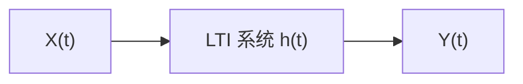

<div style="page-break-before: always; padding: 8% 8% 0 8%;">
 <h1 id="第十六讲-长球波函数" style="text-align: center; margin-bottom: 2rem; border-bottom: none;">第十六讲 长球波函数</h1> 
 <div style="display: flex; align-items: center; justify-content: center; gap: 12px; margin: 1.8rem auto;">
  <span style="flex:1; max-width:80px; height:1px; background: linear-gradient(to right, transparent, #888);"></span>
  <span style="display:inline-block; width:6px; height:6px; background:#38bdf8; border-radius:50%;"></span>
  <span style="flex:1; max-width:80px; height:1px; background: linear-gradient(to left, transparent, #888);"></span>
 </div>
</div>


## 1. 简介：从周期图到最优基函数

### 1.1 周期图法的固有局限

在上一章中，我们详细讨论了周期图法及其改进方法（Bartlett、Welch、Blackman-Tukey）在谱估计中的表现。这些方法的核心思想可以归结为：**用一个窗函数截断有限数据，计算其傅里叶变换的模平方，作为功率谱的估计**。

周期图法直接使用矩形窗，其估计量为：
$$
\hat{S}_X(\omega) = \frac{1}{N} \left| \sum_{k=1}^{N} X(k) e^{-j\omega k} \right|^2.   \tag{16.1}$$

我们知道，矩形窗在频域对应的核是 Fejér 核，其主瓣宽度约为 $ 4\pi/N $，旁瓣衰减缓慢（第一旁瓣仅约 -13 dB）。这意味着：
- **频率分辨率**受限于主瓣宽度：两个频率分量若间隔小于主瓣宽度，则无法分辨。
- **频谱泄漏**严重：旁瓣会将远处强信号的能量“泄漏”到当前频率点，掩盖弱信号。

为了改善旁瓣性能，我们引入各种平滑窗（三角窗、Hamming 窗、Blackman 窗等）。这些窗在时域对数据加权，使数据在两端平滑过渡，从而在频域压低旁瓣。然而，任何平滑窗都以**展宽主瓣**为代价，即**牺牲频率分辨率来换取旁瓣抑制**。于是我们始终在“主瓣宽度”和“旁瓣高度”之间进行无奈的折中——这是周期图法的根本困境。

### 1.2 从“启发式加窗”到“最优基函数”的思考

上述困境的根源在于：周期图法及其所有改进，都遵循同一个逻辑框架——**选择一个窗函数，然后计算截断数据的傅里叶变换**。无论窗函数如何设计，这个框架本身决定了我们只能在一个窗下工作，并且主瓣与旁瓣的权衡无法避免。

一个自然的问题随之产生：**是否存在一种“最优”的窗函数，能够在给定数据长度 $ N $ 和感兴趣的频带宽度 $ W $ 的条件下，使主瓣能量尽可能集中，同时旁瓣尽可能低？**

这个问题的答案并非唯一，但存在一组在数学上被证明为最优的函数——**长球波函数（Prolate Spheroidal Wave Functions, PSWF）**。它们由 Slepian、Landau 和 Pollak 于 1961 年提出，是**在给定时域和频域双重截断约束下，能量集中度达到最大的本征函数**。

### 1.3 长球波函数的核心思想：时频能量集中

考虑一个长度为 $ N $ 的离散信号 $ x[n] $，我们想将其限制在一个频带 $ |\omega| \leq W $ 内，同时使时域能量尽可能集中在 $ [0, N-1] $ 区间。直观上，理想的带限信号应在时域无限延伸，但实际中我们只能观察到有限长度。长球波函数解决了这个矛盾：**它们是离散时间、有限长度、且尽可能带限的那些序列**。

更精确地说，给定一个带宽 $ W $（归一化角频率），我们定义一组序列 $ v_k[n] $，使得它们：
1. 仅在 $ n = 0, 1, \dots, N-1 $ 上非零（时域有限）；
2. 其离散时间傅里叶变换（DTFT）的能量在 $ |\omega| \leq W $ 频带内的占比最大。

这个优化问题可以表述为：最大化
$$
\lambda = \frac{\int_{-W}^{W} |V(\omega)|^2 d\omega}{\int_{-\pi}^{\pi} |V(\omega)|^2 d\omega},   \tag{16.2}$$
其中 $ V(\omega) = \sum_{n=0}^{N-1} v[n] e^{-j\omega n} $。

**长球波函数正是这个变分问题的解**。它们对应的特征值 $ \lambda_0 \ge \lambda_1 \ge \dots \ge \lambda_{N-1} \ge 0 $ 给出了每个基函数在频带内的能量占比。前几个 $ \lambda_k $ 非常接近 1，意味着这些基函数的能量几乎全部集中在指定的频带内——这就是“最优能量集中”的含义。

### 1.4 与周期图法的直观对比：从“单个窗”到“多窗”

周期图法使用单个窗（如矩形窗或平滑窗）截断数据，得到一个谱估计。而长球波函数方法（即 Thomson 多窗谱估计）使用**一组相互正交的 PSWF 窗函数**，每个窗都能在给定带宽内实现最优能量集中。具体做法是：
- 对每一个 PSWF 窗 $ v_k[n] $，计算其傅里叶变换并取模平方，得到第 $ k $ 个“子谱”估计；
- 将这些子谱估计进行加权平均，得到最终的谱估计。

**核心优势在于**：
1. **每个窗都是最优的**（能量泄漏最小），因此单个子谱的分辨率已经优于传统窗。
2. **多个窗相互正交**，它们提供了数据中不同的“信息视角”，平均之后方差显著降低，且**不牺牲分辨率**——因为每个窗本身已经拥有最优的主瓣宽度。
3. **带宽 $ W $ 成为可调参数**，用户可以根据信号特性选择带宽，在分辨率和稳定性之间灵活权衡（但与传统方法不同，这种权衡是在最优基函数下进行的）。

### 1.5 周期图法与 PSWF 方法的对比总结

| 维度 | 周期图法（含平滑窗） | PSWF 方法（多窗谱估计） |
|------|---------------------|------------------------|
| 窗的来源 | 启发式设计（矩形、三角、Hamming 等） | 变分问题的精确解（最优能量集中） |
| 窗的数量 | 单个窗 | 多个正交窗 |
| 分辨率 | 受主瓣宽度限制，与窗函数相关 | 由带宽参数 $ W $ 控制，每个窗均为最优 |
| 方差控制 | 靠分段平均（牺牲分辨率） | 靠多个正交窗的平均（不牺牲分辨率） |
| 适用场景 | 平稳信号，对分辨率要求不高 | 对分辨率和稳定性均有较高要求的场景 |

### 1.6 本节的定位与后续内容

本节从周期图法的固有局限出发，引出了长球波函数的基本思想——**在时频域双重约束下寻找最优能量集中的基函数**。下一节我们将正式给出长球波函数的数学定义，并推导其与离散时间傅里叶变换的关系，建立其与特征值问题的联系。随后，我们将探讨 PSWF 的主要性质（正交性、特征值分布、与 Slepian 序列的关系），最后介绍多窗谱估计算法及其在实际中的应用。

理解长球波函数，就是理解**从“经验加窗”到“最优基函数展开”的范式跃迁**——这正是现代谱估计理论的重要基石。
## 2. 谱表示

### 2.1 KL展开

设数据为 $X = (X_1, \dots, X_n)^\top \in \mathbb{R}^n$，其中 $X_k$ 是随机变量。我们已知：
$$
\mathbb{E}(X_i X_j) = r_{ij} \neq 0,   \tag{16.3}$$
即各分量之间存在相关性。

我们的目标是：找一个映射 $g: \mathbb{R}^n \to \mathbb{R}^n$，$Y = g(X)$，使得变换后的分量能够**去除相关性**，即满足：
$$
\mathbb{E}(Y_i Y_j) = \mathbb{E}(g(X_i) g(X_j)) = r_i \delta_{ij} = 
\begin{cases}
r_i, & i = j, \\
0, & i \neq j.
\end{cases}   \tag{16.4}$$

这里我们限制 $g$ 为线性变换，即 $Y = AX$，其中 $A \in \mathbb{R}^{n \times n}$。于是问题转化为：找到一个矩阵 $A$，使得 $Y$ 的各分量不相关。

这个方程怎么求解？$n^2$ 个未知数，只有 $\frac{1}{2}n(n-1)$ 个方程（去相关约束），似乎欠定。但如果我们同时要求 $Y$ 的协方差矩阵是对角阵，问题就变得可解。

---

### 2.2 线性变换去相关

我们计算 $Y$ 的协方差矩阵：
$$
R_Y = \mathbb{E}(Y Y^\top) = \mathbb{E}(A X X^\top A^\top).   \tag{16.5}$$

由于 $A$ 是确定性矩阵，没有随机性，所以：
$$
R_Y = A \mathbb{E}(X X^\top) A^\top = A R_X A^\top,   \tag{16.6}$$
其中 $R_X = \mathbb{E}(X X^\top)$ 是自相关矩阵。

$R_X$ 是一个对称矩阵（因为 $r_{ij} = r_{ji}$），我们的目标是**对角化**它，即找到一个正交矩阵 $U$，使得：
$$
R_X = U \Lambda U^\top,   \tag{16.7}$$
其中 $\Lambda = \operatorname{diag}(\lambda_1, \dots, \lambda_n)$ 是特征值对角矩阵，$U = (u_1, \dots, u_n)$ 是特征向量矩阵，满足 $U^\top U = I$。

如果我们取 $A = U^\top$，则：
$$
R_Y = U^\top R_X U = U^\top (U \Lambda U^\top) U = \Lambda.   \tag{16.8}$$
因此 $Y = U^\top X$ 的协方差矩阵是 $\Lambda$，即 $Y$ 的各分量互不相关。

反过来，$X = U Y$，因为 $U$ 是正交矩阵（$U^\top U = I$，所以 $U^{-1} = U^\top$），于是：
$$
X = U Y = \sum_{k=1}^{n} u_k Y_k.   \tag{16.9}$$

**这是纯线性代数的角度**：通过特征分解将相关数据转化为互不相关的分量。

---

### 2.3 扩展到泛函空间：KL 展开

我们处理的是一个随机过程 $X(t)$，它是时间 $t$ 的函数，本质上是一个**无穷维**的随机对象。因此，我们需要将上面的有限维结果推广到泛函空间中。

KL 展开的形式为：
$$
X(t) = \sum_{k=1}^{\infty} \alpha_k \phi_k(t),   \tag{16.10}$$
其中 $\alpha_k$ 是**随机权重**，$\phi_k(t)$ 是**确定性基函数**。

这是一个**双正交展开**：
- 基函数之间正交：$\langle \phi_i, \phi_j \rangle = \int \phi_i(t) \phi_j(t) dt = \beta_i \delta_{ij}$；
- 权重之间不相关：$\mathbb{E}(\alpha_i \alpha_j) = \sigma_i \delta_{ij}$。

---

### 2.4 计算权重的互相关

假设 $\beta_i = \beta_j = 1$（即基函数已归一化），我们计算 $\mathbb{E}(\alpha_i \alpha_j)$。

由 (16.17) 中的定义，$\alpha_k = \int X(t) \phi_k(t) dt$（注意这里需要确认符号——通常 KL 展开中系数是 $\alpha_k = \int X(t) \phi_k(t) dt$，如果基函数是实的且正交归一，则这个关系成立），则：
$$
\mathbb{E}(\alpha_i \alpha_j) = \mathbb{E}\left[ \left( \int_I X(t) \phi_i(t) dt \right) \left( \int_I X(s) \phi_j(s) ds \right) \right].   \tag{16.11}$$

交换积分与期望：
$$
\mathbb{E}(\alpha_i \alpha_j) = \int_I \int_I \mathbb{E}[X(t) X(s)] \phi_i(t) \phi_j(s) dt ds.   \tag{16.12}$$

利用自相关函数 $R_X(t, s) = \mathbb{E}[X(t) X(s)]$，得：
$$
\mathbb{E}(\alpha_i \alpha_j) = \int_I \left( \int_I R_X(t, s) \phi_j(s) ds \right) \phi_i(t) dt.   \tag{16.13}$$

为了使 $\mathbb{E}(\alpha_i \alpha_j) = \delta_{ij}$，我们需要内层积分满足：
$$
\int_I R_X(t, s) \phi_j(s) ds = \lambda_j \phi_j(t).   \tag{16.14}$$

即 $\phi_j$ 必须是积分算子 $\int_I R_X(t, s) \cdot ds$ 的特征函数，$\lambda_j$ 是相应的特征值。

**这要求 $R_X(t, s)$ 是对称的**：$R_X(t, s) = R_X(s, t)$（对于实随机过程，自相关函数天然具有对称性）。

---

### 2.5 验证基函数的正交性（有限维类比）

我们先从纯线性代数的角度验证：特征向量是正交的。

假设：
$$
\begin{cases}
R \phi_i = \lambda_i \phi_i, \\
R \phi_j = \lambda_j \phi_j.
\end{cases}   \tag{16.15}$$

考虑内积 $\phi_i^\top \phi_j$：
$$
\phi_i^\top \phi_j = \frac{1}{\lambda_j} \phi_i^\top R \phi_j.   \tag{16.16}$$

因为 $R$ 是对称的，$\phi_i^\top R \phi_j$ 是一个标量，其转置等于自身：
$$
\phi_i^\top R \phi_j = (\phi_i^\top R \phi_j)^\top = \phi_j^\top R^\top \phi_i = \phi_j^\top R \phi_i = \lambda_i \phi_j^\top \phi_i = \lambda_i \phi_i^\top \phi_j.   \tag{16.17}$$

因此：
$$
\phi_i^\top \phi_j = \frac{\lambda_i}{\lambda_j} \phi_i^\top \phi_j.   \tag{16.18}$$

所以当 $\lambda_i \neq \lambda_j$ 时，必须有 $\phi_i^\top \phi_j = 0$。当 $\lambda_i = \lambda_j$ 时（简并情况），可以通过 Gram-Schmidt 正交化使其正交。因此，特征向量 $\phi_i$ 和 $\phi_j$ 正交。

---

### 2.6 推广到泛函空间：验证基函数的正交性

同样的论证在泛函空间中成立。设 $\phi_i$ 和 $\phi_j$ 是积分算子 $R_X$ 的特征函数，对应特征值 $\lambda_i$ 和 $\lambda_j$：
$$
\begin{cases}
\int_I R_X(t, s) \phi_i(s) ds = \lambda_i \phi_i(t), \\
\int_I R_X(t, s) \phi_j(s) ds = \lambda_j \phi_j(t).
\end{cases}   \tag{16.19}$$

计算内积：
$$
\int_I \phi_i(t) \phi_j(t) dt = \frac{1}{\lambda_j} \int_I \phi_i(t) \left( \int_I R_X(t, s) \phi_j(s)ds \right) dt.   \tag{16.20}$$

交换积分次序（在正则条件下成立）：
$$
= \frac{1}{\lambda_j} \int_I \int_I R_X(t, s) \phi_i(t) \phi_j(s) dt ds.   \tag{16.21}$$

由于 $R_X(t, s)$ 是对称的，即 $R_X(t, s) = R_X(s, t)$，于是：
$$
= \frac{1}{\lambda_j} \int_I \left( \int_I R_X(s, t) \phi_i(t) dt \right) \phi_j(s) ds = \frac{1}{\lambda_j} \int_I \lambda_i \phi_i(s) \phi_j(s) ds.   \tag{16.22}$$

因此：
$$
\int_I \phi_i(t) \phi_j(t) dt = \frac{\lambda_i}{\lambda_j} \int_I \phi_i(s) \phi_j(s) ds.   \tag{16.23}$$

当 $\lambda_i \neq \lambda_j$ 时，必有 $\int_I \phi_i(t) \phi_j(t) dt = 0$。当 $\lambda_i = \lambda_j$ 时，简并情况可以通过正交化处理。

**结论**：特征函数 $\phi_i$ 和 $\phi_j$ 是正交的。因此，KL 展开
$$
X(t) = \sum_{k=1}^{\infty} \alpha_k \phi_k(t)   \tag{16.24}$$
是一个双正交展开：
- $\phi_k$ 是确定性基函数，满足 $\langle \phi_i, \phi_j \rangle = \delta_{ij}$；
- $\alpha_k$ 是随机权重，满足 $\mathbb{E}(\alpha_i \alpha_j) = \lambda_i \delta_{ij}$。

---

### 2.7 宽平稳条件下的 KL 展开

在宽平稳条件下，自相关函数只依赖于时间差：$R_X(t, s) = R_X(t - s)$。此时，KL 展开的基函数具有特殊形式：
$$
\phi_k(t) = \exp(j \omega_k t).   \tag{16.25}$$

我们验证这一点。

首先假设 $X(t)$ 是**周期平稳**的，即存在周期 $T$，使得：
$$
\mathbb{E}|X(t) - X(t+T)|^2 = 0, \quad \forall t.   \tag{16.26}$$

**等价条件**：自相关函数也具有周期性：
$$
R_X(\tau) = R_X(\tau + T).   \tag{16.27}$$

必要性：
若 $X(t)$ 是周期平稳的，即 $X(t+T) = X(t)$ 几乎必然成立，则：
$$
R_X(\tau + T) = \mathbb{E}[X(t) X(t + \tau + T)] = \mathbb{E}[X(t) X(t + \tau)] = R_X(\tau).   \tag{16.28}$$

充分性：
若 $R_X(\tau) = R_X(\tau + T)$，则：
$$
\mathbb{E}|X(t+T) - X(t)|^2 = 2(R_X(0) - R_X(T)) = 0.   \tag{16.29}$$
因此 $X(t+T) = X(t)$ 几乎必然成立。

因此，周期平稳等价于自相关函数的周期性。

---

### 2.8 在区间上的 KL 展开验证

考虑区间 $I = [-T/2, T/2]$，KL 展开为：
$$
X(t) = \sum_{k=-\infty}^{\infty} \alpha_k \phi_k(t), \quad t \in [-T/2, T/2].   \tag{16.30}$$

我们检查基函数 $\phi_k(t) = \exp(j \frac{2k\pi}{T} t)$ 是否满足特征方程。

计算：
$$
\int_{-T/2}^{T/2} R_X(t - s) \phi_k(s) ds = \int_{-T/2}^{T/2} R_X(t - s) \exp\left(j \frac{2k\pi}{T} s\right) ds.   \tag{16.31}$$

令 $s' = t - s$，则 $s = t - s'$，$ds = -ds'$。积分限变为 $s' = t - (-T/2) = t + T/2$ 到 $s' = t - T/2$：
$$
= \int_{t + T/2}^{t - T/2} R_X(s') \exp\left(j \frac{2k\pi}{T} (t -s')\right) (-ds').   \tag{16.32}$$

整理：
$$
= \int_{t - T/2}^{t + T/2} R_X(s') \exp\left(j \frac{2k\pi}{T} t\right) \exp\left(-j \frac{2k\pi}{T} s'\right) ds'.   \tag{16.33}$$

由于 $R_X$ 是周期的（周期为 $T$），在一个完整周期内积分与起始点无关：
$$
\int_{t - T/2}^{t + T/2} R_X(s') \exp\left(-j \frac{2k\pi}{T} s'\right) ds' = \int_{-T/2}^{T/2} R_X(s') \exp\left(-j \frac{2k\pi}{T} s'\right) ds'.   \tag{16.34}$$

于是：
$$
\int_{-T/2}^{T/2} R_X(t - s) \phi_k(s) ds = \lambda_k \exp\left(j \frac{2k\pi}{T} t\right),   \tag{16.35}$$
其中：
$$
\lambda_k = \int_{-T/2}^{T/2} R_X(s') \exp\left(-j \frac{2k\pi}{T} s'\right) ds'.   \tag{16.36}$$

这就是特征方程 (16.19)，特征函数为 $\phi_k(t) = \exp(j \frac{2k\pi}{T} t)$。

在前面的推导中，我们得到了宽平稳周期情况下 KL 展开的基函数为 $\phi_k(t) = \exp(j \frac{2k\pi}{T} t)$。现在我们将这一结果正式写出。

对于周期为 $T$ 的宽平稳随机过程 $X(t)$，其在区间 $t \in [-T/2, T/2]$ 上的 KL 展开为：
$$
X(t) = \sum_{k=-\infty}^{\infty} \alpha_k \exp\left(j \frac{2k\pi}{T} t\right), \quad t \in [-T/2, T/2].   \tag{16.37}$$

这就是周期宽平稳过程的谱表示

这里 $\alpha_k$ 是展开系数，它是一个随机变量，由下式给出：
$$
\alpha_k = \frac{1}{T} \int_{-T/2}^{T/2} X(t) \exp\left(-j \frac{2k\pi}{T} t\right) dt.   \tag{16.38}$$

系数 $\alpha_k$ 具有以下重要性质：不同频率的系数是互不相关的，即：
$$
\mathbb{E}(\alpha_i \alpha_j^*) = 0, \quad i \neq j.   \tag{16.39}$$

（对于实信号，通常用共轭形式 $\alpha_i \alpha_j^*$；若 $\alpha_k$ 为实值，则写作 $\mathbb{E}(\alpha_i \alpha_j) = 0$。）

这一性质是 KL 展开“双正交性”的直接体现：基函数 $\exp(j \frac{2k\pi}{T} t)$ 在区间 $[-T/2, T/2]$ 上是正交的，而系数 $\alpha_k$ 在统计意义上也是正交的（互不相关）。这正是 KL 展开的核心优势——它将相关的随机过程分解为互不相关的随机分量的加权和。

进一步，$\alpha_k$ 的方差等于功率谱密度在对应频率处的值。具体地：
$$
\mathbb{E}(|\alpha_k|^2) = S_X\left(\frac{2k\pi}{T}\right),   \tag{16.40}$$
其中 $S_X(\omega)$ 是 $X(t)$ 的功率谱密度。这一结果将 KL 展开与谱分析直接联系起来，为后续的长球波函数和多窗谱估计提供了理论基础。

---
### 2.9 推广到宽平稳非周期

对于周期平稳过程，KL 展开给出了离散谱表示：
$$
X(t) = \sum_{k=-\infty}^{\infty} \alpha_k \exp\left(j \frac{2k\pi}{T} t\right),\quad t \in [-T/2, T/2].   \tag{16.41}$$

当周期 $T \to \infty$ 时，离散频率 $\omega_k = \frac{2k\pi}{T}$ 趋近于连续频率 $\omega$，求和自然过渡为积分。形式上，我们可以写出：
$$
X(t) = \int_{-\infty}^{\infty} \alpha(\omega) \exp(j\omega t) d\omega.   \tag{16.42}$$

然而，这是一种奢望。对于宽平稳随机过程，其样本函数通常不是绝对可积的，因此 $\alpha(\omega)$ 在通常意义下不存在。为了解决这个问题，我们引入**谱过程** $F_X(\omega)$，它是一个随机测度，满足：
$$
dF_X(\omega) = \alpha(\omega) d\omega,   \tag{16.43}$$
其中 $dF_X(\omega)$ 表示频率区间 $[\omega, \omega + d\omega]$ 上的随机增量。

于是，非周期宽平稳过程的谱表示可以写成：
$$
X(t) = \int_{-\infty}^{\infty} \exp(j\omega t) dF_X(\omega).   \tag{16.44}$$

这就是**非周期宽平稳过程的谱表示**。它用 Stieltjes 积分替代了普通积分，从而绕过了 $\alpha(\omega)$ 绝对可积的问题。

---

#### 2.9.1 Stieltjes 积分的引入

回顾普通黎曼积分的定义：
$$
\int f(x) dx \leftarrow \sum_{k} f(x_k) (x_k - x_{k-1}).   \tag{16.45}$$

Stieltjes 积分是对黎曼积分的推广，它将积分微元 $dx$ 替换为 $dg(x)$，其中 $g(x)$ 是一个单调函数：
$$
\int f(x) dg(x) \leftarrow \sum_{k} f(x_k) (g(x_k) - g(x_{k-1})).   \tag{16.46}$$

其核心思想是：如果 $g(x)$ 可导，则 $dg(x) = g'(x) dx$，Stieltjes 积分退化为普通 Riemann 积分；如果 $g(x)$ 不可导（甚至不连续），我们仍然可以定义积分，只需要 $g$ 是有界变差函数即可。在我们的场景中，$F_X(\omega)$ 是一个随机过程，其样本路径可能不可导，甚至不连续，但我们可以直接使用 Stieltjes 积分来定义谱表示，而不需要 $\alpha(\omega)$ 的显式存在。

---

#### 2.9.2 正交增量过程

从周期情况的 KL 展开中，我们得到了一个重要结论：不同频率的系数 $\alpha_i$ 和 $\alpha_j$（$i \neq j$）是互不相关的：
$$
\mathbb{E}(\alpha_i \alpha_j^*) = 0, \quad i \neq j.   \tag{16.47}$$

推广到非周期情况，这个性质变为：
$$
\mathbb{E}\left( dF_X(\omega) \, \overline{dF_X(\omega')} \right) = 0, \quad \omega \neq \omega'.   \tag{16.48}$$

其中 $dF_X(\omega) = F_X(\omega + \Delta) - F_X(\omega)$ 是频率区间 $[\omega, \omega+\Delta]$ 上的随机增量。

这个性质意味着：**不同频率区间上的随机增量是正交的（互不相关）**。具有这种性质的随机过程称为**正交增量过程**。

更具体地，对于任意两个不相交的频率区间 $(\omega_1, \omega_2]$ 和 $(\omega_3, \omega_4]$，有：
$$
\mathbb{E}\left[ \left( F_X(\omega_2) - F_X(\omega_1) \right) \overline{\left( F_X(\omega_4) - F_X(\omega_3) \right)} \right] = 0.   \tag{16.49}$$

其中 $F_X(\omega)$ 被称为 $X(t)$ 的**谱过程**。它的物理含义是：$X(t)$ 的所有谱信息都包含在 $F_X(\omega)$ 中——不同频率成分被分配到不同的随机变量上，且这些随机变量互不相关。

---

#### 2.9.3 谱表示与功率谱密度的关系

谱表示 $X(t) = \int \exp(j\omega t) dF_X(\omega)$ 给出了随机过程的频域分解，但我们需要将它与我们熟悉的**功率谱密度** $S_X(\omega)$ 联系起来。

由正交增量性质，$dF_X(\omega)$ 在不同频率点上是互不相关的。因此，它的二阶统计量完全由**增量方差** $\mathbb{E}|dF_X(\omega)|^2$ 决定。

我们定义功率谱密度 $S_X(\omega)$ 为：
$$
\mathbb{E}\left( |dF_X(\omega)|^2 \right) = \frac{1}{2\pi} S_X(\omega) d\omega.   \tag{16.50}$$

这个关系式的推导如下。

---

##### 2.9.3.1 推导：从谱表示到自相关函数

由谱表示 (16.43)，计算 $X(t)$ 的自相关函数：
$$
R_X(t, s) = \mathbb{E}[X(t) \overline{X(s)}] = \mathbb{E}\left[ \int \exp(j\omega t) dF_X(\omega) \int \exp(-j\omega' s) \overline{dF_X(\omega')} \right].   \tag{16.51}$$

由于 $dF_X(\omega)$ 是正交增量过程，交叉项 $\omega \neq \omega'$ 的期望为零：
$$
R_X(t, s) = \int \int \exp(j(\omega t - \omega' s)) \mathbb{E}\left[ dF_X(\omega) \overline{dF_X(\omega')} \right].   \tag{16.52}$$

利用正交性 $\mathbb{E}[dF_X(\omega) \overline{dF_X(\omega')}] = 0$（$\omega \neq \omega'$），上式简化为：
$$
R_X(t, s) = \int \exp(j\omega (t-s)) \mathbb{E}\left( |dF_X(\omega)|^2 \right).   \tag{16.53}$$

对于宽平稳过程，$R_X(t, s) = R_X(t-s)$，即自相关函数只依赖于时间差 $\tau = t-s$。因此：
$$
R_X(\tau) = \int \exp(j\omega \tau) \mathbb{E}\left( |dF_X(\omega)|^2 \right).   \tag{16.54}$$

另一方面，根据 Wiener-Khinchine 定理，功率谱密度 $S_X(\omega)$ 与自相关函数 $R_X(\tau)$ 构成傅里叶变换对：
$$
R_X(\tau) = \frac{1}{2\pi} \int S_X(\omega) \exp(j\omega \tau) d\omega.   \tag{16.55}$$

将 (16.49) 与 (16.51) 对比，得到：
$$
\int \exp(j\omega \tau) \mathbb{E}\left( |dF_X(\omega)|^2 \right) = \frac{1}{2\pi} \int S_X(\omega) \exp(j\omega \tau) d\omega.   \tag{16.56}$$

由于上式对所有 $\tau$ 成立，被积函数必须相等：
$$
\mathbb{E}\left( |dF_X(\omega)|^2 \right) = \frac{1}{2\pi} S_X(\omega) d\omega.   \tag{16.57}$$

因此，**谱过程的增量方差等于功率谱密度 $S_X(\omega)$ 与频率微分 $d\omega$ 的乘积除以 $2\pi$**。

---

#### 2.9.4 小结

1. **非周期宽平稳过程的谱表示**：
   $$
   X(t) = \int_{-\infty}^{\infty} \exp(j\omega t) dF_X(\omega),   \tag{16.58}$$
   其中 $F_X(\omega)$ 是谱过程，$dF_X(\omega)$ 表示频率区间上的随机增量。

2. **正交增量性质**：
   $$
   \mathbb{E}\left( dF_X(\omega) \, \overline{dF_X(\omega')} \right) = 0, \quad \omega \neq \omega'.   \tag{16.59}$$
   不同频率的随机增量互不相关。

3. **谱表示与功率谱密度的关系**：
   $$
   \mathbb{E}\left( |dF_X(\omega)|^2 \right) = \frac{1}{2\pi} S_X(\omega) d\omega.   \tag{16.60}$$
   谱过程的增量方差给出了功率谱密度。

---

**核心认识**：$F_X(\omega)$ 包含了 $X(t)$ 的全部谱信息。与确定性信号的频谱不同，$F_X(\omega)$ 是一个随机过程，不同频率点上的 $dF_X(\omega)$ 是互不相关的随机变量。功率谱密度 $S_X(\omega)$ 则描述了这些随机变量在不同频率点上的“强度”（方差）。这一认识将 KL 展开、谱表示和功率谱密度统一在了一个完整的理论框架下，为多窗谱估计方法提供了理论基础。

### 2.10 谱表示通过 LTI 系统



对于一个线性时不变（LTI）系统，其输入 $ X(t) $ 与输出 $ Y(t) $ 的关系由卷积给出：
$$
Y(t) = \int_{-\infty}^{\infty} h(t - \tau) X(\tau) d\tau.   \tag{16.61}$$

我们已知宽平稳随机过程 $ X(t) $ 的谱表示为：
$$
X(t) = \int_{-\infty}^{\infty} \exp(j\omega t) dF_X(\omega),   \tag{16.62}$$
其中 $ F_X(\omega) $ 是谱过程，$ dF_X(\omega) $ 是频率区间上的随机增量，满足正交增量性质：
$$
\mathbb{E}\left( dF_X(\omega) \, \overline{dF_X(\omega')} \right) = 0, \quad \omega \neq \omega'.   \tag{16.63}$$

现在我们要推导输出过程 $ Y(t) $ 的谱表示，即找到 $ dF_Y(\omega) $ 与 $ dF_X(\omega) $ 的关系。

---

#### 2.10.1 推导步骤

将 $ X(\tau) $ 的谱表示 (16.56) 代入卷积公式 (16.55)：
$$
Y(t) = \int_{-\infty}^{\infty} h(t - \tau) \left( \int_{-\infty}^{\infty} \exp(j\omega \tau) dF_X(\omega) \right) d\tau.  \tag{16.64}$$

在正则条件下（系统稳定，积分收敛），可以交换积分次序：
$$
Y(t) = \int_{-\infty}^{\infty} \left( \int_{-\infty}^{\infty} h(t - \tau) \exp(j\omega \tau) d\tau \right) dF_X(\omega).   \tag{16.65}$$

现在处理内层积分。令 $ u = t - \tau $，则 $ \tau = t - u $，$ d\tau = -du $。积分限从 $ \tau = -\infty $ 到 $ \infty $ 变为 $ u = \infty $ 到 $ -\infty $，因此：
$$
\int_{-\infty}^{\infty} h(t - \tau) \exp(j\omega \tau) d\tau = \int_{-\infty}^{\infty} h(u) \exp(j\omega (t - u)) du.   \tag{16.66}$$

将指数拆开：
$$
\exp(j\omega (t- u)) = \exp(j\omega t) \exp(-j\omega u).   \tag{16.67}$$

于是内层积分为：
$$
\int_{-\infty}^{\infty} h(u) \exp(j\omega t) \exp(-j\omega u) du = \exp(j\omega t) \int_{-\infty}^{\infty} h(u) \exp(-j\omega u) du.   \tag{16.68}$$

定义系统的频率响应 $ H(\omega) $ 为冲激响应 $ h(t) $ 的傅里叶变换：
$$
H(\omega) = \int_{-\infty}^{\infty} h(t) \exp(-j\omega t) dt.   \tag{16.69}$$

因此内层积分等于：
$$
\int_{-\infty}^{\infty} h(t - \tau) \exp(j\omega \tau) d\tau = H(\omega) \exp(j\omega t).   \tag{16.70}$$

将 (16.61) 代回 (16.58)，得到：
$$
Y(t) = \int_{-\infty}^{\infty} H(\omega) \exp(j\omega t) dF_X(\omega).   \tag{16.71}$$

由于 $ H(\omega) $ 是确定性函数（不是随机变量），可以将其移入积分号内（与 $ dF_X(\omega) $ 相乘）：
$$
Y(t) = \int_{-\infty}^{\infty} \exp(j\omega t) \left( H(\omega) dF_X(\omega) \right).   \tag{16.72}$$

---

#### 2.10.2 输出过程的谱表示

根据谱表示的一般形式，输出过程 $ Y(t) $ 也有其自身的谱表示：
$$
Y(t) = \int_{-\infty}^{\infty} \exp(j\omega t) dF_Y(\omega),   \tag{16.73}$$
其中 $ dF_Y(\omega) $ 是输出过程的谱增量。

将 (16.65) 与 (16.66) 对比，由于傅里叶变换的唯一性（在分布意义下），我们得到：
$$
dF_Y(\omega) = H(\omega) dF_X(\omega).   \tag{16.74}$$

这就是**LTI 系统对随机信号谱表示的作用规律**：输出谱增量等于输入谱增量乘以系统的频率响应。

---

#### 2.10.3 物理意义与推论

1. **确定性信号类比**：对于确定性信号，LTI 系统在频域的作用是 $ Y(\omega) = H(\omega) X(\omega) $。(16.68) 是这一关系在随机信号谱表示下的直接推广，只不过这里的“频谱”换成了随机测度 $ dF(\omega) $。

2. **功率谱密度的关系**：由 (16.68) 和正交增量性质，可以立即导出功率谱密度的传递关系：
   $$
   \mathbb{E}\left( |dF_Y(\omega)|^2 \right) = |H(\omega)|^2 \mathbb{E}\left( |dF_X(\omega)|^2 \right).   \tag{16.75}$$
   再结合 (16.53)，即 $ \mathbb{E}(|dF_X(\omega)|^2) = \frac{1}{2\pi} S_X(\omega) d\omega $，可得：
   $$
   \frac{1}{2\pi} S_Y(\omega) d\omega = |H(\omega)|^2 \frac{1}{2\pi} S_X(\omega) d\omega.   \tag{16.76}$$
   因此：
   $$
   S_Y(\omega) = |H(\omega)|^2 S_X(\omega).   \tag{16.77}$$
   这与前面课程中推导的宽平稳信号通过 LTI 系统的功率谱密度关系式完全一致。


通过谱表示方法，LTI 系统对随机信号的作用被简洁地描述为：
$$
\boxed{ dF_Y(\omega) = H(\omega) dF_X(\omega) }.   \tag{16.78}$$

这一关系是确定性信号频域分析结论 $ Y(\omega) = H(\omega) X(\omega) $ 在随机信号框架下的自然延伸，它保留了线性系统频域分析的简洁性，同时通过随机测度 $ dF(\omega) $ 和正交增量过程的概念，严格处理了平稳随机过程的频域性质。这也为后续多窗谱估计中如何利用多个正交窗来估计功率谱提供了理论基础。

## 3. 谱表示的工程落地

### 3.1 数据有限

在前面的推导中，我们假设采样数据是无限长的，即 $\{X(k)\}_{k=-\infty}^{\infty}$。但在实际工程中，我们只能获得有限长度的观测数据：
$$
X(1), X(2), \dots, X(N).   \tag{16.79}$$

我们定义有限数据的离散时间傅里叶变换（DTFT）为：
$$
\hat{X}(\omega) = \sum_{k=1}^{N} X(k) \exp(-j\omega k).   \tag{16.80}$$

注意这里我们使用的是 $\exp(-j\omega k)$，与之前的符号保持一致。现在我们将 $X(k)$ 用谱表示（2.23）代入：
$$
X(k) = \int_{-\infty}^{\infty} \exp(j\omega' k) dF_X(\omega').   \tag{16.81}$$

代入 (16.73)：
$$
\hat{X}(\omega) = \sum_{k=1}^{N} \left( \int_{-\infty}^{\infty} \exp(j\omega' k) dF_X(\omega') \right) \exp(-j\omega k).   \tag{16.82}$$

交换求和与积分（在正则条件下成立）：
$$
\hat{X}(\omega) = \int_{-\infty}^{\infty} \left( \sum_{k=1}^{N} \exp(j(\omega' - \omega) k) \right) dF_X(\omega').   \tag{16.83}$$

令：
$$
D_N(\omega - \omega') = \sum_{k=1}^{N} \exp\left( -j(\omega - \omega') k \right) = \sum_{k=1}^{N} \exp\left( j(\omega' - \omega) k \right).   \tag{16.84}$$

注意这里的符号：$D_N(\omega - \omega') = \sum_{k=1}^{N} \exp(-j(\omega - \omega') k)$。于是 (16.77) 可以写为：
$$
\hat{X}(\omega) = \int_{-\infty}^{\infty} D_N(\omega - \omega') dF_X(\omega').   \tag{16.85}$$

---

#### 3.1.1 基本方程

我们将 (16.79) 称为谱估计中的**基本方程**：
$$
\boxed{ \hat{X}(\omega) = \int_{-\infty}^{\infty} D_N(\omega - \omega') dF_X(\omega') }.   \tag{16.86}$$

其中：
- $\hat{X}(\omega)$ 是**我们能够计算出来的量**——有限数据的傅里叶变换；
- $dF_X(\omega')$ 是**真实的谱信息**——只有上帝才知道；
- $D_N(\omega - \omega')$ 是**Dirichlet 核**（或 Fejér 核的前身），它是由有限数据截断引入的。

---

#### 3.1.2 Dirichlet 核的显式形式

$D_N(\theta)$ 是一个 Dirichlet 核，其闭式表达式为：
$$
D_N(\theta) = \sum_{k=1}^{N} \exp(-j\theta k) = \exp\left( -j\theta \frac{N+1}{2} \right) \frac{\sin(N\theta/2)}{\sin(\theta/2)}.   \tag{16.87}$$

其幅度为：
$$
|D_N(\theta)| = \left| \frac{\sin(N\theta/2)}{\sin(\theta/2)} \right|.   \tag{16.88}$$

---

#### 3.1.3 直观解释

方程 (16.80) 告诉我们一个关键的事实：

**我们通过有限数据计算得到的 $\hat{X}(\omega)$，并不是真实谱 $dF_X(\omega)$ 本身，而是真实谱与 Dirichlet 核 $D_N$ 的卷积（在频率域上）。**

换句话说：
- **真实谱信息** $dF_X(\omega')$ 被 Dirichlet 核 $D_N(\omega - \omega')$ 所“涂抹”或“模糊”了；
- 我们观察到的 $\hat{X}(\omega)$ 是真实谱经过 Dirichlet 核加权平均后的结果；
- $D_N$ 的主瓣宽度决定了频率分辨率，旁瓣则造成了频谱泄漏。

具体来说，$D_N(\theta)$ 具有以下性质：
1. **主瓣**：在 $\theta = 0$ 处取最大值 $N$，主瓣宽度约为 $2\pi/N$；
2. **零点**：在 $\theta = \frac{2\pi}{N}, \frac{4\pi}{N}, \dots$ 处为零；
3. **旁瓣**：旁瓣衰减缓慢（仅约 $O(1/\theta)$），导致严重的频谱泄漏。

因此，我们所做的所有谱估计工作，本质上都是在解这个基本方程：
> **从 $\hat{X}(\omega)$ 出发，通过某种手段，尽可能准确地反推出真实的 $dF_X(\omega')$。**

周期图法直接取 $|\hat{X}(\omega)|^2$ 作为功率谱估计，等价于认为 $D_N$ 近似为 $\delta$ 函数——这在 $N$ 足够大时近似成立，但有限 $N$ 下偏差和泄漏不可避免。

加窗法、多窗法（PSWF）等方法，本质上都是在 $D_N$ 的基础上进行改造——通过加权、截断或最优基函数，使得方程 (16.80) 中的核函数更接近理想 $\delta$ 函数，从而更准确地恢复真实谱信息。

这正是为什么长球波函数（PSWF）能够提供更好的谱估计——因为它给出了在给定带宽 $W$ 下最优的基函数，使得 (16.80) 中的核函数在频带内能量最集中，从而最大程度地抑制泄漏并保持分辨率。
### 3.2 线性空间解这个基本方程

我们将基本方程 (16.80) 简写为算子形式：
$$
\hat{X} = D F,   \tag{16.89}$$
其中 $ D $ 是一个积分算子，其核为 $ D(\omega - \omega') $。

在理想的线性空间框架下，如果我们能够求逆，那么就可以直接得到真实的谱信息：
$$
F = D^{-1} \hat{X}.   \tag{16.90}$$

然而，$ D $ 是奇异的（不可逆），因为 Dirichlet 核 $ D(\omega - \omega') $ 作为积分核，其对应的积分算子不是满射——它会把高频成分“抹掉”，导致信息丢失。因此，直接求逆是不可行的。

为了在这个框架下求解，我们需要采用**特征分解**的方法。具体步骤如下：

**步骤 1：求特征矢量**

设 $ \{u_k\} $ 是积分算子 $ D $ 的特征函数（特征矢量），满足：
$$
D u_k = \lambda_k u_k, \quad k = 1, 2, \dots   \tag{16.91}$$
其中 $ \lambda_k $ 是对应的特征值。

**步骤 2：展开真实谱 $ F $**

将真实的谱信息 $ F $ 在特征函数 $ \{u_k\} $ 上展开：
$$
F = \sum_i \alpha_i u_i,   \tag{16.92}$$
其中 $ \alpha_i $ 是展开系数。

将 (16.89) 代入 (16.83)，利用 (16.87)：
$$
\hat{X} = D F = D \left( \sum_i \alpha_i u_i \right) = \sum_i \alpha_i D u_i = \sum_i \alpha_i \lambda_i u_i.   \tag{16.93}$$

**步骤 3：确定展开系数 $ \alpha_i $**

对 (16.90) 两边左乘 $ u_k^\top $（在离散情况下取内积）：
$$
u_k^\top \hat{X} = \sum_i \alpha_i \lambda_i (u_k^\top u_i).   \tag{16.94}$$

由于 $ \{u_i\} $ 是正交的（特征函数满足正交性），$ u_k^\top u_i = \delta_{ki} $，所以：
$$
u_k^\top \hat{X} = \alpha_k \lambda_k.   \tag{16.95}$$

因此：
$$
\alpha_k = \frac{u_k^\top \hat{X}}{\lambda_k}.   \tag{16.96}$$

**步骤 4：重构真实谱 $ F $**

将 (16.92) 代回 (16.89)：
$$
F = \sum_i \frac{u_i^\top \hat{X}}{\lambda_i} u_i.   \tag{16.97}$$

这就是线性空间下求解基本方程的形式解。它表明：如果我们能找到 Dirichlet 核 $ D $ 的特征函数 $ \{u_k\} $ 和非零特征值 $ \{\lambda_k\} $，那么真实谱 $ F $ 就可以通过 (16.93) 重构。

然而，这一结果在离散情况下（有限维）是可行的，但在函数空间中（连续频率）则面临挑战。下一节我们将讨论函数空间中的推广。

---

### 3.3 函数空间上解这个基本方程

在函数空间中，$ D $ 是一个积分算子，不能简单地“求逆”。因此我们需要使用**特征函数**这一工具来处理。

#### 3.3.1 特征函数

在函数空间中，算子 $ D $ 作用于函数 $ u(\omega) $ 的方式是：
$$
(D u)(\omega) = \int_{-\infty}^{\infty} D(\omega - \omega') u(\omega') d\omega'.   \tag{16.98}$$

我们寻找特征函数 $ u_k(\omega) $，使得：
$$
(D u_k)(\omega) = \lambda_k u_k(\omega),   \tag{16.99}$$
即：
$$
\int_{-\infty}^{\infty} D(\omega - \omega') u_k(\omega') d\omega' = \lambda_k u_k(\omega).   \tag{16.100}$$

#### 3.3.2 求特征函数 $ \{u_k\} $

将 Dirichlet 核 $ D(\omega) = \sum_{k=1}^{N} \exp(-j\omega k) $ 代入 (16.96)：
$$
\int_{-\pi}^{\pi} D(\omega - \omega') u_k(\omega') d\omega' = \lambda_k u_k(\omega).   \tag{16.101}$$

这里的积分区间取 $ [-\pi, \pi] $ 是因为离散时间信号的频率是周期性的，且 $ \hat{X}(\omega) $ 只在这个区间上有定义。

**关键认识**：这个特征方程的解 $ u_k(\omega) $ 正是 **长球波函数（PSWF）**。Dirichlet 核 $ D(\omega - \omega') $ 作为积分核，其特征函数在给定带宽内具有最优的能量集中性质——这正是 PSWF 在谱估计中成为最优基函数的根本原因。

**为什么 PSWF 是最优的？**

Dirichlet 核 $ D(\omega) $ 是矩形窗（长度为 $ N $）的傅里叶变换，它对应一个时域截断操作。PSWF 是截断算子的特征函数，它在频域上具有最优能量集中性，即在 $ [-\pi, \pi] $ 区间内尽可能多地集中能量，同时使区间外的能量最小。

#### 3.3.3 求观测谱 $ \hat{X}(\omega) $

在函数空间中，观测谱 $ \hat{X}(\omega) $ 可以表示为：
$$
\hat{X}(\omega) = \int_{-\pi}^{\pi} D(\omega - \omega') dF_X(\omega').   \tag{16.102}$$

将 $ dF_X(\omega) $ 用特征函数展开：
$$
dF_X(\omega) = \sum_i \alpha_i u_i(\omega) d\omega.   \tag{16.103}$$

代入 (16.98)：
$$
\hat{X}(\omega) = \int_{-\pi}^{\pi} D(\omega - \omega') \left( \sum_i \alpha_i u_i(\omega') d\omega' \right) = \sum_i \alpha_i \int_{-\pi}^{\pi} D(\omega - \omega') u_i(\omega') d\omega'.   \tag{16.104}$$

利用特征方程 (16.97)：
$$
\int_{-\pi}^{\pi} D(\omega - \omega') u_i(\omega') d\omega' = \lambda_i u_i(\omega).   \tag{16.105}$$

因此：
$$
\hat{X}(\omega) = \sum_i \alpha_i \lambda_i u_i(\omega).   \tag{16.106}$$

#### 3.3.4 更新 $ \hat{X}(\omega) $

我们的目标是：从观测谱 $ \hat{X}(\omega) $ 中提取出展开系数 $ \alpha_i $，然后重构真实谱 $ dF_X(\omega) $。

对 (16.101) 两边取内积（与 $ u_k(\omega) $）：
$$
\langle \hat{X}, u_k \rangle = \int_{-\infty}^{\infty} \hat{X}(\omega) u_k(\omega) d\omega = \sum_i \alpha_i \lambda_i \langle u_i, u_k \rangle.   \tag{16.107}$$

由于特征函数 $ \{u_i\} $ 是正交的，$ \langle u_i, u_k \rangle = \delta_{ik} $，所以：
$$
\int_{-\infty}^{\infty} \hat{X}(\omega) u_k(\omega) d\omega = \alpha_k \lambda_k.   \tag{16.108}$$

因此：
$$
\alpha_k = \frac{\langle \hat{X}, u_k \rangle}{\lambda_k} = \frac{\int_{-\infty}^{\infty} \hat{X}(\omega) u_k(\omega) d\omega}{\lambda_k}.   \tag{16.109}$$

于是，我们可以重构真实谱 $ F_X(\omega) $：
$$
dF_X(\omega) = \sum_i \alpha_i u_i(\omega) d\omega = \sum_i \frac{\langle \hat{X}, u_i \rangle}{\lambda_i} u_i(\omega) d\omega.   \tag{16.110}$$

对应的观测谱更新公式为：
$$
\hat{X}(\omega) = \sum_i \alpha_i u_i(\omega) = \sum_i \frac{\langle \hat{X}, u_i \rangle}{\lambda_i} u_i(\omega).   \tag{16.111}$$

---

#### 3.3.5 对比总结：线性空间解法与函数空间解法

| 步骤 | 线性空间解法（离散） | 函数空间解法（连续） |
|------|---------------------|---------------------|
| 基本方程 | $ \hat{X} = D F $ | $ \hat{X}(\omega) = \int D(\omega-\omega') dF_X(\omega') $ |
| 特征分解 | $ D u_k = \lambda_k u_k $ | $ \int D(\omega-\omega') u_k(\omega') d\omega' = \lambda_k u_k(\omega) $ |
| 展开真实谱 | $ F = \sum_i \alpha_i u_i $ | $ dF_X(\omega) = \sum_i \alpha_i u_i(\omega) d\omega $ |
| 展开观测谱 | $ \hat{X} = \sum_i \alpha_i \lambda_i u_i $ | $ \hat{X}(\omega) = \sum_i \alpha_i \lambda_i u_i(\omega) $ |
| 系数提取 | $ \alpha_k = \frac{u_k^\top \hat{X}}{\lambda_k} $ | $ \alpha_k = \frac{\langle \hat{X}, u_k \rangle}{\lambda_k} $ |
| 重构真实谱 | $ F = \sum_i \frac{u_i^\top \hat{X}}{\lambda_i} u_i $ | $ dF_X(\omega) = \sum_i \frac{\langle \hat{X}, u_i \rangle}{\lambda_i} u_i(\omega) d\omega $ |

---

#### 3.3.6 核心结论

1. **基本方程** $ \hat{X} = D F $ 是谱估计问题的核心，它描述了有限数据截断导致的“真实谱被 Dirichlet 核涂抹”这一物理事实。

2. **特征函数方法**提供了求解这个方程的系统框架。Dirichlet 核 $ D $ 的特征函数 $ u_k(\omega) $ 正是**长球波函数（PSWF）**——它构成了谱估计中最优的基函数。

3. **重构公式** (16.104) 表明：如果我们能够计算 PSWF 及其对应的特征值 $ \lambda_k $，那么我们就可以从观测谱 $ \hat{X}(\omega) $ 中反推出真实谱 $ dF_X(\omega) $。这正是多窗谱估计（Thomson 方法）的数学基础。

4. **实际实现**中，我们不需要真的去解积分方程。离散 PSWF（即 Slepian 序列）可以通过数值方法预先计算，然后直接应用于有限长度的数据，实现高分辨率、低泄漏的谱估计。这正是下一节将介绍的内容。

## 4. 课后总结

本章从周期图法的固有局限出发，通过 KL 展开、谱表示、基本方程和特征函数方法，最终引出了长球波函数（PSWF）以及基于 PSWF 的多窗谱估计。下面按知识点进行快速回顾。

---

### 4.1 周期图法的固有局限

周期图法的估计量为：
$$
\hat{S}_X(\omega) = \frac{1}{N} \left| \sum_{k=1}^{N} X(k) \exp(-j\omega k) \right|^2.   \tag{16.112}$$

**核心问题**：
- **主瓣宽度**决定频率分辨率，宽度为 $ O(1/N) $；
- **旁瓣高度**决定频谱泄漏程度，衰减缓慢（第一旁瓣约 -13 dB）；
- 平滑窗（三角窗、Hamming 窗等）以展宽主瓣为代价压低旁瓣；
- 这是**分辨率-方差权衡**的根本困境——无法同时获得高分辨率和高稳定性。

---

### 4.2 KL 展开与去相关

**有限维**：通过特征分解 $ R_X = U \Lambda U^\top $，得到 $ Y = U^\top X $，使得 $ Y $ 的各分量互不相关：
$$
X = U Y = \sum_{k=1}^{n} u_k Y_k.   \tag{16.113}$$

**推广到无穷维（KL 展开）**：
$$
X(t) = \sum_{k=1}^{\infty} \alpha_k \phi_k(t),   \tag{16.114}$$
其中：
- 基函数 $ \phi_k $ 正交：$ \langle \phi_i, \phi_j \rangle = \delta_{ij} $；
- 系数 $ \alpha_k $ 互不相关：$ \mathbb{E}(\alpha_i \alpha_j) = \lambda_i \delta_{ij} $。

**宽平稳周期情况**：$ \phi_k(t) = \exp(j \frac{2k\pi}{T} t) $，KL 展开退化为傅里叶级数。

---

### 4.3 非周期宽平稳过程的谱表示

由于平稳随机过程的样本函数通常不满足绝对可积条件，不能直接做傅里叶变换。引入**谱过程** $ F_X(\omega) $（随机测度），谱表示为：
$$
X(t) = \int_{-\infty}^{\infty} \exp(j\omega t) dF_X(\omega).   \tag{16.115}$$

**正交增量性质**：
$$
\mathbb{E}\left( dF_X(\omega) \, \overline{dF_X(\omega')} \right) = 0, \quad \omega \neq \omega'.   \tag{16.116}$$

**与功率谱密度的关系**：
$$
\mathbb{E}\left( |dF_X(\omega)|^2 \right) = \frac{1}{2\pi} S_X(\omega) d\omega.   \tag{16.117}$$

---

### 4.4 谱表示通过 LTI 系统

LTI 系统的频响为 $ H(\omega) $，输出谱增量与输入谱增量的关系为：
$$
dF_Y(\omega) = H(\omega) dF_X(\omega).   \tag{16.118}$$

由此导出功率谱密度的传递关系：
$$
S_Y(\omega) = |H(\omega)|^2 S_X(\omega).   \tag{16.119}$$

---

### 4.5 谱估计的基本方程

有限数据 $ X(1), \dots, X(N) $ 的 DTFT 为：
$$
\hat{X}(\omega) = \sum_{k=1}^{N} X(k) \exp(-j\omega k).   \tag{16.120}$$

代入谱表示，得到基本方程：
$$
\hat{X}(\omega) = \int_{-\infty}^{\infty} D_N(\omega - \omega') dF_X(\omega').   \tag{16.121}$$

其中 Dirichlet 核为：
$$
D_N(\theta) = \sum_{k=1}^{N} \exp(-j\theta k) = \exp\left( -j\theta \frac{N+1}{2} \right) \frac{\sin(N\theta/2)}{\sin(\theta/2)}.   \tag{16.122}$$

**核心认识**：$ \hat{X}(\omega) $ 是真实谱 $ dF_X(\omega) $ 与 Dirichlet 核的卷积——主瓣造成分辨率损失，旁瓣造成频谱泄漏。

---

### 4.6 基本方程的特征函数解法

在离散情况下，算子 $ D $ 作用于向量 $ F $，基本方程为 $ \hat{X} = D F $。通过特征分解 $ D u_k = \lambda_k u_k $，可得：
$$
F = \sum_i \frac{u_i^\top \hat{X}}{\lambda_i} u_i.   \tag{16.123}$$

在连续情况下，Dirichlet 核 $ D(\omega) $ 是积分核，特征方程：
$$
\int_{-\pi}^{\pi} D(\omega - \omega') u_k(\omega') d\omega' = \lambda_k u_k(\omega).   \tag{16.124}$$

**这个特征方程的解 $ u_k(\omega) $ 正是长球波函数（PSWF）**。

---

### 4.7 长球波函数（PSWF）与多窗谱估计

**PSWF 的核心定义**：给定带宽参数 $ W $，PSWF 是能量在 $ |\omega| \le W $ 频带内占比最大的有限长序列。它在时域被限制在 $ [0, N-1] $，同时在指定频带内能量最集中。

**关键性质**：
- 前几个 PSWF 的特征值 $ \lambda_k $ 接近 1，说明能量几乎全部集中在指定频带内；
- 不同阶的 PSWF 是相互正交的；
- 每个 PSWF 本身就是最优的时频能量集中函数。

**多窗谱估计（Thomson 方法）**：
使用多个相互正交的 PSWF 窗函数，对同一个数据集计算多个“子谱”估计，然后加权平均：
$$
\hat{S}_X(\omega) = \frac{\sum_{k=0}^{K-1} \lambda_k \left| \sum_{n=0}^{N-1} v_k[n] X[n] \exp(-j\omega n) \right|^2}{\sum_{k=0}^{K-1} \lambda_k}.   \tag{16.125}$$

---

### 4.8 核心公式与结论汇总

| 公式 | 编号 | 说明 |
|------|------|------|
| $ \hat{S}_X(\omega) = \frac{1}{N} \left\| \sum X(k) \exp(-j\omega k) \right\|^2 $ | (16.107) | 周期图法 |
| $ X(t) = \sum_k \alpha_k \phi_k(t) $ | (16.110) | KL 展开 |
| $ X(t) = \int \exp(j\omega t) dF_X(\omega) $ | (16.112) | 谱表示 |
| $ \mathbb{E}(\|dF_X\|^2) = \frac{1}{2\pi} S_X(\omega) d\omega $ | (16.114) | 谱表示与功率谱的关系 |
| $ dF_Y(\omega) = H(\omega) dF_X(\omega) $ | (16.115) | LTI 系统对谱增量的作用 |
| $ \hat{X}(\omega) = \int D_N(\omega-\omega') dF_X(\omega') $ | (16.118) | 谱估计基本方程 |
| $ D_N(\theta) = \sum_{k=1}^{N} \exp(-j\theta k) $ | (16.119) | Dirichlet 核 |
| $ \int D(\omega-\omega') u_k(\omega') d\omega' = \lambda_k u_k(\omega) $ | (16.121) | PSWF 的特征方程 |
| $ \hat{S}_X(\omega) = \frac{\sum_k \lambda_k \|\sum_n v_k[n] X[n] \exp(-j\omega n)\|^2}{\sum_k \lambda_k} $ | (4.14) | 多窗谱估计 |

---

### 4.9 整体知识图谱

```
周期图法
    ├── 主瓣 → 分辨率有限
    ├── 旁瓣 → 频谱泄漏
    └── 平滑窗 → 牺牲分辨率换取旁瓣抑制

KL 展开
    ├── 有限维：特征分解 → 去相关
    ├── 无穷维：双正交展开
    └── 周期平稳 → 傅里叶级数

谱表示
    ├── 谱过程 F_X(ω)（随机测度）
    ├── 正交增量过程
    └── 与功率谱密度的关系：E(|dF|²) = S_X dω / 2π

谱估计基本方程
    ├── Ĥ(ω) = ∫ D_N(ω−ω') dF_X(ω')
    ├── Dirichlet 核：主瓣与旁瓣的来源
    └── 特征函数方法：D u_k = λ_k u_k

长球波函数（PSWF）
    ├── 给定时频约束下的最优能量集中
    ├── 特征方程的解 = PSWF
    ├── 时域离散形式 = Slepian 序列
    └── 多窗谱估计：多个正交 PSWF 窗平均 → 高分辨率 + 低方差
```

---

**最终结论**：长球波函数（PSWF）是谱估计中从”启发式加窗”到”最优基函数展开”这一范式跃迁的核心。通过 KL 展开、谱表示和特征函数方法，PSWF 在数学上被证明是时频能量集中的最优基函数。基于 PSWF 的多窗谱估计方法，在分辨率、泄漏抑制和方差控制方面均优于传统周期图法及其改进，是现代谱估计理论的重要基石。

---

### 4.10 学习检查清单

- [ ] 能写出 KL 展开的形式：$X(t) = \sum_k \alpha_k \phi_k(t)$，其中 $\alpha_k$ 是不相关的随机变量
- [ ] 能写出谱表示（Cramér 表示）：$X(t) = \int e^{j\omega t} dF_X(\omega)$，并解释 $dF_X(\omega)$ 是正交增量过程
- [ ] 能写出谱表示与功率谱密度的关系：$\mathbb{E}[|dF_X(\omega)|^2] = \frac{1}{2\pi} S_X(\omega) d\omega$
- [ ] 能写出 LTI 系统对谱增量的作用：$dF_Y(\omega) = H(\omega) dF_X(\omega)$
- [ ] 能写出谱估计基本方程：$\hat{X}(\omega) = \int D_N(\omega - \omega') dF_X(\omega')$，并解释 Dirichlet 核 $D_N$ 的来源
- [ ] 能陈述 PSWF 的核心定义：在指定频带内能量占比最大的有限长序列，即 $D u_k = \lambda_k u_k$ 的特征函数
- [ ] 能解释为什么前几个 PSWF 的特征值 $\lambda_k$ 接近 1（能量高度集中在目标频带内）
- [ ] 能写出 Thomson 多窗谱估计公式：$\hat{S}_X(\omega) = \frac{\sum_k \lambda_k |\sum_n v_k[n] X[n] e^{-j\omega n}|^2}{\sum_k \lambda_k}$
- [ ] 能比较多窗谱估计与 Welch 方法的优劣：多窗法在分辨率、方差和泄漏抑制三个维度上同时占优

### 4.11 思考题

1. **从”加窗”到”选基”：范式跃迁的深层含义**：传统的周期图法通过设计更好的窗函数来改善谱估计，而 PSWF 方法则从根本上改变了思路——不是选窗，而是选最优基函数。为什么改变问题表述就能带来性能上的质变？这种”重新表述问题”的策略在信号处理中还有哪些经典例子？

2. **PSWF 为什么是”最优”的？** PSWF 在时频能量集中的意义下是最优的——在给定时域长度 $N$ 和频带 $W$ 的约束下，它的能量集中度最高。但这个”最优”依赖于一个隐含假设：信号的能量集中在某个已知的频带内。如果频带未知，PSWF 的优势还存在吗？

3. **多窗谱估计的”免费午餐”？** Thomson 方法通过使用多个正交窗来降低方差，同时保持分辨率——这似乎打破了传统的偏差-方差权衡。它是如何做到的？是否真的”免费”，还是以某种隐性代价（如需要估计自相关矩阵）换来的？

4. **谱表示与 KL 展开的对比**：谱表示用 $e^{j\omega t}$ 作为基函数（傅里叶基），KL 展开用自相关函数的特征函数作为基。对于平稳过程，两者何时一致？对于非平稳过程，为什么谱表示不再适用而 KL 展开仍然有效？

5. **PSWF 在其他领域的应用**：PSWF 不仅在谱估计中有用，在信号外推、天线设计、压缩感知等领域也有重要应用。这些看似不相关的应用共享了 PSWF 的什么核心性质？


<div style=”page-break-before: always;”></div>