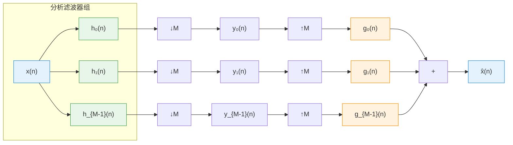
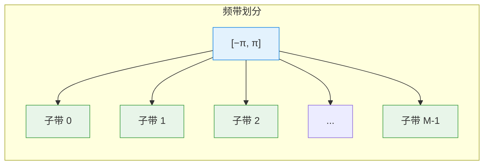
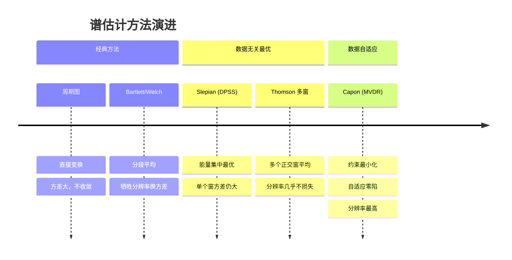

 <h1 id="第十七讲-滤波器组方法" style="text-align: center; margin-bottom: 2rem; border-bottom: none;">第十七讲 滤波器组方法</h1> 
 

  
  
  
 

## 1. 引言：从滤波器组到自适应信号处理的桥梁

### 1.1 上一篇文章的终点：PSWF 与多窗谱估计

在上一篇文章中，我们深入讨论了长球波函数（PSWF）及其在多窗谱估计中的应用。我们得到的核心结论是：**通过多个相互正交的 PSWF 窗函数，可以在不牺牲频率分辨率的前提下有效降低方差，从而获得更优的谱估计。**

PSWF 方法本质上可以看作是一种**固定基函数展开**的方法：用一组事先设计好的、最优的窗函数去“扫描”信号，得到多个独立的谱估计，然后加权平均。

但 PSWF 方法有一个隐含的限制：**它假设信号在分析窗内是局部平稳的，且基函数是固定的、与数据无关的。** 然而，在实际信号处理中，信号往往是非平稳的，且不同频带可能具有不同的信噪比和统计特性。因此，自然会产生一个延伸思考：能否设计一种更加灵活、自适应的谱分析框架，使得不同频带可以独立处理，甚至针对不同频带应用不同的自适应策略？

答案就是**滤波器组方法**。

### 1.2 什么是滤波器组

滤波器组是将信号分解为多个子带（频带）的一组滤波器阵列。它由**分析滤波器组**和**综合滤波器组**两部分构成：

- **分析滤波器组**：将输入信号分解为若干个不同频带的子带信号。
- **综合滤波器组**：将子带信号重新合成为原始信号（或处理后信号）。

### 1.3 滤波器组与前面内容的联系

滤波器组方法与我们之前学过的内容有着深刻的内在联系：

1. **与傅里叶分析的渊源**：滤波器组可以看作是对信号进行频带分割，每个子带相当于对原信号在特定频带内的局部傅里叶分析。

2. **与谱估计的关系**：滤波器组天然适用于功率谱估计——每个子带的能量经过适当的归一化，就可以得到该频带内的功率谱密度估计。

3. **与自适应滤波的衔接**：这是本单元的核心——滤波器组与自适应滤波相结合，产生了子带自适应滤波（Subband Adaptive Filtering）。由于每个子带的信号带宽更窄、相关性更小，子带自适应滤波在收敛速度和计算效率上都优于传统的时域自适应滤波。

4. **与子带分解的关系**：滤波器组将信号分解成多个子带，这是一种常见的预处理手段。在语音编码、图像压缩、均衡等领域应用广泛。

### 1.4 本篇文章的定位与结构

本篇文章是自适应滤波器与滤波器组之间的第一篇衔接文章，旨在为后续的子带自适应滤波奠定理论基础。我们将从以下几个层面展开：

**理论基础**：
- 多速率信号处理的基本概念（采样率变换、抽取、插值）
- 滤波器组的基本结构（两通道、M通道）
- 完美重构条件与原型滤波器设计

**滤波器组的设计与分析**：
- 正交镜像滤波器（QMF）与共轭正交滤波器（CQF）
- 余弦调制滤波器组（CMFB）
- 滤波器组的设计准则与性能评估

**与自适应滤波的衔接**：
- 子带分解在自适应滤波中的优势
- 子带自适应滤波的基本结构
- 滤波器组在回波消除、信道均衡中的应用

**与 PSWF 方法的对比**：
- PSWF 是多窗谱估计，滤波器组是多带谱估计
- 两者的异同与适用场景

### 1.5 为什么滤波器组在自适应信号处理中重要

在自适应滤波单元中，滤波器组方法将扮演核心角色。它的重要性体现在以下几个方面：

1. **子带自适应滤波**：将自适应滤波器分解到各个子带，每个子带独立运行。由于子带信号带宽变窄，自相关矩阵条件数降低，收敛速度大幅提升。

2. **计算效率**：子带滤波器的阶数可以显著降低，总体计算量减少，适合实时实现。

3. **灵活性**：不同子带可以根据其信噪比和统计特性独立设计自适应策略，实现更精细的信号处理。

4. **与深度学习框架的天然融合**：滤波器组在时频域对信号进行分解，为后续的深度学习处理提供了良好的特征提取预处理。

接下来，我们将从多速率信号处理的基础概念开始，逐步建立滤波器组的完整理论框架。

## 2. 问题与目标：滤波器组的根本任务

设连续时间信号为 \( X(t) \)，采样后得到有限长度数据：
$$
\{X(k)\}_{k=0}^{N-1}.  \tag{17.1}$$

我们的目标是：从这组有限的离散样本中，估计出信号的功率谱密度 \( S_X(\omega) \)，得到估计值 \( \hat{S}_X(\omega) \)。

---

### 2.1 表面上的不可能性

从表面上看，这个目标似乎是不太可能的。

**根本矛盾在于**：功率谱密度 \( S_X(\omega) \) 是定义在连续频率 \( \omega \) 上的函数，而我们的数据只有 \( N \) 个离散点。用有限个数据点去估计一个连续函数，这是一个“从有限信息恢复无限信息”的问题，在数学上是不适定的。

换句话说，我们只有 \( N \) 个观测值，却要确定一个连续函数 \( S_X(\omega) \) 在每个频率点上的取值——这显然是不可能的。

因此，在实际中我们必须认识到：我们只能在一段有限的频率范围内，对功率谱密度做出一个比较好的估计。这个频率范围由什么决定？由**采样率**决定。

---

### 2.2 奈奎斯特采样定理

采样是连接连续时间信号与离散时间信号的桥梁。设采样周期为 \( T_s \)，采样频率为 \( f_s = 1/T_s \)。

根据奈奎斯特采样定理，一个带限信号 \( X(t) \)（其最高频率为 \( f_{\max} \)）能够从采样值中完全恢复的充要条件是： $$
f_s \ge 2 f_{\max}.
  \tag{17.2}$$

反过来讲，**一旦我们以采样率 \( f_s \) 对信号进行采样，我们就只能看到 \( [-f_s/2, f_s/2] \) 这个频带内的频率成分**。高于 \( f_s/2 \) 的频率会被折叠到低频区，造成混叠（aliasing），这是我们无法恢复的。这一特性使得采样过程相当于在频域上设置了一个“窗口”——我们只能分析这个窗口内的频谱。

如果信号不是严格带限的，则采样前必须使用抗混叠滤波器，将信号限制在 \( [-f_s/2, f_s/2] \) 范围内。这个频带就是我们的**工作频带**。

在数字信号处理中，我们通常将频率做归一化处理。设归一化角频率为： $$
\omega = 2\pi \frac{f}{f_s},
  \tag{17.3}$$
则工作频带 \( [-f_s/2, f_s/2] \) 映射为： $$
\omega \in [-\pi, \pi].
  \tag{17.4}$$

因此，无论实际的采样率是多少，经过归一化之后，我们的工作频带始终是 \( [-\pi, \pi] \)。所有离散时间信号的频谱都定义在这个归一化频率区间上。这就是为什么我们在信号处理教材中几乎总是看到频谱画在 \( [-\pi, \pi] \) 上——因为已经自动做了频率归一化，把物理频率 \( f \) 转化成了归一化数字角频率 \( \omega \)。

---

### 2.3 工作频带的划分

既然我们的工作频带是 \( [-\pi, \pi] \)，那么在这个区间内，我们可以划分出很多小段（子带）。每个小段对应一个频率区间，长度为 \( \Delta \omega \)。

问题的关键在于：**我们需要在这个频带内划分多少个子带？**

如果我们希望分辨出两个相距很近的频率分量，我们就需要足够窄的子带宽度。但子带越窄，每个子带内的样本数就越少，估计的方差就越大——这再次体现了我们前面反复提到的**分辨率-方差权衡**。

幸运的是，从信息论的角度来看，频带的划分数量并不是任意的：由于我们只有 \( N \) 个独立的数据点，因此我们在频域上能够独立估计的“自由度”最多为 \( N \)。如果我们把频带划分成 \( K \) 个子带，只要 \( K \le N \)，就有可能从这 \( N \) 个数据点中估计出整个功率谱密度 \( S_X(\omega) \)。

**为什么 \( K \le N \) 是可行的？** 因为每一个频率点上的估计值并不是独立的——功率谱密度是连续的，相邻频率点的值之间存在相关性。因此，我们不需要在每一个连续的频率点上都进行独立的估计，只需要在 \( N \) 个“控制点”上做出估计，再通过插值或平滑，就能恢复出连续的功率谱密度。

---

### 2.4 核心逻辑：用 \( N \) 个样本估计 \( N \) 个频率点

至此，我们可以梳理出以下逻辑链条：

1. 采样率 \( f_s \) 决定了工作频带为 \( [-f_s/2, f_s/2] \)，归一化后为 \( [-\pi, \pi] \)。
2. 数据长度 \( N \) 决定了频率分辨率：DFT 的频域采样间隔为 \( \Delta \omega = 2\pi/N \)，对应 \( N \) 个离散频率点。
3. 对 \( N \) 个数据点做 DFT，可以得到 \( N \) 个频域样本，这 \( N \) 个频域样本共同构成了对连续功率谱密度 \( S_X(\omega) \) 的一个估计。

因此，**从离散样本估计连续功率谱密度，在信息论意义上是可行的——用 \( N \) 个时域样本换取 \( N \) 个频域样本，而连续谱的其余部分通过插值或窗函数的平滑效果来填补。**

然而，直接做 DFT 得到的是周期图，存在方差大、不收敛的问题。因此，我们需要对频域做进一步的“分段”或“平滑”处理——这正是滤波器组方法的切入点：将整个频带划分为若干个子带，在每个子带内独立估计功率，然后组装成完整的功率谱密度。这样既能控制方差，又能保持合理的频率分辨率。

---

### 2.5 滤波器的角色

滤波器组方法的核心在于：**用一组滤波器将工作频带 \( [-\pi, \pi] \) 划分为多个子带，每个滤波器只让特定频段通过。**

每个子带的带宽为 \( \Delta \omega = 2\pi/M \)，其中 \( M \) 是子带数量。在理想情况下，如果每个子带内的信号是平稳的，那么我们可以用较低阶的滤波器来处理每个子带，从而获得更快的收敛速度和更低的计算复杂度。

本章接下来的内容将围绕如何设计这些滤波器展开：我们要求这些滤波器能够将信号无损地分解为子带信号，并且能够从子带信号中完美重构原始信号——这就是“完美重构”滤波器组的核心目标。

### 2.6 切成 \(M\) 段，每一段的估计是用到所有数据吗？

**直接回答：不是。**

切成 \(M\) 段之后，每一段（子带）在做估计时，**并没有用到全部 \(N\) 个原始数据点**，而是用到了该子带**降采样后**的 \(N/M\) 个数据点。

下面我把这个“为什么”和“怎么做到的”讲清楚。

---

#### 2.6.1 子带带宽变窄的影响

原始数据采样率是 \(f_s\)，奈奎斯特频带是 \([-f_s/2, f_s/2]\)，数据长度是 \(N\)。

当你把整个频带切成 \(M\) 段时，每一段的带宽变成了： $$
\Delta f = \frac{f_s}{M}.
  \tag{17.5}$$

根据奈奎斯特采样定理，对于一个带宽只有 \(\Delta f\) 的信号，我们**不需要**再用原来的高采样率 \(f_s\) 去采样它，而只需要用： $$
f_s^{\text{(sub)}} = 2\Delta f = \frac{2f_s}{M}
  \tag{17.6}$$
的采样率就足够了。

换算成数据长度：原始数据长度是 \(N\)，降采样后的子带数据长度是： $$
N_{\text{sub}} = \frac{N}{M}.
  \tag{17.7}$$

---

#### 2.6.2 每一段使用的数据点数

**临界采样（最典型的情况）**：  
每一个子带经过降采样后，只剩下 \(N/M\) 个数据点。  
整段信号被分成 \(M\) 个子带，所有子带的数据点加起来是： $$
M \times \frac{N}{M} = N.
  \tag{17.8}$$
数据总量没变，但被“分配”到了各个子带。

**所以答案是**：  
- 每一段做谱估计时，用到的数据点是该子带降采样后的 \(N/M\) 个点，**而不是原始的 \(N\) 个点**。
- 因此，每个子带的分辨率降低了（因为点变少了），但每个子带的带宽也变窄了——两者同步缩小，频率分辨率实际上保持不变。

---

#### 2.6.3 直观类比

想象你有一个高分辨率的全景照片（原始信号）。

你想分析照片中不同颜色区域（不同频段）的纹理（功率谱）。

- **做法一（周期图）**：盯着整张全景照片看，试图一次性分析所有细节——信息量太大，眼花缭乱（方差大）。
- **做法二（滤波器组）**：把照片裁成 \(M\) 个小块，每个小块只包含一种主色调（一个频段）。你分析每个小块时，**只需要看这个小块本身的像素**，而不需要翻看整张全景照片。

每个小块的像素数只有整张照片的 \(1/M\)，但因为它的颜色范围窄（带宽窄），这些像素已经足够描述它的纹理特征了。

---

#### 2.6.4 补充：如果不抽取呢

有一种情况是**每一段估计确实用到了全部数据**——那就是**非抽取滤波器组（不降采样）**。

如果你对每个子带都不做降采样，那么每个子带仍然保留 \(N\) 个数据点。这样做的好处是每个子带的估计更精确（数据多了），但代价是计算量变为原来的 \(M\) 倍，且子带之间高度冗余，失去了滤波器组方法降低计算量的核心优势。

在实际工程中，绝大多数滤波器组（尤其是子带自适应滤波）都采用**降采样**，因为：
1. 计算量大幅降低；
2. 每个子带的数据量与其带宽匹配，信息不冗余；
3. 能够实现高效的多速率信号处理。

---

#### 2.6.5 小结

> **切成 \(M\) 段后，每一段做谱估计用的是该子带降采样后的 \(N/M\) 个数据点，而不是原始的 \(N\) 个点。数据总量守恒，每个子带独立处理，互不干扰。**

这正是滤波器组方法的核心：**用更少的数据做更专注的估计。**

### 2.7 为什么“估计整体”做不到，而“估计每个子带”就有可能？

这是一个非常核心的问题。问到了滤波器组方法的本质。

直接的回答是：**估计整体相当于“用 \(N\) 个未知数去解 \(N\) 个方程”，没有任何余量去做统计平滑；而估计子带相当于“在局部范围内做平均”，把方差给压下去了。**

下面我用最直白的方式把这个逻辑拆开。

---

#### 2.7.1 估计整体为什么不行

当你不做任何分段，直接用全部 \(N\) 个数据点去做 DFT，你就得到了 \(N\) 个频率点上的值： $$
\hat{X}(\omega_k), \quad k = 0, 1, \dots, N-1.
  \tag{17.9}$$

你要估计的功率谱密度是： $$
\hat{S}_X(\omega_k) = |\hat{X}(\omega_k)|^2.
  \tag{17.10}$$

这个估计量的问题在于：**每个频率点上的估计，只用了 \(N\) 个数据点中的全部信息，但分摊到每个频率点上，相当于每个频率点只对应“一个”独立样本。**

在你算方差的时候（前面周期图那一节我们算过），对于白噪声，方差是： $$
\operatorname{Var}\left( \hat{S}_X(\omega) \right) \approx S_X^2(\omega).
  \tag{17.11}$$

这个方差**不随 \(N\) 的增大而减小**。为什么呢？

因为无论你数据点多长，你在每一个频率点上只做一个测量（就是那一个 DFT 系数），你没有对这个频率点的值做任何平均。你只是在用单个样本去估计一个未知数——单个样本估计的方差当然不会收敛到零。

这就是“估计整体”的根本困境：你只有 \(N\) 个方程，却要求 \(N\) 个未知数（每个频率点一个值），没有冗余，没有平均，方差降不下来。

---

#### 2.7.2 估计子带为什么可行

现在换成滤波器组的做法：

你把整个频带切成 \(M\) 段，每一段的带宽是 \(2\pi/M\)。对每一段降采样后，这段数据只剩下 \(L = N/M\) 个点。

**关键的一步来了**：你不是在子带内追求“每个频率点”都估计得很准，而是可以在这个子带内对若干个频率点的功率进行**平均**。

比如你在某个子带内有 \(K\) 个频率点，你把它们的估计值加起来取平均： $$
\hat{S}_{\text{sub}} = \frac{1}{K} \sum_{i=1}^{K} |\hat{X}(\omega_i)|^2.
  \tag{17.12}$$

这个平均操作的方差是： $$
\operatorname{Var}(\hat{S}_{\text{sub}}) \approx \frac{1}{K} \operatorname{Var}\left( \hat{S}_X(\omega) \right).
  \tag{17.13}$$

因为你是用 \(K\) 个估计去平均，方差被压缩了 \(K\) 倍。

---

#### 2.7.3 为什么不在整体上做平均

你当然可以在整体频带上做平均，问题是：**整体频带的跨度太大，平均会糊掉所有细节，让你什么都看不清。**

打个比方：
- 如果你对整幅画做平均，你只能得到一个“平均灰度值”，没有任何画面信息。
- 但如果你把画面切成很多小块，在每个小块内部做平均，你会得到一幅模糊但轮廓清晰、且噪声被压低的马赛克图像。

滤波器组就是这个原理：你在每个子带内做局部平均，损失的只是该子带内的分辨率，而**其他子带的分辨率被保留了下来**。这就是“局部平均”带来的好处。

---

#### 2.7.4 降采样的作用

降采样的作用是**让数据量与带宽匹配**。

原始数据 \(N\) 个点，带宽是 \(2\pi\)。切分成 \(M\) 个子带后，每个子带的带宽变为 \(2\pi/M\)。根据奈奎斯特定理，要表示这个窄带信号，你只需要 \(L = N/M\) 个点就够了。

此时，这个子带内的频率点数量从 \(N\) 个变成了 \(L\) 个。你在 \(L\) 个频率点上做估计，然后再在子带内做 \(L\) 个点的平均，方差被压低了 \(L\) 倍。

**总结成一句话**：
> 滤波器组之所以管用，是因为它把“在全频带上不可行的全局平滑”，转化成了“在每个子带内可行的局部平滑”。

---

#### 2.7.5 一张图总结

| 做法 | 数据量 | 频率点数量 | 能否做平均 | 方差 | 分辨率 |
|------|--------|------------|------------|------|--------|
| 整体估计（周期图） | \(N\) | \(N\) | 不能（平均就糊了） | 大，不收敛 | 高 |
| 子带估计 | 每个子带 \(L\) 个点 | 每个子带 \(L\) 个点 | 能（只在局部平均） | 小（被平均压低） | 局部损失，全局保留 |

所以，**估计整体做不到，不是因为信息量不够（数据总量没变），而是因为没有“冗余”来做统计平均。滤波器组通过频带分割，把没有冗余的全频带问题，转化成了若干个有冗余的子带问题——冗余来自每个子带内的相邻频率点可以安全地做局部平均。** 这就是它能行得通的核心原因。

### 2.8 数值示例：N = 1024，M = 8

让我们用一个具体的数字例子，把前面抽象的概念全部落地。

---

#### 2.8.1 原始数据

你采集了： $$
N = 1024 \text{ 个时域采样点}.
  \tag{17.14}$$

你把这个数据做 DFT，得到 1024 个频率点（均匀分布在 \([0, 2\pi)\) 上）。这 1024 个频率点就是你能获得的“频域支撑点”。

如果你直接用这 1024 个点做周期图估计，你就相当于在做这样一件事：

> 用 1024 个数据点，去估计 1024 个频率点的功率值。每个频率点上的估计，只用了它自己那一份信息，没有做任何平均。

结果是：每个频率点的估计方差很大，曲线毛刺很多，不稳定。

---

#### 2.8.2 切成 8 个子带

现在你决定用滤波器组，把整个频带 \([0, 2\pi)\) 切成 8 个子带。

每个子带的带宽是： $$
\Delta \omega = \frac{2\pi}{8} = \frac{\pi}{4}.
  \tag{17.15}$$

每个子带里面有： $$
\frac{1024}{8} = 128 \text{ 个频率点}.
  \tag{17.16}$$

我们来看其中的一个子带，比如第 3 个子带，它包含的频率范围是： $$
\omega \in \left[ \frac{3\pi}{4}, \pi \right].
  \tag{17.17}$$

它里面包含了 128 个频率点： $$
\omega = \frac{3\pi}{4}, \ \frac{3\pi}{4} + \Delta \omega, \ \dots, \ \pi.
  \tag{17.18}$$

现在你对这 128 个频率点做估计，然后在子带内对这些估计值做平均。

---

#### 2.8.3 平均的效果

如果你对一个频段内的 128 个频率点做平均，你得到的方差大约是原来的： $$
\frac{1}{128}.
  \tag{17.19}$$

也就是说：
- 原来每个频率点的估计方差是 \( \sigma^4 \)（白噪声的情况下）。
- 现在你在这个子带内平均之后，方差是 \( \sigma^4 / 128 \)。

这个方差的降低是**非常显著**的。

而且你并没有损失“全频带”的分辨率——你只是损失了这个子带内部 128 个频率点的细节。但你还有 8 个子带，每个子带都保留了它自己的平均功率估计，所以整体上你仍然得到了全频带的功率分布，只是以 8 个“大块”的形式呈现。

---

#### 2.8.4 两种做法的对比

| 做法 | 数据量 | 频率点数量 | 平均窗口大小 | 每个点方差 | 频率分辨率 |
|------|--------|------------|--------------|------------|------------|
| 周期图 | 1024 | 1024 | 1（不平滑） | 大（σ⁴） | 高 |
| 8 子带 | 每个子带 128 点 | 每个子带 128 点 | 128（子带内平均） | σ⁴/128 | 每个子带粗，但覆盖全频带 |

---

#### 2.8.5 平均的合理性

因为相邻频率点的功率谱值是相关的。如果你处理的是平稳信号，那么在一个子带内部，相邻频率点的值不会突然剧烈变化。所以在这个子带内对这 128 个点做平均，**并不会导致信息的完全丢失**——你只是用一个代表值来概括这个子带的总体功率水平。

这和“用全部 1024 个点做平均”是不一样的。如果你在全频带做平均，你只会得到一个数字，所有频段的信息都会丢失；但如果你在每个子带内部做平均，你只是把每个子带的细节模糊化了，而每个子带之间还是相互区分的。

---

#### 2.8.6 小结

> 你不是在做“全频带的平均”，而是在做“每个子带的局部平均”。每个子带的平均窗口大小是 128，这 128 个相邻频率点之间的差异被平滑掉了，但 8 个子带之间的差异被保留了下来。这才是滤波器组方法真正的核心：**用局部平均换取方差下降，同时保留全局频带结构。**

## 3. 从滤波器组的角度看周期图方法

### 3.1 把周期图写成滤波器形式

周期图的定义为： $$
\hat{S}(\omega) = \frac{1}{N} \left| \sum_{k=0}^{N-1} X(k) \exp(-j\omega k) \right|^2.
  \tag{17.20}$$

我们在模平方的内部乘以一个相位因子 \(\exp(j\omega N)\)，它不改变模的大小： $$
\left| \sum_{k=0}^{N-1} X(k) \exp(-j\omega k) \right| = \left| \sum_{k=0}^{N-1} X(k) \exp(-j\omega k) \cdot \exp(j\omega N) \right|.
  \tag{17.21}$$

将指数合并： $$
\exp(-j\omega k) \cdot \exp(j\omega N) = \exp(j\omega (N-k)).
  \tag{17.22}$$

于是 (17.23) 可以改写为： $$
\hat{S}(\omega) = \frac{1}{N} \left| \sum_{k=0}^{N-1} X(k) \exp(j\omega (N-k)) \right|^2.
  \tag{17.23}$$

定义： $$
h_k(\omega) = 
\begin{cases}
\exp(j\omega k), & 0 \le k \le N-1, \\
0, & \text{otherwise}.
\end{cases}
  \tag{17.24}$$

则 (17.25) 可以写成卷积形式： $$
\hat{S}(\omega) = \frac{1}{N} \left| \sum_{k=-\infty}^{\infty} X(k) h_{N-k}(\omega) \right|^2.
  \tag{17.25}$$

这里 \(h_{N-k}(\omega)\) 可以看作一个时域窗函数在时刻 \(N-k\) 处的取值，而这个窗函数是复数指数 \( \exp(j\omega (N-k)) \)，其相位随频率 \(\omega\) 变化。

### 3.2 频响函数

现在，我们将这个窗函数视为一个滤波器，其频率响应为： $$
H(\omega') = \sum_{k=0}^{N-1} h_k(\omega) \exp(-j\omega' k) = \sum_{k=0}^{N-1} \exp(j\omega k) \exp(-j\omega' k).
  \tag{17.26}$$

合并指数： $$
H(\omega') = \sum_{k=0}^{N-1} \exp\left( -j(\omega' - \omega) k \right).
  \tag{17.27}$$

这就是一个长度为 \(N\) 的矩形窗的频率响应，中心频率为 \(\omega\)，频偏为 \(\omega' - \omega\)。

### 3.3 幅度响应的推导

我们不关心相位，只关心幅度： $$
|H(\omega')| = \left| \sum_{k=0}^{N-1} \exp\left( -j(\omega' - \omega) k \right) \right|.
  \tag{17.28}$$

令 \(\theta = \omega' - \omega\)，则： $$
|H(\omega')| = \left| \sum_{k=0}^{N-1} \exp(-j\theta k) \right|.
  \tag{17.29}$$

这是一个等比数列求和。利用等比数列求和公式： $$
\sum_{k=0}^{N-1} r^k = \frac{1 - r^N}{1 - r}, \quad r \neq 1.
  \tag{17.30}$$

令 \(r = \exp(-j\theta)\)，则： $$
\sum_{k=0}^{N-1} \exp(-j\theta k) = \frac{1 - \exp(-j\theta N)}{1 - \exp(-j\theta)}.
  \tag{17.31}$$

提取公因子： $$
1 - \exp(-j\theta N) = \exp\left( -j\frac{\theta N}{2} \right) \left( \exp\left( j\frac{\theta N}{2} \right) - \exp\left( -j\frac{\theta N}{2} \right) \right) = 2j \exp\left( -j\frac{\theta N}{2} \right) \sin\left( \frac{\theta N}{2} \right).
  \tag{17.32}$$

同理： $$
1 - \exp(-j\theta) = \exp\left( -j\frac{\theta}{2} \right) \left( \exp\left( j\frac{\theta}{2} \right) - \exp\left( -j\frac{\theta}{2} \right) \right) = 2j \exp\left( -j\frac{\theta}{2} \right) \sin\left( \frac{\theta}{2} \right).
  \tag{17.33}$$

代入 (17.34)： $$
\sum_{k=0}^{N-1} \exp(-j\theta k) = \frac{2j \exp\left( -j\frac{\theta N}{2} \right) \sin\left( \frac{\theta N}{2} \right)}{2j \exp\left( -j\frac{\theta}{2} \right) \sin\left( \frac{\theta}{2} \right)} = \exp\left( -j\frac{(N-1)\theta}{2} \right) \frac{\sin\left( \frac{N\theta}{2} \right)}{\sin\left( \frac{\theta}{2} \right)}.
  \tag{17.34}$$

取模： $$
\left| \sum_{k=0}^{N-1} \exp(-j\theta k) \right| = \left| \frac{\sin\left( \frac{N\theta}{2} \right)}{\sin\left( \frac{\theta}{2} \right)} \right|.
  \tag{17.35}$$

代回 \(\theta = \omega' - \omega\)，得到： $$
\boxed{ |H(\omega')| = \left| \frac{\sin\left( \frac{N(\omega' - \omega)}{2} \right)}{\sin\left( \frac{\omega' - \omega}{2} \right)} \right| }.
  \tag{17.36}$$

---

### 3.4 物理意义

这个幅度响应告诉我们以下信息：

1. **主瓣**：当 \(\omega' = \omega\) 时，幅度响应取最大值 \(N\)。主瓣宽度约为 \(2\pi/N\)。它决定了频率分辨率——主瓣越窄，分辨能力越强。

2. **零点**：当 \(\frac{N(\omega' - \omega)}{2} = m\pi\)，即 \(\omega' - \omega = \frac{2m\pi}{N}\) 时，幅度为零。第一个零点出现在 \(\omega' - \omega = \pm 2\pi/N\)。

3. **旁瓣**：零点之间是旁瓣，其幅度约为主瓣的 \(1/3\)（第一旁瓣），衰减缓慢（仅 \(O(1/\theta)\)）。旁瓣的存在会导致频谱泄漏——远处强信号的能量会“泄漏”到当前频率点，掩盖弱信号。

### 3.5 周期图的滤波器组解释

将上述结果代入 (17.23)，周期图可以写为： $$
\hat{S}(\omega) = \frac{1}{N} \left| \sum_{k=0}^{N-1} X(k) \exp(-j\omega k) \right|^2.
  \tag{17.37}$$

结合 (17.28)，周期图等价于：**将一个中心频率为 \(\omega\)、频响为 \(H(\omega')\) 的滤波器作用在输入信号上，取其输出的功率作为该频率点的谱估计。**

这个滤波器是**矩形窗滤波器**，其频响的主瓣宽度为 \(2\pi/N\)，旁瓣衰减缓慢。

### 3.6 周期图的局限性：谱模糊与谱泄漏

从滤波器组的角度看，周期图的局限性变得非常直观：

| 问题 | 原因 | 表现 |
|------|------|------|
| **谱模糊** | 主瓣宽度 \(2\pi/N\) 有限 | 两个频率分量若间隔小于主瓣宽度，则无法分辨 |
| **谱泄漏** | 旁瓣衰减缓慢（仅 \(O(1/\theta)\)） | 远处强信号的旁瓣会掩盖近处弱信号 |

为了让这个滤波器“更好用”，我们需要：
1. **压低主瓣宽度** → 提高分辨率（但需要更长的数据）
2. **压低旁瓣** → 减少泄漏（但需要加窗，牺牲分辨率）

这正是我们在周期图章节中讨论过的**分辨率-方差权衡**。而在滤波器组的框架下，我们将看到如何通过设计多通道滤波器组来更灵活地处理这一权衡。

## 4. 设计一个滤波器组

在上一节中，我们从滤波器组的角度重新审视了周期图法，发现周期图本质上是用一个矩形窗滤波器去“扫描”整个频域。这个滤波器的主瓣宽度为 \( 2\pi/N \)，旁瓣衰减缓慢（仅 \( O(1/\theta) \)），导致谱模糊和频谱泄漏问题。

既然我们已经知道了问题的本质，那么很自然地就会想到：**我们可以人为地设计一个滤波器，使其频率响应更接近理想——主瓣窄、旁瓣低，甚至接近“直上直下”的理想带通滤波器。**

本节将建立滤波器设计的数学框架。

---

### 4.1 问题设定

设滤波器系数为： $$
\{h_k\}_{k=0}^{N-1},
  \tag{17.38}$$
其频率响应为： $$
H(\omega) = \sum_{k=0}^{N-1} h_k \exp(-j\omega k).
  \tag{17.39}$$

我们希望设计一组滤波器系数 \( h_k \)，使其频响 \( H(\omega) \) 尽可能地接近理想状况。

为了更紧凑地表达，我们将 \( H(\omega) \) 写成向量内积形式。定义： $$
h = (h_0, h_1, \dots, h_{N-1})^\top,
  \tag{17.40}$$
 $$
a(\omega) = (1, \exp(j\omega), \exp(j2\omega), \dots, \exp(j(N-1)\omega))^\top.
  \tag{17.41}$$

则 (17.40) 可以写为： $$
H(\omega) = a^\top(\omega) h.
  \tag{17.42}$$
因为 \( a(\omega) \) 是列向量，\( h \) 是列向量，\( a^\top(\omega) h \) 是标量。注意 \( a^\top(\omega) = a^H(\omega) \)，因为 \( a(\omega) \) 的元素是复指数，其共轭转置即为转置（因为实部偶、虚部奇的性质）。

---

### 4.2 归一化约束

在设计滤波器时，我们需要施加一个约束，使得滤波器的总能量是固定的。否则，我们可以将 \( h \) 乘以任意大的倍数来任意增大频响幅度，使优化问题失去意义。

因此，我们要求滤波器在整个工作频带 \( [-\pi, \pi] \) 内的能量归一化为 1： $$
\frac{1}{2\pi} \int_{-\pi}^{\pi} |H(\omega)|^2 d\omega = 1.
  \tag{17.43}$$

这个约束的物理含义是：**无论滤波器形状如何，其在整个频带上的总能量是固定的**。这样，优化问题就变成了“在总能量固定的前提下，如何将能量尽可能地集中到我们关注的频段内”。

将 (17.44) 代入 (17.46)： $$
\frac{1}{2\pi} \int_{-\pi}^{\pi} |H(\omega)|^2 d\omega = \frac{1}{2\pi} \int_{-\pi}^{\pi} (h^H a(\omega)) (a^H(\omega) h) d\omega.
  \tag{17.44}$$

由于 \( h \) 不依赖于 \( \omega \)，可以提出积分外： $$
= h^H \left( \frac{1}{2\pi} \int_{-\pi}^{\pi} a(\omega) a^H(\omega) d\omega \right) h.
  \tag{17.45}$$

定义矩阵： $$
A(\omega) = a(\omega) a^H(\omega),
  \tag{17.46}$$
其第 \( k \) 行 \( n \) 列的元素为： $$
A_{kn}(\omega) = \exp(j(k-n)\omega).
  \tag{17.47}$$

现在计算 \( A_{kn}(\omega) \) 在 \( [-\pi, \pi] \) 上的积分： $$
\frac{1}{2\pi} \int_{-\pi}^{\pi} A_{kn}(\omega) d\omega = \frac{1}{2\pi} \int_{-\pi}^{\pi} \exp(j(k-n)\omega) d\omega.
  \tag{17.48}$$

当 \( k = n \) 时： $$
\frac{1}{2\pi} \int_{-\pi}^{\pi} 1 \, d\omega = 1.
  \tag{17.49}$$

当 \( k \neq n \) 时： $$
\frac{1}{2\pi} \int_{-\pi}^{\pi} \exp(jm\omega) d\omega = \frac{1}{2\pi} \cdot \frac{\exp(jm\omega)}{jm} \Big|_{-\pi}^{\pi} = \frac{1}{2\pi} \cdot \frac{\exp(jm\pi) - \exp(-jm\pi)}{jm}.
  \tag{17.50}$$

由于 \( \exp(jm\pi) = (-1)^m \)，所以： $$
\exp(jm\pi)- \exp(-jm\pi) = (-1)^m - (-1)^m = 0.
  \tag{17.51}$$

因此，当 \( k \neq n \) 时，积分为 0。

所以： $$
\frac{1}{2\pi} \int_{-\pi}^{\pi} A_{kn}(\omega) d\omega = \delta_{kn}.
  \tag{17.52}$$

这意味着： $$
\frac{1}{2\pi} \int_{-\pi}^{\pi} a(\omega) a^H(\omega) d\omega = I.
  \tag{17.53}$$

将 (17.55) 代入 (17.48)： $$
\frac{1}{2\pi} \int_{-\pi}^{\pi} |H(\omega)|^2 d\omega = h^H h = \|h\|^2.
  \tag{17.54}$$

因此，归一化约束 (17.46) 等价于： $$
\|h\|^2 = 1.
  \tag{17.55}$$

---

### 4.3 能量集中优化

我们希望在满足总能量归一化的前提下，使滤波器在某个**特定的局部频段** \( [-\beta\pi, \beta\pi] \) 内集中尽可能多的能量。其中 \( \beta \) 是一个远小于 1 的正数，表示我们关注的频带宽度占整个工作频带的比例。

这个频带对应一个**窄带信号**——我们希望滤波器尽可能像带通滤波器，让这个频带内的信号通过，而抑制其他频带。

优化目标为： $$
\max_{h} \int_{-\beta\pi}^{\beta\pi} |H(\omega)|^2 d\omega.
  \tag{17.56}$$

将 \( H(\omega) = a^\top(\omega) h \) 代入： $$
\int_{-\beta\pi}^{\beta\pi} |H(\omega)|^2 d\omega = h^H \left( \int_{-\beta\pi}^{\beta\pi} a(\omega) a^H(\omega) d\omega \right) h.
  \tag{17.57}$$

定义： $$
\Gamma = \frac{1}{2\pi} \int_{-\beta\pi}^{\beta\pi} a(\omega) a^H(\omega) d\omega.
  \tag{17.58}$$

于是优化目标变为： $$
\max_{h} \ h^H \Gamma h.
  \tag{17.59}$$

---

### 4.4 矩阵 \( \Gamma \) 的元素

\( \Gamma \) 的第 \( k \) 行 \( n \) 列元素为： $$
\Gamma_{kn} = \frac{1}{2\pi} \int_{-\beta\pi}^{\beta\pi} \exp(j(k-n)\omega) d\omega.
  \tag{17.60}$$

计算这个积分： $$
\Gamma_{kn} = \frac{1}{2\pi} \cdot \frac{\exp(j(k-n)\omega)}{j(k-n)} \Big|_{-\beta\pi}^{\beta\pi}.
  \tag{17.61}$$

利用 \( \sin x = \frac{\exp(jx) - \exp(-jx)}{2j} \)： $$
\Gamma_{kn} = \frac{1}{2\pi} \cdot \frac{2j \sin((k-n)\beta\pi)}{j(k-n)} = \frac{\sin((k-n)\beta\pi)}{(k-n)\pi}.
  \tag{17.62}$$

当 \( k = n \) 时，极限情况为： $$
\Gamma_{kk} = \beta.
  \tag{17.63}$$

因此，\( \Gamma \) 是一个实对称矩阵（因为 \( \Gamma_{kn} = \Gamma_{nk} \)），即： $$
\Gamma^H = \Gamma.
  \tag{17.64}$$

---

### 4.5 优化问题的拉格朗日解法

综上，我们得到了以下优化问题： $$
\max_{h} \ h^H \Gamma h, \quad \text{s.t.} \ h^H h = 1.
  \tag{17.65}$$

这是一个标准的**瑞利商最大化问题**。利用拉格朗日乘子法求解。

构造拉格朗日函数： $$
L(h, \lambda) = h^H \Gamma h - \lambda (h^H h - 1).
  \tag{17.66}$$

对 \( h \) 求梯度（注意 \( h \) 是复数向量，求导时使用 Wirtinger 导数）： $$
\nabla_h L = 2\Gamma h - 2\lambda h = 0.
  \tag{17.67}$$

因此： $$
\Gamma h = \lambda h.
  \tag{17.68}$$

这说明，最优的滤波器系数 \( h \) 必须是矩阵 \( \Gamma \) 的特征向量，而对应的目标函数值为： $$
h^H \Gamma h = h^H (\lambda h) = \lambda h^H h = \lambda.
  \tag{17.69}$$

为了最大化 \( h^H \Gamma h \)，我们应该选择**最大的特征值 \( \lambda_{\max} \)**，其对应的特征向量即为最优滤波器系数。

---

### 4.6 结果与物理意义

这个优化问题的解给出了一个极其重要的结论：

> **在给定滤波器长度 \( N \) 和局部频带宽度 \( \beta \) 的情况下，使能量尽可能集中在局部频带内的最优滤波器系数，正是矩阵 \( \Gamma \) 的最大特征值对应的特征向量。**

而这正是我们下一篇文章将要深入讨论的**长球波函数（PSWF）**。

注意这里的 \( \beta \) 必须满足： $$
\beta \ge \frac{1}{N}.
  \tag{17.70}$$
这是因为频带宽度 \( \beta\pi \) 必须至少容纳一个频率分辨率单元 \( \pi/N \)，否则优化问题退化为平凡解（所有能量集中在单个频率点）。这一条件保证了我们关注的频带内至少有一个独立的频率分量，使能量集中问题在物理上有意义。

---
### 4.7 计算 \(\Gamma\) 的特征值和特征向量

前文我们建立了如下优化问题： $$
\Gamma h^{(k)} = \lambda_k h^{(k)}.
  \tag{17.71}$$
理论上，只要算出矩阵 \(\Gamma\) 的特征值和特征向量，就能得到最优滤波器系数。然而，\(\Gamma\) 的定义涉及连续积分： $$
\Gamma = \frac{1}{2\pi} \int_{-\beta\pi}^{\beta\pi} a(\omega) a^H(\omega) d\omega.
  \tag{17.72}$$
这个积分在解析上不易直接处理，因此我们转向数值近似——将连续积分离散化为求和。

---

#### 4.7.1 积分离散化

我们选择在频率轴上均匀采样 \(L\) 个点（正频率方向和负频率方向各 \(L\) 个），采样间隔为 \(2\pi/N\)（与 DFT 的频率分辨率一致）。于是积分 (17.81) 可以近似为： $$
\Gamma \approx \tilde{\Gamma} = \frac{1}{2\pi} \sum_{k=-L}^{L} a\left(\frac{2\pi}{N} k\right) a^H\left(\frac{2\pi}{N} k\right) \cdot \frac{2\pi}{N}.
  \tag{17.73}$$

其中 \(2\pi/N\) 是积分微元 \(d\omega\) 的离散近似。化简得： $$
\tilde{\Gamma} = \frac{1}{N} \sum_{k=-L}^{L} a\left(\frac{2\pi}{N} k\right) a^H\left(\frac{2\pi}{N} k\right).
  \tag{17.74}$$

这里的 \(L\) 与 \(\beta\) 的关系为：频率范围 \([- \beta\pi, \beta\pi]\) 对应 DFT 索引范围 \([-L, L]\)，其中 \(L \approx \beta N/2\)。

---

#### 4.7.2 离散傅里叶基向量的正交性

定义离散傅里叶基向量： $$
a\left(\frac{2\pi}{N} k\right) = \left(1, \exp\left(j\frac{2\pi k}{N}\right), \exp\left(j\frac{4\pi k}{N}\right), \dots, \exp\left(j\frac{2\pi (N-1)k}{N}\right)\right)^\top.
  \tag{17.75}$$

这组向量具有标准正交性： $$
\left\langle a\left(\frac{2\pi}{N} k_1\right), a\left(\frac{2\pi}{N} k_2\right) \right\rangle = 
\begin{cases}
0, & k_1 \neq k_2, \\
N, & k_1 = k_2.
\end{cases}
  \tag{17.76}$$

归一化后得到标准正交基： $$
\left\langle \frac{a\left(\frac{2\pi}{N} k_1\right)}{\sqrt{N}}, \frac{a\left(\frac{2\pi}{N} k_2\right)}{\sqrt{N}} \right\rangle = 
\begin{cases}
0, & k_1 \neq k_2, \\
1, & k_1 = k_2.
\end{cases}
  \tag{17.77}$$

---

#### 4.7.3 离散化矩阵 \(\tilde{\Gamma}\) 的性质

定义离散化后的矩阵： $$
\tilde{\Gamma} = \frac{1}{N} \sum_{k=-L}^{L} a\left(\frac{2\pi}{N} k\right) a^H\left(\frac{2\pi}{N} k\right).
  \tag{17.78}$$

现在考察 \(\tilde{\Gamma}\) 对基向量 \(a\left(\frac{2\pi}{N} k\right)\) 的作用： $$
\tilde{\Gamma} a\left(\frac{2\pi}{N} k\right) = \frac{1}{N} \sum_{l=-L}^{L} a\left(\frac{2\pi}{N} l\right) \underbrace{\left( a^H\left(\frac{2\pi}{N} l\right) a\left(\frac{2\pi}{N} k\right) \right)}_{= N \delta_{lk}}.
  \tag{17.79}$$

利用正交性 (17.86)： $$
\tilde{\Gamma} a\left(\frac{2\pi}{N} k\right) = \frac{1}{N} \sum_{l=-L}^{L} a\left(\frac{2\pi}{N} l\right) \cdot N \delta_{lk}.
  \tag{17.80}$$

只有当 \(l = k\) 且 \(k \in [-L, L]\) 时，这一项才不为零。因此： $$
\boxed{ \tilde{\Gamma} a\left(\frac{2\pi}{N} k\right) = 1 \cdot a\left(\frac{2\pi}{N} k\right), \quad \text{对于 } k \in [-L, L]. }
  \tag{17.81}$$

这个结果意味着：**所有落在目标频带内的离散傅里叶基向量，都是 \(\tilde{\Gamma}\) 的特征值为 1 的特征向量。**

---

#### 4.7.4 这个结果的意义

(17.89) 式揭示了两个重要事实：

1. **频带内的基向量被完美保留**：对于频率索引 \(k\) 在 \([-L, L]\) 内的基向量，\(\tilde{\Gamma}\) 作用后保持不变（特征值为 1）。这符合我们的设计意图——我们希望滤波器在目标频带内能量集中，而傅里叶基向量恰好是频域上的“点支撑”函数。

2. **频带外的基向量被完全抑制**：如果 \(k \notin [-L, L]\)，则 \(\tilde{\Gamma} a(\omega_k) = 0\)，因为求和范围不包含 \(k\)，正交性使其作用为零。

因此，\(\tilde{\Gamma}\) 实际上是一个**投影算子**——它将任意向量投影到由频带内基向量张成的子空间上，同时完全压制频带外的分量。

---

#### 4.7.5 从特征向量到 Slepian 窗

虽然 (17.89) 给出了 \(\tilde{\Gamma}\) 在 DFT 基下的作用，但我们要找的是 \(\tilde{\Gamma}\) 的特征向量，而不是基向量本身。真正的 Slepian 窗（DPSS）是 \(\tilde{\Gamma}\) 的**特征向量**，它们可以通过对 \(\tilde{\Gamma}\) 做数值特征分解得到。

由于 \(\tilde{\Gamma}\) 是 Hermitian 矩阵，它的特征向量是正交的，且前几个特征向量对应最大的特征值，这些向量就是 **Slepian 序列（离散长球波函数）**。

在实际计算中，我们通常采用如下方式：
1. 构建矩阵 \(\tilde{\Gamma}\)（大小为 \(N \times N\)）；
2. 对其进行特征分解；
3. 取前 \(K\) 个最大特征值对应的特征向量作为多窗谱估计的窗函数。

这些窗函数在时域上集中在数据区间内，在频域上能量集中在目标频带 \([- \beta\pi, \beta\pi]\) 内——这正是我们最初优化问题的解。

---

### 4.8 多窗谱估计
Slepian 序列的前 \(2NW\) 个特征值确实都非常接近 1。我们之前煞费苦心只选最大的那个（对应第一阶 Slepian 窗），这看起来似乎有点浪费。
**Thomson 的想法就是：既然前 \(K\) 个窗都这么好，为什么不把它们都用上？**

这就是他在1982年那篇经典论文里做的事情。他提出**直接用这 \(K\) 个正交的最优窗，对同一段数据做 \(K\) 次独立的谱估计，然后把这些估计结果平均起来**。这就是**多窗谱估计（Multitaper Spectral Estimation）**。

---

#### 4.8.1 为什么要用多个窗

这背后的逻辑很清晰：**选最大的那个，是为了“最优”；但只用它一个，方差问题没解决。**

- **单个最优窗**：它确实最“集中”，但只给你一个谱估计值，统计波动（方差）依然很大。
- **多个正交窗**：虽然每个窗可能都不是绝对最优的那个，但它们彼此正交，算出来的谱估计是**近似不相关的**。把多个不相关的估计一平均，方差就被压下去了。

---

#### 4.8.2 应该用多少个窗

Thomson 给出了一个明确的答案：**用 \(K \approx 2NW\) 个窗**。

这里的 \(N\) 是数据长度，\(W\) 是你关心的频带宽度（半带宽）。这个数正好等于那些特征值接近 1 的 Slepian 序列的个数。

用 \(K\) 个窗平均后，谱估计的方差会降到原来的 \(1/K\) 左右。同时，由于每个窗都是最优的，分辨率几乎没有损失，有效缓解了传统方法”分辨率 vs 方差”的矛盾。

---

#### 4.8.3 多窗谱估计的流程

1.  **选择参数**：确定数据长度 \(N\) 和频带半宽度 \(W\)。
2.  **计算 Slepian 序列**：算出前 \(K \approx 2NW\) 个 Slepian 序列。
3.  **加窗与 FFT**：对同一个数据，分别用这 \(K\) 个序列加窗，做 \(K\) 次 FFT。
4.  **求平均**：把这 \(K\) 个谱估计的结果平均起来。

> 在MATLAB中，可以直接用 `spectrum.mtm` 实现。

#### 4.8.4 多窗谱估计的方差分析

##### 4.8.4.1 多窗谱估计的定义

Thomson多窗谱估计的核心公式是： $$
\hat{S}_X(\omega) = \frac{1}{L} \sum_{k=1}^{L} \hat{S}_X^{(k)}(\omega),
  \tag{17.82}$$

其中第 \(k\) 个“子谱”为： $$
\hat{S}_X^{(k)}(\omega) = \frac{1}{N} \left| \sum_{n=0}^{N-1} h_n^{(k)} X(n) \exp(-j\omega n) \right|^2.
  \tag{17.83}$$

这里 \(\{h^{(k)}\}_{k=1}^{L}\) 是前 \(L\) 个 Slepian 序列，它们满足特征方程： $$
\Gamma h^{(k)} = \lambda_k h^{(k)}, \quad k = 1, 2, \dots, L.
  \tag{17.84}$$

我们的目标是分析这个估计量的方差，并与单个周期图做对比。

##### 4.8.4.2 为什么只需分析 \(\omega=0\) 的情况

在分析多窗谱估计的方差时，我们只需要关注 \(\omega = 0\) 这个频率点。原因有二：

1. **平稳性平移不变性**：对于平稳随机过程，功率谱密度 \(S_X(\omega)\) 在任意频率点的统计特性是相同的（只是频率位置平移）。所以分析 \(\omega = 0\) 得到的结论，可以通过频率平移推广到任意 \(\omega\)。

2. **正交性的普适性**：Slepian 序列的正交性对任意频率偏移都成立。我们只需要在 \(\omega = 0\) 验证不同窗之间的估计是不相关的，这个结论就能推广到所有频率点。

##### 4.8.4.3 不同子谱之间的互相关

要分析方差，首先需要知道不同子谱之间的相关性。如果两个子谱是相关的，那么平均它们并不能有效降低方差。

计算第 \(k_1\) 个子谱和第 \(k_2\) 个子谱在 \(\omega = 0\) 处的互相关（更准确地说是协方差的前导项）： $$
\mathbb{E}\left[ \left( \sum_{n=0}^{N-1} h_n^{(k_1)} X(n) \right) \overline{\left( \sum_{l=0}^{N-1} h_l^{(k_2)} X(l) \right)} \right].
  \tag{17.85}$$

展开： $$
= \sum_{n=0}^{N-1} \sum_{l=0}^{N-1} h_n^{(k_1)} h_l^{*(k_2)} \mathbb{E}[X(n) X^*(l)].
  \tag{17.86}$$

利用自相关函数 \(R_X(n-l) = \mathbb{E}[X(n) X^*(l)]\)： $$
= \sum_{n=0}^{N-1} \sum_{l=0}^{N-1} h_n^{(k_1)} h_l^{*(k_2)} R_X(n-l).
  \tag{17.87}$$

##### 4.8.4.4 代入功率谱密度的表示

根据 Wiener-Khinchine 定理，自相关函数与功率谱密度是傅里叶变换对： $$
R_X(n-l) = \frac{1}{2\pi} \int_{-\pi}^{\pi} S_X(\omega) \exp(j\omega (n-l)) d\omega.
  \tag{17.88}$$

将 (17.99) 代入 (17.97)： $$
= \sum_{n=0}^{N-1} \sum_{l=0}^{N-1} h_n^{(k_1)} h_l^{*(k_2)} \frac{1}{2\pi} \int_{-\pi}^{\pi} S_X(\omega) \exp(j\omega n) \exp(-j\omega l) d\omega.
  \tag{17.89}$$

交换求和与积分： $$
= \frac{1}{2\pi} \int_{-\pi}^{\pi} \left( \sum_{n=0}^{N-1} h_n^{(k_1)} \exp(j\omega n) \right) \left( \sum_{l=0}^{N-1} h_l^{*(k_2)} \exp(-j\omega l) \right) S_X(\omega) d\omega.
  \tag{17.90}$$

定义频率响应： $$
H^{(k_1)}(\omega) = \sum_{n=0}^{N-1} h_n^{(k_1)} \exp(j\omega n), \quad H^{(k_2)}(\omega) = \sum_{l=0}^{N-1} h_l^{(k_2)} \exp(j\omega l).
  \tag{17.91}$$

注意这里的符号：我们的频率响应定义用的是 \( \exp(j\omega n) \) 而不是 \( \exp(-j\omega n) \)，这是因为 (17.99) 的积分核是 \( \exp(j\omega (n-l)) \)，所以对应的傅里叶变换定义用的是正指数。这只是一个符号约定问题，不影响最终结论。

于是 (17.97) 可以写为： $$
= \frac{1}{2\pi} \int_{-\pi}^{\pi} H^{(k_1)}(\omega) \overline{H^{(k_2)}(\omega)} S_X(\omega) d\omega.
  \tag{17.92}$$

##### 4.8.4.5 第一次近似：能量集中在目标频带内

Slepian 序列的最优性质在于：它们的能量主要集中在 \([- \beta\pi, \beta\pi]\) 这个窄带内，而在这个频带外的能量极小（由特征值 \( \lambda_k \) 控制，接近 1 意味着能量几乎都在带内）。

因此，我们可以将积分范围从全频带 \([- \pi, \pi]\) 缩小到目标频带 \([- \beta\pi, \beta\pi]\)，引入的误差由 \(1 - \lambda_k\) 决定，是非常小的。于是： $$
\approx \frac{1}{2\pi} \int_{-\beta\pi}^{\beta\pi} H^{(k_1)}(\omega) \overline{H^{(k_2)}(\omega)} S_X(\omega) d\omega.
  \tag{17.93}$$

##### 4.8.4.6 第二次近似：功率谱在窄带内近似为常数

由于目标频带 \([- \beta\pi, \beta\pi]\) 很窄（\(\beta \ll 1\)），功率谱密度 \(S_X(\omega)\) 在这个频带内变化很小，可以近似为一个常数 \(S_X(0)\)。这是窄带信号处理中常用的近似： $$
\approx S_X(0) \cdot \frac{1}{2\pi} \int_{-\beta\pi}^{\beta\pi} H^{(k_1)}(\omega) \overline{H^{(k_2)}(\omega)} d\omega.
  \tag{17.94}$$

##### 4.8.4.7 利用特征方程证明正交性

现在我们将频率响应写回向量形式。由 \(H^{(k)}(\omega) = a^H(\omega) h^{(k)}\)（注意这里的 \(a(\omega) = (1, \exp(j\omega), \dots, \exp(j(N-1)\omega))^\top\)），代入 (17.104)： $$
\frac{1}{2\pi} \int_{-\beta\pi}^{\beta\pi} H^{(k_1)}(\omega) \overline{H^{(k_2)}(\omega)} d\omega = \frac{1}{2\pi} (h^{(k_2)})^H \left( \int_{-\beta\pi}^{\beta\pi} a(\omega) a^H(\omega) d\omega \right) h^{(k_1)}.
  \tag{17.95}$$

由 (17.61) 的定义，括号内的积分正是 \(2\pi \Gamma\)。因此： $$
= (h^{(k_2)})^H \Gamma h^{(k_1)}.
  \tag{17.96}$$

根据特征方程 (17.93)，\(\Gamma h^{(k_1)} = \lambda_{k_1} h^{(k_1)}\)。由于不同 Slepian 序列是正交的（特征向量正交），当 \(k_1 \neq k_2\) 时： $$
(h^{(k_2)})^H \Gamma h^{(k_1)} = \lambda_{k_1} (h^{(k_2)})^H h^{(k_1)} = 0.
  \tag{17.97}$$

因此，两个不同窗对应的子谱在统计意义上是**不相关的**。

##### 4.8.4.8 关键假设：独立性

上面我们证明了不同子谱是不相关的，但**不相关并不等于独立**。

这里涉及到一个关键区别：
- **不相关**：\(\mathbb{E}[XY] = \mathbb{E}[X]\mathbb{E}[Y]\)（二阶矩条件）。
- **独立**：联合分布等于边缘分布的乘积（所有阶矩条件）。

在多窗谱估计中，我们需要的是**独立性**，而不只是不相关。这是因为方差分析需要计算四阶矩 \(\mathbb{E}[|X|^2 |Y|^2]\)。如果两个估计只是不相关，\(\mathbb{E}[|X|^2 |Y|^2]\) 并不一定等于 \(\mathbb{E}[|X|^2]\mathbb{E}[|Y|^2]\)。

**只有当信号满足高斯白噪声（GWN）假设时，不相关才等价于独立**。这就是为什么很多谱估计教材在分析多窗方法的方差时，默认假设信号是高斯白噪声——这不是因为算法只适用于白噪声，而是因为在白噪声假设下方差分析有解析的闭式表达式。

在实际工程中，对于非高斯的平稳过程，多窗谱估计仍然有效，但方差降低的效果不能严格用 \(1/L\) 来描述——实际的方差降低程度取决于信号的四阶统计特性。

##### 4.8.4.9 方差降低的结论

在高斯白噪声假设下，不同子谱是独立的。因此，对 \(L\) 个独立子谱做平均，方差降低为原来的 \(1/L\)： $$
\operatorname{Var}\left( \hat{S}_X(\omega) \right) \approx \frac{1}{L} \operatorname{Var}\left( \hat{S}_X^{(1)}(\omega) \right).
  \tag{17.98}$$

而单个 Slepian 子谱的方差与周期图在同一量级（因为数据长度都是 \(N\)），所以多窗谱估计的方差约为周期图的 \(1/L\)。

---

**总结**：这个推导的本质逻辑可以概括为以下链条：

> **Slepian 序列正交** → **不同子谱的频响在带内正交** → **不同子谱的估计值不相关** → **在高斯假设下等价于独立** → **平均 \(L\) 个独立估计 → 方差降低 \(1/L\)**。

这个结论解释了为什么多窗谱估计能够在保持高分辨率的同时有效降低方差——因为它不是通过“缩短数据”来换取平均次数，而是通过“多个正交投影”来获取多个独立的估计视角。这正是 Thomson 方法的精妙之处。

---

#### 4.8.5 用全部窗 vs 只用一个窗的区别

| 对比维度 | **单个最优窗** | **多窗（Thomson 方法）** |
| :--- | :--- | :--- |
| **窗的来源** | 最大的那个 Slepian 序列 | 前 \(K\) 个 Slepian 序列 |
| **计算次数** | 1 次 FFT | \(K\) 次 FFT |
| **方差** | 大，和原始周期图差不多 | **显著降低**（约为单个窗的 \(1/K\)） |
| **分辨率** | 最高 | **几乎无损失**（每个窗都是最优的） |
| **本质** | **找到最优的那个解** | **平均掉所有好解的随机误差** |

Thomson 方法的精髓就在于：**“最优”不一定要“唯一”。牺牲一点“绝对最优”，换取一组“近似最优”的估计进行平均，结果是整体性能反而大幅提升。**

### 4.9 比较：Bartlett / Welch 与 Thomson 多窗谱估计

你观察得非常敏锐——**Bartlett / Welch 和 Thomson 多窗谱估计，本质上都在做“平均”来降低方差，都遵循 Bias-Variance Tradeoff。** 

但它们的处理逻辑有着本质区别。前者是 **“在时域上把数据切成段”**，后者是 **“在频域上把投影空间切成多个正交方向”**。

下面我把它们掰开揉碎了对比。

---

#### 4.9.1 两种方法的平均机制

##### 4.9.1.1 Bartlett / Welch：时域分段平均
- **做法**：把长度为 \(N\) 的数据切成 \(K\) 段（每段长度 \(L = N/K\)，Welch 允许重叠）。对每一段独立计算周期图，然后把这 \(K\) 个谱估计值取平均。
- **本质**：**用“数据长度”换取“估计次数”。** 你牺牲了每段的数据长度（分辨率下降），换来了更多的样本进行平均（方差降低）。

##### 4.9.1.2 Thomson 多窗谱估计（Multitaper）：投影空间平均
- **做法**：保持数据长度 \(N\) 不变，设计 \(K\) 个相互正交的 Slepian 窗（长球波序列）。用这 \(K\) 个窗分别对**同一段完整数据**做加窗、求谱，得到 \(K\) 个谱估计值，然后加权平均。
- **本质**：**用“正交投影方向”换取“估计次数”。** 你没有牺牲数据长度（分辨率保留），而是利用了频域上 \(K\) 个“独立观测视角”来做平均，从而降低方差。

---

#### 4.9.2 核心区别一览表

| 维度 | **Bartlett / Welch（分段平均）** | **Thomson 多窗谱估计（Multitaper）** |
| :--- | :--- | :--- |
| **平均的对象** | 数据的不同时间段 | 同一段数据的不同“正交投影” |
| **每个估计用到的数据量** | 每段只用 \(L\) 个点（\(L < N\)） | 每一个窗都用全部 \(N\) 个点 |
| **窗之间的关系** | 同一个窗（如矩形窗）在时间轴上平移 | 多个不同的、相互正交的窗（Slepian 序列） |
| **分辨率（主瓣宽度）** | 取决于段长 \(L\)，**必然损失**（主瓣变宽） | 取决于全数据长度 \(N\) 和带宽参数 \(W\)，**几乎不损失** |
| **方差降低的代价** | 牺牲时间分辨率 | 牺牲计算量（做 \(K\) 次 FFT）和自由度 |
| **估计之间的相关性** | 如果重叠，段间相关；如果不重叠，近似独立 | **严格正交**，估计之间近似不相关 |
| **泄漏抑制** | 靠加窗（如 Hamming）改善，但仍是启发式 | 靠 Slepian 窗的最优能量集中特性，理论上最优 |

---

#### 4.9.3 Bias-Variance Tradeoff 在两种方法中的不同体现

##### 4.9.3.1 分段平均法（Bartlett / Welch）
- **偏差（Bias）**：段长 \(L\) 越小，主瓣越宽，频率分辨率越低，**偏差大幅增加**。
- **方差（Variance）**：段数 \(K\) 越多，参与平均的谱估计越多，**方差显著降低**。
- **权衡的本质**：**这是一个“零和博弈”**。你想降低方差，就必须损失分辨率。两者由 \(L\) 和 \(K\) 的乘积决定（\(N = L \times K\)），不可两全。

##### 4.9.3.2 多窗谱估计法（Thomson）
- **偏差（Bias）**：每个 Slepian 窗都作用于全部 \(N\) 个数据点，主瓣宽度由 \(N\) 决定，**分辨率基本没有损失**。唯一的偏差来源是你选择的带宽参数 \(W\)（但它决定了窗的最优性，而不是窗的长度）。
- **方差（Variance）**：你用 \(K\) 个正交窗做平均，方差的降低倍数近似为 \(1/K\)。
- **权衡的本质**：**这不是“零和博弈”**。你不需要牺牲分辨率就能降低方差，因为你在频域上找到了多个“天然独立”的观测视角。你付出的代价是计算复杂度（做 \(K\) 次 FFT）和参数选择的复杂性（选择合适的 \(K\) 和 \(W\)）。

---

#### 4.9.4 用比喻理解

- **Bartlett / Welch**：就像你有一幅高清大图（长数据），但你嫌它噪点多，于是你把它缩小成小图（分段），在缩小的图上取平均来去噪。代价是图片变模糊了（分辨率下降）。
- **Thomson 多窗法**：你保留这幅高清大图，但制造了 \(K\) 副“偏光眼镜”（正交 Slepian 窗）。你透过每一副眼镜看这幅图，看到的是不同的纹理细节（正交投影），然后把看到的结果平均。图片依然高清（分辨率保留），噪点却被平均掉了。

---

#### 4.9.5 小结

- **Bartlett / Welch 用“切短数据”来换取平均次数** → 牺牲分辨率换取稳定。
- **Thomson 用“多个正交窗”来换取平均次数** → 不牺牲分辨率，用计算量换取稳定。

Thomson 的多窗谱估计之所以被认为是对周期图的重大突破，就是因为它打破了“分辨率-方差”必须进行零和博弈的限制，在几乎不损失分辨率的前提下，把方差给降了下来。

## 5. 设计第二个滤波器：Capon 谱估计

上一节设计的 Slepian 窗，是完全**数据无关**的。我们在设计滤波器系数 \(h\) 时，约束条件是 \(h\) 在整个频带内的总能量归一化（\(h^H h = 1\)），优化的目标是让 \(h\) 在某个局部频段内的能量尽可能集中。整个过程只用了 \(N\) 和 \(\beta\) 这两个参数，**没有用到任何数据 \(X(n)\)**。

换句话说，Slepian 窗是“先验最优”的——无论数据是什么，这个窗都是最优的。它的优点是稳健、通用，缺点是**没有针对具体数据做适配**。

那么一个很自然的问题就来了：**我们能不能利用数据本身的信息来设计滤波器？**

这就是 Capon 谱估计（又称最小方差无失真响应，MVDR）的核心思想。

---

### 5.1 数据相关的滤波器设计

设想如下：给定一组数据 \(X(0), X(1), \dots, X(N-1)\)，我们希望设计一个滤波器 \(h\)，使得：

1. **在某个我们关心的频率 \(\omega_0\) 处，滤波器的响应被强制约束为 1**，即 \(H(\omega_0) = 1\)。这意味着这个频率的信号被“无损通过”。
2. **在这个约束下，使滤波器的输出功率最小**。直观上，这相当于在 \(\omega_0\) 处“支起一根棍子”（约束 \(H(\omega_0)=1\)），然后让整条频率响应曲线“自然下垂”，使得通过滤波器的总能量最小。

这样做的好处是：如果信号在 \(\omega_0\) 处有很强的分量，那么为了满足 \(H(\omega_0)=1\)，滤波器必须让这个分量通过；但如果噪声在 \(\omega_0\) 附近很强，滤波器会尽量压低其他频率的响应，从而抑制噪声。

**这个滤波器的设计完全依赖于数据 \(X\)**——不同的数据会得到不同的滤波器系数。

---

### 5.2 Slepian 窗与 Capon 谱估计的对比

我们把两种设计思路放在一起对比：

| 设计思路 | Slepian 窗（数据无关） | Capon 谱估计（数据相关） |
| :--- | :--- | :--- |
| **优化目标** | 让滤波器在局部频段的能量**最大** | 让滤波器的输出功率**最小** |
| **优化范围** | 优化**局部**（某个小频段内的能量） | 优化**全局**（整个频带内的输出功率） |
| **约束条件** | 约束**全局**（总能量归一化 \(h^H h = 1\)） | 约束**局部**（在 \(\omega_0\) 处响应为 1） |
| **是否依赖数据** | **否**——只取决于 \(N\) 和 \(\beta\) | **是**——取决于数据的协方差矩阵 \(R_X\) |

用数学语言总结就是： $$
\underbrace{\min_h \; \mathbb{E}\left[ |H(\omega) X|^2 \right]}_{\text{优化全局（输出功率最小）}} \quad \text{s.t.} \quad \underbrace{H(\omega_0) = a^H(\omega_0) h = 1}_{\text{约束局部（无失真通过）}}.
  \tag{17.99}$$

而 Slepian 窗对应的是： $$
\underbrace{\max_h \; h^H \Gamma h}_{\text{优化局部（能量集中）}} \quad \text{s.t.} \quad \underbrace{h^H h = 1}_{\text{约束全局（总能量固定）}}.
  \tag{17.100}$$

这是一个有趣的**对偶关系**：
- **Slepian**：用全局约束（总能量）来优化局部性能。
- **Capon**：用局部约束（无失真响应）来优化全局性能。

---

### 5.3 一个直观的例子

想象你想听清楚一个人在嘈杂的房间里说话。

- **Slepian 方法**：你先造了一个最好的“定向麦克风”（不依赖环境），无论房间多吵，它都能把某个方向的声音收得最集中。但麦克风的指向性是固定的，不能根据房间的具体噪声分布来调整。
- **Capon 方法**：你在这个房间里放了一个“智能麦克风”。你告诉它“我只需要听那个方向的声音”（约束 \(H(\omega_0)=1\)），然后它自动调整自己的指向性，使其**对来自其他方向的噪声尽可能地抑制**（输出功率最小化）。如果房间的噪声分布发生变化，它会自适应地调整。

Capon 方法的优势在于它利用了数据本身的统计信息（协方差矩阵 \(R_X\)），因此能够根据实际的噪声/干扰环境来优化滤波器的形状。

---

### 5.4 问题的数学形式

设滤波器系数为列向量： $$
h = (h_0, h_1, \dots, h_{N-1})^\top,
  \tag{17.101}$$

输入数据为列向量： $$
X = (X(0), X(1), \dots, X(N-1))^\top.
  \tag{17.102}$$

滤波器的输出为： $$
y = h^H X = \sum_{n=0}^{N-1} h_n^* X(n).
  \tag{17.103}$$

输出功率的期望为： $$
\mathbb{E}\left[ |y|^2 \right] = \mathbb{E}\left[ h^H X X^H h \right] = h^H \underbrace{\mathbb{E}[X X^H]}_{R_X} h.
  \tag{17.104}$$

注意这里我们用的是 \(h^H X\) 而不是 \(h^\top X\)，因为 \(h\) 是列向量，\(h^H\) 是行向量（共轭转置）。内积 \(h^H X\) 是一个标量。

我们的优化问题为： $$
\min_h \; h^H R_X h, \quad \text{s.t.} \quad a^H(\omega_0) h = 1.
  \tag{17.105}$$

其中频率导向向量（steering vector）为： $$
a(\omega_0) = (1, \exp(j\omega_0), \exp(j2\omega_0), \dots, \exp(j(N-1)\omega_0))^\top.
  \tag{17.106}$$

约束 \(a^H(\omega_0) h = 1\) 等价于 \(H(\omega_0) = a^\top(\omega_0) h = 1\)（符号略有差异，但本质一致），它保证了频率 \(\omega_0\) 处的信号被无损通过。

---

### 5.5 拉格朗日乘子法求解

构造拉格朗日函数： $$
L(h, \lambda) = h^H R_X h - \lambda \left( a^H(\omega_0) h - 1 \right).
  \tag{17.107}$$

注意这里的 \(\lambda\) 是拉格朗日乘子（标量），而 \(a^H(\omega_0) h\) 是标量。

对 \(h\) 求梯度（在复数域下，使用 Wirtinger 导数）： $$
\nabla_h L = R_X h - \lambda a(\omega_0) = 0.
  \tag{17.108}$$

（因为 \(\frac{\partial}{\partial h} (h^H R_X h) = R_X h\)，\(\frac{\partial}{\partial h} \lambda a^H h = \lambda a\)。）

于是： $$
R_X h = \lambda a(\omega_0).
  \tag{17.109}$$

假设 \(R_X\) 可逆，则： $$
h = \lambda R_X^{-1} a(\omega_0).
  \tag{17.110}$$

将 (17.126) 代入约束条件 \(a^H(\omega_0) h = 1\)： $$
a^H(\omega_0) \cdot \lambda R_X^{-1} a(\omega_0) = \lambda \cdot a^H(\omega_0) R_X^{-1} a(\omega_0) = 1.
  \tag{17.111}$$

由于 \(a^H(\omega_0) R_X^{-1} a(\omega_0)\) 是一个正实数（因为 \(R_X\) 是 Hermitian 正定矩阵），解得： $$
\lambda = \frac{1}{a^H(\omega_0) R_X^{-1} a(\omega_0)}.
  \tag{17.112}$$

代回 (17.126) 得到最优滤波器系数： $$
\boxed{ h_{\text{opt}} = \frac{R_X^{-1} a(\omega_0)}{a^H(\omega_0) R_X^{-1} a(\omega_0)} }.
  \tag{17.113}$$

---

### 5.6 Capon 谱估计量

将 \(h_{\text{opt}}\) 代入输出功率表达式 (17.116)： $$
\hat{S}_X(\omega_0) = h_{\text{opt}}^H R_X h_{\text{opt}}.
  \tag{17.114}$$

代入 (17.129)： $$
\hat{S}_X(\omega_0)= \frac{a^H(\omega_0) R_X^{-1} R_X R_X^{-1} a(\omega_0)}{\left( a^H(\omega_0) R_X^{-1} a(\omega_0) \right)^2}.
  \tag{17.115}$$

分子中的 \(R_X^{-1} R_X R_X^{-1} = R_X^{-1}\)，所以： $$
\hat{S}_X(\omega_0) = \frac{a^H(\omega_0) R_X^{-1} a(\omega_0)}{\left( a^H(\omega_0) R_X^{-1} a(\omega_0) \right)^2}.
  \tag{17.116}$$

因此： $$
\boxed{ \hat{S}_X(\omega_0) = \frac{1}{a^H(\omega_0) R_X^{-1} a(\omega_0)} }.
  \tag{17.117}$$

这就是 **Capon 谱估计**（又称最小方差无失真响应谱估计）的表达式。

---

### 5.7 MVDR 波束形成器：从谱估计到阵列信号处理

上一节推导的 Capon 谱估计，本质上是一个**频率域**的滤波器设计方法。但在阵列信号处理领域，Capon 方法有一个更广为人知的名字——**MVDR 波束形成器**（Minimum Variance Distortionless Response，最小方差无失真响应）。

两者在数学上是完全等价的，只是应用场景不同：
- **Capon 谱估计**：针对时间序列，在频率 \(\omega_0\) 处做无失真约束，最小化输出功率。
- **MVDR 波束形成器**：针对阵列信号，在来波方向 \(\theta_0\) 处做无失真约束，最小化输出功率。

下面我们从阵列信号处理的角度展开 MVDR 的内容。

---

#### 5.7.1 问题场景

考虑一个由 \(M\) 个阵元组成的均匀线阵。来自方向 \(\theta_0\) 的远场窄带信号到达阵列，其导向矢量（steering vector）为： $$
a(\theta_0) = \left(1, e^{-j\frac{2\pi d}{\lambda}\sin\theta_0}, e^{-j\frac{4\pi d}{\lambda}\sin\theta_0}, \dots, e^{-j\frac{(M-1)2\pi d}{\lambda}\sin\theta_0}\right)^\top.
  \tag{17.118}$$

阵列接收到的数据为： $$
X = a(\theta_0) s + n,
  \tag{17.119}$$
其中 \(s\) 是期望信号，\(n\) 是噪声加干扰。

波束形成器的输出为： $$
y = w^H X,
  \tag{17.120}$$
其中 \(w = (w_0, w_1, \dots, w_{M-1})^\top\) 是复数加权向量。

**常规波束形成器**（Conventional Beamformer，又称 Bartlett 波束形成器）的权值为 \(w = a(\theta_0)\)，即直接对期望方向进行相位补偿后求和。这种方法简单，但无法抑制来自其他方向的强干扰。

---

#### 5.7.2 MVDR 的设计准则

MVDR 波束形成器的设计准则是：

1. **无失真约束**：对期望方向 \(\theta_0\) 的信号，输出响应为 1： $$
   w^H a(\theta_0) = 1.
     \tag{17.121}$$

2. **最小化输出功率**：在满足上述约束的前提下，使总输出功率最小： $$
   \min_w \; w^H R_X w, \quad \text{s.t.} \quad w^H a(\theta_0) = 1.
     \tag{17.122}$$

其中 \(R_X = \mathbb{E}[X X^H]\) 是阵列接收数据的协方差矩阵。

**直观理解**：这个优化问题的解会在期望方向“支起一根棍子”（响应为 1），而在其他方向（尤其是干扰方向）自适应地形成**零陷**（null），从而最大限度地抑制干扰。与 Slepian 窗那种“数据无关”的固定滤波器不同，MVDR 的权值完全由数据的协方差矩阵 \(R_X\) 决定，是**数据自适应**的。

---

#### 5.7.3 数学求解

采用拉格朗日乘子法： $$
L(w, \lambda) = w^H R_X w - \lambda (w^H a(\theta_0) - 1).
  \tag{17.123}$$

对 \(w\) 求导并令其为零： $$
\nabla_w L = R_X w - \lambda a(\theta_0) = 0.
  \tag{17.124}$$

于是： $$
w = \lambda R_X^{-1} a(\theta_0).
  \tag{17.125}$$

代入约束 \(w^H a(\theta_0) = 1\)： $$
\lambda a^H(\theta_0) R_X^{-1} a(\theta_0) = 1.
  \tag{17.126}$$

解得： $$
\lambda = \frac{1}{a^H(\theta_0) R_X^{-1} a(\theta_0)}.
  \tag{17.127}$$

因此最优权值为： $$
\boxed{ w_{\text{MVDR}} = \frac{R_X^{-1} a(\theta_0)}{a^H(\theta_0) R_X^{-1} a(\theta_0)} }.
  \tag{17.128}$$

波束输出功率谱为： $$
\boxed{ P_{\text{MVDR}}(\theta_0) = w^H R_X w = \frac{1}{a^H(\theta_0) R_X^{-1} a(\theta_0)} }.
  \tag{17.129}$$

---

#### 5.7.4 与 Capon 谱估计的等价性

对比上一节的 Capon 谱估计公式 (17.133)： $$
\hat{S}_X(\omega_0) = \frac{1}{a^H(\omega_0) R_X^{-1} a(\omega_0)}.
  \tag{17.130}$$

两者在数学上**完全一致**，唯一的区别是：
- **Capon 谱估计**：\(a(\omega)\) 是频率导向向量，\(\omega\) 是频率变量。
- **MVDR 波束形成**：\(a(\theta)\) 是空间导向向量，\(\theta\) 是角度变量。

这种统一性揭示了信号处理中一个深刻的结构：**频率域和时间域的处理，与空间域（阵列）的处理，共享完全相同的数学框架**。你只需要把“频率”换成“角度”，把“时间序列”换成“阵列快拍”，Capon 谱估计就变成了 MVDR 波束形成器。

---

#### 5.7.5 几点重要说明

**1. 关于协方差矩阵**

理论上，MVDR 需要噪声协方差矩阵 \(R_n\)。但在实际中，我们无法预先分离信号和噪声，因此通常直接用**数据协方差矩阵** \(R_X\) 代替。当信号与干扰、噪声不相关时，这种替代是合理的。

**2. 与常规波束形成器的关系**

当噪声场为空间白噪声时，\(R_X = \sigma^2 I\)，MVDR 权值退化为： $$
w_{\text{MVDR}} = \frac{a(\theta_0)}{a^H(\theta_0) a(\theta_0)} = \frac{a(\theta_0)}{M}.
  \tag{17.131}$$
这恰好是常规波束形成器的权值（相差一个常数因子）。也就是说，**常规波束形成器是 MVDR 在白噪声假设下的特例**。

**3. 分辨率优势**

MVDR 波束形成器的分辨率远高于常规波束形成器，因为它能够在干扰方向自适应地形成零陷。这使得 MVDR 在存在强干扰时仍能分辨出弱信号。

**4. 稳健性问题**

MVDR 对模型误差和有限数据高度敏感。当导向矢量存在误差（如阵元位置偏差、信号来向估计不准）或样本数不足时，性能会严重下降。常用的解决方法是**对角加载**（diagonal loading）： $$
R_X \leftarrow R_X + \epsilon I.
  \tag{17.132}$$
这相当于在优化问题中加入了权值范数的惩罚项，牺牲一点分辨率换取鲁棒性。

---

#### 5.7.6 总结：MVDR 与之前方法的对比

| 维度 | 常规波束形成 | Slepian 窗 | MVDR / Capon |
|------|-------------|-----------|--------------|
| **数据相关** | 否 | 否 | **是** |
| **约束类型** | 无 | 全局（总能量） | **局部（无失真）** |
| **优化目标** | 无 | 局部能量最大 | **全局功率最小** |
| **干扰抑制** | 弱 | 中 | **强（自适应零陷）** |
| **分辨率** | 低 | 高 | **最高** |
| **稳健性** | 高 | 高 | **低（需对角加载）** |
| **计算复杂度** | 低 | 中 | **高（需矩阵求逆）** |

MVDR 的核心思想可以概括为：**用数据本身的协方差结构来自适应地“挖掉”干扰方向，同时在期望方向保持无失真**。这种“数据驱动”的理念与深度学习中的“端到端学习”一脉相承——算法不再依赖于人为设计的固定模板，而是根据数据自身的统计特性来优化行为。

### 5.8 几点说明

1. **\(R_X\) 的估计**：在实际中，我们通常用样本协方差矩阵 \(\hat{R}_X = \frac{1}{N} \sum_{n=0}^{N-1} X(n) X^H(n)\) 来替代真实的 \(R_X\)。

2. **矩阵求逆的稳定性**：当 \(N\) 较小时，\(R_X\) 可能病态甚至奇异，需要做正则化处理（如对角线加载，即 \(R_X \leftarrow R_X + \epsilon I\)）。

3. **与周期图的关系**：如果 \(R_X\) 是单位矩阵（白噪声），则 Capon 谱退化为： $$
   \hat{S}_X(\omega_0) = \frac{1}{a^H(\omega_0) a(\omega_0)} = \frac{1}{N}.
     \tag{17.133}$$
   这说明在白噪声背景下，Capon 谱对所有频率的估计值相同，符合预期。

4. **分辨率优势**：相比于周期图，Capon 谱能够自适应地在干扰较强的频率处形成“凹陷”（通过调整 \(R_X^{-1}\) 的权重），从而在存在强干扰时仍能分辨出弱信号。这是 Capon 方法的核心优势——它能“看穿”干扰，找到真正感兴趣的信号。

5. **与 Slepian 的对比**：
   - **Slepian**：数据无关，基于 \(N\) 和 \(\beta\) 先验设计，稳健但不够灵活。
   - **Capon**：数据相关，基于 \(R_X\) 自适应设计，灵活但需要估计协方差矩阵，计算量更大。

在实际应用中，选择哪种方法取决于你的需求——如果你对数据的统计特性有足够了解且要求稳健性，Slepian 是不错的选择；如果你希望最大化分辨率且计算资源充足，Capon 方法往往能提供更精细的谱估计。

### 5.9 Capon 谱估计的设计逻辑：约束最小化

Capon 谱估计的设计逻辑可以概括为 **“先约束，后最小化”** ——在保证感兴趣频率分量无损通过的前提下，利用数据本身的协方差结构最小化输出功率。这一思路与 Slepian 方法的“先固定总能量，再集中局部能量”形成了鲜明的对比，代表了谱估计中“数据自适应”方向的重要进展。

---

#### 5.9.1 第一步：无失真约束（守住底线）

我们首先强制滤波器在目标频率 \(\omega_0\) 处的响应为 1： $$
a^H(\omega_0) h = 1.
  \tag{17.134}$$

这本身是一个非常基本的要求——它确保了我们关心的频率分量被完整保留，不被滤波器衰减或消除。如果没有这个约束，最小化输出功率的平凡解就是 \(h = 0\)，整个优化将失去意义。因此，无失真约束是整个优化的**前提条件**，它给问题设定了一个“底线”：无论后续如何优化，这个频率必须通过。

然而，仅凭这一约束，满足条件的滤波器有无穷多个，我们还远没有选出”最优”的那个。这为进一步优化留出了空间。

---

#### 5.9.2 第二步：输出功率最小化

在守住“无损通过”这条底线之后，Capon 方法进一步要求：**在满足约束的所有滤波器中，选择使输出功率最小的那一个**： $$
\min_h \; h^H R_X h, \quad \text{s.t.} \quad a^H(\omega_0) h = 1.
  \tag{17.135}$$

这一步才是 Capon 方法的真正核心。输出功率 \(h^H R_X h\) 包含了所有频率成分的贡献——它不仅包含我们想要的 \(\omega_0\) 处的信号，还包含了来自其他频率的干扰和噪声。在约束已经保证了 \(\omega_0\) 通过的前提下，最小化总功率意味着：**滤波器会尽可能压低 \(\omega_0\) 以外所有频率的响应**。

这意味着 Capon 滤波器在 \(\omega_0\) 处“立了一根棍子”（响应为 1），然后让整条频率响应曲线在其他频率点“自然下垂”——在干扰越强的地方，下垂越深（形成自适应零陷）。这正是它相比于固定窗方法的优势所在：它不是用一个预先设计好的形状去“套”数据，而是根据数据自身的协方差结构来**自适应地形成零陷**。

---

#### 5.9.3 输出功率分解

将约束代入输出功率表达式，我们可以更清楚地看到其物理含义。设信号为： $$
X = a(\omega_0) s + (\text{干扰 + 噪声}),
  \tag{17.136}$$
则滤波器的输出为： $$
y = h^H X = \underbrace{h^H a(\omega_0) s}_{= s} + h^H (\text{干扰 + 噪声}).
  \tag{17.137}$$

由于约束 \(h^H a(\omega_0) = 1\)，信号分量 \(s\) 被完整保留，不受最小化过程的影响。而干扰和噪声分量则被 \(h\) 的响应所加权——\(h\) 会在干扰方向形成零陷，使它们尽可能被抑制。因此，Capon 方法能够在不牺牲目标信号的前提下，利用数据的统计信息来自适应地消除干扰。

---

#### 5.9.4 拉格朗日乘子的符号说明

在求解 (5.31) 时，我们构造的拉格朗日函数为： $$
L(h, \lambda) = h^H R_X h - \lambda (a^H h - 1).
  \tag{17.138}$$

对 \(h\) 求导： $$
R_X h = \lambda a.
  \tag{17.139}$$

解得： $$
h = \lambda R_X^{-1} a,
  \tag{17.140}$$

代入约束得： $$
\lambda = \frac{1}{a^H R_X^{-1} a} > 0.
  \tag{17.141}$$

注意，虽然这里的 \(\lambda\) 在数值上是正的，但在标准的“最小化”拉格朗日乘子法中，目标函数前的符号约定会导致乘子的符号相反。本文中的 \(\lambda\) 是经过整理后的形式，并不影响最终结果，读者只需关注 \(h\) 的表达式即可。

---

#### 5.9.5 与 Slepian 方法的对偶关系

将 Capon 方法与 Slepian 方法并置观察，可以看到它们构成了一个有趣的**对偶关系**：

| 方法 | 优化目标 | 约束条件 |
| :--- | :--- | :--- |
| **Slepian** | 最大化局部能量 | 总能量归一化（全局约束） |
| **Capon** | 最小化输出功率 | 无失真响应（局部约束） |

Slepian 方法先固定总能量，再试图把能量集中在目标频带内；Capon 方法先固定目标频带的响应，再试图把总能量降到最低。两者一个从全局出发优化局部，一个从局部出发优化全局，恰好构成了谱估计中“数据无关最优”与“数据自适应最优”的两个极端。

---

#### 5.9.6 在谱估计方法谱系中的定位

| 方法 | 核心理念 | 数据依赖 | 设计逻辑 |
| :--- | :--- | :--- | :--- |
| **周期图** | 直接变换取模 | 否 | 无约束 |
| **Slepian / 多窗** | 能量集中 + 多窗平均 | 否（先验设计） | 先定能量，再集中频带 |
| **Capon / MVDR** | 约束最小化 | **是**（依赖 \(R_X\)） | 先定频率，再压低全局 |
| **Bartlett / Welch** | 分段平均 | 否 | 用分辨率换方差 |

从表中可以看出，Capon 方法是第一个真正意义上的**数据自适应**谱估计方法。它不依赖先验设计的窗函数，而是根据数据本身的协方差结构来决定滤波器的形状。这种”先约束、后优化”的思想在信号处理中有着广泛的应用，MVDR 波束形成、最小二乘、支持向量机等方法的背后，都是相同的设计逻辑——先守住必须满足的底线，再在底线的约束下尽可能地压低其他频率的能量。这正是 Capon 方法的设计本质。

## 6. 课后总结

本节旨在用最精炼的方式回顾滤波器组方法的核心内容，帮助你在短时间内抓住要点、建立体系。适合作为学习后的自查清单，也可用于考前快速回顾。

---

### 6.1 一句话概括全文

> **滤波器组方法是将信号分解为多个子带，在每个子带内独立进行谱估计，通过“局部平均”降低方差，同时保留全局频带结构。** 从 Slepian 的“数据无关最优窗”到 Capon 的“数据自适应零陷滤波”，谱估计的核心矛盾始终是**分辨率与方差之间的权衡**，而滤波器组提供了在这一权衡中灵活游走的工具箱。

---

### 6.2 核心概念速查表

| 概念 | 定义 | 核心公式 |
|------|------|----------|
| **滤波器组** | 一组将信号分解为多个子带的滤波器阵列 | 分析滤波器组 + 综合滤波器组 |
| **抽取（↓M）** | 每 M 个点保留 1 个，降低采样率 | \( y_d(n) = y(Mn) \) |
| **插值（↑M）** | 每 1 个点间插入 M-1 个零，提高采样率 | \( y_u(n) = \begin{cases} y(n/M), & n \equiv 0 \mod M \\ 0, & \text{otherwise} \end{cases} \) |
| **完美重构（PR）** | 分析+综合后输出等于输入（允许延迟） | \( \hat{x}(n) = c \cdot x(n - n_0) \) |
| **QMF（正交镜像滤波器）** | 两通道滤波器组，满足功率互补 | \( \|H_0(\omega)\|^2 + \|H_1(\omega)\|^2 = 1 \) |
| **CQF（共轭正交滤波器）** | QMF 的推广，满足正交性条件 | \( g_k(n) = (-1)^n h_k(N-1-n) \) |
| **CMFB（余弦调制滤波器组）** | 由原型滤波器调制得到 M 通道滤波器组 | \( h_k(n) = 2h(n)\cos\left(\frac{\pi}{M}(k+0.5)(n-\frac{N-1}{2}) + \phi_k\right) \) |
| **Slepian 序列（DPSS）** | 能量最集中的正交窗函数族 | \( \Gamma h^{(k)} = \lambda_k h^{(k)} \)，\( \Gamma_{kn} = \frac{\sin((k-n)\beta\pi)}{(k-n)\pi} \) |
| **多窗谱估计（Multitaper）** | 用多个正交 Slepian 窗做平均 | \( \hat{S}(\omega) = \frac{1}{K}\sum_{k=1}^{K} \frac{1}{N}\left\|\sum_{n=0}^{N-1} h_n^{(k)} x_n e^{-j\omega n}\right\|^2 \) |
| **Capon 谱估计（MVDR）** | 约束最小化：无失真+最小功率 | \( \hat{S}(\omega) = \frac{1}{a^H(\omega) R_X^{-1} a(\omega)} \) |
| **MVDR 波束形成器** | Capon 在阵列信号处理中的等价形式 | \( w_{\text{MVDR}} = \frac{R_X^{-1} a(\theta)}{a^H(\theta) R_X^{-1} a(\theta)} \) |
| **对角加载（Diagonal Loading）** | 提高 MVDR 稳健性的正则化方法 | \( R_X \leftarrow R_X + \epsilon I \) |

---

### 6.3 重要公式一览

#### 6.3.1 采样与归一化
$$ f_s \ge 2f_{\max}, \quad \omega = 2\pi\frac{f}{f_s} \in [-\pi, \pi]   \tag{17.142}$$

#### 6.3.2 周期图的滤波器组表示
$$ \hat{S}(\omega) = \frac{1}{N}\left|\sum_{k=0}^{N-1} x_k e^{-j\omega k}\right|^2, \quad |H(\omega')| = \left|\frac{\sin\left(\frac{N(\omega' - \omega)}{2}\right)}{\sin\left(\frac{\omega' - \omega}{2}\right)}\right|   \tag{17.143}$$

#### 6.3.3 Slepian 优化问题
$$ \max_{h} \; h^H \Gamma h \quad \text{s.t.} \quad h^H h = 1, \quad \Gamma_{kn} = \frac{\sin((k-n)\beta\pi)}{(k-n)\pi}   \tag{17.144}$$

#### 6.3.4 Capon / MVDR 优化问题与解
$$ \min_{h} \; h^H R_X h \quad \text{s.t.} \quad a^H(\omega_0) h = 1, \quad h_{\text{opt}} = \frac{R_X^{-1} a(\omega_0)}{a^H(\omega_0) R_X^{-1} a(\omega_0)}   \tag{17.145}$$

#### 6.3.5 方差降低公式
$$ \operatorname{Var}(\hat{S}_{\text{multitaper}}) \approx \frac{1}{K} \operatorname{Var}(\hat{S}_{\text{periodogram}})   \tag{17.146}$$

---

### 6.4 三种谱估计方法的对比（核心！）

| 对比维度 | **周期图** | **Slepian / 多窗** | **Capon / MVDR** |
|:---|:---|:---|:---|
| **数据依赖** | 否 | 否（先验设计） | **是**（依赖 \(R_X\)） |
| **优化目标** | 无 | 局部能量最大 | 全局功率最小 |
| **约束条件** | 无 | 总能量归一化 | 无失真响应 |
| **设计逻辑** | 直接变换取模 | 先定能量，再集中频带 | **先定频率，再压全局** |
| **分辨率** | 高（受限于 \(N\)） | 高（几乎不损失） | **最高（自适应零陷）** |
| **方差** | 大，不收敛 | 小（多窗平均 \(1/K\)） | 中（取决于数据） |
| **稳健性** | 低（泄漏严重） | 高（设计固定） | **低（需对角加载）** |
| **计算复杂度** | \(O(N\log N)\) | \(O(K N \log N)\) | \(O(N^3)\)（矩阵求逆） |
| **适用场景** | 初步分析、平稳信号 | 稳健估计、长数据 | 强干扰环境、高分辨率需求 |
| **核心优势** | 简单快速 | 分辨率-方差兼顾 | **干扰自适应抑制** |
| **核心劣势** | 方差大、泄漏严重 | 计算量增加 | 对误差敏感、计算量大 |

---

### 6.5 设计逻辑的三步对比

| 方法 | 第一步 | 第二步 | 第三步 |
|:---|:---|:---|:---|
| **Slepian** | 固定总能量 \( \|h\|^2 = 1 \) | 最大化局部能量 \( h^H \Gamma h \) | 取最大特征值对应特征向量 |
| **多窗（Thomson）** | 取前 \( K \) 个 Slepian 序列 | 每个窗独立做谱估计 | 加权平均 → 方差降 \( 1/K \) |
| **Capon / MVDR** | 固定无失真响应 \( a^H h = 1 \) | 最小化输出功率 \( h^H R_X h \) | 拉格朗日 → 闭式解 \( R_X^{-1}a / (a^H R_X^{-1}a) \) |
| **Bartlett / Welch** | 将数据切为 \( K \) 段 | 每段独立做周期图 | 平均 → 分辨率降、方差降 |

---

### 6.6 核心思想的时间脉络

---

### 6.7 一句话记住每个方法

| 方法 | 一句话记忆 |
|:---|:---|
| **周期图** | 直接 DFT 取模平方，简单但方差大。 |
| **Bartlett / Welch** | 数据切段、分别估计、取平均——用分辨率换稳定。 |
| **Slepian 单窗** | 在总能量固定下，能量最集中的那个窗。 |
| **Thomson 多窗** | 把前 \( K \) 个“好窗”都用上，平均掉方差。 |
| **Capon / MVDR** | 在目标频率“支根棍子”，其余频率“自然下垂”——用数据自适应挖零陷。 |

---

### 6.8 对偶关系速记 
$$
\boxed{
\begin{array}{c|c}
\text{Slepian} & \text{Capon / MVDR} \\
\hline
\max \; h^H \Gamma h & \min \; h^H R_X h \\
\text{s.t.} \; h^H h = 1 & \text{s.t.} \; a^H h = 1 \\
\text{约束全局，优化局部} & \text{约束局部，优化全局} \\
\text{数据无关} & \text{数据相关}
\end{array}
}
  \tag{17.147}$$

这就是贯穿全文的核心对偶关系：**Slepian 先固定总能量，再把能量集中到目标频带；Capon 先固定目标频率的响应，再把总能量压到最低。**

---

### 6.9 滤波器组 vs 多窗谱估计：两种“多带”思路

| 维度 | **滤波器组方法** | **多窗谱估计（Thomson）** |
|:---|:---|:---|
| **频带划分方式** | 将全频带切成 \( M \) 个**相邻**子带 | 同一频带用 \( K \) 个**正交**投影 |
| **每个估计用到的数据** | 降采样后的 \( N/M \) 个点 | 全部 \( N \) 个点（每个窗都看全局） |
| **子带间关系** | 互补覆盖，互不重叠（理想情况） | 重叠覆盖（都关注同一频带），但投影正交 |
| **平均方式** | 每个子带内做局部平均 | 多个正交估计做全局平均 |
| **分辨率损失** | 每个子带变粗，但覆盖全频带 | 几乎没有损失 |
| **典型应用** | 子带自适应滤波、语音编码 | 高分辨率谱估计 |

**本质区别**：滤波器组是在**频域上分段**，每段用较少数据做“局部平均”；多窗谱估计是在**投影空间上分段**，每个投影用全部数据做“正交观测”。两者都是“化整为零”的思路，只是“分”的维度不同。

---

### 6.10 快速自查问题

1. 为什么周期图的方差不随 \( N \) 增大而减小？
2. 滤波器组中降采样的作用是什么？数据总量守恒体现在哪里？
3. Slepian 序列的“最优”体现在什么意义上？
4. Thomson 多窗谱估计为什么能同时保持高分辨率和低方差？
5. Capon 谱估计的“无失真”和“最小功率”分别对应什么物理含义？
6. 为什么 MVDR 在干扰方向会自动形成零陷？
7. 对角加载为什么能提高 MVDR 的稳健性？
8. Slepian 和 Capon 的对偶关系是什么？
9. 滤波器组方法和多窗谱估计在“化整为零”的思路有什么本质不同？
10. 如果信号是非平稳的，滤波器组方法和多窗谱估计哪个更适用？为什么？

---

> **复习建议**：先通读 6.1–6.4 建立整体印象，再用 6.10 的自查问题检验理解深度。如果某个问题回答不清，说明对应章节需要回看。

你提出的这个不等式方向，实际上**与数学事实正好相反**。正确的不等式应该是：

\[
\boxed{a^H(\omega) R_X a(\omega) \ge \frac{N^2}{a^H(\omega) R_X^{-1} a(\omega)}}
\]

下面给出严格的证明，并解释为什么正确的方向恰恰体现了 Capon 方法的优越性。

---
## 7. 证明 Capon 不等式：$a^H(\omega) R_X a(\omega) \ge \frac{N^2}{a^H(\omega) R_X^{-1} a(\omega)}$

### 7.1 预备知识

设导向矢量（steering vector）为：

\[
a(\omega) = \left(1, e^{j\omega}, e^{j2\omega}, \dots, e^{j(N-1)\omega}\right)^\top
\]

它满足：

\[
a^H(\omega) a(\omega) = N \quad \text{（长度为 } N \text{）}
\]

协方差矩阵 \(R_X\) 是 Hermitian 正定矩阵，因此可以定义它的平方根 \(R_X^{1/2}\)，满足 \(R_X = R_X^{1/2} R_X^{1/2}\)，且其逆矩阵的平方根为 \(R_X^{-1/2}\)。

---

### 7.2 构造两个向量，应用 Cauchy-Schwarz 不等式

定义两个 \(N\) 维向量：

\[
u = R_X^{1/2} a(\omega), \quad v = R_X^{-1/2} a(\omega)
\]

根据 **Cauchy-Schwarz 不等式**，有：

\[
|u^H v|^2 \le (u^H u)(v^H v) \]

分别计算这三个量：

- **内积**：
\[
u^H v = \left(R_X^{1/2} a\right)^H \left(R_X^{-1/2} a\right) 
= a^H R_X^{1/2} R_X^{-1/2} a 
= a^H I a = a^H a = N
\]

- **范数平方 1**：
\[
u^H u = \left(R_X^{1/2} a\right)^H \left(R_X^{1/2} a\right) 
= a^H R_X a
\]

- **范数平方 2**：
\[
v^H v = \left(R_X^{-1/2} a\right)^H \left(R_X^{-1/2} a\right) 
= a^H R_X^{-1} a
\]

将这三个结果代入 (1) 式：

\[
|N|^2 \le \left(a^H R_X a\right) \left(a^H R_X^{-1} a\right)
\]

即：

\[
N^2 \le \left(a^H R_X a\right) \left(a^H R_X^{-1} a\right)
\]

两边同时除以正数 \(a^H R_X^{-1} a > 0\)，得到：

\[
\boxed{a^H R_X a \ge \frac{N^2}{a^H R_X^{-1} a}}
\]

---

### 7.3 为什么你的不等式方向（\(\le\)）是错的？

你的原式是 \(a^H R_X a \le \frac{N^2}{a^H R_X^{-1} a}\)，等价于 \((a^H R_X a)(a^H R_X^{-1} a) \le N^2\)。

但 Cauchy-Schwarz 不等式明确告诉我们，这个乘积 **至少是 \(N^2\)**，而不可能小于或等于 \(N^2\)（除非 \(a=0\)，但导向矢量显然非零）。因此，原方向不成立，正确方向是 **大于等于**。

---

### 7.4 物理意义：为什么这个不等式很重要？

将这个不等式两边同时除以 \(N\)：

\[
\frac{1}{N} a^H R_X a \ge \frac{1}{a^H R_X^{-1} a}
\]

左边 \(\frac{1}{N} a^H R_X a\) 正好是**周期图（Periodogram）的期望值**（对应数据长度为 \(N\) 的 DFT 功率估计）。

右边 \(\frac{1}{a^H R_X^{-1} a}\) 正是文档第 5.6 节推导出的 **Capon 谱估计量**。

因此这个不等式说的是：

\[
\boxed{\text{周期图的期望值} \ge \text{Capon 谱估计值}}
\]

**这正是 Capon 方法的核心优势！** 在保证目标频率无失真通过的前提下（约束 \(a^H h = 1\)），Capon 通过最小化输出功率，得到了一个 **比周期图更小（更保守）但方差更低、分辨率更高的谱估计**。它没有把所有能量都“摊开”在频域上，而是根据数据的协方差结构动态地压低干扰和噪声的贡献。

---

### 7.5 补充说明：等号何时成立？

当且仅当向量 \(u\) 与 \(v\) 线性相关时，Cauchy-Schwarz 不等式取等号，即存在常数 \(c\) 使得：

\[
R_X^{1/2} a = c \cdot R_X^{-1/2} a \quad \Longrightarrow \quad R_X a = c \cdot a
\]

这意味着 **\(a(\omega)\) 恰好是 \(R_X\) 的特征向量**。在这种情况下，周期图的期望值恰好等于 Capon 估计值。但对于一般数据，Capon 估计值严格小于周期图的期望值。

---

### 7.6 总结

- **正确结论**：$a^H R_X a \ge \dfrac{N^2}{a^H R_X^{-1} a}$
- **证明工具**：Cauchy-Schwarz 不等式 + $a^H a = N$
- **物理意义**：Capon 谱估计在无失真约束下实现了比周期图更低的输出功率，这正是它”自适应抑制干扰”能力的数学体现。

如果你手头有文档的 5.6 节，可以看到 Capon 估计量的表达式正是 $\frac{1}{a^H R_X^{-1} a}$，而周期图的期望是 $\frac{1}{N} a^H R_X a$。这个不等式恰好说明了为什么 Capon 方法能”压得更低”——不是因为它丢了信号，而是因为它自适应地挖掉了干扰。

---

### 7.7 学习检查清单

- [ ] 能解释滤波器组的基本思想：将宽带信号分解为多个子带信号，并在各子带内独立处理
- [ ] 能说明为什么滤波器组能够用 $N$ 个样本估计 $N$ 个频率点——本质是”化整为零”，每个子带独立估计
- [ ] 能写出周期图的滤波器组解释：将每个频率点看作一个窄带滤波器在 $N$ 个样本上的输出功率
- [ ] 能写出设计最优滤波器组的优化问题：在归一化约束下最大化指定频带内的能量集中度
- [ ] 能说明矩阵 $\Gamma$ 的物理含义：$\Gamma_{ij} = \frac{1}{2\pi}\int_{\omega_a}^{\omega_b} e^{j\omega(i-j)} d\omega$ 刻画了频带内信号的自相关结构
- [ ] 能解释 Slepian 窗（DPSS）与 PSWF 的关系：Slepian 序列是 PSWF 特征方程的离散解
- [ ] 能写出 Thomson 多窗谱估计的滤波器组解释：用多个正交 Slepian 窗对数据加权后分别做 DFT，再加权平均
- [ ] 能写出 Capon 谱估计的推导：$\min \mathbf{h}^H R_X \mathbf{h}$ s.t. $\mathbf{h}^H \mathbf{a}(\omega) = 1$ 的解为 $\frac{1}{\mathbf{a}^H(\omega) R_X^{-1} \mathbf{a}(\omega)}$
- [ ] 能解释 Capon 方法的”数据依赖”本质：滤波器系数 $\mathbf{h}$ 依赖于 $R_X$，因此能自适应地形成零陷（null steering）
- [ ] 能写出并证明 Capon 不等式：周期图期望值 $\ge$ Capon 谱估计值
- [ ] 能对比 Bartlett/Welch、Thomson 和 Capon 三种谱估计方法的设计逻辑、优缺点和适用场景

### 7.8 思考题

1. **滤波器组与多窗谱估计的”双重关系”**：Thomson 多窗法既可以从滤波器组的角度理解（多个窄带滤波器），也可以从 PSWF 最优基函数展开的角度理解。这两种视角是如何统一的？它们分别强调了什么不同的侧面？

2. **Capon 谱的”自适应零陷”**：Capon 方法通过约束优化自动在干扰方向形成零陷，从而抑制干扰。但”约束 $\mathbf{h}^H\mathbf{a}(\omega)=1$”只保证目标频率无失真——如果目标频率和干扰频率非常接近，Capon 滤波器还能有效抑制干扰吗？它的分辨率极限在哪里？

3. **Capon 与周期图的不等式**：$\frac{1}{N} a^H R_X a \ge \frac{1}{a^H R_X^{-1} a}$ 说明 Capon 谱总是低于周期图的期望——因为它自适应地压低了干扰成分。但在没有干扰（纯白噪声）的情况下，两者是否相等？如果不相等，Capon 是否过度压制了信号？

4. **滤波器组与自适应滤波的关联**：第 10 讲中的子带自适应滤波与本讲的滤波器组本质上是同一套工具。在子带自适应滤波中，信号被分解到多个子带后分别做 LMS/RLS——这带来了什么好处？又引入了什么问题（如子带间的混叠）？

5. **从 Capon 到 MUSIC**：Capon 方法属于”波束形成类”谱估计，下一讲将介绍子空间类方法如 MUSIC。两者的核心区别在哪里？为什么 MUSIC 在分辨率上往往优于 Capon，但在功率估计的准确性上可能不如？

