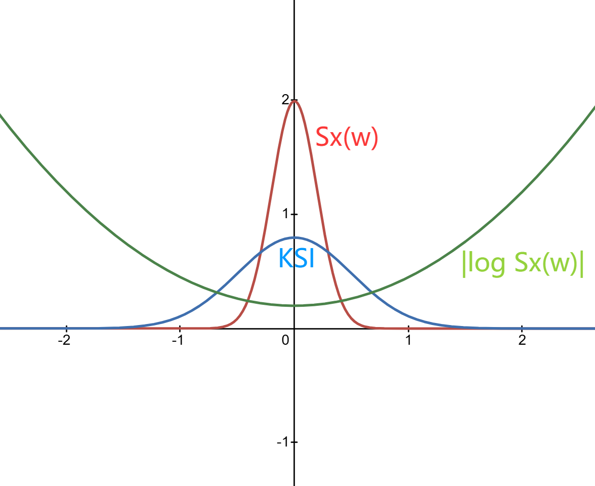

 <h1 id="第十八讲-随机信号（过程）的线性预测" style="text-align: center; margin-bottom: 2rem; border-bottom: none;">第十八讲 随机信号（过程）的线性预测</h1> 
 

  
  
  
 

## 1. 总体介绍：线性预测的理论极限

在之前的课程中，我们已经讨论过估计量的性能下界——Cramér‑Rao 下界（CRLB）。它给出了**所有无偏估计**（不限于线性估计）的方差下界，适用于任何满足正则条件的估计问题。CRLB 是一个**普适性的工具**，不关心你是线性估计还是非线性估计，适用范围广，因此下界往往比较宽松——它告诉你的只是“无论用什么方法，都不可能低于这个值”，但并未对线性估计给出更精确的限制。

当我们把注意力限制在**线性预测**这个特定框架中时，就可以得到比 CRLB 更精确、更紧的下界。这是因为线性预测所对应的估计量（即最优线性预测系数）具有特殊的数学结构——它们完全由信号的二阶统计量（自相关函数或功率谱密度）决定。因此，利用这些结构信息，我们可以推导出线性预测误差的精确下界，这个下界紧贴着线性预测的性能极限，远非通用的 CRLB 可比。

**关键认识**：本文讨论的所有限制，都是**问题本身固有的**，与具体采用什么预测算法（LMS、RLS、Levinson‑Durbin 等）**没有关系**。这些限制只取决于**被预测的随机过程本身的统计特性**（即其功率谱密度 $ S_X(\omega) $），而不取决于你用什么方法去预测它。无论你设计多么精巧的算法，只要它是线性的，就不可能越过 Kolmogorov‑Szegő 恒等式给出的误差下界。这就像 Cramér‑Rao 下界一样——它告诉你的是“自然规律允许的极限”，而不是“某个算法的性能”。

因此，本文将围绕以下几个核心问题展开：

1. **线性预测的最优解回顾**：首先回顾线性预测的核心结论——最优线性预测系数由 Wiener‑Hopf 方程给出，最小预测误差功率由  
   $ E_\infty = \exp\left( \frac{1}{2\pi} \int_{-\pi}^{\pi} \log S_X(\omega) d\omega \right) $  
   给出。这是整个分析的出发点，它告诉我们：**线性预测误差的下界只取决于谱密度的几何平均**。

2. **Kolmogorov‑Szegő 恒等式**：引入这个关键恒等式，它给出了**无限阶线性预测**（即用所有过去数据预测未来）的最小均方误差的闭式表达式。这个表达式只依赖于功率谱密度的几何平均，与谱的精细结构无关。这是线性预测领域最深刻的结论之一。

3. **Paley‑Wiener 条件**：为了使得 Kolmogorov‑Szegő 恒等式有意义，谱密度必须满足 Paley‑Wiener 条件——即  
   $ \int_{-\pi}^{\pi} |\log S_X(\omega)| d\omega < \infty $。  
   这个条件保证了线性预测误差是有限的，排除了那些“太不平滑”的谱（如含零点的谱）。我们将说明这个条件的本质含义：谱密度不能有太深的零点或极点。

4. **Cholesky 分解与有限阶线性预测**：对于有限数据长度 $ N $，最优线性预测系数由 Yule‑Walker 方程决定。Cholesky 分解是求解该方程和计算预测误差的有效工具，我们将用它建立有限阶预测误差与无穷阶极限之间的桥梁。

5. **误差随数据长度的衰减规律**：最后，我们将分析随着数据长度 $ N $ 的增大，线性预测误差如何趋近于理论极限。这个趋近速度与谱密度 $ S_X(\omega) $ 的光滑性密切相关——越光滑的谱，趋近越快；越粗糙的谱，趋近越慢。我们将给出具体的渐近衰减率。

---

**本文的定位**：本文讨论的是一切线性预测算法都无法逾越的**理论极限**。无论你使用 Levinson‑Durbin 递推、RLS 还是 Burg 算法，它们的预测误差最终都收敛到同一个极限——由谱密度 $ S_X(\omega) $ 的几何平均所决定的 Kolmogorov‑Szegő 下界。误差逼近这个极限的速度取决于谱的光滑性，但极限本身只取决于过程本身的统计特性。理解这一点，有助于我们在设计实际算法时，知道“能做到多好”以及“为什么不可能做得更好”。

## 2. 线性预测的最优解回顾

### 2.1 问题设定

设 $\{X(k)\}_{k=-\infty}^{\infty}$ 是一个零均值宽平稳随机过程。宽平稳性保证了自相关函数 $R_X(m) = \mathbb{E}[X(k) X(k-m)]$ 仅依赖于时间差 $m$，从而使得功率谱密度 $S_X(\omega)$ 有定义，这是后续所有频域分析的前提。

在时刻 $k$，我们假设已知过去 $P$ 个样本：
$$
X(k-1), X(k-2), \dots, X(k-P),  \tag{18.1}$$
我们希望对当前值 $X(k)$ 进行线性预测。

预测器的形式为： $$
\hat{X}(k) = \sum_{m=1}^{P} \alpha_m X(k-m).
  \tag{18.2}$$

### 2.2 最优预测系数与 Wiener-Hopf 方程

最优线性预测系数 $\{\alpha_m\}_{m=1}^{P}$ 通过最小化均方预测误差得到： $$
\{\alpha_1, \alpha_2, \dots, \alpha_P\} = \arg\min_{\alpha_1, \dots, \alpha_P} \mathbb{E}\left[ \left| X(k) - \sum_{m=1}^{P} \alpha_m X(k-m) \right|^2 \right].
  \tag{18.3}$$

由正交性原理，最优预测误差 $\epsilon_P(k) = X(k) - \sum_{m=1}^{P} \alpha_m X(k-m)$ 必须与所有用于预测的数据正交，即： $$
\mathbb{E}[\epsilon_P(k) X(k-j)] = 0, \quad j = 1, 2, \dots, P.
  \tag{18.4}$$

将 $\epsilon_P(k)$ 的表达式代入 (18.6)，得到： $$
\mathbb{E}\left[ \left( X(k) - \sum_{m=1}^{P} \alpha_m X(k-m) \right) X(k-j) \right] = 0.
  \tag{18.5}$$

利用自相关函数 $R_X(m) = \mathbb{E}[X(k) X(k-m)]$，可得： $$
R_X(j) - \sum_{m=1}^{P} \alpha_m R_X(j-m) = 0, \quad j = 1, 2, \dots, P.
  \tag{18.6}$$

将 (18.8) 写成矩阵形式，得到 **Wiener-Hopf 方程**（即 Yule-Walker 方程）： 

$$
\begin{pmatrix}
R_X(0) & R_X(1) & \cdots & R_X(P-1) \\
R_X(1) & R_X(0) & \cdots & R_X(P-2) \\
\vdots & \vdots & \ddots & \vdots \\
R_X(P-1) & R_X(P-2) & \cdots & R_X(0)
\end{pmatrix}
\begin{pmatrix}
\alpha_1 \\ \alpha_2 \\ \vdots \\ \alpha_P
\end{pmatrix}
=
\begin{pmatrix}
R_X(1) \\ R_X(2) \\ \vdots \\ R_X(P)
\end{pmatrix}.
  \tag{18.7}$$

简记为： $$
R_P \alpha_P = r_P,
  \tag{18.8}$$
其中 $R_P$ 是 $P \times P$ 的 Toeplitz 自相关矩阵，$r_P = (R_X(1), R_X(2), \dots, R_X(P))^\top$ 是互相关向量。

由于 $R_P$ 是 Toeplitz 矩阵（每一条对角线上的元素相同），我们可以利用 Levinson-Durbin 递推以 $O(P^2)$ 的复杂度高效求解，而非直接对 $R_P$ 求逆。

### 2.3 最优预测误差

定义最优预测误差为： $$
\epsilon_P(k) = X(k) - \sum_{m=1}^{P} \alpha_m X(k-m).
  \tag{18.9}$$
其均方误差为： $$
\sigma_P^2 = \mathbb{E}\left[ |\epsilon_P(k)|^2 \right].
  \tag{18.10}$$

利用正交性原理 (18.6)，$\epsilon_P(k)$ 与 $X(k-j)$ 正交，可以得到最小均方误差的简化表达式： $$
\sigma_P^2 = \mathbb{E}[\epsilon_P(k) X(k)] = R_X(0) - \sum_{m=1}^{P} \alpha_m R_X(m).
  \tag{18.11}$$

### 2.4 预测误差的单调性

直观上，随着预测阶数 $P$ 的增加，我们使用的数据越来越多，掌握的信息也越来越多，因此预测的准确度应该越来越高，即预测误差的方差应该单调不增。

严谨地，设 $P+1$ 阶预测的最优系数为 $\alpha_{P+1}$，如果我们将其中的前 $P$ 个系数取为 $P$ 阶的最优系数，而令第 $P+1$ 个系数为零，那么这仍然是 $P+1$ 阶预测的一个可行解（虽然不一定是最优的）。由于 $P+1$ 阶最优解的误差不会比这个可行解更大，因此： $$
\sigma_{P+1}^2 \le \sigma_P^2.
  \tag{18.12}$$

几何上，这相当于子空间 $\mathcal{M}_P = \operatorname{span}\{X(k-1), \dots, X(k-P)\}$ 随着 $P$ 的增大而扩展（$\mathcal{M}_P \subset \mathcal{M}_{P+1}$），投影误差随之递减。

从几何角度看，$X(k)$ 在 $\mathcal{M}_P$ 上的正交投影是 $\hat{X}_P(k)$，残差 $\epsilon_P(k)$ 垂直于该子空间。当 $P$ 增大时，投影子空间扩展，残差的范数（即均方误差 $\sigma_P^2$）单调不增。这是正交投影的基本性质，完全独立于具体的谱结构。

于是有： $$
\sigma_1^2 \ge \sigma_2^2 \ge \cdots \ge \sigma_P^2 \ge \sigma_{P+1}^2 \ge \cdots \ge \sigma_\infty^2.
  \tag{18.13}$$

这构成了一个单调递减的序列，收敛到一个极限值 $\sigma_\infty^2$。

### 2.5 预测误差的极限：Kolmogorov‑Szegő 下界

随着 $P \to \infty$，预测误差 $\sigma_P^2$ 单调递减且有下界（方差非负），因此必定收敛。这个极限值 $\sigma_\infty^2 = \lim_{P \to \infty} \sigma_P^2$ 是**线性预测误差的最低可能值**——即使用无穷多个过去样本，也无法突破这个下界。

这个极限由功率谱密度 $S_X(\omega)$ 完全决定，其闭式表达式为： $$
\sigma_\infty^2 = \exp\left( \frac{1}{2\pi} \int_{-\pi}^{\pi} \log S_X(\omega) d\omega \right).
  \tag{18.14}$$

这就是 **Kolmogorov‑Szegő 恒等式**（又称 Szegő 极限定理）。它是 20 世纪数字信号处理领域最辉煌的成就之一，因为它给出了一个极其简洁、仅由谱密度几何平均决定的预测误差极限。

**这个极限的意义**：无论你采用多么复杂的线性预测算法（LMS、RLS、Kalman、Levinson‑Durbin 等），只要数据来自同一个平稳随机过程，预测误差的方差都不可能低于 $\sigma_\infty^2$。这是线性预测的“绝对下限”——由信号本身的统计特性决定，与算法无关。

**对数平均与算术平均的对比**：我们熟悉的功率 $\mathbb{E}[X^2(k)]$ 由谱密度的算术平均给出： $$
\mathbb{E}[X^2(k)] = \frac{1}{2\pi} \int_{-\pi}^{\pi} S_X(\omega) d\omega.
  \tag{18.15}$$
而线性预测误差的下界由谱密度的**几何平均**给出： $$
\sigma_\infty^2 = \exp\left( \frac{1}{2\pi} \int_{-\pi}^{\pi} \log S_X(\omega) d\omega \right).
  \tag{18.16}$$
由于几何平均永远不大于算术平均，$\sigma_\infty^2 \le \mathbb{E}[X^2(k)]$，这符合我们的直觉——预测能降低不确定性，但永远无法降到零。

Kolmogorov‑Szegő 下界在通信、语音编码、控制理论中有着广泛的应用。**如果一个线性预测器的误差达到这个下界，那么它就是最优的，再没有任何其他线性方法能超越它**——这个下界清晰地划定了线性预测算法努力的上限。理解了这一点，我们就明白为什么后续提出的所有线性预测算法（LMS、RLS、Kalman）都在逼近同一个极限，而非试图“超越”它。

## 3. Kolmogorov‑Szegő 恒等式 

$$
\sigma_\infty^2 = \exp\left( \frac{1}{2\pi} \int_{-\pi}^{\pi} \log S_X(\omega) d\omega \right).
  \tag{18.17}$$

---

### 3.1 公式的直观理解

这个公式告诉我们一个非常反直觉但极其深刻的事实：**线性预测的极限精度，不取决于功率谱密度的“总能量”（即面积），而取决于它的“几何平均”——或者说，取决于它的形状有多“尖”或多“平”。**

#### 3.1.1 为什么功率谱密度与预测精度有关

功率谱密度 $S_X(\omega)$ 描述了信号能量在频率上的分布。它的形状决定了信号在时域上的相关性结构：
- **如果 $S_X(\omega)$ 能量集中在一个很窄的频带内**（比如一个窄带信号），意味着信号在时域上变化缓慢、高度相关。知道过去的值，就能比较准确地推断未来的值——预测容易，误差小。
- **如果 $S_X(\omega)$ 能量分布得很宽、很平坦**（比如白噪声），意味着信号在时域上变化迅速、几乎不相关。过去的值对预测未来几乎没有帮助——预测困难，误差大。

因此，谱密度的形状直接决定了信号的可预测性。这正是 Kolmogorov‑Szegő 恒等式将预测误差与谱密度联系起来的直觉基础。

#### 3.1.2 为什么是几何平均而不是算术平均

我们熟悉的信号总功率是谱密度的**算术平均**： $$
\mathbb{E}[X^2(k)] = \frac{1}{2\pi} \int_{-\pi}^{\pi} S_X(\omega) d\omega.
  \tag{18.18}$$

而线性预测的极限误差是谱密度的**几何平均**： $$
\sigma_\infty^2 = \exp\left( \frac{1}{2\pi} \int_{-\pi}^{\pi} \log S_X(\omega)d\omega \right).
  \tag{18.19}$$

几何平均对谱的“零点”（即 $S_X(\omega) \to 0$ 的地方）非常敏感。如果谱密度在某个频点处趋近于零，那么 $\log S_X(\omega) \to -\infty$，积分会发散，几何平均趋近于零。这意味着：**如果谱密度在某处为零，信号就是完全可预测的**。

这其实很合理——如果信号的能量只集中在某些离散频率上（比如纯正弦波），那么一旦你知道了这些频率，信号的未来值就是完全确定的。这正是线性预测的极限情况。

#### 3.1.3 对数积分发散的含义

当 $S_X(\omega)$ 在某些频点趋于零时，$\log S_X(\omega) \to -\infty$，积分发散，$\sigma_\infty^2 \to 0$。这意味着：**预测误差可以任意小，甚至趋近于零**。

这种情况对应于信号的功率谱在某个频段完全为零，即信号是“带限”的。根据奈奎斯特采样定理，带限信号在一定条件下是可以通过过去样本完美重构的。因此，线性预测能够做到零误差，正是这一频域结构在时域上的体现。

#### 3.1.4 时域-频域的对称性

谱密度 $S_X(\omega)$ 是自相关函数 $R_X(m)$ 的傅里叶变换。根据傅里叶变换的性质：
- 频域越窄 → 时域越宽（相关性强，记忆长）→ 预测越容易
- 频域越宽 → 时域越窄（相关性弱，记忆短）→ 预测越困难

Kolmogorov‑Szegő 恒等式正是这一对偶关系的精确数学表达：**频域能量的“集中度”（由几何平均度量）决定了时域预测的“极限精度”**。谱的形状越“尖”，预测极限越低；谱的形状越“平”，预测极限越高。

#### 3.1.5 极端例子：白噪声

对于白噪声，$S_X(\omega) = \sigma^2$ 是常数。则： $$
\sigma_\infty^2 = \exp\left( \frac{1}{2\pi} \int_{-\pi}^{\pi} \log \sigma^2 d\omega \right) = \exp(\log \sigma^2) = \sigma^2.
  \tag{18.20}$$

这意味着：即使你用了无穷多个过去样本来预测白噪声的当前值，预测误差的方差仍然等于信号本身的方差——信息量为零，无法预测。这与白噪声的时域特性完全一致：不同时刻的样本相互独立，过去的样本对预测未来没有任何帮助。

#### 3.1.6 极端例子：纯正弦波

对于纯正弦波 $X(k) = A \cos(\omega_0 k + \phi)$，其功率谱密度是两条线谱（在 $\pm \omega_0$ 处为 $\delta$ 函数）。在这些频点之外，$S_X(\omega) = 0$。于是： $$
\int_{-\pi}^{\pi} \log S_X(\omega) d\omega \to -\infty,
  \tag{18.21}$$
从而 $\sigma_\infty^2 \to 0$。

这意味着：纯正弦波是完全可以预测的——只要你知道它的频率和相位，就能确定它在任意时刻的值。这正是线性预测的极限情况。

### 3.2 公式的数学推导

#### 3.2.1 准备工作

定义 $ p $ 阶数据向量： $$
X_{(p)} = \big( X(k-1), X(k-2), \dots, X(k-p) \big)^\top.
  \tag{18.22}$$

其自相关矩阵为： $$
R_X^{(p)} = \mathbb{E}\left[ X_{(p)} X_{(p)}^H \right] \ge 0.
  \tag{18.23}$$

这是一个 $ p \times p $ 的 Hermitian 矩阵，其元素为： $$
R_X^{(p)} = 
\begin{pmatrix}
r_0 & r_1 & \cdots & r_{p-1} \\
r_{-1} & r_0 & \cdots & r_{p-2} \\
\vdots & \vdots & \ddots & \vdots \\
r_{-p+1} & r_{-p+2} & \cdots & r_0
\end{pmatrix}.
  \tag{18.24}$$

其中 $ r_k = \mathbb{E}[X(n) X^*(n-k)] $ 是自相关函数，满足 $ r_{-k} = r_k^* $（对于实信号，$ r_{-k} = r_k $）。这个矩阵是 Toeplitz 结构——主对角线及每条平行对角线上元素相同，且是 Hermitian 矩阵，它的正定性等价于对应随机过程的功率谱密度在任意频率点都非负。这一等价关系由 **Herglotz 定理** 精确给出。

---

##### 3.2.1.1 Herglotz 定理（离散情况）

**Herglotz 定理** 是连接自相关序列正定性与功率谱密度非负性的核心结论：

> 一个 Hermitian Toeplitz 矩阵序列 $ \{R_X^{(p)}\}_{p=1}^{\infty} $ 对所有 $ p $ 都是非负定（半正定）的，**当且仅当** 存在一个非负的有限测度 $ S_X(\omega) $，使得：
> $$
> r_k = \frac{1}{2\pi} \int_{-\pi}^{\pi} S_X(\omega) \exp(j\omega k) d\omega, \quad k = 0, \pm 1, \pm 2, \dots >   \tag{18.25}$$
> 等价地，功率谱密度 $ S_X(\omega) $ 是非负的，且满足：
> $$
> S_X(\omega) = \sum_{k=-\infty}^{\infty} r_k \exp(-j\omega k) \ge 0, \quad \forall \omega \in [-\pi, \pi]. >   \tag{18.26}$$

**换句话说**：自相关矩阵的正定性，等价于功率谱密度在任意频率点都非负。这是一个**充要条件**。

---

##### 3.2.1.2 推导：从谱密度到矩阵正定性

###### 3.2.1.2.1 方向一：谱密度非负 ⇒ 所有阶自相关矩阵半正定（充分性）

假设功率谱密度 $ S_X(\omega) \ge 0 $ 已知。根据 Wiener-Khinchine 定理，自相关函数是谱密度的傅里叶反变换： $$
r_k = \frac{1}{2\pi} \int_{-\pi}^{\pi} S_X(\omega) \exp(j\omega k) d\omega.
  \tag{18.27}$$

对任意非零复向量 $ z = (z_0, z_1, \dots, z_{p-1})^\top $，计算二次型： $$
z^H R_X^{(p)} z = \sum_{m=0}^{p-1} \sum_{n=0}^{p-1} z_m^* r_{m-n} z_n.
  \tag{18.28}$$

代入 (18.36)： $$
z^H R_X^{(p)} z = \sum_{m,n} z_m^* z_n \frac{1}{2\pi} \int_{-\pi}^{\pi} S_X(\omega) \exp(j\omega (m-n)) d\omega.
  \tag{18.29}$$

交换求和与积分： $$
= \frac{1}{2\pi} \int_{-\pi}^{\pi} S_X(\omega) \left| \sum_{m=0}^{p-1} z_m \exp(j\omega m) \right|^2 d\omega.
  \tag{18.30}$$

因为 $ S_X(\omega) \ge 0 $，且 $ |\sum z_m \exp(j\omega m)|^2 \ge 0 $，被积函数非负，所以积分非负： $$
z^H R_X^{(p)} z \ge 0.
  \tag{18.31}$$

因此，**谱密度非负 ⇒ 所有阶自相关矩阵半正定**。 ✅

---

###### 3.2.1.2.2 方向二：所有阶自相关矩阵半正定 ⇒ 谱密度非负（必要性）

假设对于任意正整数 $ p $，自相关矩阵 $ R_X^{(p)} $ 都是半正定的。

取任意 $ p $ 维非零复向量： $$
z = (z_0, z_1, \dots, z_{p-1})^\top, \quad z_k \in \mathbb{C}.
  \tag{18.32}$$

由半正定性： $$
z^H R_X^{(p)} z \ge 0.
  \tag{18.33}$$

展开左边： $$
\begin{aligned}
z^H R_X^{(p)} z &= \sum_{m=0}^{p-1} \sum_{n=0}^{p-1} z_m^* \, (R_X^{(p)})_{m,n} \, z_n \\
&= \sum_{m=0}^{p-1} \sum_{n=0}^{p-1} z_m^* \, r_{m-n} \, z_n.
\end{aligned}
  \tag{18.34}$$

令 $ l = m - n $，则 $ m = n + l $。这个双和可以按照 $ l $ 的值重新组织：

- 当 $ l \ge 0 $ 时，$ m = n + l $，$ n $ 的取值范围为 $ 0 \le n \le p-1-l $。
- 当 $ l < 0 $ 时，令 $ l' = -l > 0 $，$ n = m + l' $，$ m $ 的取值范围为 $ 0 \le m \le p-1-l' $。

于是 (18.43) 可重写为： $$
\begin{aligned}
z^H R_X^{(p)} z &= \sum_{l=-(p-1)}^{p-1} r_l \sum_{\substack{m,n \\ m-n=l}} z_m^* z_n \\
&= \sum_{l=-(p-1)}^{p-1} r_l \sum_{n} z_{n+l}^* z_n.
\end{aligned}
  \tag{18.35}$$

现在我们将自相关函数 $ r_l $ 用其谱表示代入。根据 Wiener-Khinchine 定理（由 Herglotz 定理的充分性部分保证，或直接由谱密度的定义），存在功率谱密度 $ S_X(\omega) $ 使得： $$
r_l = \frac{1}{2\pi} \int_{-\pi}^{\pi} S_X(\omega) \exp(j\omega l) d\omega.
  \tag{18.36}$$

代入 (18.46)： $$
z^H R_X^{(p)} z = \frac{1}{2\pi} \int_{-\pi}^{\pi} S_X(\omega) \sum_{l=-(p-1)}^{p-1} \left( \sum_{n} z_{n+l}^* z_n \right) \exp(j\omega l) d\omega.
  \tag{18.37}$$

现在处理括号内的双重求和。我们有： $$
\sum_{l=-(p-1)}^{p-1} \sum_{n}z_{n+l}^* z_n \exp(j\omega l).
  \tag{18.38}$$

令 $ m = n+l $，则 $ l = m-n $，上式变为： $$
\sum_{m=0}^{p-1} \sum_{n=0}^{p-1}z_m^* z_n \exp(j\omega (m-n)).
  \tag{18.39}$$

这正好可以分解为两个因子的乘积： $$
\sum_{m=0}^{p-1} z_m^* \exp(j\omega m) \sum_{n=0}^{p-1} z_n \exp(-j\omega n) = \left| \sum_{k=0}^{p-1} z_k \exp(j\omega k) \right|^2.
  \tag{18.40}$$

将 (18.53) 代回 (18.51)： $$
z^H R_X^{(p)} z = \frac{1}{2\pi} \int_{-\pi}^{\pi} S_X(\omega) \left| \sum_{k=0}^{p-1} z_k \exp(j\omega k) \right|^2 d\omega.
  \tag{18.41}$$

由于 $ R_X^{(p)} $ 半正定，左边 $ z^H R_X^{(p)} z \ge 0 $。因此： $$
\frac{1}{2\pi} \int_{-\pi}^{\pi} S_X(\omega) \left| \sum_{k=0}^{p-1} z_k \exp(j\omega k) \right|^2 d\omega \ge 0, \quad \forall z \in \mathbb{C}^p, \forall p \ge 1.
  \tag{18.42}$$

现在取特殊的 $ z $，使其只包含一个特定的频率点。考虑 $ p $ 趋向无穷时，让 $ z_k = \exp(-j\omega_0 k) $ 并取极限，则（这个论证通常通过取非负连续函数作为 $ |\sum z_k \exp(j\omega k)|^2 $ 的极限来完成，或直接由非负测度的性质推出）：

因为 (18.56) 对任意有限 $ p $ 和任意 $ z $ 成立，特别地，当 $ p \to \infty $ 时，$ |\sum_{k=0}^{p-1} z_k \exp(j\omega k)|^2 $ 可以逼近任意非负连续函数。因此，(18.56) 意味着： $$
\int_{-\pi}^{\pi} S_X(\omega) f(\omega) d\omega \ge 0
  \tag{18.43}$$
对任意非负函数 $ f(\omega) $ 成立。由此可推出： $$
S_X(\omega) \ge 0, \quad \forall \omega \in [-\pi, \pi].
  \tag{18.44}$$

**因此，所有阶自相关矩阵半正定 ⇒ 谱密度非负。** ✅

**证明完成**。 ✅

---

##### 3.2.1.3 更深刻的证明（Toeplitz 矩阵的正定性与测度）

上述证明依赖于 $ r_l $ 绝对可和这一条件。如果 $ r_l $ 不可和，则需要使用更泛化的 Toeplitz 矩阵理论。

具体来说，对于每一个 $ p $，矩阵 $ R_X^{(p)} $ 半正定意味着： $$
\lim_{p \to \infty} z^H(\omega) R_X^{(p)} z(\omega) \ge 0,
  \tag{18.45}$$
这等价于存在一个非负测度 $ \mu(\omega) $，使得： $$
r_k = \frac{1}{2\pi} \int_{-\pi}^{\pi} \exp(j\omega k) d\mu(\omega).
  \tag{18.46}$$
这正是 Herglotz 定理的标准表述——它不需要 $ r_k $ 绝对可和，只需要矩阵正定性作为前提。在这个测度 $ \mu(\omega) $ 下，谱密度 $ S(\omega) = \frac{d\mu}{d\omega} $ 是非负的。

---

##### 3.2.1.4 物理意义

这个“反过来”的证明非常重要。它告诉我们：**谱密度非负不是人为规定，而是由相关矩阵的正定性自然推出的**。也就是说：

- 如果相关矩阵是正定的（这是物理上合理的：任意线性组合的方差都不为负），那么谱密度必然是非负的。
- 反过来也成立：如果谱密度有负值，那么在某些频率处矩阵正定性会被破坏，这对应于物理上不可能的负功率。

---

##### 3.2.1.5 从离散功率谱密度的角度理解

功率谱密度 $ S_X(\omega) $ 的物理意义是：**信号功率在频率上的分布密度**。

- $ S_X(\omega) \ge 0 $ 是它的基本物理要求——功率不可能是负的。
- $ S_X(\omega) $ 在某个频率处越大，说明信号在该频率附近的能量越集中。
- 总功率是谱密度的积分： $$
  \mathbb{E}[|X(k)|^2] = r_0 = \frac{1}{2\pi} \int_{-\pi}^{\pi} S_X(\omega) d\omega.
    \tag{18.47}$$

如果谱密度在某处为负，功率谱密度就不再是“能量分布”，失去了物理意义。因此，Herglotz 定理保证了：**只要自相关矩阵对所有阶数都是正定的，那么对应的功率谱密度必然是非负的，从而在物理上是合理的**。

---

##### 3.2.1.6 正定函数的引出

上面的讨论自然引出了一个重要概念：**正定函数**（Positive Definite Function）。

**定义**：一个函数 $ r: \mathbb{Z} \to \mathbb{C} $ 称为**正定函数**，如果对任意有限集合 $ \{k_1, \dots, k_p\} \subset \mathbb{Z} $ 和任意非零复向量 $ z_1, \dots, z_p $，都有： $$
\sum_{m=1}^{p} \sum_{n=1}^{p} z_m^* r(k_m - k_n) z_n \ge 0.
  \tag{18.48}$$

在我们的问题中，自相关函数 $ r_k = \mathbb{E}[X(n) X^*(n-k)] $ 恰好是正定函数——因为它是随机变量内积的期望。

**Herglotz 定理 的重新表述**：

> 一个函数 $ r: \mathbb{Z} \to \mathbb{C} $ 是正定函数，**当且仅当** 存在一个非负测度 $ S(\omega) $ 使得：
> $$
> r_k = \frac{1}{2\pi} \int_{-\pi}^{\pi} S(\omega) \exp(j\omega k) d\omega. >   \tag{18.49}$$

换句话说：**正定函数与非负谱密度是一一对应的**。这个对应关系是 Bochner 定理在离散时间版本中的体现。

---

##### 3.2.1.7 小结

| 概念 | 数学表达 | 物理意义 |
| :--- | :--- | :--- |
| 自相关矩阵 $ R_X^{(p)} $ | Toeplitz Hermitian | 描述随机过程不同时刻之间的相关性 |
| 矩阵正定性 | $ z^H R_X^{(p)} z \ge 0 $ | 任何线性组合的方差非负 |
| Herglotz 定理 | $ S_X(\omega) = \sum r_k e^{-j\omega k} \ge 0 $ | 功率谱密度在任意频率非负 |
| 正定函数 | $ r_k $ 满足正定性条件 | 自相关函数是正定函数 |
| Bochner 定理 | $ r_k \leftrightarrow S_X(\omega) \ge 0 $ | 正定函数与非负谱密度一一对应 |

Herglotz 定理是整个线性预测理论的基石——它保证了自相关矩阵的正定性与功率谱密度的非负性之间的等价性。没有这个定理，Kolmogorov‑Szegő 恒等式（涉及 $ \log S_X(\omega) $）就可能失去意义，因为 $ \log $ 要求 $ S_X(\omega) > 0 $。而 Herglotz 定理告诉我们：如果过程是非退化的（即自相关矩阵正定），则谱密度 $ S_X(\omega) > 0 $ 几乎处处成立，从而 $ \log S_X(\omega) $ 是可积的——这正是 Paley-Wiener 条件的基础。

#### 3.2.2 正定性、临界阶数与谐波信号的可预测性

在本节中，我们将详细分析自相关矩阵 $ R_X^{(p)} $ 的半正定与正定之间的差别，以及这种差别对线性预测的意义。

---

##### 3.2.2.1 正定性与奇异性的含义

我们已知自相关矩阵： $$
R_X^{(p)} = \mathbb{E}\left[ X_{(p)} X_{(p)}^H \right] \ge 0, \quad X_{(p)} = \big( X(k-1), \dots, X(k-p) \big)^\top.
  \tag{18.50}$$

- 如果 $ R_X^{(p)} > 0 $（正定），则矩阵可逆，意味着没有任何非零线性组合可以产生零方差。等价地，$ X(k-1), \dots, X(k-p) $ 是线性无关的（在均方意义下），不存在精确的线性预测关系。

- 如果 $ R_X^{(p)} \ge 0 $ 但不正定（即奇异），则存在某个非零向量 $ a = (a_1, \dots, a_p)^\top \neq 0 $，使得： $$
a^H R_X^{(p)} a = \mathbb{E}\left[ \left| \sum_{m=1}^{p} a_m X(k-m) \right|^2 \right] = 0.
  \tag{18.51}$$
由于均方值为零，这意味着： $$
\sum_{m=1}^{p} a_m X(k-m) = 0 \quad \text{几乎必然（a.s.）}.
  \tag{18.52}$$
也就是说，存在一个非平凡的线性组合恒等于零，表明过去 $ p $ 个样本之间存在精确的线性依赖关系。

这种线性依赖关系意味着什么呢？它意味着当前的 $ X(k) $ 可以通过过去的某些样本精确线性预测。具体来说，如果 (18.60) 中某个系数 $ a_m \neq 0 $，那么我们可以解出其中一个变量，例如如果 $ a_p \neq 0 $，则： $$
X(k-p) = -\frac{1}{a_p} \sum_{m=1}^{p-1} a_m X(k-m).
  \tag{18.53}$$
这表明 $ X(k-p) $ 可以由更早的 $ p-1 $ 个样本完美预测。进一步地，利用平稳性，这意味着整个时间序列满足一个有限阶的线性递推关系，从而具有完全可预测性。

---

##### 3.2.2.2 寻找临界阶数

由于 $ R_X^{(p)} $ 是 $ p $ 阶矩阵，随着 $ p $ 增大，矩阵的阶数增加，其正定性状态可能会发生变化。从 $ p=1 $ 开始，如果 $ R_X^{(1)} = [r_0] > 0 $，则至少一阶矩阵是正定的。一般情况下，我们假设 $ r_0 > 0 $（信号有非零功率），否则信号为零。

定义： $$
\mathcal{P} = \{ p \ge 1 \mid R_X^{(p)} > 0 \}.
  \tag{18.54}$$
由于 $ R_X^{(1)} > 0 $，集合非空。当 $ p $ 增大时，矩阵可能保持正定，也可能变得奇异。如果存在某个最小的 $ p $ 使得 $ R_X^{(p)} $ 奇异，但 $ R_X^{(p-1)} > 0 $，则称 $ p $ 为**临界阶数**。

如果对所有的 $ p $，$ R_X^{(p)} > 0 $ 都成立，则不存在临界阶数，过程是“正定”的，即没有任何精确的线性预测关系。

如果存在临界阶数 $ p $，则说明信号满足一个精确的 $ p $ 阶线性递推关系，这种信号称为**纯谐波信号**（或线谱信号）。

---

##### 3.2.2.3 临界阶数与功率谱密度的关系

**关键结论**：如果存在临界阶数 $ p $，即 $ R_X^{(p)} $ 奇异但 $ R_X^{(p-1)} > 0 $，那么该过程的功率谱密度必然是**离散线谱**的形式： $$
S_X(\omega) = 2\pi \sum_{i=1}^{n} \beta_i \, \delta(\omega - \omega_i), \quad \omega_i \in (-\pi, \pi], \ \beta_i > 0.
  \tag{18.55}$$
等价地，自相关函数是有限个复指数的线性组合： $$
r_k = \sum_{i=1}^{n} \beta_i \exp(j\omega_i k), \quad k = 0, \pm 1, \pm 2, \dots
  \tag{18.56}$$

其中 $ n \le p $。这种信号的每个实现都是若干个复指数（正弦波）的线性组合，因此其过去样本可以完美预测未来样本。

---

##### 3.2.2.4 例子：单谐波信号

考虑一个简单的随机信号： $$
X(t) = A \cos(\omega t + \phi),
  \tag{18.57}$$
其中 $ A $ 是一个零均值随机变量，$ \phi \sim U(0, 2\pi) $ 且与 $ A $ 独立。

由于 $ \cos(\omega t + \phi) = \frac{1}{2} \left( e^{j(\omega t + \phi)} + e^{-j(\omega t + \phi)} \right) $，且 $ \mathbb{E}[e^{j\phi}] = 0 $，我们可以计算自相关函数： $$
\begin{aligned}
R_X(\tau) &= \mathbb{E}[X(t+\tau) X(t)] \\
&= \mathbb{E}[A^2] \cdot \mathbb{E}\left[ \cos(\omega (t+\tau) + \phi) \cos(\omega t + \phi) \right].
\end{aligned}
  \tag{18.58}$$

利用恒等式 $ \cos a \cos b = \frac{1}{2}[\cos(a-b) + \cos(a+b)] $，且 $ \mathbb{E}[\cos(2\omega t + \omega \tau + 2\phi)] = 0 $（因为 $ \phi $ 均匀分布且与 $ A $ 独立），得到： $$
R_X(\tau) = \frac{\mathbb{E}[A^2]}{2} \cos(\omega \tau).
  \tag{18.59}$$

现在来考察这个信号的自相关矩阵。对于 $ p = 2 $，有： $$
R_X^{(2)} = \begin{pmatrix}
R_X(0) & R_X(1) \\
R_X(-1) & R_X(0)
\end{pmatrix}
= \frac{\mathbb{E}[A^2]}{2}
\begin{pmatrix}
1 & \cos \omega \\
\cos \omega & 1
\end{pmatrix}.
  \tag{18.60}$$

这个矩阵的行列式为： $$
\det(R_X^{(2)}) = \frac{\mathbb{E}[A^2]^2}{4} (1 - \cos^2 \omega) = \frac{\mathbb{E}[A^2]^2}{4} \sin^2 \omega.
  \tag{18.61}$$

当 $ \omega \neq 0, \pi $ 时，$ \sin \omega \neq 0 $，$ \det(R_X^{(2)}) > 0 $，所以 $ R_X^{(2)} > 0 $。但如果 $ \omega = 0 $ 或 $ \omega = \pi $，则 $ R_X^{(2)} $ 奇异，存在临界阶数 $ p = 2 $，且 $ R_X^{(1)} = \mathbb{E}[A^2]/2 > 0 $。

这个例子表明：当 $ \omega = 0 $ 时，信号退化为常数乘以随机振幅 $ X(t) = A $，此时 $ X(t) = X(t-1) $，显然可以用一个过去样本来完美预测；当 $ \omega = \pi $ 时，信号满足 $ X(t) = -X(t-1) $，同样可完美预测。

---

##### 3.2.2.5 充分性和必要性的证明

###### 3.2.2.5.1 定理
设 $ \{X(k)\} $ 是零均值宽平稳随机过程，自相关矩阵 $ R_X^{(p)} $ 对所有 $ p $ 半正定。则存在临界阶数 $ p $（即 $ R_X^{(p)} $ 奇异但 $ R_X^{(p-1)} > 0 $）**当且仅当** 功率谱密度 $ S_X(\omega) $ 是有限个离散线谱的叠加（即 (18.62) 成立）。

---

###### 3.2.2.5.2 必要性证明（$ R_X^{(p)} $ 奇异 ⇒ 谐波信号）

假设 $ R_X^{(p)} $ 奇异，$ R_X^{(p-1)} > 0 $。由奇异存在非零向量 $ a = (a_0, a_1, \dots, a_{p-1})^\top $ 使得： $$
\sum_{m=0}^{p-1} a_m X(k-m) = 0 \quad \text{a.s.}
  \tag{18.62}$$

不失一般性，设 $ a_0 \neq 0 $（否则可以平移索引）。定义多项式： $$
A(z) = \sum_{m=0}^{p-1} a_m z^{-m}.
  \tag{18.63}$$
方程 (3.27) 意味着 $ A(z) X(k) = 0 $ 在频域上成立，因此 $ A(z) $ 是 $ X(k) $ 的“零化多项式”。由于 $ R_X^{(p-1)} > 0 $，$ A(z) $ 不能有小于 $ p $ 阶的零化多项式，因此 $ A(z) $ 是 $ X(k) $ 的最小阶零化多项式，其所有根都位于单位圆上，且没有重根（否则可以降低阶数）。因此： $$
A(z) = c \prod_{i=1}^{n} (1 - z_i z^{-1}), \quad |z_i| = 1, \quad n \le p-1.
  \tag{18.64}$$

由于 $ A(z) X(k) = 0 $，差分方程的解为： $$
X(k) = \sum_{i=1}^{n} C_i z_i^k,
  \tag{18.65}$$
其中 $ C_i $ 是零均值的随机变量（因为过程零均值）。因此 $ X(k) $ 是 $ n $ 个复指数的线性组合，自相关函数为： $$
r_k = \mathbb{E}[X(k+l) X^*(l)] = \sum_{i,j} \mathbb{E}[C_i C_j^*] z_i^k.
  \tag{18.66}$$
令 $ \beta_i = \mathbb{E}[|C_i|^2] $，交叉项因为随机系数之间的正交性（由平稳性）消失，所以： $$
r_k = \sum_{i=1}^{n} \beta_i z_i^k, \quad z_i = \exp(j\omega_i).
  \tag{18.67}$$
这正是 (18.64) 的形式，对应的谱密度为 (18.62)。

**必要性证毕。** ✅

---

###### 3.2.2.5.3 充分性证明（谐波信号 ⇒ $ R_X^{(p)} $ 奇异）

假设 $ r_k = \sum_{i=1}^{n} \beta_i \exp(j\omega_i k) $，其中 $ \beta_i > 0 $。则： $$
X(k) = \sum_{i=1}^{n} C_i \exp(j\omega_i k),
  \tag{18.68}$$
其中 $ C_i $ 是零均值复随机变量，满足 $ \mathbb{E}[C_i C_j^*] = \beta_i \delta_{ij} $。

定义多项式： $$
A(z) = \prod_{i=1}^{n}(1 - z_i z^{-1}), \quad z_i = \exp(j\omega_i).
  \tag{18.69}$$
显然 $ A(z) X(k) = 0 $ 对所有 $ k $ 成立，因为每个复指数分量都被 $ (1 - z_i z^{-1}) $ 零化。因此，取 $ p = n $（或更大），存在非零向量 $ a $（$ A(z) $ 的系数）使得： $$
\sum_{m=0}^{p-1} a_m X(k-m) = 0 \quad \text{a.s.}.
  \tag{18.70}$$
因此 $ R_X^{(p)} $ 是奇异的（至少有一个非零向量在其零空间）。而 $ R_X^{(p-1)} $ 是正定的，因为若存在更短阶的零化多项式，则意味着更少的频率分量，与 $ n $ 个频率分量独立相矛盾。

**充分性证毕。** ✅

---

##### 3.2.2.6 物理意义与总结

| 情况 | 矩阵性质 | 可预测性 | 谱密度形式 |
| :--- | :--- | :--- | :--- |
| 所有 $ p $ 都有 $ R_X^{(p)} > 0 $ | 无限阶正定 | 不可完美预测（误差趋近于 $ \sigma_\infty^2 > 0 $） | 连续谱（无线谱） |
| 存在临界阶数 $ p $ | $ R_X^{(p)} $ 奇异，$ R_X^{(p-1)} > 0 $ | 可完美预测（误差为零） | 有限个线谱（离散谱） |

**关键结论**：

- $ R_X^{(p)} $ 奇异等价于存在精确的线性递推关系，等价于信号是有限个复指数的线性组合，等价于功率谱密度是离散线谱。
- 这种信号被称为**谐波信号**，其过去样本可以精确预测未来样本（预测误差为零）。
- 如果对任意 $ p $，$ R_X^{(p)} > 0 $，则信号没有精确的线性依赖关系，预测误差趋于一个正的下界 $ \sigma_\infty^2 > 0 $。

这正好解释了为什么在大多数实际情况下（非谐波信号），功率谱密度是连续且非零的，从而 Kolmogorov‑Szegő 恒等式中的 $ \log S_X(\omega) $ 是可积的，预测误差有限。

### 3.3 Paley-Wiener 条件

前面我们已经知道，线谱信号是可以完美预测的。但线谱信号是理想化的极端情况——功率谱密度是离散的 δ 函数，自相关函数不衰减，信号完全由有限个复指数组成。在实际问题中，我们面对的是连续谱信号。

然而，对于连续谱信号，仅仅有“连续谱”还不足以保证线性预测误差是有限的。我们还需要额外施加一个条件，这个条件就是 **Paley-Wiener 条件**： $$
\frac{1}{2\pi} \int_{-\pi}^{\pi} \log S_X(\omega) \, d\omega > -\infty.
  \tag{18.71}$$

这个条件要求：**谱密度的对数在 $ [-\pi, \pi] $ 上是可积的**（即对数积分不会发散到负无穷）。

为什么需要这个条件？因为 Kolmogorov‑Szegő 恒等式： $$
\sigma_\infty^2 = \exp\left( \frac{1}{2\pi} \int_{-\pi}^{\pi} \log S_X(\omega) \, d\omega \right)
  \tag{18.72}$$

包含了 $ \log S_X(\omega) $ 的积分。如果这个积分发散到 $ -\infty $，那么 $ \sigma_\infty^2 = 0 $，意味着完美预测。但完美预测只在离散线谱情况下发生。对于真正的连续谱信号，如果谱密度在某处为零或衰减得太快（快到对数积分发散），那么信号就退化成了线谱或接近线谱，这与“连续谱”的假设矛盾。

因此，Paley-Wiener 条件排除了那些“太极端”的谱——它保证了 $ S_X(\omega) $ 不能在任何区间上为零，也不能衰减得太快（例如指数衰减到零）。换句话说，它保证了 $ S_X(\omega) $ 是“足够光滑”且“处处为正”的（几乎处处）。

---

#### 3.3.1 谱分解：从 $ S_X(\omega) $ 到 $ B(\omega) $

如果 Paley-Wiener 条件满足，那么谱密度 $ S_X(\omega) $ 一定可以分解为： $$
S_X(\omega) = |B(\omega)|^2,
  \tag{18.73}$$
其中 $ B(z) $ 是在**单位圆内解析**（即 $ |z| < 1 $ 内无奇点）的函数。更精确地说： $$
B(z) = \sum_{k=0}^{\infty} b_k z^k, \quad b_0 > 0,
  \tag{18.74}$$
且 $ B(z) $ 在单位圆内没有零点（即 $ B(z) \neq 0, |z| < 1 $）。这样的 $ B(z) $ 称为**最小相位系统**的传递函数。

在单位圆上，我们有： $$
B(\omega) = B(e^{j\omega}).
  \tag{18.75}$$

**问题**：现在我们要从 $ S_X(\omega) $ 中求出 $ B(\omega) $。这件事理论上很困难，因为功率谱密度是 $ B(\omega) $ 的模平方——我们已经损失了相位信息。要恢复出 $ B(\omega) $，需要把相位重新找回来，这通常通过**谱分解**（Spectral Factorization）来完成。

**如何选择正确的相位？**

谱分解的结果不是唯一的——因为 $ |B(\omega)|^2 $ 只确定了幅度，相位可以任意选择。为了得到唯一且物理上有意义的分解，我们按照**最小相位系统**的条件来选择：

> **最小相位系统**：所有零点和极点都在单位圆内。并且 $ B(z) $ 和 $ 1/B(z) $ 都是稳定的（即在单位圆内解析）。

这个条件保证了：
1. $ B(z) $ 在单位圆内没有零点，因此 $ 1/B(z) $ 也是解析的。
2. 对应的滤波器是因果且稳定的，且其逆滤波器也是因果且稳定的。

虽然谱分解在理论上可行，但在实际计算中并不容易直接操作。我们需要一个更系统的工具来处理这个问题——这就是 **Cholesky 分解**。

---

### 3.4 Cholesky 分解与递推关系

为了计算有限阶线性预测的误差，并最终得到 Kolmogorov‑Szegő 下界，我们需要对自相关矩阵 $ R_X^{(p)} $ 进行 **Cholesky 分解**。由于 $ R_X^{(p)} $ 是 Hermitian 正定矩阵，它可以唯一分解为： $$
R_X^{(p)} = (L^{(p)})^H L^{(p)},
  \tag{18.76}$$
其中 $ L^{(p)} $ 是下三角矩阵（对角线元素为正实数）。

我们的目标是建立 $ L^{(p)} $ 与 $ L^{(p+1)} $ 之间的递推关系，从而将有限阶预测与无穷阶极限联系起来。

---

#### 3.4.1 递推关系：从 $ L^{(p)} $ 到 $ L^{(p+1)} $

假设我们已经得到了 $ p $ 阶的 Cholesky 因子 $ L^{(p)} $，现在想构造 $ p+1 $ 阶的因子 $ L^{(p+1)} $。

设 $ p+1 $ 阶的 Cholesky 因子具有如下分块结构： $$
L^{(p+1)} = \begin{pmatrix}
c & 0 & \cdots & 0 \\
b_1 & & & \\
\vdots & & A & \\
b_p & & &
\end{pmatrix}
= \begin{pmatrix}
c & 0 \\
b & L^{(p)}
\end{pmatrix},
  \tag{18.77}$$
其中：
- $ c $ 是一个正实数（标量），
- $ b $ 是一个 $ p \times 1 $ 列向量，
- $ L^{(p)} $ 是 $ p $ 阶的 Cholesky 因子。

展开 $ (L^{(p+1)})^H L^{(p+1)} $： $$
(L^{(p+1)})^H L^{(p+1)}
= \begin{pmatrix}
c^* & b^H \\
0 & (L^{(p)})^H
\end{pmatrix}
\begin{pmatrix}
c & 0 \\
b & L^{(p)}
\end{pmatrix}
= \begin{pmatrix}
|c|^2 + b^H b & b^H L^{(p)} \\
(L^{(p)})^H b & (L^{(p)})^H L^{(p)}
\end{pmatrix}.
  \tag{18.78}$$

由于 $ c $ 是正实数，$ c^* = c $，且 $ |c|^2 = c^2 $。上式应当等于 $ R_X^{(p+1)} $： $$
R_X^{(p+1)} = \begin{pmatrix}
r_0 & r_1 & \cdots & r_p \\
r_1^* & &  &  \\
\vdots &  & R_X^{(p)} &  \\
r_p^* &  &  & 
\end{pmatrix}.
  \tag{18.79}$$

比较分块，得到三个方程：

**（1）右下块：** $$
(L^{(p)})^H L^{(p)} = R_X^{(p)}.
  \tag{18.80}$$
这自动成立，因为 $ L^{(p)} $ 是 $ R_X^{(p)} $ 的 Cholesky 因子。

**（2）左下块（或右上块）：** $$
(L^{(p)})^H b = \begin{pmatrix}
r_1^* \\
r_2^* \\
\vdots \\
r_p^*
\end{pmatrix}.
  \tag{18.81}$$
因此： $$
b = \left( (L^{(p)})^H \right)^{-1} \begin{pmatrix}
r_1^* \\
r_2^* \\
\vdots \\
r_p^*
\end{pmatrix}.
  \tag{18.82}$$

**（3）左上块：** $$
c^2 + b^H b = r_0.
  \tag{18.83}$$
因此： $$
c = \sqrt{r_0 - b^H b}.
  \tag{18.84}$$

---

#### 3.4.2 递推公式总结

综上，我们得到了 Cholesky 因子的递推关系： $$
\boxed{
L^{(p+1)} = \begin{pmatrix}
c & 0 \\
b & L^{(p)}
\end{pmatrix}, \qquad
b = \left( (L^{(p)})^H \right)^{-1} \begin{pmatrix}
r_1^* \\
r_2^* \\
\vdots \\
r_p^*
\end{pmatrix}, \qquad
c = \sqrt{r_0 - b^H b}.
}
  \tag{18.85}$$

**注意**：这个递推关系成立的前提是 **Cholesky 分解的对角线元素取为正实数**。如果不对角线元素做正性约束，LU 分解是不唯一的。正是因为我们要求 $ L $ 的对角线元素为正（$ c > 0, L_{ii}^{(p)} > 0 $），才得到了唯一的分解和上述递推关系。

这个递推关系的重要意义在于：它给出了随着阶数 $ p $ 增大，Cholesky 因子 $ L^{(p)} $ 如何逐步扩展。而 Cholesky 因子 $ L^{(p)} $ 的第 $ p $ 行元素与线性预测系数 $ \alpha_p $ 直接相关——事实上，它正是 Levinson-Durbin 递推的矩阵版本。接下来，我们将利用这个递推关系，将有限阶预测误差与 Kolmogorov‑Szegő 下界联系起来。

### 3.5 预测误差的计算

定义 $ p $ 阶线性预测误差： $$
\epsilon_p = X(k) - \sum_{m=1}^{p} \alpha_m X(k-m).
  \tag{18.86}$$

根据正交性原理，最优预测误差必须与所有用于预测的数据正交： $$
\mathbb{E}[\epsilon_p X^*(l)] = 0, \quad l = k-1, k-2, \dots, k-p.
  \tag{18.87}$$

将 $ \epsilon_p $ 的表达式代入： $$
\begin{aligned}
\mathbb{E}[\epsilon_p X^*(l)] 
&= \mathbb{E}\left[ \left( X(k) - \sum_{m=1}^{p} \alpha_m X(k-m) \right) X^*(l) \right] \\
&= r_{k-l} - \sum_{m=1}^{p} \alpha_m r_{k-l-m} = 0, \quad l = k-1, \dots, k-p.
\end{aligned}
  \tag{18.88}$$

将 (18.98) 写成矩阵形式。令 $ l = k-1, k-2, \dots, k-p $，对应的 $ k-l = 1, 2, \dots, p $，得到： 

$$
\begin{pmatrix}
r_1 \\
r_2 \\
\vdots \\
r_p
\end{pmatrix}
=
\begin{pmatrix}
r_0 & r_{-1} & \cdots & r_{-p+1} \\
r_1 & r_0 & \cdots & r_{-p+2} \\
\vdots & \vdots & \ddots & \vdots \\
r_{p-1} & r_{p-2} & \cdots & r_0
\end{pmatrix}
\begin{pmatrix}
\alpha_1 \\
\alpha_2 \\
\vdots \\
\alpha_p
\end{pmatrix}.
  \tag{18.89}$$

注意左边的矩阵是 $ R_X^{(p)} $ 的转置（由于 Toeplitz 性质，转置等于共轭反转，但这里直接写为 $ (R_X^{(p)})^T $）。因此： $$
r_{(p)} = (R_X^{(p)})^T \alpha_{(p)},
  \tag{18.90}$$
其中 $ r_{(p)} = (r_1, r_2, \dots, r_p)^\top $，$ \alpha_{(p)} = (\alpha_1, \alpha_2, \dots, \alpha_p)^\top $。

---

#### 3.5.1 误差功率的推导

现在计算预测误差的均方值： $$
\sigma_p^2 = \mathbb{E}\left[ |\epsilon_p|^2 \right] = \mathbb{E}\left[ \epsilon_p \overline{\epsilon_p} \right].
  \tag{18.91}$$

由于误差与观测数据正交，$ \epsilon_p $ 与 $ X(k-m) $ 正交，而 $ \overline{\epsilon_p} = \epsilon_p^* $ 与 $ X^*(k) $ 相关。利用正交性： $$
\mathbb{E}[\epsilon_p X^*(k)] = \mathbb{E}\left[ \left( X(k) - \sum_{m=1}^{p} \alpha_m X(k-m) \right) X^*(k) \right].
  \tag{18.92}$$

展开： $$
\begin{aligned}
\sigma_p^2 &= \mathbb{E}[\epsilon_p X^*(k)] \\
&= \mathbb{E}[X(k) X^*(k)] - \sum_{m=1}^{p} \alpha_m \mathbb{E}[X(k-m) X^*(k)] \\
&= r_0 - \sum_{m=1}^{p} \alpha_m r_{-m} \\
&= r_0 - \sum_{m=1}^{p} \alpha_m r_m^*.
\end{aligned}
  \tag{18.93}$$
这里 $ r_{-m} = r_m^* $（自相关函数的共轭对称性）。

将 (18.102) 写成向量形式： $$
\sigma_p^2 = r_0 - \begin{pmatrix} r_1^* & r_2^* & \cdots & r_p^* \end{pmatrix}
\begin{pmatrix}
\alpha_1 \\
\alpha_2 \\
\vdots \\
\alpha_p
\end{pmatrix}.
  \tag{18.94}$$

由 (18.101) 解出 $ \alpha_{(p)} $： $$
\alpha_{(p)} = \left( (R_X^{(p)})^T \right)^{-1} r_{(p)}.
  \tag{18.95}$$

代入 (18.104)： $$
\sigma_p^2 = r_0 - \begin{pmatrix} r_1^* & r_2^* & \cdots & r_p^* \end{pmatrix}
\left( (R_X^{(p)})^T \right)^{-1}
\begin{pmatrix}
r_1 \\
r_2 \\
\vdots \\
r_p
\end{pmatrix}.
  \tag{18.96}$$

---

#### 3.5.2 利用 Cholesky 分解化简

对 $ R_X^{(p)} $ 进行 Cholesky 分解： $$
R_X^{(p)} = (L^{(p)})^H L^{(p)}.
  \tag{18.97}$$

取转置： $$
(R_X^{(p)})^T = (L^{(p)})^T (L^{(p)})^*.
  \tag{18.98}$$
因此： $$
\left( (R_X^{(p)})^T \right)^{-1} = \left( (L^{(p)})^* \right)^{-1} \left( (L^{(p)})^T \right)^{-1}.
  \tag{18.99}$$

代入 (18.108)： $$
\sigma_p^2 = r_0 - \begin{pmatrix} r_1^* & r_2^* & \cdots & r_p^* \end{pmatrix}
\left( (L^{(p)})^* \right)^{-1}
\left( (L^{(p)})^T \right)^{-1}
\begin{pmatrix}
r_1 \\
r_2 \\
\vdots \\
r_p
\end{pmatrix}.
  \tag{18.100}$$

回顾前面 Cholesky 递推中的 $ b $ 向量定义： $$
b = \left( (L^{(p)})^H \right)^{-1} \begin{pmatrix} r_1^* \\ r_2^* \\ \vdots \\ r_p^* \end{pmatrix}.
  \tag{18.101}$$
（这里需要说明：在递推公式中，我们定义 $ b = \left( (L^{(p)})^H \right)^{-1} \tilde{r} $，其中 $ \tilde{r} = (r_1^*, \dots, r_p^*)^\top $。由于 $ (L^{(p)})^H $ 是下三角的共轭转置（即上三角），其逆的左乘对应于前向替换。）

取共轭，可得： $$
b^* = \left( (L^{(p)})^T \right)^{-1} \begin{pmatrix} r_1 \\ r_2 \\ \vdots \\ r_p \end{pmatrix}.
  \tag{18.102}$$

因此，(18.114) 可以写为： $$
\sigma_p^2 = r_0 - b^T b^*.
  \tag{18.103}$$
由于 $ b^T b^* = b^H b $，最终得到： $$
\sigma_p^2 = r_0 - b^H b.
  \tag{18.104}$$

又因为在前面的 Cholesky 递推中，我们有： $$
c = \sqrt{r_0 - b^H b},
  \tag{18.105}$$
其中 $ c $ 是 $ L^{(p+1)} $ 的第一个对角元素（即 $ L_{0,0}^{(p+1)} $）。

因此： $$
\boxed{ \sigma_p^2 = c^2 = \left| L_{0,0}^{(p+1)} \right|^2 }.
  \tag{18.106}$$

---

#### 3.5.3 小结

(18.125) 表明：**预测误差的方差 $ \sigma_p^2 $ 等于 Cholesky 因子 $ L^{(p+1)} $ 的第一个对角元素的平方**。

这个结果是极其深刻的，因为它给出了一个明确的、可计算的表达式。它只依赖于随机过程的自相关结构（体现在 $ L^{(p+1)} $ 中），与具体的预测算法（LMS、RLS、Levinson-Durbin 等）完全无关。这也是前面强调“线性预测的界限只与信号本身有关，与算法无关”的数学基础。

结合 $ p \to \infty $ 时的极限，我们可以进一步得出： $$
\sigma_\infty^2 = \lim_{p \to \infty} \left| L_{0,0}^{(p+1)} \right|^2,
  \tag{18.107}$$
而这个极限正是 Kolmogorov‑Szegő 恒等式： $$
\sigma_\infty^2 = \exp\left( \frac{1}{2\pi} \int_{-\pi}^{\pi} \log S_X(\omega) d\omega \right).
  \tag{18.108}$$

这为从有限阶预测误差到无穷阶理论极限的过渡提供了一个简洁的证明路径。

### 3.6 从 Cholesky 分解到 Kolmogorov‑Szegő 恒等式

前面我们通过 Cholesky 分解得到了预测误差的表达式： $$
\sigma_p^2 = \left| L_{0,0}^{(p+1)} \right|^2.
  \tag{18.109}$$

现在我们要回答一个关键问题：当 $ p \to \infty $ 时，$ L_{0,0}^{(p+1)} $ 趋近于什么？这个极限与 Kolmogorov‑Szegő 恒等式有什么关系？

为了回答这个问题，我们需要引入谱分解 $ S_X(\omega) = |B(\omega)|^2 $，并分析 $ B(\omega) $ 的泰勒系数与 Cholesky 因子对角线元素之间的关系。

---

#### 3.6.1 谱分解与泰勒展开

由 Paley-Wiener 条件，谱密度可以分解为： $$
S_X(\omega) = |B(\omega)|^2 = B(\omega) B^*(\omega),
  \tag{18.110}$$
其中 $ B(z) $ 是在单位圆内解析的最小相位函数： $$
B(z) = \sum_{k=0}^{\infty} b_k z^k, \quad b_0 > 0.
  \tag{18.111}$$

相应地，其共轭为： $$
B^*(z) = b_0 + \sum_{k=1}^{\infty} b_k^* (z^*)^k.
  \tag{18.112}$$

在单位圆上 $ z = e^{j\omega} $，我们有： $$
S_X(\omega) = B(e^{j\omega}) B^*(e^{j\omega}).
  \tag{18.113}$$

取对数： $$
\log S_X(\omega) = \log B(e^{j\omega}) + \log B^*(e^{j\omega}).
  \tag{18.114}$$

---

#### 3.6.2 对数谱的泰勒展开

由于 $ B(z) $ 在单位圆内解析且无零点，$ \log B(z) $ 也在单位圆内解析，因此可以展开为泰勒级数： $$
\log B(z) = d_0 + \sum_{k=1}^{\infty} d_k z^k.
  \tag{18.115}$$

于是： $$
B(z) = \exp\left( d_0 + \sum_{k=1}^{\infty} d_k z^k \right)
= \exp(d_0) \exp\left( \sum_{k=1}^{\infty} d_k z^k \right).
  \tag{18.116}$$

将 $ \exp\left( \sum_{k=1}^{\infty} d_k z^k \right) $ 展开为泰勒级数： $$
\exp\left( \sum_{k=1}^{\infty} d_k z^k \right) = 1 + \sum_{k=1}^{\infty} h_k z^k,
  \tag{18.117}$$
其中 $ h_k $ 是由 $ d_k $ 组合得到的系数。

因此： $$
B(z) = \exp(d_0) \left( 1 + \sum_{k=1}^{\infty} h_k z^k \right)
= \exp(d_0) + \sum_{k=1}^{\infty} \tilde{h}_k z^k,
  \tag{18.118}$$
其中 $ \tilde{h}_k = \exp(d_0) h_k $。

对比 (18.129) 与 (18.137)，由于泰勒展开的唯一性，常数项必须相等： $$
b_0 = \exp(d_0).
  \tag{18.119}$$

---

#### 3.6.3 计算 $ d_0 $

现在我们需要计算 $ d_0 $。从 (18.132) 出发，对 $ \log S_X(\omega) $ 做傅里叶反变换。

在单位圆上，$ B(e^{j\omega}) = \sum_{k=0}^{\infty} b_k e^{j\omega k} $。由 (18.134)： $$
\log B(e^{j\omega}) = d_0 + \sum_{k=1}^{\infty} d_k e^{j\omega k}.
  \tag{18.120}$$

类似地： $$
\log B^*(e^{j\omega}) = d_0 + \sum_{k=1}^{\infty} d_k^* e^{-j\omega k}.
  \tag{18.121}$$

将 (18.140) 和 (18.145) 代入 (18.132)： $$
\log S_X(\omega) = 2d_0 + \sum_{k=1}^{\infty} d_k e^{j\omega k} + \sum_{k=1}^{\infty} d_k^* e^{-j\omega k}.
  \tag{18.122}$$

现在对 $ \log S_X(\omega) $ 做傅里叶反变换，即计算其零频分量（直流分量）： $$
\frac{1}{2\pi} \int_{-\pi}^{\pi} \log S_X(\omega) d\omega.
  \tag{18.123}$$

由于 $ \frac{1}{2\pi} \int_{-\pi}^{\pi} e^{j\omega k} d\omega = 0 $ 对 $ k \neq 0 $ 成立，只有常数项 $ 2d_0 $ 在积分后保留下来： $$
\frac{1}{2\pi} \int_{-\pi}^{\pi} \log S_X(\omega) d\omega = 2d_0.
  \tag{18.124}$$

因此： $$
d_0 = \frac{1}{2} \cdot \frac{1}{2\pi} \int_{-\pi}^{\pi} \log S_X(\omega) d\omega.
  \tag{18.125}$$

由 (18.139) $ b_0 = \exp(d_0) $，得到： $$
b_0 = \exp\left( \frac{1}{2} \cdot \frac{1}{2\pi} \int_{-\pi}^{\pi} \log S_X(\omega) d\omega \right).
  \tag{18.126}$$

于是： $$
b_0^2 = \exp\left( \frac{1}{2\pi} \int_{-\pi}^{\pi} \log S_X(\omega) d\omega \right).
  \tag{18.127}$$

---

#### 3.6.4 与预测误差极限的联系

现在回到 (18.125)： $$
\sigma_p^2 = \left| L_{0,0}^{(p+1)} \right|^2.
  \tag{18.128}$$

当 $ p \to \infty $ 时，Cholesky 因子 $ L^{(p+1)} $ 的第一个对角元素趋近于谱分解 $ B(z) $ 的常数项系数 $ b_0 $： $$
\lim_{p \to \infty} L_{0,0}^{(p+1)} = b_0.
  \tag{18.129}$$

更一般地，Cholesky 因子 $ L^{(p+1)} $ 的第 $ k $ 行第 $ m $ 列元素趋近于 $ b_{k-m} $： $$
\lim_{p \to \infty} L_{k,m}^{(p+1)} = b_{k-m}.
  \tag{18.130}$$

因此，预测误差的极限为： $$
\sigma_\infty^2 = \lim_{p \to \infty} \sigma_p^2 = \lim_{p \to \infty} \left| L_{0,0}^{(p+1)} \right|^2 = b_0^2.
  \tag{18.131}$$

将 (3.79) 代入，得到： $$
\boxed{ \sigma_\infty^2 = \exp\left( \frac{1}{2\pi} \int_{-\pi}^{\pi} \log S_X(\omega) d\omega \right) }.
  \tag{18.132}$$

这就是 Kolmogorov‑Szegő 恒等式。

---

#### 3.6.5 总结

整个推导的链条可以概括为： $$
\begin{aligned}
\text{Cholesky 分解} &\longrightarrow \sigma_p^2 = \left| L_{0,0}^{(p+1)} \right|^2 \\
&\Big\downarrow p \to \infty \\
\text{谱分解 } S_X(\omega) &= |B(\omega)|^2 \quad \longrightarrow \quad \lim_{p\to\infty} L_{0,0}^{(p+1)} = b_0 \\
&\Big\downarrow \\
\text{对 } \log S_X(\omega) &\text{ 做傅里叶反变换} \quad \longrightarrow \quad b_0^2 = \exp\left( \frac{1}{2\pi} \int_{-\pi}^{\pi} \log S_X(\omega) d\omega \right) \\
&\Big\downarrow \\
\sigma_\infty^2 &= \exp\left( \frac{1}{2\pi} \int_{-\pi}^{\pi} \log S_X(\omega) d\omega \right)
\end{aligned}
  \tag{18.133}$$

这个推导的核心洞察在于：**Cholesky 分解的第一个对角元在极限下收敛到谱分解 $ B(z) $ 的常数项 $ b_0 $，而 $ b_0^2 $ 恰好是功率谱密度的几何平均**。这一结果将有限阶预测误差、Cholesky 分解、谱分解和 Kolmogorov‑Szegő 恒等式统一在了一个完整的理论框架中。

## 4. 课后总结

本章我们研究了随机信号线性预测的理论界限——一个与具体算法无关、完全由信号本身统计特性决定的“物理极限”。

---

### 4.1 我们得到了什么结论

**核心结论**：无论采用什么线性预测算法（LMS、RLS、Levinson‑Durbin、Kalman 等），预测误差的方差都不可能低于： $$
\sigma_\infty^2 = \exp\left( \frac{1}{2\pi} \int_{-\pi}^{\pi} \log S_X(\omega) d\omega \right).
  \tag{18.134}$$

这就是 **Kolmogorov‑Szegő 恒等式**。它告诉我们：

- **预测精度的极限取决于功率谱密度的几何平均**，而不是算术平均。
- **谱越“尖”（能量越集中）** → 几何平均越小 → 预测越容易 → 极限误差越小。
- **谱越“平”（能量越分散）** → 几何平均越大 → 预测越困难 → 极限误差越大。
- **白噪声**：谱是平的 → 几何平均等于方差 → 预测误差等于信号功率 → 无法预测。
- **线谱信号**：谱在某处为零 → 几何平均为零 → 预测误差为零 → 可以完美预测。

---

### 4.2 整个推导的逻辑链条

本章的推导遵循了一个清晰的两步递进逻辑：

**第一步：理论与极限**

1. **Herglotz 定理**：建立了自相关矩阵正定性与功率谱密度非负性之间的等价关系，是整个推导的数学基石。
2. **Paley-Wiener 条件**：保证了预测误差是有限且正定的，排除了退化的极端情况。
3. **Cholesky 分解**：将有限阶预测误差与自相关矩阵的三角分解联系起来，给出了可计算的表达式 $\sigma_p^2 = |L_{0,0}^{(p+1)}|^2$。
4. **Kolmogorov 定理**：建立了 Cholesky 因子与谱分解因子 $B(z)$ 的系数之间的对应关系，架起了有限阶到无限阶的桥梁。
5. **Kolmogorov‑Szegő 恒等式**：给出了无限阶预测误差的闭式表达式，完成了从“可计算”到“理论极限”的飞跃。

**第二步：对比与边界**

6. **临界阶数分析**：讨论了 $R_X^{(p)}$ 正定与半正定的差别，指出线谱信号对应临界阶数，可以完美预测，从而与连续谱的情况形成对比。
7. **谐波信号实例**：通过 $X(t) = A\cos(\omega t + \phi)$ 展示了临界阶数与完美预测的关系，使理论更加具体可感。

最终形成一个完整的逻辑链：

> **自相关矩阵的结构（有限维）→ Cholesky 分解 → 预测误差（可计算）→ 谱分解（无限维）→ Kolmogorov‑Szegő 恒等式（理论极限）**

---

### 4.3 这个结论为什么重要

**第一，它划定了线性预测的“能力边界”**。无论算法多精巧、计算资源多充足，都不可能越过这个下界。这就像热力学第二定律——它不是技术问题，是自然规律。

**第二，它揭示了频域与预测难度的深层关系**。谱密度的形状比总能量更重要：一个信号的功率可以很大，但如果它的能量集中在窄带内，预测反而容易；反之，功率不大但谱很平的信号，预测反而困难。

**第三，它建立了信号统计特性与算法性能的因果关系**。如果你发现某个应用中的预测误差很高，不需要急着换算法，先看看谱密度——也许问题出在信号本身（谱太平），而不是算法不够好。

**第四，它提供了设计准则**。在通信、语音编码、控制系统中，如果希望信号容易被预测，就要让它的谱更“尖”——这就是为什么语音编码中常用线性预测，因为语音信号的谱（共振峰结构）天然是尖的。

---

### 4.4 与前面内容的联系

本章是前面所有线性预测理论（LMS、RLS、Levinson‑Durbin、Wiener 滤波）的**终极收口**。前面学的是“怎么做预测”，本章学的是“预测能做到多好”。

- **LMS/RLS**：给了你方法，但不告诉你极限在哪里。
- **Levinson‑Durbin**：给了你高效计算有限阶预测系数的算法，但不告诉你怎么知道阶数取多少就够了。
- **Kolmogorov‑Szegő**：告诉你“再增加阶数也没用了，这就是极限”。

这也解释了为什么本章被称为“现代数字信号处理中最恢弘的成就之一”——它把信号处理从“工程技巧”提升到了“理论物理”的高度。

---

### 4.5 与 KL 展开的关系

在本章推导中，我们多次接触到了与 KL 展开“同构”的数学结构：

- **Herglotz 定理**：正定函数 ↔ 非负谱密度，这与 KL 展开中特征函数与特征值的对应关系（$R_X(t,s) = \sum \lambda_i \phi_i(t)\phi_i(s)$）共享同一个数学内核。
- **Cholesky 分解与谱分解的对应**：Cholesky 因子的极限 $b_k$ 恰好是谱分解 $B(z)$ 的泰勒系数，这本质上是有限维三角分解到无限维谱分解的自然延伸。
- **谱分解 $B(z)$** 与 **KL 展开的基函数 $e^{j\omega k}$**：KL 展开将随机过程分解为正交基函数与随机系数的乘积，而谱分解将功率谱密度分解为最小相位系统 $B(z)$ 与其共轭的乘积。两者在结构上具有深刻的对称性——一个是在时域上的正交展开，一个是在频域上的因式分解，它们共同构成了线性预测理论的两大支柱。

这种“有限维 → 无限维”的推广路径，与我们之前在 KL 展开中看到的从特征分解到积分算子的推广，本质上是同一类数学思想在不同问题中的体现。理解这一点，有助于我们从更高的视角把握信号处理中各种“分解”方法的统一性。

---

### 4.6 两个重要注记

**注记一：Paley-Wiener 条件的本质**

Paley-Wiener 条件 $\int_{-\pi}^{\pi} |\log S_X(\omega)| d\omega < \infty$ 保证了谱密度不能在任何区间上为零，也不能衰减得太快。它排除了谱密度在某处有“深零点”或“深极点”的情况。如果这个条件不满足，信号要么是线谱（可完美预测），要么是非平稳的，超出了本章讨论的范围。

**注记二：关于“与算法无关”的再解释**

这是本章反复强调的一个核心观点。很多读者可能会疑惑：“既然预测误差只取决于信号本身，那我们还研究算法干什么？”

答案是：**Kolmogorov‑Szegő 恒等式告诉你“极限是什么”，而算法告诉你“如何到达这个极限”**。LMS 可能永远无法达到这个极限（因为步长限制），RLS 在有限数据下可能接近但无法达到，而 Levinson‑Durbin 在阶数足够大时可以逼近。好的算法让逼近速度更快、计算更稳定、对数据长度要求更低——但它们永远无法越过这个极限。

---

### 4.7 一句话总结

> **线性预测的极限不是由算法决定的，而是由信号本身的频谱结构决定的。Kolmogorov‑Szegő 恒等式告诉我们：谱越”尖”，预测越容易；谱越”平”，预测越困难。**

---

### 4.8 学习检查清单

- [ ] 能写出线性预测的最优系数方程（Wiener-Hopf 方程）及其 Toeplitz 矩阵结构
- [ ] 能说明预测误差的单调性：阶数 $p$ 越大，$E_p$ 越小（不增），但递减速度逐渐放缓
- [ ] 能写出 Kolmogorov-Szegő 恒等式：$\lim_{p\to\infty} E_p = \exp\left(\frac{1}{2\pi}\int_{-\pi}^{\pi} \log S_X(\omega) d\omega\right)$
- [ ] 能解释恒等式的物理含义：预测误差的极限由功率谱的几何平均决定
- [ ] 能判断什么样的信号”容易预测”（谱有尖峰 → 几何平均小 → $E_\infty$ 小）和”难以预测”（谱平坦 → $E_\infty$ 大）
- [ ] 能推导 Paley-Wiener 条件：$\int_{-\pi}^{\pi} |\log S_X(\omega)| d\omega < \infty$，并解释其物理意义（谱不能在某个频段为零）
- [ ] 能说明 Cholesky 分解在预测问题中的作用：$R_X = LDL^\top$，其中 $L$ 的列是预测系数
- [ ] 能解释 Levinson-Durbin 递推中反射系数 $\rho_k$ 的极限行为：$\rho_k \to 0$ 当 $k \to \infty$
- [ ] 能总结本章的核心结论：预测的理论极限由信号本身决定，而非算法选择

### 4.9 思考题

1. **Kolmogorov-Szegő 恒等式的”反直觉”之处**：$\log S_X(\omega)$ 的积分均值决定了预测误差——这意味着谱的极低值（$\log$ 负得很厉害）会产生巨大的负面影响。如果一个信号在某些频率上完全没有能量（$S_X(\omega) = 0$），会发生什么？这与 Paley-Wiener 条件如何联系？

2. **白噪声的预测极限**：对于白噪声，$S_X(\omega) = \sigma^2$（常数），$E_\infty = \sigma^2$——也就是说，即使阶数 $p \to \infty$，预测误差也不会小于信号的方差。这意味着什么？为什么白噪声”完全不可预测”（在均方意义下）？这个结论与”最佳预测就是预测零”是否一致？

3. **谱形状与预测难度**：比较一个 AR(1) 过程（谱有一个宽峰）和一个正弦波加白噪声（谱有一个极尖锐的峰加上常数底）。两者的 $E_\infty$ 哪个更小？为什么实际中周期信号（如电网的 50Hz）比宽带信号（如语音）更容易预测？

4. **从极限到有限阶**：Kolmogorov-Szegő 定理给出了 $p \to \infty$ 时的极限，但实际中我们只能用有限阶 $p$。有限阶时的 $E_p$ 与 $E_\infty$ 的差距由什么决定？Levinson-Durbin 递推中误差功率的衰减速度反映了什么？

5. **Kolmogorov-Szegő 恒等式与信息论**：$\frac{1}{4\pi}\int_{-\pi}^{\pi}\log S_X(\omega)d\omega$ 恰好是高斯过程的熵率（差一个常数）。这是巧合还是必然？预测误差的极限与熵之间有什么深层联系？（提示：这揭示了预测、信息论和最大熵原理之间的内在统一。）

## 附录 A：Kolmogorov 定理的证明

本附录给出正文中引用的 Kolmogorov 定理的完整证明。

---

### A.1 定理陈述

设 $\{X(k)\}$ 是零均值宽平稳随机过程，其自相关函数 $r_k = \mathbb{E}[X(n)X^*(n-k)]$ 满足绝对可和条件，功率谱密度为： $$
S_X(\omega) = \sum_{k=-\infty}^{\infty} r_k e^{-j\omega k} > 0, \quad\omega \in [-\pi, \pi].
  \tag{18.135}$$

由 Paley-Wiener 条件，存在唯一的最小相位函数： $$
B(z) = \sum_{k=0}^{\infty} b_k z^k, \quad b_0 > 0, \quad |z| < 1,
  \tag{18.136}$$
使得： $$
S_X(\omega) = |B(e^{j\omega})|^2.
  \tag{18.137}$$

令 $R_X^{(p)}$ 为 $p \times p$ Toeplitz 矩阵： $$
R_X^{(p)} =
\begin{pmatrix}
r_0 & r_1 & \cdots & r_{p-1} \\
r_{-1} & r_0 & \cdots & r_{p-2} \\
\vdots & \vdots & \ddots & \vdots \\
r_{-p+1} & r_{-p+2} & \cdots & r_0
\end{pmatrix}.
  \tag{18.138}$$

设 $L^{(p)}$ 是 $R_X^{(p)}$ 的 Cholesky 因子，即 $R_X^{(p)} = (L^{(p)})^H L^{(p)}$，其中 $L^{(p)}$ 是下三角矩阵且对角线元素为正实数。

**定理（Kolmogorov）**：对任意固定的非负整数 $k, m$（$k \ge m$）， $$
\lim_{p \to \infty} L_{k,m}^{(p)} = b_{k-m}.
  \tag{18.139}$$

---

### A.2 证明

我们采用无限维 Toeplitz 算子的 Cholesky 分解方法。

#### A.2.1 步骤一：定义半无限 Toeplitz 矩阵

定义以索引 $0, 1, 2, \dots$ 为行、列标的半无限 Toeplitz 矩阵 $\mathcal{R}$： $$
\mathcal{R}_{i,j} = r_{i-j}, \quad i, j \ge 0.
  \tag{18.140}$$

也就是说，$\mathcal{R}$ 的行列都从0开始，其第 $i$ 行第 $j$ 列元素为 $r_{i-j}$。

由于 $S_X(\omega) > 0$ 且满足 Paley-Wiener 条件，$\mathcal{R}$ 是正定 Toeplitz 算子。

#### A.2.2 步骤二：构造谱分解因子 $L$

由谱分解 (A.1)，定义半无限下三角 Toeplitz 矩阵 $L$： $$
L_{i,j} =
\begin{cases}
b_{i-j}, & i \ge j, \\
0, & i < j.
\end{cases}
  \tag{18.141}$$

即 $L$ 的第 $i$ 行、第 $j$ 列元素为 $b_{i-j}$，当 $i \ge j$，否则为零。

由于 $b_0 > 0$，$L$ 的对角线元素为正，且 $L$ 是下三角矩阵。

#### A.2.3 步骤三：验证 $L^H L = \mathcal{R}$

计算 $L^H L$ 的第 $i$ 行第 $j$ 列元素： $$
(L^H L)_{i,j} = \sum_{k=0}^{\infty} \overline{L_{k,i}} L_{k,j}.
  \tag{18.142}$$

由于 $L$是下三角（$L_{k,i} = 0$ 当 $k < i$），且 $L_{k,i} = b_{k-i}$（当 $k \ge i$），所以： $$
(L^H L)_{i,j} = \sum_{k=\max(i,j)}^{\infty} b_{k-i}^* b_{k-j}.
  \tag{18.143}$$

这个求和正是 $r_{i-j}$ 的表达式。事实上，由于 $S_X(\omega) = |B(e^{j\omega})|^2$，我们有： $$
r_k = \frac{1}{2\pi} \int_{-\pi}^{\pi} S_X(\omega) e^{j\omega k} d\omega = \frac{1}{2\pi} \int_{-\pi}^{\pi} B(e^{j\omega}) B^*(e^{j\omega}) e^{j\omega k} d\omega.
  \tag{18.144}$$

将 $B(e^{j\omega}) = \sum_{k=0}^{\infty} b_k e^{j\omega k}$，$B^*(e^{j\omega}) = \sum_{l=0}^{\infty} b_l^* e^{-j\omega l}$ 代入，利用正交性可得： $$
r_k = \sum_{l=0}^{\infty} b_{l+k}^* b_l.
  \tag{18.145}$$

令 $i - j = k$，则： $$
r_{i-j} = \sum_{l=0}^{\infty} b_{l+i-j}^* b_l.
  \tag{18.146}$$

令 $k = l+j$，则 $k - j = l$，于是： $$
r_{i-j} = \sum_{k=j}^{\infty} b_{k-i}^* b_{k-j} = \sum_{k=\max(i,j)}^{\infty} b_{k-i}^* b_{k-j}.
  \tag{18.147}$$

这正是 $(L^H L)_{i,j}$。因此： $$
L^H L = \mathcal{R}.
  \tag{18.148}$$

所以 $L$ 是 $\mathcal{R}$ 的 Cholesky 因子（由于对角线元素正且下三角，分解唯一）。

#### A.2.4 步骤四：有限截断与极限

对任意正整数 $p$，$R_X^{(p)}$ 是 $\mathcal{R}$ 的 $p \times p$ 主子矩阵（即取前 $p$ 行、列）。

由于 $L$ 是下三角 Toeplitz 矩阵，其前 $p \times p$ 主子矩阵（记作 $L_p$）也是一个下三角矩阵，且满足： $$
(L_p)^H L_p = R_X^{(p)}.
  \tag{18.149}$$

因为 $L_p$ 的对角线元素为正（$b_0 > 0$），由 Cholesky 分解的唯一性，$L_p$ 就是 $R_X^{(p)}$ 的 Cholesky 因子。即： $$
L^{(p)} = L_p.
  \tag{18.150}$$

#### A.2.5 步骤五：逐元素收敛

对任意固定的非负整数 $k, m$（$k \ge m$），当 $p > \max(k, m)$ 时，$L^{(p)}_{k,m} = (L_p)_{k,m} = L_{k,m} = b_{k-m}$。

因此，对于所有大于 $\max(k, m)$ 的 $p$，该元素是一个常数，所以极限显然存在且等于 $b_{k-m}$： $$
\lim_{p \to \infty} L_{k,m}^{(p)} = b_{k-m}.
  \tag{18.151}$$

**证毕。** ✅

---

### A.3 说明

上述证明的关键点在于：

1. **Toeplitz 算子的 Cholesky 因子**：我们构造了半无限 Toeplitz 矩阵 $\mathcal{R}$ 的 Cholesky 因子 $L$，其元素由谱分解的系数 $b_k$ 决定。这个构造依赖于 Paley-Wiener 条件保证的谱分解存在性。

2. **截断的一致性**：由于 $L$ 是下三角 Toeplitz 矩阵，其任意主子矩阵就是对应 Toeplitz 矩阵的 Cholesky 因子。因此，有限阶 Cholesky 因子 $L^{(p)}$ 恰好是 $L$ 的前 $p$ 行、列。

3. **收敛的平凡性**：一旦我们得到了这个对应关系，极限的收敛性就是显然的——固定位置 $(k,m)$ 的元素在 $p$ 足够大时不再变化，直接等于 $b_{k-m}$。

这个证明也解释了为什么结果与具体的预测算法无关：它完全是由自相关矩阵的 Toeplitz 结构和谱分解的唯一性决定的。

