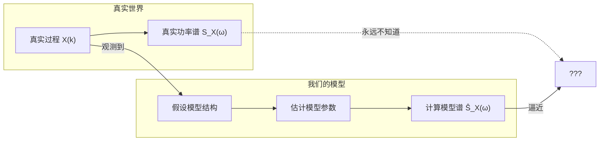
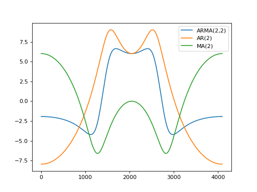

<div style="page-break-before: always; padding: 8% 8% 0 8%;">
 <h1 id="第十九讲-谱分析的参数方法" style="text-align: center; margin-bottom: 2rem; border-bottom: none;">第十九讲 谱分析的参数方法</h1> 
 <div style="display: flex; align-items: center; justify-content: center; gap: 12px; margin: 1.8rem auto;">
  <span style="flex:1; max-width:80px; height:1px; background: linear-gradient(to right, transparent, #888);"></span>
  <span style="display:inline-block; width:6px; height:6px; background:#38bdf8; border-radius:50%;"></span>
  <span style="flex:1; max-width:80px; height:1px; background: linear-gradient(to left, transparent, #888);"></span>
 </div>
</div>

## 1. 从数据驱动到模型驱动：参数化谱估计的基本思想

### 1.1 非参数化谱估计的回顾与局限性分析

在前面几篇文章中，我们系统讨论了各类谱估计方法，包括周期图法、Bartlett/Welch 分段平均法、多窗谱估计（Thomson 方法）以及 Capon 谱估计。回顾这些方法，可以发现它们共享一个共同的方法论特征：**直接对观测数据（或其相关函数）进行某种形式的傅里叶分析或线性变换，以提取频域信息**。无论采用何种窗函数、何种平均策略，其核心都是“让数据本身说话”——数据有多长，频谱就被刻画得多细；数据中有噪声，频谱就随之起伏。这类方法在信号处理理论中统称为**非参数化谱估计**。

这些方法的显著优点在于**模型无关**——它们不依赖任何关于数据生成机制的先验假设，仅从数据本身出发进行频域分析。因此，它们在广泛的应用场景中表现出良好的鲁棒性和通用性。你不需要知道信号是几个正弦波的叠加，还是某个线性系统的输出，算法都会给你一个“合理的”频谱。

然而，这种“模型无关”的特性也带来了一个根本性的局限：**频率分辨率受到 Rayleigh 准则的刚性约束**。对于长度为 \( N \) 的数据，非参数方法能够分辨的两个频率分量的最小间隔约为 \( 2\pi/N \)。这个限制不是由算法本身造成的，而是由数据的有限性在信息论意义上决定的。无论你采用多么精妙的窗函数或多窗平均策略，你都无法让 \( N \) 个数据点承载超出其信息容量的频域细节。Capon 方法虽然能在一定程度上改善分辨率（因为它利用数据协方差矩阵自适应地形成零陷），但它本质上仍然是在“数据域”里做文章——数据的长度仍然是硬约束。

### 1.2 参数化谱估计的基本思想

既然非参数方法的“天花板”来源于“不做任何假设”这一前提，那么一个自然的延伸思路就是：**如果我们对信号的生成机制做出合理的假设，是否可以突破这一限制？**

这就是参数化谱估计的出发点。其基本思想可以概括为：

> **假设观测数据是由一个已知结构的线性系统（如 AR、MA 或 ARMA 模型）产生的，然后估计该系统的参数，最后从系统传递函数中解析地计算出功率谱密度。**

我们以最常用的 AR 模型为例。假设数据满足：
$$
X(k) = -\sum_{m=1}^{p} a_m X(k-m) + W(k), \tag{19.1}
$$
其中 \( W(k) \) 是零均值白噪声，\( a_m \) 是 AR 系数，\( p \) 是模型阶数。

一旦估计出 \( a_m \)，系统的频率响应为：
$$
H(\omega) = \frac{1}{1 + \sum_{m=1}^{p} a_m e^{-j\omega m}}, \tag{19.2}
$$
功率谱密度为：
$$
S_{AR}(\omega) = \frac{\sigma^2}{|1 + \sum_{m=1}^{p} a_m e^{-j\omega m}|^2}. \tag{19.3}
$$

**这里的核心转变在于**：在非参数方法中，谱的估计完全依赖于数据长度 \( N \)；而在参数方法中，谱的分辨率由模型阶数 \( p \) 和参数估计的精度决定。在理想情况下（模型结构正确、参数估计准确），参数方法可以用较短的数据获得远超非参数方法的频率分辨率。

从信息论的角度看：参数方法假设数据由一个低阶线性系统生成，一旦估计出系统参数，频谱就能解析地计算出来，分辨率不再受数据长度的刚性约束。模型提供了外推能力——它将数据中的信息浓缩为有限个参数，从中还原出完整频谱。

当然，这种”用假设换取分辨率”的策略意味着：**如果模型结构或阶数选择不当，谱估计结果可能产生严重偏差甚至完全失效**。

### 1.3 非参数方法与参数方法的系统性对比

| 维度 | 非参数方法（直接数据域） | 参数方法（建模方法） |
| :--- | :--- | :--- |
| **核心思路** | 直接对数据做变换或滤波 | 先用模型拟合数据，再导出谱 |
| **需要的先验知识** | 极少（仅需选择窗函数或带宽） | 需要选择模型类型（AR/MA/ARMA）和阶数 \( p \) |
| **分辨率来源** | 数据长度 \( N \)（Rayleigh 极限 \(\approx 2\pi/N\)） | 模型阶数 \( p \) 和参数估计精度（**可突破 Rayleigh 极限**） |
| **短数据性能** | 差（分辨率严重下降） | **较好**（模型提供外推能力） |
| **计算复杂度** | 通常较低（依赖 FFT） | 中等（需解 Yule-Walker 或最小二乘） |
| **模型误差风险** | 无（直接处理数据） | **有**（模型假设错误会导致严重偏差） |
| **对参数选择的敏感度** | 低 | **高**（阶数 \( p \) 选错会导致性能崩盘） |
| **典型代表** | 周期图、Welch、多窗、Capon | AR 谱估计（Burg、Yule-Walker）、MUSIC、ESPRIT |

### 1.4 参数化方法的代价：模型选择与风险

既然参数方法在短数据和分辨率上有如此显著的优势，为什么不全用参数方法？

答案是：**参数方法把“选择权”从数据转移到了模型上——你必须有足够的先验知识去选择正确的模型结构和阶数。** 这不是简单的参数估计问题，而是模型选择问题，其难度往往被低估。

- **阶数选择过低的后果**：谱被过度平滑，分辨率不足，无法分辨靠近的频率分量——这相当于欠拟合。
- **阶数选择过高的后果**：谱出现虚假峰值，产生完全不存在于信号中的频率分量——这相当于过拟合。
- **模型类型错误的后果**：如果数据实际上是由 MA 过程或 ARMA 过程产生的，你却强行用 AR 模型去拟合，结果可能完全偏离真实情况。

因此，参数方法在实际应用中面临的核心问题已经不再是”如何估计参数”，而是”如何选择模型”。这是参数化谱估计的核心挑战。

## 2. 有理谱与线性模型

### 2.1 有理谱模型

从数据 \(\{X(k)\}_{k=0}^{N-1}\) 出发，我们的目标是估计其功率谱密度 \(S_X(\omega)\)。然而，我们无法直接从有限数据中获得唯一的连续谱——信息不足，数学上是不适定的。因此，我们必须引入额外的信息。这个额外的信息，就是**模型**。

> **模型是人为假设的，数据才是客观事实。**

所有模型都是对数据生成机制的一种**人为假设**。选择某个模型，不是因为它天然正确，而是因为它**足够灵活**（能逼近各种谱形）、**足够简单**（参数少、可计算），并且在工程实践中**足够有效**。



这个流程图告诉我们：我们永远无法知道真实的功率谱密度 \(S_X(\omega)\)，我们只能根据观测数据构造一个模型，然后用这个模型的谱去**逼近**真实谱。这个逼近的质量取决于模型的合理性和参数估计的准确性。

---

#### 2.1.1 第一步：有理谱——用有理函数逼近任意谱

因为我们不知道真实的谱是什么形状，我们需要一种方法能够刻画尽可能广泛的谱形。这个方法需要满足两个要求：

1. **普遍适用（universal）**：能够逼近任意形状的功率谱密度；
2. **简单（simple）**：参数数量有限，计算可行。

**有理谱** 就是满足这两个要求的自然选择。我们将功率谱密度表示为两个多项式之比：
$$
S_X(\omega) = \frac{P(\omega)}{Q(\omega)}, \tag{19.4}
$$
其中：
$$
P(\omega) = \sum_{k=0}^{p} p_k e^{-j\omega k}, \qquad Q(\omega) = 1 + \sum_{k=1}^{q} q_k e^{-j\omega k}. \tag{19.5}
$$

由于功率谱密度必须是非负的，即 \(S_X(\omega) \ge 0\)，有理谱也可以等价地写成模平方的形式：
$$
S_X(\omega) = \left| \frac{B(\omega)}{A(\omega)} \right|^2 \ge 0, \tag{19.6}
$$
其中 \(A(\omega)\) 和 \(B(\omega)\) 是有限阶多项式。

为什么有理谱是“普遍适用”的？因为任何连续函数都可以用有理函数以任意精度逼近（这是 Weierstrass 逼近定理的推广）。通过选择足够高的分子分母阶数，有理谱可以逼近任意形状的功率谱密度。这就是有理谱的“universal”所在。

---

#### 2.1.2 第二步：从有理谱到随机过程生成模型

假设分子分母的常数项都归一化为 1（这可以通过调整分子分母的系数来实现），我们可以进一步将 (2.3) 写成：
$$
S_X(\omega) = \sigma^2 \left| \frac{B(\omega)}{A(\omega)} \right|^2, \tag{19.7}
$$
其中 \(\sigma^2 > 0\) 是一个常数。

这个表达式让我们想起宽平稳随机过程通过 LTI 系统后的功率谱密度关系：
$$
S_Y(\omega) = |H(\omega)|^2 S_X(\omega). \tag{19.63}
$$

如果我们把 \(\sigma^2\) 看作某个随机过程的功率谱密度，把 \(\frac{A(\omega)}{B(\omega)}\) 看作一个 LTI 系统的传递函数，那么 (2.4) 描述的正好是：**一个功率谱密度为常数（即白噪声）的随机过程，通过一个传递函数为 \(A(\omega)/B(\omega)\) 的 LTI 系统后的输出功率谱密度。**

因此，我们可以构造如下的随机过程生成模型：

> **一个零均值白噪声序列 \(e(k)\)（功率谱密度为 \(\sigma^2\)）通过一个 LTI 系统 \(H(z) = A(z)/B(z)\)，产生的输出 \(X(k)\) 的功率谱密度正好等于 \(S_X(\omega)\)。**

写成差分方程：
$$
X(k) = H(z) \, e(k), \qquad H(z) = \frac{B(z)}{A(z)}. \tag{19.8}
$$

其中：
$$
A(z) = \sum_{k=0}^{m-1} \alpha_k z^k, \qquad B(z) = \sum_{k=0}^{n-1} \beta_k z^k, \qquad \alpha_0 = 1, \ \beta_0 = 1. \tag{19.9}
$$

这里：
- \(A(z)\) 的零点对应传递函数的零点（影响谱的凹谷）；
- \(B(z)\) 的零点对应传递函数的极点（影响谱的峰值，决定共振峰）；
- \(m\) 是分子阶数（MA 部分），\(n\) 是分母阶数（AR 部分）；
- \(\alpha_0 = \beta_0 = 1\) 是归一化条件，保证传递函数的常数项为 1。

(2.6) 描述的模型被称为 **ARMA (AutoRegressive Moving Average) 模型**：
$$
X(k) + \beta_1 X(k-1) + \cdots + \beta_{n-1} X(k-n+1) \\
= e(k) + \alpha_1 e(k-1) + \cdots + \alpha_{m-1} e(k-m+1). \tag{19.10}
$$

- 当 \(m = 1\)（分子为常数）时，模型退化为 **AR (AutoRegressive) 模型**——只有分母；
- 当 \(n = 1\)（分母为常数）时，模型退化为 **MA (Moving Average) 模型**——只有分子。

这三种模型（AR、MA、ARMA）构成了参数化谱估计的核心工具集。它们的谱表达式分别对应不同类型的有理谱：AR 模型对应全极点谱（适合有尖锐峰值的谱），MA 模型对应全零点谱（适合有深凹谷的谱），ARMA 模型对应既有极点又有零点的谱。


### 2.2 模型参数估计

接下来我们要做的事情就是用观测数据 \(\{X(k)\}_{k=1}^N\) 去估计模型参数 \(\{\alpha_k\}_{k=0}^{m-1}\) 和 \(\{\beta_k\}_{k=0}^{n-1}\)。所谓参数化方法，就是用观测数据去拟合模型参数，使模型的谱密度尽可能接近真实谱，而不是直接用观测数据去计算谱密度。

我们还需要估计模型的阶数 \((m, n)\)，但目前没有太多理论方法可以直接确定阶数，通常只能通过实验或信息准则（如 AIC、BIC）来辅助选择。

$$
\overset{\text{ARMA}(m-1, n-1)}{\boxed{
\underbrace{X(k) + \sum_{i=1}^{m-1} \alpha_i X(k-i)}_{\text{自回归（AR）部分}}
=
\underbrace{e(k) + \sum_{i=1}^{n-1} \beta_i e(k-i)}_{\text{移动平均（MA）部分}}
}}
\tag{19.11}
$$

其中 \(e(k)\) 是零均值白噪声，方差为 \(\sigma^2\)。

**关于 ARMA 阶数的说明**：在 ARMA 模型的记法中，\((m-1, n-1)\) 的含义是：
- **AR 阶数** \(p = m-1\)：表示自回归部分的阶数，即用过去 \(p\) 个观测值来预测当前值。参数个数为 \(p\)（即 \(\alpha_1, \dots, \alpha_p\)），对应分母多项式 \(A(z) = 1 + \alpha_1 z^{-1} + \cdots + \alpha_p z^{-p}\) 的系数。如果 \(p=0\)，则模型没有 AR 部分，退化为纯 MA 模型。
- **MA 阶数** \(q = n-1\)：表示移动平均部分的阶数，即当前白噪声与过去 \(q\) 个白噪声的线性组合。参数个数为 \(q\)（即 \(\beta_1, \dots, \beta_q\)），对应分子多项式 \(B(z) = 1 + \beta_1 z^{-1} + \cdots + \beta_q z^{-q}\) 的系数。如果 \(q=0\)，则模型没有 MA 部分，退化为纯 AR 模型。

在实际应用中，阶数 \(p\) 和 \(q\) 的选择直接影响模型的复杂度和谱估计的质量：
- 如果阶数选得太低，模型无法充分刻画数据的相关性结构，谱估计会被过度平滑，丢失细节（欠拟合）。
- 如果阶数选得太高，模型会过度拟合数据中的噪声，产生虚假的谱峰（过拟合）。

阶数选择的常用方法包括 AIC（Akaike Information Criterion）和 BIC（Bayesian Information Criterion），它们通过在似然函数上施加惩罚项来平衡模型拟合度与复杂度：
$$
\text{AIC}(p,q) = -2\log L + 2(p+q), \qquad \text{BIC}(p,q) = -2\log L + (p+q)\log N,
$$
其中 \(L\) 是模型的最大似然值，\(N\) 是数据长度。AIC 倾向于选择预测误差最小的模型，而 BIC 对高阶模型的惩罚更重，在大样本下具有一致性。

在确定了阶数之后，才能进行参数估计；而参数估计的精度又反过来依赖于阶数选择的合理性。因此，阶数选择与参数估计构成了 ARMA 建模中两个相互关联的核心步骤。

**这个公式的含义是什么？**

左边是**自回归（AR）部分**：当前时刻的观测值 \(X(k)\) 加上过去 \(p\) 个观测值的线性组合。它反映了信号当前值与过去值之间的依赖关系。如果某时刻出现一个异常值，这种依赖关系会使后续时刻受到影响并逐渐衰减。

右边是**移动平均（MA）部分**：当前时刻的白噪声 \(e(k)\) 加上过去 \(q\) 个白噪声的线性组合。它反映了外部随机冲击对当前观测值的影响。白噪声的每一个冲击会独立地影响当前和未来若干个时刻的观测值。

为什么这样分解？因为任何一个平稳随机过程都可以用 ARMA 模型来逼近：AR 部分捕捉信号内部的长期记忆和自相关性，MA 部分捕捉外部随机冲击的短期影响。两者结合，可以描述极为广泛的随机现象——从语音信号（强自相关）到金融时间序列（冲击衰减）。

我们对这个线性系统提一个合理的要求：它是**最小相位系统**，即系统的极点和零点都在单位圆内（\(|z| < 1\)）。为什么要求极点和零点都在单位圆内？

- **因果性（Causality）**：系统的输出只依赖于当前和过去的输入，不依赖于未来的输入。在 AR 模型中，因果性是天然成立的——因为 \(X(k)\) 只依赖于过去的 \(X(k-i)\) 和当前的 \(e(k)\)，不含任何未来的 \(X\)。这是 AR 模型在实际中广泛应用的重要原因之一：它不需要未来数据，适合在线实时处理。对于 ARMA 或 MA 模型，因果性同样要求传递函数的极点都在单位圆内。

- **稳定性（Stability）**：极点位置决定系统的稳定性。如果极点都在单位圆内，系统的冲激响应随时间的增加而衰减，系统是 BIBO（有界输入有界输出）稳定的。如果某个极点在单位圆上或外部，冲激响应不会衰减，系统就不稳定。

- **可逆性（Invertibility）**：零点位置决定系统的可逆性。如果零点都在单位圆内，逆系统（即 \(1/H(z)\)）也是因果稳定的——这意味着我们可以从输出信号恢复输入信号，对于信道均衡、语音去卷积等应用至关重要。如果某个零点在单位圆上或外部，逆系统就不稳定。

两个特殊情况：

- 当 \(n=1\) 时，MA 部分退化为 \(e(k)\)，模型退化为 **AR(p) 模型**（其中 \(p = m-1\)）：
  $$
  X(k) + \sum_{i=1}^{p} \alpha_i X(k-i) = e(k). \tag{19.12}
  $$
  此时谱密度是全极点的形式，适合描述具有尖锐峰值的谱（如语音共振峰、雷达回波）。由于 AR 模型天然具有因果性（输出只依赖过去），它特别适合实时预测和在线估计。

- 当 \(m=1\) 时，AR 部分退化为 \(X(k)\)，模型退化为 **MA(q) 模型**（其中 \(q = n-1\)）：
  $$
  X(k) = e(k) + \sum_{i=1}^{q} \beta_i e(k-i). \tag{19.13}
  $$
  此时谱密度是全零点的形式，适合描述具有深凹谷的谱（如某些通信信道）。MA 模型的因果性同样要求极点都在单位圆内，但由于 MA 模型没有极点（分母为常数），因果性自动满足，只需关注其可逆性即可。

AR 和 MA 分别对应有理谱的两种极端情况——全极点和全零点。ARMA 模型则是两者的结合，能够描述更广泛的谱形：既有尖锐峰又有深凹谷的谱（如某些声学系统、复杂信道）。在实际应用中，选择哪种模型取决于信号本身的特性以及我们对计算复杂度和参数可辨识性的考量。



## 3. AR 模型

$$
X(k) + \sum_{i=1}^{p} \alpha_i X(k-i) = e(k).
$$

### 3.1 相关性分析与 Yule-Walker 方程

**为什么要做相关性分析？**

AR 模型的参数 \(\{\alpha_i\}_{i=1}^{p}\) 是未知的，我们需要从观测数据中估计它们。但直接估计这些参数并不容易——我们无法直接观测到白噪声 \(e(k)\)，只能观测到 \(X(k)\)。相关性分析的作用是：**将未知的 AR 系数与可观测的自相关函数 \(r_l\) 联系起来**，从而把“估计 AR 系数”的问题转化为“求解一组线性方程”的问题。这组线性方程的解就是 AR 系数的估计值。

具体来说，我们从 AR 模型方程出发，将其两边分别乘以 \(X(k-l)\) 并取期望，利用白噪声与过去观测值的正交性，就可以建立 \(r_l\) 与 \(\alpha_i\) 之间的线性关系。这正是 Yule-Walker 方程的来源，也是 AR 模型参数估计的核心步骤。

---

**推导过程**：

设 \(e(k)\) 是零均值白噪声，方差为 \(\sigma^2\)：
$$
\mathbb{E}[e^2(k)] = \sigma^2. \tag{19.14}
$$

**（1）\(l=0\) 的情况**

将 (19.12) 两边乘以 \(X(k)\) 并取期望：
$$
\mathbb{E}[X(k)X(k)] + \sum_{i=1}^{p} \alpha_i \mathbb{E}[X(k-i)X(k)] = \mathbb{E}[e(k)X(k)]. \tag{19.15}
$$

根据自相关函数的定义 \(r_l = \mathbb{E}[X(k)X(k-l)]\)，有：
- \(\mathbb{E}[X(k)X(k)] = r_0\)；
- \(\mathbb{E}[X(k-i)X(k)] = \mathbb{E}[X(k)X(k-i)] = r_i\)。

右边 \(\mathbb{E}[e(k)X(k)]\)：因为 \(e(k)\) 与过去时刻的观测值不相关，但 \(X(k)\) 由当前白噪声 \(e(k)\) 和过去观测值共同决定，其中包含当前白噪声的贡献，所以 \(\mathbb{E}[e(k)X(k)] = \sigma^2\)。这个等式的成立基于 AR 模型的因果性假设——\(X(k)\) 由 \(e(k)\) 及更早的白噪声构成，因此 \(e(k)\) 与 \(X(k)\) 相关，且相关系数为 1。

于是 (19.15) 化为：
$$
r_0 + \sum_{i=1}^{p} \alpha_i r_i = \sigma^2. \tag{19.16}
$$

---

**（2）\(l \ge 1\) 的情况**

将 (19.12) 两边乘以 \(X(k-l)\)（\(l \ge 1\)）并取期望：
$$
\mathbb{E}[X(k)X(k-l)] + \sum_{i=1}^{p} \alpha_i \mathbb{E}[X(k-i)X(k-l)] = \mathbb{E}[e(k)X(k-l)]. \tag{19.17}
$$

根据自相关函数的定义：
- \(\mathbb{E}[X(k)X(k-l)] = r_l\)；
- \(\mathbb{E}[X(k-i)X(k-l)] = r_{l-i}\)。

右边 \(\mathbb{E}[e(k)X(k-l)]\)：因为 \(X(k-l)\) 只依赖于 \(e(k-l), e(k-l-1), \dots\)，而不依赖于 \(e(k)\)（由于因果性，未来的白噪声不影响过去的观测值），所以：
$$
\mathbb{E}[e(k)X(k-l)] = 0, \quad l \ge 1. \tag{19.18}
$$

于是 (19.17) 化为：
$$
r_l + \sum_{i=1}^{p} \alpha_i r_{l-i} = 0, \quad l = 1, 2, \dots, p. \tag{19.19}
$$

---

**（3）矩阵形式**

将 (19.16) 和 (19.19) 合并写成矩阵形式：

$$
\begin{pmatrix}
r_0 & r_1 & \cdots & r_p \\
r_1 & r_0 & \cdots & r_{p-1} \\
\vdots & \vdots & \ddots & \vdots \\
r_p & r_{p-1} & \cdots & r_0
\end{pmatrix}
\begin{pmatrix}
1 \\
\alpha_1 \\
\vdots \\
\alpha_p
\end{pmatrix}
=
\begin{pmatrix}
\sigma^2 \\
0 \\
\vdots \\
0
\end{pmatrix}. \tag{19.20}
$$

这个方程称为 **Yule-Walker 方程**，也常被称为 **Wiener-Hopf 方程**（在离散时间平稳过程的上下文中，两者指同一组方程）。左边的矩阵是 Toeplitz 矩阵（每条对角线上的元素相同），并且是对称的（因为 \(r_{-l} = r_l\)）。

关于 (19.20) 需要注意一点：这里的矩阵是 \((p+1) \times (p+1)\) 的，第一行对应 \(l=0\) 的方程，其余行对应 \(l=1,\dots,p\) 的方程。我们通常只需要解出 \(\alpha_1, \dots, \alpha_p\)，而 \(\sigma^2\) 可以由第一行方程直接算出。

**解法回顾**：

由于这是 Toeplitz 矩阵，我们不需要用高斯消元法（\(O(p^3)\)），而可以使用 **Levinson-Durbin 递推** 以 \(O(p^2)\) 的复杂度高效求解。这是我们前面已经学过的内容，这里不再赘述。

**关键点**：在 (19.20) 中，左边矩阵的第一行是 \((r_0, r_1, \dots, r_p)\)，不是 \((r_0, r_{-1}, \dots, r_{-p})\)。由于实信号的 \(r_{-l} = r_l\)，两者等价。使用这个形式是为了与常见的 Yule-Walker 方程表达一致。

### 3.2 最小二乘解释

#### 3.2.1 最小二乘与 AR 模型的等价性

根据 AR 模型，我们可以构造一个最小二乘问题：
$$
\min_{\{\alpha_i\}} \mathbb{E}\left| X(k) + \sum_{i=1}^{p} \alpha_i X(k-i) \right|^2. \tag{19.21}
$$

一个很自然的疑问是：**这个最小二乘问题的解，真的和 AR 模型是等价的吗？**

初看起来，这似乎完全是两回事：

- **AR 模型的定义**：\( X(k) + \sum_{i=1}^{p} \alpha_i X(k-i) = e(k) \)，其中 \( e(k) \) 是白噪声。这是在说“当前值与过去值的某种线性组合，其结果是白噪声”。
- **最小二乘问题**：我们在最小化 \( X(k) + \sum_{i=1}^{p} \alpha_i X(k-i) \) 的均方值。这是在说“找一个系数组合，使得组合后的能量最小”。

表面上看，两者不同：一个要求结果是白噪声，另一个只要求能量最小。它们为何等价？

在信号处理中反复出现一个结论：**只要预测误差是白噪声，就等价于在做最小二乘（或最大似然估计）**。这是由正交性原理决定的。

---

#### 3.2.2 从最优线性预测到正交性

我们先从最优线性预测的角度出发。假设我们用过去 \( p \) 个样本 \( X(k-1), \dots, X(k-p) \) 来预测当前值 \( X(k) \)，预测器为：
$$
\hat{X}(k) = -\sum_{i=1}^{p} \alpha_i X(k-i). \tag{19.22}
$$

预测误差为：
$$
e(k) = X(k) - \hat{X}(k) = X(k) + \sum_{i=1}^{p} \alpha_i X(k-i). \tag{19.23}
$$

这正是 (19.21) 中的被最小化的量。我们的目标是最小化 \( \mathbb{E}[e^2(k)] \)。

根据正交性原理，**最优线性预测的残差必须与所有用于预测的数据正交**：
$$
\mathbb{E}[e(k) X(k-l)] = 0, \quad l = 1, 2, \dots, p. \tag{19.24}
$$

这个正交条件具有深刻的含义：它意味着预测误差 \( e(k) \) 与过去的所有观测值 \( X(k-1), \dots, X(k-p) \) 都不相关。换句话说，**\( e(k) \) 中不包含任何可以从过去数据中线性预测出来的成分**——所有的可预测信息都已经被提取出来了，剩下的 \( e(k) \) 是“新的”、“干净的”信息。

这正是**白噪声的定义**：一个随机过程若与所有过去的观测值不相关，则在宽平稳的意义上它就是白噪声（或至少是白噪声的等价形式）。因此：
$$
\text{正交性条件} \iff e(k) \text{ 是白噪声}. \tag{19.25}
$$

---

#### 3.2.3 AR 模型与最优线性预测的等价性

我们还可以从另一个方向来理解这个等价关系。

**方向一：AR 模型 → 最优线性预测**

假设数据满足 AR 模型 \( X(k) + \sum_{i=1}^{p} \alpha_i X(k-i) = e(k) \)，其中 \( e(k) \) 是白噪声。那么：
$$
X(k) = -\sum_{i=1}^{p} \alpha_i X(k-i) + e(k). \tag{19.26}
$$
这意味着 \( -\sum_{i=1}^{p} \alpha_i X(k-i) \) 是 \( X(k) \) 的一个线性预测。由于 \( e(k) \) 与过去数据不相关，这个预测的误差是白噪声。根据正交性原理，**白噪声误差是最优线性预测的标志**——任何其他的线性预测，其残差要么与过去数据相关（意味着还有信息未被提取），要么误差方差更大。因此，AR 模型的系数 \( \{\alpha_i\} \) 就是最优线性预测系数。

**方向二：最优线性预测 → AR 模型**

反过来，假设我们用最优线性预测得到 \( \hat{X}(k) = -\sum_{i=1}^{p} \alpha_i X(k-i) \)，预测误差为 \( e(k) \)。根据正交性原理，\( e(k) \) 与过去数据正交，即白噪声。于是我们得到：
$$
X(k) = -\sum_{i=1}^{p} \alpha_i X(k-i) + e(k), \tag{19.27}
$$
其中 \( e(k) \) 是白噪声。这正是 AR 模型的定义。

因此，AR 模型和最优线性预测是**完全等价**的：AR 模型本质上就是在说“最优线性预测的误差是白噪声”。这个等价关系的纽带，就是正交性原理。

---

#### 3.2.4 最小二乘解与 Yule-Walker 方程

由正交性条件 (19.24)，我们可以直接导出 AR 系数的方程：
$$
\mathbb{E}\left[ \left( X(k) + \sum_{i=1}^{p} \alpha_i X(k-i) \right) X(k-l) \right] = 0, \quad l = 1, 2, \dots, p. \tag{19.28}
$$

展开：
$$
r_l + \sum_{i=1}^{p} \alpha_i r_{l-i} = 0, \quad l = 1, 2, \dots, p. \tag{19.29}
$$

这正是我们之前得到的 Yule-Walker 方程 (19.19)。因此，**最小二乘解（正交性条件）直接导出了 Yule-Walker 方程**。这意味着：最小二乘估计的系数就是 Yule-Walker 方程的解，而 Yule-Walker 方程的解恰好使预测误差的均方值最小化。

---

### 3.3 AR 模型的谱

#### 3.3.1 尖峰特性：AR 模型的全极点结构

AR 模型的功率谱密度为：
$$
S_{AR}(\omega) = \frac{\sigma^2}{\left| 1 + \sum_{i=1}^{p} \alpha_i e^{-j\omega i} \right|^2}. \tag{19.30}
$$

这个表达式有一个显著的特征：**分母是多项式，分子是常数**。这意味着，谱的形状完全由分母多项式的零点决定。当频率 \(\omega\) 接近分母多项式的某个零点时，分母趋近于零，谱密度急剧上升，形成一个**尖峰**。

这就是 AR 模型谱的核心特征：**天生擅长产生尖锐的峰值**。在语音信号中，这对应共振峰；在雷达回波中，对应目标的 Doppler 频率；在振动分析中，对应机械结构的固有频率。

与非参数方法（如周期图）相比，AR 谱的尖峰要尖锐得多。周期图的峰值高度受限于数据长度——数据只有 \(N\) 个点，峰值宽度不可能小于 \(2\pi/N\)。而 AR 模型一旦估计出系数，谱的分辨率由模型阶数 \(p\) 决定，而不是数据长度 \(N\)。理论上，只要阶数足够高，AR 谱可以产生任意尖锐的峰。

这种尖锐性带来的直接收益是：**两个靠得很近的频率分量，在 AR 谱中可能被清晰分开，而在周期图中则混在一起无法分辨**。这正是 AR 谱估计在短数据和高分辨率应用中被广泛使用的原因。

然而，这种尖锐性也有代价。

---

#### 3.3.2 伪峰：阶数过高引起的虚假谱峰

如果我们选择的阶数 \(p\) 过高，AR 模型会“强行”把数据中的噪声也拟合成尖峰。结果就是：**谱中出现了一些并不存在的频率成分**——这就是“伪峰”（spurious peaks）。

为什么会出现伪峰？因为 AR 模型是**全极点模型**，它的谱天生倾向于产生尖峰。当你给模型一个过高的阶数时，模型有了足够的自由度去拟合数据中的每一个细节——包括噪声的随机波动。这些波动在非参数方法中会被视为“毛刺”而被忽略，但在 AR 模型中，它们会被“解读”为尖峰。

这就好比一个画家，你给他的画笔越细、颜色越多，他越容易在画布上画出一些本来不存在的细节——看似精致，实则失真。

**更严重的问题**：伪峰的位置是完全错误的。它不是真实信号频率的近似，而是噪声波动的”放大版”。这意味着你不能通过”这个峰看起来很高”来判断它是否真实——伪峰的高度往往和真实峰一样高，甚至更高。简言之：**AR 模型在阶数过高时会产生虚假的频率信息。**

---

#### 3.3.3 阶数选择的风险与权衡

| 阶数选择 | 谱的表现 | 风险 |
| :--- | :--- | :--- |
| **阶数过低（欠拟合）** | 谱被过度平滑，峰值模糊 | 遗漏真实频率分量，分辨率不足 |
| **阶数适中** | 谱清晰，峰值准确 | 风险最低，需要正确的阶数选择准则 |
| **阶数过高（过拟合）** | 谱出现虚假尖峰 | 伪峰位置完全错误，误导分析结果 |

这个权衡的本质在于：AR 模型的结构（全极点）决定了它“倾向于产生尖峰”。当你给模型一个过高的阶数，它不是在“发现”数据中的频率，而是在“创造”频率来拟合数据。这些被创造出来的频率，在物理意义上没有任何真实性。

这也是为什么 AR 谱估计在实际应用中始终伴随着一个核心难题：**阶数选择**。

---

#### 3.3.4 应对策略

应对伪峰风险的方法主要有三个方向：

1. **使用信息准则（AIC、BIC）**：在模型拟合度和复杂度之间自动寻找平衡点。AIC 和 BIC 都会对高阶模型施加惩罚，防止过拟合。其中 BIC 的惩罚更重，在大样本下具有一致性，倾向于选择更简约的模型。

2. **残差白化检验**：检查 AR 模型的残差是否真的是白噪声。如果残差中仍然存在相关性，说明阶数不足；如果残差已经是白噪声，继续增加阶数只会拟合噪声。

3. **交叉验证**：将数据分成训练集和验证集，选择在验证集上预测误差最小的阶数。

在实际操作中，通常会将多种方法结合使用：用 AIC/BIC 给出一个初始选择，然后通过残差分析和目视检查来最终确认。

> **AR 模型的谱天生擅长产生尖峰——这既是它高分辨率的来源，也是它过拟合风险的根源。正确选择阶数，尖峰代表真实频率；阶数选错，尖峰就是模型的谎言。**


### 3.4 AR 模型的谱：详细推导

#### 3.4.1 从 AR 模型到功率谱密度

AR 模型的定义为：
$$
X(k) + \sum_{i=1}^{p} \alpha_i X(k-i) = e(k),
$$

其中 \( e(k) \) 是零均值白噪声，方差为 \( \sigma^2 \)。

我们要从 (19.30) 推导出功率谱密度的表达式。

---

**步骤 1：对 AR 方程做 Z 变换**

对 (19.30) 两边做 Z 变换（设 \( X(z) \) 和 \( E(z) \) 分别为 \( X(k) \) 和 \( e(k) \) 的 Z 变换）：
$$
X(z) + \sum_{i=1}^{p} \alpha_i z^{-i} X(z) = E(z). \tag{19.31}
$$

提取公因子 \( X(z) \)：
$$
\left( 1 + \sum_{i=1}^{p} \alpha_i z^{-i} \right) X(z) = E(z). \tag{19.32}
$$

因此，系统的传递函数为：
$$
H(z) = \frac{X(z)}{E(z)} = \frac{1}{1 + \sum_{i=1}^{p} \alpha_i z^{-i}}. \tag{19.33}
$$

---

**步骤 2：在单位圆上求频率响应**

功率谱密度是传递函数在单位圆上的模平方乘以输入噪声的功率谱密度。将 \( z = e^{j\omega} \) 代入 (19.33)：
$$
H(e^{j\omega}) = \frac{1}{1 + \sum_{i=1}^{p} \alpha_i e^{-j\omega i}}. \tag{19.34}
$$

---

**步骤 3：利用线性系统输入输出关系**

白噪声 \( e(k) \) 的功率谱密度是常数：
$$
S_e(\omega) = \sigma^2, \quad \forall \omega. \tag{19.35}
$$

对于线性时不变系统，输入输出功率谱密度的关系为：
$$
S_X(\omega) = |H(e^{j\omega})|^2 S_e(\omega). \tag{19.36}
$$

代入 (19.34) 和 (19.35)：
$$
S_X(\omega) = \left| \frac{1}{1 + \sum_{i=1}^{p} \alpha_i e^{-j\omega i}} \right|^2 \cdot \sigma^2. \tag{19.37}
$$

---

**步骤 4：最终表达式**

由于模平方的倒数等于倒数绝对值的平方，即：
$$
\left| \frac{1}{A} \right|^2 = \frac{1}{|A|^2}. \tag{19.38}
$$

因此：
$$
\boxed{ S_X(\omega) = \frac{\sigma^2}{\left| 1 + \sum_{i=1}^{p} \alpha_i e^{-j\omega i} \right|^2} }. \tag{19.39}
$$

这就是 AR 模型功率谱密度的闭式表达式。

---

#### 3.4.2 推导过程中的几点说明

**1. 为什么传递函数是 \( 1 / \text{多项式} \)？**

因为 AR 模型是“全极点”模型——它只有分母，没有分子（分子为常数 1）。这决定了 AR 谱的形状由分母多项式的零点决定，因此会产生尖峰。

**2. 为什么白噪声的功率谱密度是常数 \( \sigma^2 \)？**

白噪声的定义是：在所有频率上功率谱密度相同。由 Wiener-Khinchine 定理，白噪声的自相关函数为 \( r_e(l) = \sigma^2 \delta_{l,0} \)，其傅里叶变换为常数 \( \sigma^2 \)。

**3. 实际计算时如何用？**

在实际应用中，我们先用 Yule-Walker 方程或 Burg 算法估计出 AR 系数 \( \{\alpha_i\}_{i=1}^{p} \) 和噪声方差 \( \sigma^2 \)，然后直接代入 (19.39) 计算谱密度：
$$
\hat{S}_{AR}(\omega) = \frac{\hat{\sigma}^2}{\left| 1 + \sum_{i=1}^{p} \hat{\alpha}_i e^{-j\omega i} \right|^2}. \tag{19.40}
$$

通常我们在离散频率点 \( \omega_k = 2\pi k/N \)（\( k = 0, 1, \dots, N-1 \)）上计算，得到离散化的 AR 谱估计。

---

#### 3.4.3 从自相关到谱的另一种推导方式（补充）

前面我们看到，Yule-Walker 方程为：

$$
\begin{pmatrix}
r_0 & r_1 & \cdots & r_p \\
r_1 & r_0 & \cdots & r_{p-1} \\
\vdots & \vdots & \ddots & \vdots \\
r_p & r_{p-1} & \cdots & r_0
\end{pmatrix}
\begin{pmatrix}
1 \\
\alpha_1 \\
\vdots \\
\alpha_p
\end{pmatrix}
=
\begin{pmatrix}
\sigma^2 \\
0 \\
\vdots \\
0
\end{pmatrix}. \tag{19.41}
$$

实际上，如果我们把 AR 谱的表达式 (19.39) 展开，可以看到它正是自相关函数 \( r_l \) 的 Z 变换。也就是说，Yule-Walker 方程的解 \( \{\alpha_i\} \) 和 \( \sigma^2 \) 决定了谱的形状，而谱的傅里叶反变换又恢复出自相关函数。这正是 AR 建模的核心：**用 \( p+1 \) 个参数（\( p \) 个 AR 系数加 \( \sigma^2 \)）来完全描述整个功率谱密度。**


### 3.5 AR 的谱和 Capon 谱之间的关系

在本节中，我们将揭示一个深刻的结果：**Capon 谱估计可以表示为不同阶 AR 谱估计的调和平均**。这个关系式将我们之前学过的两种谱估计方法——参数化的 AR 谱和自适应滤波的 Capon 谱——联系在了一起。

AR 谱的表达式为：
$$
S_X(\omega) = \frac{\sigma^2}{\left| 1 + \sum_{i=1}^{m-1} \alpha_i e^{-j\omega i} \right|^2}. \tag{19.42}
$$

为了建立与 Capon 谱的关系，我们需要引入 AR 系数的矩阵结构。定义 \( \alpha^{k} \) 表示 \( k \) 阶 AR 模型的系数向量。

Yule-Walker 方程的矩阵形式可以堆叠成如下形式：

$$
\begin{pmatrix}
r_0 & r_1 & \cdots & r_p \\
r_1 & r_0 & \cdots & r_{p-1} \\
\vdots & \vdots & \ddots & \vdots \\
r_{m-1} & r_{m-2} & \cdots & r_0
\end{pmatrix}
\begin{pmatrix}
1 &  &  \\
\alpha_1^{m-1} & 1  &  0  \\
\alpha_2^{m-2} & \alpha_1^{m-2} \\
\vdots & \vdots & \ddots \\
\alpha_{m-1}^{m-1} & \alpha_{m-2}^{m-2} & \cdots & 1
\end{pmatrix} \\
=
\begin{pmatrix}
\sigma^2 & & & 0 \\
 & \sigma^2 \\
 & & \ddots  \\
0 & & & \sigma^2
\end{pmatrix}. \tag{19.43}
$$

这个矩阵方程的含义是：左边的 Toeplitz 自相关矩阵 \( R_X \) 乘以一个下三角矩阵 \( H \)，其中 \( H \) 的每一列对应不同阶 AR 模型的系数（第一列为常数 1，后续列为各阶 AR 系数），得到的结果是一个对角矩阵，对角线元素为 \( \sigma^2 \)。换句话说，这个方程同时包含了所有阶数（从 0 到 \( m-1 \)）的 Yule-Walker 方程。

简记为：
$$
R_X H = U, \qquad U = \sigma^2 I. \tag{19.44}
$$

这里 \( U \) 是一个对角矩阵，对角线元素均为 \( \sigma^2 \)。

接下来，对 (19.44) 两边左乘 \( H^T \)：
$$
H^T R_X H = H^T U. \tag{19.45}
$$

由于 \( U \) 是对角矩阵，且 \( H \) 是下三角矩阵（对角线为 1），\( H^T U \) 的结果是一个上三角矩阵。记作 \( \tilde{U} = H^T U \)。我们知道矩阵的迹在相似变换下不变，因此：
$$
\operatorname{tr}(U) = \operatorname{tr}(\tilde{U}) = \operatorname{diag}(\sigma^2, \sigma^2, \dots, \sigma^2). \tag{19.46}
$$

这意味着 \( \tilde{U} \) 的对角线元素也是 \( \sigma^2 \)。但 \( \tilde{U} \) 的具体形式并不重要，关键是我们可以利用这个关系来反解 \( R_X \)。

由 (19.44)，因为 \( H \) 是可逆的（下三角矩阵，对角线为 1，行列式为 1），我们有：
$$
R_X = U H^{-1} = \sigma^2 I \cdot H^{-1} = \sigma^2 H^{-1}.
$$

等一下，这里需要仔细检查一下：从 \( R_X H = U \) 得到 \( R_X = U H^{-1} \)。由于 \( U = \sigma^2 I \)，所以 \( R_X = \sigma^2 H^{-1} \)。但我们需要的是 \( R_X^{-1} \)，所以：
$$
R_X^{-1} = \frac{1}{\sigma^2} H. \tag{19.47}
$$

但为了得到对称形式，我们通常写成：
$$
R_X = H \operatorname{diag}(\sigma^2, \sigma^2, \cdots, \sigma^2) H^T. \tag{19.48}
$$

这个形式的合理性在于：因为 \( R_X \) 是对称的，所以必须写成 \( H D H^T \) 的形式，其中 \( D \) 是对角矩阵。由于 \( H^T R_X H = \sigma^2 I \)，我们有：
$$
R_X^{-1} = \frac{1}{\sigma^2} H H^T. \tag{19.49}
$$

现在，我们回顾 Capon 谱的表达式：
$$
\hat{S}_{\text{capon}}(\omega) = \frac{1}{a(\omega)^H R_X^{-1} a(\omega)}, \tag{19.50}
$$
其中 \( a(\omega) = (1, \exp(j\omega), \dots, \exp(j(m-1)\omega))^\top \) 是频率导向向量。

将 (19.49) 代入 (19.50)：
$$
\hat{S}_{\text{capon}}(\omega) = \frac{1}{a^H(\omega) \cdot \frac{1}{\sigma^2} H H^T \cdot a(\omega)} = \frac{\sigma^2}{a^H(\omega) H H^T a(\omega)}. \tag{19.51}
$$

由于 \( H \) 是下三角矩阵，\( H^T a(\omega) \) 的结果是一个列向量，其第 \( k \) 个元素对应 \( k \) 阶 AR 模型在频率 \( \omega \) 处的响应。具体地：

$$
H^T a(\omega) = \begin{pmatrix}
1 & \alpha_1^{m-1} & \cdots & \alpha_{m-1}^{m-1} \\
& 1 \\
& & \ddots \\
0 & & & 1
\end{pmatrix}
\begin{pmatrix}
1 \\
\exp(j\omega) \\
\vdots \\
\exp(j(m-1)\omega)
\end{pmatrix} \\
=
\begin{pmatrix}
1 + \alpha_1^{m-1} \exp(j\omega) + \cdots + \alpha_{m-1}^{m-1} \exp(j(m-1)\omega) \\
\exp(j\omega) \left( 1 + \alpha_1^{m-2} \exp(j\omega) + \cdots + \alpha_{m-2}^{m-2} \exp(j(m-2)\omega) \right) \\
\exp(j\omega) \left( 1 + \alpha_1^{m-3} \exp(j\omega) + \cdots + \alpha_{m-3}^{m-3} \exp(j(m-3)\omega) \right) \\
\vdots \\
\exp(j(m-1)\omega)
\end{pmatrix}. \tag{19.52}
$$

这个结构告诉我们：\( H^T a(\omega) \) 的第 \( k \) 个分量包含 \( k \) 阶 AR 模型的分母多项式（乘以一个相位因子）。具体来说，第 \( k \) 个分量的绝对值平方正好是 \( k \) 阶 AR 谱的倒数（不考虑 \( \sigma^2 \) 因子）。

因此：
$$
a^H(\omega) H H^T a(\omega) = \| H^T a(\omega) \|^2 = \sum_{k=1}^{m-1} \frac{1}{S_{AR}^{(k)}(\omega)}, \tag{19.53}
$$
其中 \( S_{AR}^{(k)}(\omega) \) 是 \( k \) 阶 AR 模型的功率谱密度（归一化后的）。

于是：
$$
\hat{S}_{\text{capon}}(\omega) = \frac{1}{\sum_{k=1}^{m-1} \frac{1}{S_{AR}^{(k)}(\omega)}}. \tag{19.54}
$$

这就是 Capon 谱与 AR 谱之间的关系：**Capon 谱是各阶 AR 谱的调和平均**。

---

**调和平均的性质**

调和平均具有以下重要性质：

1. **对极小值敏感**：调和平均受小值的影响远大于算术平均。如果某一阶 AR 谱在某个频率处有很深的凹谷（即 \( S_{AR}^{(k)}(\omega) \) 很小），那么 \( 1/S_{AR}^{(k)}(\omega) \) 会很大，从而使整个调和平均的结果变小。这意味着 Capon 谱能够更灵敏地响应谱中的凹陷和零陷。

2. **与算术平均的关系**：对于正数集合，调和平均值总是小于或等于算术平均值。因此 Capon 谱通常比 AR 谱的平均值更“尖锐”——它倾向于保留所有阶 AR 谱中共同的极小值，而忽略个别阶数产生的虚假尖峰。

3. **抗伪峰能力**：如果某一阶 AR 谱由于阶数选择不当而产生伪峰（在某频率处异常高），这个伪峰在 Capon 谱中的贡献会被 \( 1/S \) 的形式减弱——因为高值对应的倒数小，对调和平均的贡献小。因此，Capon 谱对 AR 模型的阶数过拟合具有一定的鲁棒性。

4. **自适应的平滑**：调和平均可以看作是一种自适应的平滑策略——它不是直接对谱值求平均，而是对“倒数”求平均，这等价于在谱值差异很大时更关注较小的值，从而在保留真实峰的同时抑制虚假峰。

这一关系深刻地揭示了 Capon 方法的一个内在特性：**它不是凭空产生高分辨率，而是通过某种方式综合了各阶 AR 谱的“共识”**。如果某个频率在所有阶数的 AR 谱中都是峰值，那它就是真实信号；如果某个频率只在某一阶 AR 谱中出现，它就可能被调和平均所抑制。这正是 Capon 谱在分辨率与稳健性之间取得平衡的数学基础。


### 3.6 AR 模型总结

本节我们对 AR 模型谱估计的核心内容做一个系统的梳理。

---

#### 3.6.1 AR 模型的核心思想

**AR 模型的基本假设**：当前样本 \( X(k) \) 可以由过去 \( p \) 个样本的线性组合加上一个白噪声激励 \( e(k) \) 来表示：
$$
X(k) + \sum_{i=1}^{p} \alpha_i X(k-i) = e(k). \tag{19.55}
$$

**核心逻辑**：我们不是在直接估计谱密度，而是在估计数据的“生成机制”。一旦估计出 AR 系数 \( \{\alpha_i\} \) 和白噪声方差 \( \sigma^2 \)，谱密度就由系统的传递函数完全决定：
$$
S_{AR}(\omega) = \frac{\sigma^2}{\left| 1 + \sum_{i=1}^{p} \alpha_i e^{-j\omega i} \right|^2}. \tag{19.56}
$$

---

#### 3.6.2 参数估计方法

| 方法 | 核心思路 | 优点 | 缺点 |
| :--- | :--- | :--- | :--- |
| **Yule-Walker 法** | 用样本自相关代入 Yule-Walker 方程求解 Toeplitz 系统 | 简单、稳定、计算高效（Levinson-Durbin） | 短数据下谱峰可能偏移 |
| **Burg 算法** | 最小化前向+后向预测误差的平均功率，递推估计反射系数 | 保证稳定性，分辨率高 | 对噪声敏感，可能出现谱线分裂 |
| **协方差法** | 直接使用数据协方差矩阵做最小二乘，不用 Toeplitz 结构 | 适合短数据 | 不保证稳定性，计算量稍大 |

**最常用**：Burg 算法——因为它同时保证了稳定性和高分辨率，且不需要直接估计自相关函数。

---

#### 3.6.3 谱的特点

| 特点 | 说明 |
| :--- | :--- |
| **高分辨率** | 突破了 Rayleigh 极限，可以分辨靠得很近的频率分量 |
| **谱平滑** | 比周期图平滑得多，没有随机波动 |
| **尖峰特征** | 全极点结构天然擅长刻画尖锐峰值 |
| **短数据适用** | 在数据很短时仍能给出合理结果 |
| **伪峰风险** | 阶数过高时会产生虚假频率分量 |
| **谱泄漏小** | 没有窗函数，不存在旁瓣泄漏问题 |

---

#### 3.6.4 优点与局限

**优点**：
1. **高分辨率**：这是 AR 谱估计最核心的优势。在短数据条件下，其分辨率远高于非参数方法。
2. **谱平滑**：AR 谱不会像周期图那样剧烈振荡，曲线光滑，便于分析和解释。
3. **无窗函数问题**：不需要选择窗函数，不存在主瓣-旁瓣的权衡。
4. **与线性预测的内在联系**：AR 系数即最优线性预测系数，理论支撑坚实。
5. **计算高效**：Yule-Walker 方程可以用 Levinson-Durbin 递推快速求解。

**局限**：
1. **阶数选择困难**：阶数过低导致欠拟合（分辨率不足），阶数过高导致过拟合（伪峰）。这是 AR 谱估计最大的工程难点。
2. **模型假设限制**：AR 模型假设谱是全极点的。如果真实谱存在深凹谷（即零点主导），AR 模型需要用很高的阶数来逼近，效率低下。
3. **对噪声敏感**：低信噪比下，AR 谱的峰值位置可能偏移。
4. **非唯一性**：短数据下，不同的 AR 系数组合可能产生相似的谱，导致估计不稳定。

---

#### 3.6.5 AR、MA、ARMA 的选择

| 模型 | 谱的特征 | 适用场景 |
| :--- | :--- | :--- |
| **AR** | 全极点（尖峰） | 语音共振峰、雷达回波、振动分析 |
| **MA** | 全零点（凹谷） | 通信信道、移动平均过程 |
| **ARMA** | 极点+零点 | 复杂声学系统、经济时间序列 |

**为什么 AR 最常用？**
- AR 模型的参数估计是**线性的**（解 Yule-Walker 方程）；
- MA 和 ARMA 的参数估计涉及**非线性优化**，计算复杂且可能不收敛；
- 任何 MA 或 ARMA 过程都可以用**足够高阶的 AR 模型**以任意精度逼近；
- AR 谱在分辨率上表现最好，对于大多数工程应用（语音、雷达、生物信号）已经足够。

因此，在实际应用中，除非有明确的先验知识表明数据中存在深凹谷结构，否则 AR 模型是参数化谱估计的首选。

---

#### 3.6.6 AR 模型在谱估计中的地位

AR 模型谱估计是参数化谱估计的基石，它的重要性体现在三个层面：

1. **方法论上的突破**：它开启了“先建模、再算谱”的思路，把信号处理从直接观察提升到了模型推断的层次。

2. **实践上的有效性**：在短数据、高分辨率要求的场景中（如语音编码、雷达目标检测），AR 谱估计至今仍是标准方法之一。

3. **理论上的深刻性**：AR 模型与线性预测、Kolmogorov-Szegő 理论、Yule-Walker 方程、Levinson-Durbin 递推形成了一个完整的理论体系，是现代信号处理中最成熟的理论体系之一。

AR 模型谱估计的核心转变是：从直接观测数据推断频谱，到通过参数化模型推断频谱。

## 4. MA 模型

MA 模型（移动平均模型）的定义为：
$$
X(k) = e(k) + \sum_{i=1}^{q} \beta_i e(k-i). \tag{19.57}
$$

其中 \( e(k) \) 是零均值白噪声，方差为 \( \sigma^2 \)。MA 模型描述的是：当前观测值是当前白噪声与过去 \( q \) 个白噪声的线性组合。

---

### 4.1 MA 模型的自相关函数

MA 模型的自相关函数具有一个极其重要的性质：**它是有限支撑的（finite support）**，即当延迟 \( |l| > q \) 时，自相关函数恒为零。

我们来验证这一点。计算自相关函数 \( r_l = \mathbb{E}[X(k) X^*(k-l)] \)。

将 (19.57) 代入：
$$
r_l = \mathbb{E}\left[ \left( e(k) + \sum_{i=1}^{q} \beta_i e(k-i) \right) \left( e(k-l) + \sum_{j=1}^{q} \beta_j e(k-l-j) \right)^* \right]. \tag{19.58}
$$

由于 \( e(k) \) 是白噪声，\( \mathbb{E}[e(m) e(n)] = 0 \) 当 \( m \neq n \)，只有 \( m = n \) 时才有非零贡献。因此，只有当两个求和项中的时间指标相等时，期望才不为零。

具体地，\( e(k) \) 与 \( e(k-l) \) 的贡献出现在 \( l = 0 \) 时；\( e(k-i) \) 与 \( e(k-l-j) \) 的贡献出现在 \( i = l+j \) 时。因此，只有当 \( |l| \le q \) 时，\( r_l \) 才可能非零。

更直接地，我们可以写出：
$$
r_l = 
\begin{cases}
\sigma^2 \sum_{i=0}^{q-|l|} \beta_i \beta_{i+|l|}^*, & |l| \le q, \\
0, & |l| > q,
\end{cases} \tag{19.59}
$$
其中约定 \( \beta_0 = 1 \)。

**结论**：MA 模型的自相关函数在 \( |l| > q \) 时全部为零。这意味着 MA 过程的相关性只持续有限步——超过 \( q \) 步之后，数据点之间就不再相关了。

---

### 4.2 有限支撑性质的意义

在谱估计中，功率谱密度定义为：
$$
S_X(\omega) = \sum_{l=-\infty}^{\infty} r_l e^{-j\omega l}. \tag{19.60}
$$

这个求和理论上需要无限多个 \( r_l \)，而我们只能从有限数据中估计出有限个自相关值（最多 \( N \) 个）。这就是非参数谱估计面临的核心困难：**我们需要无限的信息，却只有有限的数据**。

然而，对于 MA 模型，这个困难根本不存在。因为：
$$
S_X(\omega) = \sum_{l=-q}^{q} r_l e^{-j\omega l}. \tag{19.61}
$$

求和范围从 \( -\infty \) 到 \( \infty \) 自动截断为 \( -q \) 到 \( q \)，而 \( q \) 是有限的，并且远小于数据长度 \( N \)。我们只需要估计 \( q+1 \) 个自相关值 \( r_0, r_1, \dots, r_q \)，就可以精确地计算出整个功率谱密度，**不需要外推任何未知的自相关值**。

这在非参数方法中是完全做不到的——周期图用有限的 \( N \) 个数据点估计 \( N \) 个频率点，本质上是在做“没有冗余的平均”，方差降不下来。而 MA 模型用 \( q+1 \) 个参数就完全确定了整个谱，因为它的相关性结构是有限的，不会产生外推带来的不确定性。

---

### 4.3 MA 谱估计的困难

虽然 MA 模型在理论上解决了“有限相关外推”的问题，但它带来了另一个困难：**MA 参数估计是非线性的**。

从 (19.59) 可以看出，自相关函数 \( r_l \) 是 MA 系数 \( \{\beta_i\} \) 的二次函数（乘积项）。要从观测数据中估计 \( r_l \)，然后反解出 \( \beta_i \)，需要解一组非线性方程。这与 AR 模型（其 Yule-Walker 方程是线性的）形成鲜明对比。

在实际中，MA 谱估计通常有两种处理方式：
1. **间接法**：先用数据估计出 \( r_0, r_1, \dots, r_q \)，然后通过解非线性方程组求出 \( \beta_i \)。常用的方法包括 Durbin 方法（用高阶 AR 逼近 MA）或迭代算法（如 Newton 法）。
2. **直接法**：将 MA 模型视为 ARMA 模型的特例（AR 阶数为 0），使用 ARMA 参数估计的通用方法（如最大似然估计），但计算量更大。

由于 MA 模型参数估计的非线性，它在实际工程中不如 AR 模型常用。当需要描述具有深凹谷的谱时，一种更实际的做法是：用一个**高阶 AR 模型**来逼近 MA 谱，因为 AR 模型可以以任意精度逼近任何平滑谱（包括 MA 谱），而且参数估计是线性的。这也是为什么 AR 模型在谱估计中占据主导地位的原因之一。

---

### 4.4 MA 谱的特点

MA 模型的功率谱密度为：
$$
S_X(\omega) = \sigma^2 \left| 1 + \sum_{i=1}^{q} \beta_i e^{-j\omega i} \right|^2. \tag{19.62}
$$

这是**全零点**模型（分子多项式决定谱的形状，分母为常数）。与 AR 谱的尖峰特征相反，MA 谱倾向于产生**深凹谷**——当分子多项式在单位圆附近有零点时，谱密度在该频率处会显著降低。

**适用场景**：当信号的谱具有明显的“陷波”特征（如某些通信信道、周期干扰抵消后的残留谱）时，MA 模型比 AR 模型更合适。

---

### 4.5 小结

| 维度 | MA 模型 |
| :--- | :--- |
| 谱的类型 | 全零点（分子多项式） |
| 自相关函数 | **有限支撑**（\( |l| > q \) 时为零） |
| 参数估计 | **非线性**（需要解二次方程组） |
| 谱的特征 | 深凹谷、陷波 |
| 适用场景 | 通信信道、移动平均过程 |
| 计算复杂度 | 高于 AR 模型（非线性优化） |

**核心结论**：MA 模型在谱估计中的独特价值在于它的**有限相关结构**——它天然解决了非参数方法中“无限相关外推”的困难。但这一优势被参数估计的非线性所抵消，因此在实际中常被高阶 AR 模型替代。MA 模型的意义更多体现在理论基础和与 AR 模型的对比上。

## 5. ARMA模型

$$
X(k) + \sum_{i=1}^{m-1} \alpha_i X(k-i)
= e(k) + \sum_{i=1}^{n-1} \beta_i e(k-i)
$$

其中 \(e(k)\) 是零均值、方差 \(\sigma_e^2\) 的白噪声，系统因果稳定，脉冲响应为 \(h(l)\)：
$$
X(k)=\sum_{l=0}^{\infty}h(l)e(k-l),\quad h(0)=1 .
$$

自相关函数记作 \(R(\tau) = E[X(k)X(k-\tau)]\)。

---

### 5.1 直接推导的问题

最直接的冲动：两边同乘 \(X(k)\)，再取期望。

**左边：**
$$
E[X(k)X(k)] + \sum_{i=1}^{m-1}\alpha_i E[X(k-i)X(k)]
= R(0) + \sum_{i=1}^{m-1}\alpha_i R(i)
\tag{19.64}
$$

**右边：**
$$
E[e(k)X(k)] + \sum_{i=1}^{n-1}\beta_i E[e(k-i)X(k)]
\tag{19.65}
$$

利用因果性：
$$
E[e(k)X(k)] = \sigma_e^2 h(0)=\sigma_e^2
$$
$$
E[e(k-i)X(k)] = \sigma_e^2 h(i),\quad i\ge 1
$$

所以 (19.65) 化为：
$$
\sigma_e^2\Bigl(1+\sum_{i=1}^{n-1}\beta_i h(i)\Bigr)
$$

整个方程即：
$$
r_0 + \sum_{i=1}^{m-1}\alpha_i r_i = \sigma_e^2\Bigl(1+\sum_{i=1}^{n-1}\beta_i h(i)\Bigr)
\tag{19.66}
$$

**致命问题**：  
右侧出现了脉冲响应 \(h(1),h(2),\dots,h(n-1)\)，它们由全部 \(\alpha_i,\beta_i\) 共同决定，无法直接用自相关 \(r_{\tau}\) 表示。  
一个方程同时包含 \(m-1\) 个 \(\alpha_i\)、\(n-1\) 个 \(\beta_i\) 和 \(n-1\) 个 \(h(i)\)，完全耦合，无法解耦推进。

---

### 5.2 解耦策略：用大延迟切断 AR 与 MA 的联系

既然乘 \(X(k)\) 时，右边所有噪声项 \(e(k),e(k-1),\dots,e(k-n+1)\) 都与 \(X(k)\) 相关，那我们换乘一个 **足够远的** \(X(k-l)\)，让这些噪声全部变成“未来”的、与它不相关。

最晚的噪声时刻是 \(e(k-n+1)\)，所以只要 \(k-l < k-n+1\)，即 \(l > n-1\)，也就是取 \(l \ge n\)，就能让这些噪声与 \(X(k-l)\) 统计独立，互相关全部为零。

---

### 5.3 推导：高阶 Yule-Walker 方程

在 (19.11) 两边同乘 \(X(k-l)\)，取期望，且要求 \(l \ge n\)。

**左边：**
$$
E[X(k)X(k-l)] + \sum_{i=1}^{m-1}\alpha_i E[X(k-i)X(k-l)]
= r_l + \sum_{i=1}^{m-1}\alpha_i R(l-i)
\tag{19.67}
$$

**右边：**
$$
E[e(k)X(k-l)] + \sum_{i=1}^{n-1}\beta_i E[e(k-i)X(k-l)]
\tag{19.68}
$$

因为 \(l \ge n\)，有 \(l > i\)（对所有 \(i \le n-1\)），所以 \(k-l < k-i\)，每个 \(e(k-i)\) 的时刻都晚于 \(X(k-l)\) 所依赖的最晚噪声时刻，故：
$$
r_l + \sum_{i=1}^{m-1}\alpha_i r_{l-i} = 0,\qquad l = n,\, n+1,\, n+2, \dots
\tag{19.69}
$$

这就是**高阶 Yule-Walker 方程**，完全按您的原记法。

---

### 5.4 方程的物理意义与应用条件

(19.69) 中：
- 只有自相关 \(r_{\cdot}\) 与 AR 参数 \(\alpha_1,\dots,\alpha_{m-1}\)，MA 参数和脉冲响应彻底消失。
- 对于延迟 \(l \ge n\)，ARMA 过程的自相关函数完全服从 AR 部分的齐次递推。
- 因此，可以从数据估计出自相关，用这些线性方程先独立求出所有 \(\alpha_i\)，之后再处理 \(\beta_i\)。

这样一来，ARMA 中原本耦合的参数被足够长的延迟解耦，使得参数可分步求解。后续经典的两步法谱估计，正是建立在此之上。

---

**为什么高阶延迟的自相关估计会失效——工程解释**

**为什么高阶延迟的自相关估计会“废掉”——彻底的工程解释**

我们从最朴素的自相关估计说起。给定了长度为 \(N\) 的样本序列 \(X(1), X(2), \dots, X(N)\)，延迟为 \(l\) 的自相关常用无偏或有偏两种估计。实际中为了协方差矩阵的正定性，大多用有偏估计：

$$
\hat{r}_l = \frac{1}{N} \sum_{k=1}^{N-l} X(k) X(k+l)
\tag{19.73}
$$

注意三个关键数字：
- 总样本数：\(N\)
- 参与求和的项数：\(N-l\)
- 每一项都是 \(X(k)X(k+l)\) 这个“乘积样本”

---

**第一层：求和的项数减少 → 方差反比于项数**

每一个乘积 \(X(k)X(k+l)\) 都可以看作是对真实 \(r_l\) 的一个独立估计（严格说不是独立，但近似可作此想）。那么，当我们用 \(N-l\) 个这样的“样本”去算平均值时，这个平均值的方差大致是：

$$
\operatorname{var}[\hat{r}_l] \propto \frac{1}{N-l}
$$

这里已经是第一个残酷的事实：**有效样本量是 \(N-l\)，而不是 \(N\)**。  
当 \(l=0\) 时，你有 \(N\) 项在平均；当 \(l=0.9N\) 时，你只剩下 \(0.1N\) 项在平均。方差直接翻了 10 倍。

---

**第二层：Bartlett 公式 —— 方差还乘上了延迟自身**

上面那个 \(\frac{1}{N-l}\) 只是最基本的部分。根据 Bartlett 的经典推导（适用于线性过程），对于足够大的 \(N\) 和固定的 \(l\)，自相关估计的方差近似为：

$$
\operatorname{var}[\hat{r}_l] \approx \frac{1}{N} \sum_{m=-\infty}^{\infty} \big(r_m^2 + r_{m+l} r_{m-l}\big)
$$

这里面最核心的信息是：**即使 \(N\) 固定，当 \(l\) 很大时，求和项中的交叉项 \(r_{m+l} r_{m-l}\) 会引入额外的波动，使得方差不仅不减少，反而可能比小延迟时更大。**

更进一步，对于纯随机白噪声（\(r_m=0, m\neq0\)），公式简化为：
$$
\operatorname{var}[\hat{r}_l] \approx \frac{\sigma_e^4}{N} \quad (l > 0)
$$
方差倒是与 \(l\) 无关。但这是最理想情况。

---

**第三层：最致命的 —— 信号本身的相关性使大延迟估计极端脆弱**

如果是白噪声，所有 \(l>0\) 的真值 \(r_l=0\)，方差恒定，还没那么可怕。  
但 ARMA 信号不是白噪声！它的自相关函数本身就以指数或振荡形式延伸到无穷远。当你估计一个很大的延迟 \(l\) 时，真实值 \(r_l\) 本身已经很小，而估计方差却因上面的两项原因居高不下。这就造成了我们所说的“淹没”：

- **真值** \(r_l\)：随着 \(l\) 增大，趋向于零（由 AR 部分决定）
- **估计误差的标准差** \(\sqrt{\operatorname{var}[\hat{r}_l]}\)：不趋向于零，甚至可能变大

于是：

$$
\frac{\text{估计误差标准差}}{\text{真值}} = \frac{\sqrt{\operatorname{var}[\hat{r}_l]}}{|r_l|} \xrightarrow{l \to N} \text{极大}
$$

这个比值，就是我们说的**信噪比**（此信噪比非彼信噪比，指的是“估计本身的可靠程度”）。当这个比值超过 1，意味着你估计出来的 \(\hat{r}_l\)，其误差范围比真值本身还大。换句话说，你连这个数是正还是负都说不准了。

---

**第四层：这如何毒害高阶 Yule-Walker 方程**

你的方程 (19.69) 是：

$$
r_l + \sum_{i=1}^{m-1} \alpha_i r_{l-i} = 0, \qquad l = n, n+1, \dots
$$

在实际中，你用 \(\hat{r}\) 代替 \(r\)，得到的是：

$$
\hat{r}_l + \sum_{i=1}^{m-1} \alpha_i \hat{r}_{l-i} \approx 0
$$

这是一个关于 \(\alpha_i\) 的线性方程组。

- 如果 \(n\) 大，你的最小延迟 \(l=n\) 就已经很大，**第一个方程就已经建立在不可靠的 \(\hat{r}\) 上**。
- 如果 \(m\) 大，你就要用到 \(l = n, n+1, \dots, n+m-2\) 这一长串延迟。越往后，\(\hat{r}\) 越不可靠。
- 这些不可靠的 \(\hat{r}\) 填进了方程的系数矩阵和右端项，直接导致解的方差被放大——最小二乘解的条件数与自相关矩阵的条件数相关，而自相关矩阵的条件数在元素充满高方差时会急剧恶化。

最终结果：你求出的 \(\alpha_i\) 不再刻画真实的信号极点，而是刻画了噪声的虚假模式。谱估计出的不是干净的谱峰，而是一堆随机的乱刺。

---

**总结：**  
因为有效求和长度随延迟递减，而 ARMA 信号自相关的真值也随延迟递减，造成估计的相对误差随延迟急剧发散。高阶方程恰好强依赖这些最大延迟处的自相关，从而将巨大的估计方差注入参数解，使谱估计失效。故 \(m, n\) 必须足够小，以把所用最大延迟控制在估计方差尚可接受的范围内。


### 5.5 两阶段求解过程

在 5.3 节中，我们通过高阶 Yule-Walker 方程成功将 AR 参数与 MA 参数解耦。现在，我们完整地走一遍从观测数据到 ARMA 模型参数的两步法。整个流程的核心思想是：**先利用大延迟处的自相关信息 “干净地” 提取 AR 部分，再利用 AR 部分过滤信号、暴露出 MA 部分的 “足迹”。**

---

#### 5.5.1 第一阶段：求解 AR 参数 \(\alpha_1, \dots, \alpha_{m-1}\)

**输入**：观测序列 \(X(1), X(2), \dots, X(N)\)  
**输出**：\(\hat{\alpha}_1, \dots, \hat{\alpha}_{m-1}\)

**步骤 1：估计自相关序列**  
使用有偏估计（保证正定性）：

$$
\hat{r}_k = \frac{1}{N} \sum_{t=1}^{N-k} X(t) X(t+k), \qquad k = 0, 1, \dots, K_{\max}
$$

其中 \(K_{\max}\) 要足够大，至少覆盖到我们所需的最大延迟。典型地，\(K_{\max} \approx n + m + L\)，\(L\) 是额外冗余以保证方程组数目。

**步骤 2：构建高阶 Yule-Walker 方程组**  
根据 (19.69)，对 \(l = n, n+1, \dots, n+M-1\)，我们有：

$$
\hat{r}_l + \sum_{i=1}^{m-1} \alpha_i \hat{r}_{l-i} = 0
$$

取 \(M \ge m-1\) 以获得足够方程（超定情况下用最小二乘）。写成矩阵形式：

$$
\underbrace{\begin{bmatrix}
\hat{r}_{n-1} & \hat{r}_{n-2} & \cdots & \hat{r}_{n-m+1} \\
\hat{r}_{n} & \hat{r}_{n-1} & \cdots & \hat{r}_{n-m+2} \\
\vdots & \vdots & \ddots & \vdots \\
\hat{r}_{n+M-2} & \hat{r}_{n+M-3} & \cdots & \hat{r}_{n-m+M-1}
\end{bmatrix}}_{\mathbf{\hat{R}}}
\begin{bmatrix}
\alpha_1 \\ \alpha_2 \\ \vdots \\ \alpha_{m-1}
\end{bmatrix}
= -
\begin{bmatrix}
\hat{r}_n \\ \hat{r}_{n+1} \\ \vdots \\ \hat{r}_{n+M-1}
\end{bmatrix}
$$

简记为 \(\mathbf{\hat{R}} \boldsymbol{\alpha} = -\mathbf{\hat{r}}\)。

**步骤 3：最小二乘求解**  
$$
\boldsymbol{\hat{\alpha}} = -(\mathbf{\hat{R}}^T \mathbf{\hat{R}})^{-1} \mathbf{\hat{R}}^T \mathbf{\hat{r}}
$$

这里故意使用最小二乘而非直接求解，是因为：
- 超定方程组可以平均掉部分估计噪声  
- 自相关矩阵的条件数往往较差，可能需加入正则化（对角加载）

至此，AR 参数已经得到。

---

#### 5.5.2 第二阶段：求解 MA 参数 \(\beta_1, \dots, \beta_{n-1}\) 及噪声方差 \(\sigma_e^2\)

有了 \(\boldsymbol{\hat{\alpha}}\)，我们就能“剥掉”信号中的 AR 结构，暴露出纯粹的 MA 过程。

**方法 A：滤波残差法**（最直观，也适用于长数据）

1. **构造 AR 滤波器**：用 \(\boldsymbol{\hat{\alpha}}\) 构建一个 FIR 滤波器  
   $$
   A(z) = 1 + \hat{\alpha}_1 z^{-1} + \cdots + \hat{\alpha}_{m-1} z^{-(m-1)}
   $$
2. **对原始信号滤波**：  
   $$
   \hat{e}(k) = X(k) + \sum_{i=1}^{m-1} \hat{\alpha}_i X(k-i), \quad k = m, m+1, \dots, N
   $$
   这实际上是逆滤波（白化）。如果 AR 参数估计准确，\(\hat{e}(k)\) 应该近似为一个 MA(n-1) 过程。
3. **估计 MA 参数的 Yule-Walker 方程**：  
   序列 \(\hat{e}(k)\) 是一个 MA(n-1) 过程。其自相关函数 \(r_e(\tau)\) 在 \(|\tau| > n-1\) 处为零。我们可用标准 MA 参数估计方法：
   - 计算 \(\hat{e}(k)\) 的自相关 \(\hat{r}_e(\tau)\)
   - 通过求解非线性方程组或谱因子分解得到 \(\hat{\beta}_i\) 和 \(\hat{\sigma}_e^2\)。  
   （常用方法是新息算法或 Durbin 方法）

**方法 B：低延迟方程法**（与高阶 Yule-Walker 配套，避免显式滤波）

当 \(l < n\) 时，方程 (19.66) 及类似形式会重新引入 MA 部分。具体地，对于 \(l = 0, 1, \dots, n-1\)，我们有：

$$
\hat{r}_l + \sum_{i=1}^{m-1} \hat{\alpha}_i \hat{r}_{l-i} = \sigma_e^2 \sum_{j=0}^{n-1-l} \hat{\beta}_j \hat{h}(l+j) \quad (\beta_0 = 1)
$$

或者更常用的处理是将已知的 AR 参数代入，定义一个新的“中间过程”：

$$
y(k) = X(k) + \sum_{i=1}^{m-1} \hat{\alpha}_i X(k-i)
$$

则 \(y(k)\) 近似为 MA(n-1) 过程。然后问题转化为从 \(y(k)\) 的样本估计 MA 参数，即求解：

$$
\hat{r}_y(\tau) = \sigma_e^2 \sum_{j=0}^{n-1-\tau} \beta_j \beta_{j+\tau} \quad (\beta_0=1)
$$

这组非线性方程可以用 **Durbin 方法** 或 **新息滤波** 迭代求解。

---

#### 5.5.3 两阶段求解的合理性

两阶段求解的合理性在于 ARMA 过程的自相关结构：

- **AR 部分主导远端**：大延迟处的自相关仅由 AR 参数决定，MA 部分的影响在 \(q\) 步后消失。因此可以通过大延迟自相关先独立估计 AR 参数。
- **移除 AR 后暴露 MA**：用估计出的 AR 参数对信号做逆滤波，残差近似为纯 MA 过程，此时可用 MA 参数估计方法处理。

两阶段求解，本质上是一种分层解耦策略：先利用远端自相关提取 AR 部分，再通过逆滤波暴露 MA 部分。

---

#### 5.5.4 算法限制与实用提醒

- **阶数选择**：如 5.4 节所述，\(m\) 和 \(n\) 必须远小于 \(N\)，且所需最大延迟 \(l_{\max} \approx n+m\) 必须 \(\ll N\)，否则自相关估计的方差会摧毁整个参数估计。
- **模型检验**：获得参数后，应检验 AR 多项式的根是否在单位圆内（保证因果稳定性）以及残差是否是白噪声（通过 Ljung-Box 检验等）。
- **鲁棒化**：在形成 \(\mathbf{\hat{R}}\) 时，对角加载（加一个 \(\lambda \mathbf{I}\)）可以显著改善矩阵条件数，这与我们之前讨论的噪声注入 / 数据增强思想一脉相承。

这样，我们就完成了从原始数据到完整 ARMA 模型的全部求解。在后续的谱分析章节中，这些参数将直接代入传递函数，画出一条条高分辨率的功率谱。
**ARMA能做的比较好的也就是ARMA(1, 1), ARMA(2, 1), ARMA(2, 2), ARMA(1, 2)**

### 5.6 最小二乘求解 ARMA

#### 5.6.1 从参数耦合到线性回归的障碍

将 ARMA 方程写成紧凑形式：

$$
X(k)
= - \sum_{i=1}^{m-1} \alpha_i X(k-i) + e(k) + \sum_{i=1}^{n-1} \beta_i e(k-i)
$$

我们可以把它整理成矩阵向量形式：

$$
X(k) =
\begin{pmatrix}
-X(k-1), & \cdots, & -X(k-m+1), & e(k-1), & \cdots, & e(k-n+1)
\end{pmatrix}
\begin{pmatrix}
\alpha_1 \\
\vdots \\
\alpha_{m-1} \\
\beta_1 \\
\vdots \\
\beta_{n-1}
\end{pmatrix}
+ e(k)
\tag{19.70}
$$

如果我们把 \(e(k-1), \dots, e(k-n+1)\) 视作已知量，那么 (19.70) 就是一个标准的线性回归模型，可以直接用最小二乘法求解。但问题在于：**这些 \(e\) 是未知的——它们是白噪声，是我们永远无法直接观测到的量。**

这就是 ARMA 参数估计的核心困难：**未知变量不仅出现在方程的左端（通过 \(\alpha\) 和 \(\beta\) 体现），还直接出现在右侧的回归矩阵中。** 它们既是我们要求解的对象，又同时充当“已知数据”的角色。这种自指结构使得常规的最小二乘法无法直接应用。

#### 5.6.2 一种间接思路：先估计噪声

一个看似矛盾但实际工程中广泛使用的想法是：**我们先把这些白噪声估计出来，然后再用它们做线性回归。**

但这个想法听起来有循环论证之嫌——要知道 \(e(k)\) 才能估计参数，而要知道参数才能得到 \(e(k)\)。然而，我们可以打破这个循环：**先用一个充分高阶的 AR 模型来逼近 ARMA 过程，从 AR 模型的残差中获得白噪声 \(e(k)\) 的可靠估计。**

为什么这种做法是可行的？其背后的理论基础是：**任何 ARMA 过程都可以用无限阶 AR 模型来精确表示。**

#### 5.6.3 ARMA 与无限阶 AR 的等价性

从传递函数的角度来看，ARMA 模型可以写成：

$$
X(k) = \frac{A(z)}{B(z)} e(k)
$$

其中 \(A(z)\) 是分子多项式（MA 部分），\(B(z)\) 是分母多项式（AR 部分）。这个系统既有零点（来自 \(A(z)\)）又有极点（来自 \(B(z)\)）。

我们能不能把它改写成**只有极点**的形式？也就是说，把它变成一个纯 AR 模型？

结论是：**一定可以，但代价是 AR 阶数变为无穷。**

具体来说，我们可以做长除法：

$$
\frac{A(z)}{B(z)} = \frac{1}{1 + \sum_{i=1}^{\infty} \tilde{\alpha}_i z^{-i}} = \frac{1}{B'(z)}
$$

其中 \(B'(z) = 1 + \sum_{i=1}^{\infty} \tilde{\alpha}_i z^{-i}\) 是一个无穷级数。这个无穷级数的系数 \(\{\tilde{\alpha}_i\}_{i=1}^{\infty}\) 完全由原来的 ARMA 参数 \(\{\alpha_i\}\) 和 \(\{\beta_i\}\) 决定。

这个转化的成立依赖于一个重要条件：**ARMA 系统是最小相位的**（即所有零点都在单位圆外，或者说分子多项式 \(A(z)\) 的根都在单位圆外）。在这个条件下，\(1/B'(z)\) 的级数展开是收敛的，且对应的滤波器是因果稳定的。换句话说，任何一个满足最小相位条件的 ARMA 过程，都可以唯一地等价于一个无穷阶 AR 过程。

这意味着：

$$
X(k) + \sum_{i=1}^{\infty} \tilde{\alpha}_i X(k-i) = e(k), \tag{19.71}
$$

其中 \(e(k)\) 是白噪声。

这就是我们的突破口。虽然真实的 AR 阶数是无穷，但在实际中，我们只需要取一个**足够大的有限阶数** \(p\) 来近似：

$$
X(k) + \sum_{i=1}^{p} \tilde{\alpha}_i X(k-i) \approx e(k), \qquad p = L \cdot (m+n). \tag{19.72}
$$

这里 \(p\) 通常取为 \(m+n\) 的若干倍（例如 \(L=2\) 或 \(L=3\)），以确保逼近精度足够高。由于 ARMA 的冲激响应是指数衰减的，取一个合适的有限截断已经足够逼近真实情况——这正是 AR 模型在实际应用中的泛用性所在。

#### 5.6.4 两阶段估计流程

**阶段一：用高阶 AR 模型获取残差估计**

1. 用观测数据 \(\{X(k)\}\) 拟合一个阶数为 \(p = L(m+n)\) 的 AR 模型：
   $$
   X(k) + \sum_{i=1}^{p} \tilde{\alpha}_i X(k-i) = e(k)
   $$
   这个 AR 模型可以通过 Yule-Walker 或 Burg 算法直接估计，没有非线性问题。

2. 用估计出的 AR 系数 \(\{\tilde{\alpha}_i\}\) 计算残差：
   $$
   \hat{e}(k) = X(k) + \sum_{i=1}^{p} \tilde{\alpha}_i X(k-i), \quad k = p+1, \dots, N
   $$
   这个 \(\hat{e}(k)\) 就是原始白噪声 \(e(k)\) 的一个良好近似。

**阶段二：用估计的噪声做线性回归**

3. 将 \(\hat{e}(k)\) 代入 (19.70) 中的 \(e\) 位置：
4. 
$$
   X(k) = \\
   \begin{pmatrix}
   -X(k-1), & \cdots, & -X(k-m+1), & \hat{e}(k-1), & \cdots, & \hat{e}(k-n+1)
   \end{pmatrix} \\
   \begin{pmatrix}
   \alpha_1 \\
   \vdots \\
   \alpha_{m-1} \\
   \beta_1 \\
   \vdots \\
   \beta_{n-1}
   \end{pmatrix} \\
   + \hat{e}(k)
$$

1. 现在所有“自变量”都是已知的（\(X\) 是数据，\(\hat{e}\) 是估计出的残差），我们可以直接用普通最小二乘法估计 \(\{\alpha_i\}\) 和 \(\{\beta_i\}\)。

#### 5.6.5 方法的合理性

这个方法的合理性建立在两个事实上：

1. **ARP 逼近定理**：任何具有有理谱的平稳过程都可以用足够高阶的 AR 模型以任意精度逼近。这是由 Kolmogorov 理论保证的，也是 AR 模型在谱估计中占据核心地位的深层原因。

2. **残差估计的收敛性**：当 AR 阶数 \(p\) 足够大时，AR 残差 \(\hat{e}(k)\) 一致收敛到真实的 \(e(k)\)。虽然在实际中 \(p\) 是有限的，但只要 \(p\) 选得足够大（相对于系统复杂度和数据长度），这一近似在工程上是可靠的。

#### 5.6.6 小结

| 步骤 | 操作 | 说明 |
| :--- | :--- | :--- |
| 1 | 拟合高阶 AR 模型 | 用 Yule-Walker 或 Burg 法估计 \(\tilde{\alpha}_i\) |
| 2 | 计算残差 \(\hat{e}(k)\) | 对 ARMA 系统做逆滤波（白化） |
| 3 | 构建线性回归模型 | 将 \(\hat{e}(k)\) 当作已知量代入 (19.70) |
| 4 | 最小二乘求解 | 得到 \(\alpha_i\) 和 \(\beta_i\) |

这个方法被称为 **ARMA 参数估计的“两步法”**，是工程中处理 ARMA 模型最常用的实用方法之一。虽然它在数学上不是最优的（因为第一阶段用高阶 AR 近似引入了一定量的小误差），但在实际数据长度和噪声水平的条件下，它提供了计算简单且效果可靠的解决方案，是一种“用有限计算换取足够精度”的工程妥协。

##### 5.6.7 Durbin 两步法 (Durbin's two-step method)

这是最早且最经典的方案，由统计学家 J. Durbin 在 1959 年提出。

*   **核心思想**：Durbin 发现，一个有限阶的 MA 或 ARMA 过程，可以用一个**足够高阶的 AR 模型**来近似。这个高阶 AR 模型的残差，可以很好地近似原始过程的白噪声。
*   **计算流程**：
    1.  **第一步（高阶 AR 拟合）**：对观测数据拟合一个**高阶**的 AR 模型（阶数通常远大于真实的 AR 或 MA 阶数），可采用普通最小二乘法（OLS）或 Yule-Walker 法。
    2.  **第二步（估计原模型参数）**：利用第一步得到的 AR 系数，计算出残差序列的估计值，并将其作为“已知量”代入原 ARMA 或 MA 模型的回归方程中，再次使用最小二乘法估计出最终的模型参数。

Durbin 两步法是后续很多 ARMA 估计算法的基础，但其精度受高阶 AR 模型阶数选择的影响较大。

##### 5.6.8 两段最小二乘法

这是在中文文献中常见的叫法，描述的就是你提到的流程：
1.  **第一段**：用递推最小二乘法（RLS）拟合一个**高阶 AR 模型**。
2.  **第二段**：基于第一段的结果，用最小二乘法解方程组，得到 ARMA 模型参数。

中国学者邓自立等人在 2002 年也发表过相关研究，他们将其命名为 **“ARMA模型参数估计的两段最小二乘法”**。

##### 5.6.9 Hannan-Rissanen 算法

这是 Durbin 两步法的一个著名改进版，由 E. J. Hannan 和 J. Rissanen 在 1982 年提出。

*   **主要改进**：它通常采用**三步**流程。前两步与 Durbin 法类似（拟合高阶 AR，估计残差），但会利用前两步得到的参数和残差，进行**第三次线性回归**以精化估计，从而获得更高的精度。
*   **应用**：在 R 语言的 `itsmr` 包中，就提供了 `hannan` 函数来实现该算法。

##### 5.6.10 总结

| 方法名称 | 提出者/主要贡献者 | 核心步骤 | 特点 |
| :--- | :--- | :--- | :--- |
| **Durbin 两步法** | J. Durbin (1959) | 1. 拟合高阶 AR<br>2. 用残差进行线性回归 | 经典算法，后续方法的基础 |
| **两段最小二乘法** | （中文文献常用名） | 1. 拟合高阶 AR (RLS)<br>2. 用最小二乘解方程组 | 描述一致，邓自立等人有相关研究 |
| **Hannan-Rissanen 算法** | Hannan & Rissanen (1982) | 通常为三步，包含残差估计和精化回归 | Durbin 法的改进版，精度更高 |

这套方法，最准确、最通用的称呼就是 **Durbin 两步法**。

## 6. 最大熵方法与 AR 模型

### 6.1 最大熵原理

#### 6.1.1 谱分析的困难点回顾

回顾我们做谱分析时遇到的核心困难：功率谱密度的定义是：
$$
S_X(\omega) = \sum_{k=-\infty}^{\infty} r_k e^{-j\omega k}. \tag{19.74}
$$

这个求和需要从 $-\infty$ 到 $+\infty$ 的所有自相关值 $r_k$。然而，我们只有有限的数据 $\{X(k)\}_{k=1}^{N}$，因此只能估计出有限个自相关值：
$$
r_0, r_1, \dots, r_{N-1}. \tag{19.75}
$$

对于 $|k| \ge N$ 的自相关值，我们没有任何信息——它们是未知的。

**这就是谱分析的根本困境**：我们需要无限的信息（所有 $r_k$），却只有有限的数据（$N$ 个样本）。为了计算出功率谱密度，我们必须对未知的高阶自相关值做出某种假设或推断。

非参数方法（如周期图）实际上在隐式地做一个非常粗暴的假设：对于 $|k| \ge N$，$r_k = 0$。这个假设的后果就是谱泄漏和分辨率受限。

**问题变成了**：在只知道有限个自相关值的条件下，我们如何最合理地去“猜测”那些未知的高阶自相关值？

#### 6.1.2 最大熵原理

这就是 **最大熵原理** 的用武之地。

最大熵原理的核心思想是：

> **在已知信息（约束条件）的范围内，选择熵最大的那个概率分布（或谱）。因为熵最大意味着我们对未知部分做了最少的假设，没有引入任何额外的人为信息。**

这个原理是由 E. T. Jaynes 在 1957 年提出的，它基于一个深刻的洞察：**如果你对未知的东西做了额外的假设，你就是在声称自己拥有实际上并不拥有的信息。**

应用到谱估计中：

> **在所有与已知自相关值 $r_0, r_1, \dots, r_p$ 一致的功率谱中，选择熵最大的那一个。**

为什么这是合理的？因为我们已知的信息只约束了前 $p+1$ 个自相关值，其余的 $r_{p+1}, r_{p+2}, \dots$ 是完全自由的。有无数种不同的谱可以匹配这有限的几个自相关值。在这些无穷多的候选谱中，选择熵最大的那个，意味着我们**没有对未知频率成分做任何偏好假设**——谱尽可能“平坦”、“均匀”，只在已知自相关的约束下表现出必要的结构。

#### 6.1.3 最大熵谱估计的数学形式

一个平稳随机过程的熵率（entropy rate）为：
$$
h = \frac{1}{4\pi} \int_{-\pi}^{\pi} \log S_X(\omega) d\omega. \tag{19.76}
$$

最大化熵率等价于最大化 $\int \log S_X(\omega) d\omega$。

我们的约束条件是已知自相关值：
$$
r_k = \frac{1}{2\pi} \int_{-\pi}^{\pi} S_X(\omega) e^{j\omega k} d\omega, \quad k = 0, 1, \dots, p. \tag{19.77}
$$

于是我们得到优化问题：
$$
\max_{S_X(\omega) \ge 0} \int_{-\pi}^{\pi} \log S_X(\omega) d\omega, \tag{19.78}
$$
$$
\text{s.t.} \quad \frac{1}{2\pi} \int_{-\pi}^{\pi} S_X(\omega) e^{j\omega k} d\omega = r_k, \quad k = 0, 1, \dots, p. \tag{19.79}
$$

利用拉格朗日乘子法求解这个变分问题，可以得到最优解的形式为：
$$
S_X(\omega) = \frac{\sigma^2}{\left| 1 + \sum_{k=1}^{p} \alpha_k e^{-j\omega k} \right|^2}. \tag{19.80}
$$

这正是 **AR 模型的功率谱密度表达式**！而这里的 $\alpha_k$ 和 $\sigma^2$ 正是 Yule-Walker 方程的解。

#### 6.1.4 结果的意义：AR 谱即最大熵谱

这个结果揭示了一个深刻的事实：

> **AR 模型谱估计，本质上就是在“已知有限个自相关值”的条件下，通过最大熵原理对未知高阶自相关进行最合理的外推。**

换句话说：**AR 模型是最大熵原理在谱估计中的自然产物。**

这也是为什么 Burg 在 1967 年提出最大熵谱估计时，得到的算法与 AR 模型完全等价——他实际上是在用最大熵的原则“填补”未知的自相关值，而数学上这个填补过程的最优解恰好就是 AR 谱。

#### 6.1.5 最大熵原理的应用：正态分布

最大熵原理的一个经典应用是：**在只知道均值和方差的条件下，正态分布是熵最大的分布。**

这个结论为我们理解最大熵原理提供了一个非常清晰的例子。

**问题**：在所有具有给定均值 $\mu$ 和方差 $\sigma^2$ 的概率密度函数 $f(x)$ 中，哪一个的熵最大？

**约束条件**：
$$
\int_{-\infty}^{\infty} f(x) dx = 1, \tag{19.81}
$$
$$
\int_{-\infty}^{\infty} x f(x) dx = \mu, \tag{19.82}
$$
$$
\int_{-\infty}^{\infty} (x - \mu)^2 f(x) dx = \sigma^2. \tag{19.83}
$$

**目标**：最大化微分熵：
$$
H(f) = -\int_{-\infty}^{\infty} f(x) \log f(x) dx. \tag{19.84}
$$

**求解**：使用变分法。构造拉格朗日泛函：
$$
\mathcal{L}(f) = -\int f \log f dx + \lambda_0 \left( \int f dx - 1 \right) + \lambda_1 \left( \int x f dx - \mu \right) + \lambda_2 \left( \int (x - \mu)^2 f dx - \sigma^2 \right). \tag{19.85}
$$

对 $f$ 求变分导数并令其为零：
$$
\frac{\delta \mathcal{L}}{\delta f} = -\log f - 1 + \lambda_0 + \lambda_1 x + \lambda_2 (x - \mu)^2 = 0. \tag{19.86}
$$

解得：
$$
f(x) = \exp\left( \lambda_0 - 1 + \lambda_1 x + \lambda_2 (x - \mu)^2 \right). \tag{19.87}
$$

代入约束条件，可以确定：
$$
\lambda_1 = 0, \quad \lambda_2 = -\frac{1}{2\sigma^2}, \quad \lambda_0 - 1 = -\frac{1}{2} \log(2\pi \sigma^2). \tag{19.88}
$$

最终得到：
$$
f(x) = \frac{1}{\sqrt{2\pi \sigma^2}} \exp\left( -\frac{(x - \mu)^2}{2\sigma^2} \right). \tag{19.89}
$$

**这就是正态分布（高斯分布）**。

**结论**：如果我们只知道一个分布的均值和方差，那么对它最“公平”的猜测就是正态分布——因为它在这两个约束下熵最大，意味着我们对未知信息没有做任何多余的假设。

**这与我们的最大熵谱估计是完全一致的**：在谱估计中，我们只知道有限个自相关值，最大熵原理引导我们选择 AR 谱——这正是对未知高阶自相关最“公平”的推测。

#### 6.1.6 从最大熵的角度理解 AR 谱的特点

从这个角度，我们可以更深刻地理解 AR 模型的特性：

| AR 模型的特点 | 最大熵解释 |
| :--- | :--- |
| **高分辨率** | 最大熵原理不会“人为抹平”未知频率成分，它只在已知约束下保持最大的不确定性 |
| **谱平滑** | 熵最大的谱是最光滑的（没有不必要的起伏），这是对未知部分最“保守”的假设 |
| **尖峰特征** | 如果数据中确实存在强相关，约束条件会强制产生尖峰——因为这是匹配已知自相关所必需的 |
| **伪峰风险** | 当阶数过高时，我们“知道”了过多本不存在的约束，最大熵原理被迫在这些约束下产生虚假结构 |

#### 6.1.7 与周期图的最大熵对比

| 方法 | 对未知自相关的假设 | 熵的大小 |
| :--- | :--- | :--- |
| **周期图** | 假设 $r_k = 0$ 对所有 $\|k\| \ge N$ | 熵很低（引入了强假设） |
| **AR 谱（最大熵）** | 不做任何额外假设，只匹配已知的 $r_0, \dots, r_p$ | **熵最大** |

最大熵谱估计的哲学就是：**不要假设你不知道的东西，只在已知信息的基础上做最保守的推断。**

#### 6.1.8 直观理解

已知有限个自相关值相当于只掌握了频谱的部分信息，需要外推未知部分。

- **周期图的做法**：假设未知自相关全部为零（$r_k = 0$ 对所有 $|k| \ge N$），这是一个极强的假设。
- **最大熵的做法**：在已知自相关的约束下，选择熵最大的谱——这意味着对未知部分不做任何额外假设，只在约束下保持最大的不确定性。

AR 谱估计的结果，正是这种“最平滑扩展”的数学形式。

#### 6.1.9 正态分布的熵

我们已经知道，正态分布（高斯分布）是在给定均值和方差的约束下，熵最大的分布。现在我们直接计算这个熵值。

正态分布的概率密度函数为：
$$
f(x) = \frac{1}{\sqrt{2\pi \sigma^2}} \exp\left( -\frac{(x - \mu)^2}{2\sigma^2} \right). \tag{19.90}
$$

其微分熵定义为：
$$
H(f) = -\int_{-\infty}^{\infty} f(x) \ln f(x) \, dx. \tag{19.91}
$$

将 (19.90) 代入 (19.91)：

**第一步：取对数**

$$
\ln f(x) = \ln\left( \frac{1}{\sqrt{2\pi \sigma^2}} \right) - \frac{(x - \mu)^2}{2\sigma^2}. \tag{19.92}
$$

**第二步：代入熵的定义**

$$
H = -\int_{-\infty}^{\infty} f(x) \left[ \ln\left( \frac{1}{\sqrt{2\pi \sigma^2}} \right) - \frac{(x - \mu)^2}{2\sigma^2} \right] dx. \tag{19.93}
$$

**第三步：拆成两个积分**

$$
H = -\ln\left( \frac{1}{\sqrt{2\pi \sigma^2}} \right) \underbrace{\int_{-\infty}^{\infty} f(x) dx}_{=1} + \frac{1}{2\sigma^2} \underbrace{\int_{-\infty}^{\infty} (x - \mu)^2 f(x) dx}_{= \sigma^2}. \tag{19.94}
$$

**第四步：化简**

先化简第一项：
$$
-\ln\left( \frac{1}{\sqrt{2\pi \sigma^2}} \right) = \frac{1}{2} \ln(2\pi \sigma^2). \tag{19.95}
$$

第二项：
$$
\frac{1}{2\sigma^2} \cdot \sigma^2 = \frac{1}{2}. \tag{19.96}
$$

**第五步：合并**

$$
H = \frac{1}{2} \ln(2\pi \sigma^2) + \frac{1}{2} = \frac{1}{2} \ln(2\pi \sigma^2) + \frac{1}{2} \ln e. \tag{19.97}
$$

因此：
$$
\boxed{ H = \frac{1}{2} \ln(2\pi e \sigma^2) }. \tag{19.98}
$$
$$
\boxed{ H(X) = \frac{1}{2} \log(2\pi e \sigma^2) + \frac{1}{4\pi} \int_{-\pi}^{\pi} \log S_X(\omega) d\omega }. \tag{19.172}
$$

---

**几点说明**：

1. **熵与方差的关系**：正态分布的熵只依赖于方差 \(\sigma^2\)，不依赖于均值 \(\mu\)。均值只改变分布的位置，不改变其不确定性（熵）。

2. **单位**：熵的单位取决于对数的底数。如果使用自然对数，熵的单位是“奈特”（nats）；如果使用以 2 为底的对数，单位是“比特”（bits）。(19.98) 是以自然对数为底的结果。

3. **与最大熵原理的呼应**：在所有具有相同方差 \(\sigma^2\) 的连续分布中，正态分布的熵最大。这就是为什么在只知道均值和方差的情况下，最大熵分布是正态分布——它是最“无偏见”的猜测。

4. **在信号处理中的意义**：这个结果与 AR 谱估计中的最大熵原理一脉相承——在给定有限个自相关值的条件下，AR 谱（即最大熵谱）是信息量最“干净”的估计，它没有对未知频率成分做任何多余的假设。


### 6.2 随机过程的熵率

#### 6.2.1 熵率的定义与条件熵展开

对于一个离散时间随机过程 \(\{X(k)\}_{k=-\infty}^{\infty}\)，其前 \(N\) 个样本的联合熵为：
$$
H(X_N, X_{N-1}, \dots, X_1) = -\mathbb{E}\left[ \log p(X_N, X_{N-1}, \dots, X_1) \right]. \tag{19.113}
$$

根据链式法则，联合熵可以分解为条件熵的和：
$$
H(X_N, X_{N-1}, \dots, X_1) = H(X_1) + H(X_2 \mid X_1) + H(X_3 \mid X_2, X_1) + \cdots + H(X_N \mid X_{N-1}, \dots, X_1). \tag{19.114}
$$
其中每个条件项为：
$$
H(X_k \mid X_{k-1}, \dots, X_1) = -\mathbb{E}\left[ \log p(X_k \mid X_{k-1}, \dots, X_1) \right]. \tag{19.115}
$$

随着 \(N \to \infty\)，这个联合熵通常是发散的（因为信息量随样本数线性增长）。因此我们定义**熵率**（entropy rate）为单位时间的平均熵：
$$
H(X) = \lim_{N \to \infty} \frac{1}{N} H(X_N, X_{N-1}, \dots, X_1). \tag{19.116}
$$
熵率 \(H(X)\)（在这里用小写 \(H\) 表示过程的熵率，与随机变量 \(X\) 的熵区分）度量的是：当我们已经观察到无限长的过去时，每增加一个新样本所带来的平均新信息量。

---

#### 6.2.2 熵率的条件熵等价形式与洛必达法则

利用条件熵展开 (19.114)，我们可以证明熵率的另一种等价形式。令：
$$
a_N = H(X_N, X_{N-1}, \dots, X_1). \tag{19.117}
$$
则：
$$
H(X) = \lim_{N \to \infty} \frac{a_N}{N}. \tag{19.118}
$$

由条件熵展开 (19.114) 可知：
$$
a_N - a_{N-1} = H(X_N \mid X_{N-1}, \dots, X_1). \tag{19.119}
$$

令 \(b_N = N\)，则 \(b_N - b_{N-1} = 1\)。由 **Stolz–Cesàro 定理**（在信息论中通常称为洛必达法则的离散版本）：
$$
\lim_{N \to \infty} \frac{a_N}{b_N} = \lim_{N \to \infty} \frac{a_N - a_{N-1}}{b_N - b_{N-1}} = \lim_{N \to \infty} \left( a_N - a_{N-1} \right). \tag{19.120}
$$

因此，熵率也可以等价地定义为：
$$
H(X) = \lim_{N \to \infty} H(X_N \mid X_{N-1}, X_{N-2}, \dots, X_1). \tag{19.121}
$$

即给定无限过去条件下，当前样本的条件熵。对于平稳过程，由于条件熵序列是单调递减且非负的，这个极限必然存在。

---

#### 6.2.3 平稳高斯过程的熵率

如果 \(\{X(k)\}\) 是零均值平稳高斯过程，其联合分布由协方差矩阵 \(\Sigma_N = \mathbb{E}[XX^\top]\) 完全决定。前 \(N\) 个样本的联合熵为：
$$
H(X_N, \dots, X_1) = \frac{1}{2} \log\left( (2\pi e)^N \det(\Sigma_N) \right). \tag{19.122}
$$

因此熵率为：
$$
H(X) = \lim_{N \to \infty} \frac{1}{N} \cdot \frac{1}{2} \log\left( (2\pi e)^N \det(\Sigma_N) \right)
= \frac{1}{2} \log(2\pi e) + \frac{1}{2} \lim_{N \to \infty} \frac{1}{N} \log \det(\Sigma_N). \tag{19.123}
$$

---

#### 6.2.4 熵率与功率谱密度的关系

对于平稳过程，Toeplitz 矩阵 \(\Sigma_N\)（自相关矩阵）的行列式与功率谱密度之间有一个深刻的关系，由 Szegő 极限定理给出：
$$
\lim_{N \to \infty} \frac{1}{N} \log \det(\Sigma_N) = \frac{1}{2\pi} \int_{-\pi}^{\pi} \log S_X(\omega) d\omega. \tag{19.124}
$$

将 (19.124) 代入 (19.123)，得到：
$$
H(X) = \frac{1}{2} \log(2\pi e) + \frac{1}{2} \cdot \frac{1}{2\pi} \int_{-\pi}^{\pi} \log S_X(\omega) d\omega. \tag{19.125}
$$

即：
$$
\boxed{ H(X) = \frac{1}{2} \log(2\pi e) + \frac{1}{4\pi} \int_{-\pi}^{\pi} \log S_X(\omega) d\omega }. \tag{19.126}
$$

这就是**平稳高斯过程熵率的频域表达式**。

---

#### 6.2.5 熵率与最大熵谱估计的联系

观察 (19.126)，熵率 \(H(X)\) 与谱密度的对数积分 \(\int \log S_X(\omega) d\omega\) 成正比关系：
$$
H(X) = \text{常数} + \frac{1}{4\pi} \int_{-\pi}^{\pi} \log S_X(\omega) d\omega. \tag{19.127}
$$

因此，**最大化熵率等价于最大化谱密度的对数积分**。

这正是我们在 (19.102) 中建立的最大熵谱估计的目标函数。在给定有限个自相关约束的条件下，最大化谱密度的对数积分，得到的最优谱恰好是 AR 谱（最大熵谱）。

---

#### 6.2.6 几个典型过程的熵率

**白噪声**：\(S_X(\omega) = \sigma^2\)
$$
H(X) = \frac{1}{2} \log(2\pi e) + \frac{1}{2} \log \sigma^2 = \frac{1}{2} \log(2\pi e \sigma^2). \tag{19.128}
$$

**AR(1) 过程**：\(X(k) = a X(k-1) + e(k)\)，\(S_X(\omega) = \sigma^2 / |1 - a e^{-j\omega}|^2\)
利用 \(\frac{1}{2\pi} \int_{-\pi}^{\pi} \log |1 - a e^{-j\omega}| d\omega = 0\)（当 \(|a| < 1\)），得：
$$
H(X) = \frac{1}{2} \log(2\pi e \sigma^2). \tag{19.129}
$$

**纯正弦波**（线谱）：如果谱密度中有 \(\delta\) 函数，\(\log S_X(\omega)\) 在 \(\delta\) 函数处发散到 \(+\infty\)，因此熵率为无穷大。这说明纯正弦波是**完全可预测的**（在给定频率和相位的条件下），其不确定性为零。

---

#### 6.2.7 熵率与预测误差的关系

AR 模型的最大熵谱估计中，误差方差 \(\sigma^2\) 与熵率的关系为：
$$
\sigma^2 = \exp\left( \frac{1}{2\pi} \int_{-\pi}^{\pi} \log S_X(\omega) d\omega \right). \tag{19.130}
$$

这正是 Kolmogorov-Szegő 恒等式。

结合 (19.126)，我们可以得到熵率与一步预测误差的关系：
$$
H(X) = \frac{1}{2} \log(2\pi e) + \frac{1}{2} \log \sigma^2 = \frac{1}{2} \log(2\pi e \sigma^2). \tag{19.131}
$$

**这一关系揭示了熵率、预测误差和功率谱密度三者之间的统一性**：
- 谱密度越“尖”（能量集中），对数积分越小，\(\sigma^2\) 越小，预测越容易，熵率越低；
- 谱密度越“平”（能量分散），对数积分越大，\(\sigma^2\) 越大，预测越困难，熵率越高；
- 白噪声：谱最平，熵率最大，完全不可预测；
- 纯正弦波：谱最尖（\(\delta\) 函数），熵率趋于 \(-\infty\)，完全可以预测。

---

#### 6.2.8 小结

| 概念 | 表达式 | 物理意义 |
| :--- | :--- | :--- |
| 熵率定义（平均） | \(H(X) = \lim_{N\to\infty} \frac{1}{N} H(X_N,\dots,X_1)\) | 每个新样本的平均新信息量 |
| 熵率定义（条件） | \(H(X) = \lim_{N\to\infty} H(X_N \mid X_{N-1}, \dots, X_1)\) | 给定无限过去，当前样本的不确定性 |
| 平稳高斯过程熵率 | \(H(X) = \frac{1}{2}\log(2\pi e) + \frac{1}{4\pi}\int \log S_X(\omega)d\omega\) | 熵率由谱密度的几何平均决定 |
| 最大熵谱 | \(S_X(\omega) = \frac{\sigma^2}{\|\sum \alpha_k e^{-j\omega k}\|^2}\) | 在已知自相关约束下熵率最大的谱 |
| 熵率与预测误差 | \(H(X) = \frac{1}{2}\log(2\pi e \sigma^2)\) | 预测误差越小，熵率越低 |

熵率的概念为我们理解最大熵谱估计提供了一个统一的理论框架。它从信息论的角度解释了为什么 AR 谱是“最合理”的谱估计——因为它是在已知信息约束下，使随机过程的不确定性（熵率）最大化的谱，等价于对未知信息做了最少的假设。


### 6.3 最大熵谱估计的变分推导

现在我们从最大熵原理出发，严格推导出 AR 谱的形式。

已知自相关约束：
$$
r_k = \mathbb{E}[X(n) X(n-k)] = \rho_k, \quad k = 0, 1, \dots, p. \tag{19.99}
$$

这里我们已知的是 \( r_0, r_1, \dots, r_p \) 共 \( p+1 \) 个自相关值。对于 \( k < 0 \)，由对称性 \( r_{-k} = r_k^* \) 自动确定。

**目标**：在所有满足这些自相关约束的平稳随机过程中，找到熵率最大的那一个。

一个平稳高斯随机过程的熵率（entropy rate）为：
$$
h = \frac{1}{4\pi} \int_{-\pi}^{\pi} \log S_X(\omega) d\omega. \tag{19.100}
$$

最大化熵率等价于最大化 \(\int_{-\pi}^{\pi} \log S_X(\omega) d\omega\)。

**约束条件**（用谱密度表示）：
$$
r_k = \frac{1}{2\pi} \int_{-\pi}^{\pi} S_X(\omega) e^{j\omega k} d\omega = \rho_k, \quad k = 0, 1, \dots, p. \tag{19.101}
$$

**优化问题**：
$$
\max_{S_X(\omega) \ge 0} \frac{1}{4\pi} \int_{-\pi}^{\pi} \log S_X(\omega) d\omega \tag{19.102}
$$
$$
\text{s.t.} \quad \frac{1}{2\pi} \int_{-\pi}^{\pi} S_X(\omega) e^{j\omega k} d\omega = \rho_k, \quad k = 0, 1, \dots, p. \tag{19.103}
$$

由于 \( S_X(\omega) \) 是实偶函数，约束条件中 \( k \) 取非负就足够了。

---

#### 6.3.1 用拉格朗日乘子法求解

构造拉格朗日泛函。注意目标函数中有 \( 1/(4\pi) \) 因子，为简化计算，我们可以直接最大化 \( \int \log S_X(\omega) d\omega \)，最后再除以 \( 4\pi \)。

令：
$$
\mathcal{L}(S) = \int_{-\pi}^{\pi} \log S_X(\omega) d\omega - \sum_{k=0}^{p} \lambda_k \left( \int_{-\pi}^{\pi} S_X(\omega) e^{j\omega k} d\omega - 2\pi \rho_k \right). \tag{19.104}
$$

注意这里的 \( \lambda_k \) 是拉格朗日乘子，每个约束对应一个乘子。

对 \( S_X(\omega) \) 求变分导数。由于 \( S_X(\omega) \) 是实函数，且目标函数中的 \( \log S_X(\omega) \) 对 \( S_X \) 的导数是 \( 1/S_X(\omega) \)，我们得到：
$$
\frac{\delta \mathcal{L}}{\delta S_X(\omega)} = \frac{1}{S_X(\omega)} - \sum_{k=0}^{p} \lambda_k e^{j\omega k} = 0. \tag{19.105}
$$

因此：
$$
\frac{1}{S_X(\omega)} = \sum_{k=0}^{p} \lambda_k e^{j\omega k}. \tag{19.106}
$$

于是：
$$
S_X(\omega) = \frac{1}{\sum_{k=0}^{p} \lambda_k e^{j\omega k}}. \tag{19.107}
$$

由于 \( S_X(\omega) \) 是实偶函数，右边的分母也必须是实偶函数。这要求 \( \lambda_k = \lambda_{-k}^* \)，且分母必须为正。

---

#### 6.3.2 确定拉格朗日乘子的形式

将 (19.107) 改写成更熟悉的形式。设分母为：
$$
\sum_{k=0}^{p} \lambda_k e^{j\omega k} = \frac{1}{\sigma^2} \left| 1 + \sum_{k=1}^{p} \alpha_k e^{-j\omega k} \right|^2. \tag{19.108}
$$

这种表示总是可行的，因为任何正实偶函数都可以分解为最小相位系统的模平方（谱分解定理）。

于是：
$$
S_X(\omega) = \frac{\sigma^2}{\left| 1 + \sum_{k=1}^{p} \alpha_k e^{-j\omega k} \right|^2}. \tag{19.109}
$$

这正是 **AR 模型的功率谱密度表达式**。

---

#### 6.3.3 参数 \(\alpha_k\) 和 \(\sigma^2\) 的确定

将 (19.109) 代入约束条件 (19.103)：
$$
\rho_l = \frac{1}{2\pi} \int_{-\pi}^{\pi} \frac{\sigma^2}{\left| 1 + \sum_{k=1}^{p} \alpha_k e^{-j\omega k} \right|^2} e^{j\omega l} d\omega, \quad l = 0, 1, \dots, p. \tag{19.110}
$$

这个积分可以解析计算。事实上，令：
$$
A(z) = 1 + \sum_{k=1}^{p} \alpha_k z^{-k}, \quad z = e^{j\omega}. \tag{19.111}
$$

则 (19.110) 的右边是 \( \sigma^2 / |A(e^{j\omega})|^2 \) 的傅里叶系数。根据 Wiener-Khinchine 定理，这等价于求解 Yule-Walker 方程：

$$
\begin{pmatrix}
r_0 & r_1 & \cdots & r_p \\
r_1 & r_0 & \cdots & r_{p-1} \\
\vdots & \vdots & \ddots & \vdots \\
r_p & r_{p-1} & \cdots & r_0
\end{pmatrix}
\begin{pmatrix}
1 \\
\alpha_1 \\
\vdots \\
\alpha_p
\end{pmatrix}
=
\begin{pmatrix}
\sigma^2 \\
0 \\
\vdots \\
0
\end{pmatrix}. \tag{19.112}
$$

这正是我们之前得到的 Yule-Walker 方程。因此，最大熵谱估计的解与 AR 模型谱估计完全等价。

---

#### 6.3.4 推导的几点说明

1. **为什么最大熵给出 AR 谱？**  
   最大熵原理要求谱“最平坦”地填充已知自相关以外的频率。数学上，这种“最平坦”的自然形式就是 \( 1/|\text{多项式}|^2 \)——因为对数谱的积分最大化等价于谱的倒数是一个有限阶多项式。这正是 AR 谱。

2. **拉格朗日乘子法的结果**：  
   我们从 (19.107) 得到谱的形式是 \( 1/(\text{有限阶多项式}) \)，这已经暗示了 AR 形式。谱分解定理则将这个多项式进一步分解为最小相位系统的模平方。

3. **与之前推导的一致性**：  
   这个推导与之前从 Yule-Walker 方程出发的推导完全一致——它们只是同一结果的两个不同视角。Yule-Walker 方程给出的是“如何计算”AR 系数，而最大熵原理给出的是“为什么要选”AR 谱来估计功率谱密度。

---

#### 6.3.5 最大熵谱估计的几个结论

| 结论 | 说明 |
| :--- | :--- |
| **最优谱形式** | \( S_X(\omega) = \frac{\sigma^2}{ \|1 + \sum_{k=1}^{p} \alpha_k e^{-j\omega k}\|^2} \) |
| **参数确定** | 通过 Yule-Walker 方程求解 |
| **与 AR 模型的等价性** | 完全等价 |
| **物理意义** | 在已知自相关的约束下，对未知频率成分不做任何额外假设 |


## 7. 课后总结

### 7.1 核心思想回顾

本讲完成了一次重要的方法论跃迁：**从“让数据自己说话”到“为数据建立生成模型”**。我们不再直接对有限数据做傅里叶变换，而是先假设数据来自某个参数化系统（AR、MA 或 ARMA），估计系统参数，再解析地计算功率谱密度。这个“先建模、再算谱”的框架，是参数化谱估计的基石。

### 7.2 主要方法对比

| 维度 | AR 模型 | MA 模型 | ARMA 模型 |
| :--- | :--- | :--- | :--- |
| **谱的类型** | 全极点（尖峰） | 全零点（凹谷） | 极点 + 零点 |
| **自相关特征** | 无限延伸 | 有限支撑（$q$ 步后截断） | 无限延伸（AR 部分主导尾部） |
| **参数估计** | **线性**（Yule-Walker 方程） | **非线性**（二次方程组） | **两步法**（先 AR 后 MA） |
| **分辨率来源** | 模型阶数 $p$ | 模型阶数 $q$ | 阶数 $(p,q)$ |
| **过拟合风险** | 高阶产生伪峰 | 相对较小 | 高阶产生虚假结构 |
| **工程常用度** | ★★★★★ | ★★☆ | ★★★☆ |
| **典型场景** | 语音共振峰、雷达回波、振动分析 | 通信信道、移动平均过程 | 复杂声学系统、经济时序 |

### 7.3 重点概念总结

#### 7.3.1 参数化谱估计的核心逻辑链

```
观测数据 → 选择模型结构(AR/MA/ARMA) → 选择阶数 → 估计模型参数 → 代入传递函数 → 得到功率谱密度
```

每一步都是一个独立的决策问题，其中**模型选择和阶数选择**是最关键的环节——选错了，后续所有估计都建立在错误的前提之上。

#### 7.3.2 Yule-Walker 方程（AR 模型的核心）

$$
\underbrace{\begin{pmatrix}
r_0 & r_1 & \cdots & r_p \\
r_1 & r_0 & \cdots & r_{p-1} \\
\vdots & \vdots & \ddots & \vdots \\
r_p & r_{p-1} & \cdots & r_0
\end{pmatrix}}_{\text{Toeplitz 矩阵}}
\begin{pmatrix}
1 \\ \alpha_1 \\ \vdots \\ \alpha_p
\end{pmatrix}
=
\begin{pmatrix}
\sigma^2 \\ 0 \\ \vdots \\ 0
\end{pmatrix}
$$

**意义**：把“估计 AR 系数”这个看似困难的问题，转化成了“求解一个 Toeplitz 线性系统”——可以用 Levinson-Durbin 递推高效求解。

#### 7.3.3 AR 模型与最优线性预测的等价性

AR 模型本质上就是在说：**用过去 $p$ 个样本做最优线性预测，预测误差是白噪声**。

$$X(k) = -\sum_{i=1}^{p}\alpha_i X(k-i) + e(k)$$

- 如果 $e(k)$ 是白噪声 → 预测是最优的（正交性原理）
- 如果预测是最优的 → $e(k)$ 必然与过去数据正交 → $e(k)$ 是白噪声

这个等价关系的纽带是**正交性原理**。

#### 7.3.4 最大熵原理——AR 模型的理论基础

AR 模型不仅仅是“一种估计方法”，它更是**最大熵原理的自然产物**：

> 在所有与已知自相关值 $r_0, r_1, \dots, r_p$ 一致的功率谱中，**熵率最大的那个谱恰好就是 AR 谱**。

这意味着：**当我们选择 AR 模型时，我们其实是在对未知的高阶自相关做“最保守”的假设——不做任何额外假设。** 这从信息论的角度解释了为什么 AR 谱在高分辨率的同时又足够平滑。

**正态分布的类比**：在所有具有给定均值和方差的分布中，正态分布熵最大。AR 谱在谱估计中的地位，等价于正态分布在概率分布中的地位——**都是在给定约束下最“无偏见”的选择**。

#### 7.3.5 Capon 谱与 AR 谱的调和平均关系

$$
\hat{S}_{\text{capon}}(\omega) = \frac{1}{\sum_{k} \frac{1}{S_{AR}^{(k)}(\omega)}}
$$

**深刻含义**：Capon 谱不是凭空产生的另一个方法，而是**各阶 AR 谱的调和平均**。调和平均对小值敏感，因此 Capon 谱天然具有抑制伪峰的能力——如果某个频率只在某一阶 AR 谱中出现尖峰，它会被其他阶 AR 谱的“凹谷”抵消掉。

#### 7.3.6 ARMA 的”两步法”求解策略

ARMA 的核心难点在于：**AR 参数和 MA 参数在方程中耦合在一起**，无法直接用 Yule-Walker 方程统一求解。

破解策略：

| 步骤 | 操作 | 关键洞察 |
| :--- | :--- | :--- |
| **第一步** | 用大延迟自相关（$l \ge q$）构建高阶 Yule-Walker 方程，单独求出 AR 参数 | 大延迟处，MA 部分的影响消失（因为 MA 自相关在 $q$ 步后截断） |
| **第二步** | 用 AR 参数“剥掉”信号中的 AR 成分，暴露出纯 MA 过程，再估计 MA 参数 | 剥壳之后，MA 部分的参数估计退化为纯 MA 问题 |

**代价**：大延迟自相关的估计方差很大，因此 ARMA 方法在实际中只能用于低阶模型（如 ARMA(1,1)、ARMA(2,1) 等）。

### 7.4 学习检查清单

- [ ] 能说出参数化谱估计与非参数化谱估计的根本区别
- [ ] 能写出 AR 模型的差分方程形式和谱密度表达式
- [ ] 能推导 Yule-Walker 方程（从 AR 模型方程出发，两边乘 $X(k-l)$ 取期望）
- [ ] 能解释为什么 AR 模型与最优线性预测是等价的
- [ ] 能说出 AR 谱估计的三大优点和两大风险
- [ ] 能解释为什么 MA 模型的自相关函数是有限支撑的
- [ ] 能概述 ARMA 模型的“两步法”求解流程
- [ ] 能用自己的话解释最大熵原理，以及它如何导出 AR 谱
- [ ] 能描述 Capon 谱与 AR 谱之间的调和平均关系

### 7.5 思考题

1. **阶数选择的本质权衡**：AR 谱估计中，阶数 $p$ 选低了会欠拟合（分辨率不足），选高了会过拟合（伪峰）。如果给你一组数据，你会用哪些方法来确定最优阶数？AIC 和 BIC 之间你更倾向于哪一个？为什么？

2. **MA 模型“好用吗”**：MA 模型的自相关函数是有限支撑的，这似乎解决了非参数方法中“无限外推”的困难。但为什么在实际工程中 MA 模型远不如 AR 模型常用？它的“阿喀琉斯之踵”是什么？

3. **最大熵的“哲学陷阱”**：最大熵原理说“对未知部分不做任何假设”。但当我们选择 AR 模型时，我们其实做了一个很大的假设——**谱的形式是 $1/|\text{多项式}|^2$**。这个假设从何而来？它真的“没有假设”吗？

4. **AR 和 Capon 的关系**：Capon 谱是各阶 AR 谱的调和平均。这个关系说明了什么？为什么调和平均能抑制伪峰？这是否意味着 Capon 谱可以完全替代 AR 谱？如果不能，AR 谱在什么场景下仍然优于 Capon 谱？

5. **ARMA 的“天花板”**：为什么 ARMA 模型在实际中通常只能用到 ARMA(2,2) 以下？大延迟自相关估计的方差问题本质上是信息不足导致的，还是算法缺陷导致的？有没有办法突破这个限制？


<div style="page-break-before: always;"></div>